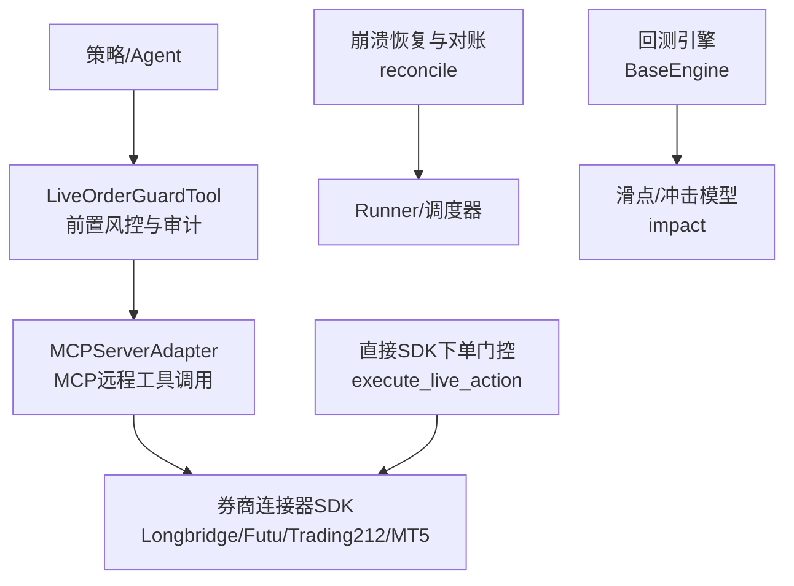
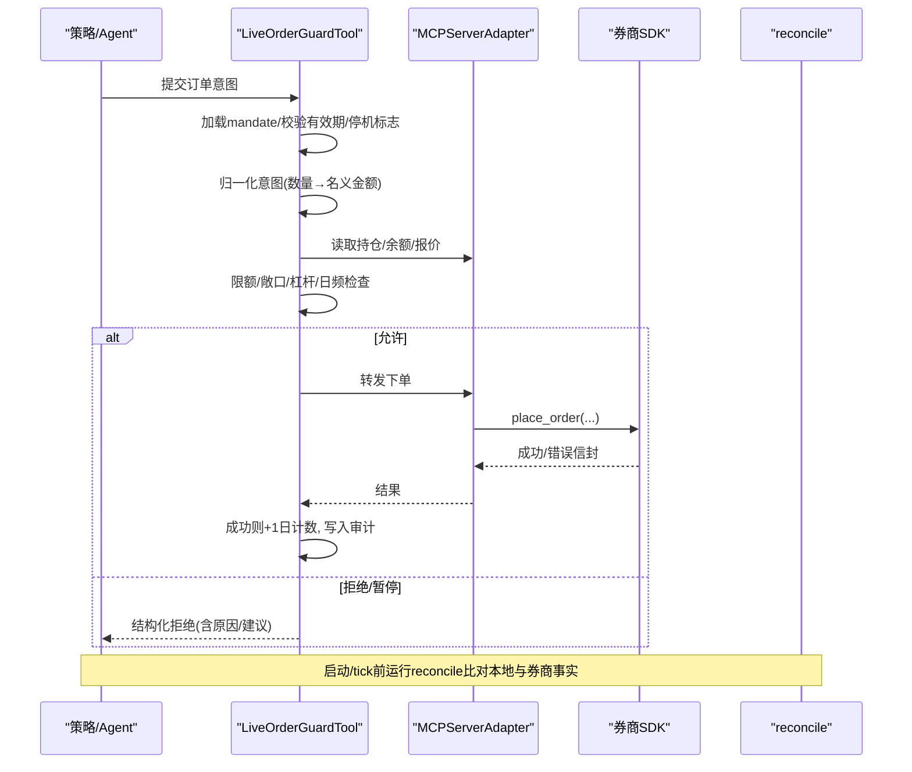
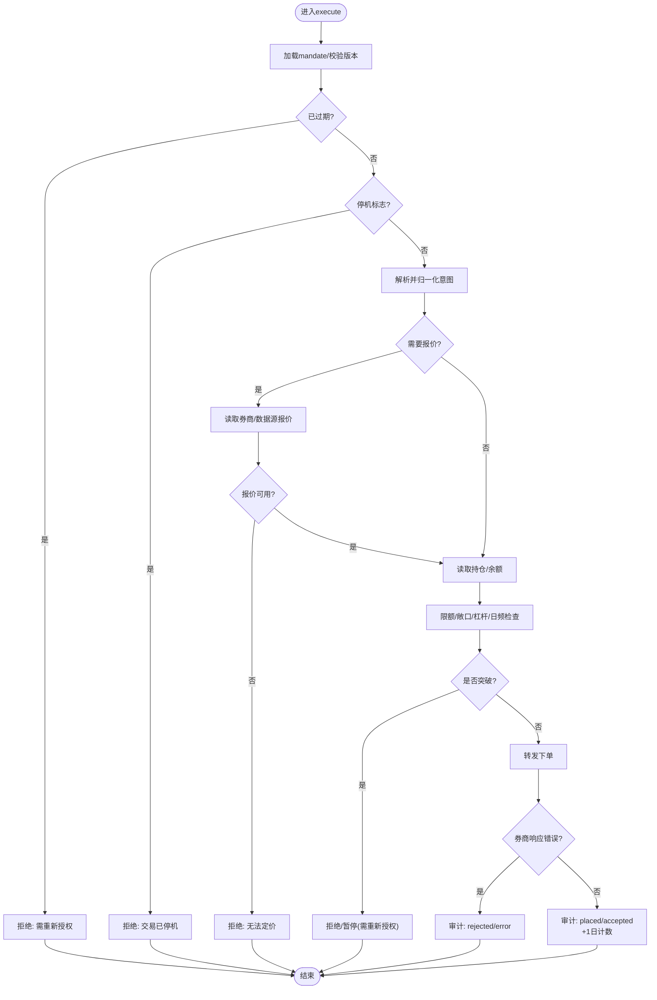
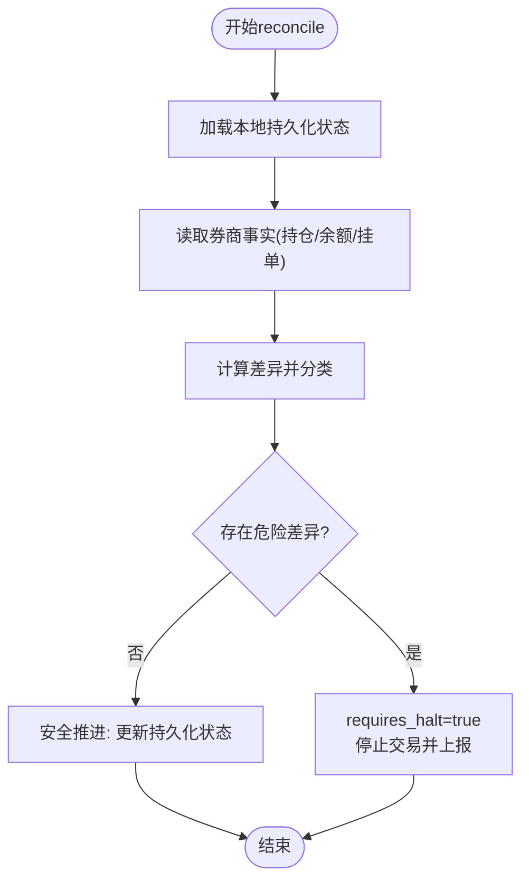
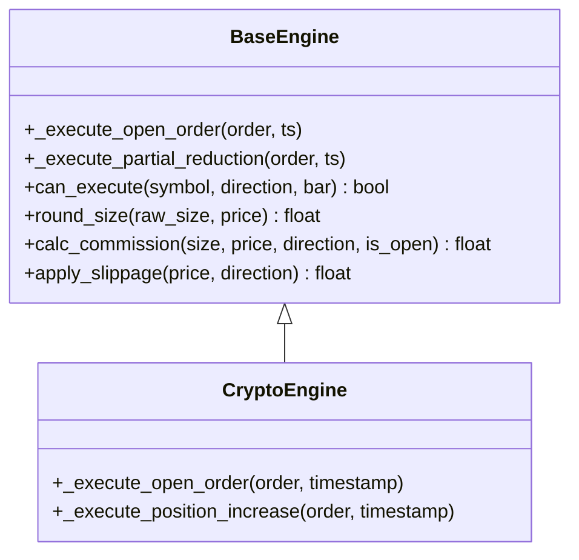
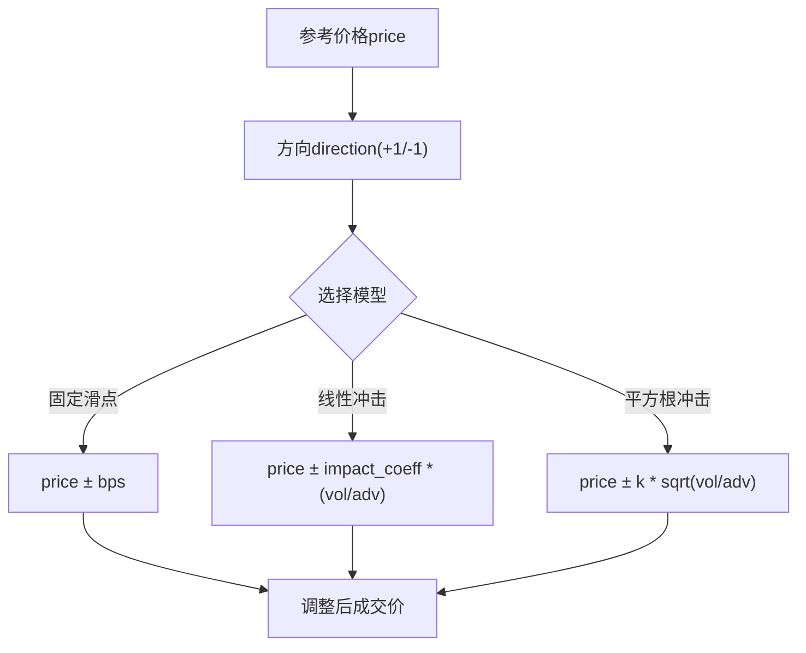
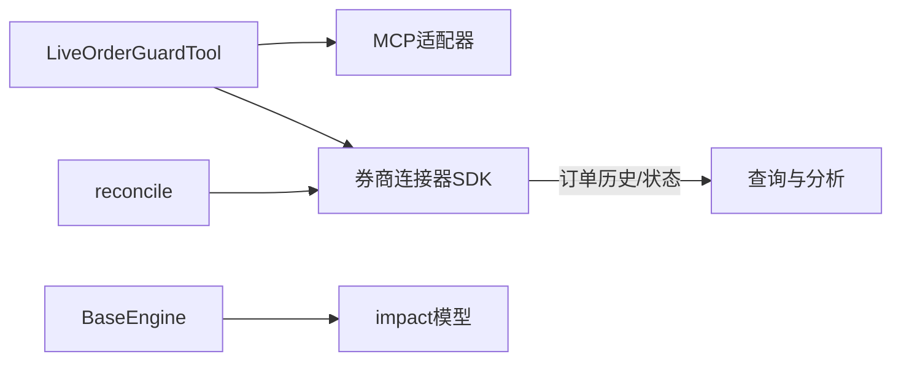

# 订单管理系统

<cite>
**本文引用的文件**
- [order_guard.py](file://agent/src/live/order_guard.py)
- [reconcile.py](file://agent/src/live/runtime/reconcile.py)
- [base.py](file://agent/backtest/engines/base.py)
- [impact.py](file://agent/src/quantlib/impact.py)
- [execution-model SKILL.md](file://agent/src/skills/execution-model/SKILL.md)
- [sdk_order_gate.py](file://agent/src/live/sdk_order_gate.py)
- [longbridge sdk.py](file://agent/src/trading/connectors/longbridge/sdk.py)
- [futu sdk.py](file://agent/src/trading/connectors/futu/sdk.py)
- [trading212 sdk.py](file://agent/src/trading/connectors/trading212/sdk.py)
- [mt5 orders.py](file://agent/src/trading/connectors/mt5/orders.py)
- [test_mandate_enforcement.py](file://agent/tests/test_mandate_enforcement.py)
- [test_sdk_order_gate.py](file://agent/tests/test_sdk_order_gate.py)
- [test_daily_count.py](file://agent/tests/test_daily_count.py)
</cite>

## 目录
1. [简介](#简介)
2. [项目结构](#项目结构)
3. [核心组件](#核心组件)
4. [架构总览](#架构总览)
5. [详细组件分析](#详细组件分析)
6. [依赖关系分析](#依赖关系分析)
7. [性能考量](#性能考量)
8. [故障排查指南](#故障排查指南)
9. [结论](#结论)
10. [附录](#附录)

## 简介
本技术文档围绕订单管理系统的完整生命周期与执行链路展开，覆盖订单创建、校验与风控、路由分发、执行引擎、监控跟踪、异常恢复以及查询分析等关键能力。系统采用“前置强校验 + 可审计 + 幂等与防重”的设计原则，确保在真实资金环境下对订单的提交、成交与状态变更具备高可靠性和可追溯性。

## 项目结构
订单相关能力分布在以下模块：
- 实时下单前置门控与合规校验：LiveOrderGuardTool（订单前置拦截、指令归一化、额度与持仓检查、审计）
- 直接SDK下单门控：execute_live_action（非place_order写操作的统一风控封装）
- 崩溃恢复与对账：reconcile（断点恢复、未知成交/悬单识别、安全推进）
- 回测执行引擎：BaseEngine（信号到成交的原子化执行、滑点/手续费/保证金建模）
- 滑点与市场冲击模型：impact（固定滑点、线性/平方根市场冲击、延迟执行）
- 多券商连接器：Longbridge/Futu/Trading212/MT5（订单历史、挂单、成交、状态映射）

图表来源
- [order_guard.py:1-800](file://agent/src/live/order_guard.py#L1-L800)
- [sdk_order_gate.py:138-178](file://agent/src/live/sdk_order_gate.py#L138-L178)
- [reconcile.py:1-200](file://agent/src/live/runtime/reconcile.py#L1-L200)
- [base.py:2034-2073](file://agent/backtest/engines/base.py#L2034-L2073)
- [impact.py:154-191](file://agent/src/quantlib/impact.py#L154-L191)

章节来源
- [order_guard.py:1-800](file://agent/src/live/order_guard.py#L1-L800)
- [reconcile.py:1-200](file://agent/src/live/runtime/reconcile.py#L1-L200)
- [base.py:2034-2073](file://agent/backtest/engines/base.py#L2034-L2073)
- [impact.py:154-191](file://agent/src/quantlib/impact.py#L154-L191)

## 核心组件
- 订单前置门控（LiveOrderGuardTool）
  - 强制加载授权指令（mandate），校验有效期与停机标志
  - 解析并归一化订单意图（数量→名义金额），失败关闭
  - 读取持仓与账户余额，执行限额、敞口、杠杆、日频交易次数等检查
  - 仅当放行且券商返回非错误信封时，才增加当日计数并写入审计事件
  - 支持可选的顾问审查（advisory），不阻断但记录结果
- 直接SDK下单门控（execute_live_action）
  - 对非place_order的写操作进行统一风控包装
  - 风险降低类动作跳过部分检查但仍审计；风险增加类动作走完整流程
  - 使用每日订单锁保证并发安全
- 崩溃恢复与对账（reconcile）
  - 启动或每tick前对比“持久化最后已知状态”与“券商事实”
  - 将差异分类为匹配、未知成交、孤儿挂单、中途订单歧义
  - 出现危险差异时要求暂停并上报，绝不自动重发
- 回测执行引擎（BaseEngine）
  - 按bar驱动执行，原子化提交开仓/减仓，记录成交、费用、保证金与PnL
  - 提供可插拔的滑点、佣金、四舍五入规则
- 滑点与市场冲击（impact）
  - 固定滑点、线性/平方根市场冲击、延迟执行模型
  - 用于回测中更贴近现实的成交成本估算

章节来源
- [order_guard.py:1-800](file://agent/src/live/order_guard.py#L1-L800)
- [sdk_order_gate.py:138-178](file://agent/src/live/sdk_order_gate.py#L138-L178)
- [reconcile.py:1-200](file://agent/src/live/runtime/reconcile.py#L1-L200)
- [base.py:2034-2073](file://agent/backtest/engines/base.py#L2034-L2073)
- [impact.py:154-191](file://agent/src/quantlib/impact.py#L154-L191)

## 架构总览
订单从产生到落地的关键路径如下：
- Agent/策略生成订单意图
- LiveOrderGuardTool进行强校验与审计，必要时拒绝或暂停
- 通过MCP适配器转发至券商连接器SDK完成下单
- 对账模块在重启或每tick前核对券商事实与本地持久化状态，发现歧义即暂停
- 回测引擎在模拟环境中以相同逻辑执行，便于验证策略与执行假设

图表来源
- [order_guard.py:130-214](file://agent/src/live/order_guard.py#L130-L214)
- [order_guard.py:364-432](file://agent/src/live/order_guard.py#L364-L432)
- [reconcile.py:1-200](file://agent/src/live/runtime/reconcile.py#L1-L200)

## 详细组件分析

### 订单前置门控（LiveOrderGuardTool）
- 职责
  - 强制加载授权指令（mandate），校验版本与过期时间
  - 解析订单意图，若包含数量则基于实时报价推导名义金额，取显式名义金额与推导值的较大者，防止绕过限额
  - 读取持仓与账户余额，执行集合/品种、单笔名义金额、总敞口、杠杆、日频交易次数等限制
  - 仅当券商返回非错误信封时才计入当日订单计数，并写入审计事件
  - 支持可选顾问审查（advisory），不影响放行决策
- 关键行为
  - 失败关闭：任何无法获取报价、读取数据或解析失败均拒绝
  - 审计不可阻塞：审计写入失败不会阻止决策
  - 结构化拒绝：返回包含决策、原因、是否需重新授权等信息

图表来源
- [order_guard.py:130-214](file://agent/src/live/order_guard.py#L130-L214)
- [order_guard.py:216-289](file://agent/src/live/order_guard.py#L216-L289)
- [order_guard.py:364-432](file://agent/src/live/order_guard.py#L364-L432)

章节来源
- [order_guard.py:1-800](file://agent/src/live/order_guard.py#L1-L800)
- [test_mandate_enforcement.py:155-185](file://agent/tests/test_mandate_enforcement.py#L155-L185)
- [test_mandate_enforcement.py:501-528](file://agent/tests/test_mandate_enforcement.py#L501-L528)

### 直接SDK下单门控（execute_live_action）
- 适用场景：非place_order的写操作（如取消、修改等）同样需要风控与审计
- 机制要点
  - 风险降低类动作可跳过部分检查但仍审计
  - 风险增加类动作走完整风控流程
  - 使用每日订单锁避免并发重复计数与竞态
  - 失败不消耗日计数，成功才写入审计并计数

章节来源
- [sdk_order_gate.py:138-178](file://agent/src/live/sdk_order_gate.py#L138-L178)
- [test_sdk_order_gate.py:288-319](file://agent/tests/test_sdk_order_gate.py#L288-L319)
- [test_daily_count.py:1-55](file://agent/tests/test_daily_count.py#L1-L55)

### 崩溃恢复与对账（reconcile）
- 目标：在进程重启或每个交易tick前，确认“券商事实”与“本地持久化最后已知状态”一致
- 分类与处理
  - matched：无差异，继续
  - unknown_fill：券商显示成交但本地无记录，危险，必须暂停
  - orphan_order：本地记录挂单但券商未显示，需人工核查
  - mid_order_ambiguous：中途订单歧义（提交后崩溃，既非挂单也非成交），禁止自动重发，必须暂停
- 安全推进：仅在完全匹配时更新持久化状态

图表来源
- [reconcile.py:1-200](file://agent/src/live/runtime/reconcile.py#L1-L200)
- [reconcile.py:346-377](file://agent/src/live/runtime/reconcile.py#L346-L377)

章节来源
- [reconcile.py:1-200](file://agent/src/live/runtime/reconcile.py#L1-L200)
- [reconcile.py:346-377](file://agent/src/live/runtime/reconcile.py#L346-L377)

### 回测执行引擎（BaseEngine）
- 执行循环
  - 按bar驱动，先计算目标权重，再原子化提交开仓/减仓
  - 开仓：扣减资金、建立仓位、记录成交与费用、触发后续指标
  - 减仓：释放保证金、实现盈亏、更新仓位与资金
- 可扩展点
  - can_execute：控制是否允许执行
  - round_size：按最小交易单位四舍五入
  - calc_commission：计算佣金
  - apply_slippage：应用滑点

图表来源
- [base.py:2034-2073](file://agent/backtest/engines/base.py#L2034-L2073)
- [base.py:1967-2002](file://agent/backtest/engines/base.py#L1967-L2002)

章节来源
- [base.py:1967-2002](file://agent/backtest/engines/base.py#L1967-L2002)
- [base.py:2034-2073](file://agent/backtest/engines/base.py#L2034-L2073)

### 滑点与市场冲击模型（impact）
- 固定滑点：按基点（bps）对买入/卖出价格施加对称偏移
- 线性市场冲击：冲击与成交量占平均日量（ADV）的比例成正比
- 平方根市场冲击：适用于大单，边际冲击递减
- 延迟执行：模拟信号到成交的时间差，避免未来函数

图表来源
- [impact.py:154-191](file://agent/src/quantlib/impact.py#L154-L191)
- [execution-model SKILL.md:1-45](file://agent/src/skills/execution-model/SKILL.md#L1-L45)

章节来源
- [impact.py:154-191](file://agent/src/quantlib/impact.py#L154-L191)
- [execution-model SKILL.md:1-45](file://agent/src/skills/execution-model/SKILL.md#L1-L45)

### 订单路由与分发机制
- 路由入口
  - MCP远程工具：LiveOrderGuardTool作为所有写操作的统一前置门控
  - 直接SDK：execute_live_action对非place_order写操作进行统一风控
- 负载均衡与故障转移
  - 通过MCP适配器与连接器抽象，可在不同券商间切换读/写工具
  - 报价读取优先使用券商自有工具，失败时回退到数据源，提升可用性
- 幂等与防重
  - 每日订单锁保证并发安全
  - 对账模块避免重复下单与重复成交

章节来源
- [order_guard.py:263-317](file://agent/src/live/order_guard.py#L263-L317)
- [sdk_order_gate.py:138-178](file://agent/src/live/sdk_order_gate.py#L138-L178)
- [test_daily_count.py:1-55](file://agent/tests/test_daily_count.py#L1-L55)
- [reconcile.py:1-200](file://agent/src/live/runtime/reconcile.py#L1-L200)

### 订单监控与跟踪
- 实时状态更新
  - 前置门控在放行/拒绝时写入审计事件，供上层SSE广播
- 成交回报处理
  - 对账模块在每tick前拉取券商事实，识别未知成交与歧义
- 异常订单识别
  - 结构化拒绝包含原因、是否需重新授权、违反的限制项与建议行动

章节来源
- [order_guard.py:364-432](file://agent/src/live/order_guard.py#L364-L432)
- [reconcile.py:1-200](file://agent/src/live/runtime/reconcile.py#L1-L200)

### 订单校验与风控检查
- 资金检查：基于账户余额与杠杆上限评估
- 持仓限制：集合/品种白名单、最大敞口、单日交易次数
- 合规审查：mandate版本与有效期、停机标志、可选顾问审查

章节来源
- [order_guard.py:130-214](file://agent/src/live/order_guard.py#L130-L214)
- [test_mandate_enforcement.py:155-185](file://agent/tests/test_mandate_enforcement.py#L155-L185)

### 订单执行引擎（算法交易、拆单策略、滑点控制）
- 算法交易
  - 回测引擎支持按bar驱动的原子化执行，便于接入TWAP/VWAP等策略
- 拆单策略
  - 可通过外部策略将大单拆分为多笔小单，由引擎逐笔执行
- 滑点控制
  - 使用impact模块的固定滑点/线性/平方根模型，结合延迟执行模拟真实成交

章节来源
- [base.py:2034-2073](file://agent/backtest/engines/base.py#L2034-L2073)
- [impact.py:154-191](file://agent/src/quantlib/impact.py#L154-L191)
- [execution-model SKILL.md:1-45](file://agent/src/skills/execution-model/SKILL.md#L1-L45)

### 订单查询与分析功能
- 历史订单检索
  - 各连接器提供订单历史接口（如Trading212的get_order_history）
- 成交统计
  - 回测引擎记录成交、费用、保证金与PnL，可用于事后分析
- 性能分析
  - 通过回测指标与执行日志评估策略与执行质量

章节来源
- [trading212 sdk.py:264-302](file://agent/src/trading/connectors/trading212/sdk.py#L264-L302)
- [base.py:2034-2073](file://agent/backtest/engines/base.py#L2034-L2073)

### 订单异常处理和恢复机制
- 前置门控失败关闭：报价/读取失败直接拒绝
- 对账发现危险差异：暂停交易并上报，禁止自动重发
- 每日订单锁：避免并发导致的重复计数与竞态

章节来源
- [order_guard.py:263-317](file://agent/src/live/order_guard.py#L263-L317)
- [reconcile.py:1-200](file://agent/src/live/runtime/reconcile.py#L1-L200)
- [test_daily_count.py:1-55](file://agent/tests/test_daily_count.py#L1-L55)

## 依赖关系分析
- 组件耦合
  - LiveOrderGuardTool依赖mandate存储、halt标志、每日订单锁、MCP适配器与券商连接器
  - reconcile依赖持久化状态与券商只读工具，不触碰写操作
  - BaseEngine依赖滑点/冲击模型与连接器抽象
- 外部依赖
  - 各券商SDK提供订单历史、挂单、成交与状态映射
  - 数据源用于报价与行情

图表来源
- [order_guard.py:1-800](file://agent/src/live/order_guard.py#L1-L800)
- [reconcile.py:1-200](file://agent/src/live/runtime/reconcile.py#L1-L200)
- [base.py:2034-2073](file://agent/backtest/engines/base.py#L2034-L2073)
- [impact.py:154-191](file://agent/src/quantlib/impact.py#L154-L191)

章节来源
- [order_guard.py:1-800](file://agent/src/live/order_guard.py#L1-L800)
- [reconcile.py:1-200](file://agent/src/live/runtime/reconcile.py#L1-L200)
- [base.py:2034-2073](file://agent/backtest/engines/base.py#L2034-L2073)
- [impact.py:154-191](file://agent/src/quantlib/impact.py#L154-L191)

## 性能考量
- 报价读取优先使用券商工具，失败回退数据源，减少网络开销与失败率
- 每日订单锁跨进程生效，避免并发重复计数
- 对账仅在必要时机运行，并在安全时原子更新持久化状态
- 回测引擎使用向量化与缓存优化，减少bar级计算开销

[本节为通用指导，无需特定文件引用]

## 故障排查指南
- 常见拒绝原因
  - mandate缺失或过期：需重新授权
  - 停机标志置位：需解除停机
  - 无法获取报价：检查数据源与券商报价工具
  - 突破限额/敞口/杠杆/日频：调整策略或放宽授权
- 对账异常
  - 未知成交/中途订单歧义：立即暂停，人工核查券商端状态
- 并发问题
  - 每日订单锁不可用：检查运行时目录权限与锁文件

章节来源
- [order_guard.py:130-214](file://agent/src/live/order_guard.py#L130-L214)
- [reconcile.py:1-200](file://agent/src/live/runtime/reconcile.py#L1-L200)
- [test_daily_count.py:1-55](file://agent/tests/test_daily_count.py#L1-L55)

## 结论
本订单管理系统以强前置风控、可审计、幂等与防重为核心设计，结合崩溃恢复与对账机制，确保在真实资金环境下的订单全生命周期可控、可追溯、可恢复。回测引擎与滑点模型为策略验证与执行优化提供了坚实基础，多券商连接器实现了灵活的路由与扩展。

[本节为总结性内容，无需特定文件引用]

## 附录
- 多券商连接器示例
  - Longbridge：获取今日挂单与成交
  - Futu：下单参数映射与错误处理
  - Trading212：订单历史分页查询
  - MT5：挂单类型与填充模式协商

章节来源
- [longbridge sdk.py:384-409](file://agent/src/trading/connectors/longbridge/sdk.py#L384-L409)
- [futu sdk.py:840-867](file://agent/src/trading/connectors/futu/sdk.py#L840-L867)
- [trading212 sdk.py:264-302](file://agent/src/trading/connectors/trading212/sdk.py#L264-L302)
- [mt5 orders.py:311-336](file://agent/src/trading/connectors/mt5/orders.py#L311-L336)