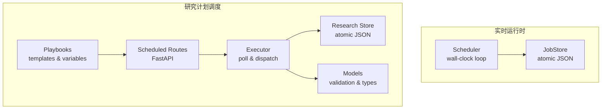
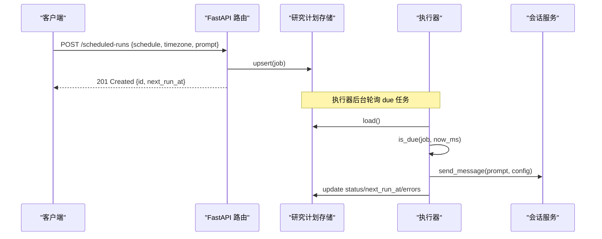
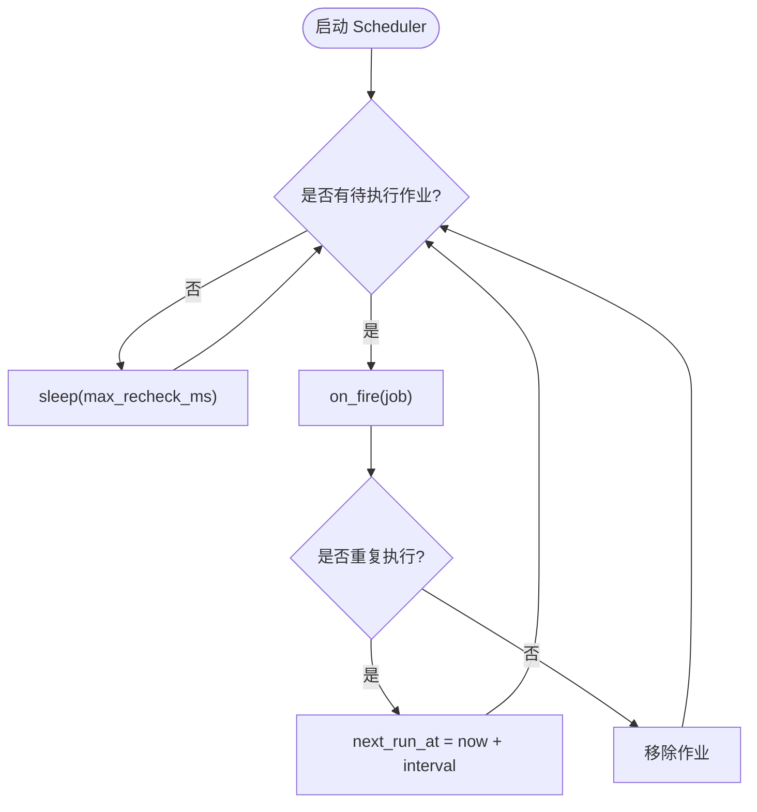
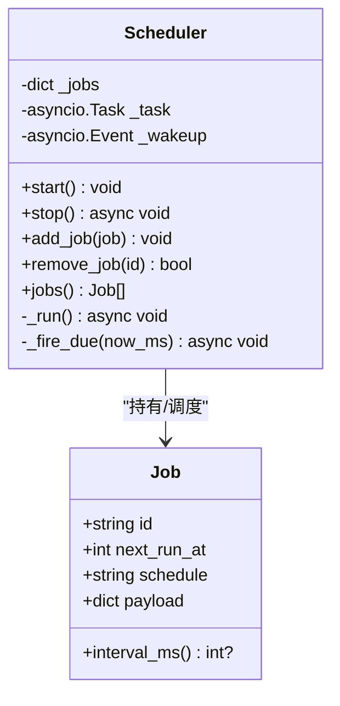
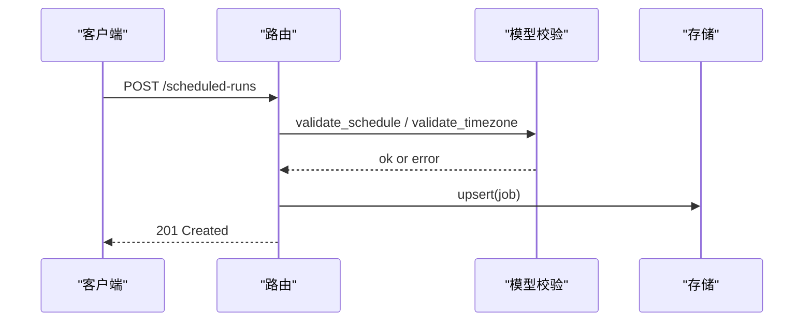
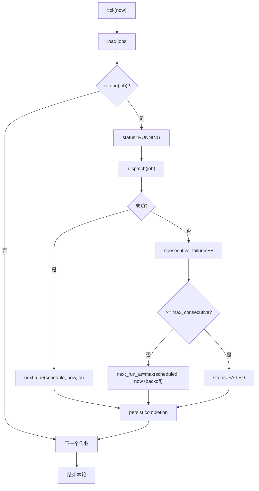
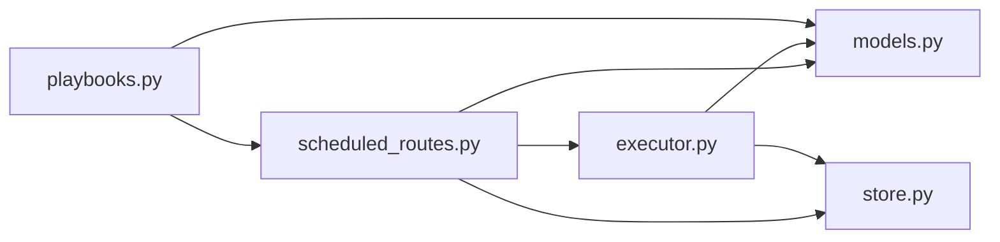

# 任务调度系统

<cite>
**本文引用的文件**
- [scheduler.py](file://agent/src/live/runtime/scheduler.py)
- [jobstore.py](file://agent/src/live/runtime/jobstore.py)
- [scheduled_routes.py](file://agent/src/api/scheduled_routes.py)
- [executor.py](file://agent/src/scheduled_research/executor.py)
- [models.py](file://agent/src/scheduled_research/models.py)
- [store.py](file://agent/src/scheduled_research/store.py)
- [playbooks.py](file://agent/src/scheduled_research/playbooks.py)
</cite>

## 目录
1. [简介](#简介)
2. [项目结构](#项目结构)
3. [核心组件](#核心组件)
4. [架构总览](#架构总览)
5. [详细组件分析](#详细组件分析)
6. [依赖关系分析](#依赖关系分析)
7. [性能与优化](#性能与优化)
8. [故障排查指南](#故障排查指南)
9. [结论](#结论)
10. [附录：配置与扩展点](#附录配置与扩展点)

## 简介
本技术文档面向“任务调度系统”，聚焦以下能力：
- 定时任务调度：支持 cron 表达式、时间窗口管理、时区处理（IANA 时区）
- 事件驱动调度：基于轮询的事件触发、异步执行、失败重试与退避
- 工作流编排：任务依赖、并行执行、失败重试等机制说明
- 配置与扩展：调度器开关、重试策略、存储路径、Playbook 模板等
- 示例：通过 API 定义并运行不同类型的调度任务
- 监控告警与性能优化建议

该系统由两部分组成：
- 实时运行时调度器：用于交易/市场相关任务的毫秒级墙钟调度
- 研究计划调度器：持久化的研究/回测任务，支持 cron 表达式与时区

## 项目结构
调度相关代码主要分布在以下模块：
- 实时运行时调度器与持久化
  - 调度循环：agent/src/live/runtime/scheduler.py
  - 持久化存储：agent/src/live/runtime/jobstore.py
- 研究计划调度器（API + 执行器 + 模型 + 存储 + Playbook）
  - HTTP 路由：agent/src/api/scheduled_routes.py
  - 执行器：agent/src/scheduled_research/executor.py
  - 数据模型与校验：agent/src/scheduled_research/models.py
  - 持久化存储：agent/src/scheduled_research/store.py
  - 模板与变量渲染：agent/src/scheduled_research/playbooks.py

图表来源
- [scheduler.py:178-329](file://agent/src/live/runtime/scheduler.py#L178-L329)
- [jobstore.py:76-133](file://agent/src/live/runtime/jobstore.py#L76-L133)
- [scheduled_routes.py:233-482](file://agent/src/api/scheduled_routes.py#L233-L482)
- [executor.py:160-452](file://agent/src/scheduled_research/executor.py#L160-L452)
- [models.py:197-328](file://agent/src/scheduled_research/models.py#L197-L328)
- [store.py:59-216](file://agent/src/scheduled_research/store.py#L59-L216)
- [playbooks.py:79-211](file://agent/src/scheduled_research/playbooks.py#L79-L211)

章节来源
- [scheduler.py:1-329](file://agent/src/live/runtime/scheduler.py#L1-L329)
- [jobstore.py:1-133](file://agent/src/live/runtime/jobstore.py#L1-L133)
- [scheduled_routes.py:1-482](file://agent/src/api/scheduled_routes.py#L1-L482)
- [executor.py:1-452](file://agent/src/scheduled_research/executor.py#L1-L452)
- [models.py:1-328](file://agent/src/scheduled_research/models.py#L1-L328)
- [store.py:1-273](file://agent/src/scheduled_research/store.py#L1-L273)
- [playbooks.py:1-419](file://agent/src/scheduled_research/playbooks.py#L1-L419)

## 核心组件
- 实时运行时调度器（Scheduler）
  - 职责：维护内存中的 Job 集合，按 next_run_at 计算睡眠时长，到点触发 on_fire 回调；支持最大重检间隔防止时钟漂移或挂起恢复导致的漏检
  - 关键类型：Job（id, next_run_at, schedule, payload），interval_ms() 解析 interval:<ms> 或 once
  - 关键函数：earliest_next_run、due_jobs、compute_sleep_ms、advance_after_fire
- 实时运行时持久化（JobStore）
  - 职责：原子写入 JSON 文件（临时文件 -> fsync -> os.replace -> fsync 父目录），崩溃安全；损坏文件隔离
- 研究计划调度器（HTTP 路由）
  - 职责：创建/删除/列出调度任务；从 Playbook 生成任务；校验 schedule/timezone；将任务投递给会话服务执行
- 研究计划执行器（Executor）
  - 职责：周期性轮询 store，判断 due，标记 RUNNING，调用 dispatch，更新 next_run_at，记录状态与错误；支持连续失败阈值与指数退避重试
  - 关键算法：next_due（interval-ms 或 5 字段 cron）、DST 处理（跳过不存在时刻，折叠取第一次）
- 数据模型与校验（Models）
  - 职责：定义 ScheduledResearchJob、JobStatus；校验 schedule（interval-ms 或 5 字段 cron）与 timezone（IANA key）
- 研究计划存储（Store）
  - 职责：原子持久化 job 字典；加载/保存/upsert/get/list/delete；损坏隔离
- Playbook 模板（Playbooks）
  - 职责：加载 markdown + YAML frontmatter 模板；变量替换；根据 suggested_schedule/suggested_timezone 生成 ScheduledResearchJob

章节来源
- [scheduler.py:51-176](file://agent/src/live/runtime/scheduler.py#L51-L176)
- [jobstore.py:76-133](file://agent/src/live/runtime/jobstore.py#L76-L133)
- [scheduled_routes.py:117-482](file://agent/src/api/scheduled_routes.py#L117-L482)
- [executor.py:64-158](file://agent/src/scheduled_research/executor.py#L64-L158)
- [models.py:23-176](file://agent/src/scheduled_research/models.py#L23-L176)
- [store.py:59-216](file://agent/src/scheduled_research/store.py#L59-L216)
- [playbooks.py:79-211](file://agent/src/scheduled_research/playbooks.py#L79-L211)

## 架构总览
下图展示了从 API 创建任务到执行器调度执行的完整流程，以及实时运行时调度器的独立循环。

图表来源
- [scheduled_routes.py:259-335](file://agent/src/api/scheduled_routes.py#L259-L335)
- [store.py:138-166](file://agent/src/scheduled_research/store.py#L138-L166)
- [executor.py:266-415](file://agent/src/scheduled_research/executor.py#L266-L415)

图表来源
- [scheduler.py:178-329](file://agent/src/live/runtime/scheduler.py#L178-L329)

## 详细组件分析

### 实时运行时调度器（Scheduler）
- 设计要点
  - 使用 asyncio 事件循环，sleep 直到最早 next_run_at，或使用 Event 提前唤醒
  - 支持 interval:<ms> 和 once 两种 schedule；未知 spec 默认按 DEFAULT_INTERVAL_MS 轮询
  - 所有时间决策以 epoch-ms 为单位，now_fn 注入以便测试
  - 异常隔离：on_fire 抛错仅记录日志，不影响其他作业
- 复杂度
  - due_jobs: O(n log n) 排序；earliest_next_run: O(n)
  - compute_sleep_ms: O(1)
- 错误处理
  - on_fire 异常捕获并记录；one-shot 作业完成后自动移除

图表来源
- [scheduler.py:51-176](file://agent/src/live/runtime/scheduler.py#L51-L176)
- [scheduler.py:178-329](file://agent/src/live/runtime/scheduler.py#L178-L329)

章节来源
- [scheduler.py:1-329](file://agent/src/live/runtime/scheduler.py#L1-L329)

### 实时运行时持久化（JobStore）
- 原子写入：临时文件 -> fsync -> os.replace -> fsync 父目录
- 损坏隔离：load 失败时隔离 corrupt 文件并抛出专用异常
- 权限：文件权限 0o600（POSIX）

章节来源
- [jobstore.py:1-133](file://agent/src/live/runtime/jobstore.py#L1-L133)

### 研究计划调度器（HTTP 路由）
- 功能
  - 创建/删除/列出任务；从 Playbook 创建任务
  - 校验 schedule（interval-ms 或 5 字段 cron）与 timezone（IANA key）
  - 对 cron 且带 timezone 的任务，首次触发时间为首个符合的本地时刻
- 安全
  - job_id 白名单校验，避免非法字符
  - 所有路由受认证保护

图表来源
- [scheduled_routes.py:259-335](file://agent/src/api/scheduled_routes.py#L259-L335)
- [models.py:115-176](file://agent/src/scheduled_research/models.py#L115-L176)

章节来源
- [scheduled_routes.py:1-482](file://agent/src/api/scheduled_routes.py#L1-L482)
- [models.py:1-328](file://agent/src/scheduled_research/models.py#L1-L328)

### 研究计划执行器（Executor）
- 调度逻辑
  - 周期 tick：加载 store，筛选 due 作业，按 next_run_at 升序执行
  - 状态机：PENDING -> RUNNING -> COMPLETED/FAILED；CANCELLED 为终态
  - 失败重试：连续失败计数，指数退避（base_delay * 2^k，上限 max_delay）
  - 恢复：启动时回收残留 RUNNING 作业为 PENDING
- Cron 计算
  - 支持 5 字段 cron：minute hour day-of-month month day-of-week
  - DST 策略：不存在时刻跳过，折叠时刻取第一次
  - 搜索窗口：最多扫描约 6*366+1 天，覆盖闰年与多次折叠场景
- 错误处理
  - 调度推进失败：标记 FAILED，failure_kind=schedule
  - 分发失败：记录 last_error（脱敏），consecutive_failures++，必要时置 FAILED

图表来源
- [executor.py:160-452](file://agent/src/scheduled_research/executor.py#L160-L452)
- [executor.py:123-193](file://agent/src/scheduled_research/executor.py#L123-L193)

章节来源
- [executor.py:1-452](file://agent/src/scheduled_research/executor.py#L1-L452)

### 数据模型与校验（Models）
- 支持 schedule 格式
  - interval-ms：正整数字符串
  - 5 字段 cron：支持 *、*/n、逗号分隔、范围 low-high
- 时区校验
  - shape 校验：非空字符串或 None
  - 解析校验：必须可被 ZoneInfo 解析
- 数据结构
  - ScheduledResearchJob：包含 id、prompt、schedule、next_run_at、status、created_at、last_run_at、consecutive_failures、last_error、failure_kind、config、timezone

章节来源
- [models.py:23-176](file://agent/src/scheduled_research/models.py#L23-L176)
- [models.py:197-328](file://agent/src/scheduled_research/models.py#L197-L328)

### 研究计划存储（Store）
- 原子写入与损坏隔离
- 提供 upsert/get/list/delete/load/save
- 路径：默认位于运行时根目录下的 scheduled_research 子目录

章节来源
- [store.py:1-273](file://agent/src/scheduled_research/store.py#L1-L273)

### Playbook 模板（Playbooks）
- 模板文件：markdown + YAML frontmatter
- 变量：{{name}} 占位符，支持默认值与覆盖
- 生成任务：to_job 会校验 schedule/timezone，并按规则计算首次触发时间

章节来源
- [playbooks.py:1-419](file://agent/src/scheduled_research/playbooks.py#L1-L419)

## 依赖关系分析
- 耦合关系
  - 路由层依赖模型校验与存储，并通过执行器进行调度
  - 执行器依赖存储与模型，负责状态推进与重试
  - 实时运行时调度器与存储解耦，仅通过 Job 抽象交互
- 外部依赖
  - zoneinfo.ZoneInfo 用于 IANA 时区解析
  - FastAPI 路由与 Pydantic 模型用于输入校验
- 潜在循环依赖
  - playbooks.to_job 延迟导入 executor.next_due，避免冷启动开销

图表来源
- [scheduled_routes.py:233-482](file://agent/src/api/scheduled_routes.py#L233-L482)
- [executor.py:160-452](file://agent/src/scheduled_research/executor.py#L160-L452)
- [playbooks.py:79-211](file://agent/src/scheduled_research/playbooks.py#L79-L211)

章节来源
- [scheduled_routes.py:1-482](file://agent/src/api/scheduled_routes.py#L1-L482)
- [executor.py:1-452](file://agent/src/scheduled_research/executor.py#L1-L452)
- [playbooks.py:1-419](file://agent/src/scheduled_research/playbooks.py#L1-L419)

## 性能与优化
- 调度器
  - 最大重检间隔（默认 5 分钟）防止远未来作业导致长时间不检查
  - 使用 Event 实现可中断 sleep，新增/删除作业立即生效
- 执行器
  - 轮询间隔默认 60 秒，可通过 tick_interval_ms 调整
  - 指数退避限制最大延迟，避免风暴式重试
  - 错误信息脱敏与长度截断，减少存储体积
- 存储
  - 原子写入保证崩溃一致性，避免部分写
  - 损坏文件隔离，保障主流程可用
- 建议
  - 合理设置 cron 表达式与 timezone，避免过多匹配导致计算开销
  - 控制 Playbook 变量长度，避免提示词膨胀
  - 监控执行器 tick 耗时与失败率，必要时调大轮询间隔或增加并发（当前为串行逐作业）

[本节为通用性能讨论，无需特定文件引用]

## 故障排查指南
- 常见问题
  - 任务未触发：检查 schedule 是否合法、timezone 是否可解析、next_run_at 是否已到期
  - 频繁失败：查看 consecutive_failures 与 last_error，确认后端服务可用性
  - 存储损坏：出现 CorruptStoreError 或 CorruptJobStoreError，检查隔离后的 .corrupt-* 文件
- 定位步骤
  - 通过 GET /scheduled-runs 查看任务列表与状态
  - 检查执行器日志中关于 schedule advancement 与 dispatch 的错误
  - 验证 cron 表达式在目标时区的首次触发时间是否符合预期
- 恢复措施
  - 修正 schedule/timezone 后重新 upsert
  - 删除失败任务后重建
  - 若存储损坏，清理隔离文件并重启

章节来源
- [executor.py:340-415](file://agent/src/scheduled_research/executor.py#L340-L415)
- [store.py:41-57](file://agent/src/scheduled_research/store.py#L41-L57)
- [jobstore.py:1-133](file://agent/src/live/runtime/jobstore.py#L1-L133)

## 结论
该任务调度系统提供了：
- 可靠的实时运行时调度与持久化
- 灵活的研究计划调度，支持 cron 与时区
- 健壮的执行器：状态机、重试退避、错误脱敏、崩溃恢复
- 可扩展的 Playbook 模板体系
结合合理的配置与监控，可在生产环境中稳定运行复杂的多任务调度场景。

[本节为总结性内容，无需特定文件引用]

## 附录：配置与扩展点
- 调度器开关
  - 环境变量：VIBE_TRADING_ENABLE_SCHEDULER（布尔值）
  - 配置项：agent_tuning.vibe_trading_enable_scheduler
- 重试策略
  - 最大连续失败次数：vibe_trading_scheduler_max_consecutive_failures
  - 重试基础延迟：vibe_trading_scheduler_retry_base_delay_ms
  - 重试最大延迟：vibe_trading_scheduler_retry_max_delay_ms
- 存储路径
  - 研究计划存储：运行时根目录下的 scheduled_research/scheduled_research_jobs.json
  - 实时运行时存储：live_root()/runtime/jobs.json
- Playbook 目录
  - 环境变量：VIBE_TRADING_PLAYBOOK_DIR（用户目录优先于内置目录）
- 扩展点
  - 自定义 dispatch：在路由层替换 _dispatch_scheduled_research_job 的实现
  - 自定义 now_fn：在 Scheduler/Executor 构造时注入时间源，便于测试与模拟
  - 自定义存储：替换 ScheduledResearchJobStore/JobStore 实现，保持接口一致

章节来源
- [scheduled_routes.py:31-50](file://agent/src/api/scheduled_routes.py#L31-L50)
- [executor.py:32-62](file://agent/src/scheduled_research/executor.py#L32-L62)
- [store.py:30-39](file://agent/src/scheduled_research/store.py#L30-L39)
- [jobstore.py:66-74](file://agent/src/live/runtime/jobstore.py#L66-L74)
- [playbooks.py:20-28](file://agent/src/scheduled_research/playbooks.py#L20-L28)