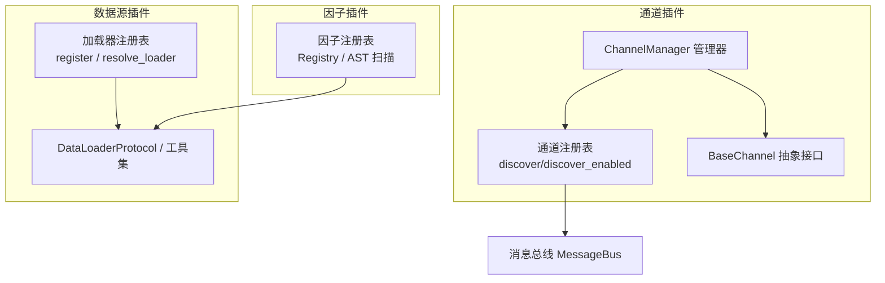
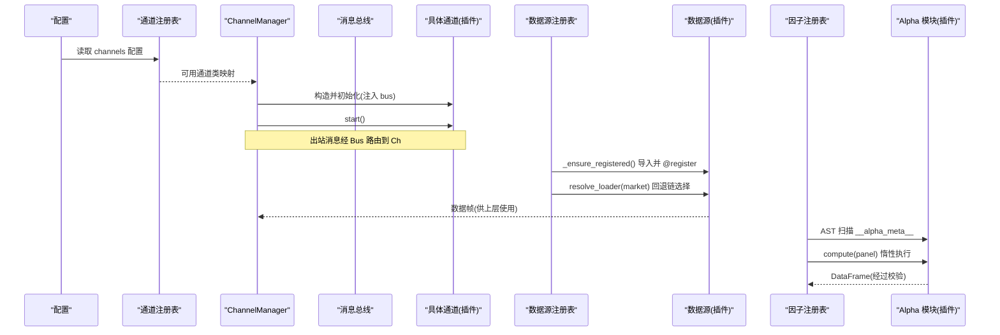
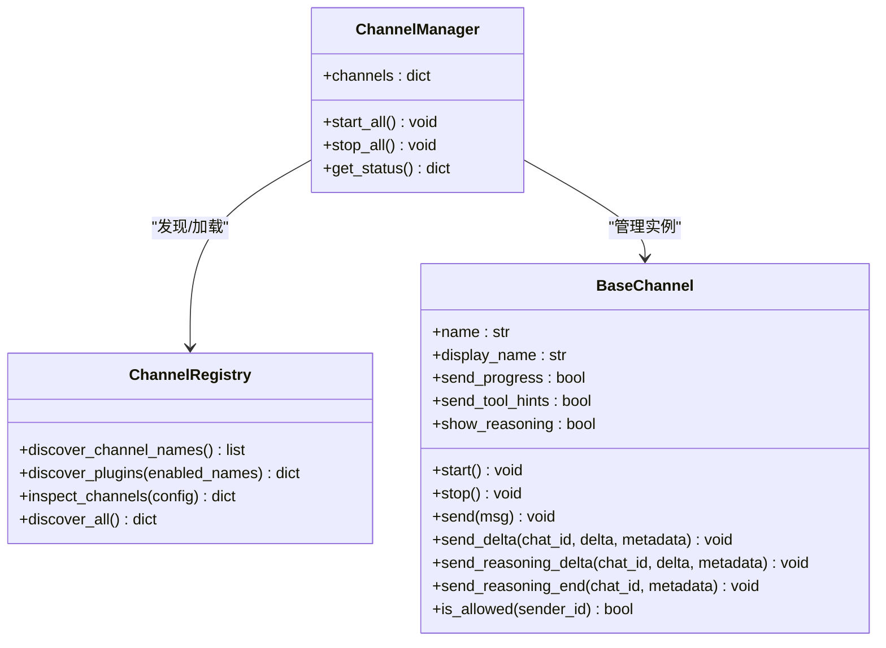
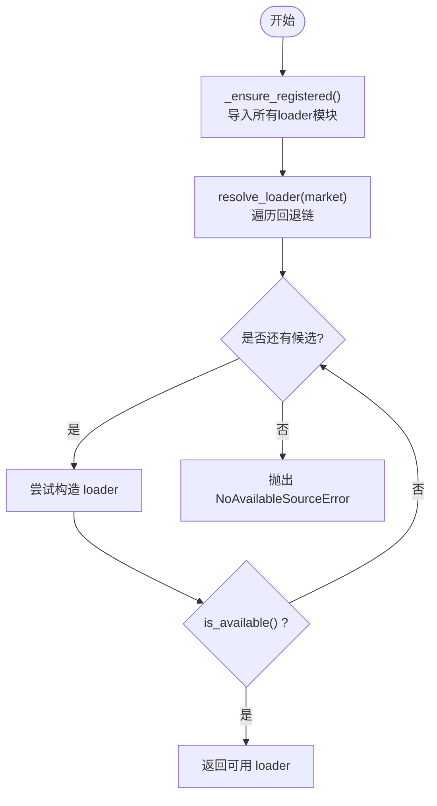
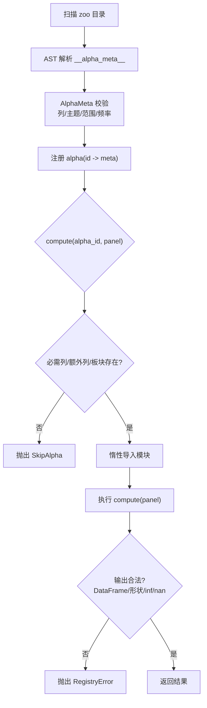
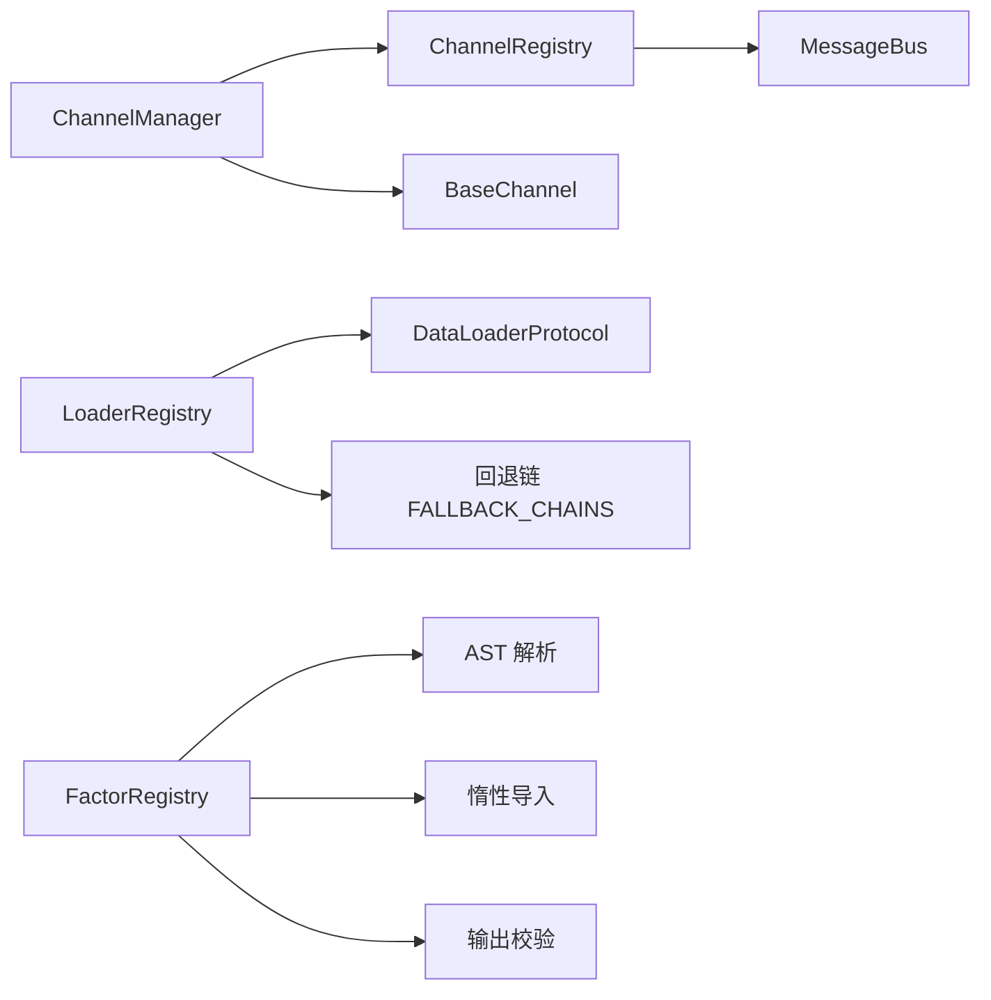

# 插件系统

<cite>
**本文引用的文件**
- [agent/src/channels/registry.py](file://agent/src/channels/registry.py)
- [agent/src/channels/manager.py](file://agent/src/channels/manager.py)
- [agent/src/channels/base.py](file://agent/src/channels/base.py)
- [agent/backtest/loaders/registry.py](file://agent/backtest/loaders/registry.py)
- [agent/backtest/loaders/base.py](file://agent/backtest/loaders/base.py)
- [agent/src/factors/registry.py](file://agent/src/factors/registry.py)
- [agent/src/core/runner.py](file://agent/src/core/runner.py)
</cite>

## 目录
1. [简介](#简介)
2. [项目结构](#项目结构)
3. [核心组件](#核心组件)
4. [架构总览](#架构总览)
5. [详细组件分析](#详细组件分析)
6. [依赖关系分析](#依赖关系分析)
7. [性能考量](#性能考量)
8. [故障排查指南](#故障排查指南)
9. [结论](#结论)
10. [附录](#附录)

## 简介
本技术文档系统化阐述该交易系统的“插件体系”，覆盖以下关键主题：
- 插件注册与发现机制：内置模块扫描、外部插件通过入口点（entry_points）动态加载、接口契约与版本约束。
- 生命周期管理：初始化、启动、运行、停止与销毁，含消息总线集成与重试策略。
- 分类与标记：按主题、市场范围、频率等维度对因子进行过滤；通道能力与可用性标记。
- 依赖解析与冲突解决：数据源回退链、同名插件遮蔽规则、不可用时的降级策略。
- 开发指南与最佳实践：如何编写可插拔的数据源、通道适配器与因子模块。
- 安全验证与沙箱：受限执行环境、资源限制、输入校验与输出净化。
- 生态构建与管理：清单导出、健康检查、测试隔离与可观测性。

## 项目结构
围绕插件体系的关键代码分布在三个子系统：
- 通道插件（聊天平台接入）：基于抽象基类实现，统一接入消息总线，支持动态发现与启用。
- 数据源插件（行情/基本面加载器）：通过装饰器自注册到全局注册表，并按市场类型维护回退链。
- 因子插件（Alpha 计算）：AST 静态扫描元数据，惰性导入并执行 compute，提供清单与健康报告。

**图表来源**
- [agent/src/channels/registry.py:87-284](file://agent/src/channels/registry.py#L87-L284)
- [agent/src/channels/manager.py:36-229](file://agent/src/channels/manager.py#L36-L229)
- [agent/backtest/loaders/registry.py:63-196](file://agent/backtest/loaders/registry.py#L63-L196)
- [agent/backtest/loaders/base.py:851-887](file://agent/backtest/loaders/base.py#L851-L887)
- [agent/src/factors/registry.py:201-319](file://agent/src/factors/registry.py#L201-L319)

**章节来源**
- [agent/src/channels/registry.py:87-284](file://agent/src/channels/registry.py#L87-L284)
- [agent/src/channels/manager.py:36-229](file://agent/src/channels/manager.py#L36-L229)
- [agent/backtest/loaders/registry.py:63-196](file://agent/backtest/loaders/registry.py#L63-L196)
- [agent/backtest/loaders/base.py:851-887](file://agent/backtest/loaders/base.py#L851-L887)
- [agent/src/factors/registry.py:201-319](file://agent/src/factors/registry.py#L201-L319)

## 核心组件
- 通道插件接口与发现
  - BaseChannel：定义 start/stop/send/streaming 等生命周期与消息发送接口，内置权限校验与配对码流程。
  - 通道注册表：扫描内置模块与 entry_points 外部插件，返回可用类映射；支持 inspect_channels 暴露配置与启用状态。
  - ChannelManager：编排启用通道的初始化、启动、停止，负责出站消息分发、去重、流式合并与重试。
- 数据源插件
  - DataLoaderProtocol：统一 fetch/is_available 等接口，声明 markets/requires_auth 等元信息。
  - 加载器注册表：@register 装饰器自注册；_ensure_registered 懒加载所有已知模块；resolve_loader/get_loader_cls_with_fallback 按市场回退链选择可用源。
- 因子插件
  - Registry：AST 扫描 zoo 目录，提取 __alpha_meta__ 元数据，惰性导入并执行 compute；提供 list/get/export_manifest/health 等 API。
  - 严格元数据校验：主题、市场范围、频率、必需列、warmup 等；输出形状与数值合法性校验。

**章节来源**
- [agent/src/channels/base.py:22-238](file://agent/src/channels/base.py#L22-L238)
- [agent/src/channels/registry.py:87-284](file://agent/src/channels/registry.py#L87-L284)
- [agent/src/channels/manager.py:36-479](file://agent/src/channels/manager.py#L36-L479)
- [agent/backtest/loaders/base.py:851-887](file://agent/backtest/loaders/base.py#L851-L887)
- [agent/backtest/loaders/registry.py:63-196](file://agent/backtest/loaders/registry.py#L63-L196)
- [agent/src/factors/registry.py:87-184](file://agent/src/factors/registry.py#L87-L184)
- [agent/src/factors/registry.py:201-397](file://agent/src/factors/registry.py#L201-L397)

## 架构总览
下图展示插件从“发现—装载—运行—输出”的端到端流程，以及各子系统间的协作关系。

**图表来源**
- [agent/src/channels/registry.py:193-284](file://agent/src/channels/registry.py#L193-L284)
- [agent/src/channels/manager.py:64-229](file://agent/src/channels/manager.py#L64-L229)
- [agent/backtest/loaders/registry.py:72-196](file://agent/backtest/loaders/registry.py#L72-L196)
- [agent/src/factors/registry.py:219-319](file://agent/src/factors/registry.py#L219-L319)

## 详细组件分析

### 通道插件：注册、发现与生命周期
- 注册与发现
  - 内置通道：通过 pkgutil 扫描 src.channels 包，排除内部模块，得到模块名列表。
  - 外部插件：通过 importlib.metadata.entry_points(group="vibe_trading.channels") 加载，允许在独立包中实现通道。
  - 名称遮蔽：内置通道优先于外部插件同名实现，避免被覆盖。
- 生命周期
  - 初始化：根据配置筛选 enabled 的通道，构造实例并注入 MessageBus。
  - 启动：异步并发启动各通道，记录 running 状态。
  - 停止：取消出站调度任务，逐个 stop，异常隔离。
- 出站消息分发
  - 去重：基于内容指纹与 origin_message_id/message_id 抑制重复。
  - 流式合并：同目标同 stream_id 的连续 _stream_delta 合并为一次发送。
  - 重试：指数退避与最大重试次数，失败日志化。

**图表来源**
- [agent/src/channels/base.py:22-238](file://agent/src/channels/base.py#L22-L238)
- [agent/src/channels/manager.py:36-479](file://agent/src/channels/manager.py#L36-L479)
- [agent/src/channels/registry.py:87-284](file://agent/src/channels/registry.py#L87-L284)

**章节来源**
- [agent/src/channels/registry.py:87-284](file://agent/src/channels/registry.py#L87-L284)
- [agent/src/channels/manager.py:64-479](file://agent/src/channels/manager.py#L64-L479)
- [agent/src/channels/base.py:22-238](file://agent/src/channels/base.py#L22-L238)

### 数据源插件：回退链与可用性
- 自注册机制
  - 每个 loader 模块通过 @register 装饰器将自身加入 LOADER_REGISTRY。
  - _ensure_registered 首次调用时导入所有已知 loader 模块，确保 resolve 时非空。
- 回退链与冲突
  - 按市场类型维护有序回退链（如 a_share、us_equity、crypto 等），优先尝试轻量/低封禁风险源。
  - 显式请求 local/tickerall/qveris 等“本地或强绑定”源时，禁止静默降级到网络源，避免掩盖配置问题。
- 可用性检测
  - 每个 loader 实现 is_available，结合凭据、网络、SDK 可用性判断。
  - 构造期异常被视为不可用，继续尝试下一个候选。

**图表来源**
- [agent/backtest/loaders/registry.py:72-196](file://agent/backtest/loaders/registry.py#L72-L196)

**章节来源**
- [agent/backtest/loaders/registry.py:63-196](file://agent/backtest/loaders/registry.py#L63-L196)
- [agent/backtest/loaders/base.py:851-887](file://agent/backtest/loaders/base.py#L851-L887)

### 因子插件：AST 扫描、元数据与惰性执行
- 元数据模型
  - AlphaMeta：id、theme、universe、frequency、columns_required、decay_horizon、min_warmup_bars 等，严格校验。
  - 列白名单：价格列固定集合，基本面列以 fund: 前缀开放命名空间。
- 扫描与注册
  - 递归扫描 zoo 子目录，跳过下划线前缀与缓存目录。
  - 仅 AST 解析 __alpha_meta__，不导入模块，避免副作用与依赖开销。
- 惰性计算与校验
  - compute 时按需导入模块，执行 compute(panel)，校验输出为 DataFrame、形状一致、无 inf、NaN 比例可控。
  - 缺失必需列/板块标签时抛出 SkipAlpha，便于上层优雅跳过。

**图表来源**
- [agent/src/factors/registry.py:147-184](file://agent/src/factors/registry.py#L147-L184)
- [agent/src/factors/registry.py:219-397](file://agent/src/factors/registry.py#L219-L397)

**章节来源**
- [agent/src/factors/registry.py:87-184](file://agent/src/factors/registry.py#L87-L184)
- [agent/src/factors/registry.py:219-397](file://agent/src/factors/registry.py#L219-L397)

### 分类与标记系统
- 因子分类
  - theme：动量、反转、成交量、波动率、质量、价值、流动性、微观结构、情绪、成长、杠杆等。
  - universe：美股、A股、港股、印度、韩国、加密货币、期货等。
  - frequency：多频支持，用于匹配面板数据频率。
- 通道能力标记
  - display_name、available、configured、enabled、loaded、running 等状态字段，便于 UI 与运维观察。
  - 可选依赖标志位与安装提示，帮助定位缺失 SDK。

**章节来源**
- [agent/src/factors/registry.py:48-67](file://agent/src/factors/registry.py#L48-L67)
- [agent/src/channels/registry.py:66-160](file://agent/src/channels/registry.py#L66-L160)

### 依赖解析与冲突解决
- 通道插件
  - 内置优先：外部插件同名无法遮蔽内置通道。
  - 可选依赖：通过环境变量/包存在性检测，给出安装提示。
- 数据源插件
  - 回退链：按市场类型顺序尝试，捕获构造异常与不可用，继续下一个。
  - 显式源保护：local/tickerall/qveris 不允许静默降级到网络源。
- 因子插件
  - 依赖面板列与板块标签，缺失则跳过，不影响整体批处理。

**章节来源**
- [agent/src/channels/registry.py:223-284](file://agent/src/channels/registry.py#L223-L284)
- [agent/backtest/loaders/registry.py:119-196](file://agent/backtest/loaders/registry.py#L119-L196)
- [agent/src/factors/registry.py:321-355](file://agent/src/factors/registry.py#L321-L355)

### 插件开发指南与最佳实践
- 通道插件
  - 继承 BaseChannel，实现 start/stop/send，必要时覆盖 send_delta/send_reasoning_*。
  - 在模块中暴露 BaseChannel 子类，并通过 entry_points 注册到 vibe_trading.channels。
  - 合理设置 display_name、默认配置 default_config，便于引导与自检。
- 数据源插件
  - 实现 DataLoaderProtocol，提供 name/markets/requires_auth/is_available/fetch。
  - 使用 retry_with_budget/check_budget 封装不稳定网络调用，遵守预算与退避。
  - 遵循 OHLC 不变性校验，必要时使用 validate_ohlc。
- 因子插件
  - 在 zoo/<zoo>/<id>.py 中以 __alpha_meta__ 声明元数据，严格遵循列白名单与主题/范围。
  - 实现 compute(panel) 函数，保证输出 DataFrame 形状与 close 一致，避免 inf/高 NaN。
  - 利用 Registry.list(theme/universe) 进行过滤与检索。

**章节来源**
- [agent/src/channels/base.py:22-238](file://agent/src/channels/base.py#L22-L238)
- [agent/backtest/loaders/base.py:377-450](file://agent/backtest/loaders/base.py#L377-L450)
- [agent/backtest/loaders/base.py:187-256](file://agent/backtest/loaders/base.py#L187-L256)
- [agent/src/factors/registry.py:147-184](file://agent/src/factors/registry.py#L147-L184)
- [agent/src/factors/registry.py:321-397](file://agent/src/factors/registry.py#L321-L397)

### 安全验证与沙箱机制
- 执行隔离
  - 在受限环境中以低权限用户运行，限制 HOME 访问面，仅重新暴露必要目录。
  - 通过 rlimit_as 限制虚拟内存地址空间，防止滥用；NOFILE 限制打开文件数。
- 输入/输出校验
  - 因子元数据严格校验，禁止任意 py_module 路径，仅接受受控 zoo 目录。
  - 输出 DataFrame 形状与数值合法性校验，拒绝 inf 与过高 NaN 比例。
- 通道权限
  - 基于 allow_from/allowFrom 与配对码机制控制访问，未授权 DM 返回配对码。

**章节来源**
- [agent/src/core/runner.py:42-68](file://agent/src/core/runner.py#L42-L68)
- [agent/src/factors/registry.py:147-184](file://agent/src/factors/registry.py#L147-L184)
- [agent/src/factors/registry.py:401-422](file://agent/src/factors/registry.py#L401-L422)
- [agent/src/channels/base.py:192-254](file://agent/src/channels/base.py#L192-L254)

### 生态系统构建与管理策略
- 清单导出
  - 因子注册表 export_manifest 生成 JSON 快照，包含 zoos、alpha 元数据与健康统计，便于 wiki 渲染与外部消费。
- 健康检查
  - 通道 inspect_channels 返回 available/configured/enabled/loaded/running 等状态。
  - 因子 health 返回 loaded/failed/errors，便于监控。
- 测试隔离
  - 因子测试禁用网络，确保 compute 纯函数性质；测试夹具隔离导入根与 socket 钩子。

**章节来源**
- [agent/src/factors/registry.py:424-444](file://agent/src/factors/registry.py#L424-L444)
- [agent/src/channels/registry.py:224-251](file://agent/src/channels/registry.py#L224-L251)
- [agent/src/factors/registry.py:312-319](file://agent/src/factors/registry.py#L312-L319)

## 依赖关系分析
- 通道子系统
  - ChannelManager 依赖 ChannelRegistry 进行发现与加载，依赖 BaseChannel 抽象。
  - 通道通过 MessageBus 与系统其他部分解耦通信。
- 数据源子系统
  - 加载器通过 @register 自注册到全局 LOADER_REGISTRY，由 registry._ensure_registered 触发导入。
  - 回退链逻辑集中管理，屏蔽底层差异。
- 因子子系统
  - Registry 依赖 AST 解析与 importlib.util.spec_from_file_location 进行惰性加载。
  - 输出校验依赖 numpy/pandas 进行数值与形状检查。

**图表来源**
- [agent/src/channels/manager.py:36-229](file://agent/src/channels/manager.py#L36-L229)
- [agent/src/channels/registry.py:87-284](file://agent/src/channels/registry.py#L87-L284)
- [agent/backtest/loaders/registry.py:63-196](file://agent/backtest/loaders/registry.py#L63-L196)
- [agent/src/factors/registry.py:219-397](file://agent/src/factors/registry.py#L219-L397)

**章节来源**
- [agent/src/channels/manager.py:36-229](file://agent/src/channels/manager.py#L36-L229)
- [agent/src/channels/registry.py:87-284](file://agent/src/channels/registry.py#L87-L284)
- [agent/backtest/loaders/registry.py:63-196](file://agent/backtest/loaders/registry.py#L63-L196)
- [agent/src/factors/registry.py:219-397](file://agent/src/factors/registry.py#L219-L397)

## 性能考量
- 通道出站优化
  - 流式消息合并减少 API 调用次数。
  - 去重机制避免重复推送。
  - 指数退避重试降低瞬时失败影响。
- 数据源加载
  - 回退链按 IP 封禁风险与数据质量排序，优先低成本源。
  - 可选本地缓存（Parquet）加速重复查询，键为内容寻址，版本化防陈旧。
- 因子计算
  - AST 静态扫描避免启动时导入开销。
  - 惰性导入 compute 模块，仅在需要时加载。
  - 输出校验快速失败，避免污染下游。

[本节为通用指导，无需特定文件引用]

## 故障排查指南
- 通道不可用
  - 检查 inspect_channels 返回的 available/error/install_hint，确认可选依赖是否安装。
  - 确认配置中 enabled=True 且 allow_from 正确。
- 数据源不可用
  - 查看 resolve_loader 抛出的 NoAvailableSourceError 中的 tried 列表，确认凭据与网络。
  - 对于 local/tickerall/qveris 显式源，需确保配置完整，不会静默降级。
- 因子计算失败
  - 检查 AlphaMeta 元数据与面板列是否匹配，缺失会抛出 SkipAlpha。
  - 输出非法（inf/高 NaN/形状不一致）会抛出 RegistryError，需修正 compute 实现。
- 安全与沙箱
  - 若执行受限，检查 rlimit_as 与环境变量配置，确保 HOME 暴露目录正确。

**章节来源**
- [agent/src/channels/registry.py:130-160](file://agent/src/channels/registry.py#L130-L160)
- [agent/backtest/loaders/registry.py:614-649](file://agent/backtest/loaders/registry.py#L614-L649)
- [agent/src/factors/registry.py:321-397](file://agent/src/factors/registry.py#L321-L397)
- [agent/src/core/runner.py:42-68](file://agent/src/core/runner.py#L42-L68)

## 结论
该插件体系通过清晰的接口契约、严格的元数据校验与健壮的回退/重试机制，实现了可扩展、可观测、安全的生态。通道、数据源与因子三类插件各司其职，既支持内置扩展，也兼容外部插件。配合沙箱与权限控制，可在生产环境中稳定运行。建议开发者遵循本文档的最佳实践，确保插件的可维护性与安全性。

[本节为总结，无需特定文件引用]

## 附录
- 术语
  - 通道：聊天平台接入适配器。
  - 数据源：行情/基本面数据加载器。
  - 因子：Alpha 计算模块。
  - 回退链：按优先级尝试多个数据源的机制。
  - 沙箱：受限执行环境，限制资源与文件系统访问。

[本节为概念说明，无需特定文件引用]