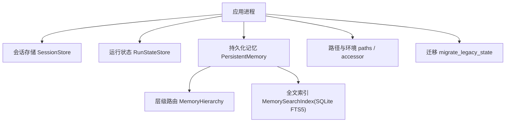
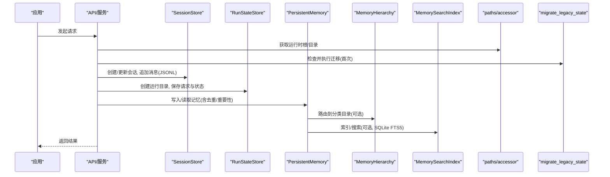
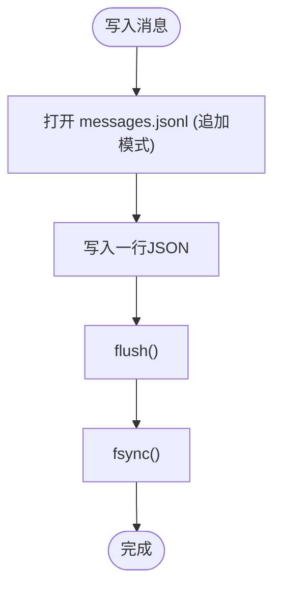
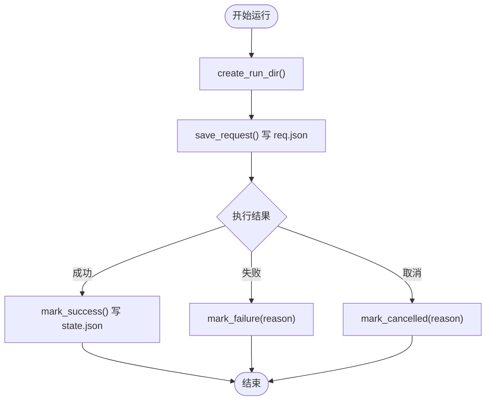
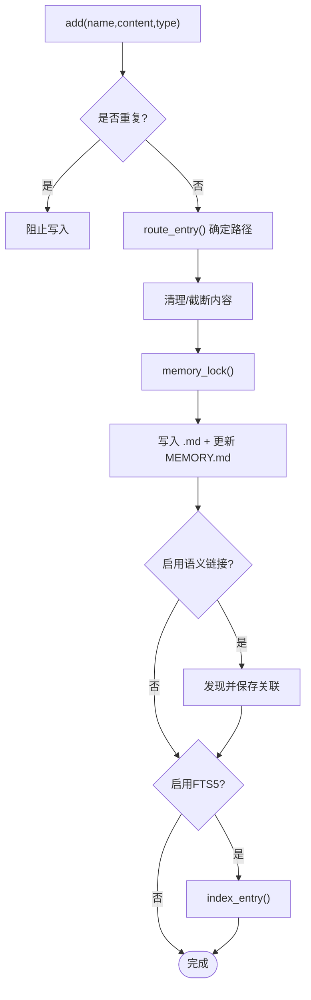
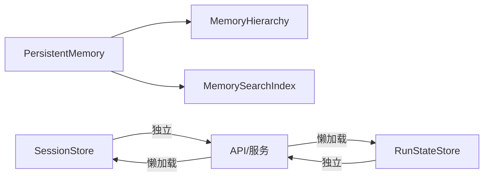

# 状态管理

<cite>
**本文引用的文件**
- [agent/src/core/state.py](file://agent/src/core/state.py)
- [agent/src/api/state.py](file://agent/src/api/state.py)
- [agent/src/config/migrate.py](file://agent/src/config/migrate.py)
- [agent/src/memory/persistent.py](file://agent/src/memory/persistent.py)
- [agent/src/memory/hierarchy.py](file://agent/src/memory/hierarchy.py)
- [agent/src/memory/search_index.py](file://agent/src/memory/search_index.py)
- [agent/src/config/paths.py](file://agent/src/config/paths.py)
- [agent/src/session/store.py](file://agent/src/session/store.py)
</cite>

## 目录
1. [简介](#简介)
2. [项目结构](#项目结构)
3. [核心组件](#核心组件)
4. [架构总览](#架构总览)
5. [详细组件分析](#详细组件分析)
6. [依赖关系分析](#依赖关系分析)
7. [性能考虑](#性能考虑)
8. [故障排查指南](#故障排查指南)
9. [结论](#结论)
10. [附录](#附录)

## 简介
本技术文档聚焦于运行状态的持久化、上下文保持与恢复、迁移与版本兼容、同步与一致性保证、查询与分析工具，以及备份与恢复策略。内容基于仓库中的会话存储、运行状态记录、持久化记忆、层级目录路由、全文检索索引与环境配置等实现进行系统化梳理，并提供在高并发环境下的最佳实践与优化建议。

## 项目结构
状态管理相关代码主要分布在以下模块：
- 会话与运行状态：会话持久化（JSON/JSONL）、运行目录与状态标记
- 持久化记忆：基于文件的跨会话记忆，支持层级目录与可选的SQLite FTS5索引
- 路径与环境：运行时根目录、会话/运行/上传目录定位，环境变量覆盖
- 迁移：将历史状态从旧位置迁移到新的运行时根目录，确保升级不丢失数据

图表来源
- [agent/src/session/store.py:16-259](file://agent/src/session/store.py#L16-L259)
- [agent/src/core/state.py:13-87](file://agent/src/core/state.py#L13-L87)
- [agent/src/memory/persistent.py:200-654](file://agent/src/memory/persistent.py#L200-L654)
- [agent/src/memory/hierarchy.py:34-436](file://agent/src/memory/hierarchy.py#L34-L436)
- [agent/src/memory/search_index.py:113-481](file://agent/src/memory/search_index.py#L113-L481)
- [agent/src/config/paths.py:13-113](file://agent/src/config/paths.py#L13-L113)
- [agent/src/config/migrate.py:114-153](file://agent/src/config/migrate.py#L114-L153)

章节来源
- [agent/src/session/store.py:16-259](file://agent/src/session/store.py#L16-L259)
- [agent/src/core/state.py:13-87](file://agent/src/core/state.py#L13-L87)
- [agent/src/memory/persistent.py:200-654](file://agent/src/memory/persistent.py#L200-L654)
- [agent/src/memory/hierarchy.py:34-436](file://agent/src/memory/hierarchy.py#L34-L436)
- [agent/src/memory/search_index.py:113-481](file://agent/src/memory/search_index.py#L113-L481)
- [agent/src/config/paths.py:13-113](file://agent/src/config/paths.py#L13-L113)
- [agent/src/config/migrate.py:114-153](file://agent/src/config/migrate.py#L114-L153)

## 核心组件
- 会话存储（SessionStore）：以文件系统为后端，保存会话元数据、消息日志与执行尝试；提供CRUD与追加式消息写入。
- 运行状态（RunStateStore）：创建唯一运行目录，持久化请求与状态标记（成功/失败/取消），使用fsync保障崩溃安全。
- 持久化记忆（PersistentMemory）：跨会话的文件型记忆存储，支持去重、重要性衰减、关键词搜索、语义链接扩展与可选FTS5加速。
- 层级路由（MemoryHierarchy）：按类型组织记忆文件至分类子目录，提升扫描效率并兼容扁平存储。
- 全文索引（MemorySearchIndex）：基于SQLite FTS5的全量文本检索，提供增量索引、重建与优雅降级。
- 路径与环境（paths/accessor）：统一运行时根目录与会话/运行/上传目录定位，支持环境变量覆盖与配置候选查找。
- 迁移（migrate_legacy_state）：一次性将历史状态迁移到新的运行时根目录，采用原子重命名与中断恢复机制。

章节来源
- [agent/src/session/store.py:16-259](file://agent/src/session/store.py#L16-L259)
- [agent/src/core/state.py:13-87](file://agent/src/core/state.py#L13-L87)
- [agent/src/memory/persistent.py:200-654](file://agent/src/memory/persistent.py#L200-L654)
- [agent/src/memory/hierarchy.py:34-436](file://agent/src/memory/hierarchy.py#L34-L436)
- [agent/src/memory/search_index.py:113-481](file://agent/src/memory/search_index.py#L113-L481)
- [agent/src/config/paths.py:13-113](file://agent/src/config/paths.py#L13-L113)
- [agent/src/config/migrate.py:114-153](file://agent/src/config/migrate.py#L114-L153)

## 架构总览
下图展示了状态管理的整体交互：应用通过API或服务层调用会话存储、运行状态与持久化记忆；记忆可借助层级路由与FTS5索引进行高效读写与检索；路径与环境模块提供统一的目录与环境变量解析；迁移模块在启动时处理历史数据迁移。

图表来源
- [agent/src/api/state.py:29-111](file://agent/src/api/state.py#L29-L111)
- [agent/src/config/paths.py:13-113](file://agent/src/config/paths.py#L13-L113)
- [agent/src/config/migrate.py:114-153](file://agent/src/config/migrate.py#L114-L153)
- [agent/src/session/store.py:63-197](file://agent/src/session/store.py#L63-L197)
- [agent/src/core/state.py:16-87](file://agent/src/core/state.py#L16-L87)
- [agent/src/memory/persistent.py:200-654](file://agent/src/memory/persistent.py#L200-L654)
- [agent/src/memory/hierarchy.py:70-176](file://agent/src/memory/hierarchy.py#L70-L176)
- [agent/src/memory/search_index.py:207-355](file://agent/src/memory/search_index.py#L207-L355)

## 详细组件分析

### 会话存储（SessionStore）
- 存储格式
  - 会话元数据：JSON文件（session.json）
  - 消息日志：JSONL追加日志（messages.jsonl），每次写入后flush+fsync
  - 执行尝试：每个attempt独立目录与attempt.json
- 数据结构
  - Session、Message、Attempt对象通过from_dict/to_dict序列化
- 关键流程
  - 创建会话：校验不存在→创建目录→写session.json
  - 追加消息：打开文件追加一行JSON，flush+fsync
  - 读取消息：逐行解析，跳过损坏行，返回最近N条
  - 删除会话：递归删除会话目录
- 并发与一致性
  - JSONL追加具备原子行写入特性；fsync确保崩溃后不丢数据
  - 列表会话时忽略损坏条目，避免级联失败

图表来源
- [agent/src/session/store.py:155-166](file://agent/src/session/store.py#L155-L166)

章节来源
- [agent/src/session/store.py:63-197](file://agent/src/session/store.py#L63-L197)

### 运行状态（RunStateStore）
- 目录结构
  - 每个运行拥有唯一目录（时间戳+随机后缀），包含code/logs/artifacts子目录
- 状态标记
  - state.json：status字段表示success/failed/cancelled，失败/取消附带reason
  - req.json：保存用户prompt与上下文元数据
- 一致性
  - 写JSON后flush+fsync，防止崩溃导致截断或空文件

图表来源
- [agent/src/core/state.py:16-87](file://agent/src/core/state.py#L16-L87)

章节来源
- [agent/src/core/state.py:16-87](file://agent/src/core/state.py#L16-L87)

### 持久化记忆（PersistentMemory）
- 存储格式
  - 每条记忆为Markdown文件，包含frontmatter（name/description/type/id/时间戳/质量分/访问计数/重要性/关联记忆/分类/压缩级别）
  - 索引文件MEMORY.md维护最近条目摘要（限制行数）
- 去重与重要性
  - 滑动窗口哈希去重（默认30秒），避免重复写入
  - 重要性计算结合质量分、访问次数与访问时间衰减（可配置开关）
- 搜索
  - 优先使用FTS5索引（可配置），否则回退到token扫描
  - 支持语义链接扩展（可选）
- 并发控制
  - 使用文件锁（fcntl）保护写入与删除操作，Windows下直接放行

图表来源
- [agent/src/memory/persistent.py:479-595](file://agent/src/memory/persistent.py#L479-L595)
- [agent/src/memory/hierarchy.py:70-176](file://agent/src/memory/hierarchy.py#L70-L176)
- [agent/src/memory/search_index.py:207-250](file://agent/src/memory/search_index.py#L207-L250)

章节来源
- [agent/src/memory/persistent.py:200-654](file://agent/src/memory/persistent.py#L200-L654)
- [agent/src/memory/hierarchy.py:34-436](file://agent/src/memory/hierarchy.py#L34-L436)
- [agent/src/memory/search_index.py:113-481](file://agent/src/memory/search_index.py#L113-L481)

### 层级路由（MemoryHierarchy）
- 功能
  - 将记忆文件路由到分类子目录（user/feedback/project/reference），未知类型回退到根目录
  - 自动修复缺失后缀的文件（恢复为.md）
  - 扫描与优先级排序（基于关键词重叠度）
- 兼容性
  - 同时支持扁平存储与层级存储，保证向后兼容

章节来源
- [agent/src/memory/hierarchy.py:70-176](file://agent/src/memory/hierarchy.py#L70-L176)
- [agent/src/memory/hierarchy.py:92-143](file://agent/src/memory/hierarchy.py#L92-L143)
- [agent/src/memory/hierarchy.py:313-379](file://agent/src/memory/hierarchy.py#L313-L379)

### 全文索引（MemorySearchIndex）
- 存储
  - SQLite数据库（WAL模式），memories表与memories_fts虚拟表（FTS5）
  - 触发器自动同步增删改
- 功能
  - 增量索引、批量重建、搜索（带片段与排名）
  - CJK字符处理（单字+二元组展开与去重）
- 降级
  - FTS5不可用时记录警告并禁用索引，不影响主流程

章节来源
- [agent/src/memory/search_index.py:147-196](file://agent/src/memory/search_index.py#L147-L196)
- [agent/src/memory/search_index.py:207-355](file://agent/src/memory/search_index.py#L207-L355)
- [agent/src/memory/search_index.py:357-445](file://agent/src/memory/search_index.py#L357-L445)

### 路径与环境（paths/accessor）
- 运行时根目录
  - 可通过VIBE_TRADING_HOME环境变量覆盖，否则默认~/.vibe-trading
  - 提供会话/运行/上传/工作区等子目录获取方法
- 配置候选
  - 按优先级查找agent.json/yaml/yml
- 线程安全
  - 配置访问器使用双检锁保证多线程安全

章节来源
- [agent/src/config/paths.py:13-113](file://agent/src/config/paths.py#L13-L113)
- [agent/src/config/accessor.py:52-93](file://agent/src/config/accessor.py#L52-L93)

### 迁移（migrate_legacy_state）
- 目标
  - 将sessions/runs/.swarm/runs/uploads从旧位置迁移到运行时根目录
- 策略
  - 子项级合并：同名冲突跳过，避免破坏其他功能已填充的目标
  - 原子重命名：先移动到.migrating-*临时名，再rename为目标名
  - 中断恢复：下次启动检测残留临时项并恢复
  - 幂等：已迁移或不存在则无操作

章节来源
- [agent/src/config/migrate.py:114-153](file://agent/src/config/migrate.py#L114-L153)

## 依赖关系分析
- 组件耦合
  - PersistentMemory依赖MemoryHierarchy进行路由，依赖MemorySearchIndex进行全文检索（均可配置开关）
  - SessionStore与RunStateStore相对独立，分别负责会话与运行状态
  - API层通过lazy初始化组合SessionService与ChannelRuntime，间接依赖上述存储
- 外部依赖
  - SQLite用于FTS5索引；fcntl用于Unix文件锁；标准库json/pathlib/os
- 潜在循环
  - 通过延迟导入避免循环依赖（如accessor中EnvConfig延迟加载）

图表来源
- [agent/src/memory/persistent.py:200-654](file://agent/src/memory/persistent.py#L200-L654)
- [agent/src/memory/hierarchy.py:34-436](file://agent/src/memory/hierarchy.py#L34-L436)
- [agent/src/memory/search_index.py:113-481](file://agent/src/memory/search_index.py#L113-L481)
- [agent/src/api/state.py:29-111](file://agent/src/api/state.py#L29-L111)

章节来源
- [agent/src/memory/persistent.py:200-654](file://agent/src/memory/persistent.py#L200-L654)
- [agent/src/memory/hierarchy.py:34-436](file://agent/src/memory/hierarchy.py#L34-L436)
- [agent/src/memory/search_index.py:113-481](file://agent/src/memory/search_index.py#L113-L481)
- [agent/src/api/state.py:29-111](file://agent/src/api/state.py#L29-L111)

## 性能考虑
- 写入性能
  - JSONL追加写入配合fsync，兼顾可靠性与吞吐；避免频繁小文件重写
  - 记忆写入前进行去重与内容裁剪，减少磁盘占用与IO
- 读取性能
  - 层级路由将扫描范围缩小到类别子目录，降低O(n)全量扫描成本
  - FTS5索引提供O(log n)检索能力，并在不可用时优雅降级
- 并发与锁
  - 使用文件锁保护记忆写入/删除，避免竞态条件；Windows平台直接放行
  - 配置访问器使用双检锁保证线程安全
- 缓存策略
  - 内存快照：PersistentMemory在初始化时加载索引快照，减少重复I/O
  - 连接复用：MemorySearchIndex维护SQLite连接，避免频繁建连开销

[本节为通用指导，无需特定文件引用]

## 故障排查指南
- 会话数据损坏
  - 现象：list_sessions跳过损坏session.json并记录警告
  - 处理：检查对应目录的session.json完整性，必要时重建或删除
- 消息日志损坏
  - 现象：get_messages跳过损坏行并记录警告
  - 处理：检查messages.jsonl末尾行是否完整JSON；必要时截断或重建
- 记忆写入失败
  - 现象：remove/add记录锁超时或写入异常
  - 处理：确认文件权限与磁盘空间；检查是否存在同名锁定文件；重试或清理残留
- FTS5不可用
  - 现象：索引初始化记录警告并禁用搜索
  - 处理：检查SQLite编译选项是否包含FTS5；或继续使用token扫描回退路径
- 迁移中断
  - 现象：存在.migrating-*残留
  - 处理：重启应用，迁移逻辑会自动恢复；若目标已存在则丢弃残留

章节来源
- [agent/src/session/store.py:122-151](file://agent/src/session/store.py#L122-L151)
- [agent/src/session/store.py:168-197](file://agent/src/session/store.py#L168-L197)
- [agent/src/memory/persistent.py:332-360](file://agent/src/memory/persistent.py#L332-L360)
- [agent/src/memory/persistent.py:479-595](file://agent/src/memory/persistent.py#L479-L595)
- [agent/src/memory/search_index.py:147-196](file://agent/src/memory/search_index.py#L147-L196)
- [agent/src/config/migrate.py:57-102](file://agent/src/config/migrate.py#L57-L102)

## 结论
该状态管理体系以文件系统为核心，结合JSON/JSONL与SQLite FTS5索引，提供了高可靠、可扩展且高性能的运行状态与记忆持久化方案。通过层级路由、去重与重要性衰减、原子迁移与崩溃安全写入，系统在复杂场景下仍能保持稳定与一致。在高并发环境中，建议充分利用JSONL追加、文件锁、连接复用与索引加速，并结合环境变量与路径抽象实现灵活部署与运维。

## 附录
- 状态查询与分析工具
  - 会话列表与消息回溯：通过SessionStore.list_sessions/get_messages
  - 运行状态查看：读取runs目录下state.json与req.json
  - 记忆检索：使用PersistentMemory.find_relevant，可选择启用FTS5与语义链接扩展
  - 层级统计：MemoryHierarchy.rebuild_index生成分类摘要与关键词
- 备份与恢复策略
  - 会话与运行：定期打包sessions与runs目录；注意JSONL追加的原子性
  - 记忆与索引：备份memory目录与memory_index.db；索引可在需要时rebuild_all重建
  - 迁移：确保迁移完成后清理旧位置残留；验证新路径下数据完整性
- 高并发最佳实践
  - 使用JSONL追加写入消息，避免随机写
  - 开启FTS5索引以提升检索性能，并确保WAL模式
  - 合理设置去重窗口与重要性衰减参数，平衡准确性与性能
  - 利用环境变量覆盖运行时根目录，便于多实例隔离与容器化部署

[本节为通用指导，无需特定文件引用]