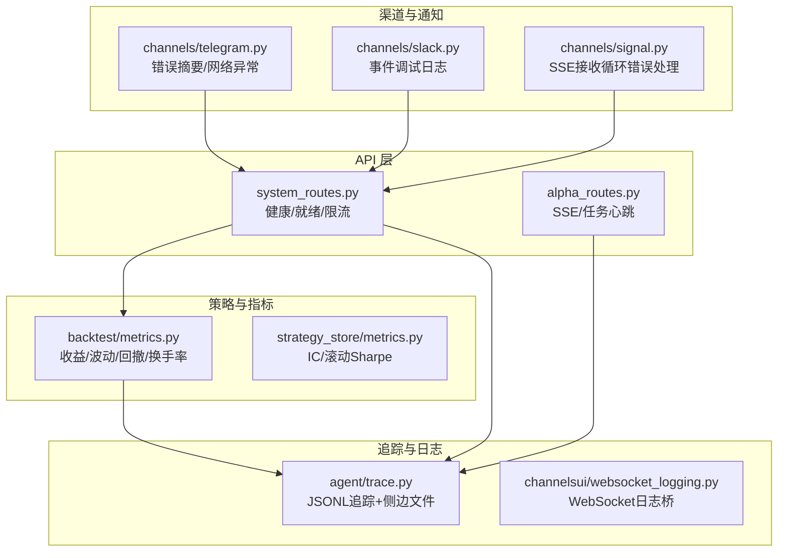
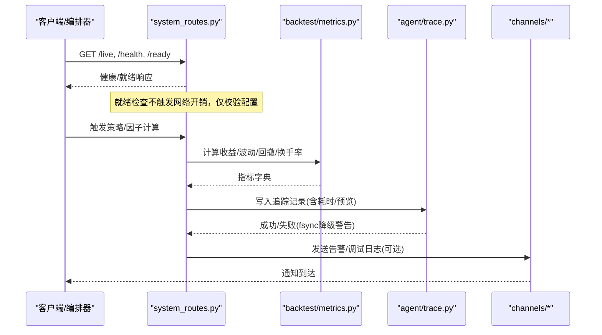
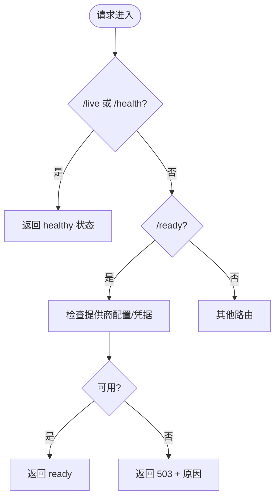
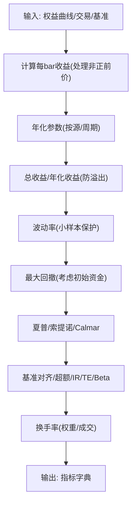
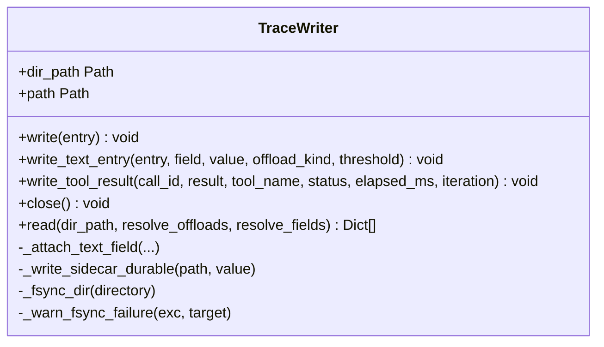
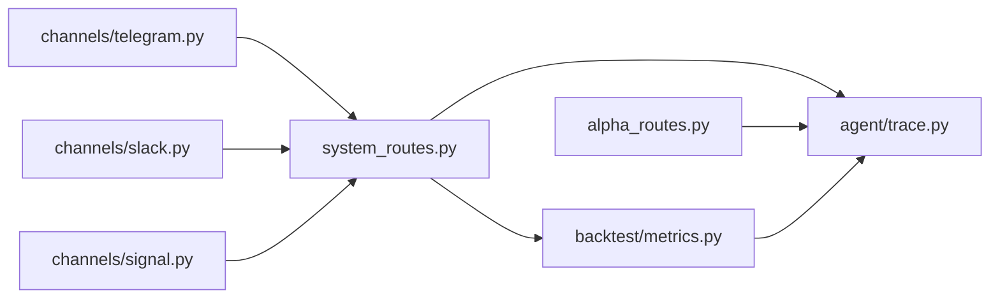

# 监控与诊断

<cite>
**本文引用的文件**
- [agent/src/api/system_routes.py](file://agent/src/api/system_routes.py)
- [agent/src/agent/trace.py](file://agent/src/agent/trace.py)
- [agent/backtest/metrics.py](file://agent/backtest/metrics.py)
- [agent/src/strategy_store/metrics.py](file://agent/src/strategy_store/metrics.py)
- [agent/src/channelsui/websocket_logging.py](file://agent/src/channelsui/websocket_logging.py)
- [agent/src/channels/signal.py](file://agent/src/channels/signal.py)
- [agent/src/channels/telegram.py](file://agent/src/channels/telegram.py)
- [agent/src/channels/slack.py](file://agent/src/channels/slack.py)
- [agent/src/api/alpha_routes.py](file://agent/src/api/alpha_routes.py)
- [desktop/electron/src/main.ts](file://desktop/electron/src/main.ts)
</cite>

## 目录
1. [简介](#简介)
2. [项目结构](#项目结构)
3. [核心组件](#核心组件)
4. [架构总览](#架构总览)
5. [详细组件分析](#详细组件分析)
6. [依赖关系分析](#依赖关系分析)
7. [性能考量](#性能考量)
8. [故障排查指南](#故障排查指南)
9. [结论](#结论)
10. [附录](#附录)

## 简介
本文件面向生产环境的运行时监控与诊断，聚焦以下目标：
- 性能指标采集与分析：覆盖交易策略层面的收益、波动、回撤、换手率等关键指标；结合系统健康探针提供进程级可观测性。
- 日志收集与聚合：结构化日志、统一日志通道、错误摘要与轮转建议。
- 问题定位工具：基于崩溃安全的追踪写入器（JSONL + 侧边文件），支持堆栈上下文、耗时统计与结果外带。
- 告警规则与通知机制：通过健康探针、就绪检查与渠道适配器（Telegram/Slack）实现状态上报与异常通知。
- 实时监控仪表板与历史数据：利用 API 暴露的指标与追踪数据，对接外部可视化与存储后端。
- 分布式/链路追踪：以 JSONL 追踪记录串联 LLM/工具调用链，便于跨服务归因与排障。
- 生产部署最佳实践：安全、可靠性、可扩展性与成本控制的落地建议。

## 项目结构
本项目在“策略回测/实盘”与“API/渠道”之间形成清晰的职责边界：
- 指标计算集中在回测与策略存储层，提供统一的收益、风险、换手率与衰减指标。
- 系统健康探针与就绪检查由 API 层提供，用于编排器与外部监控系统探测。
- 追踪写入器负责将运行期事件持久化为 JSONL，并支持大字段外带与原子落盘。
- 渠道适配器提供消息通道与错误日志桥接，便于告警与调试。

图表来源
- [agent/src/api/system_routes.py:235-272](file://agent/src/api/system_routes.py#L235-L272)
- [agent/backtest/metrics.py:461-626](file://agent/backtest/metrics.py#L461-L626)
- [agent/src/agent/trace.py:64-180](file://agent/src/agent/trace.py#L64-L180)
- [agent/src/channelsui/websocket_logging.py:1-8](file://agent/src/channelsui/websocket_logging.py#L1-L8)
- [agent/src/channels/telegram.py:1591-1620](file://agent/src/channels/telegram.py#L1591-L1620)
- [agent/src/channels/slack.py:354-382](file://agent/src/channels/slack.py#L354-L382)
- [agent/src/channels/signal.py:644-673](file://agent/src/channels/signal.py#L644-L673)

章节来源
- [agent/src/api/system_routes.py:235-272](file://agent/src/api/system_routes.py#L235-L272)
- [agent/backtest/metrics.py:461-626](file://agent/backtest/metrics.py#L461-L626)
- [agent/src/agent/trace.py:64-180](file://agent/src/agent/trace.py#L64-L180)
- [agent/src/channelsui/websocket_logging.py:1-8](file://agent/src/channelsui/websocket_logging.py#L1-L8)
- [agent/src/channels/telegram.py:1591-1620](file://agent/src/channels/telegram.py#L1591-L1620)
- [agent/src/channels/slack.py:354-382](file://agent/src/channels/slack.py#L354-L382)
- [agent/src/channels/signal.py:644-673](file://agent/src/channels/signal.py#L644-L673)

## 核心组件
- 健康与就绪探针：/live、/health、/ready，用于容器编排与负载均衡的健康检查。
- 指标计算：收益、年化、波动、最大回撤、夏普、索提诺、Calmar、信息比率、跟踪误差、Beta、换手率等。
- 追踪写入器：崩溃安全的 JSONL 写入，大字段外带至侧边文件，原子替换与目录 fsync。
- 渠道日志与告警：Telegram/Slack/SSE 的错误摘要与调试日志，便于快速定位。
- 桌面端启动与错误上报：Electron 主进程捕获启动错误并推送前端。

章节来源
- [agent/src/api/system_routes.py:235-272](file://agent/src/api/system_routes.py#L235-L272)
- [agent/backtest/metrics.py:461-626](file://agent/backtest/metrics.py#L461-L626)
- [agent/src/agent/trace.py:64-180](file://agent/src/agent/trace.py#L64-L180)
- [agent/src/channels/telegram.py:1591-1620](file://agent/src/channels/telegram.py#L1591-L1620)
- [agent/src/channels/slack.py:354-382](file://agent/src/channels/slack.py#L354-L382)
- [agent/src/channels/signal.py:644-673](file://agent/src/channels/signal.py#L644-L673)
- [desktop/electron/src/main.ts:188-226](file://desktop/electron/src/main.ts#L188-L226)

## 架构总览
下图展示了从请求到指标计算、追踪写入与渠道通知的整体流程。

图表来源
- [agent/src/api/system_routes.py:235-272](file://agent/src/api/system_routes.py#L235-L272)
- [agent/backtest/metrics.py:461-626](file://agent/backtest/metrics.py#L461-L626)
- [agent/src/agent/trace.py:92-180](file://agent/src/agent/trace.py#L92-L180)
- [agent/src/channels/telegram.py:1591-1620](file://agent/src/channels/telegram.py#L1591-L1620)

## 详细组件分析

### 健康与就绪探针（system_routes.py）
- /live 与 /health：返回进程存活与服务元数据，适合 K8s liveness 探针。
- /ready：轻量校验 LLM 提供商配置与凭据可用性，避免频繁网络探测，适合 readiness 探针。
- 限流：对高负载接口（如相关性矩阵）实施滑动窗口限流，防止资源耗尽。

图表来源
- [agent/src/api/system_routes.py:235-272](file://agent/src/api/system_routes.py#L235-L272)

章节来源
- [agent/src/api/system_routes.py:235-272](file://agent/src/api/system_routes.py#L235-L272)

### 策略指标计算（backtest/metrics.py）
- 年化处理：按数据源与周期映射每日 bar 数，确保年化一致。
- 收益率与风险：总收益、年化收益、波动率、最大回撤、夏普、索提诺、Calmar。
- 基准对比：基准收益、超额收益、信息比率、跟踪误差、Beta。
- 换手率：基于权重变化或成交证据的逐 bar 换手率序列与均值/总量。
- 健壮性：处理零/负价格、溢出、单样本标准差等边界情况。

图表来源
- [agent/backtest/metrics.py:245-302](file://agent/backtest/metrics.py#L245-L302)
- [agent/backtest/metrics.py:461-626](file://agent/backtest/metrics.py#L461-L626)

章节来源
- [agent/backtest/metrics.py:245-302](file://agent/backtest/metrics.py#L245-L302)
- [agent/backtest/metrics.py:461-626](file://agent/backtest/metrics.py#L461-L626)

### 衰减指标（strategy_store/metrics.py）
- 基于历史快照计算 IC 基线/滚动均值、IC 比率、滚动 IR、IC 正比、Sharpe 基线/滚动值。
- 数据不足时返回 None，避免误导。

章节来源
- [agent/src/strategy_store/metrics.py:15-90](file://agent/src/strategy_store/metrics.py#L15-L90)

### 追踪写入器（agent/trace.py）
- 崩溃安全：每条记录 flush + fsync；fsync 失败降级为仅 flush 并告警一次。
- 大字段外带：超过阈值的内容写入 sidecar 文件，记录中保留路径与预览长度。
- 原子落盘：临时文件 -> fsync -> os.replace -> 目录 fsync，保证引用完整性。
- 读取能力：支持选择性解析字段，避免加载大字段。

图表来源
- [agent/src/agent/trace.py:64-180](file://agent/src/agent/trace.py#L64-L180)
- [agent/src/agent/trace.py:185-300](file://agent/src/agent/trace.py#L185-L300)
- [agent/src/agent/trace.py:302-370](file://agent/src/agent/trace.py#L302-L370)

章节来源
- [agent/src/agent/trace.py:64-180](file://agent/src/agent/trace.py#L64-L180)
- [agent/src/agent/trace.py:185-300](file://agent/src/agent/trace.py#L185-L300)
- [agent/src/agent/trace.py:302-370](file://agent/src/agent/trace.py#L302-L370)

### 渠道日志与告警（channels/*）
- Telegram：网络超时/连接错误统一摘要，区分 warning/error 级别。
- Slack：事件形状调试日志，便于确认消息路由与过滤逻辑。
- Signal（SSE）：接收循环异常捕获，附带 payload 片段，便于复现。

章节来源
- [agent/src/channels/telegram.py:1591-1620](file://agent/src/channels/telegram.py#L1591-L1620)
- [agent/src/channels/slack.py:354-382](file://agent/src/channels/slack.py#L354-L382)
- [agent/src/channels/signal.py:644-673](file://agent/src/channels/signal.py#L644-L673)

### SSE 与任务心跳（alpha_routes.py）
- 使用 SSE 进行长连接推送，配合心跳间隔与任务生命周期管理，便于前端实时展示进度与结果。
- 建议结合追踪记录中的耗时与状态字段，构建实时仪表板。

章节来源
- [agent/src/api/alpha_routes.py:25-63](file://agent/src/api/alpha_routes.py#L25-L63)

### 桌面端启动与错误上报（desktop/electron/src/main.ts）
- 捕获后端启动错误并通过 IPC 推送到前端，提供“打开日志”菜单项，便于用户定位问题。

章节来源
- [desktop/electron/src/main.ts:188-226](file://desktop/electron/src/main.ts#L188-L226)

## 依赖关系分析
- system_routes.py 依赖 backtest 模块进行相关性/制度计算，并在就绪检查中访问配置与提供商能力。
- metrics.py 被回测/策略执行路径调用，产出指标供 API 与前端展示。
- trace.py 被各模块写入运行期事件，形成可追溯的审计轨迹。
- channels/* 作为通知与调试通道，与 API 层解耦，便于扩展更多渠道。

图表来源
- [agent/src/api/system_routes.py:235-272](file://agent/src/api/system_routes.py#L235-L272)
- [agent/backtest/metrics.py:461-626](file://agent/backtest/metrics.py#L461-L626)
- [agent/src/agent/trace.py:92-180](file://agent/src/agent/trace.py#L92-L180)
- [agent/src/channels/telegram.py:1591-1620](file://agent/src/channels/telegram.py#L1591-L1620)
- [agent/src/channels/slack.py:354-382](file://agent/src/channels/slack.py#L354-L382)
- [agent/src/channels/signal.py:644-673](file://agent/src/channels/signal.py#L644-L673)

章节来源
- [agent/src/api/system_routes.py:235-272](file://agent/src/api/system_routes.py#L235-L272)
- [agent/backtest/metrics.py:461-626](file://agent/backtest/metrics.py#L461-L626)
- [agent/src/agent/trace.py:92-180](file://agent/src/agent/trace.py#L92-L180)
- [agent/src/channels/telegram.py:1591-1620](file://agent/src/channels/telegram.py#L1591-L1620)
- [agent/src/channels/slack.py:354-382](file://agent/src/channels/slack.py#L354-L382)
- [agent/src/channels/signal.py:644-673](file://agent/src/channels/signal.py#L644-L673)

## 性能考量
- 指标计算：
  - 年化处理需匹配数据源与周期，避免误用默认值导致年化偏差。
  - 小样本与极端路径（零/负权益、溢出）已做防护，避免 NaN/Inf 污染。
- 追踪写入：
  - 每条记录 fsync 带来一定 I/O 开销，但保障崩溃后仍可恢复完整轨迹。
  - 大字段外带减少 JSONL 体积，提升读写效率。
- 限流与并发：
  - 相关性等重计算接口采用滑动窗口限流，防止资源耗尽。
  - SSE 心跳与任务集合管理避免内存泄漏与悬挂任务。
- 日志与渠道：
  - 错误摘要与分级日志降低噪音，便于快速定位。
  - 渠道适配器独立于核心逻辑，便于扩展与隔离故障。

[本节为通用指导，无需特定文件来源]

## 故障排查指南
- 健康/就绪问题：
  - 检查 /live 是否返回 healthy；若 /ready 返回 503，查看提供商配置与凭据是否齐全。
  - 参考就绪检查逻辑，确认 provider/model/密钥环境是否存在。
- 指标异常：
  - 关注收益序列中的非正前价与 inf/NaN 处理；检查年化参数与 bars_per_year 设置。
  - 核对基准对齐与空序列处理，避免 IR/TE 失真。
- 追踪缺失或不完整：
  - 检查 trace.jsonl 与 sidecar 目录权限与 fsync 支持；留意首次 fsync 失败的降级告警。
  - 读取时按需解析字段，避免加载大字段造成延迟。
- 渠道告警未送达：
  - 检查 Telegram/Slack 的网络错误摘要与重试逻辑；确认事件过滤与路由条件。
- 桌面端启动失败：
  - 查看 Electron 主进程错误上报与“打开日志”入口，定位后端启动异常。

章节来源
- [agent/src/api/system_routes.py:235-272](file://agent/src/api/system_routes.py#L235-L272)
- [agent/backtest/metrics.py:245-302](file://agent/backtest/metrics.py#L245-L302)
- [agent/src/agent/trace.py:92-180](file://agent/src/agent/trace.py#L92-L180)
- [agent/src/channels/telegram.py:1591-1620](file://agent/src/channels/telegram.py#L1591-L1620)
- [desktop/electron/src/main.ts:188-226](file://desktop/electron/src/main.ts#L188-L226)

## 结论
本项目的监控与诊断体系围绕“健康探针 + 指标计算 + 追踪写入 + 渠道通知”展开，既满足生产编排器的健康检查需求，又为策略运行提供完整的可观测性与排障能力。通过稳健的指标计算、崩溃安全的追踪写入与多渠道告警，可在复杂交易环境中快速定位问题、评估策略表现并持续优化。

[本节为总结，无需特定文件来源]

## 附录
- 指标字典关键字段（来自 backtest/metrics.py）：
  - final_value、total_return、annual_return、max_drawdown、sharpe、calmar、sortino
  - win_rate、profit_loss_ratio、profit_factor、max_consecutive_loss、avg_holding_days、trade_count
  - benchmark_return、excess_return、information_ratio、tracking_error、benchmark_beta
  - avg_turnover、total_turnover
- 衰减指标关键字段（来自 strategy_store/metrics.py）：
  - baseline_ic_mean、rolling_ic_mean、ic_ratio、rolling_ir、ic_positive_ratio、rolling_sharpe、baseline_sharpe

章节来源
- [agent/backtest/metrics.py:674-695](file://agent/backtest/metrics.py#L674-L695)
- [agent/src/strategy_store/metrics.py:40-90](file://agent/src/strategy_store/metrics.py#L40-L90)