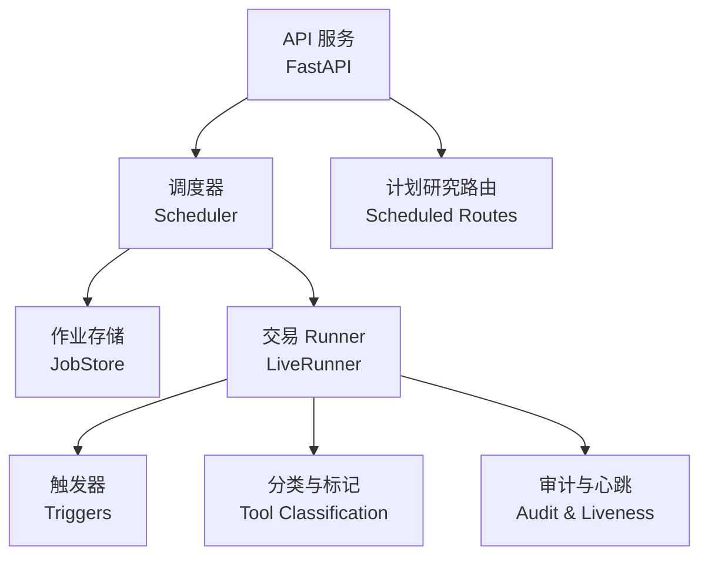
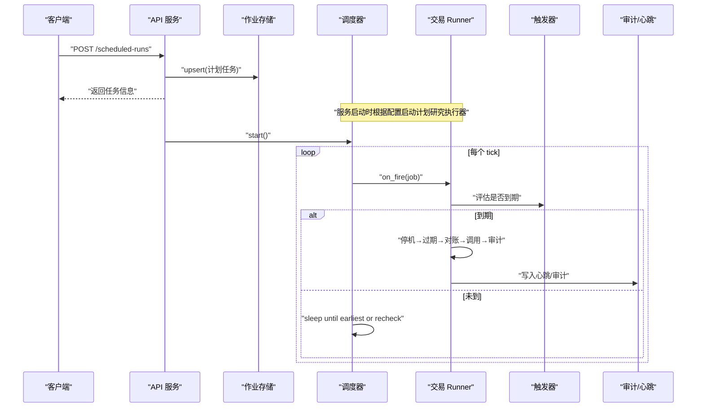
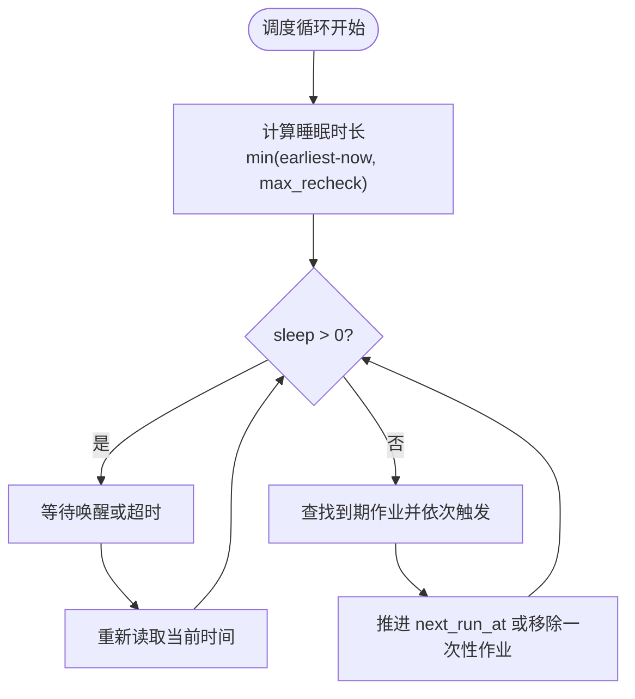
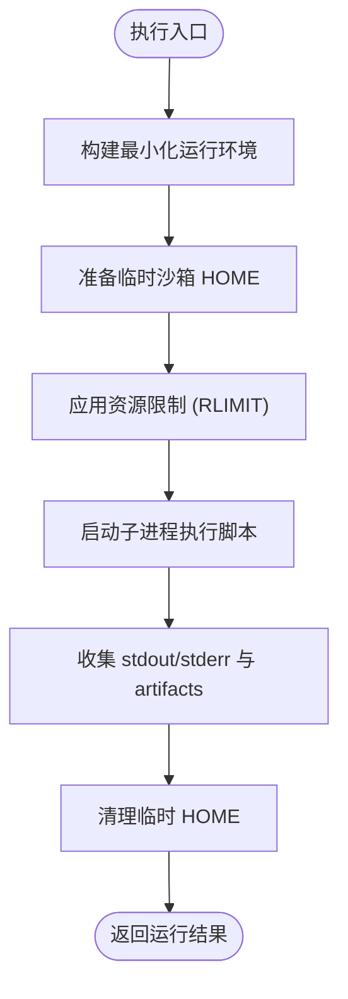
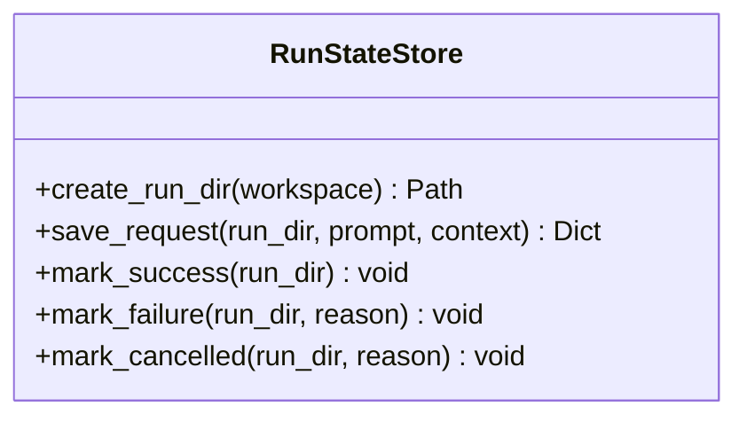
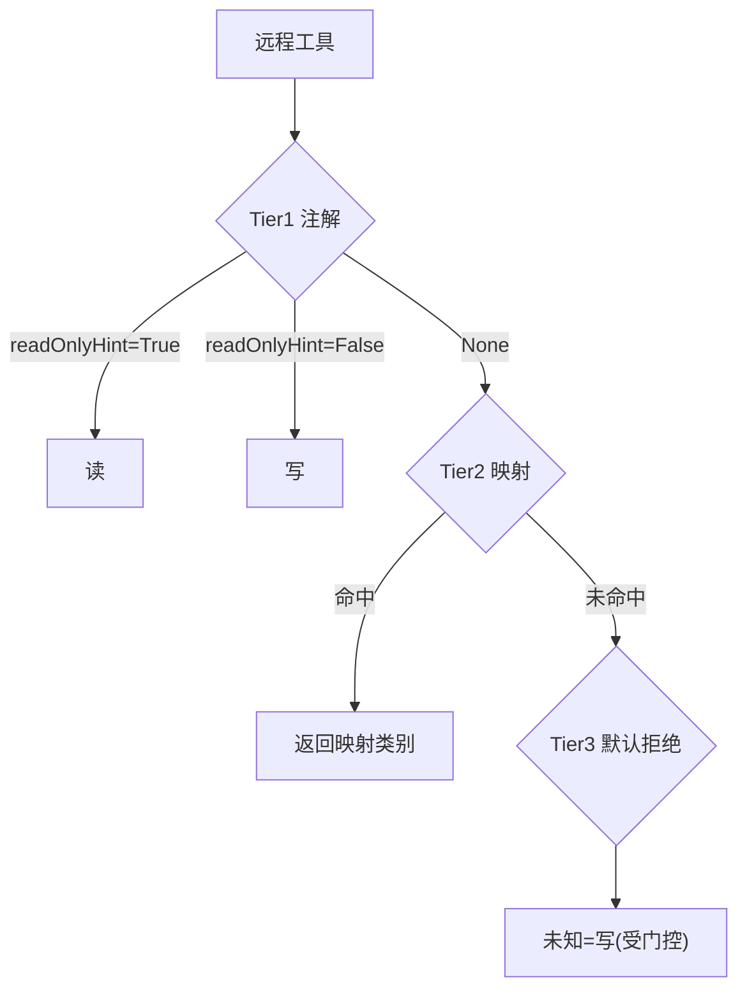
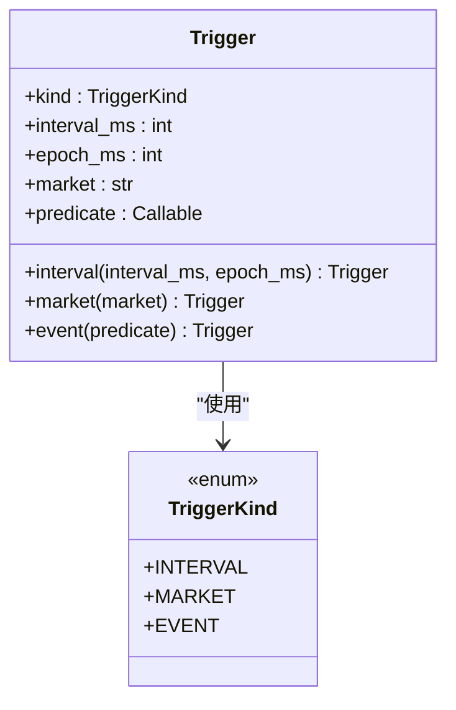
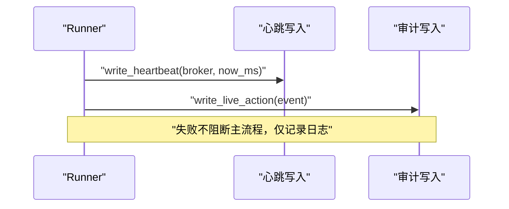
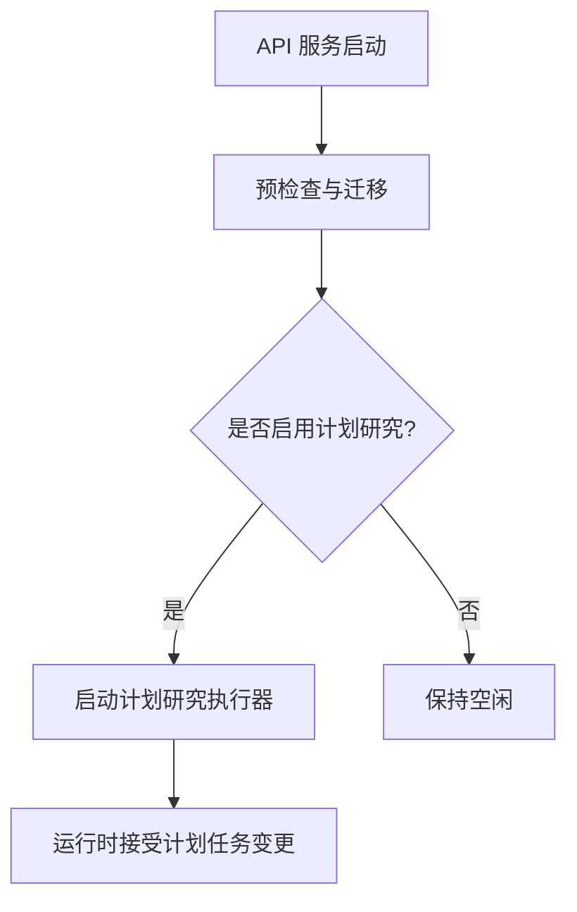
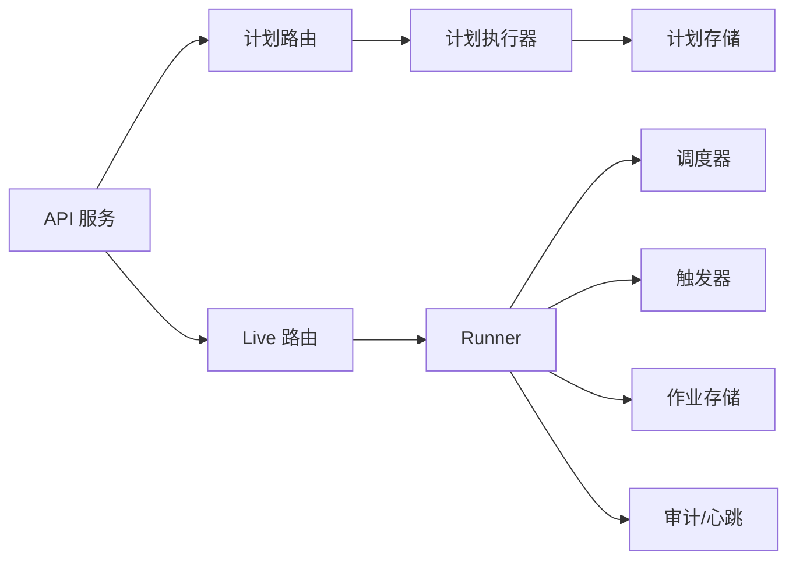

# 运行时管理

<cite>
**本文引用的文件**
- [api_server.py](file://agent/api_server.py)
- [runner.py](file://agent/src/core/runner.py)
- [state.py](file://agent/src/core/state.py)
- [scheduler.py](file://agent/src/live/runtime/scheduler.py)
- [jobstore.py](file://agent/src/live/runtime/jobstore.py)
- [runner.py](file://agent/src/live/runtime/runner.py)
- [triggers.py](file://agent/src/live/runtime/triggers.py)
- [scheduled_routes.py](file://agent/src/api/scheduled_routes.py)
- [classification.py](file://agent/src/live/classification.py)
</cite>

## 目录
1. [简介](#简介)
2. [项目结构](#项目结构)
3. [核心组件](#核心组件)
4. [架构总览](#架构总览)
5. [详细组件分析](#详细组件分析)
6. [依赖关系分析](#依赖关系分析)
7. [性能考量](#性能考量)
8. [故障排查指南](#故障排查指南)
9. [结论](#结论)
10. [附录](#附录)

## 简介
本技术文档聚焦于“运行时管理”，覆盖任务调度系统（定时任务、事件驱动、工作流编排）、进程与资源管理（监控、隔离、恢复）、状态管理（持久化、上下文保持、迁移）、插件注册与发现（动态加载、版本、依赖解析）、分类与标记（任务分类、优先级、标签过滤）、监控与诊断（性能、日志、定位），以及配置管理与热更新机制。并以大规模交易系统中的关键作用与实践案例贯穿说明，帮助读者从整体到细节掌握该运行时的设计与实现。

## 项目结构
运行时由“API 服务”、“调度器”、“作业存储”、“交易 Runner”、“触发器”、“分类与标记”等模块组成，围绕“可恢复、可观测、安全可控”的目标组织：
- API 服务负责装配路由、生命周期、启动/停止预检查、集成各子系统。
- 调度器提供墙钟驱动的循环执行，支持间隔与一次性任务。
- 作业存储提供崩溃安全的原子持久化，保证重启后恢复。
- 交易 Runner 实现每 tick 的固定顺序流程（停机→过期→对账→调用→审计），并支持市场/间隔/事件触发。
- 触发器抽象 INTERVAL/MARKET/EVENT 三类触发条件，屏蔽时间与时区细节。
- 分类与标记为工具能力分级（读/写/未知）提供严格的前置判定。

图表来源
- [api_server.py:156-174](file://agent/api_server.py#L156-L174)
- [scheduler.py:178-217](file://agent/src/live/runtime/scheduler.py#L178-L217)
- [jobstore.py:76-151](file://agent/src/live/runtime/jobstore.py#L76-L151)
- [runner.py:296-399](file://agent/src/live/runtime/runner.py#L296-L399)
- [triggers.py:119-205](file://agent/src/live/runtime/triggers.py#L119-L205)
- [classification.py:38-89](file://agent/src/live/classification.py#L38-L89)

章节来源
- [api_server.py:127-171](file://agent/api_server.py#L127-L171)
- [scheduler.py:178-217](file://agent/src/live/runtime/scheduler.py#L178-L217)
- [jobstore.py:76-151](file://agent/src/live/runtime/jobstore.py#L76-L151)
- [runner.py:296-399](file://agent/src/live/runtime/runner.py#L296-L399)
- [triggers.py:119-205](file://agent/src/live/runtime/triggers.py#L119-L205)
- [classification.py:38-89](file://agent/src/live/classification.py#L38-L89)

## 核心组件
- 任务调度系统
  - 墙钟调度器：基于 asyncio 的事件循环，按最早下次执行时间睡眠，到期触发回调；支持最大重检周期以抵御时钟漂移与挂起恢复。
  - 作业存储：原子写入 + fsync + 目录 fsync，损坏时隔离并拒绝空启动，确保交易 runner 不静默丢失工作。
  - 计划研究路由：提供创建/查询/删除计划任务的 HTTP 接口，支持模板与工作流编排。
- 进程与资源管理
  - 沙箱子进程：通过临时 HOME、最小化环境变量白名单、可选 UID 降级、RLIMIT_AS/NOFILE 限制，保障生成代码的安全执行。
  - 心跳与健康：每 tick 写入心跳，便于外部监控存活。
- 状态管理
  - 运行状态持久化：run 目录结构、请求与状态 JSON 的原子写入，支持成功/失败/取消标记。
  - 上下文保持：Runner 在重启时“重新计算”而非恢复中间态，结合 JobStore 恢复调度。
- 插件注册与发现
  - 工具分类：三层判定（注解→ curated 映射→默认拒绝），确保读写能力边界清晰。
  - 路由装配：API 服务集中注册各功能路由，按需启用（如通道运行时、计划研究）。
- 分类与标记
  - 任务分类：INTERVAL/MARKET/EVENT 三类触发；MARKET 支持多市场时段与节假日。
  - 优先级管理：调度器按 next_run_at 排序，先到期先执行。
  - 标签过滤：计划任务支持 status 过滤与分页查询。
- 监控与诊断
  - 审计记录：每 tick 的关键动作均落库，包含意图与结果。
  - 日志收集：子进程 stdout/stderr 捕获并落盘，便于回溯。
- 配置管理与热更新
  - 启动预检查与环境迁移；计划研究开关由配置控制；通道自动启动可按配置开启。

章节来源
- [scheduler.py:178-329](file://agent/src/live/runtime/scheduler.py#L178-L329)
- [jobstore.py:76-289](file://agent/src/live/runtime/jobstore.py#L76-L289)
- [scheduled_routes.py:233-482](file://agent/src/api/scheduled_routes.py#L233-L482)
- [runner.py:510-627](file://agent/src/core/runner.py#L510-L627)
- [state.py:13-87](file://agent/src/core/state.py#L13-L87)
- [classification.py:38-89](file://agent/src/live/classification.py#L38-L89)
- [api_server.py:127-171](file://agent/api_server.py#L127-L171)

## 架构总览
下图展示 API 服务如何装配调度、计划任务、Runner、触发器与存储，形成“可恢复、可观测、安全”的运行时闭环。

图表来源
- [api_server.py:127-171](file://agent/api_server.py#L127-L171)
- [scheduled_routes.py:259-335](file://agent/src/api/scheduled_routes.py#L259-L335)
- [scheduler.py:252-329](file://agent/src/live/runtime/scheduler.py#L252-L329)
- [runner.py:407-526](file://agent/src/live/runtime/runner.py#L407-L526)
- [triggers.py:293-333](file://agent/src/live/runtime/triggers.py#L293-L333)

## 详细组件分析

### 任务调度系统（墙钟调度 + 计划任务）
- 调度器
  - 维护内存中的作业集合，按 next_run_at 计算最早执行时间，睡眠至到期或最大重检周期。
  - 支持 interval:<ms> 与 once 两种规格；未识别规格回退到默认间隔，避免静默失效。
  - 异常隔离：单个作业 on_fire 抛错仅记录日志，不影响其他作业。
- 作业存储
  - 原子写入：临时文件 → fsync → os.replace → 父目录 fsync，保证崩溃一致性。
  - 损坏隔离：无法解析时重命名为 .corrupt-<ts>，并抛出错误阻止空启动。
  - 版本信封：schema_version + jobs 列表，便于未来演进。
- 计划研究路由
  - 提供创建/查询/删除计划任务，支持 cron/interval 与 IANA 时区。
  - 模板编排：列出/获取/基于模板创建任务，变量与配置校验。
  - 执行桥接：将任务派发至会话运行时，异步入队，不阻塞创建。

图表来源
- [scheduler.py:100-175](file://agent/src/live/runtime/scheduler.py#L100-L175)
- [scheduler.py:284-329](file://agent/src/live/runtime/scheduler.py#L284-L329)

章节来源
- [scheduler.py:178-329](file://agent/src/live/runtime/scheduler.py#L178-L329)
- [jobstore.py:76-289](file://agent/src/live/runtime/jobstore.py#L76-L289)
- [scheduled_routes.py:233-482](file://agent/src/api/scheduled_routes.py#L233-L482)

### 进程管理与资源隔离（沙箱子进程）
- 环境裁剪：仅允许必要的环境变量（代理、证书、数据源密钥、路径等），防止泄露敏感凭据。
- 沙箱 HOME：为子进程创建临时 HOME，仅符号链接必要的只读缓存/配置，避免访问真实用户数据。
- 权限降级：在具备能力的容器环境中，子进程以受限 UID/GID 运行。
- 资源上限：设置 RLIMIT_AS（虚拟地址空间）与 RLIMIT_NOFILE（文件描述符）上限，防止 DoS。
- 输出与产物：捕获 stdout/stderr 到 run/logs，扫描 artifacts 目录并上报。

图表来源
- [runner.py:522-569](file://agent/src/core/runner.py#L522-L569)
- [runner.py:510-627](file://agent/src/core/runner.py#L510-L627)

章节来源
- [runner.py:438-627](file://agent/src/core/runner.py#L438-L627)

### 状态管理与上下文保持
- 运行目录：每次运行创建唯一目录，包含 code/logs/artifacts，便于归档与报告。
- 状态标记：成功/失败/取消三种状态，使用原子写入确保崩溃安全。
- 上下文保存：保存用户请求与上下文元数据，便于复现与审计。
- 重启恢复：Runner 在启动时重新计算调度（从 JobStore 或触发器合成），不保留中间态，保证一致性与安全性。

图表来源
- [state.py:13-87](file://agent/src/core/state.py#L13-L87)

章节来源
- [state.py:13-87](file://agent/src/core/state.py#L13-L87)
- [runner.py:675-798](file://agent/src/live/runtime/runner.py#L675-L798)

### 插件注册与发现机制
- 工具分类：三层判定（注解→ curated 映射→默认拒绝），确保未知工具被当作写操作处理，受安全门控保护。
- 路由装配：API 服务集中注册各功能路由（Runs/Sessions/System/Settings/Uploads/Channels/Swarm/Live/Alpha/Options/Auth/OpenBB/Scheduled），按需启用。
- 动态加载：计划研究执行器与通道运行时可按配置启动，避免不必要的依赖开销。

图表来源
- [classification.py:38-89](file://agent/src/live/classification.py#L38-L89)
- [api_server.py:185-303](file://agent/api_server.py#L185-L303)

章节来源
- [classification.py:38-89](file://agent/src/live/classification.py#L38-L89)
- [api_server.py:185-303](file://agent/api_server.py#L185-L303)

### 分类与标记系统（任务分类、优先级、标签过滤）
- 任务分类：INTERVAL（固定间隔）、MARKET（市场时段）、EVENT（事件谓词）。
- 优先级管理：调度器按 next_run_at 升序触发，先到期先执行。
- 标签过滤：计划任务支持按 status 过滤与 limit 分页，便于运维查看与管理。

图表来源
- [triggers.py:119-205](file://agent/src/live/runtime/triggers.py#L119-L205)

章节来源
- [triggers.py:119-348](file://agent/src/live/runtime/triggers.py#L119-L348)
- [scheduled_routes.py:337-365](file://agent/src/api/scheduled_routes.py#L337-L365)

### 运行时监控与诊断
- 心跳：每 tick 写入心跳，键为 broker，供 API 层查询存活状态。
- 审计：每 tick 的关键动作（订单、阻断、错误）写入审计记录，包含意图与错误信息。
- 日志：子进程输出捕获到 logs 目录，便于问题定位。
- 健康检查：API 层暴露系统/运行状态路由，便于外部监控集成。

图表来源
- [runner.py:550-564](file://agent/src/live/runtime/runner.py#L550-L564)
- [runner.py:832-867](file://agent/src/live/runtime/runner.py#L832-L867)

章节来源
- [runner.py:528-673](file://agent/src/live/runtime/runner.py#L528-L673)

### 配置管理与热更新
- 启动预检查：服务器启动时执行预检查与状态迁移，按需启动计划研究与通道运行时。
- 配置开关：计划研究执行器可通过配置启用/禁用；通道自动启动可由配置控制。
- 热更新：计划任务可在运行时增删改查，调度器立即生效（通过唤醒事件）。

图表来源
- [api_server.py:127-171](file://agent/api_server.py#L127-L171)
- [scheduled_routes.py:45-110](file://agent/src/api/scheduled_routes.py#L45-L110)

章节来源
- [api_server.py:127-171](file://agent/api_server.py#L127-L171)
- [scheduled_routes.py:45-110](file://agent/src/api/scheduled_routes.py#L45-L110)

## 依赖关系分析
- 低耦合高内聚：调度器与作业存储职责清晰分离；Runner 通过注入点对接调度器、触发器、审计与心跳，便于测试与替换。
- 直接依赖：
  - API 服务依赖安全、模型、助手、状态与各路由模块。
  - 计划路由依赖存储与执行器，并通过会话运行时派发任务。
  - Runner 依赖调度器、触发器、审计、心跳与 JobStore。
- 间接依赖：
  - 沙箱子进程依赖操作系统能力（POSIX rlimit/pwd），在非 Linux 环境优雅降级。
  - 触发器依赖标准库时区与日期时间，无外部包依赖。

图表来源
- [api_server.py:185-303](file://agent/api_server.py#L185-L303)
- [scheduled_routes.py:84-110](file://agent/src/api/scheduled_routes.py#L84-L110)
- [runner.py:296-399](file://agent/src/live/runtime/runner.py#L296-L399)

章节来源
- [api_server.py:185-303](file://agent/api_server.py#L185-L303)
- [scheduled_routes.py:84-110](file://agent/src/api/scheduled_routes.py#L84-L110)
- [runner.py:296-399](file://agent/src/live/runtime/runner.py#L296-L399)

## 性能考量
- 调度效率：按最早 next_run_at 计算睡眠，避免轮询风暴；最大重检周期平衡响应与 CPU 占用。
- 持久化成本：原子写入 + fsync 带来一定 IO 开销，但保证崩溃安全；批量保存策略可减少频繁落盘。
- 子进程隔离：RLIMIT_AS/NOFILE 限制防止资源滥用；临时 HOME 减少磁盘 I/O 与权限开销。
- 触发器粒度：INTERVAL 间隔需权衡精度与负载；MARKET 仅在开市时触发，降低无效计算。
- 心跳与审计：写入失败不阻断主流程，避免影响交易决策；建议异步化与批量化以提升吞吐。

[本节为通用指导，无需特定文件引用]

## 故障排查指南
- 计划任务未执行
  - 检查计划研究执行器是否启用；确认任务 schedule 与 timezone 合法；查看存储中 next_run_at 是否正确推进。
  - 参考：计划路由创建与执行器启停逻辑。
- 作业存储损坏
  - 若出现 CorruptJobStoreError，检查 quarantined 文件；修复后重启；确保目录权限正确。
  - 参考：作业存储加载与隔离逻辑。
- Runner 未心跳
  - 检查心跳写入是否被异常吞掉；确认 broker 键一致；查看审计记录是否写入。
  - 参考：Runner 心跳与审计写入逻辑。
- 子进程执行失败
  - 查看 logs/runner_stdout.txt 与 runner_stderr.txt；检查环境变量白名单与沙箱 HOME；确认 Python 解释器可用。
  - 参考：Runner 子进程执行与产物收集逻辑。
- 工具误判为读
  - 核查 curated 映射是否覆盖；确认注解 readOnlyHint；未知工具将被视为写并受门控。
  - 参考：工具分类三层判定逻辑。

章节来源
- [scheduled_routes.py:259-335](file://agent/src/api/scheduled_routes.py#L259-L335)
- [jobstore.py:98-123](file://agent/src/live/runtime/jobstore.py#L98-L123)
- [runner.py:528-673](file://agent/src/live/runtime/runner.py#L528-L673)
- [runner.py:510-627](file://agent/src/core/runner.py#L510-L627)
- [classification.py:52-89](file://agent/src/live/classification.py#L52-L89)

## 结论
本运行时以“调度器 + 作业存储 + Runner + 触发器”为核心，构建了可恢复、可观测、安全可控的交易执行环境。通过严格的进程隔离、原子持久化、分层工具分类与完善的监控审计，支撑了大规模交易系统中的稳定运行。配合计划任务与工作流编排，实现了从“自然语言指令”到“自动化执行”的闭环。建议在生产环境中结合指标采集与告警，持续优化触发粒度与持久化频率，以获得更好的性能与可靠性。

[本节为总结性内容，无需特定文件引用]

## 附录
- 术语
  - 计划任务：可重复或一次性的后台任务，支持 cron/interval 与时区。
  - 触发器：决定何时执行 tick 的条件（间隔、市场、事件）。
  - 对账：在交易前核对账户与订单状态，确保一致性。
  - 心跳：周期性写入的存活信号，用于外部监控。
- 最佳实践
  - 合理设置 INTERVAL 与 MARKET 触发，避免过度轮询。
  - 使用 JobStore 的原子写入与损坏隔离，确保崩溃恢复。
  - 对未知工具采用默认拒绝策略，并通过 curated 映射精确授权。
  - 将心跳与审计写入异步化，降低对主流程的影响。

[本节为补充信息，无需特定文件引用]