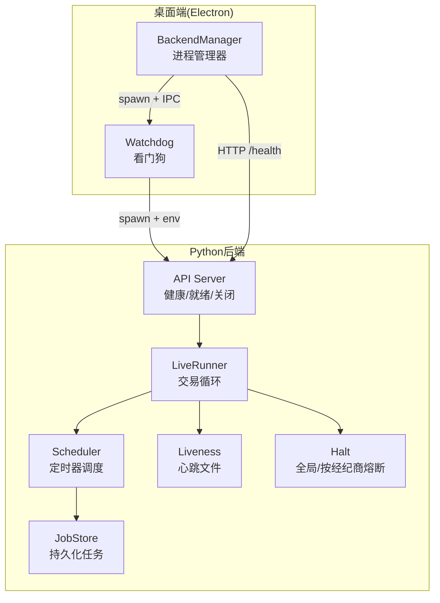
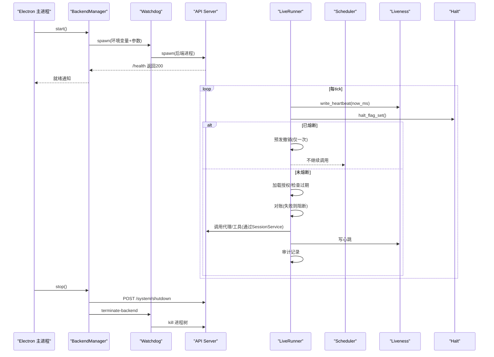
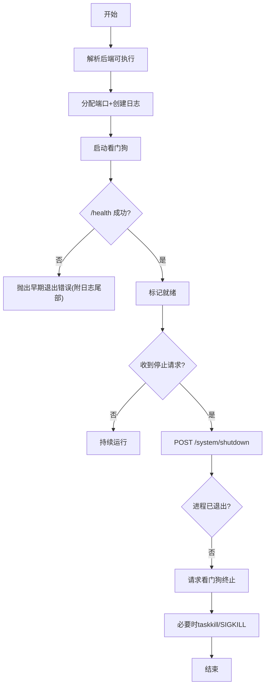
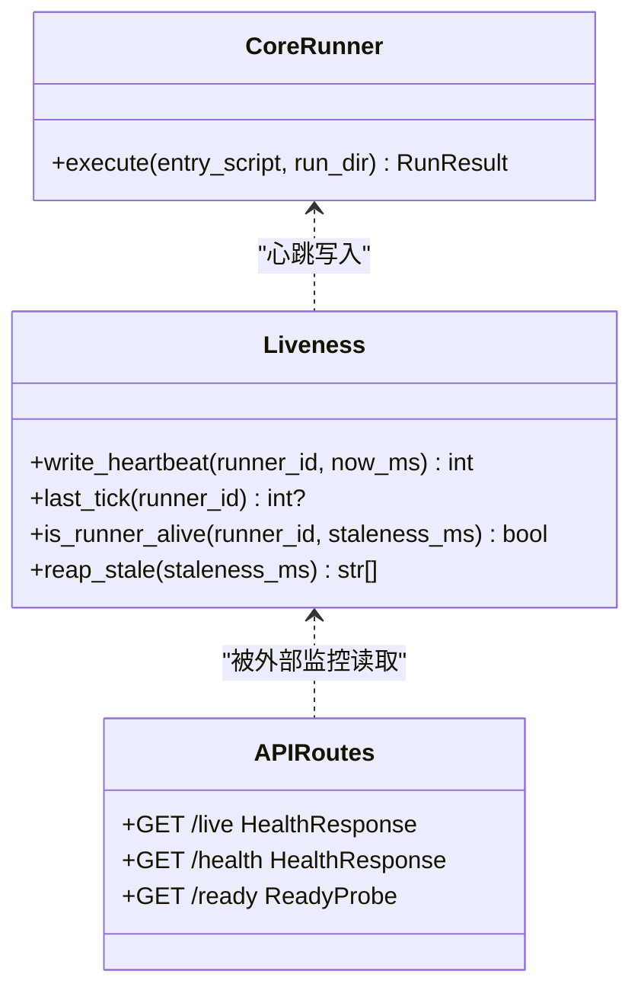
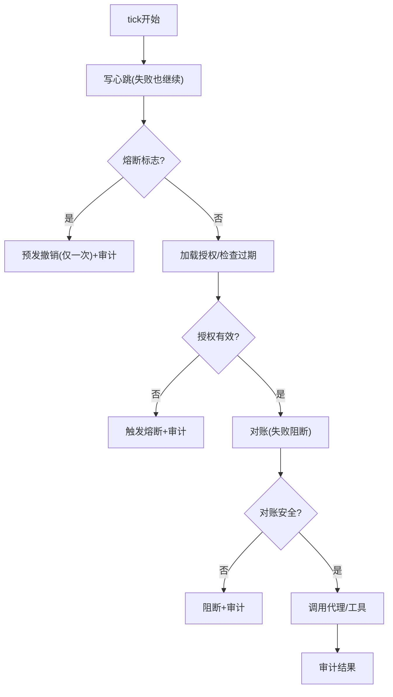
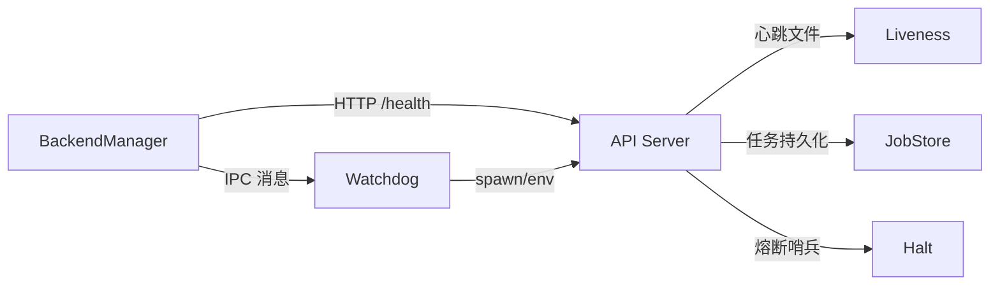
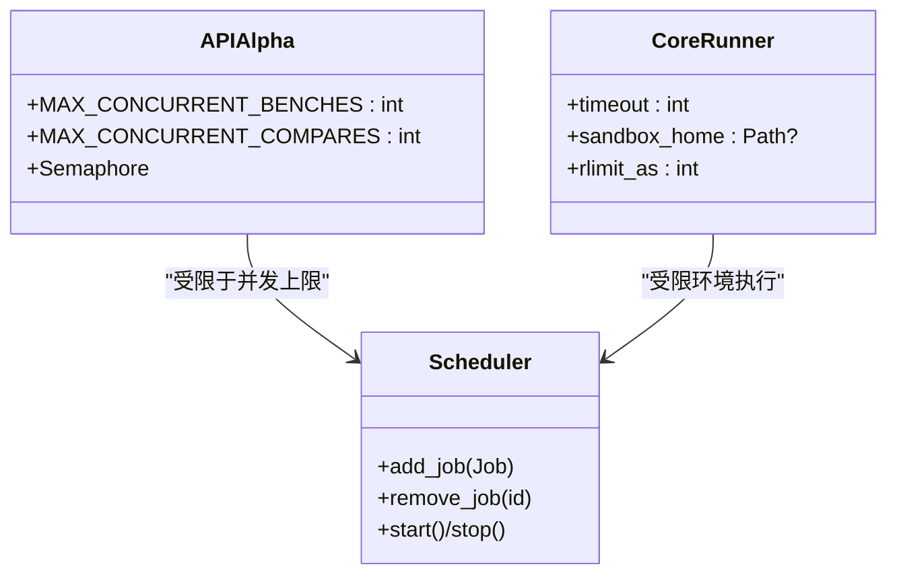
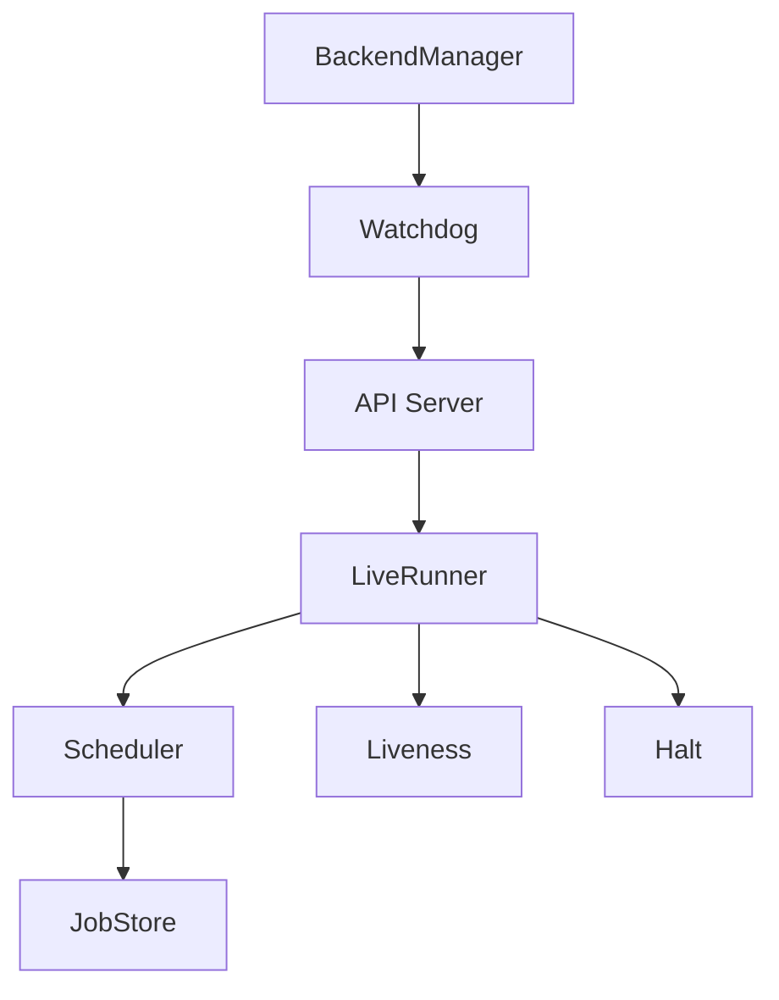

# 进程管理

<cite>
**本文引用的文件**
- [runner.py](file://agent/src/live/runtime/runner.py)
- [scheduler.py](file://agent/src/live/runtime/scheduler.py)
- [jobstore.py](file://agent/src/live/runtime/jobstore.py)
- [liveness.py](file://agent/src/live/runtime/liveness.py)
- [halt.py](file://agent/src/live/halt.py)
- [backend-manager.ts](file://desktop/electron/src/backend-manager.ts)
- [backend-watchdog.ts](file://desktop/electron/src/backend-watchdog.ts)
- [system_routes.py](file://agent/src/api/system_routes.py)
- [core_runner.py](file://agent/src/core/runner.py)
- [THREAT_MODEL.md](file://desktop/electron/THREAT_MODEL.md)
</cite>

## 目录
1. [简介](#简介)
2. [项目结构](#项目结构)
3. [核心组件](#核心组件)
4. [架构总览](#架构总览)
5. [详细组件分析](#详细组件分析)
6. [依赖关系分析](#依赖关系分析)
7. [性能考量](#性能考量)
8. [故障排查指南](#故障排查指南)
9. [结论](#结论)
10. [附录](#附录)

## 简介
本技术文档聚焦于该交易系统的“进程管理”能力，覆盖以下关键主题：
- 进程生命周期管理：启动、停止、重启与状态转换
- 进程监控机制：健康检查、心跳、资源限制、异常检测
- 故障恢复策略：自动重启、优雅降级、数据一致性保证（对账、幂等）
- 进程间通信与协调：IPC、消息总线、调度器与任务分发
- 进程池管理与负载均衡：并发控制、限流与隔离
- 调试工具与日志收集：结构化日志、审计原链、可观测性
- 大规模交易系统中的最佳实践：安全、稳健性与可运维性

## 项目结构
系统包含两类关键进程：
- Python 后端服务（API + 实时交易运行器）：负责策略执行、订单路由、对账、心跳与审计
- Electron 桌面端：负责进程编排、守护、健康探测、日志采集与优雅关闭

图表来源
- [backend-manager.ts:63-145](file://desktop/electron/src/backend-manager.ts#L63-L145)
- [backend-watchdog.ts:31-68](file://desktop/electron/src/backend-watchdog.ts#L31-L68)
- [system_routes.py:242-266](file://agent/src/api/system_routes.py#L242-L266)
- [runner.py:288-398](file://agent/src/live/runtime/runner.py#L288-L398)
- [scheduler.py:178-218](file://agent/src/live/runtime/scheduler.py#L178-L218)
- [jobstore.py:76-123](file://agent/src/live/runtime/jobstore.py#L76-L123)
- [liveness.py:79-100](file://agent/src/live/runtime/liveness.py#L79-L100)
- [halt.py:72-108](file://agent/src/live/halt.py#L72-L108)

章节来源
- [backend-manager.ts:63-145](file://desktop/electron/src/backend-manager.ts#L63-L145)
- [backend-watchdog.ts:31-68](file://desktop/electron/src/backend-watchdog.ts#L31-L68)
- [system_routes.py:242-266](file://agent/src/api/system_routes.py#L242-L266)
- [runner.py:288-398](file://agent/src/live/runtime/runner.py#L288-L398)
- [scheduler.py:178-218](file://agent/src/live/runtime/scheduler.py#L178-L218)
- [jobstore.py:76-123](file://agent/src/live/runtime/jobstore.py#L76-L123)
- [liveness.py:79-100](file://agent/src/live/runtime/liveness.py#L79-L100)
- [halt.py:72-108](file://agent/src/live/halt.py#L72-L108)

## 核心组件
- 桌面端 BackendManager：发现并启动后端进程，等待健康就绪，记录日志，处理意外退出，提供优雅关闭流程
- 看门狗 Watchdog：独立子进程，负责启动/监控/终止后端进程树，监听父进程存活与IPC信号
- LiveRunner：每tick的固定顺序执行（停机→授权过期→对账→调用→审计），内置心跳与预发撤销
- Scheduler：基于事件循环的定时器调度器，支持间隔/一次性任务，具备最大重检周期保护
- JobStore：原子写入、损坏隔离、崩溃恢复的任务持久化存储
- Liveness：心跳文件读写与陈旧清理，用于外部判定进程是否存活
- Halt：文件系统级熔断开关（全局/按经纪商），触发预发撤销与审计
- API System Routes：/live、/health、/ready 探针与关闭入口

章节来源
- [backend-manager.ts:63-145](file://desktop/electron/src/backend-manager.ts#L63-L145)
- [backend-watchdog.ts:31-68](file://desktop/electron/src/backend-watchdog.ts#L31-L68)
- [runner.py:288-398](file://agent/src/live/runtime/runner.py#L288-L398)
- [scheduler.py:178-218](file://agent/src/live/runtime/scheduler.py#L178-L218)
- [jobstore.py:76-123](file://agent/src/live/runtime/jobstore.py#L76-L123)
- [liveness.py:79-100](file://agent/src/live/runtime/liveness.py#L79-L100)
- [halt.py:72-108](file://agent/src/live/halt.py#L72-L108)
- [system_routes.py:242-266](file://agent/src/api/system_routes.py#L242-L266)

## 架构总览
下图展示了从桌面端到Python后端的进程协作关系，以及交易运行器的内部调度与监控。

图表来源
- [backend-manager.ts:63-145](file://desktop/electron/src/backend-manager.ts#L63-L145)
- [backend-manager.ts:148-187](file://desktop/electron/src/backend-manager.ts#L148-L187)
- [backend-watchdog.ts:31-68](file://desktop/electron/src/backend-watchdog.ts#L31-L68)
- [system_routes.py:242-266](file://agent/src/api/system_routes.py#L242-L266)
- [runner.py:407-441](file://agent/src/live/runtime/runner.py#L407-L441)
- [liveness.py:79-100](file://agent/src/live/runtime/liveness.py#L79-L100)
- [halt.py:135-163](file://agent/src/live/halt.py#L135-L163)

## 详细组件分析

### 进程生命周期管理（启动/停止/重启）
- 启动
  - 桌面端解析后端可执行路径与环境，分配本地端口，启动看门狗，再启动后端进程
  - 后端暴露 /health 与 /ready；桌面端轮询直到健康
- 停止
  - 先调用 /system/shutdown 进行优雅关闭
  - 若未退出，向看门狗发送 terminate-backend，必要时强制终止进程树
- 重启
  - 看门狗在父进程死亡或IPC断开时主动终止后端
  - 桌面端可在需要时重新调用 start() 拉起新进程

图表来源
- [backend-manager.ts:63-145](file://desktop/electron/src/backend-manager.ts#L63-L145)
- [backend-manager.ts:148-187](file://desktop/electron/src/backend-manager.ts#L148-L187)
- [backend-watchdog.ts:31-68](file://desktop/electron/src/backend-watchdog.ts#L31-L68)
- [system_routes.py:242-266](file://agent/src/api/system_routes.py#L242-L266)

章节来源
- [backend-manager.ts:63-145](file://desktop/electron/src/backend-manager.ts#L63-L145)
- [backend-manager.ts:148-187](file://desktop/electron/src/backend-manager.ts#L148-L187)
- [backend-watchdog.ts:31-68](file://desktop/electron/src/backend-watchdog.ts#L31-L68)
- [system_routes.py:242-266](file://agent/src/api/system_routes.py#L242-L266)

### 进程监控机制（健康检查/资源使用/异常检测）
- 健康检查
  - /live：轻量存活探针
  - /health：兼容旧监控
  - /ready：就绪探针（校验LLM提供者可用性）
- 心跳与存活
  - 每个tick写心跳文件；超过阈值视为陈旧，由reaper清理
- 资源限制
  - 回测子进程采用RLIMIT_AS与NOFILE限制，防止DoS与资源泄漏
  - 子进程HOME沙箱化，最小化敏感信息泄露面
- 异常检测
  - 看门狗捕获后端错误并上报
  - 调度器对on_fire异常吞掉并记录，避免单任务影响整体
  - 对账失败直接阻断交易，避免不一致状态进入下单路径

图表来源
- [liveness.py:79-100](file://agent/src/live/runtime/liveness.py#L79-L100)
- [system_routes.py:242-266](file://agent/src/api/system_routes.py#L242-L266)
- [core_runner.py:510-627](file://agent/src/core/runner.py#L510-L627)

章节来源
- [system_routes.py:242-266](file://agent/src/api/system_routes.py#L242-L266)
- [liveness.py:79-100](file://agent/src/live/runtime/liveness.py#L79-L100)
- [core_runner.py:510-627](file://agent/src/core/runner.py#L510-L627)

### 故障恢复策略（自动重启/优雅降级/数据一致性）
- 自动重启
  - 看门狗在父进程死亡或IPC断开时终止后端；桌面端可重试拉起
- 优雅降级
  - 心跳写入失败不影响交易决策（仅记录警告）
  - 对账失败阻断交易，避免不安全状态
  - 授权过期立即触发熔断，阻止后续调用
- 数据一致性
  - 对账模块在每次tick前拉取经纪商真实状态，拒绝模糊/不安全状态
  - 任务持久化采用原子写入与损坏隔离，崩溃后恢复完整任务集
  - 预发撤销仅在首次熔断时执行一次，避免重复平仓

图表来源
- [runner.py:407-441](file://agent/src/live/runtime/runner.py#L407-L441)
- [runner.py:550-564](file://agent/src/live/runtime/runner.py#L550-L564)
- [runner.py:544-595](file://agent/src/live/runtime/runner.py#L544-L595)
- [jobstore.py:124-152](file://agent/src/live/runtime/jobstore.py#L124-L152)
- [halt.py:135-163](file://agent/src/live/halt.py#L135-L163)

章节来源
- [runner.py:407-441](file://agent/src/live/runtime/runner.py#L407-L441)
- [runner.py:550-564](file://agent/src/live/runtime/runner.py#L550-L564)
- [runner.py:544-595](file://agent/src/live/runtime/runner.py#L544-L595)
- [jobstore.py:124-152](file://agent/src/live/runtime/jobstore.py#L124-L152)
- [halt.py:135-163](file://agent/src/live/halt.py#L135-L163)

### 进程间通信与协调机制
- 桌面端与后端
  - HTTP：/health、/ready、/system/shutdown
  - IPC：看门狗与桌面端通过子进程消息通道通信
- 内部协调
  - 调度器：事件循环驱动，维护任务集合，周期性唤醒
  - 任务持久化：JobStore 原子保存/加载，崩溃恢复
  - 心跳：文件级心跳供外部监控判定存活
  - 熔断：文件系统哨兵，跨进程生效

图表来源
- [backend-manager.ts:63-145](file://desktop/electron/src/backend-manager.ts#L63-L145)
- [backend-watchdog.ts:31-68](file://desktop/electron/src/backend-watchdog.ts#L31-L68)
- [liveness.py:79-100](file://agent/src/live/runtime/liveness.py#L79-L100)
- [jobstore.py:124-152](file://agent/src/live/runtime/jobstore.py#L124-L152)
- [halt.py:72-108](file://agent/src/live/halt.py#L72-L108)

章节来源
- [backend-manager.ts:63-145](file://desktop/electron/src/backend-manager.ts#L63-L145)
- [backend-watchdog.ts:31-68](file://desktop/electron/src/backend-watchdog.ts#L31-L68)
- [liveness.py:79-100](file://agent/src/live/runtime/liveness.py#L79-L100)
- [jobstore.py:124-152](file://agent/src/live/runtime/jobstore.py#L124-L152)
- [halt.py:72-108](file://agent/src/live/halt.py#L72-L108)

### 进程池管理与负载均衡策略
- 并发控制
  - API层对基准测试与对比计算设置并发上限（信号量），防止DoS
- 隔离与限流
  - 回测子进程使用沙箱HOME、UID降权、RLIMIT_AS/NOFILE限制
  - 调度器对单个任务异常吞掉，避免阻塞其他任务
- 负载分布
  - 调度器按next_run_at排序触发，优先处理到期任务
  - 任务持久化确保重启后恢复相同节奏

图表来源
- [alpha_routes.py:61-95](file://agent/src/api/alpha_routes.py#L61-L95)
- [core_runner.py:510-627](file://agent/src/core/runner.py#L510-L627)
- [scheduler.py:178-218](file://agent/src/live/runtime/scheduler.py#L178-L218)

章节来源
- [alpha_routes.py:61-95](file://agent/src/api/alpha_routes.py#L61-L95)
- [core_runner.py:510-627](file://agent/src/core/runner.py#L510-L627)
- [scheduler.py:178-218](file://agent/src/live/runtime/scheduler.py#L178-L218)

### 调试工具与日志收集方案
- 日志
  - 桌面端将标准输出/错误追加到按日命名的日志文件
  - 看门狗与后端均记录关键事件（启动、错误、退出原因）
- 审计
  - 交易运行器为每个tick写入审计记录，包含意图与结果
- 可观测性
  - /live、/health、/ready 探针便于容器编排与健康检查
  - 心跳文件供外部判定进程存活与陈旧清理

章节来源
- [backend-manager.ts:92-100](file://desktop/electron/src/backend-manager.ts#L92-L100)
- [backend-manager.ts:288-304](file://desktop/electron/src/backend-manager.ts#L288-L304)
- [backend-watchdog.ts:31-68](file://desktop/electron/src/backend-watchdog.ts#L31-L68)
- [runner.py:832-867](file://agent/src/live/runtime/runner.py#L832-L867)
- [system_routes.py:242-266](file://agent/src/api/system_routes.py#L242-L266)
- [liveness.py:79-100](file://agent/src/live/runtime/liveness.py#L79-L100)

## 依赖关系分析
- 桌面端依赖
  - 后端可执行发现、端口分配、健康探测、日志落盘
  - 看门狗作为中间层，解耦父子进程生命周期
- 后端依赖
  - 调度器与任务持久化：保障定时任务与崩溃恢复
  - 心跳与熔断：对外可观测性与安全边界
  - 对账：保证交易前状态一致
- 耦合度
  - 各组件通过明确接口与文件协议交互（心跳文件、HTTP、IPC、文件系统哨兵）
  - 低耦合高内聚：调度与持久化分离，心跳与交易逻辑解耦

图表来源
- [backend-manager.ts:63-145](file://desktop/electron/src/backend-manager.ts#L63-L145)
- [backend-watchdog.ts:31-68](file://desktop/electron/src/backend-watchdog.ts#L31-L68)
- [runner.py:288-398](file://agent/src/live/runtime/runner.py#L288-L398)
- [scheduler.py:178-218](file://agent/src/live/runtime/scheduler.py#L178-L218)
- [jobstore.py:76-123](file://agent/src/live/runtime/jobstore.py#L76-L123)
- [liveness.py:79-100](file://agent/src/live/runtime/liveness.py#L79-L100)
- [halt.py:72-108](file://agent/src/live/halt.py#L72-L108)

章节来源
- [backend-manager.ts:63-145](file://desktop/electron/src/backend-manager.ts#L63-L145)
- [backend-watchdog.ts:31-68](file://desktop/electron/src/backend-watchdog.ts#L31-L68)
- [runner.py:288-398](file://agent/src/live/runtime/runner.py#L288-L398)
- [scheduler.py:178-218](file://agent/src/live/runtime/scheduler.py#L178-L218)
- [jobstore.py:76-123](file://agent/src/live/runtime/jobstore.py#L76-L123)
- [liveness.py:79-100](file://agent/src/live/runtime/liveness.py#L79-L100)
- [halt.py:72-108](file://agent/src/live/halt.py#L72-L108)

## 性能考量
- 调度器睡眠上限：避免远未来任务导致长时间休眠，定期重检以防御时钟跳变与挂起恢复漂移
- 心跳写入失败不阻断交易：保证交易优先级高于可观测性
- 对账失败阻断交易：宁可少做也不做错，避免不一致状态进入下单路径
- 并发上限：基准测试与对比计算限制并发，防止资源耗尽
- 资源限制：子进程地址空间与文件描述符限制，降低DoS风险

章节来源
- [scheduler.py:132-153](file://agent/src/live/runtime/scheduler.py#L132-L153)
- [runner.py:550-564](file://agent/src/live/runtime/runner.py#L550-L564)
- [runner.py:465-508](file://agent/src/live/runtime/runner.py#L465-L508)
- [alpha_routes.py:61-95](file://agent/src/api/alpha_routes.py#L61-L95)
- [core_runner.py:510-627](file://agent/src/core/runner.py#L510-L627)

## 故障排查指南
- 后端无法启动
  - 检查 /health 与 /ready 响应
  - 查看桌面端日志尾部（最近20行）
  - 确认看门狗是否收到 backend-started 消息
- 进程意外退出
  - 查看看门狗日志中的退出码与信号
  - 检查父进程PID存活与IPC连接
  - 必要时手动终止进程树
- 交易未执行
  - 检查熔断哨兵是否存在（全局/按经纪商）
  - 检查心跳是否更新（判断是否卡死）
  - 查看对账结果与审计记录
- 任务丢失
  - 检查 JobStore 是否损坏（会被隔离为 .corrupt-*）
  - 确认重启后任务是否恢复

章节来源
- [backend-manager.ts:261-286](file://desktop/electron/src/backend-manager.ts#L261-L286)
- [backend-manager.ts:288-304](file://desktop/electron/src/backend-manager.ts#L288-L304)
- [backend-watchdog.ts:31-68](file://desktop/electron/src/backend-watchdog.ts#L31-L68)
- [runner.py:465-508](file://agent/src/live/runtime/runner.py#L465-L508)
- [jobstore.py:153-181](file://agent/src/live/runtime/jobstore.py#L153-L181)
- [liveness.py:127-151](file://agent/src/live/runtime/liveness.py#L127-L151)
- [halt.py:135-163](file://agent/src/live/halt.py#L135-L163)

## 结论
该系统在进程管理方面实现了多层防护与可观测性：
- 明确的进程生命周期管理，配合看门狗与HTTP探针，确保可靠启停与健康判定
- 严格的交易前对账与熔断机制，保证数据一致性与风险控制
- 原子持久化与损坏隔离，提升崩溃恢复能力
- 资源限制与并发控制，增强系统鲁棒性
- 完善的日志与审计，便于问题定位与合规追溯

这些设计共同支撑了大规模交易场景下的稳定运行与可运维性。

## 附录
- 威胁模型要点（进程生命周期）
  - 单一实例约束
  - 健康探测与早期退出告警
  - 看门狗守护与父进程死亡检测
  - 优雅关闭与强制终止兜底
  - 自动化冒烟测试验证进程树清理

章节来源
- [THREAT_MODEL.md:105-122](file://desktop/electron/THREAT_MODEL.md#L105-L122)