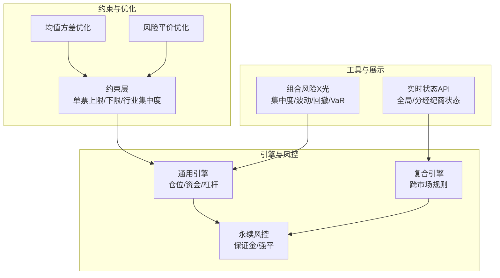
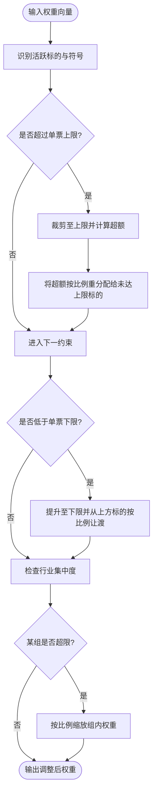
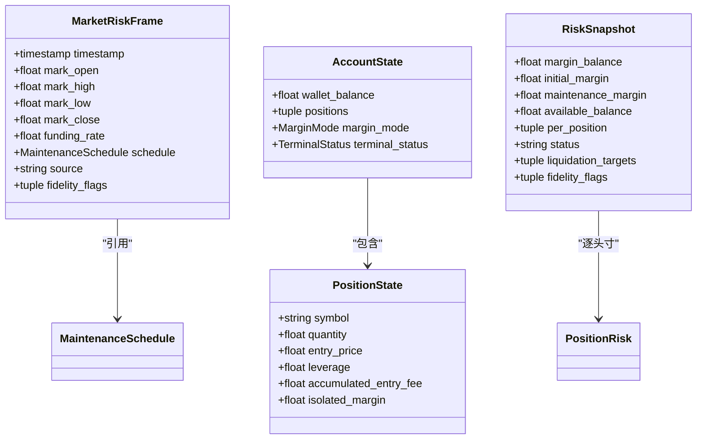
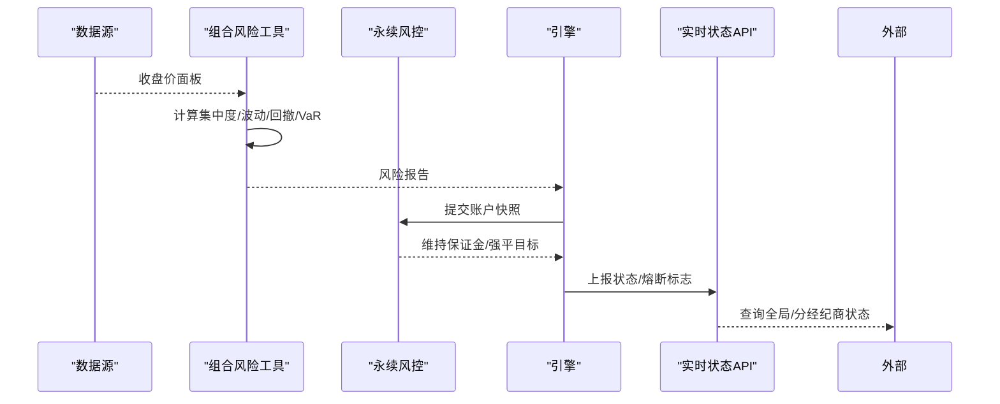
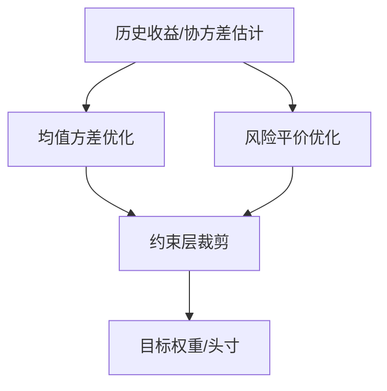
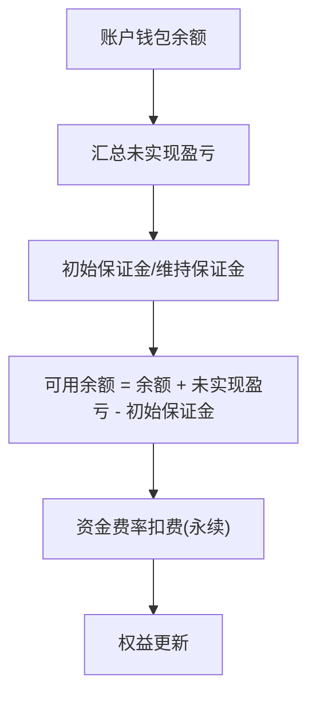
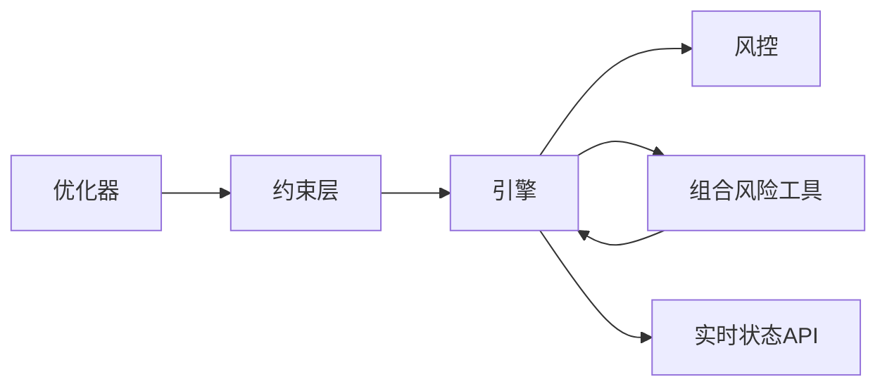

# 仓位管理

<cite>
**本文引用的文件**
- [constraints.py](file://agent/backtest/constraints.py)
- [limits.py](file://agent/src/config/limits.py)
- [perpetual_risk.py](file://agent/backtest/perpetual_risk.py)
- [base.py](file://agent/backtest/engines/base.py)
- [composite.py](file://agent/backtest/engines/composite.py)
- [crypto.py](file://agent/backtest/engines/crypto.py)
- [risk_parity.py](file://agent/backtest/optimizers/risk_parity.py)
- [mean_variance.py](file://agent/backtest/optimizers/mean_variance.py)
- [portfolio_risk_tool.py](file://agent/src/tools/portfolio_risk_tool.py)
- [options_portfolio.py](file://agent/backtest/engines/options_portfolio.py)
- [SKILL.md](file://agent/src/skills/asset-allocation/SKILL.md)
- [etf_allocation_desk.yaml](file://agent/src/swarm/presets/etf_allocation_desk.yaml)
- [live_routes.py](file://agent/src/api/live_routes.py)
</cite>

## 目录
1. [简介](#简介)
2. [项目结构](#项目结构)
3. [核心组件](#核心组件)
4. [架构总览](#架构总览)
5. [详细组件分析](#详细组件分析)
6. [依赖关系分析](#依赖关系分析)
7. [性能考量](#性能考量)
8. [故障排查指南](#故障排查指南)
9. [结论](#结论)
10. [附录](#附录)

## 简介
本技术文档围绕“仓位管理”展开，系统性说明最大持仓限制的实现机制、仓位计算逻辑（市值、杠杆、风险敞口）、监控与预警体系、优化算法（资产配置模型、风险平价、均值方差等），以及仓位与资金的关系（可用资金、保证金、融资成本）。同时给出配置管理与动态调整方法，并结合实际交易场景展示效果评估思路。

## 项目结构
仓库中与仓位管理相关的代码主要分布在以下模块：
- 约束与权重裁剪：backtest/constraints.py
- 永续合约与账户风控：backtest/perpetual_risk.py
- 引擎与执行：backtest/engines/base.py, composite.py, crypto.py
- 优化器：backtest/optimizers/risk_parity.py, mean_variance.py
- 组合风险工具：src/tools/portfolio_risk_tool.py
- 期权组合回测：backtest/engines/options_portfolio.py
- 资产分配技能与策略提示词：src/skills/asset-allocation/SKILL.md, src/swarm/presets/etf_allocation_desk.yaml
- 运行时限制与状态接口：src/config/limits.py, src/api/live_routes.py



图表来源
- [constraints.py:1-206](file://agent/backtest/constraints.py#L1-L206)
- [risk_parity.py:1-60](file://agent/backtest/optimizers/risk_parity.py#L1-L60)
- [mean_variance.py:1-70](file://agent/backtest/optimizers/mean_variance.py#L1-L70)
- [perpetual_risk.py:1-418](file://agent/backtest/perpetual_risk.py#L1-L418)
- [base.py:1967-2002](file://agent/backtest/engines/base.py#L1967-L2002)
- [composite.py:212-245](file://agent/backtest/engines/composite.py#L212-L245)
- [portfolio_risk_tool.py:1-195](file://agent/src/tools/portfolio_risk_tool.py#L1-L195)
- [live_routes.py:146-183](file://agent/src/api/live_routes.py#L146-L183)

章节来源
- [constraints.py:1-206](file://agent/backtest/constraints.py#L1-L206)
- [perpetual_risk.py:1-418](file://agent/backtest/perpetual_risk.py#L1-L418)
- [base.py:1967-2002](file://agent/backtest/engines/base.py#L1967-L2002)
- [composite.py:212-245](file://agent/backtest/engines/composite.py#L212-L245)
- [risk_parity.py:1-60](file://agent/backtest/optimizers/risk_parity.py#L1-L60)
- [mean_variance.py:1-70](file://agent/backtest/optimizers/mean_variance.py#L1-L70)
- [portfolio_risk_tool.py:1-195](file://agent/src/tools/portfolio_risk_tool.py#L1-L195)
- [live_routes.py:146-183](file://agent/src/api/live_routes.py#L146-L183)

## 核心组件
- 约束层（单票上限/下限、行业集中度）：对优化器输出的权重进行逐行裁剪与再分配，保证长/短仓符号方向不变，仅调整规模。
- 永续风控（保证金/强平）：基于逐标的维护保证金阶梯与账户模式（逐仓/全仓），计算维持保证金、可用余额与强平目标。
- 引擎执行（仓位/资金/杠杆）：在回测中按目标调仓，记录成交、费用、杠杆释放的保证金与PnL，更新权益。
- 优化器（均值方差/风险平价）：提供多资产权重求解，支持滚动窗口估计与约束后处理。
- 组合风险工具：拉取历史收盘价，计算集中度（HHI/有效N）、年化波动、最大回撤、VaR/ES、分散化比率与相关性/Beta。
- 期权组合：按BS定价与希腊字母聚合，支持美式提前行权启发式与到期结算。
- 实时状态接口：暴露全局与分经纪商运行状态，便于监控与熔断。

章节来源
- [constraints.py:1-206](file://agent/backtest/constraints.py#L1-L206)
- [perpetual_risk.py:1-418](file://agent/backtest/perpetual_risk.py#L1-L418)
- [base.py:1967-2002](file://agent/backtest/engines/base.py#L1967-L2002)
- [risk_parity.py:1-60](file://agent/backtest/optimizers/risk_parity.py#L1-L60)
- [mean_variance.py:1-70](file://agent/backtest/optimizers/mean_variance.py#L1-L70)
- [portfolio_risk_tool.py:1-195](file://agent/src/tools/portfolio_risk_tool.py#L1-L195)
- [options_portfolio.py:173-517](file://agent/backtest/engines/options_portfolio.py#L173-L517)
- [live_routes.py:146-183](file://agent/src/api/live_routes.py#L146-L183)

## 架构总览
仓位管理的整体流程如下：
- 信号/优化器生成目标权重或头寸
- 约束层对权重进行单票上限/下限与行业集中度裁剪
- 引擎将权重转换为具体订单，考虑杠杆与保证金
- 永续风控模块在每个时点评估维持保证金与强平风险
- 组合风险工具输出集中度、波动、回撤、尾部风险等指标
- 实时状态接口对外暴露系统健康度与熔断开关

```mermaid
sequenceDiagram
participant Opt as "优化器"
participant Con as "约束层"
participant Eng as "引擎"
participant Risk as "永续风控"
participant Tool as "组合风险工具"
participant API as "实时状态API"
Opt->>Con : 输出权重/头寸
Con-->>Eng : 调整后权重
Eng->>Eng : 计算市值/杠杆/保证金
Eng->>Risk : 提交账户快照
Risk-->>Eng : 维持保证金/强平目标
Eng->>Tool : 请求组合风险X光
Tool-->>Eng : 集中度/波动/回撤/VaR
Eng->>API : 上报运行状态/熔断
API-->>外部 : 查询全局/分经纪商状态
```

图表来源
- [risk_parity.py:1-60](file://agent/backtest/optimizers/risk_parity.py#L1-L60)
- [mean_variance.py:1-70](file://agent/backtest/optimizers/mean_variance.py#L1-L70)
- [constraints.py:1-206](file://agent/backtest/constraints.py#L1-L206)
- [base.py:1967-2002](file://agent/backtest/engines/base.py#L1967-L2002)
- [perpetual_risk.py:1-418](file://agent/backtest/perpetual_risk.py#L1-L418)
- [portfolio_risk_tool.py:1-195](file://agent/src/tools/portfolio_risk_tool.py#L1-L195)
- [live_routes.py:146-183](file://agent/src/api/live_routes.py#L146-L183)

## 详细组件分析

### 最大持仓限制实现机制
- 单票仓位上限：MaxWeight类对超过阈值的权重按比例裁剪，并将超额部分重新分配给未达上限的标的，保持方向与零值不变。
- 单票仓位下限：MinWeight类将低于阈值的活跃头寸提升至下限，资金由高于下限的头寸按比例让渡；若无法支撑则退化为等权。
- 行业集中度限制：GroupExposure类按组映射汇总权重并施加组级上限，超限时按比例缩放，不向其他组重分配以避免破坏其他组约束。
- 应用方式：对优化器输出的带符号权重矩阵逐行处理，先提取活跃标的与符号，再对绝对值应用约束，最后恢复符号。



图表来源
- [constraints.py:48-129](file://agent/backtest/constraints.py#L48-L129)
- [constraints.py:180-206](file://agent/backtest/constraints.py#L180-L206)

章节来源
- [constraints.py:1-206](file://agent/backtest/constraints.py#L1-L206)

### 仓位计算逻辑（市值、杠杆、风险敞口）
- 市值与名义价值：根据头寸数量与标记价格计算名义价值，用于保证金与风险度量。
- 杠杆率：通过头寸名义价值与初始保证金的比例体现；引擎在减仓时按杠杆释放相应保证金。
- 风险敞口评估：结合未实现盈亏、维持保证金与账户模式（逐仓/全仓）计算可用余额与强平风险。



图表来源
- [perpetual_risk.py:132-179](file://agent/backtest/perpetual_risk.py#L132-L179)
- [perpetual_risk.py:194-272](file://agent/backtest/perpetual_risk.py#L194-L272)
- [perpetual_risk.py:335-354](file://agent/backtest/perpetual_risk.py#L335-L354)

章节来源
- [perpetual_risk.py:132-179](file://agent/backtest/perpetual_risk.py#L132-L179)
- [perpetual_risk.py:181-191](file://agent/backtest/perpetual_risk.py#L181-L191)
- [perpetual_risk.py:274-332](file://agent/backtest/perpetual_risk.py#L274-L332)
- [base.py:1967-2002](file://agent/backtest/engines/base.py#L1967-L2002)

### 仓位监控与预警系统
- 实时仓位跟踪：通过组合风险工具拉取近期收盘价，计算集中度（HHI/有效N）、年化波动、最大回撤、历史VaR/预期短缺、分散化比率与相关性/Beta。
- 超限检测：约束层在每根K线/交易日对权重进行裁剪，确保单票与行业集中度不超过阈值；永续风控在每时点评估维持保证金与强平目标。
- 自动减仓建议：当检测到强平风险或集中度超标时，可依据约束与风控结果生成减仓指令（例如优先削减高风险或高集中度的头寸）。



图表来源
- [portfolio_risk_tool.py:84-131](file://agent/src/tools/portfolio_risk_tool.py#L84-L131)
- [perpetual_risk.py:357-418](file://agent/backtest/perpetual_risk.py#L357-L418)
- [live_routes.py:146-183](file://agent/src/api/live_routes.py#L146-L183)

章节来源
- [portfolio_risk_tool.py:1-195](file://agent/src/tools/portfolio_risk_tool.py#L1-L195)
- [perpetual_risk.py:357-418](file://agent/backtest/perpetual_risk.py#L357-L418)
- [live_routes.py:146-183](file://agent/src/api/live_routes.py#L146-L183)

### 仓位优化算法（资产配置模型、风险平价、均值方差）
- 均值方差优化：最大化夏普比率，使用滚动窗口估计均值与协方差矩阵，施加非负权重与和为1的约束。
- 风险平价：使各资产对组合风险的贡献相等，迭代求解权重，适合长期稳健配置。
- 约束后处理：优化器输出经约束层进行单票上下限与行业集中度裁剪，避免极端权重与过度集中。
- 配置指引：资产分配技能文档提供了五种优化器的使用指南与参数说明，便于在config.json中启用与调参。



图表来源
- [mean_variance.py:11-56](file://agent/backtest/optimizers/mean_variance.py#L11-L56)
- [risk_parity.py:11-49](file://agent/backtest/optimizers/risk_parity.py#L11-L49)
- [constraints.py:48-129](file://agent/backtest/constraints.py#L48-L129)
- [SKILL.md:89-197](file://agent/src/skills/asset-allocation/SKILL.md#L89-L197)

章节来源
- [mean_variance.py:1-70](file://agent/backtest/optimizers/mean_variance.py#L1-L70)
- [risk_parity.py:1-60](file://agent/backtest/optimizers/risk_parity.py#L1-L60)
- [constraints.py:1-206](file://agent/backtest/constraints.py#L1-L206)
- [SKILL.md:89-197](file://agent/src/skills/asset-allocation/SKILL.md#L89-L197)

### 仓位与资金的关系（可用资金、保证金、融资成本）
- 可用资金：账户钱包余额加未实现盈亏（全仓模式下），减去初始保证金即为可用余额。
- 保证金要求：逐仓模式下每个头寸独立计算维持保证金；全仓模式下按组合汇总维持保证金。
- 融资成本：加密货币永续合约按固定或数据驱动的资金费率收取，影响资本与权益路径。
- 引擎侧：减仓时按杠杆释放保证金，计入已实现盈亏与交易费用，更新权益。



图表来源
- [perpetual_risk.py:335-354](file://agent/backtest/perpetual_risk.py#L335-L354)
- [perpetual_risk.py:357-418](file://agent/backtest/perpetual_risk.py#L357-L418)
- [composite.py:212-245](file://agent/backtest/engines/composite.py#L212-L245)
- [base.py:1967-2002](file://agent/backtest/engines/base.py#L1967-L2002)

章节来源
- [perpetual_risk.py:335-354](file://agent/backtest/perpetual_risk.py#L335-L354)
- [perpetual_risk.py:357-418](file://agent/backtest/perpetual_risk.py#L357-L418)
- [composite.py:212-245](file://agent/backtest/engines/composite.py#L212-L245)
- [base.py:1967-2002](file://agent/backtest/engines/base.py#L1967-L2002)

### 仓位配置管理与动态调整
- 约束配置：通过配置文件声明单票上限/下限与行业分组及上限，约束层按顺序生效，保证长/短仓方向一致。
- 优化器选择：在配置中启用均值方差或风险平价等优化器，并设置滚动窗口、无风险利率等参数。
- 动态调整：在回测或实盘中，按日/周期重新估计统计量，重新优化并应用约束，触发调仓。
- ETF/FoF场景：策略提示词中包含风险平价、等波动率、最大分散化等方法的对比与约束设计，便于构建稳健的多资产组合。

章节来源
- [constraints.py:1-206](file://agent/backtest/constraints.py#L1-L206)
- [SKILL.md:89-197](file://agent/src/skills/asset-allocation/SKILL.md#L89-L197)
- [etf_allocation_desk.yaml:145-167](file://agent/src/swarm/presets/etf_allocation_desk.yaml#L145-L167)

### 实际应用与效果评估
- 应用场景：股票/ETF多资产配置、加密货币永续合约风险管理、期权策略组合的风险与希腊字母监控。
- 效果评估：通过组合风险工具输出集中度、波动、回撤、VaR/ES等指标，结合约束与风控结果评估策略稳健性；在回测中比较不同优化器与约束组合的表现。
- 期权组合：按BS定价与希腊字母聚合，支持美式提前行权启发式与到期结算，输出权益曲线与希腊字母序列。

章节来源
- [portfolio_risk_tool.py:1-195](file://agent/src/tools/portfolio_risk_tool.py#L1-L195)
- [options_portfolio.py:173-517](file://agent/backtest/engines/options_portfolio.py#L173-L517)
- [SKILL.md:89-197](file://agent/src/skills/asset-allocation/SKILL.md#L89-L197)

## 依赖关系分析
- 约束层依赖优化器输出，对权重进行逐行裁剪，不影响优化器内部实现。
- 引擎依赖约束层与风控模块，负责将权重转化为订单并更新资金与权益。
- 风控模块依赖市场快照与维护保证金表，计算维持保证金与强平目标。
- 组合风险工具依赖数据加载器，输出风险指标供引擎与监控使用。
- 实时状态接口暴露系统健康度，便于外部集成与熔断控制。



图表来源
- [constraints.py:1-206](file://agent/backtest/constraints.py#L1-L206)
- [base.py:1967-2002](file://agent/backtest/engines/base.py#L1967-L2002)
- [perpetual_risk.py:1-418](file://agent/backtest/perpetual_risk.py#L1-L418)
- [portfolio_risk_tool.py:1-195](file://agent/src/tools/portfolio_risk_tool.py#L1-L195)
- [live_routes.py:146-183](file://agent/src/api/live_routes.py#L146-L183)

章节来源
- [constraints.py:1-206](file://agent/backtest/constraints.py#L1-L206)
- [base.py:1967-2002](file://agent/backtest/engines/base.py#L1967-L2002)
- [perpetual_risk.py:1-418](file://agent/backtest/perpetual_risk.py#L1-L418)
- [portfolio_risk_tool.py:1-195](file://agent/src/tools/portfolio_risk_tool.py#L1-L195)
- [live_routes.py:146-183](file://agent/src/api/live_routes.py#L146-L183)

## 性能考量
- 约束层采用多次迭代裁剪与比例重分配，时间复杂度与活跃标的数线性相关，适用于大规模组合。
- 优化器使用数值优化（SLSQP），需注意协方差矩阵条件数与样本长度，避免过拟合与数值不稳定。
- 风控模块对每个头寸计算维持保证金，逐仓模式开销更高但隔离风险更清晰；全仓模式汇总计算更高效但需关注相关性风险。
- 组合风险工具在拉取数据后进行滚动统计，注意窗口长度与频率对延迟与精度的权衡。

## 故障排查指南
- 约束配置错误：如类型非法、范围越界、组映射缺失等，会在构建约束时报错；请检查配置项类型与取值范围。
- 风控数据不一致：市场快照的时间戳必须匹配，维护保证金表版本需与头寸标的一致；否则抛出异常。
- 引擎执行异常：减仓时杠杆释放与费用计算需保证正数与有限值；若出现NaN或无穷大，检查价格与成交量数据质量。
- 工具结果截断：工具返回结果过长会被截断并附带提示，建议在调用时缩小范围或使用分页参数。

章节来源
- [constraints.py:135-177](file://agent/backtest/constraints.py#L135-L177)
- [perpetual_risk.py:226-272](file://agent/backtest/perpetual_risk.py#L226-L272)
- [limits.py:1-49](file://agent/src/config/limits.py#L1-L49)

## 结论
本方案通过“优化器+约束层+引擎+风控+工具+接口”的分层架构，实现了从资产配置到执行与风控的闭环管理。单票与行业集中度约束保障组合稳健性；永续风控确保保证金与强平风险可控；组合风险工具提供多维度的风险可视化；实时状态接口便于系统集成与熔断控制。结合均值方差与风险平价等优化器，可在不同市场环境下灵活调整仓位，提升风险调整后收益。

## 附录
- 配置示例与参数说明可参考资产分配技能文档中的五种优化器与约束设计。
- 在ETF/FoF场景中，可结合策略提示词中的风险平价、等波动率与最大分散化方法进行组合构建与动态再平衡。
- 期权组合可通过BS定价与希腊字母聚合进行风险监测，支持美式提前行权与到期结算。