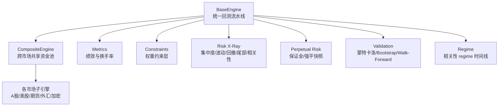
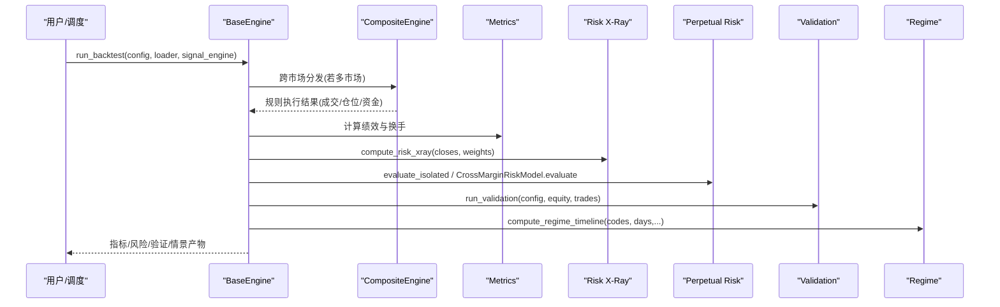
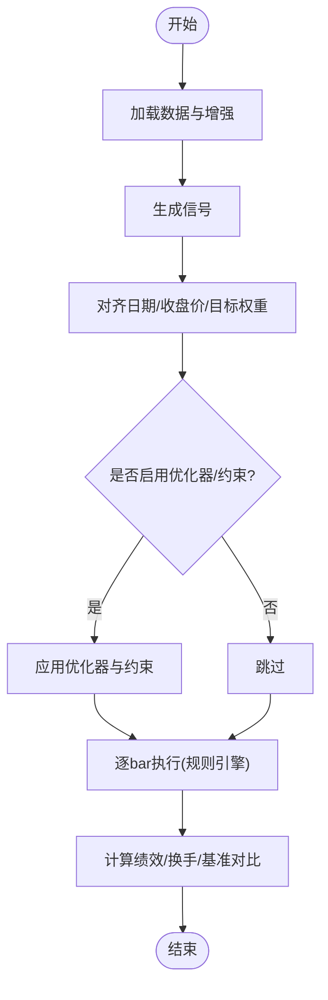
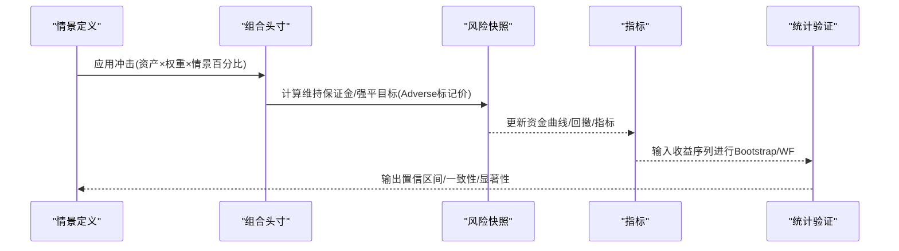
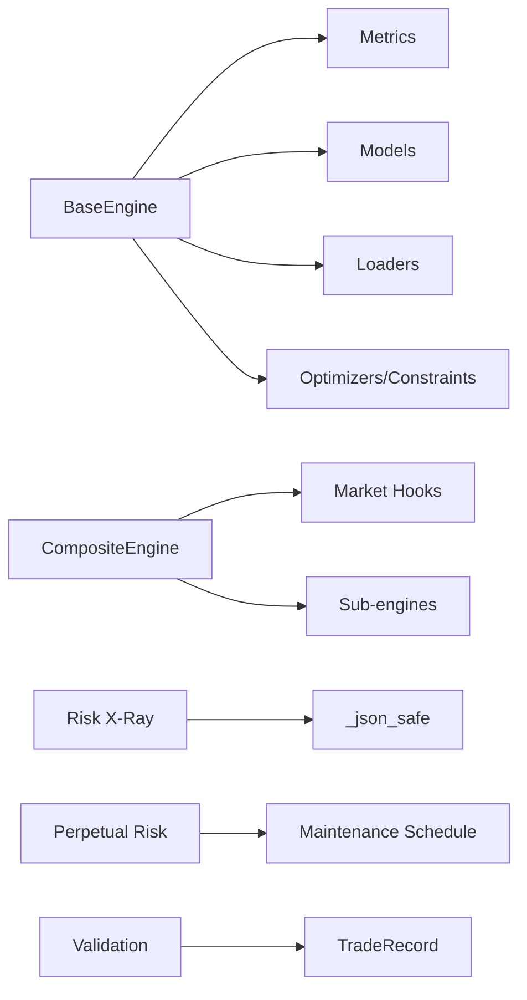

# 压力测试与情景分析

<cite>
**本文引用的文件**
- [agent/backtest/engines/base.py](file://agent/backtest/engines/base.py)
- [agent/backtest/engines/composite.py](file://agent/backtest/engines/composite.py)
- [agent/backtest/perpetual_risk.py](file://agent/backtest/perpetual_risk.py)
- [agent/backtest/risk_xray.py](file://agent/backtest/risk_xray.py)
- [agent/backtest/metrics.py](file://agent/backtest/metrics.py)
- [agent/backtest/regime.py](file://agent/backtest/regime.py)
- [agent/backtest/constraints.py](file://agent/backtest/constraints.py)
- [agent/backtest/validation.py](file://agent/backtest/validation.py)
- [agent/src/skills/risk-analysis/SKILL.md](file://agent/src/skills/risk-analysis/SKILL.md)
</cite>

## 目录
1. [简介](#简介)
2. [项目结构](#项目结构)
3. [核心组件](#核心组件)
4. [架构总览](#架构总览)
5. [详细组件分析](#详细组件分析)
6. [依赖关系分析](#依赖关系分析)
7. [性能考虑](#性能考虑)
8. [故障排查指南](#故障排查指南)
9. [结论](#结论)
10. [附录](#附录)

## 简介
本技术文档面向“压力测试与情景分析”能力，系统化说明极端市场模拟引擎、风险评估框架、应急预案制定、测试场景设计、测试结果分析与工具集自动化流程。内容基于代码库中的回测引擎、风险快照、组合风险X光、统计验证等模块，提供从历史回测、蒙特卡洛模拟到假设性情景的完整方法论与实践路径，帮助在风险管理中落地可复现、可审计的压力测试体系。

## 项目结构
围绕压力测试与情景分析的关键目录与文件：
- 回测执行与规则引擎：base、composite、各市场子引擎（股票、期货、外汇、加密）
- 风险建模与快照：perpetual_risk（永续合约保证金与强平）、risk_xray（组合集中度、波动率、回撤、尾部风险、相关性）
- 指标与年化：metrics（收益、夏普、最大回撤、换手率、基准对比）
- 统计验证：validation（蒙特卡洛置换检验、Bootstrap置信区间、滚动窗口一致性）
- 约束与优化：constraints（权重上限/下限、分组暴露限制）
- 市场状态识别：regime（相关系数 regime 时间线）
- 情景模板：SKILL.md（假设性情景定义与步骤）

图表来源
- [agent/backtest/engines/base.py:652-800](file://agent/backtest/engines/base.py#L652-L800)
- [agent/backtest/engines/composite.py:102-147](file://agent/backtest/engines/composite.py#L102-L147)
- [agent/backtest/metrics.py:461-626](file://agent/backtest/metrics.py#L461-L626)
- [agent/backtest/constraints.py:170-206](file://agent/backtest/constraints.py#L170-L206)
- [agent/backtest/risk_xray.py:86-176](file://agent/backtest/risk_xray.py#L86-L176)
- [agent/backtest/perpetual_risk.py:357-418](file://agent/backtest/perpetual_risk.py#L357-L418)
- [agent/backtest/validation.py:291-346](file://agent/backtest/validation.py#L291-L346)
- [agent/backtest/regime.py:147-236](file://agent/backtest/regime.py#L147-L236)

章节来源
- [agent/backtest/engines/base.py:652-800](file://agent/backtest/engines/base.py#L652-L800)
- [agent/backtest/engines/composite.py:102-147](file://agent/backtest/engines/composite.py#L102-L147)

## 核心组件
- BaseEngine：统一的bar-by-bar执行流水线，负责数据加载、信号生成、目标权重预计算、逐bar执行、指标输出与产物写入。支持价格限制、滑点、佣金、杠杆、负价处理、基准对齐等。
- CompositeEngine：跨市场组合回测，维护共享资金池，按标的类型路由到对应子引擎处理交易规则（涨跌停、T+1、货币结算一致性）。
- Metrics：统一绩效指标计算（总收益、年化收益、最大回撤、夏普、索提诺、Calmar、换手率、基准超额、信息比率、跟踪误差、Beta），并处理零/负权益路径的稳健性。
- Risk X-Ray：组合级风险透视（集中度HHI、有效资产数、年化波动、下行波动、最大回撤、历史VaR/ES、分散化比率、相关性、Beta）。
- Perpetual Risk：永续合约账户与持仓风险快照，支持隔离/全仓模式、维护保证金阶梯、标记价冲击（含逆向最坏情况）、强平判定与目标。
- Validation：统计验证工具集（蒙特卡洛置换检验、Bootstrap Sharpe置信区间、Walk-Forward一致性），输出JSON产物。
- Constraints：对优化器输出的权重施加约束（单名上限/下限、分组暴露上限），保持符号与零行不变。
- Regime：基于滚动相关系数的边密度与滞后阈值的状态机，识别“融合期”（高相关性）时间段。

章节来源
- [agent/backtest/engines/base.py:377-800](file://agent/backtest/engines/base.py#L377-L800)
- [agent/backtest/engines/composite.py:102-257](file://agent/backtest/engines/composite.py#L102-L257)
- [agent/backtest/metrics.py:178-626](file://agent/backtest/metrics.py#L178-L626)
- [agent/backtest/risk_xray.py:86-369](file://agent/backtest/risk_xray.py#L86-L369)
- [agent/backtest/perpetual_risk.py:132-418](file://agent/backtest/perpetual_risk.py#L132-L418)
- [agent/backtest/validation.py:29-346](file://agent/backtest/validation.py#L29-L346)
- [agent/backtest/constraints.py:48-206](file://agent/backtest/constraints.py#L48-L206)
- [agent/backtest/regime.py:24-236](file://agent/backtest/regime.py#L24-L236)

## 架构总览
压力测试与情景分析的端到端流程如下：
- 输入：策略信号、历史行情、可选基本面/事件增强、约束与优化配置、基准与回测参数。
- 执行：BaseEngine驱动逐bar执行，CompositeEngine按市场分发规则；记录成交、仓位、资金曲线。
- 评估：Metrics产出绩效与换手；Risk X-Ray给出组合风险视图；Perpetual Risk提供保证金与强平快照；Validation进行统计显著性与稳定性检验；Regime标注高相关阶段。
- 情景：基于历史或假设性情景（如利率冲击、信用危机、流动性枯竭、地缘冲突）对组合进行冲击，结合风险快照与指标解读损失、资本充足与恢复能力。
- 输出：标准化JSON/Markdown报告，便于归档与审计。

图表来源
- [agent/backtest/engines/base.py:652-800](file://agent/backtest/engines/base.py#L652-L800)
- [agent/backtest/engines/composite.py:129-147](file://agent/backtest/engines/composite.py#L129-L147)
- [agent/backtest/metrics.py:461-626](file://agent/backtest/metrics.py#L461-L626)
- [agent/backtest/risk_xray.py:86-176](file://agent/backtest/risk_xray.py#L86-L176)
- [agent/backtest/perpetual_risk.py:357-418](file://agent/backtest/perpetual_risk.py#L357-L418)
- [agent/backtest/validation.py:291-346](file://agent/backtest/validation.py#L291-L346)
- [agent/backtest/regime.py:147-236](file://agent/backtest/regime.py#L147-L236)

## 详细组件分析

### 极端市场模拟引擎（BaseEngine与CompositeEngine）
- BaseEngine实现统一的回测管线：数据加载→信号生成→目标权重预计算（可接入优化器与约束）→逐bar执行（涨跌停、滑点、佣金、杠杆、负价）→指标与产物。
- 关键能力：
  - 价格限制与基准价：historical_base_price与limit_band确保交易不越界。
  - 滑点与成交价：prospective_fill_price与execution_open/valuation_open。
  - 负价与特殊市场：allow_nonpositive_prices控制是否允许负价开仓。
  - 基准对齐：外部基准序列与策略收益对齐，避免前瞻偏差。
- CompositeEngine：
  - 跨市场共享资金池，拒绝混币组合（无汇率转换时）。
  - 按市场路由规则（A股T+1拦截、加密资金费率与强平、外汇掉期）。

图表来源
- [agent/backtest/engines/base.py:652-800](file://agent/backtest/engines/base.py#L652-L800)
- [agent/backtest/constraints.py:170-206](file://agent/backtest/constraints.py#L170-L206)

章节来源
- [agent/backtest/engines/base.py:377-800](file://agent/backtest/engines/base.py#L377-L800)
- [agent/backtest/engines/composite.py:102-257](file://agent/backtest/engines/composite.py#L102-L257)

### 风险评估框架（风险因子识别、敏感性分析、压力解读）
- 风险因子识别：
  - 通过Risk X-Ray的集中度（HHI、有效N、Top1/Top3权重）、波动率（日/年化、下行波动）、相关性（平均绝对相关、最大配对相关、Beta）刻画因子暴露与集中风险。
  - Regime识别高相关“融合期”，提示系统性风险上升。
- 敏感性分析：
  - 使用Perpetual Risk的adverse标记价（多头取最低、空头取最高）评估极端价格变动下的维持保证金与强平目标。
  - 可通过调整price_field为mark_open/mark_high/mark_low/mark_close做不同敏感度扫描。
- 压力测试结果解读：
  - 结合Metrics的最大回撤、年化收益、夏普/索提诺、基准超额与信息比率，判断策略在压力期的表现与相对基准的稳健性。
  - 结合Validation的蒙特卡洛p值与Bootstrap置信区间，评估策略收益的统计显著性与稳定性。

章节来源
- [agent/backtest/risk_xray.py:86-369](file://agent/backtest/risk_xray.py#L86-L369)
- [agent/backtest/perpetual_risk.py:274-418](file://agent/backtest/perpetual_risk.py#L274-L418)
- [agent/backtest/metrics.py:461-626](file://agent/backtest/metrics.py#L461-L626)
- [agent/backtest/regime.py:24-236](file://agent/backtest/regime.py#L24-L236)

### 压力测试方法（历史回测、蒙特卡洛、假设性情景）
- 历史回测：
  - BaseEngine以真实历史数据驱动，记录成交、资金曲线与指标，作为压力测试的基础事实。
- 蒙特卡洛模拟：
  - 通过Monte Carlo置换检验打乱交易PnL顺序，评估观察到的Sharpe/最大回撤是否显著优于随机路径；输出p值、分位数与路径带。
- 假设性情景：
  - 参考SKILL.md中的情景模板（利率冲击、信用危机、流动性枯竭、地缘冲突），将情景冲击乘以当前头寸，计算组合损失并评估是否触发风控阈值。

图表来源
- [agent/backtest/validation.py:29-113](file://agent/backtest/validation.py#L29-L113)
- [agent/backtest/perpetual_risk.py:357-418](file://agent/backtest/perpetual_risk.py#L357-L418)
- [agent/src/skills/risk-analysis/SKILL.md:158-198](file://agent/src/skills/risk-analysis/SKILL.md#L158-L198)

章节来源
- [agent/backtest/validation.py:29-346](file://agent/backtest/validation.py#L29-L346)
- [agent/src/skills/risk-analysis/SKILL.md:158-198](file://agent/src/skills/risk-analysis/SKILL.md#L158-L198)

### 应急预案制定（风险应对、流动性管理、紧急平仓）
- 风险应对策略：
  - 基于Regime识别的高相关期，降低组合集中度（通过Constraints设置单名上限/分组暴露上限）。
  - 在Perpetual Risk快照中标记强平目标，提前减仓或对冲。
- 流动性管理：
  - 通过Metrics的换手率（计划与实际）评估调仓成本；在压力期减少频繁调仓，优先保留流动性。
- 紧急平仓程序：
  - 在Crypto/Forex子引擎中，on_bar钩子内检测强平条件并执行强制平仓；在复合引擎中统一记录与扣减资金。

章节来源
- [agent/backtest/constraints.py:48-206](file://agent/backtest/constraints.py#L48-L206)
- [agent/backtest/perpetual_risk.py:357-418](file://agent/backtest/perpetual_risk.py#L357-L418)
- [agent/backtest/engines/composite.py:229-257](file://agent/backtest/engines/composite.py#L229-L257)

### 测试场景设计（黑天鹅、流动性危机、系统性风险）
- 黑天鹅事件：
  - 使用历史极端期（如2020年3月暴跌）或假设性情景（利率骤升、信用利差扩大），通过Risk X-Ray的尾部风险（VaR/ES）与最大回撤评估影响。
- 流动性危机：
  - 放大滑点与买卖价差，结合Metrics的实际换手率与成交记录，评估退出成本与资金占用。
- 系统性风险：
  - 利用Regime的“融合期”识别高相关阶段，叠加Constraints收紧暴露，观察组合回撤与指标变化。

章节来源
- [agent/backtest/risk_xray.py:241-306](file://agent/backtest/risk_xray.py#L241-L306)
- [agent/backtest/metrics.py:441-531](file://agent/backtest/metrics.py#L441-L531)
- [agent/backtest/regime.py:24-236](file://agent/backtest/regime.py#L24-L236)

### 测试结果分析（损失估算、资本充足率、恢复能力）
- 损失估算：
  - 通过Perpetual Risk的未实现盈亏与维护保证金，结合Metrics的最大回撤，量化压力期潜在损失。
- 资本充足率：
  - 在隔离模式下，检查每头寸的margin_balance与maintenance_margin；在全仓模式下，检查账户余额与总维持保证金的关系。
- 恢复能力：
  - 通过Bootstrap置信区间与Walk-Forward一致性，评估策略在不同时间窗口的稳定恢复能力。

章节来源
- [agent/backtest/perpetual_risk.py:357-418](file://agent/backtest/perpetual_risk.py#L357-L418)
- [agent/backtest/metrics.py:605-695](file://agent/backtest/metrics.py#L605-L695)
- [agent/backtest/validation.py:142-291](file://agent/backtest/validation.py#L142-L291)

### 压力测试工具集与自动化流程
- 工具集：
  - Monte Carlo置换检验、Bootstrap Sharpe置信区间、Walk-Forward一致性分析。
  - Risk X-Ray组合风险透视、Perpetual Risk保证金与强平快照、Regime相关性时间线。
- 自动化流程：
  - BaseEngine.run_backtest集成指标与产物输出；Validation.run_validation根据config自动运行统计验证；Risk X-Ray与Regime可在API或工具调用中按需执行。

章节来源
- [agent/backtest/validation.py:291-346](file://agent/backtest/validation.py#L291-L346)
- [agent/backtest/risk_xray.py:340-387](file://agent/backtest/risk_xray.py#L340-L387)
- [agent/backtest/regime.py:147-236](file://agent/backtest/regime.py#L147-L236)

## 依赖关系分析
- BaseEngine依赖：
  - metrics（绩效与换手）、models（交易记录）、loaders（数据与事件增强）、optimizers/constraints（权重优化与约束）。
- CompositeEngine依赖：
  - _market_hooks（市场检测、资金费率、掉期、强平）、各市场子引擎（A股、美股、期货、外汇、加密）。
- Risk X-Ray依赖：
  - validation._json_safe（严格JSON安全输出）。
- Perpetual Risk依赖：
  - MaintenanceSchedule/MaintenanceBracket（维护保证金阶梯）、AccountState/PositionState（账户与持仓状态）。
- Validation依赖：
  - models.TradeRecord（交易记录）、metrics（年化因子）。

图表来源
- [agent/backtest/engines/base.py:26-44](file://agent/backtest/engines/base.py#L26-L44)
- [agent/backtest/engines/composite.py:16-23](file://agent/backtest/engines/composite.py#L16-L23)
- [agent/backtest/risk_xray.py:30-30](file://agent/backtest/risk_xray.py#L30-L30)
- [agent/backtest/perpetual_risk.py:73-130](file://agent/backtest/perpetual_risk.py#L73-L130)
- [agent/backtest/validation.py:24-24](file://agent/backtest/validation.py#L24-L24)

章节来源
- [agent/backtest/engines/base.py:26-44](file://agent/backtest/engines/base.py#L26-L44)
- [agent/backtest/engines/composite.py:16-23](file://agent/backtest/engines/composite.py#L16-L23)
- [agent/backtest/risk_xray.py:30-30](file://agent/backtest/risk_xray.py#L30-L30)
- [agent/backtest/perpetual_risk.py:73-130](file://agent/backtest/perpetual_risk.py#L73-L130)
- [agent/backtest/validation.py:24-24](file://agent/backtest/validation.py#L24-L24)

## 性能考虑
- 年化因子选择：不同市场与周期（1m/5m/1H/1D）对应不同的bars_per_year，影响波动率与夏普的年化精度。
- 小样本保护：当返回序列长度不足时，指标（如Sharpe、Sortino）被置零以避免NaN污染。
- 内存与JSON安全：蒙特卡洛路径矩阵在规模过大时采样以减少内存与JSON体积；所有数值输出经过_json_safe保证严格JSON兼容。
- 对齐与填充：_align中对close与position矩阵使用前向填充限制，避免长停牌或跨市场日历差异导致的数据失真。

章节来源
- [agent/backtest/metrics.py:17-170](file://agent/backtest/metrics.py#L17-L170)
- [agent/backtest/validation.py:67-113](file://agent/backtest/validation.py#L67-L113)
- [agent/backtest/validation.py:438-470](file://agent/backtest/validation.py#L438-L470)
- [agent/backtest/engines/base.py:149-249](file://agent/backtest/engines/base.py#L149-L249)

## 故障排查指南
- 无数据或无效信号：
  - BaseEngine在数据为空或信号非Series时会打印错误并退出，需检查loader与signal_engine配置。
- 混合货币组合：
  - CompositeEngine拒绝跨结算货币的组合，需拆分运行或统一到单一货币。
- 权益为零或负：
  - Metrics对total_return<=0的情况年化收益设为-100%，避免复数运算崩溃；需检查杠杆与止损逻辑。
- 最小历史不足：
  - Risk X-Ray要求至少MIN_HISTORY_DAYS的有效条数；不足会被剔除并重新归一化权重。
- 参数校验失败：
  - Perpetual Risk对timestamp、价格、保证金等字段进行严格校验，错误会抛出异常；需检查输入帧与标记价范围。

章节来源
- [agent/backtest/engines/base.py:906-939](file://agent/backtest/engines/base.py#L906-L939)
- [agent/backtest/engines/composite.py:85-116](file://agent/backtest/engines/composite.py#L85-L116)
- [agent/backtest/metrics.py:576-593](file://agent/backtest/metrics.py#L576-L593)
- [agent/backtest/risk_xray.py:117-151](file://agent/backtest/risk_xray.py#L117-L151)
- [agent/backtest/perpetual_risk.py:29-39](file://agent/backtest/perpetual_risk.py#L29-L39)

## 结论
本系统提供了完整的压力测试与情景分析能力：以BaseEngine为核心，结合CompositeEngine的跨市场执行、Metrics的绩效评估、Risk X-Ray的组合风险透视、Perpetual Risk的保证金与强平快照、Validation的统计验证与Regime的市场状态识别，形成从历史回测、蒙特卡洛模拟到假设性情景的闭环。通过Constraints与应急预案，可在压力期主动管理风险与流动性，保障资本充足与恢复能力。该体系适用于机构与个人投资者的风险管理实践，具备可复现、可审计、可扩展的特点。

## 附录
- 情景模板与实施步骤参考：
  - 利率冲击、信用危机、流动性枯竭、地缘冲突等情景定义与组合损失计算步骤。
- 常用指标与阈值建议：
  - VaR/ES、最大回撤、夏普/索提诺、信息比率、跟踪误差、Beta等指标的监控与预警阈值。
- 自动化脚本与CLI：
  - Validation.main可直接对已有回测产物运行统计验证，输出artifacts/validation.json。

章节来源
- [agent/src/skills/risk-analysis/SKILL.md:158-198](file://agent/src/skills/risk-analysis/SKILL.md#L158-L198)
- [agent/backtest/validation.py:473-511](file://agent/backtest/validation.py#L473-L511)