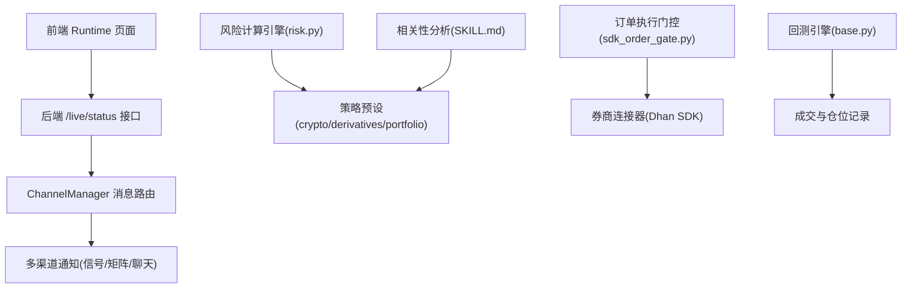
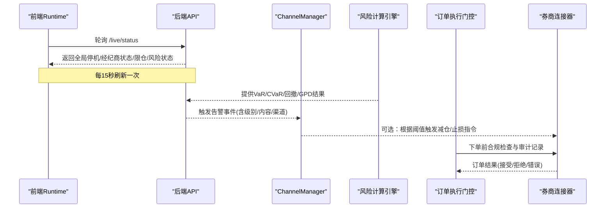
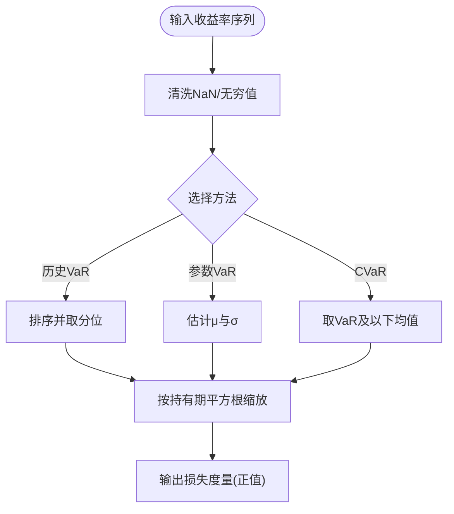
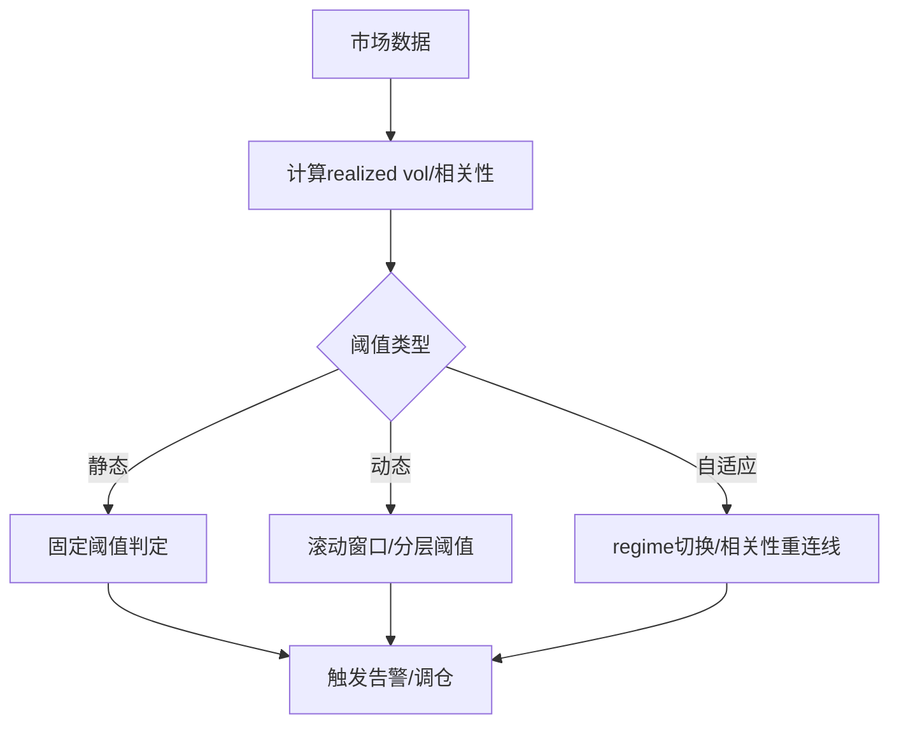
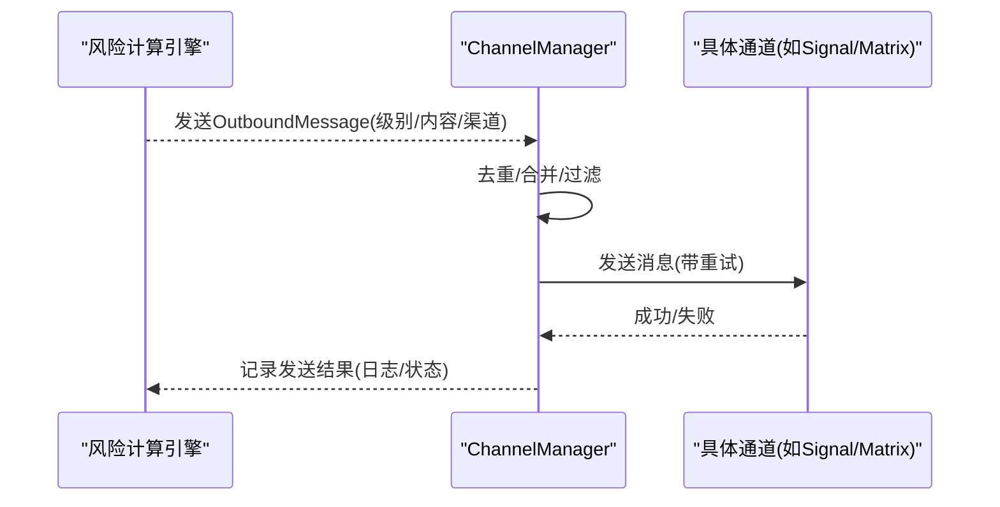
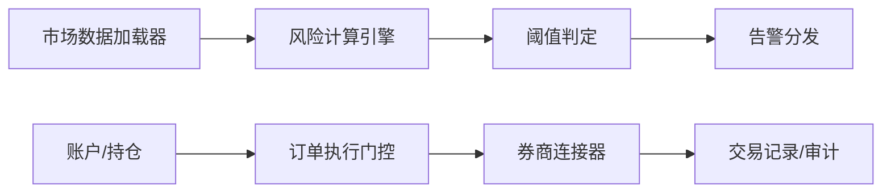
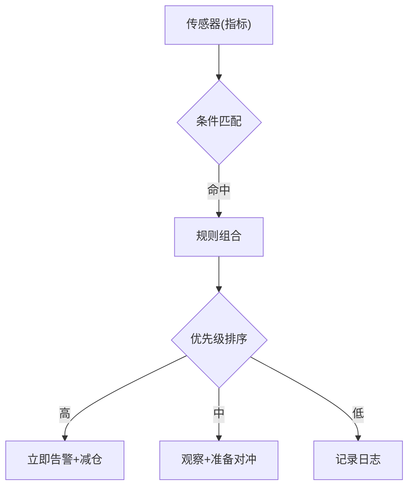
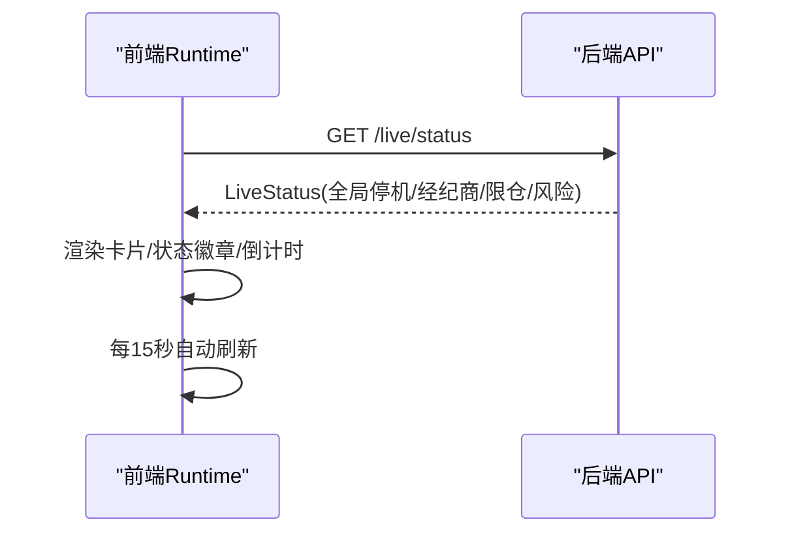
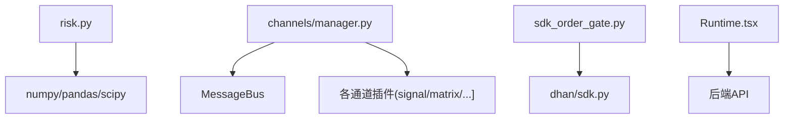

# 实时监控与预警

<cite>
**本文引用的文件**
- [agent/src/quantlib/risk.py](file://agent/src/quantlib/risk.py)
- [agent/src/channels/manager.py](file://agent/src/channels/manager.py)
- [agent/src/channels/signal.py](file://agent/src/channels/signal.py)
- [agent/src/channels/matrix.py](file://agent/src/channels/matrix.py)
- [agent/src/live/sdk_order_gate.py](file://agent/src/live/sdk_order_gate.py)
- [agent/backtest/engines/base.py](file://agent/backtest/engines/base.py)
- [agent/src/trading/connectors/dhan/sdk.py](file://agent/src/trading/connectors/dhan/sdk.py)
- [frontend/src/pages/Runtime.tsx](file://frontend/src/pages/Runtime.tsx)
- [frontend/src/pages/Reports.tsx](file://frontend/src/pages/Reports.tsx)
- [agent/src/swarm/presets/crypto_trading_desk.yaml](file://agent/src/swarm/presets/crypto_trading_desk.yaml)
- [agent/src/swarm/presets/portfolio_review_board.yaml](file://agent/src/swarm/presets/portfolio_review_board.yaml)
- [agent/src/swarm/presets/derivatives_strategy_desk.yaml](file://agent/src/swarm/presets/derivatives_strategy_desk.yaml)
- [agent/src/skills/correlation-analysis/SKILL.md](file://agent/src/skills/correlation-analysis/SKILL.md)
- [agent/src/skills/correlation-regime/SKILL.md](file://agent/src/skills/correlation-regime/SKILL.md)
</cite>

## 目录
1. [简介](#简介)
2. [项目结构](#项目结构)
3. [核心组件](#核心组件)
4. [架构总览](#架构总览)
5. [详细组件分析](#详细组件分析)
6. [依赖关系分析](#依赖关系分析)
7. [性能考量](#性能考量)
8. [故障排查指南](#故障排查指南)
9. [结论](#结论)
10. [附录](#附录)

## 简介
本技术文档围绕“实时监控与预警系统”展开，覆盖风险指标计算引擎（VaR/CVaR、最大回撤、蒙特卡洛模拟、极值分布拟合）、阈值监控（静态/动态/自适应）、即时告警（分级、多渠道、聚合）、数据采集（实时行情、账户状态、订单执行跟踪）、预警规则引擎（条件判断、组合规则、优先级排序），以及监控面板与可视化界面。文档同时给出代码级架构图、时序图与流程图，帮助读者快速理解系统在风险管理中的实际落地方式。

## 项目结构
- 后端风险计算：位于 agent/src/quantlib/risk.py，提供 VaR、CVaR、最大回撤、蒙特卡洛路径生成与尾部拟合等能力。
- 渠道与告警：位于 agent/src/channels/*，包含消息总线、通道管理与多平台通知（Signal、Matrix、Telegram、Slack 等）。
- 交易风控与执行门控：位于 agent/src/live/sdk_order_gate.py，负责下单前合规检查、审计记录与日频限额控制。
- 数据源与订单跟踪：位于 agent/src/trading/connectors/dhan/sdk.py，提供持仓与订单查询；回测引擎在 agent/backtest/engines/base.py 中记录成交与仓位。
- 前端监控面板：位于 frontend/src/pages/Runtime.tsx 与 Reports.tsx，展示运行时状态、授权、限仓、风险状态与历史报告列表。
- 策略与规则模板：位于 agent/src/swarm/presets/*，定义阈值设定方法、风险审查维度与监控看板要求。
- 相关性分析与联动：位于 agent/src/skills/correlation-analysis/SKILL.md 与 correlation-regime/SKILL.md，提供相关性、协整、领先者归因等工具。

图表来源
- [agent/src/channels/manager.py:213-252](file://agent/src/channels/manager.py#L213-L252)
- [agent/src/quantlib/risk.py:146-251](file://agent/src/quantlib/risk.py#L146-L251)
- [agent/src/live/sdk_order_gate.py:207-426](file://agent/src/live/sdk_order_gate.py#L207-L426)
- [agent/src/trading/connectors/dhan/sdk.py:257-298](file://agent/src/trading/connectors/dhan/sdk.py#L257-L298)
- [agent/backtest/engines/base.py:2040-2067](file://agent/backtest/engines/base.py#L2040-L2067)
- [frontend/src/pages/Runtime.tsx:40-81](file://frontend/src/pages/Runtime.tsx#L40-L81)

章节来源
- [agent/src/quantlib/risk.py:1-512](file://agent/src/quantlib/risk.py#L1-L512)
- [agent/src/channels/manager.py:1-479](file://agent/src/channels/manager.py#L1-L479)
- [agent/src/live/sdk_order_gate.py:138-381](file://agent/src/live/sdk_order_gate.py#L138-L381)
- [agent/src/trading/connectors/dhan/sdk.py:257-298](file://agent/src/trading/connectors/dhan/sdk.py#L257-L298)
- [agent/backtest/engines/base.py:2034-2073](file://agent/backtest/engines/base.py#L2034-L2073)
- [frontend/src/pages/Runtime.tsx:1-621](file://frontend/src/pages/Runtime.tsx#L1-L621)
- [frontend/src/pages/Reports.tsx:1-319](file://frontend/src/pages/Reports.tsx#L1-L319)

## 核心组件
- 风险指标计算引擎：实现历史 VaR、参数化 VaR、历史 CVaR、最大回撤分析、蒙特卡洛 GBM 路径与尾部 GPD 拟合，统一以“损失为正”的符号约定，确保跨模块一致性与可比较性。
- 阈值监控系统：通过策略预设将阈值锚定到观测分布（如 VaR/CVaR、最大回撤、GPD 尾部），支持静态阈值（固定百分比）、动态阈值（基于滚动窗口或 realized vol）与自适应阈值（结合 regime 切换与相关性重连线）。
- 即时告警机制：通过 ChannelManager 统一管理多渠道通知，具备重试、去重、流式合并、进度与推理片段过滤等能力；可按告警级别分类推送。
- 监控数据采集：从行情加载器与券商连接器获取实时行情、账户状态、持仓与订单执行；回测引擎记录成交与仓位变化，形成闭环。
- 预警规则引擎：在策略预设中定义条件判断、组合规则与优先级排序，例如集中度、因子暴露、流动性、相关性/尾部风险等维度，并输出红黄绿旗标与行动建议。
- 监控面板与可视化：前端 Runtime 页面轮询后端状态，展示全局停机、经纪商连接、授权、运行器存活、限仓与风险状态；Reports 页面列出历史运行与关键指标。

章节来源
- [agent/src/quantlib/risk.py:146-251](file://agent/src/quantlib/risk.py#L146-L251)
- [agent/src/channels/manager.py:254-453](file://agent/src/channels/manager.py#L254-L453)
- [agent/src/swarm/presets/crypto_trading_desk.yaml:162-186](file://agent/src/swarm/presets/crypto_trading_desk.yaml#L162-L186)
- [agent/src/swarm/presets/portfolio_review_board.yaml:65-116](file://agent/src/swarm/presets/portfolio_review_board.yaml#L65-L116)
- [agent/src/trading/connectors/dhan/sdk.py:257-298](file://agent/src/trading/connectors/dhan/sdk.py#L257-L298)
- [agent/backtest/engines/base.py:2040-2067](file://agent/backtest/engines/base.py#L2040-L2067)
- [frontend/src/pages/Runtime.tsx:40-81](file://frontend/src/pages/Runtime.tsx#L40-L81)
- [frontend/src/pages/Reports.tsx:35-82](file://frontend/src/pages/Reports.tsx#L35-L82)

## 架构总览
系统由“数据采集—风险计算—阈值判定—告警分发—可视化”构成闭环。前端定时拉取运行时状态，后端通过消息总线协调多渠道通知；风险计算引擎为阈值判定提供量化依据；订单执行门控保障交易安全；相关性分析用于动态阈值与 regime 切换。

图表来源
- [frontend/src/pages/Runtime.tsx:21-81](file://frontend/src/pages/Runtime.tsx#L21-L81)
- [agent/src/channels/manager.py:213-252](file://agent/src/channels/manager.py#L213-L252)
- [agent/src/quantlib/risk.py:146-251](file://agent/src/quantlib/risk.py#L146-L251)
- [agent/src/live/sdk_order_gate.py:207-426](file://agent/src/live/sdk_order_gate.py#L207-L426)
- [agent/src/trading/connectors/dhan/sdk.py:257-298](file://agent/src/trading/connectors/dhan/sdk.py#L257-L298)

## 详细组件分析

### 风险指标计算引擎
- VaR（历史与参数化）：历史 VaR 使用非插值下阶统计量；参数化 VaR 基于正态假设估计均值与标准差，适用于中等置信度时可能高估风险。
- CVaR（条件 VaR）：对超过 VaR 阈值的平均损失，满足次可加性，便于组合风险分解。
- 最大回撤分析：定位最严重峰谷下降、恢复时间与水下天数，统一以正数表示损失幅度。
- 蒙特卡洛模拟：几何布朗运动路径生成，汇总终端分布的 VaR/CVaR、亏损概率与极端分位数。
- 极值分布拟合：用广义帕累托分布拟合尾部，判断尾型（厚尾/有界/指数），辅助超样本外风险估计。

图表来源
- [agent/src/quantlib/risk.py:146-251](file://agent/src/quantlib/risk.py#L146-L251)
- [agent/src/quantlib/risk.py:520-618](file://agent/src/quantlib/risk.py#L520-L618)
- [agent/src/quantlib/risk.py:621-702](file://agent/src/quantlib/risk.py#L621-L702)

章节来源
- [agent/src/quantlib/risk.py:1-512](file://agent/src/quantlib/risk.py#L1-L512)

### 阈值监控系统（静态/动态/自适应）
- 静态阈值：固定百分比或绝对数值（如单日亏损不超过 X%）。
- 动态阈值：基于 realized vol、滚动窗口相关性或波动率分层（低/中/高波动率对应不同资产类别与限额）。
- 自适应阈值：结合 regime 切换与相关性重连线，当相关性结构变化或领先者归因触发时调整阈值与动作。

图表来源
- [agent/src/swarm/presets/crypto_trading_desk.yaml:162-186](file://agent/src/swarm/presets/crypto_trading_desk.yaml#L162-L186)
- [agent/src/swarm/presets/etf_allocation_desk.yaml:145-167](file://agent/src/swarm/presets/etf_allocation_desk.yaml#L145-L167)
- [agent/src/skills/correlation-regime/SKILL.md:244-337](file://agent/src/skills/correlation-regime/SKILL.md#L244-L337)

章节来源
- [agent/src/swarm/presets/crypto_trading_desk.yaml:162-186](file://agent/src/swarm/presets/crypto_trading_desk.yaml#L162-L186)
- [agent/src/swarm/presets/etf_allocation_desk.yaml:145-167](file://agent/src/swarm/presets/etf_allocation_desk.yaml#L145-L167)
- [agent/src/skills/correlation-regime/SKILL.md:244-337](file://agent/src/skills/correlation-regime/SKILL.md#L244-L337)

### 即时告警机制（分级/多渠道/聚合）
- 告警级别：根据风险维度（集中度、因子暴露、流动性、相关性/尾部风险）划分红黄绿等级。
- 多渠道通知：通过 ChannelManager 管理多个通道（Signal、Matrix、聊天平台），支持重试、去重与流式合并。
- 告警聚合：对连续 stream delta 进行合并，减少 API 调用；对重复内容进行指纹去重。

图表来源
- [agent/src/channels/manager.py:254-453](file://agent/src/channels/manager.py#L254-L453)
- [agent/src/channels/signal.py:348-378](file://agent/src/channels/signal.py#L348-L378)
- [agent/src/channels/matrix.py:51-81](file://agent/src/channels/matrix.py#L51-L81)

章节来源
- [agent/src/channels/manager.py:1-479](file://agent/src/channels/manager.py#L1-L479)
- [agent/src/channels/signal.py:348-378](file://agent/src/channels/signal.py#L348-L378)
- [agent/src/channels/matrix.py:51-81](file://agent/src/channels/matrix.py#L51-L81)

### 监控数据采集（行情/账户/订单）
- 实时行情：通过各市场数据加载器获取 OHLCV 与因子数据，支撑 VaR/CVaR、相关性、波动率计算。
- 账户状态：从券商连接器读取持仓、未结订单与执行记录，用于风险敞口与流动性评估。
- 订单执行跟踪：回测引擎记录成交、费用、保证金与杠杆；实盘下单经执行门控审计与限额控制。

图表来源
- [agent/src/trading/connectors/dhan/sdk.py:257-298](file://agent/src/trading/connectors/dhan/sdk.py#L257-L298)
- [agent/backtest/engines/base.py:2040-2067](file://agent/backtest/engines/base.py#L2040-L2067)
- [agent/src/live/sdk_order_gate.py:207-426](file://agent/src/live/sdk_order_gate.py#L207-L426)

章节来源
- [agent/src/trading/connectors/dhan/sdk.py:257-298](file://agent/src/trading/connectors/dhan/sdk.py#L257-L298)
- [agent/backtest/engines/base.py:2040-2067](file://agent/backtest/engines/base.py#L2040-L2067)
- [agent/src/live/sdk_order_gate.py:207-426](file://agent/src/live/sdk_order_gate.py#L207-L426)

### 预警规则引擎（条件/组合/优先级）
- 条件判断：集中度（单名/行业权重）、因子暴露偏离、流动性不足、相关性/尾部风险突破。
- 组合规则：多维度联合触发（如 VaR/CVaR 突破 + 相关性上升 + 流动性收缩）。
- 优先级排序：高风险优先（红 > 黄 > 绿），宏观冲击优先于个体事件，必要时触发全局停机。

图表来源
- [agent/src/swarm/presets/portfolio_review_board.yaml:65-116](file://agent/src/swarm/presets/portfolio_review_board.yaml#L65-L116)
- [agent/src/swarm/presets/crypto_trading_desk.yaml:162-186](file://agent/src/swarm/presets/crypto_trading_desk.yaml#L162-L186)

章节来源
- [agent/src/swarm/presets/portfolio_review_board.yaml:65-116](file://agent/src/swarm/presets/portfolio_review_board.yaml#L65-L116)
- [agent/src/swarm/presets/crypto_trading_desk.yaml:162-186](file://agent/src/swarm/presets/crypto_trading_desk.yaml#L162-L186)

### 监控面板与可视化界面
- Runtime 页面：每 15 秒轮询后端状态，展示全局停机、经纪商数量、已授权数量、运行器存活、限仓摘要与风险状态卡片；支持手动刷新与错误提示。
- Reports 页面：列出历史运行、筛选状态与时间范围、排序与搜索，展示收益与夏普等关键指标，并提供完整报告链接。

图表来源
- [frontend/src/pages/Runtime.tsx:21-81](file://frontend/src/pages/Runtime.tsx#L21-L81)
- [frontend/src/pages/Runtime.tsx:518-576](file://frontend/src/pages/Runtime.tsx#L518-L576)
- [frontend/src/pages/Reports.tsx:35-82](file://frontend/src/pages/Reports.tsx#L35-L82)

章节来源
- [frontend/src/pages/Runtime.tsx:1-621](file://frontend/src/pages/Runtime.tsx#L1-L621)
- [frontend/src/pages/Reports.tsx:1-319](file://frontend/src/pages/Reports.tsx#L1-L319)

## 依赖关系分析
- 风险计算引擎依赖 numpy/pandas/scipy，提供稳定且可复现的量化指标。
- 渠道管理器依赖消息总线与各通道插件，具备重试、去重与流式合并能力。
- 订单执行门控依赖券商连接器与审计记录，确保交易合规与可追溯。
- 前端依赖后端 API 与国际化资源，提供直观的运行时与报告视图。

图表来源
- [agent/src/quantlib/risk.py:1-512](file://agent/src/quantlib/risk.py#L1-L512)
- [agent/src/channels/manager.py:1-479](file://agent/src/channels/manager.py#L1-L479)
- [agent/src/live/sdk_order_gate.py:207-426](file://agent/src/live/sdk_order_gate.py#L207-L426)
- [agent/src/trading/connectors/dhan/sdk.py:257-298](file://agent/src/trading/connectors/dhan/sdk.py#L257-L298)
- [frontend/src/pages/Runtime.tsx:40-81](file://frontend/src/pages/Runtime.tsx#L40-L81)

章节来源
- [agent/src/quantlib/risk.py:1-512](file://agent/src/quantlib/risk.py#L1-L512)
- [agent/src/channels/manager.py:1-479](file://agent/src/channels/manager.py#L1-L479)
- [agent/src/live/sdk_order_gate.py:207-426](file://agent/src/live/sdk_order_gate.py#L207-L426)
- [agent/src/trading/connectors/dhan/sdk.py:257-298](file://agent/src/trading/connectors/dhan/sdk.py#L257-L298)
- [frontend/src/pages/Runtime.tsx:40-81](file://frontend/src/pages/Runtime.tsx#L40-L81)

## 性能考量
- 风险计算：历史 VaR/CVaR 复杂度主要受排序影响；蒙特卡洛路径数与步长决定计算成本，建议使用足够大的路径数以稳定尾部估计。
- 渠道通知：流式合并与去重降低 API 调用频率；指数退避重试避免雪崩。
- 前端轮询：15 秒间隔平衡实时性与负载；AbortController 防止竞态请求。
- 订单执行：执行门控串行化与日频限额保护系统稳定性；审计记录增加少量开销但提升可追溯性。

[本节为通用指导，不直接分析具体文件]

## 故障排查指南
- 渠道发送失败：检查 ChannelManager 的重试与日志，确认通道可用性与配置；查看是否被去重或过滤。
- 风险指标异常：核对输入收益率序列的有限性与长度；确认置信度与持有期合法；对比历史与参数化 VaR 的差异。
- 订单执行错误：检查执行门控的合规检查与审计记录；确认券商连接器状态与错误码；验证日频限额与并发限制。
- 前端状态不可用：确认后端 API 可达性；检查轮询请求是否被中止；查看错误提示与诊断信息。

章节来源
- [agent/src/channels/manager.py:532-563](file://agent/src/channels/manager.py#L532-L563)
- [agent/src/quantlib/risk.py:99-122](file://agent/src/quantlib/risk.py#L99-L122)
- [agent/src/live/sdk_order_gate.py:386-426](file://agent/src/live/sdk_order_gate.py#L386-L426)
- [frontend/src/pages/Runtime.tsx:40-81](file://frontend/src/pages/Runtime.tsx#L40-L81)

## 结论
本系统以稳健的风险指标计算为基础，结合静态/动态/自适应阈值与多级告警机制，形成从数据采集、风险度量、阈值判定到通知与可视化的完整闭环。通过执行门控与审计记录保障交易安全，前端面板提供直观的运行与报告视图。该架构在风险管理中具有实用价值，可支撑多市场、多资产的实时监控与预警需求。

[本节为总结性内容，不直接分析具体文件]

## 附录
- 相关性分析与联动：提供共动发现、深度相关性、部门聚类、实现相关性、协整检验、半生命周期、卡尔曼动态对冲比率、跨市场联动与配对交易信号生成。
- 领先者归因与 regime 切换：通过稳健 z 分数识别危机领先者，区分宏观冲击与个体事件，辅助动态阈值与告警优先级。

章节来源
- [agent/src/skills/correlation-analysis/SKILL.md:1-964](file://agent/src/skills/correlation-analysis/SKILL.md#L1-L964)
- [agent/src/skills/correlation-regime/SKILL.md:244-337](file://agent/src/skills/correlation-regime/SKILL.md#L244-L337)