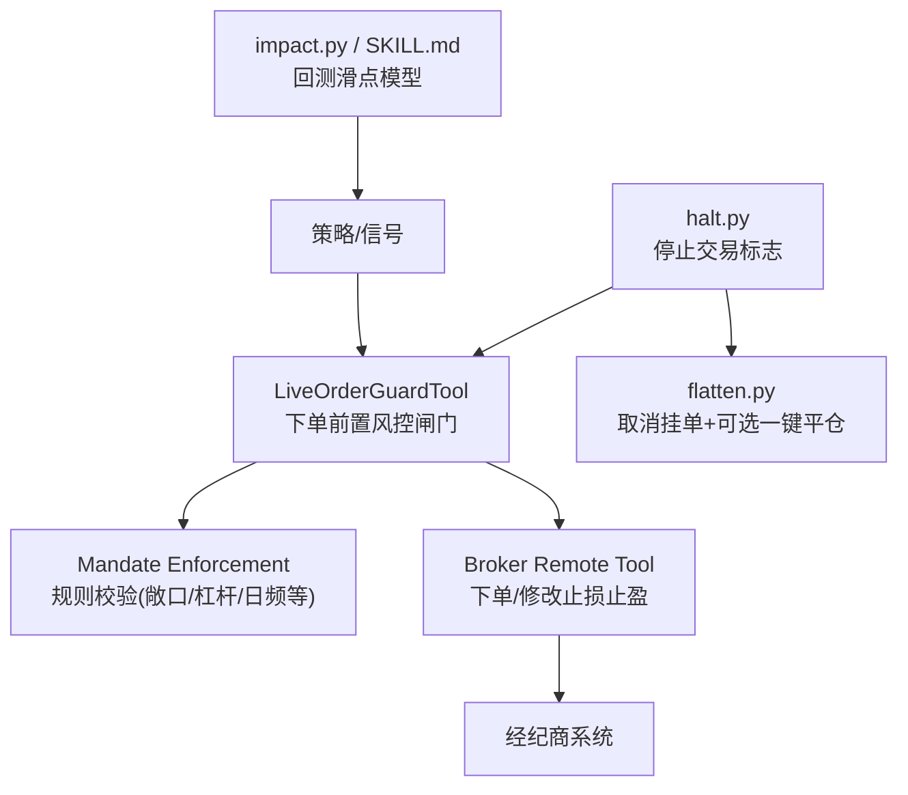
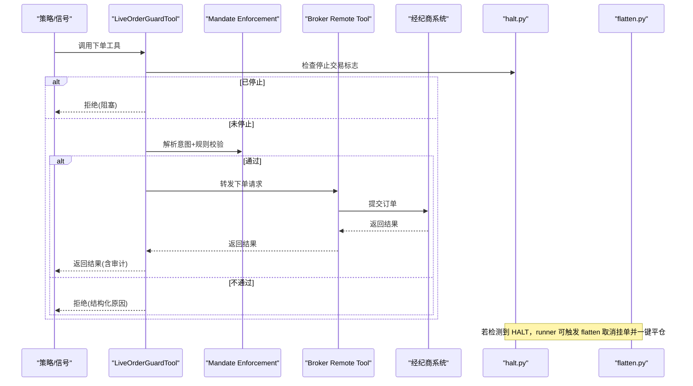
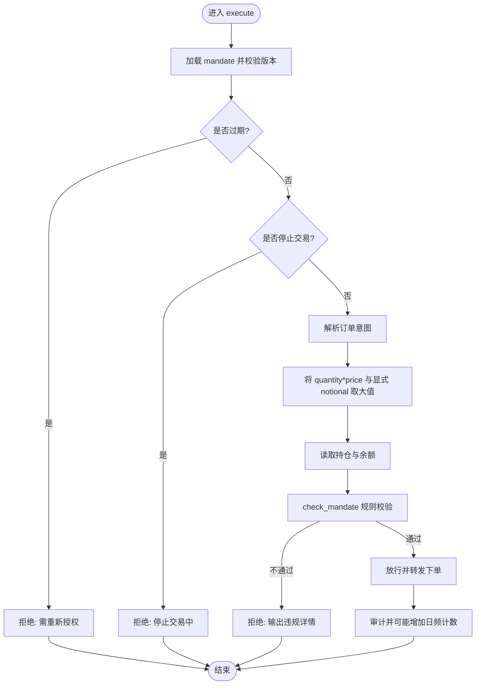
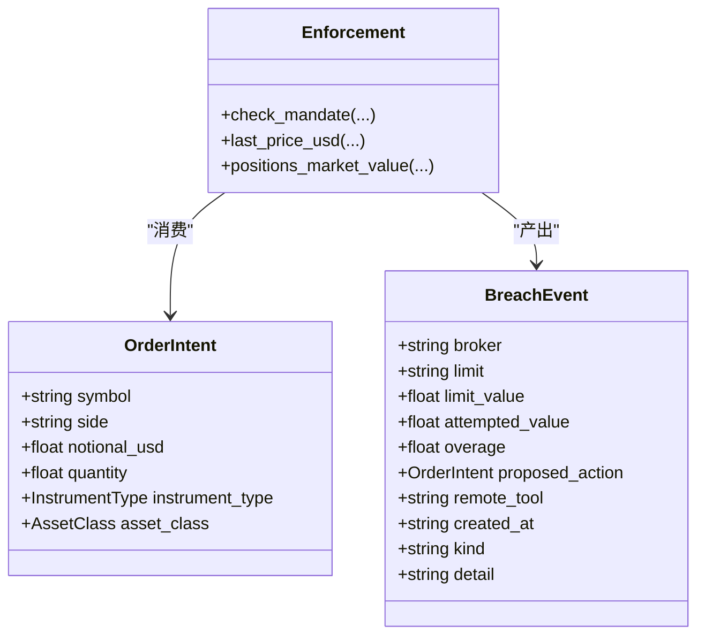
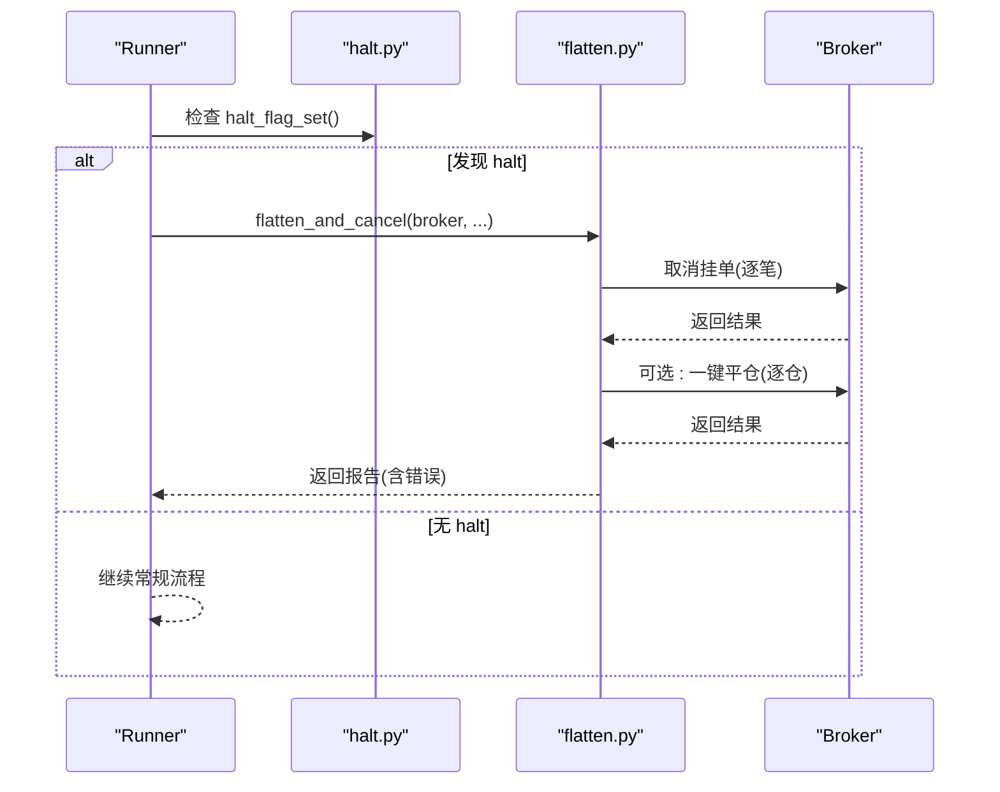
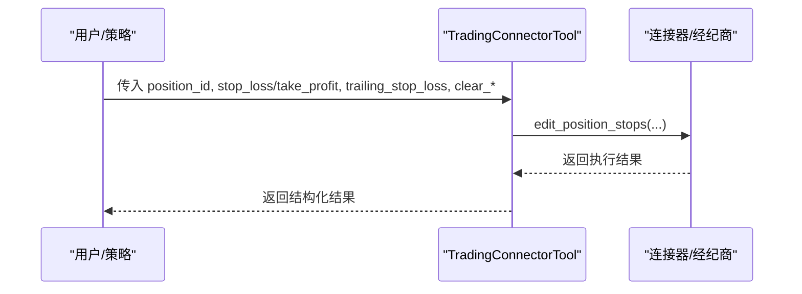
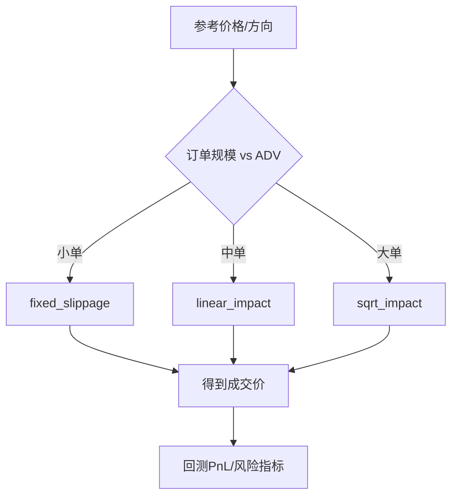
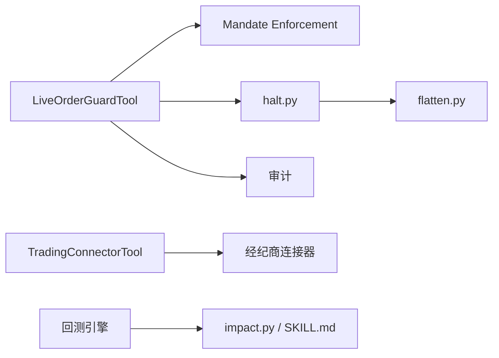

# 止损止盈机制

<cite>
**本文引用的文件**
- [agent/src/live/order_guard.py](file://agent/src/live/order_guard.py)
- [agent/src/live/enforcement.py](file://agent/src/live/enforcement.py)
- [agent/src/live/halt.py](file://agent/src/live/halt.py)
- [agent/src/live/runtime/flatten.py](file://agent/src/live/runtime/flatten.py)
- [agent/src/tools/trading_connector_tool.py](file://agent/src/tools/trading_connector_tool.py)
- [agent/src/quantlib/impact.py](file://agent/src/quantlib/impact.py)
- [agent/skills/execution-model/SKILL.md](file://agent/skills/execution-model/SKILL.md)
</cite>

## 目录
1. [简介](#简介)
2. [项目结构](#项目结构)
3. [核心组件](#核心组件)
4. [架构总览](#架构总览)
5. [详细组件分析](#详细组件分析)
6. [依赖关系分析](#依赖关系分析)
7. [性能考量](#性能考量)
8. [故障排查指南](#故障排查指南)
9. [结论](#结论)
10. [附录](#附录)

## 简介
本技术文档围绕“止损止盈机制”在系统中的实现与使用进行系统化说明，覆盖以下方面：
- 固定止损策略：百分比止损、金额止损、价格止损等类型。
- 移动止损机制：追踪止损、时间止损、波动率止损等高级策略。
- 止盈策略：目标价位止盈、分批止盈、动态止盈等实现方式。
- 触发条件：技术指标触发、基本面触发、市场事件触发。
- 执行逻辑：订单类型选择、滑点处理、成交确认。
- 参数配置与管理：如何设置、更新、撤销止损止盈参数。
- 不同市场环境下的应用效果与风险控制能力评估。

本仓库并未提供通用的“策略引擎式”止损止盈计算模块，而是通过“前置风控闸门 + 指令器工具 + 紧急平仓（熔断）+ 回测滑点模型”的组合，为实盘交易提供强约束的下单前校验与极端情况下的自动保护。

## 项目结构
与止损止盈相关的核心代码分布在如下模块：
- 下单前置风控闸门：对每笔订单进行强制合规检查，防止越权、超限与异常数据导致的错误下单。
- 指令器工具：提供编辑持仓止损/止盈参数的接口（以特定经纪商为例）。
- 紧急平仓（熔断）：检测到全局或分经纪商“停止交易”标志后，取消挂单并可选地一键平掉所有仓位。
- 回测滑点模型：用于回测中模拟滑点与市场冲击，帮助评估止损止盈策略的真实成本。

图表来源
- [agent/src/live/order_guard.py:130-214](file://agent/src/live/order_guard.py#L130-L214)
- [agent/src/live/enforcement.py:458-620](file://agent/src/live/enforcement.py#L458-L620)
- [agent/src/live/halt.py:135-163](file://agent/src/live/halt.py#L135-L163)
- [agent/src/live/runtime/flatten.py:61-127](file://agent/src/live/runtime/flatten.py#L61-L127)
- [agent/src/quantlib/impact.py:150-253](file://agent/src/quantlib/impact.py#L150-L253)
- [agent/skills/execution-model/SKILL.md:13-45](file://agent/skills/execution-model/SKILL.md#L13-L45)

章节来源
- [agent/src/live/order_guard.py:1-800](file://agent/src/live/order_guard.py#L1-L800)
- [agent/src/live/enforcement.py:1-798](file://agent/src/live/enforcement.py#L1-L798)
- [agent/src/live/halt.py:1-281](file://agent/src/live/halt.py#L1-L281)
- [agent/src/live/runtime/flatten.py:1-318](file://agent/src/live/runtime/flatten.py#L1-L318)
- [agent/src/tools/trading_connector_tool.py:1000-1028](file://agent/src/tools/trading_connector_tool.py#L1000-L1028)
- [agent/src/quantlib/impact.py:1-282](file://agent/src/quantlib/impact.py#L1-L282)
- [agent/skills/execution-model/SKILL.md:1-172](file://agent/skills/execution-model/SKILL.md#L1-L172)

## 核心组件
- LiveOrderGuardTool（下单前置风控闸门）
  - 职责：在每次下单前加载并校验授权书（mandate）、检查是否过期、检测停止交易标志、解析订单意图、获取报价将数量折算为名义金额、读取当前持仓与账户余额、执行规则校验（排除名单、允许品种、资产类别、单笔名义上限、总敞口、杠杆、日频次数、资金上限等），最后放行或拒绝。
  - 关键行为：失败即关闭（fail-closed）；审计记录写入；仅成功且非错误的转发才计入日频计数。
- Mandate Enforcement（规则引擎）
  - 职责：定义订单意图与违规事件；按固定顺序执行严格校验；返回 None（允许）或 BreachEvent（拒绝/暂停重授权）。
- Halt 与 Flatten（停止交易与紧急平仓）
  - 职责：通过文件系统“HALT”标志实现 LLM 无关的全局/分经纪商停止交易；触发后先取消挂单，再根据授权决定是否一键平仓。
- Trading Connector Tool（止损/止盈编辑）
  - 职责：提供编辑持仓止损/止盈参数的工具接口（示例为某经纪商），支持设置/清除止损/止盈、切换追踪止损等。
- Impact Models（回测滑点模型）
  - 职责：提供固定滑点、线性冲击、平方根冲击、延迟执行等模型，用于回测中更真实地估计止损止盈的执行成本。

章节来源
- [agent/src/live/order_guard.py:97-214](file://agent/src/live/order_guard.py#L97-L214)
- [agent/src/live/enforcement.py:111-177](file://agent/src/live/enforcement.py#L111-L177)
- [agent/src/live/halt.py:135-163](file://agent/src/live/halt.py#L135-L163)
- [agent/src/live/runtime/flatten.py:61-127](file://agent/src/live/runtime/flatten.py#L61-L127)
- [agent/src/tools/trading_connector_tool.py:1000-1028](file://agent/src/tools/trading_connector_tool.py#L1000-L1028)
- [agent/src/quantlib/impact.py:150-253](file://agent/src/quantlib/impact.py#L150-L253)

## 架构总览
下图展示从策略到执行的完整链路，以及止损止盈相关的关键节点：

图表来源
- [agent/src/live/order_guard.py:130-214](file://agent/src/live/order_guard.py#L130-L214)
- [agent/src/live/enforcement.py:458-620](file://agent/src/live/enforcement.py#L458-L620)
- [agent/src/live/halt.py:135-163](file://agent/src/live/halt.py#L135-L163)
- [agent/src/live/runtime/flatten.py:61-127](file://agent/src/live/runtime/flatten.py#L61-L127)

## 详细组件分析

### 组件A：LiveOrderGuardTool（下单前置风控闸门）
- 功能要点
  - 加载并校验授权书（mandate）与有效期。
  - 检测停止交易标志（halt），一旦触发则拒绝所有写操作。
  - 解析订单意图，并将“数量×价格”与显式名义金额取较大值作为统一名义金额，避免绕过限额。
  - 读取当前持仓与账户余额，执行规则校验（排除名单、允许品种、资产类别、单笔名义上限、总敞口、杠杆、日频次数、资金上限等）。
  - 放行时转发下单请求，并在成功且非错误时计入日频计数；同时写入审计事件。
- 失败即关闭原则
  - 任何无法解析的数据、缺失的市场数据、不可用的报价源都会导致拒绝，而不是放行。
- 审计与可观测性
  - 所有决策与转发结果均被审计，便于事后追溯与 SSE 实时事件推送。

图表来源
- [agent/src/live/order_guard.py:130-214](file://agent/src/live/order_guard.py#L130-L214)
- [agent/src/live/enforcement.py:458-620](file://agent/src/live/enforcement.py#L458-L620)

章节来源
- [agent/src/live/order_guard.py:97-214](file://agent/src/live/order_guard.py#L97-L214)
- [agent/src/live/enforcement.py:458-620](file://agent/src/live/enforcement.py#L458-L620)

### 组件B：Mandate Enforcement（规则引擎）
- 数据结构
  - OrderIntent：标准化订单意图（标的、方向、名义金额/数量、品种类型、资产类别）。
  - BreachEvent：违规事件（包含违规类型、限制项、尝试值、建议动作等）。
- 校验流程（固定顺序，首个失败即返回）
  - 排除名单 → 允许品种 → 资产类别 → 单笔名义上限 → 总敞口 → 杠杆 → 日频次数 → 资金上限 → 市值/流动性下限（如适用）。
- 失败即关闭
  - 任何不可解析或缺失数据都视为拒绝，确保不会因数据问题而放宽风控。

图表来源
- [agent/src/live/enforcement.py:111-177](file://agent/src/live/enforcement.py#L111-L177)
- [agent/src/live/enforcement.py:458-620](file://agent/src/live/enforcement.py#L458-L620)

章节来源
- [agent/src/live/enforcement.py:111-177](file://agent/src/live/enforcement.py#L111-L177)
- [agent/src/live/enforcement.py:458-620](file://agent/src/live/enforcement.py#L458-L620)

### 组件C：停止交易与紧急平仓（halt + flatten）
- 停止交易（halt）
  - 通过文件系统“HALT”标志实现 LLM 无关的全局或分经纪商停止交易。
  - 下单闸门在每个写操作前检查该标志，一旦存在即拒绝。
- 紧急平仓（flatten）
  - 当检测到 halt 时，runner 可触发“取消挂单 + 可选一键平仓”。
  - 默认只取消挂单（安全默认），如需一键平仓需显式允许或未来授权书新增字段。
  - 每个取消/平仓调用均审计，错误不重试，保证幂等与安全。

图表来源
- [agent/src/live/halt.py:135-163](file://agent/src/live/halt.py#L135-L163)
- [agent/src/live/runtime/flatten.py:61-127](file://agent/src/live/runtime/flatten.py#L61-L127)

章节来源
- [agent/src/live/halt.py:135-163](file://agent/src/live/halt.py#L135-L163)
- [agent/src/live/runtime/flatten.py:61-127](file://agent/src/live/runtime/flatten.py#L61-L127)

### 组件D：止损/止盈参数编辑（trading connector tool）
- 能力概述
  - 提供编辑持仓止损/止盈的工具接口（示例为某经纪商），支持：
    - 设置/更新止损价、止盈价。
    - 切换追踪止损开关。
    - 清除止损/止盈。
  - 这些能力由具体经纪商的连接器实现，本仓库提供了统一的工具入口与参数契约。
- 典型用法
  - 在策略或人工干预下，基于价格、百分比或金额计算目标止损/止盈，并通过工具下发至经纪商。

图表来源
- [agent/src/tools/trading_connector_tool.py:1000-1028](file://agent/src/tools/trading_connector_tool.py#L1000-L1028)

章节来源
- [agent/src/tools/trading_connector_tool.py:1000-1028](file://agent/src/tools/trading_connector_tool.py#L1000-L1028)

### 组件E：回测滑点模型（impact models）
- 模型列表
  - 固定滑点：适用于小单（约小于日均成交量 0.5%）。
  - 线性冲击：适用于中等规模订单（约 0.5%-5% ADV）。
  - 平方根冲击：适用于大单（大于约 5% ADV），更符合实证。
  - 延迟执行：模拟信号到成交的延迟，避免回测中的前瞻偏差。
- 用途
  - 在回测中更真实地估算止损/止盈的执行成本，辅助策略优化与风险评估。

图表来源
- [agent/src/quantlib/impact.py:150-253](file://agent/src/quantlib/impact.py#L150-L253)
- [agent/skills/execution-model/SKILL.md:13-45](file://agent/skills/execution-model/SKILL.md#L13-L45)

章节来源
- [agent/src/quantlib/impact.py:150-253](file://agent/src/quantlib/impact.py#L150-L253)
- [agent/skills/execution-model/SKILL.md:13-45](file://agent/skills/execution-model/SKILL.md#L13-L45)

## 依赖关系分析
- LiveOrderGuardTool 依赖 Mandate Enforcement 进行规则校验，依赖 halt 进行停止交易检查，依赖审计模块记录决策。
- Mandate Enforcement 依赖数据加载器获取报价与流动性/市值信息，采用失败即关闭策略。
- flatten 依赖 mandate 存储判断是否允许一键平仓，并对每个经纪商调用进行审计。
- trading connector tool 暴露统一的止损/止盈编辑接口，具体实现由连接器适配。
- impact models 为回测层提供滑点与冲击模型，与实盘执行解耦。

图表来源
- [agent/src/live/order_guard.py:130-214](file://agent/src/live/order_guard.py#L130-L214)
- [agent/src/live/enforcement.py:458-620](file://agent/src/live/enforcement.py#L458-L620)
- [agent/src/live/halt.py:135-163](file://agent/src/live/halt.py#L135-L163)
- [agent/src/live/runtime/flatten.py:61-127](file://agent/src/live/runtime/flatten.py#L61-L127)
- [agent/src/tools/trading_connector_tool.py:1000-1028](file://agent/src/tools/trading_connector_tool.py#L1000-L1028)
- [agent/src/quantlib/impact.py:150-253](file://agent/src/quantlib/impact.py#L150-L253)
- [agent/skills/execution-model/SKILL.md:13-45](file://agent/skills/execution-model/SKILL.md#L13-L45)

章节来源
- [agent/src/live/order_guard.py:130-214](file://agent/src/live/order_guard.py#L130-L214)
- [agent/src/live/enforcement.py:458-620](file://agent/src/live/enforcement.py#L458-L620)
- [agent/src/live/halt.py:135-163](file://agent/src/live/halt.py#L135-L163)
- [agent/src/live/runtime/flatten.py:61-127](file://agent/src/live/runtime/flatten.py#L61-L127)
- [agent/src/tools/trading_connector_tool.py:1000-1028](file://agent/src/tools/trading_connector_tool.py#L1000-L1028)
- [agent/src/quantlib/impact.py:150-253](file://agent/src/quantlib/impact.py#L150-L253)
- [agent/skills/execution-model/SKILL.md:13-45](file://agent/skills/execution-model/SKILL.md#L13-L45)

## 性能考量
- 报价与数据加载
  - 闸门在需要时将数量折算为名义金额时会优先使用经纪商报价工具，否则回退到数据加载器链；任何失败都会拒绝订单，避免误放行。
- 规则校验顺序
  - 固定顺序的校验减少复杂分支，提高可预测性与可维护性；首个失败即返回，降低不必要的计算。
- 审计开销
  - 审计写入在失败路径也执行，但设计为不影响主流程；必要时可异步化以降低延迟。
- 紧急平仓
  - 取消挂单与一键平仓逐笔调用，错误不重试，确保幂等与可审计；在高波动环境下应关注网络与经纪商限流。

[本节为通用指导，不直接分析具体文件]

## 故障排查指南
- 订单被拒绝
  - 检查是否命中停止交易标志（halt）。
  - 检查授权书是否有效且未过期。
  - 检查订单意图是否可解析（symbol/side/notional/quantity）。
  - 检查规则是否违反（排除名单、允许品种、资产类别、单笔名义上限、总敞口、杠杆、日频次数、资金上限等）。
- 紧急平仓未生效
  - 确认 runner 是否注册了 halt 动作回调。
  - 确认 mandate 是否允许一键平仓（默认不允许，需显式允许或未来字段）。
  - 查看 flatten 报告中的 errors 列表定位失败环节。
- 回测结果过于乐观
  - 引入 impact 模型（固定滑点/线性/平方根）与延迟执行，避免忽略滑点与冲击。
  - 使用 VWAP/TWAP 基准评估执行质量。

章节来源
- [agent/src/live/order_guard.py:130-214](file://agent/src/live/order_guard.py#L130-L214)
- [agent/src/live/halt.py:135-163](file://agent/src/live/halt.py#L135-L163)
- [agent/src/live/runtime/flatten.py:61-127](file://agent/src/live/runtime/flatten.py#L61-L127)
- [agent/skills/execution-model/SKILL.md:116-172](file://agent/skills/execution-model/SKILL.md#L116-L172)

## 结论
本系统的止损止盈机制以“强约束的前置风控闸门 + 灵活的止损/止盈编辑工具 + 紧急平仓保障 + 回测滑点模型”为核心，确保：
- 下单前严格合规，避免超限与异常数据导致的错误下单。
- 在极端情况下能快速停止交易并清理风险暴露。
- 在回测中合理估计执行成本，提升策略评估的真实性。
对于具体的止损/止盈策略实现（如百分比、金额、价格、追踪、时间、波动率、目标价位、分批、动态等），可在策略层结合上述基础设施进行设计与落地，并通过工具接口下发至经纪商执行。

[本节为总结性内容，不直接分析具体文件]

## 附录
- 止损/止盈策略设计建议
  - 固定止损：基于百分比、金额或价格设定静态阈值，适合趋势跟踪与震荡市。
  - 移动止损：追踪止损随盈利上移，时间止损在持有超时退出，波动率止损根据波动调整距离。
  - 止盈策略：目标价位止盈锁定利润，分批止盈逐步兑现，动态止盈结合指标或波动率调整。
  - 触发条件：技术指标（如均线、布林带、ATR）、基本面（财报、宏观）、市场事件（新闻、公告）。
  - 执行逻辑：选择合适的订单类型（限价/市价/止损/追踪），考虑滑点与市场冲击，确认成交与后续管理。
  - 参数配置与管理：通过工具接口设置/更新/清除止损/止盈参数，结合授权书与风控闸门确保合规。
  - 环境适应性：在不同市场（股票、期货、外汇、加密）中，结合流动性与波动率调整参数与执行策略。

[本节为概念性内容，不直接分析具体文件]