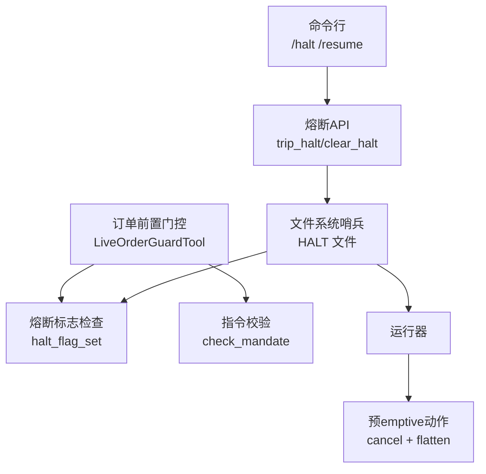
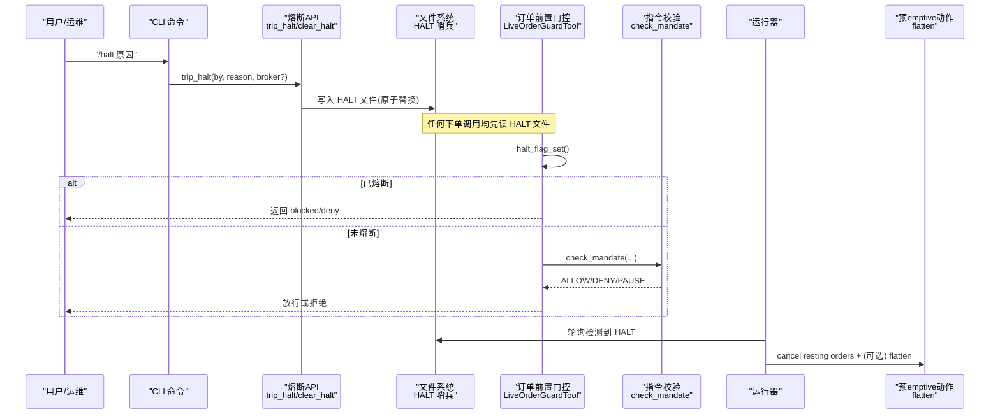
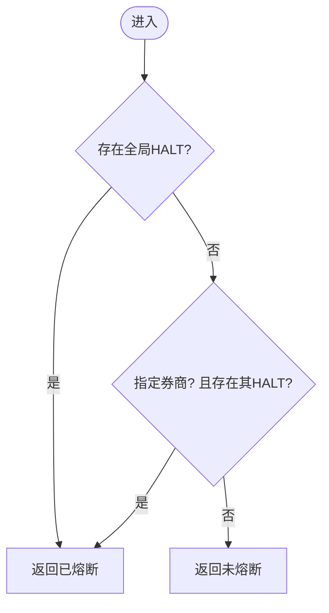
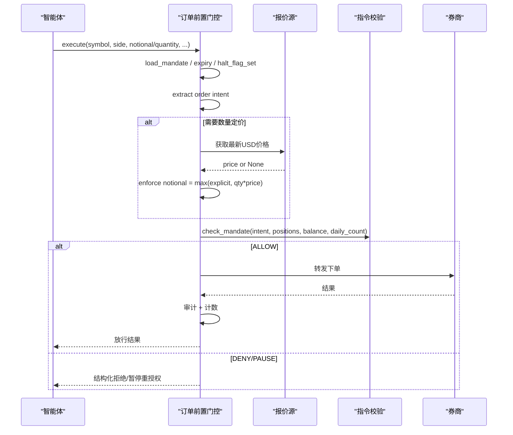
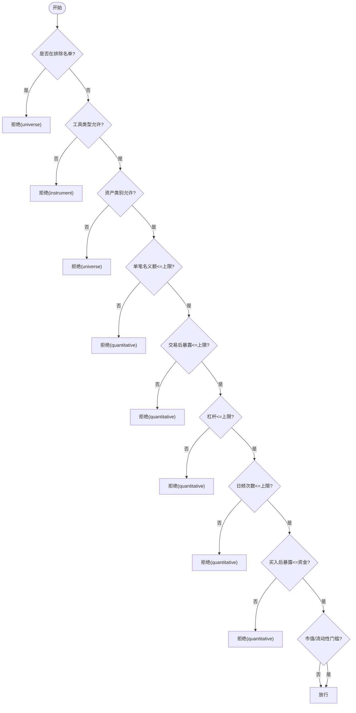
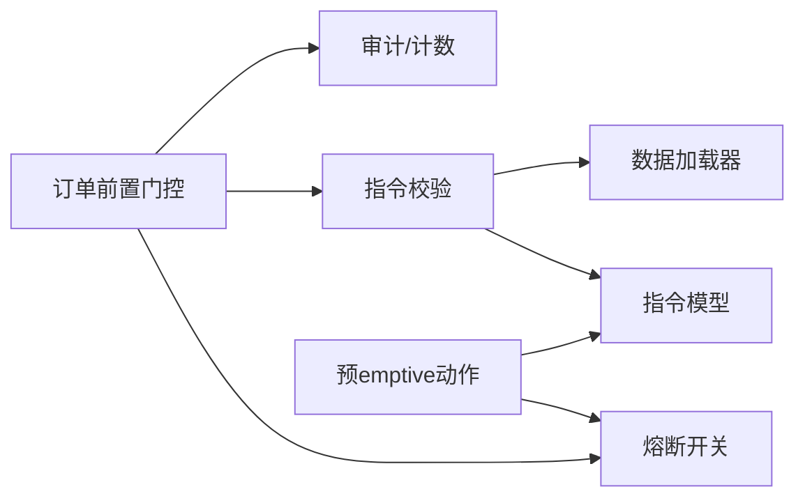

# 熔断保护系统

<cite>
**本文引用的文件**
- [halt.py](file://agent/src/live/halt.py)
- [order_guard.py](file://agent/src/live/order_guard.py)
- [enforcement.py](file://agent/src/live/enforcement.py)
- [flatten.py](file://agent/src/live/runtime/flatten.py)
- [main.py](file://agent/cli/main.py)
- [_legacy.py](file://agent/cli/_legacy.py)
- [model.py](file://agent/src/live/mandate/model.py)
- [sdk_order_gate.py](file://agent/src/live/sdk_order_gate.py)
</cite>

## 目录
1. [简介](#简介)
2. [项目结构](#项目结构)
3. [核心组件](#核心组件)
4. [架构总览](#架构总览)
5. [详细组件分析](#详细组件分析)
6. [依赖关系分析](#依赖关系分析)
7. [性能与可靠性](#性能与可靠性)
8. [故障排查指南](#故障排查指南)
9. [结论](#结论)
10. [附录](#附录)

## 简介
本技术文档围绕“熔断保护系统”展开，聚焦于交易通道中的“紧急停机（熔断）”能力、订单前置风控门控、以及极端市场下的自动恢复流程。系统通过文件系统级“看门哨”实现独立于智能体循环的即时熔断；在每笔订单执行前进行强制校验与拒绝；并在触发后提供取消挂单、必要时平仓的预emptive动作。同时，文档说明配置管理与手动干预接口，帮助运维与合规人员在极端行情中快速响应并安全恢复。

## 项目结构
与熔断保护直接相关的代码集中在 live 交易运行时与 CLI 控制面：
- 熔断开关与状态：基于文件系统哨兵文件的全局/按券商粒度熔断
- 订单前置门控：对每笔订单执行授权、限额、暴露度、杠杆、日频计数等检查
- 预emptive动作：观察熔断后主动取消挂单并按授权平仓
- CLI 干预：提供立即熔断与恢复命令

图表来源
- [halt.py:72-108](file://agent/src/live/halt.py#L72-L108)
- [order_guard.py:130-214](file://agent/src/live/order_guard.py#L130-L214)
- [flatten.py:1-14](file://agent/src/live/runtime/flatten.py#L1-L14)
- [main.py:889-924](file://agent/cli/main.py#L889-L924)

章节来源
- [halt.py:1-281](file://agent/src/live/halt.py#L1-L281)
- [order_guard.py:1-800](file://agent/src/live/order_guard.py#L1-L800)
- [flatten.py:1-14](file://agent/src/live/runtime/flatten.py#L1-L14)
- [main.py:889-924](file://agent/cli/main.py#L889-L924)

## 核心组件
- 熔断开关（全局/按券商）：通过写入/删除 HALT 哨兵文件实现，读取为纯文件系统检查，保证即使智能体卡死也能生效
- 订单前置门控：在每次下单前执行授权、过期、熔断、意图解析、报价归一化、指令校验、审计与计数
- 指令校验：覆盖排除名单、允许工具类型、资产类别、单笔名义额、总暴露、杠杆、日频次数、资金上限、流动性/市值门槛等
- 预emptive动作：观察到熔断后，先取消挂单，再根据授权提交平仓单以清空敞口
- CLI 干预：提供 /halt 与 /resume（或 stop/resume 别名），支持全局与按券商范围

章节来源
- [halt.py:72-108](file://agent/src/live/halt.py#L72-L108)
- [order_guard.py:130-214](file://agent/src/live/order_guard.py#L130-L214)
- [enforcement.py:458-620](file://agent/src/live/enforcement.py#L458-L620)
- [flatten.py:1-14](file://agent/src/live/runtime/flatten.py#L1-L14)
- [main.py:889-924](file://agent/cli/main.py#L889-L924)

## 架构总览
下图展示从 CLI 触发到订单门控再到预emptive动作的完整链路，体现“LLM 无关”的强一致熔断保障。

图表来源
- [main.py:889-924](file://agent/cli/main.py#L889-L924)
- [halt.py:72-108](file://agent/src/live/halt.py#L72-L108)
- [order_guard.py:130-214](file://agent/src/live/order_guard.py#L130-L214)
- [enforcement.py:458-620](file://agent/src/live/enforcement.py#L458-L620)
- [flatten.py:1-14](file://agent/src/live/runtime/flatten.py#L1-L14)

## 详细组件分析

### 熔断开关与状态管理（halt）
- 全局与按券商粒度：支持 <runtime_root>/live/HALT 与 <runtime_root>/live/<broker>/HALT
- 原子写入：临时文件 + replace 避免并发读写导致损坏
- 读取策略：仅检查文件是否存在；JSON 内容用于审计溯源，不可读也视为已熔断（fail-closed）
- 状态转换：
  - 触发：trip_halt(by, reason, broker?)
  - 清除：clear_halt(broker?)
  - 查询：halt_flag_set(broker?)
  - 元数据读取：read_halt(broker?)
- 预emptive动作钩子：注册 on_halt_action，在运行器检测到熔断时执行取消挂单与按需平仓

图表来源
- [halt.py:135-163](file://agent/src/live/halt.py#L135-L163)

章节来源
- [halt.py:1-281](file://agent/src/live/halt.py#L1-L281)

### 订单前置门控（LiveOrderGuardTool）
- 执行顺序（全部 fail-closed）：
  1) 加载指令（无有效指令版本 → DENY）
  2) 检查授权过期（过期 → DENY 并要求重新授权）
  3) 熔断标志检查（已熔断 → DENY，不发起任何远程调用）
  4) 解析下单意图（无法解析 → DENY）
  5) 读取持仓与账户余额（通过只读路径）
  6) 指令校验（ALLOW/DENY/PAUSE_FOR_REAUTH）
- 数量→名义额归一化：若携带 quantity，则优先取券商报价，否则回退至数据加载器获取最近收盘价，取 max(显式名义额, quantity×价格)，确保名义额/暴露/杠杆上限可执行
- 审计与计数：仅在成功放行且券商返回非错误时才增加当日计数；所有决策写审计事件并通过 SSE 推送

图表来源
- [order_guard.py:130-214](file://agent/src/live/order_guard.py#L130-L214)
- [order_guard.py:218-317](file://agent/src/live/order_guard.py#L218-L317)
- [order_guard.py:364-432](file://agent/src/live/order_guard.py#L364-L432)

章节来源
- [order_guard.py:1-800](file://agent/src/live/order_guard.py#L1-L800)

### 指令校验（check_mandate）
- 固定检查顺序（防御纵深）：
  1) 排除名单（最高优先级）
  2) 允许的工具类型（空=全拒）
  3) 资产类别（含多市场连接器显式 asset_class）
  4) 单笔名义额上限
  5) 交易后总暴露（按符号级净头寸计算）
  6) 总杠杆（暴露/资金）
  7) 日频下单次数（UTC 日历日）
  8) 资金上限（买入侧）
  9) 市值/流动性门槛（如配置）
- 失败策略：任何不可解析或缺失数据均 DENY（fail-closed）
- 违规分类：
  - universe/instrument：结构性违规 → 直接拒绝
  - quantitative：定量超限 → 暂停并要求重新授权

图表来源
- [enforcement.py:458-620](file://agent/src/live/enforcement.py#L458-L620)

章节来源
- [enforcement.py:1-798](file://agent/src/live/enforcement.py#L1-L798)

### 预emptive动作（flatten）
- 触发条件：运行器检测到 HALT 哨兵存在
- 动作序列：
  1) 取消所有挂单/在途订单
  2) 若授权允许，则提交平仓单以清空持仓
- 设计要点：先取消再平仓，避免挂单与平仓成交冲突导致风险敞口重新打开

章节来源
- [flatten.py:1-14](file://agent/src/live/runtime/flatten.py#L1-L14)
- [halt.py:194-281](file://agent/src/live/halt.py#L194-L281)

### 手动干预与配置管理（CLI）
- 熔断：/halt 或 /stop（别名），支持记录原因与范围（全局/按券商）
- 恢复：/resume，移除对应范围的 HALT 哨兵
- 历史兼容：legacy 命令同样封装 trip_halt/clear_halt

章节来源
- [main.py:889-924](file://agent/cli/main.py#L889-L924)
- [_legacy.py:3803-3839](file://agent/cli/_legacy.py#L3803-L3839)

### 异常交易暂停与数据异常检测
- 数据异常处理：
  - 报价缺失/无效：数量型订单无法定价时直接拒绝（fail-closed）
  - 持仓/余额不可解析：暴露/杠杆计算失败时拒绝
  - 市值/流动性数据不可用：门槛检查失败时拒绝
- 价格异常识别：
  - 使用券商报价优先，回退到数据加载器的最近收盘价；非正数或 NaN 视为无效
- 成交量异常监控：
  - 平均日成交额（ADV）作为流动性门槛，由 OHLCV 计算；数据不可用时拒绝
- 这些机制共同构成“异常即停”的保护原则

章节来源
- [order_guard.py:218-317](file://agent/src/live/order_guard.py#L218-L317)
- [enforcement.py:245-288](file://agent/src/live/enforcement.py#L245-L288)
- [enforcement.py:715-752](file://agent/src/live/enforcement.py#L715-L752)

### 熔断期间的交易限制
- 订单冻结：一旦检测到 HALT，所有下单前置门控直接拒绝，不发起任何远程调用
- 查询受限：只读工具不受 HALT 影响，仍可正常读取
- 通知推送：所有决策写入审计事件，通过 SSE 广播 live.action 事件，便于前端/监控实时感知

章节来源
- [order_guard.py:130-214](file://agent/src/live/order_guard.py#L130-L214)
- [order_guard.py:364-432](file://agent/src/live/order_guard.py#L364-L432)

### 熔断触发条件与恢复逻辑
- 触发条件：
  - 人工：CLI 或外部进程创建 HALT 文件
  - 系统：运行器检测到 HALT 后执行预emptive动作
- 持续时间判断：基于文件存在性；不存在即解除
- 恢复条件：
  - 人工：/resume 删除对应 HALT 文件
  - 系统：预emptive动作完成后，等待管理员确认并清除 HALT

章节来源
- [halt.py:72-108](file://agent/src/live/halt.py#L72-L108)
- [halt.py:111-132](file://agent/src/live/halt.py#L111-L132)
- [halt.py:135-163](file://agent/src/live/halt.py#L135-L163)

### 极端市场下的保护与恢复流程
- 保护：
  - 订单前置门控在极端波动下仍能保证不突破名义额/暴露/杠杆/资金等硬约束
  - 熔断开关独立于智能体循环，确保在模型失控或网络中断时仍能立刻停止交易
- 恢复：
  - 运行器在检测到熔断后主动取消挂单并按授权平仓
  - 管理员通过 /resume 清除 HALT，恢复交易

章节来源
- [order_guard.py:130-214](file://agent/src/live/order_guard.py#L130-L214)
- [flatten.py:1-14](file://agent/src/live/runtime/flatten.py#L1-L14)
- [main.py:889-924](file://agent/cli/main.py#L889-L924)

## 依赖关系分析
- 模块耦合：
  - order_guard 依赖 halt（熔断标志）、enforcement（指令校验）、daily_count（日频计数）、audit（审计）
  - enforcement 依赖 mandate model（指令模型）、数据加载器（报价/ADV/市值）
  - runtime.flatten 依赖 halt 的注册钩子与授权模型
- 外部依赖：
  - 数据加载器链（yfinance/akshare/ccxt 等）用于报价与流动性指标
  - 券商 MCP 适配器用于只读快照与下单转发

图表来源
- [order_guard.py:1-800](file://agent/src/live/order_guard.py#L1-L800)
- [enforcement.py:1-798](file://agent/src/live/enforcement.py#L1-L798)
- [model.py:1-149](file://agent/src/live/mandate/model.py#L1-L149)
- [flatten.py:1-14](file://agent/src/live/runtime/flatten.py#L1-L14)

章节来源
- [order_guard.py:1-800](file://agent/src/live/order_guard.py#L1-L800)
- [enforcement.py:1-798](file://agent/src/live/enforcement.py#L1-L798)
- [model.py:1-149](file://agent/src/live/mandate/model.py#L1-L149)
- [flatten.py:1-14](file://agent/src/live/runtime/flatten.py#L1-L14)

## 性能与可靠性
- 低开销熔断检查：仅文件系统存在性检查，几乎零CPU开销
- 原子写入：临时文件+replace 避免并发竞争导致的半写问题
- Fail-closed 设计：任何数据不可用或解析失败均拒绝，避免误放行
- 只读路径不受熔断影响：保障监控与诊断可用
- 审计与SSE：每个决策写审计并广播，便于实时监控与回溯

[本节为通用指导，无需特定文件引用]

## 故障排查指南
- 现象：下单被拒绝，提示“live trading halted”
  - 排查：检查全局或按券商 HALT 文件是否存在
  - 操作：使用 /resume 清除对应 HALT
- 现象：数量型订单被拒绝，提示“无法定价”
  - 排查：券商报价工具是否可用；数据加载器是否能获取最近收盘价
  - 操作：修复报价源或调整订单为名义额模式
- 现象：暴露/杠杆检查失败
  - 排查：持仓/余额数据是否可解析；是否出现NaN或非正数
  - 操作：修正数据源或降低订单规模
- 现象：流动性门槛失败
  - 排查：OHLCV 数据是否可用；ADV 计算是否得到正值
  - 操作：放宽流动性门槛或更换数据源

章节来源
- [order_guard.py:130-214](file://agent/src/live/order_guard.py#L130-L214)
- [order_guard.py:218-317](file://agent/src/live/order_guard.py#L218-L317)
- [enforcement.py:715-752](file://agent/src/live/enforcement.py#L715-L752)

## 结论
本熔断保护系统通过“文件系统级熔断 + 订单前置门控 + 预emptive动作”的组合，实现了在极端市场条件下的强保护与可控恢复。其 fail-closed 的设计确保了在任何数据异常或系统异常情况下都不会误放行订单；CLI 提供的即时干预能力让运维人员能够在最短时间内完成熔断与恢复。结合审计与SSE推送，系统具备完善的可观测性与可追溯性。

[本节为总结性内容，无需特定文件引用]

## 附录
- 指令模型关键属性：
  - HardCaps：资金、单笔名义额、总暴露、杠杆、允许工具类型、日频次数
  - UniverseConstraint：资产类别、市值/流动性门槛、排除名单
  - ConsentMeta：授权元数据、有效期
- SDK 直连下单也遵循相同门控流程（包含熔断检查与指令校验）

章节来源
- [model.py:46-149](file://agent/src/live/mandate/model.py#L46-L149)
- [sdk_order_gate.py:97-178](file://agent/src/live/sdk_order_gate.py#L97-L178)