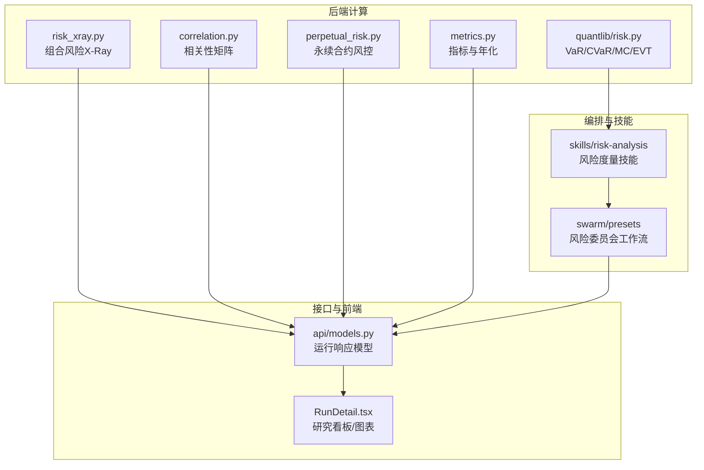
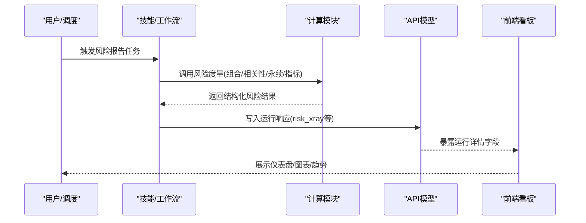
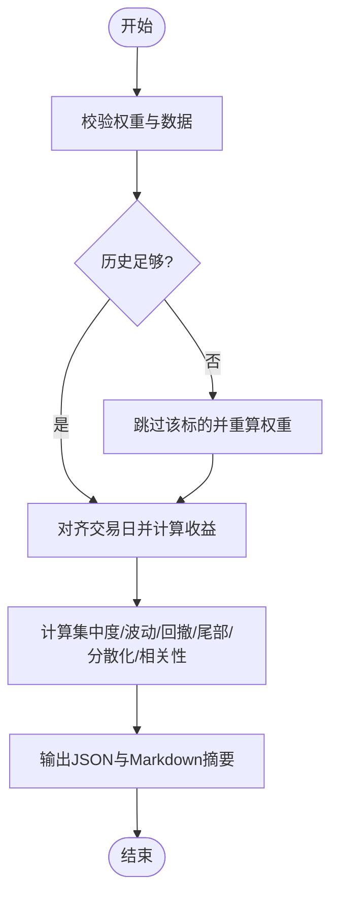
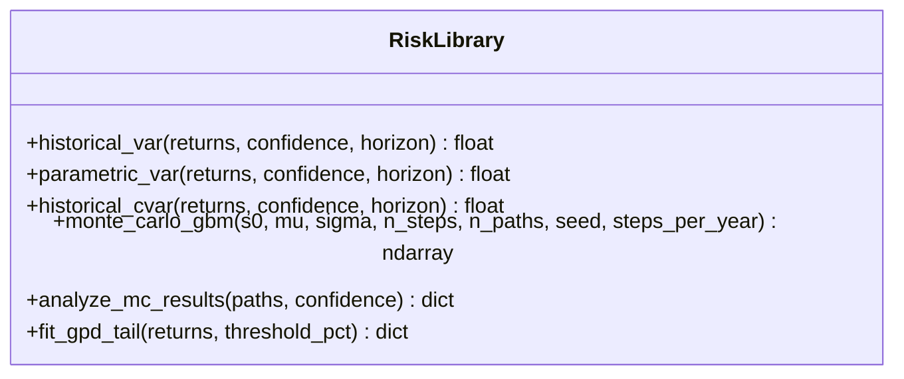
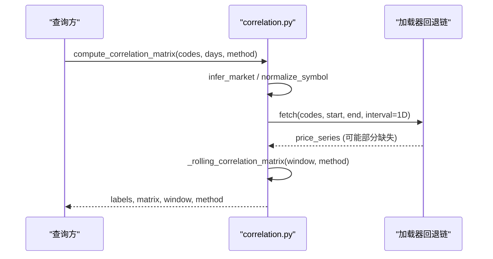
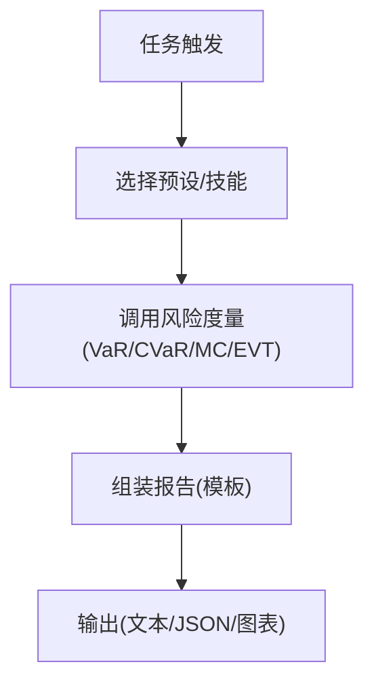
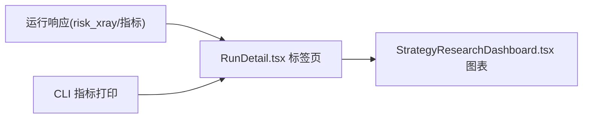
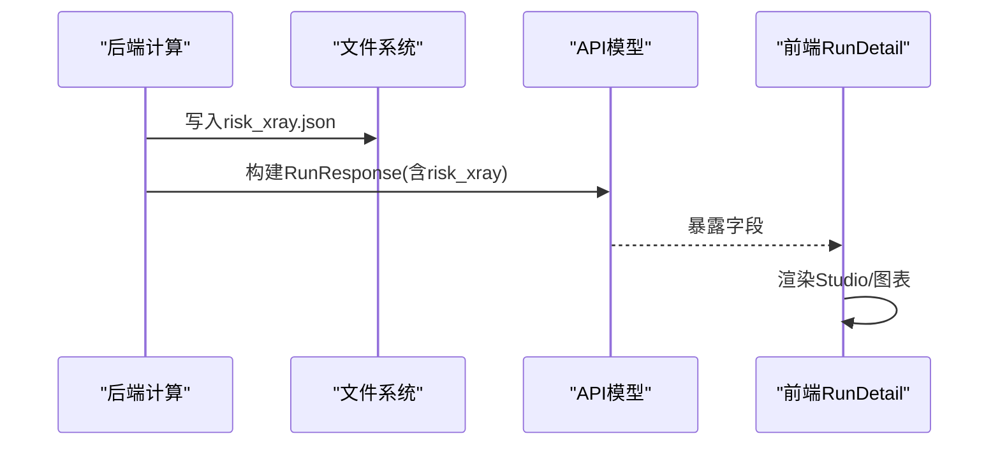
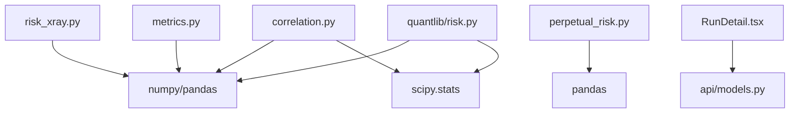

# 风险报告与分析工具

<cite>
**本文引用的文件**
- [agent/backtest/risk_xray.py](file://agent/backtest/risk_xray.py)
- [agent/backtest/correlation.py](file://agent/backtest/correlation.py)
- [agent/backtest/perpetual_risk.py](file://agent/backtest/perpetual_risk.py)
- [agent/backtest/metrics.py](file://agent/backtest/metrics.py)
- [agent/src/quantlib/risk.py](file://agent/src/quantlib/risk.py)
- [agent/src/quantlib/__init__.py](file://agent/src/quantlib/__init__.py)
- [agent/src/skills/risk-analysis/SKILL.md](file://agent/src/skills/risk-analysis/SKILL.md)
- [agent/src/swarm/presets/risk_committee.yaml](file://agent/src/swarm/presets/risk_committee.yaml)
- [agent/src/api/models.py](file://agent/src/api/models.py)
- [frontend/src/pages/RunDetail.tsx](file://frontend/src/pages/RunDetail.tsx)
- [frontend/src/components/charts/StrategyResearchDashboard.tsx](file://frontend/src/components/charts/StrategyResearchDashboard.tsx)
</cite>

## 目录
1. [简介](#简介)
2. [项目结构](#项目结构)
3. [核心组件](#核心组件)
4. [架构总览](#架构总览)
5. [详细组件分析](#详细组件分析)
6. [依赖关系分析](#依赖关系分析)
7. [性能考量](#性能考量)
8. [故障排查指南](#故障排查指南)
9. [结论](#结论)
10. [附录](#附录)

## 简介
本技术文档面向“风险报告与分析工具”，聚焦以下能力：
- 风险敞口分析：持仓集中度、波动率与回撤、尾部风险、分散化与相关性等维度。
- VaR 计算：历史模拟法、方差协方差（参数）法、蒙特卡洛模拟，并配套 CVaR/EVT 尾部建模。
- 相关性分析：资产相关性矩阵、滚动相关性与相关性断裂检测思路。
- 风险报告生成：日报/周报/月报及自定义模板的编排与输出。
- 可视化：仪表盘、图表展示、趋势分析与研究看板。
- 数据导出与集成：API 模型字段、运行产物与前端消费路径。
- 应用价值：在投资决策与合规管理中的落地方式。

## 项目结构
围绕风险模块的代码主要分布在以下位置：
- 组合风险 X-Ray：按价格面板与权重计算集中度、波动、回撤、尾部风险、分散化与相关性。
- 相关性矩阵：多资产收益率对齐与滚动相关计算，支持皮尔逊与斯皮尔曼。
- 永续合约风险：保证金层级、逐仓/全仓风控快照与强平判定。
- 指标体系：年化因子、收益序列构造、换手率与完整绩效指标。
- 量化库 risk：VaR/CVaR、最大回撤、蒙特卡洛 GBM、EVT 尾部拟合。
- 技能与编排：风险度量技能说明、委员会工作流提示词与工具调用约定。
- API 模型：运行结果中暴露风险 X-Ray 与重平衡备注等字段。
- 前端页面：运行详情中的研究看板、风险图表与交易明细。

**图示来源**
- [agent/backtest/risk_xray.py:86-176](file://agent/backtest/risk_xray.py#L86-L176)
- [agent/backtest/correlation.py:285-319](file://agent/backtest/correlation.py#L285-L319)
- [agent/backtest/perpetual_risk.py:357-418](file://agent/backtest/perpetual_risk.py#L357-L418)
- [agent/backtest/metrics.py:461-626](file://agent/backtest/metrics.py#L461-L626)
- [agent/src/quantlib/risk.py:146-251](file://agent/src/quantlib/risk.py#L146-L251)
- [agent/src/api/models.py:88-104](file://agent/src/api/models.py#L88-L104)
- [frontend/src/pages/RunDetail.tsx:128-154](file://frontend/src/pages/RunDetail.tsx#L128-L154)

**章节来源**
- [agent/backtest/risk_xray.py:86-176](file://agent/backtest/risk_xray.py#L86-L176)
- [agent/backtest/correlation.py:285-319](file://agent/backtest/correlation.py#L285-L319)
- [agent/backtest/perpetual_risk.py:357-418](file://agent/backtest/perpetual_risk.py#L357-L418)
- [agent/backtest/metrics.py:461-626](file://agent/backtest/metrics.py#L461-L626)
- [agent/src/quantlib/risk.py:146-251](file://agent/src/quantlib/risk.py#L146-L251)
- [agent/src/api/models.py:88-104](file://agent/src/api/models.py#L88-L104)
- [frontend/src/pages/RunDetail.tsx:128-154](file://frontend/src/pages/RunDetail.tsx#L128-L154)

## 核心组件
- 组合风险 X-Ray：输入为收盘价面板与权重，输出包含集中度（HHI、有效数量、Top1/Top3）、波动率（日度/年化/下行波动）、最大回撤、尾部风险（历史 VaR/ES）、分散化比率与相关性摘要，并记录被跳过的标的与警告信息。
- 相关性矩阵：对多资产收益率进行时间对齐与滚动窗口计算，支持皮尔逊与斯皮尔曼方法，返回标签与对称矩阵。
- 永续合约风控：维护账户状态、逐仓/全仓评估、维持保证金层级与强平目标，输出风险快照与保真标志。
- 指标体系：提供年化因子映射、安全收益率构造、换手率、完整绩效指标（含跟踪误差、信息比率、基准贝塔）。
- 量化风险库：统一实现历史 VaR、参数 VaR、CVaR、最大回撤分析、蒙特卡洛 GBM 与 EVT 尾部拟合，严格符号约定（损失为正）。

**章节来源**
- [agent/backtest/risk_xray.py:86-176](file://agent/backtest/risk_xray.py#L86-L176)
- [agent/backtest/correlation.py:135-213](file://agent/backtest/correlation.py#L135-L213)
- [agent/backtest/perpetual_risk.py:181-418](file://agent/backtest/perpetual_risk.py#L181-L418)
- [agent/backtest/metrics.py:153-170](file://agent/backtest/metrics.py#L153-L170)
- [agent/backtest/metrics.py:245-302](file://agent/backtest/metrics.py#L245-L302)
- [agent/backtest/metrics.py:461-626](file://agent/backtest/metrics.py#L461-L626)
- [agent/src/quantlib/risk.py:146-251](file://agent/src/quantlib/risk.py#L146-L251)
- [agent/src/quantlib/risk.py:441-517](file://agent/src/quantlib/risk.py#L441-L517)
- [agent/src/quantlib/risk.py:520-618](file://agent/src/quantlib/risk.py#L520-L618)
- [agent/src/quantlib/risk.py:621-702](file://agent/src/quantlib/risk.py#L621-L702)

## 架构总览
系统以“数据→计算→编排→接口→可视化”的分层组织：
- 数据层：通过加载器获取多市场收盘价与 OHLCV，构建对齐的收益序列。
- 计算层：risk_xray、correlation、perpetual_risk、metrics、quantlib/risk 提供纯函数式风险度量。
- 编排层：技能与工作流将风险度量与策略研究结合，驱动自动化报告。
- 接口层：运行响应模型承载风险 X-Ray、重平衡备注等结构化数据。
- 可视化层：前端研究看板与图表消费运行结果，呈现风险与收益趋势。

**图示来源**
- [agent/src/skills/risk-analysis/SKILL.md:1-20](file://agent/src/skills/risk-analysis/SKILL.md#L1-L20)
- [agent/src/swarm/presets/risk_committee.yaml:26-50](file://agent/src/swarm/presets/risk_committee.yaml#L26-L50)
- [agent/backtest/risk_xray.py:86-176](file://agent/backtest/risk_xray.py#L86-L176)
- [agent/backtest/correlation.py:285-319](file://agent/backtest/correlation.py#L285-L319)
- [agent/backtest/perpetual_risk.py:357-418](file://agent/backtest/perpetual_risk.py#L357-L418)
- [agent/backtest/metrics.py:461-626](file://agent/backtest/metrics.py#L461-L626)
- [agent/src/api/models.py:88-104](file://agent/src/api/models.py#L88-L104)
- [frontend/src/pages/RunDetail.tsx:128-154](file://frontend/src/pages/RunDetail.tsx#L128-L154)

## 详细组件分析

### 组合风险 X-Ray（持仓风险、集中度、波动、回撤、尾部风险、分散化与相关性）
- 输入校验：拒绝负权重、未知标的、非有限值；自动归一化权重；过滤历史不足标的并重算权重。
- 收益对齐：按交易日对齐并计算收益率，确保至少两个共享交易日。
- 指标计算：
  - 集中度：HHI、有效数量、Top1/Top3 权重。
  - 波动：日度波动、年化波动、下行波动年化。
  - 回撤：最大回撤、起止点与谷底日期。
  - 尾部风险：历史 VaR 与 ES（多置信水平），方法标注为历史模拟。
  - 分散化：分散化比率（需至少两资产）。
  - 相关性：平均绝对成对相关、最大相关对、等权基准 Beta。
- 输出：JSON 安全字典与 Markdown 摘要，便于报告嵌入。

**图示来源**
- [agent/backtest/risk_xray.py:47-176](file://agent/backtest/risk_xray.py#L47-L176)
- [agent/backtest/risk_xray.py:179-287](file://agent/backtest/risk_xray.py#L179-L287)
- [agent/backtest/risk_xray.py:340-372](file://agent/backtest/risk_xray.py#L340-L372)

**章节来源**
- [agent/backtest/risk_xray.py:47-176](file://agent/backtest/risk_xray.py#L47-L176)
- [agent/backtest/risk_xray.py:179-287](file://agent/backtest/risk_xray.py#L179-L287)
- [agent/backtest/risk_xray.py:340-372](file://agent/backtest/risk_xray.py#L340-L372)

### VaR 计算方法（历史模拟、参数法、蒙特卡洛）
- 历史模拟：基于排序样本的非插值下阶统计量，直接读取实际观测到的分位损失，支持持有期缩放。
- 参数法：假设正态分布，估计均值与标准差，计算分位损失；在不同置信水平下可能高估或低估历史 VaR。
- 蒙特卡洛：几何布朗运动模拟路径，汇总终端分布，计算 VaR/CVaR、亏损概率、最坏/最好分位回报。
- 符号约定：所有风险幅度为正数（损失为正），回报类指标保持自然符号。

**图示来源**
- [agent/src/quantlib/risk.py:146-251](file://agent/src/quantlib/risk.py#L146-L251)
- [agent/src/quantlib/risk.py:520-618](file://agent/src/quantlib/risk.py#L520-L618)
- [agent/src/quantlib/risk.py:621-702](file://agent/src/quantlib/risk.py#L621-L702)

**章节来源**
- [agent/src/quantlib/risk.py:146-251](file://agent/src/quantlib/risk.py#L146-L251)
- [agent/src/quantlib/risk.py:520-618](file://agent/src/quantlib/risk.py#L520-L618)
- [agent/src/quantlib/risk.py:621-702](file://agent/src/quantlib/risk.py#L621-L702)
- [agent/src/skills/risk-analysis/SKILL.md:41-92](file://agent/src/skills/risk-analysis/SKILL.md#L41-L92)

### 相关性分析工具（资产相关性矩阵、滚动相关性、相关性断裂检测）
- 市场推断与符号标准化：根据代码后缀与数字长度推断市场并转换为规范符号。
- 收益率对齐：提取收盘价序列，显式避免前向填充导致的虚假零收益，内连接对齐共同交易日。
- 滚动相关：按窗口截取最近数据，计算成对相关矩阵（皮尔逊/斯皮尔曼），处理 NaN 并四舍五入。
- 数据获取：遍历市场回退链，直到某加载器返回数据；失败时记录日志与告警。

**图示来源**
- [agent/backtest/correlation.py:19-89](file://agent/backtest/correlation.py#L19-L89)
- [agent/backtest/correlation.py:135-213](file://agent/backtest/correlation.py#L135-L213)
- [agent/backtest/correlation.py:216-282](file://agent/backtest/correlation.py#L216-L282)
- [agent/backtest/correlation.py:285-319](file://agent/backtest/correlation.py#L285-L319)

**章节来源**
- [agent/backtest/correlation.py:19-89](file://agent/backtest/correlation.py#L19-L89)
- [agent/backtest/correlation.py:135-213](file://agent/backtest/correlation.py#L135-L213)
- [agent/backtest/correlation.py:216-282](file://agent/backtest/correlation.py#L216-L282)
- [agent/backtest/correlation.py:285-319](file://agent/backtest/correlation.py#L285-L319)

### 风险报告生成（日报/周报/月报与自定义模板）
- 技能定义：风险度量技能明确 VaR/CVaR、蒙特卡洛、压力测试与尾部风险分析方法，强调统一的符号约定与可复现性。
- 工作流编排：风险委员会预设引导多角色协作，要求同时报告历史与参数 VaR、CVaR，并在历史不足时仅给出参数结果。
- 报告模板：标准结构包含摘要、核心观点、主分析、数据附录、风险提示、投资建议与免责声明，便于生成日报/周报/月报。

**图示来源**
- [agent/src/skills/risk-analysis/SKILL.md:1-20](file://agent/src/skills/risk-analysis/SKILL.md#L1-L20)
- [agent/src/skills/risk-analysis/SKILL.md:41-92](file://agent/src/skills/risk-analysis/SKILL.md#L41-L92)
- [agent/src/skills/report-generate/SKILL.md:25-76](file://agent/src/skills/report-generate/SKILL.md#L25-L76)
- [agent/src/swarm/presets/risk_committee.yaml:26-50](file://agent/src/swarm/presets/risk_committee.yaml#L26-L50)

**章节来源**
- [agent/src/skills/risk-analysis/SKILL.md:1-20](file://agent/src/skills/risk-analysis/SKILL.md#L1-L20)
- [agent/src/skills/risk-analysis/SKILL.md:41-92](file://agent/src/skills/risk-analysis/SKILL.md#L41-L92)
- [agent/src/skills/report-generate/SKILL.md:25-76](file://agent/src/skills/report-generate/SKILL.md#L25-L76)
- [agent/src/swarm/presets/risk_committee.yaml:26-50](file://agent/src/swarm/presets/risk_committee.yaml#L26-L50)

### 风险指标可视化（仪表盘、图表、趋势分析）
- 运行详情：显示研究看板、图表、交易明细、验证、运行卡片与代码等标签页，动态加载各标的 K 线与权益曲线。
- 研究看板：绘制回撤与滚动夏普、实现损益与交易账本，支持主题切换与图例配置。
- 指标展示：CLI 打印关键指标（年化收益、夏普、最大回撤、胜率、交易次数），并提供仪表板入口。

**图示来源**
- [frontend/src/pages/RunDetail.tsx:128-154](file://frontend/src/pages/RunDetail.tsx#L128-L154)
- [frontend/src/pages/RunDetail.tsx:948-979](file://frontend/src/pages/RunDetail.tsx#L948-L979)
- [frontend/src/components/charts/StrategyResearchDashboard.tsx:96-128](file://frontend/src/components/charts/StrategyResearchDashboard.tsx#L96-L128)
- [frontend/src/components/charts/StrategyResearchDashboard.tsx:172-193](file://frontend/src/components/charts/StrategyResearchDashboard.tsx#L172-L193)
- [agent/cli/main.py:799-820](file://agent/cli/main.py#L799-L820)

**章节来源**
- [frontend/src/pages/RunDetail.tsx:128-154](file://frontend/src/pages/RunDetail.tsx#L128-L154)
- [frontend/src/pages/RunDetail.tsx:948-979](file://frontend/src/pages/RunDetail.tsx#L948-L979)
- [frontend/src/components/charts/StrategyResearchDashboard.tsx:96-128](file://frontend/src/components/charts/StrategyResearchDashboard.tsx#L96-L128)
- [frontend/src/components/charts/StrategyResearchDashboard.tsx:172-193](file://frontend/src/components/charts/StrategyResearchDashboard.tsx#L172-L193)
- [agent/cli/main.py:799-820](file://agent/cli/main.py#L799-L820)

### 风险数据导出与集成接口
- 运行响应模型：包含 risk_xray、rebalance_notes 等可选字段，用于前端渲染 Portfolio Studio 视图。
- 运行产物：风险 X-Ray 以 JSON 形式持久化，供后续消费与审计。
- 前端消费：RunDetail 根据是否存在 risk_xray/rebalance_notes 决定是否显示 Studio 标签。

**图示来源**
- [agent/src/api/models.py:88-104](file://agent/src/api/models.py#L88-L104)
- [agent/backtest/risk_xray.py:375-387](file://agent/backtest/risk_xray.py#L375-L387)
- [frontend/src/pages/RunDetail.tsx:128-154](file://frontend/src/pages/RunDetail.tsx#L128-L154)

**章节来源**
- [agent/src/api/models.py:88-104](file://agent/src/api/models.py#L88-L104)
- [agent/backtest/risk_xray.py:375-387](file://agent/backtest/risk_xray.py#L375-L387)
- [frontend/src/pages/RunDetail.tsx:128-154](file://frontend/src/pages/RunDetail.tsx#L128-L154)

### 货币敞口分析与行业集中度分析
- 货币敞口：当前风险模块以价格面板与权重为核心，未内置汇率转换与货币敞口聚合；跨市场组合建议按结算货币隔离，避免混合币种加总。
- 行业集中度：可通过外部分类映射将标的映射至行业，再使用集中度指标（如 HHI）衡量行业暴露；本项目已提供组合层面的集中度度量，可按行业分组复用。

[本节为概念性说明，不直接分析具体文件]

## 依赖关系分析
- 模块耦合：
  - risk_xray 依赖 pandas/numpy 进行收益与统计计算，输出 JSON 安全字典。
  - correlation 依赖加载器注册表与回退链，内部使用 scipy.stats.spearmanr 与 numpy.corrcoef。
  - perpetual_risk 使用 dataclass 描述头寸与账户状态，严格校验数值与时间戳。
  - metrics 提供年化因子、收益构造、换手率与完整指标，支撑回测与报告。
  - quantlib/risk 提供统一的风险度量函数，被技能与工作流调用。
- 外部依赖：pandas、numpy、scipy；前端依赖 React 与 ECharts 风格图表。

**图示来源**
- [agent/backtest/risk_xray.py:21-33](file://agent/backtest/risk_xray.py#L21-L33)
- [agent/backtest/correlation.py:9-15](file://agent/backtest/correlation.py#L9-L15)
- [agent/backtest/perpetual_risk.py:15-23](file://agent/backtest/perpetual_risk.py#L15-L23)
- [agent/backtest/metrics.py:7-14](file://agent/backtest/metrics.py#L7-L14)
- [agent/src/quantlib/risk.py:39-46](file://agent/src/quantlib/risk.py#L39-L46)
- [agent/src/api/models.py:88-104](file://agent/src/api/models.py#L88-L104)

**章节来源**
- [agent/backtest/risk_xray.py:21-33](file://agent/backtest/risk_xray.py#L21-L33)
- [agent/backtest/correlation.py:9-15](file://agent/backtest/correlation.py#L9-L15)
- [agent/backtest/perpetual_risk.py:15-23](file://agent/backtest/perpetual_risk.py#L15-L23)
- [agent/backtest/metrics.py:7-14](file://agent/backtest/metrics.py#L7-L14)
- [agent/src/quantlib/risk.py:39-46](file://agent/src/quantlib/risk.py#L39-L46)
- [agent/src/api/models.py:88-104](file://agent/src/api/models.py#L88-L104)

## 性能考量
- 收益构造：bar_returns 对非正或无穷前价进行保护，避免爆炸性百分比收益影响统计。
- 年化因子：按市场与区间精确映射 bars_per_day，避免错误年化导致波动/Sharpe失真。
- 相关性计算：显式避免前向填充制造虚假零收益，保证对齐与滚动计算的稳健性。
- 蒙特卡洛：路径数与步数需足够大以稳定尾部估计；种子可复现实验。
- 前端渲染：按需加载图表与进度条，减少首屏负载。

**章节来源**
- [agent/backtest/metrics.py:245-302](file://agent/backtest/metrics.py#L245-L302)
- [agent/backtest/metrics.py:153-170](file://agent/backtest/metrics.py#L153-L170)
- [agent/backtest/correlation.py:162-176](file://agent/backtest/correlation.py#L162-L176)
- [agent/src/quantlib/risk.py:520-574](file://agent/src/quantlib/risk.py#L520-L574)
- [frontend/src/pages/RunDetail.tsx:948-979](file://frontend/src/pages/RunDetail.tsx#L948-L979)

## 故障排查指南
- 无重叠收益：相关性计算若无法对齐，会抛出异常并列出各资产日期范围，检查数据源与时间窗。
- 历史不足：risk_xray 会跳过历史不足的标的并重算权重，关注 skipped 列表与 warnings。
- 非有限值：所有风险函数对非有限输入进行清理或拒绝，确保输出 JSON 安全。
- 加载器失败：相关性模块会在回退链中尝试多个加载器，失败时记录日志；确认网络与可用性。
- 前端空数据：RunDetail 根据 risk_xray/rebalance_notes 存在性决定 Studio 标签可见性；检查运行产物是否写入。

**章节来源**
- [agent/backtest/correlation.py:175-186](file://agent/backtest/correlation.py#L175-L186)
- [agent/backtest/correlation.py:232-282](file://agent/backtest/correlation.py#L232-L282)
- [agent/backtest/risk_xray.py:125-145](file://agent/backtest/risk_xray.py#L125-L145)
- [agent/src/quantlib/risk.py:76-96](file://agent/src/quantlib/risk.py#L76-L96)
- [frontend/src/pages/RunDetail.tsx:128-154](file://frontend/src/pages/RunDetail.tsx#L128-L154)

## 结论
本工具集提供了从数据到计算、从编排到可视化的完整风险报告与分析链路：
- 组合风险 X-Ray 提供多维度风险画像，适合日常监控与合规审查。
- VaR/CVaR 与蒙特卡洛/EVT 覆盖主流风险度量方法，支持压力测试与尾部建模。
- 相关性矩阵与滚动相关有助于识别集中风险与相关性断裂信号。
- 技能与工作流使风险度量融入研究与决策流程，生成结构化报告。
- 前端看板与 CLI 指标便于快速洞察与长期趋势分析。
- API 模型与运行产物支持系统集成与审计追溯。

[本节为总结性内容，不直接分析具体文件]

## 附录
- 量化库索引：quantlib 子模块清单，涵盖期权、固收、信用、时间序列、风险、多重检验、交叉验证、事件研究、因子模型、归因、冲击、基金数学与表现。
- 符号约定：损失为正，回报保持自然符号；cvar >= var 由构造保证。

**章节来源**
- [agent/src/quantlib/__init__.py:1-38](file://agent/src/quantlib/__init__.py#L1-L38)
- [agent/src/quantlib/risk.py:1-35](file://agent/src/quantlib/risk.py#L1-L35)