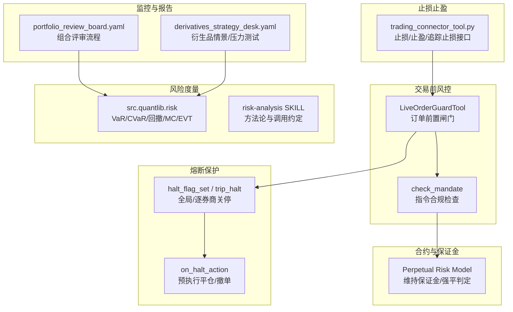
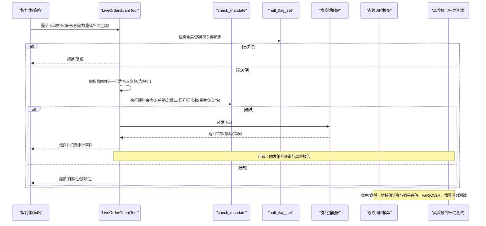
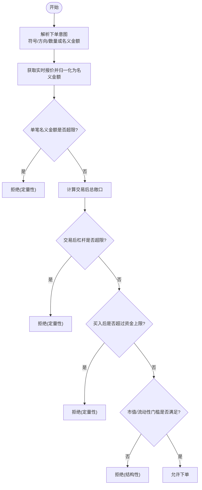
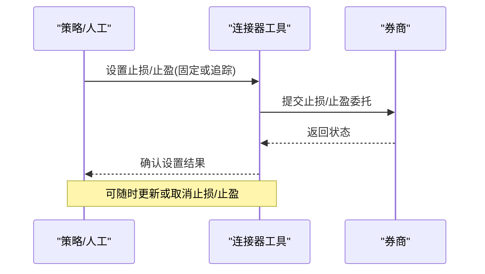
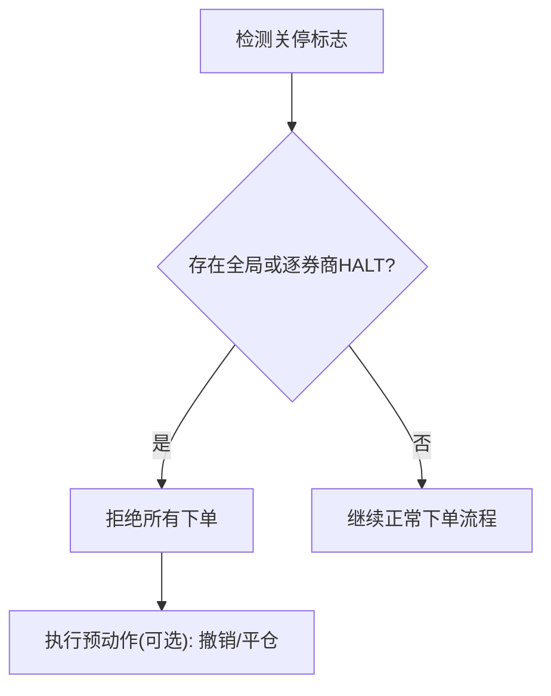
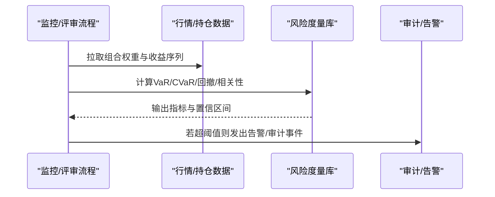
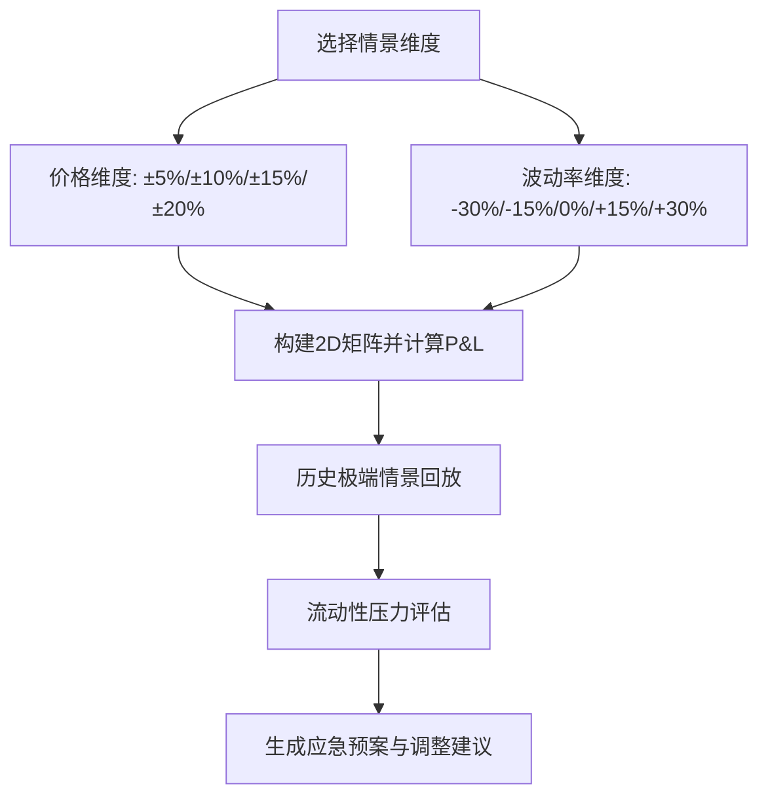
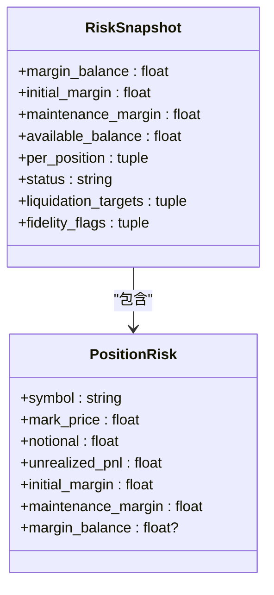
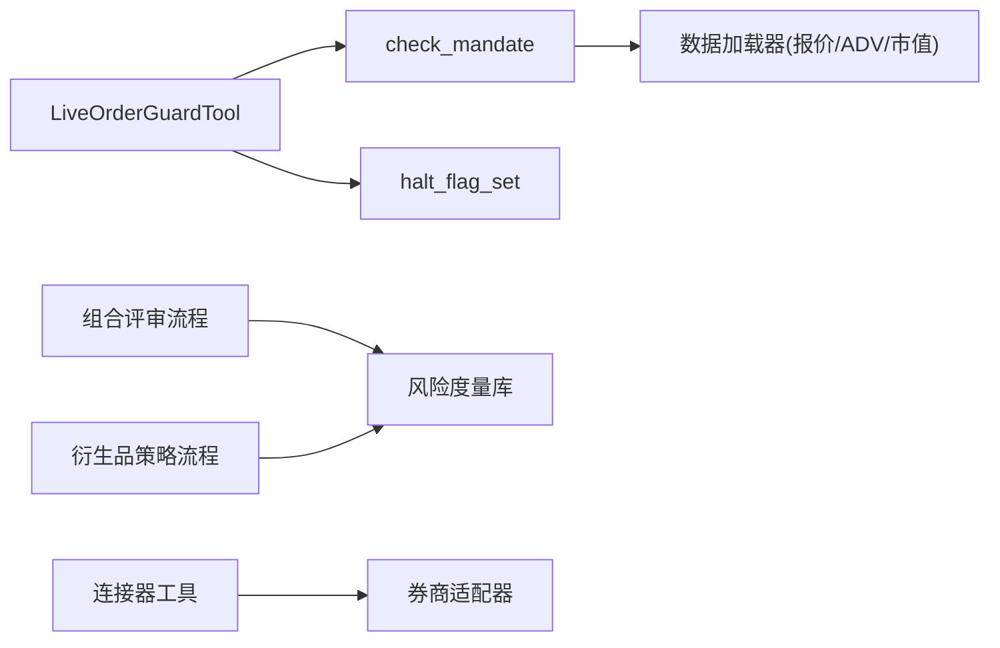

# 风险控制机制

<cite>
**本文引用的文件**
- [order_guard.py](file://agent/src/live/order_guard.py)
- [halt.py](file://agent/src/live/halt.py)
- [enforcement.py](file://agent/src/live/enforcement.py)
- [perpetual_risk.py](file://agent/backtest/perpetual_risk.py)
- [risk.py](file://agent/src/quantlib/risk.py)
- [SKILL.md（风险度量与压力测试）](file://agent/src/skills/risk-analysis/SKILL.md)
- [portfolio_review_board.yaml](file://agent/src/swarm/presets/portfolio_review_board.yaml)
- [derivatives_strategy_desk.yaml](file://agent/src/swarm/presets/derivatives_strategy_desk.yaml)
- [trading_connector_tool.py](file://agent/src/tools/trading_connector_tool.py)
</cite>

## 目录
1. [简介](#简介)
2. [项目结构](#项目结构)
3. [核心组件](#核心组件)
4. [架构总览](#架构总览)
5. [详细组件分析](#详细组件分析)
6. [依赖关系分析](#依赖关系分析)
7. [性能考量](#性能考量)
8. [故障排查指南](#故障排查指南)
9. [结论](#结论)
10. [附录](#附录)

## 简介
本技术文档系统化阐述 Vibe-Trading 的风险控制机制，覆盖仓位风险管理、止损止盈策略、熔断保护、实时监控与预警、压力测试与情景分析、风险报告与分析工具，以及配置管理与动态调整。文档以代码级实现为依据，结合流程图与序列图，帮助读者理解从下单前风控到盘中监控、再到盘后评估的完整闭环。

## 项目结构
围绕风险控制的关键模块分布如下：
- 交易前风控闸门：订单前置校验与指令合规检查
- 熔断保护：全局/逐券商的“一键关停”与预执行动作
- 合约与保证金模型：永续合约的维持保证金、强平判定
- 风险度量与压力测试：VaR/CVaR、最大回撤、蒙特卡洛、尾部拟合
- 监控与告警：阈值监控、即时告警、审计事件
- 配置与限额：硬约束、动态调整、回退与容错

图表来源
- [order_guard.py:130-214](file://agent/src/live/order_guard.py#L130-L214)
- [halt.py:135-163](file://agent/src/live/halt.py#L135-L163)
- [perpetual_risk.py:357-418](file://agent/backtest/perpetual_risk.py#L357-L418)
- [risk.py:1-24](file://agent/src/quantlib/risk.py#L1-L24)
- [portfolio_review_board.yaml:94-116](file://agent/src/swarm/presets/portfolio_review_board.yaml#L94-L116)
- [derivatives_strategy_desk.yaml:190-224](file://agent/src/swarm/presets/derivatives_strategy_desk.yaml#L190-L224)
- [trading_connector_tool.py:1000-1028](file://agent/src/tools/trading_connector_tool.py#L1000-L1028)

章节来源
- [order_guard.py:1-800](file://agent/src/live/order_guard.py#L1-L800)
- [halt.py:1-281](file://agent/src/live/halt.py#L1-L281)
- [enforcement.py:1-798](file://agent/src/live/enforcement.py#L1-L798)
- [perpetual_risk.py:1-418](file://agent/backtest/perpetual_risk.py#L1-L418)
- [risk.py:1-24](file://agent/src/quantlib/risk.py#L1-L24)
- [SKILL.md:1-100](file://agent/src/skills/risk-analysis/SKILL.md#L1-L100)
- [portfolio_review_board.yaml:94-116](file://agent/src/swarm/presets/portfolio_review_board.yaml#L94-L116)
- [derivatives_strategy_desk.yaml:190-224](file://agent/src/swarm/presets/derivatives_strategy_desk.yaml#L190-L224)
- [trading_connector_tool.py:1000-1028](file://agent/src/tools/trading_connector_tool.py#L1000-L1028)

## 核心组件
- 订单前置风控闸门：在每次下单前进行强制校验，包括指令解析、报价归一化、持仓与余额快照、硬约束检查（单笔名义金额、总敞口、杠杆、日交易次数、资金上限）、市场容量与流动性门槛等；任何不可解析或缺失数据均“失败关闭”。
- 熔断保护系统：基于文件系统哨兵的全局/逐券商关停开关；支持记录触发元数据、原子写入、读取与清理；可注册预执行动作（如撤销挂单、平仓）。
- 永续合约风险模型：按维护保证金阶梯计算维持保证金，支持隔离与全仓模式，提供强平判定与强平目标清单。
- 风险度量与压力测试：统一损失为正值的 VaR/CVaR、最大回撤、蒙特卡洛模拟、极值理论尾部拟合；通过技能文档规范调用方式。
- 监控与报告：组合评审流程驱动 VaR/CVaR、流动性压力、相关性等指标计算；衍生品策略包含多维情景矩阵与历史极端情景压力测试。
- 止损止盈管理：通过连接器工具设置固定止损、止盈与追踪止损，并支持清除或更新。

章节来源
- [order_guard.py:130-214](file://agent/src/live/order_guard.py#L130-L214)
- [halt.py:72-163](file://agent/src/live/halt.py#L72-L163)
- [perpetual_risk.py:181-418](file://agent/backtest/perpetual_risk.py#L181-L418)
- [SKILL.md:1-100](file://agent/src/skills/risk-analysis/SKILL.md#L1-L100)
- [portfolio_review_board.yaml:94-116](file://agent/src/swarm/presets/portfolio_review_board.yaml#L94-L116)
- [derivatives_strategy_desk.yaml:190-224](file://agent/src/swarm/presets/derivatives_strategy_desk.yaml#L190-L224)
- [trading_connector_tool.py:1000-1028](file://agent/src/tools/trading_connector_tool.py#L1000-L1028)

## 架构总览
下图展示从下单请求到风控闸门、合规检查、熔断判断、保证金与强平评估、以及风险度量与报告的端到端流程。

图表来源
- [order_guard.py:130-214](file://agent/src/live/order_guard.py#L130-L214)
- [halt.py:135-163](file://agent/src/live/halt.py#L135-L163)
- [enforcement.py:458-620](file://agent/src/live/enforcement.py#L458-L620)
- [perpetual_risk.py:357-418](file://agent/backtest/perpetual_risk.py#L357-L418)
- [portfolio_review_board.yaml:94-116](file://agent/src/swarm/presets/portfolio_review_board.yaml#L94-L116)

## 详细组件分析

### 仓位风险管理（最大持仓限制、单票仓位控制、行业集中度限制）
- 单笔名义金额限制：通过归一化的名义金额与硬约束比较，防止单次过大头寸。
- 总敞口限制：基于符号级有向持仓计算交易后总敞口，避免过度集中。
- 杠杆限制：以账户资金为分母计算交易后总杠杆，确保不超过上限。
- 资金上限：买入后总敞口不得超过镜像资金上限，作为最后防线。
- 流动性/市值门槛：对资产类别施加最低日均成交金额与市值下限，失败时拒绝。
- 行业集中度：通过资产类别白名单与排除列表控制暴露范围；如需更细粒度行业维度，可在指令层扩展并按相同 fail-closed 原则实施。

图表来源
- [order_guard.py:218-288](file://agent/src/live/order_guard.py#L218-L288)
- [enforcement.py:535-620](file://agent/src/live/enforcement.py#L535-L620)

章节来源
- [enforcement.py:458-620](file://agent/src/live/enforcement.py#L458-L620)
- [order_guard.py:218-288](file://agent/src/live/order_guard.py#L218-L288)

### 止损止盈机制（固定止损、移动止损、追踪止损）
- 固定止损/止盈：通过连接器工具为指定头寸设置止损与止盈价格，便于快速锁定风险与利润。
- 追踪止损：启用追踪止损参数，使止损随价格变动自动上移/下移，降低滑点与情绪干扰。
- 取消/更新：支持移除或更新现有止损/止盈，配合盘中再平衡与波动环境变化。

图表来源
- [trading_connector_tool.py:1000-1028](file://agent/src/tools/trading_connector_tool.py#L1000-L1028)

章节来源
- [trading_connector_tool.py:1000-1028](file://agent/src/tools/trading_connector_tool.py#L1000-L1028)

### 熔断保护系统（市场波动熔断、个股涨跌停保护、异常交易暂停）
- 全局/逐券商关停：通过文件系统哨兵实现 LLM 无关的即时熔断；支持记录触发时间、来源与原因。
- 预执行动作：当检测到关停时，可注册并执行预定义动作（如撤销挂单、平仓），减少冲击成本。
- 读操作不受影响：关停仅阻止写操作（下单），读工具保持可用，便于诊断与恢复。

图表来源
- [halt.py:72-163](file://agent/src/live/halt.py#L72-L163)
- [halt.py:194-281](file://agent/src/live/halt.py#L194-L281)
- [order_guard.py:161-166](file://agent/src/live/order_guard.py#L161-L166)

章节来源
- [halt.py:72-163](file://agent/src/live/halt.py#L72-L163)
- [halt.py:194-281](file://agent/src/live/halt.py#L194-L281)
- [order_guard.py:161-166](file://agent/src/live/order_guard.py#L161-L166)

### 实时监控与预警（风险指标计算、阈值监控、即时告警）
- 风险指标：组合评审流程驱动 VaR/CVaR、最大回撤、流动性压力、相关性等指标计算。
- 阈值监控：通过预设阈值与观测窗口，识别异常波动与集中度风险。
- 即时告警：审计事件与 SSE 事件将关键决策与违规事件实时上报，便于干预。

图表来源
- [portfolio_review_board.yaml:94-116](file://agent/src/swarm/presets/portfolio_review_board.yaml#L94-L116)
- [risk.py:1-24](file://agent/src/quantlib/risk.py#L1-L24)
- [order_guard.py:364-432](file://agent/src/live/order_guard.py#L364-L432)

章节来源
- [portfolio_review_board.yaml:94-116](file://agent/src/swarm/presets/portfolio_review_board.yaml#L94-L116)
- [risk.py:1-24](file://agent/src/quantlib/risk.py#L1-L24)
- [order_guard.py:364-432](file://agent/src/live/order_guard.py#L364-L432)

### 压力测试与情景分析（极端市场模拟、风险评估、应急预案）
- 多维情景矩阵：针对标的价格与隐含波动率构建二维情景，评估组合损益分布。
- 历史极端情景：选取典型危机时段，计算实际亏损与尾部风险。
- 单日极端冲击：评估标的±5%单日波动的组合损益。
- 流动性压力：在买卖价差扩大至常态数倍时的退出成本估算。
- 应急预案：根据压力测试结果制定动态调整建议（如 Delta 再平衡、滚动时机、止损退出条件）。

图表来源
- [derivatives_strategy_desk.yaml:190-224](file://agent/src/swarm/presets/derivatives_strategy_desk.yaml#L190-L224)

章节来源
- [derivatives_strategy_desk.yaml:190-224](file://agent/src/swarm/presets/derivatives_strategy_desk.yaml#L190-L224)

### 风险报告与分析工具（风险敞口分析、VaR计算、相关性分析）
- 风险敞口分析：汇总各头寸名义金额、未实现盈亏、维持保证金与可用余额。
- VaR/CVaR：历史法、参数法与蒙特卡洛三种方法，统一损失为正值的约定，确保一致性。
- 相关性分析：基于同一收益序列计算成对相关性与领先者归因，辅助识别系统性风险。
- 最大回撤与尾部拟合：评估极端下行风险与尾部概率。

图表来源
- [perpetual_risk.py:158-179](file://agent/backtest/perpetual_risk.py#L158-L179)
- [perpetual_risk.py:335-354](file://agent/backtest/perpetual_risk.py#L335-L354)

章节来源
- [perpetual_risk.py:158-179](file://agent/backtest/perpetual_risk.py#L158-L179)
- [perpetual_risk.py:335-354](file://agent/backtest/perpetual_risk.py#L335-L354)
- [SKILL.md:1-100](file://agent/src/skills/risk-analysis/SKILL.md#L1-L100)

### 配置管理与动态调整
- 硬约束配置：单笔名义金额、总敞口、杠杆、日交易次数、资金上限、资产类别白名单与排除列表、市值与流动性门槛。
- 动态调整：通过指令层与外部配置源更新限额；任何变更需遵循 fail-closed 原则，缺失或不可解析数据一律拒绝。
- 审计与追溯：每次决策写入审计事件，包含检查项、拒绝原因与建议行动，便于回溯与合规审查。

章节来源
- [enforcement.py:458-620](file://agent/src/live/enforcement.py#L458-L620)
- [order_guard.py:364-432](file://agent/src/live/order_guard.py#L364-L432)

### 实际应用与效果评估
- 实盘应用：下单前闸门拦截超限订单；关停开关在异常事件中迅速阻断交易；风险报告持续评估组合风险。
- 效果评估：通过 VaR/CVaR、最大回撤、流动性压力与情景矩阵评估策略稳健性；结合审计事件统计拒绝率与违规类型，优化限额与策略。

章节来源
- [portfolio_review_board.yaml:94-116](file://agent/src/swarm/presets/portfolio_review_board.yaml#L94-L116)
- [order_guard.py:364-432](file://agent/src/live/order_guard.py#L364-L432)

## 依赖关系分析
- 订单闸门依赖合规检查与熔断标志；合规检查依赖数据加载器获取报价与流动性信息。
- 风险度量库被组合评审与衍生品策略流程调用，形成统一的 VaR/CVaR 与压力测试能力。
- 连接器工具负责止损/止盈的下单与更新，与券商适配器交互。

图表来源
- [order_guard.py:130-214](file://agent/src/live/order_guard.py#L130-L214)
- [enforcement.py:245-288](file://agent/src/live/enforcement.py#L245-L288)
- [portfolio_review_board.yaml:94-116](file://agent/src/swarm/presets/portfolio_review_board.yaml#L94-L116)
- [derivatives_strategy_desk.yaml:190-224](file://agent/src/swarm/presets/derivatives_strategy_desk.yaml#L190-L224)
- [trading_connector_tool.py:1000-1028](file://agent/src/tools/trading_connector_tool.py#L1000-L1028)

章节来源
- [order_guard.py:130-214](file://agent/src/live/order_guard.py#L130-L214)
- [enforcement.py:245-288](file://agent/src/live/enforcement.py#L245-L288)
- [portfolio_review_board.yaml:94-116](file://agent/src/swarm/presets/portfolio_review_board.yaml#L94-L116)
- [derivatives_strategy_desk.yaml:190-224](file://agent/src/swarm/presets/derivatives_strategy_desk.yaml#L190-L224)
- [trading_connector_tool.py:1000-1028](file://agent/src/tools/trading_connector_tool.py#L1000-L1028)

## 性能考量
- 报价与流动性查询采用最近交易日闭价与滚动窗口平均，避免频繁网络请求。
- 风险度量使用向量化计算与历史样本，保证批量处理效率。
- 关停标志为纯文件系统检查，零进程内状态开销，响应迅速。
- 审计事件写入失败不阻塞决策，保障高可用。

[本节提供一般性指导，无需特定文件引用]

## 故障排查指南
- 下单被拒绝：检查是否触达单笔名义金额、总敞口、杠杆、日次数或资金上限；查看审计事件中的拒绝原因与建议行动。
- 关停生效：确认全局或逐券商 HALT 文件是否存在；必要时清理并重新授权。
- 报价不可用：检查数据加载器可用性；若无法获取报价，系统将拒绝以数量计价的订单。
- 风险指标异常：核对收益序列与权重；确保 VaR/CVaR 在同一置信水平与样本上计算。

章节来源
- [order_guard.py:514-616](file://agent/src/live/order_guard.py#L514-L616)
- [halt.py:111-163](file://agent/src/live/halt.py#L111-L163)
- [enforcement.py:245-288](file://agent/src/live/enforcement.py#L245-L288)

## 结论
Vibe-Trading 的风险控制体系以“失败关闭”为核心原则，贯穿下单前闸门、盘中熔断、保证金与强平评估、风险度量与压力测试、以及审计与告警。通过严格的限额与流动性门槛、灵活的止损/止盈与追踪止损、以及可配置的关停与预执行动作，系统在保障交易安全的同时，提供了强大的风险可视化与应急处理能力。

[本节总结性内容，无需特定文件引用]

## 附录
- 术语说明：
  - 名义金额：以美元计的交易规模
  - 总敞口：所有头寸绝对值之和
  - 杠杆：总敞口除以账户资金
  - 维持保证金：交易所要求的最低保证金
  - VaR/CVaR：在给定置信水平下的潜在损失与尾部平均损失
- 最佳实践：
  - 始终使用统一的风险度量库，避免手工重算导致符号错误
  - 将限额设定锚定到历史分布与压力测试结果
  - 定期复盘审计事件，优化限额与策略参数

[本节为补充信息，无需特定文件引用]