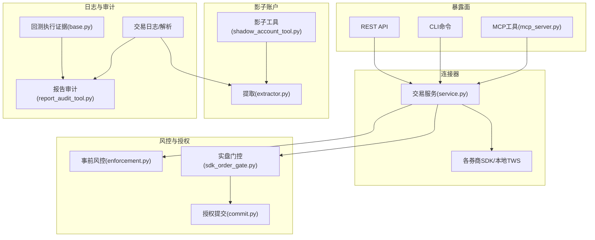
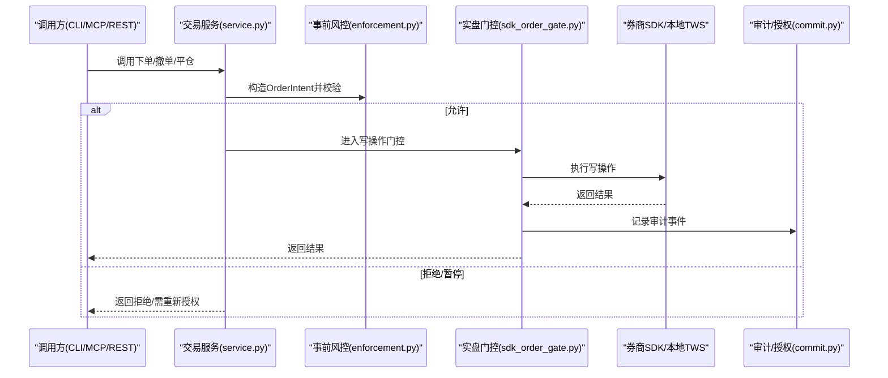
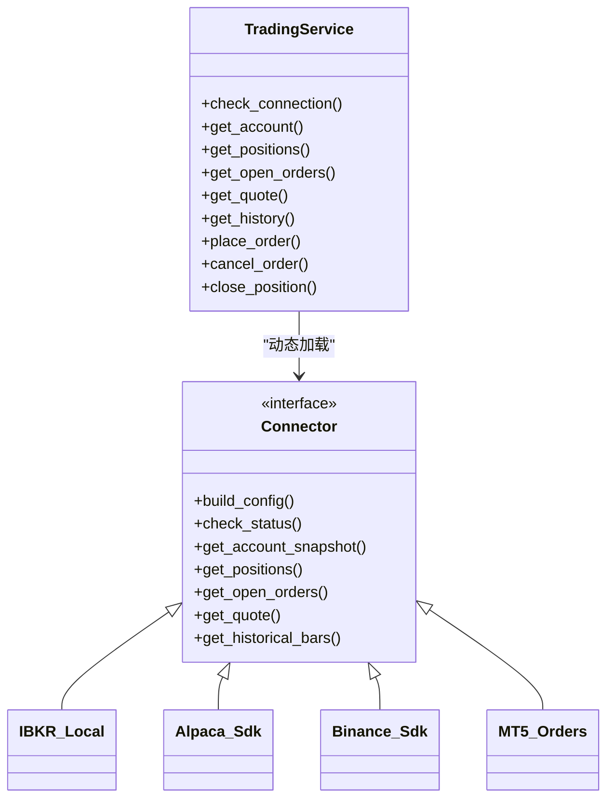
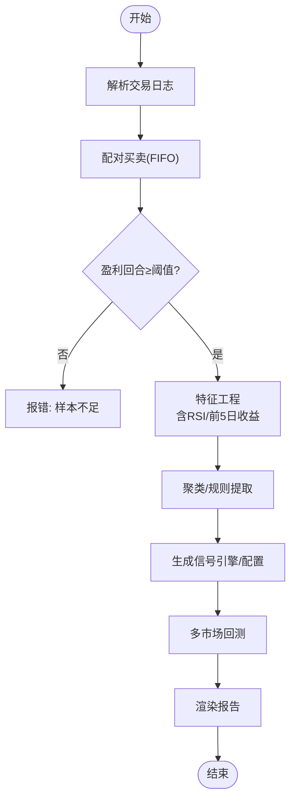
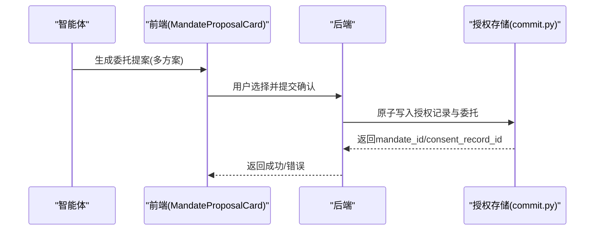
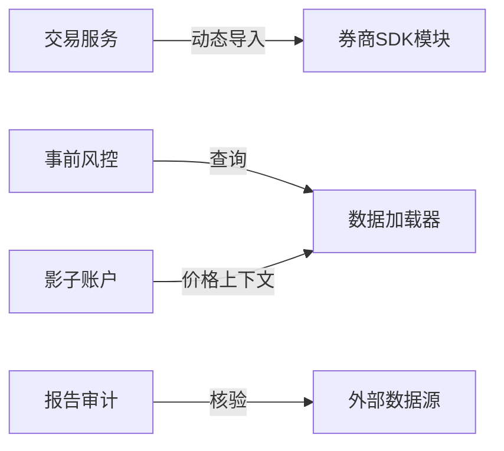

# 交易执行工具

<cite>
**本文引用的文件**
- [README.md](file://README.md)
- [service.py](file://agent/src/trading/service.py)
- [__init__.py（交易模块）](file://agent/src/trading/__init__.py)
- [extractor.py（影子账户提取器）](file://agent/src/shadow_account/extractor.py)
- [__init__.py（影子账户模块）](file://agent/src/shadow_account/__init__.py)
- [shadow_account_tool.py（影子账户工具）](file://agent/src/tools/shadow_account_tool.py)
- [report_audit_tool.py（报告审计工具）](file://agent/src/tools/report_audit_tool.py)
- [enforcement.py（事前风控与授权）](file://agent/src/live/enforcement.py)
- [sdk_order_gate.py（实盘订单门控）](file://agent/src/live/sdk_order_gate.py)
- [commit.py（授权提交）](file://agent/src/live/mandate/commit.py)
- [MandateProposalCard.tsx（前端授权确认）](file://frontend/src/components/chat/MandateProposalCard.tsx)
- [base.py（回测执行证据）](file://agent/backtest/engines/base.py)
- [crypto.py（加密货币引擎）](file://agent/backtest/engines/crypto.py)
- [orders.py（MT5订单）](file://agent/src/trading/connectors/mt5/orders.py)
- [trading212说明](file://agent/src/trading/connectors/trading212/__init__.py)
- [mcp_server.py（MCP交易工具路由）](file://agent/mcp_server.py)
</cite>

## 目录
1. [简介](#简介)
2. [项目结构](#项目结构)
3. [核心组件](#核心组件)
4. [架构总览](#架构总览)
5. [详细组件分析](#详细组件分析)
6. [依赖关系分析](#依赖关系分析)
7. [性能考量](#性能考量)
8. [故障排查指南](#故障排查指南)
9. [结论](#结论)
10. [附录：API接口、认证配置与执行示例](#附录api接口认证配置与执行示例)

## 简介
本文件面向“交易执行工具”的完整文档，覆盖以下能力：
- 交易连接器工具：多券商接口集成、统一账户管理、订单路由与读写隔离。
- 影子账户工具：从真实交易日志提取可复现规则，进行多市场回测与绩效对比。
- 交易日志工具：交易记录解析、行为诊断、统计分析。
- 报告审计工具：对研究报告中的数值进行抽取与核验，输出通过/失败判定。
- 委托提案工具：生成可审批的授权委托（Mandate），支持用户二次确认与持久化。
同时给出自动化交易系统构建方法（风险控制、订单管理、绩效监控）、安全最佳实践与故障恢复机制。

## 项目结构
围绕交易执行的核心路径包括：
- 连接器层：统一抽象不同券商SDK/本地TWS/远程MCP，提供账户、持仓、报价、历史等只读能力，以及受控的下单/撤单/平仓能力。
- 风控与授权：事前强制校验（指令白名单、资产类别、单笔名义金额、总敞口、杠杆、日频次数、资金上限），并支持委托提案与用户确认。
- 影子账户：基于交易日志提取规则，驱动多市场回测，产出策略代码与对比报告。
- 日志与审计：回测与实盘均产生不可变执行证据；报告审计工具对研究结果进行数据级核验。
- 工具暴露：CLI、REST API、MCP工具注册表统一对外暴露。

图表来源
- [service.py:1-120](file://agent/src/trading/service.py#L1-L120)
- [enforcement.py:1-120](file://agent/src/live/enforcement.py#L1-L120)
- [sdk_order_gate.py:346-389](file://agent/src/live/sdk_order_gate.py#L346-L389)
- [commit.py:488-524](file://agent/src/live/mandate/commit.py#L488-L524)
- [extractor.py:64-145](file://agent/src/shadow_account/extractor.py#L64-L145)
- [shadow_account_tool.py:142-175](file://agent/src/tools/shadow_account_tool.py#L142-L175)
- [report_audit_tool.py:358-386](file://agent/src/tools/report_audit_tool.py#L358-L386)
- [base.py:2303-2332](file://agent/backtest/engines/base.py#L2303-L2332)
- [mcp_server.py:1263-1302](file://agent/mcp_server.py#L1263-L1302)

章节来源
- [README.md:216-328](file://README.md#L216-L328)

## 核心组件
- 交易连接器服务：统一账户/持仓/订单/报价/历史读取；对写操作按环境（模拟/实盘）走不同路径，实盘必须经过事前风控与审计。
- 事前风控与授权：将订单归一化为“意图”，逐项检查白名单、资产类别、单笔名义金额、总敞口、杠杆、日频次数、资金上限；结构性违规直接拒绝，数量型违规暂停待重新授权。
- 影子账户：从交易日志配对买卖、计算特征、聚类提取规则、生成信号引擎与回测报告，支持多市场结算货币池对比。
- 报告审计：从文本抽取指标，抓取外部数据比对，输出通过/失败及差异明细。
- 委托提案：生成多个授权方案供用户选择，确认后原子写入授权记录与生效的委托，附带过期时间与安全令牌摘要。

章节来源
- [service.py:1-120](file://agent/src/trading/service.py#L1-L120)
- [enforcement.py:458-620](file://agent/src/live/enforcement.py#L458-L620)
- [extractor.py:64-145](file://agent/src/shadow_account/extractor.py#L64-L145)
- [report_audit_tool.py:358-386](file://agent/src/tools/report_audit_tool.py#L358-L386)
- [commit.py:488-524](file://agent/src/live/mandate/commit.py#L488-L524)

## 架构总览
下图展示一次“下单”请求在系统中的流转：从工具入口到风控门控，再到券商SDK或远程MCP，最终落库审计。

图表来源
- [service.py:283-346](file://agent/src/trading/service.py#L283-L346)
- [enforcement.py:458-620](file://agent/src/live/enforcement.py#L458-L620)
- [sdk_order_gate.py:346-389](file://agent/src/live/sdk_order_gate.py#L346-L389)
- [commit.py:488-524](file://agent/src/live/mandate/commit.py#L488-L524)

## 详细组件分析

### 交易连接器工具（多券商接口集成、订单路由、账户管理）
- 统一抽象：通过服务层根据profile的transport类型分发到本地TWS、broker_sdk或直接远程调用。
- 只读能力：账户、持仓、挂单、报价、历史行情等。
- 写能力：下单、撤单、部分/全部平仓（如eToro），仅对broker_sdk且非readonly的profile开放；实盘必须通过事前风控与审计。
- 多券商支持：包含Tiger、Longbridge、Alpaca、OKX、Binance、Futu、Dhan、Shoonya、Trading212、MT5、eToro等。

图表来源
- [service.py:1-120](file://agent/src/trading/service.py#L1-L120)
- [orders.py:1-39](file://agent/src/trading/connectors/mt5/orders.py#L1-L39)
- [trading212说明:1-7](file://agent/src/trading/connectors/trading212/__init__.py#L1-L7)

章节来源
- [service.py:1-120](file://agent/src/trading/service.py#L1-L120)
- [service.py:283-346](file://agent/src/trading/service.py#L283-L346)
- [service.py:349-374](file://agent/src/trading/service.py#L349-L374)
- [service.py:946-985](file://agent/src/trading/service.py#L946-L985)
- [orders.py:1-39](file://agent/src/trading/connectors/mt5/orders.py#L1-L39)
- [trading212说明:1-7](file://agent/src/trading/connectors/trading212/__init__.py#L1-L7)

### 影子账户工具（模拟交易、策略验证、绩效对比）
- 输入：券商导出CSV/Excel（同花顺、东方财富、富途、通用格式）。
- 处理：配对买卖→过滤盈利回合→特征工程（含RSI、前5日收益等价格上下文）→聚类→提取规则→生成信号引擎与回测。
- 输出：ShadowProfile、规则集合、多市场回测结果、HTML/PDF报告。
- 特性：离线降级（无价格数据时退化为行为规则）、最小样本保护、多市场结算货币池对比。

图表来源
- [extractor.py:64-145](file://agent/src/shadow_account/extractor.py#L64-L145)
- [extractor.py:149-270](file://agent/src/shadow_account/extractor.py#L149-L270)
- [extractor.py:301-416](file://agent/src/shadow_account/extractor.py#L301-L416)
- [shadow_account_tool.py:142-175](file://agent/src/tools/shadow_account_tool.py#L142-L175)

章节来源
- [extractor.py:64-145](file://agent/src/shadow_account/extractor.py#L64-L145)
- [extractor.py:149-270](file://agent/src/shadow_account/extractor.py#L149-L270)
- [extractor.py:301-416](file://agent/src/shadow_account/extractor.py#L301-L416)
- [shadow_account_tool.py:142-175](file://agent/src/tools/shadow_account_tool.py#L142-L175)
- [__init__.py（影子账户模块）:1-54](file://agent/src/shadow_account/__init__.py#L1-L54)

### 交易日志工具（交易记录、统计分析、合规审计）
- 解析多种券商导出格式，生成交易画像（胜率、盈亏比、回撤、频率、时段分布等）。
- 行为诊断：处置效应、过度交易、追涨、锚定偏差。
- 为影子账户提供基础数据，并与回测执行证据（fills.jsonl）联动用于审计。

章节来源
- [base.py:2303-2332](file://agent/backtest/engines/base.py#L2303-L2332)
- [README.md:216-328](file://README.md#L216-L328)

### 报告审计工具
- 功能：从研究报告中抽取关键数值，抓取外部数据源比对，输出PASS/FAIL与差异明细。
- 用途：确保研究结论的数据可溯源、可核验，避免“自说自话”。

章节来源
- [report_audit_tool.py:358-386](file://agent/src/tools/report_audit_tool.py#L358-L386)

### 委托提案工具（授权与审批）
- 流程：生成多个授权方案（限额、标的范围、日频等）→ 用户在前端选择并确认 → 原子写入授权记录与生效委托 → 设置过期时间与令牌摘要。
- 安全：前端仅触发提交，后端负责持久化与校验；任何未经验证的修改不会生效。

图表来源
- [commit.py:488-524](file://agent/src/live/mandate/commit.py#L488-L524)
- [MandateProposalCard.tsx:203-231](file://frontend/src/components/chat/MandateProposalCard.tsx#L203-L231)

章节来源
- [commit.py:488-524](file://agent/src/live/mandate/commit.py#L488-L524)
- [MandateProposalCard.tsx:203-231](file://frontend/src/components/chat/MandateProposalCard.tsx#L203-L231)

## 依赖关系分析
- 连接器服务依赖具体券商SDK模块，通过映射表动态导入，保证扩展性。
- 事前风控依赖数据加载器获取市值/流动性/报价，缺失则fail-closed拒绝。
- 影子账户依赖回测加载器获取价格上下文，无法获取时降级为纯行为规则。
- 报告审计依赖外部数据源进行核验，缺失点不计入统计但影响判定。

图表来源
- [service.py:17-29](file://agent/src/trading/service.py#L17-L29)
- [enforcement.py:696-791](file://agent/src/live/enforcement.py#L696-L791)
- [extractor.py:175-225](file://agent/src/shadow_account/extractor.py#L175-L225)

章节来源
- [service.py:17-29](file://agent/src/trading/service.py#L17-L29)
- [enforcement.py:696-791](file://agent/src/live/enforcement.py#L696-L791)
- [extractor.py:175-225](file://agent/src/shadow_account/extractor.py#L175-L225)

## 性能考量
- 批量与缓存：影子账户按符号批量拉取价格历史，减少网络往返；回测与数据加载器支持缓存以降低重复开销。
- 向量化与快速路径：技术指标与因子计算使用高效实现；回测引擎在严格模式下记录事件但不阻塞主流程。
- 资源限制：连接器与服务层对并发与超时进行控制，避免长连接阻塞。

[本节为通用指导，不直接分析具体文件]

## 故障排查指南
- 连接器连通性：使用check_connection查看状态、包版本与环境；若为broker_sdk，确认对应包已安装。
- 授权问题：若出现“需重新授权”，检查委托是否过期、是否被终止标志阻断、是否达到日频上限。
- 数据缺失：当市值/流动性/报价不可用时，风控会fail-closed拒绝；检查数据源可用性与网络。
- 影子账户样本不足：盈利回合数低于阈值会报错；需扩大样本或放宽筛选条件。
- 报告审计失败：若某项指标无法核验，将被标记为FAIL；检查数据来源与抽取逻辑。

章节来源
- [service.py:42-65](file://agent/src/trading/service.py#L42-L65)
- [enforcement.py:458-620](file://agent/src/live/enforcement.py#L458-L620)
- [extractor.py:88-104](file://agent/src/shadow_account/extractor.py#L88-L104)
- [report_audit_tool.py:358-386](file://agent/src/tools/report_audit_tool.py#L358-L386)

## 结论
本系统以“连接器优先”的统一抽象对接多券商，结合强约束的事前风控与可审计的授权流程，保障实盘交易的安全与可追溯。影子账户从真实交易出发，提炼可执行规则并进行多市场回测，形成闭环的策略验证体系。配合交易日志与报告审计，构建了从研究到执行的完整链路。建议在生产环境中启用严格的授权与审计、开启数据缓存与限流、并对异常路径做充分告警与恢复。

[本节为总结，不直接分析具体文件]

## 附录：API接口、认证配置与执行示例

### 交易连接器API（只读为主，写操作受限）
- 常用接口
  - check_connection(profile_id, **overrides)
  - get_account(profile_id, **overrides)
  - get_positions(profile_id, **overrides)
  - get_open_orders(profile_id, include_executions=False, **overrides)
  - get_quote(symbol, profile_id=None, exchange="SMART", currency="USD", sec_type="STK", **overrides)
  - get_history(symbol, profile_id=None, exchange="SMART", currency="USD", sec_type="STK", duration="30 D", bar_size="1 day", what_to_show="TRADES", use_rth=True, period="1d", limit=90, **overrides)
  - place_order(symbol, profile_id=None, side, quantity=None, notional=None, order_type="market", limit_price=None, time_in_force="day", session_id="", **overrides)
  - cancel_order(order_id, profile_id=None, symbol=None, session_id="", **overrides)
  - close_position(position_id, profile_id=None, instrument_id=None, units_to_close=None, request_id=None, session_id="", **overrides)
- 认证与配置
  - 通过profile_id选择连接器与传输方式（local_tws/broker_sdk/remote）。
  - broker_sdk路径下，每个connector模块提供build_config与check_status。
  - 实盘写操作需要满足前置风控与授权要求。
- 执行示例（概念性）
  - 读取账户：调用get_account并传入profile_id。
  - 下单：调用place_order，side与notional/quantity二选一；实盘将触发风控与审计。
  - 撤单/平仓：调用cancel_order/close_position，遵循风险降低优先原则。

章节来源
- [service.py:42-229](file://agent/src/trading/service.py#L42-L229)
- [service.py:283-374](file://agent/src/trading/service.py#L283-L374)
- [service.py:946-985](file://agent/src/trading/service.py#L946-L985)

### 影子账户API
- 常用接口
  - extract_shadow_profile(journal_path, min_support=DEFAULT_MIN_SUPPORT, max_rules=DEFAULT_MAX_RULES, llm_translator=None)
  - run_shadow_backtest(profile_id_or_path, markets, start_date, end_date, ...)
- 认证与配置
  - 无需券商密钥即可运行；如需价格上下文，依赖回测数据加载器。
- 执行示例（概念性）
  - 上传交易日志后调用extract_shadow_profile生成ShadowProfile。
  - 调用run_shadow_backtest进行多市场回测并生成报告。

章节来源
- [extractor.py:64-145](file://agent/src/shadow_account/extractor.py#L64-L145)
- [shadow_account_tool.py:142-175](file://agent/src/tools/shadow_account_tool.py#L142-L175)

### 报告审计API
- 常用接口
  - report_audit(command="extract|verdict", ...)
- 认证与配置
  - 只读工具；依赖外部数据源进行核验。
- 执行示例（概念性）
  - 使用extract从报告中抽取指标；使用verdict对抽取结果与外部数据进行比对并输出判定。

章节来源
- [report_audit_tool.py:358-386](file://agent/src/tools/report_audit_tool.py#L358-L386)

### 委托提案API
- 常用接口
  - propose_mandate(...)
  - commit_mandate(proposal_id, ordinal, adjustments=None, consent_ack=True, broker, account_ref, session_id)
- 认证与配置
  - 前端触发提交，后端原子写入授权记录与委托，设置过期时间与安全令牌摘要。
- 执行示例（概念性）
  - 生成提案后，用户在界面选择ordinal并提交；后端完成持久化并返回mandate_id与consent_record_id。

章节来源
- [commit.py:488-524](file://agent/src/live/mandate/commit.py#L488-L524)
- [MandateProposalCard.tsx:203-231](file://frontend/src/components/chat/MandateProposalCard.tsx#L203-L231)

### 自动化交易系统构建要点
- 风险控制
  - 事前风控：白名单、资产类别、单笔名义金额、总敞口、杠杆、日频次数、资金上限。
  - 事后审计：所有写操作记录审计事件，支持回溯与重放。
- 订单管理
  - 统一抽象下单/撤单/平仓；区分模拟与实盘路径；支持部分平仓与参数校验。
- 绩效监控
  - 回测引擎输出fills.jsonl与trades.csv；影子账户对比实际与规则化策略表现。
- 安全最佳实践
  - fail-closed设计：任何不可解析或缺失数据均拒绝而非放行。
  - 授权最小化：仅授予必要权限，设置过期与撤销机制。
  - 审计留痕：所有关键动作记录不可变日志。
- 故障恢复
  - 连接器断线重试与降级；数据源不可用时的降级策略；授权过期自动暂停。

章节来源
- [enforcement.py:458-620](file://agent/src/live/enforcement.py#L458-L620)
- [sdk_order_gate.py:346-389](file://agent/src/live/sdk_order_gate.py#L346-L389)
- [base.py:2303-2332](file://agent/backtest/engines/base.py#L2303-L2332)
- [crypto.py:486-517](file://agent/backtest/engines/crypto.py#L486-L517)