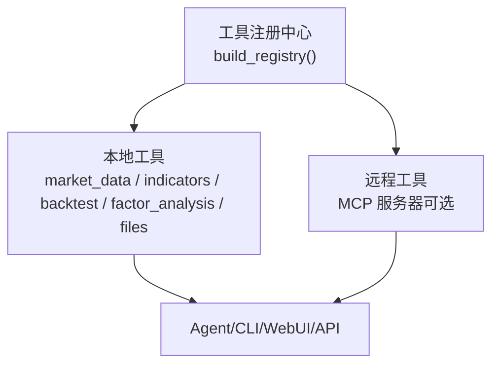
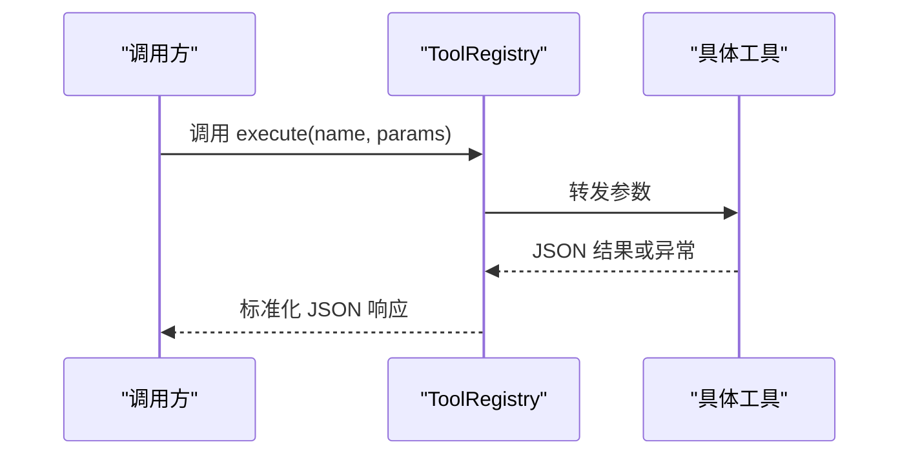
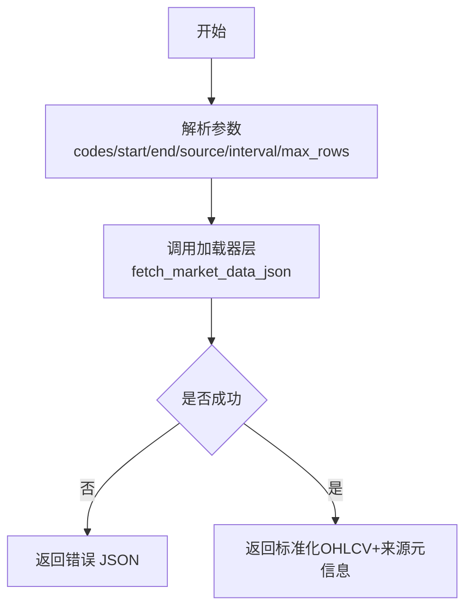
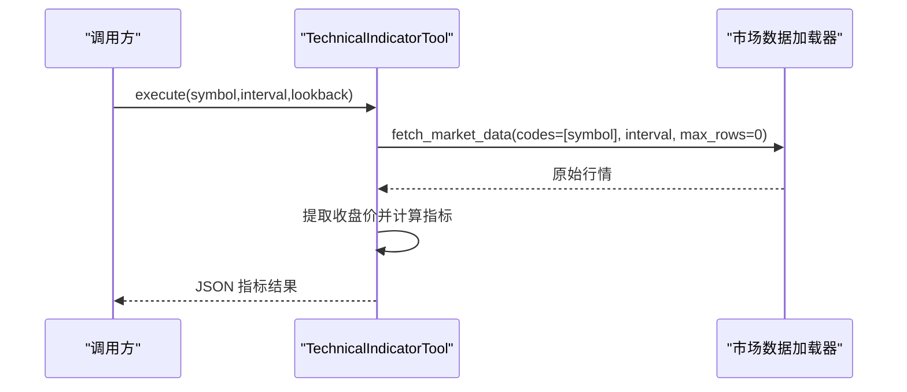
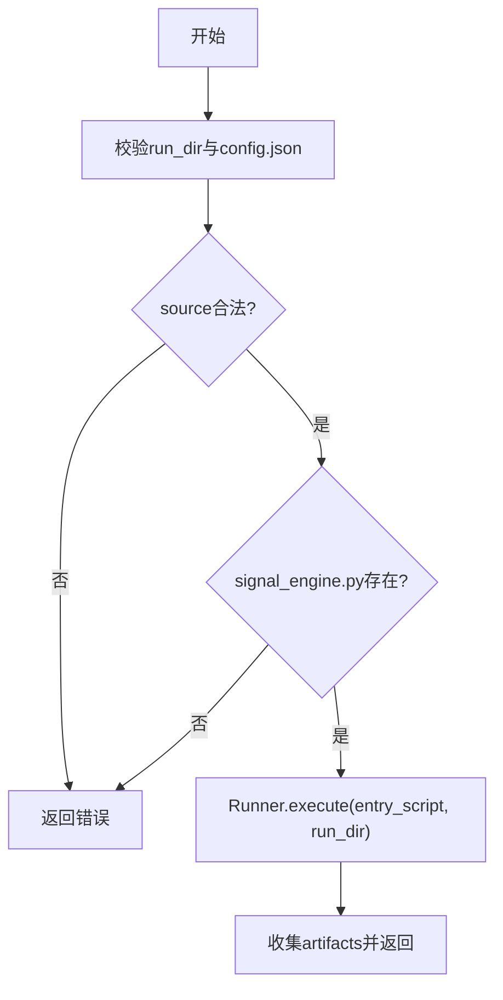
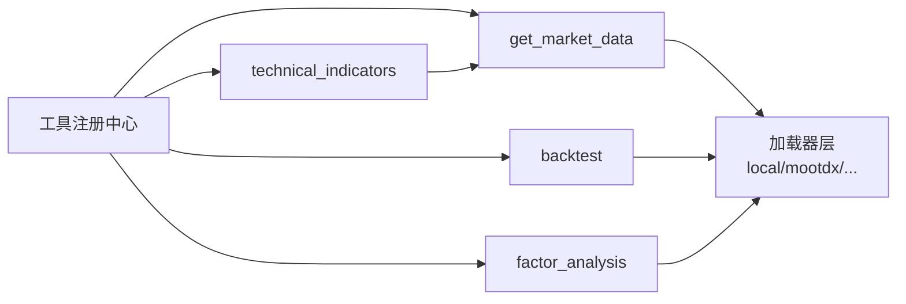

# 内置工具集合

<cite>
**本文引用的文件**
- [agent/src/tools/__init__.py](file://agent/src/tools/__init__.py)
- [agent/src/agent/tools.py](file://agent/src/agent/tools.py)
- [agent/src/tools/market_data_tool.py](file://agent/src/tools/market_data_tool.py)
- [agent/src/tools/technical_indicator_tool.py](file://agent/src/tools/technical_indicator_tool.py)
- [agent/src/tools/backtest_tool.py](file://agent/src/tools/backtest_tool.py)
- [agent/src/tools/factor_analysis_tool.py](file://agent/src/tools/factor_analysis_tool.py)
- [agent/src/tools/read_file_tool.py](file://agent/src/tools/read_file_tool.py)
- [agent/src/tools/write_file_tool.py](file://agent/src/tools/write_file_tool.py)
- [agent/src/tools/edit_file_tool.py](file://agent/src/tools/edit_file_tool.py)
- [agent/src/swarm/presets/quant_strategy_desk.yaml](file://agent/src/swarm/presets/quant_strategy_desk.yaml)
- [agent/src/swarm/presets/factor_research_committee.yaml](file://agent/src/swarm/presets/factor_research_committee.yaml)
- [agent/src/swarm/presets/etf_allocation_desk.yaml](file://agent/src/swarm/presets/etf_allocation_desk.yaml)
- [agent/src/swarm/presets/portfolio_review_board.yaml](file://agent/src/swarm/presets/portfolio_review_board.yaml)
- [agent/backtest/loaders/local_loader.py](file://agent/backtest/loaders/local_loader.py)
- [agent/backtest/loaders/mootdx_loader.py](file://agent/backtest/loaders/mootdx_loader.py)
</cite>

## 目录
1. [简介](#简介)
2. [项目结构](#项目结构)
3. [核心组件](#核心组件)
4. [架构总览](#架构总览)
5. [详细组件分析](#详细组件分析)
6. [依赖关系分析](#依赖关系分析)
7. [性能考量](#性能考量)
8. [故障排除指南](#故障排除指南)
9. [结论](#结论)
10. [附录](#附录)

## 简介
本文件系统化梳理 Vibe-Trading 的“内置工具集合”，覆盖市场分析、数据处理与策略开发三大类，并给出参数说明、使用示例、返回值格式、组合工作流、最佳实践与性能优化建议，以及错误处理与排障方法。所有工具通过统一的 BaseTool + ToolRegistry 机制自动发现与注册，支持本地工具与远程 MCP 工具的融合编排，便于在 CLI、Web UI、REST API 与 Agent/MCP 中一致调用。

## 项目结构
- 工具基础设施：BaseTool、ToolRegistry 定义统一接口与执行封装；tools 包通过子模块自动发现并注册具体工具。
- 市场数据与指标：get_market_data 提供多源 OHLCV 获取；technical_indicators 计算 RSI/MACD/Bollinger/SMA/EMA。
- 策略与回测：backtest 工具校验配置与信号引擎并驱动内置回测引擎；factor_analysis 提供 IC/IR 与分层净值。
- 数据处理：read_file/write_file/edit_file 提供安全的读写能力，配合路径白名单与沙箱约束。
- 编排与组合：Swarm Presets（如因子研究委员会、量化策略台、ETF 配置台）展示如何串联多个工具完成复杂工作流。

图表来源
- [agent/src/tools/__init__.py:66-245](file://agent/src/tools/__init__.py#L66-L245)
- [agent/src/agent/tools.py:13-95](file://agent/src/agent/tools.py#L13-L95)

章节来源
- [agent/src/tools/__init__.py:1-365](file://agent/src/tools/__init__.py#L1-L365)
- [agent/src/agent/tools.py:1-95](file://agent/src/agent/tools.py#L1-L95)

## 核心组件
- 工具基座与注册
  - BaseTool：统一 name/description/parameters/repeatable/is_readonly 与 execute 契约。
  - ToolRegistry：注册、查询、批量导出 OpenAI 函数定义、安全执行与异常兜底。
  - build_registry：自动扫描 src/tools 下子类，按策略注入 session_id、持久化记忆、MCP 工具等，支持过滤与白名单。

- 关键工具概览
  - 市场分析
    - get_market_data：多源 OHLCV 拉取，支持 auto 探测与指定源，返回标准化数据与来源元信息。
    - technical_indicators：基于历史收盘价计算 RSI/MACD/Bollinger/SMA/EMA，要求连续未截断序列。
  - 数据处理
    - read_file/write_file/edit_file：受限路径下的读/写/替换，支持 skills/ 命名空间与运行目录隔离。
  - 策略开发
    - backtest：校验 config.json 与 signal_engine.py，调用 Runner 执行回测，产出 artifacts。
    - factor_analysis：输入因子与收益 CSV，输出 IC/IR、分组净值与统计摘要。

章节来源
- [agent/src/agent/tools.py:13-95](file://agent/src/agent/tools.py#L13-L95)
- [agent/src/tools/__init__.py:66-245](file://agent/src/tools/__init__.py#L66-L245)
- [agent/src/tools/market_data_tool.py:11-107](file://agent/src/tools/market_data_tool.py#L11-L107)
- [agent/src/tools/technical_indicator_tool.py:164-290](file://agent/src/tools/technical_indicator_tool.py#L164-L290)
- [agent/src/tools/read_file_tool.py:18-133](file://agent/src/tools/read_file_tool.py#L18-L133)
- [agent/src/tools/write_file_tool.py:14-107](file://agent/src/tools/write_file_tool.py#L14-L107)
- [agent/src/tools/edit_file_tool.py:14-98](file://agent/src/tools/edit_file_tool.py#L14-L98)
- [agent/src/tools/backtest_tool.py:15-95](file://agent/src/tools/backtest_tool.py#L15-L95)
- [agent/src/tools/factor_analysis_tool.py:19-152](file://agent/src/tools/factor_analysis_tool.py#L19-L152)

## 架构总览
工具层通过统一注册表暴露给上层调用方（Agent、CLI、Web、API、MCP）。本地工具优先，MCP 工具按需追加；对实时券商通道进行授权与安全门控。

图表来源
- [agent/src/agent/tools.py:54-95](file://agent/src/agent/tools.py#L54-L95)

章节来源
- [agent/src/tools/__init__.py:66-245](file://agent/src/tools/__init__.py#L66-L245)
- [agent/src/agent/tools.py:54-95](file://agent/src/agent/tools.py#L54-L95)

## 详细组件分析

### 市场分析工具

#### 价格查询：get_market_data
- 功能：通过仓库加载器层获取标准化 OHLCV 数据，支持多种数据源与区间、粒度控制，附带来源元信息。
- 关键参数
  - codes: 代码数组，如 AAPL.US、700.HK、BTC-USDT。
  - start_date/end_date: YYYY-MM-DD。
  - source: 数据源枚举（auto/longbridge/yfinance/yahoo/okx/ccxt/tushare/baostock/tencent/akshare/mootdx/eastmoney/sina/stooq/finnhub/alphavantage/tiingo/fmp/mt5/pykrx），默认 auto。
  - interval: 周期，如 1D、1H、4H、30m，默认 1D。
  - max_rows: 每标的行数上限，默认系统限制。
- 返回值：JSON 字符串，包含各标的 OHLCV 数据与 _provenance.volume_unit 等元信息。
- 使用示例（描述性）：请求某美股与加密货币在指定区间的日线数据，source=auto，interval=1D，max_rows=0 表示全量。
- 注意事项：A 股成交量单位为手，美/港为股，读取前需关注 volume_unit。

图表来源
- [agent/src/tools/market_data_tool.py:11-107](file://agent/src/tools/market_data_tool.py#L11-L107)

章节来源
- [agent/src/tools/market_data_tool.py:11-107](file://agent/src/tools/market_data_tool.py#L11-L107)

#### 技术指标：technical_indicators
- 功能：基于历史收盘价计算 RSI（Wilder-EWM）、MACD、Bollinger Bands、SMA(20/50/200)、EMA(20)。
- 关键参数
  - symbol: 交易标的。
  - interval: 周期，默认 1d。
  - lookback: 回溯条数，默认 200，最大 500。
- 返回值：JSON，包含 ok、symbol、interval、latest_close、latest_date 与 indicators 字典。
- 使用示例（描述性）：对某 A 股日线数据计算近 200 根 K 线的 RSI/MACD/布林带与均线。
- 注意事项：需要连续未截断的行情；若数据被截断会返回明确错误。

图表来源
- [agent/src/tools/technical_indicator_tool.py:164-290](file://agent/src/tools/technical_indicator_tool.py#L164-L290)

章节来源
- [agent/src/tools/technical_indicator_tool.py:164-290](file://agent/src/tools/technical_indicator_tool.py#L164-L290)

### 数据处理工具

#### 文件读取：read_file
- 功能：从工作区读取文件内容，支持 skills/ 命名空间与运行目录隔离，限制输出长度。
- 关键参数
  - path: 相对路径，skills/ 前缀指向内置技能目录。
  - limit: 可选行数限制。
- 返回值：JSON，status 与 content（可能截断）。
- 安全：仅允许访问白名单根目录，防止路径穿越。

章节来源
- [agent/src/tools/read_file_tool.py:18-133](file://agent/src/tools/read_file_tool.py#L18-L133)

#### 文件写入：write_file
- 功能：在工作区创建或覆盖文件，自动创建父目录。
- 关键参数
  - path: 相对 run_dir 的路径。
  - content: 写入内容。
- 返回值：JSON，status、path、bytes_written。
- 安全：通过 allowed_write_roots 与 resolve_safe_path 限制写入范围。

章节来源
- [agent/src/tools/write_file_tool.py:14-107](file://agent/src/tools/write_file_tool.py#L14-L107)

#### 文件编辑：edit_file
- 功能：在文件中查找并替换首次出现的文本。
- 关键参数
  - path: 目标文件路径。
  - old_text/new_text: 查找与替换文本。
- 返回值：JSON，status 与操作消息。
- 安全：同样受写入白名单保护。

章节来源
- [agent/src/tools/edit_file_tool.py:14-98](file://agent/src/tools/edit_file_tool.py#L14-L98)

### 策略开发工具

#### 回测引擎：backtest
- 功能：校验 run_dir 中的 config.json 与 code/signal_engine.py，调用内置回测引擎执行，收集 artifacts。
- 关键参数
  - run_dir: 回测运行目录。
- 返回值：JSON，包含 status、exit_code、stdout/stderr 片段、artifacts 映射与 run_dir。
- 前置条件：config.json 必须包含 source 且为有效值；signal_engine.py 必须存在。

图表来源
- [agent/src/tools/backtest_tool.py:15-95](file://agent/src/tools/backtest_tool.py#L15-L95)

章节来源
- [agent/src/tools/backtest_tool.py:15-95](file://agent/src/tools/backtest_tool.py#L15-L95)

#### 因子分析：factor_analysis
- 功能：输入因子与收益 CSV，计算 IC/IR、IC 正比、分组净值曲线，输出统计摘要与文件。
- 关键参数
  - factor_csv: 因子矩阵（索引=date，列=codes）。
  - return_csv: 收益矩阵（同结构）。
  - n_groups: 分位数组数，默认 5。
  - output_dir: 输出目录。
- 返回值：JSON，包含 ic_mean/ic_std/ir/ic_positive_ratio/ic_count/n_groups/long_short_spread/group_final_equity 与 files 列表。
- 注意：至少需要每日足够多的共享资产以计算 IC；否则返回错误。

章节来源
- [agent/src/tools/factor_analysis_tool.py:19-152](file://agent/src/tools/factor_analysis_tool.py#L19-L152)

### 组合工作流与编排示例
- 因子研究委员会（并行挖掘 → 验证 → 组合 → 回测）
  - 典型流程：使用 market_data 获取收益序列，factor_analysis 评估因子质量，结合 skill 生成策略代码，最后 backtest 验证。
  - 参考预设：[agent/src/swarm/presets/factor_research_committee.yaml:1-206](file://agent/src/swarm/presets/factor_research_committee.yaml#L1-L206)
- 量化策略台（因子挖掘 → 组合 → 回测）
  - 强调使用 factor_analysis 计算相关性、权重与回测。
  - 参考预设：[agent/src/swarm/presets/quant_strategy_desk.yaml:33-65](file://agent/src/swarm/presets/quant_strategy_desk.yaml#L33-L65)
- ETF 配置台（筛选 → 宏观分配 → 风险预算 → 优化 → 回测）
  - 使用 mean-variance/risk-parity/Black-Litterman 等方法确定权重，并通过 backtest 验证。
  - 参考预设：[agent/src/swarm/presets/etf_allocation_desk.yaml:196-239](file://agent/src/swarm/presets/etf_allocation_desk.yaml#L196-L239)
- 投资组合评审（归因 → 因子暴露 → 贡献排名 → 诊断）
  - 结合 factor_analysis、get_market_data 与归因工具进行复盘。
  - 参考预设：[agent/src/swarm/presets/portfolio_review_board.yaml:45-65](file://agent/src/swarm/presets/portfolio_review_board.yaml#L45-L65)

章节来源
- [agent/src/swarm/presets/factor_research_committee.yaml:1-206](file://agent/src/swarm/presets/factor_research_committee.yaml#L1-L206)
- [agent/src/swarm/presets/quant_strategy_desk.yaml:33-65](file://agent/src/swarm/presets/quant_strategy_desk.yaml#L33-L65)
- [agent/src/swarm/presets/etf_allocation_desk.yaml:196-239](file://agent/src/swarm/presets/etf_allocation_desk.yaml#L196-L239)
- [agent/src/swarm/presets/portfolio_review_board.yaml:45-65](file://agent/src/swarm/presets/portfolio_review_board.yaml#L45-L65)

## 依赖关系分析
- 工具注册与发现
  - 通过遍历 src/tools 包导入每个模块，收集 BaseTool 子类并注册；可跳过 shell 工具与不可用依赖的工具。
  - 支持注入 session_id、事件回调、持久化记忆，并按策略合并 MCP 工具。
- 数据加载器
  - local_loader 将本地 CSV/Parquet/DuckDB 等转换为标准 OHLCV 结构，统一日期与时区。
  - mootdx_loader 将通达信数据规范化为标准列名与时间索引。
- 回测与因子
  - backtest 依赖 Runner 与 backtest 引擎；factor_analysis 依赖 pandas 与内部因子分析核心。

图表来源
- [agent/src/tools/__init__.py:66-245](file://agent/src/tools/__init__.py#L66-L245)
- [agent/backtest/loaders/local_loader.py:141-176](file://agent/backtest/loaders/local_loader.py#L141-L176)
- [agent/backtest/loaders/mootdx_loader.py:211-242](file://agent/backtest/loaders/mootdx_loader.py#L211-L242)

章节来源
- [agent/src/tools/__init__.py:66-245](file://agent/src/tools/__init__.py#L66-L245)
- [agent/backtest/loaders/local_loader.py:141-176](file://agent/backtest/loaders/local_loader.py#L141-L176)
- [agent/backtest/loaders/mootdx_loader.py:211-242](file://agent/backtest/loaders/mootdx_loader.py#L211-L242)

## 性能考量
- 数据获取
  - 使用 get_market_data 时合理设置 max_rows 与 interval，避免不必要的全量下载。
  - 对于长窗口指标（如 SMA200），technical_indicators 会自动抓取足够长的连续序列，但仍应控制 lookback。
- 计算开销
  - technical_indicators 使用纯 Python（numpy/pandas）计算，避免额外依赖；确保输入为连续未截断数据以减少重采样与对齐成本。
  - factor_analysis 对 IC 计算有最低样本要求，不足时会快速失败，避免无效计算。
- 文件 I/O
  - read_file 支持 limit 与输出截断，避免大文件阻塞；write_file/edit_file 通过白名单与路径解析减少权限开销。
- 回测
  - backtest 的 Runner 带有超时保护；建议在 config.json 中限定数据范围与标的数量以提升速度。

## 故障排除指南
- 常见错误与定位
  - 工具不存在：ToolRegistry.execute 会返回 tool not found 的错误 JSON。
  - 文件路径越界：read_file/write_file/edit_file 会拒绝不安全路径并返回错误。
  - 数据缺失或格式错误：technical_indicators 在无收盘价或缺失日期时返回错误；factor_analysis 在空数据或共享日期不足时报错。
  - 回测配置错误：缺少 source 或 source 不在允许列表、signal_engine.py 缺失都会导致失败。
- 排查步骤
  - 检查工具参数是否符合 schema（required/enum/type）。
  - 确认数据源可用性与网络状态；必要时切换 source。
  - 查看工具返回的 error 字段与 stdout/stderr 片段。
  - 对文件操作，确认 run_dir 与 allowed roots 配置正确。
  - 对回测，先独立验证 config.json 与 signal_engine.py 语法与逻辑。

章节来源
- [agent/src/agent/tools.py:72-84](file://agent/src/agent/tools.py#L72-L84)
- [agent/src/tools/read_file_tool.py:74-133](file://agent/src/tools/read_file_tool.py#L74-L133)
- [agent/src/tools/write_file_tool.py:70-107](file://agent/src/tools/write_file_tool.py#L70-L107)
- [agent/src/tools/edit_file_tool.py:45-98](file://agent/src/tools/edit_file_tool.py#L45-L98)
- [agent/src/tools/technical_indicator_tool.py:207-290](file://agent/src/tools/technical_indicator_tool.py#L207-L290)
- [agent/src/tools/factor_analysis_tool.py:36-105](file://agent/src/tools/factor_analysis_tool.py#L36-L105)
- [agent/src/tools/backtest_tool.py:24-74](file://agent/src/tools/backtest_tool.py#L24-L74)

## 结论
Vibe-Trading 的内置工具以统一接口与严格的安全边界为核心，覆盖从数据获取、指标计算到因子分析与回测验证的完整策略研发链路。通过 Swarm Presets 的组合编排，可在复杂工作流中高效串联多个工具，实现从研究到验证的闭环。遵循参数规范、数据质量与性能优化建议，可显著提升研究与生产的稳定性与效率。

## 附录
- 常用工具速查
  - 价格查询：get_market_data（codes/start/end/source/interval/max_rows）
  - 技术指标：technical_indicators（symbol/interval/lookback）
  - 文件操作：read_file/write_file/edit_file（path/content/old_text/new_text）
  - 回测：backtest（run_dir）
  - 因子分析：factor_analysis（factor_csv/return_csv/output_dir/n_groups）
- 组合工作流模板
  - 因子研究委员会：market_data → factor_analysis → strategy generation → backtest
  - ETF 配置台：screener → macro allocation → risk budget → optimizer → backtest
  - 投资组合评审：attribution → factor exposure → contribution ranking → diagnosis