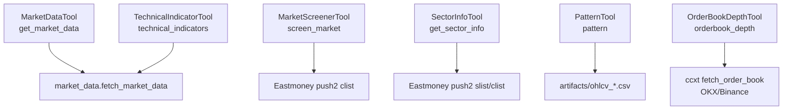
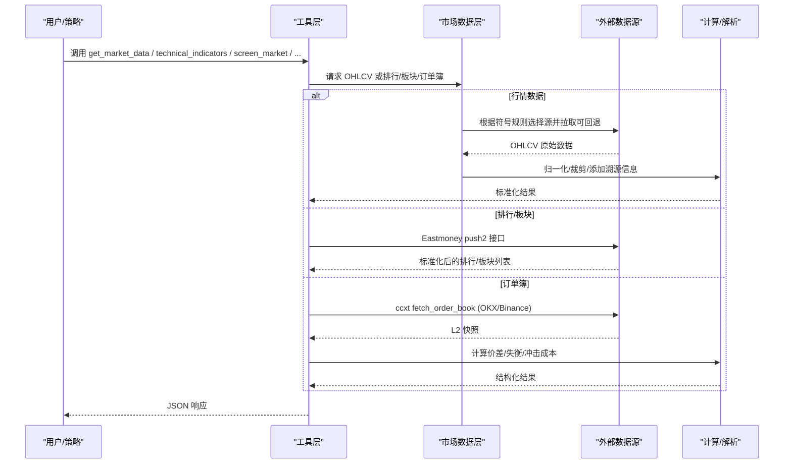
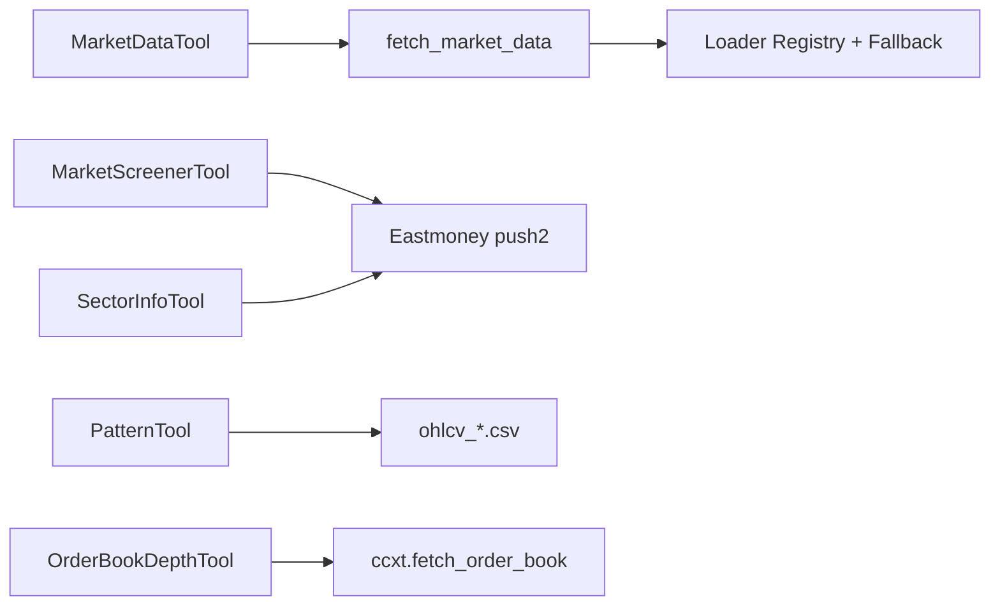

# 市场分析工具

<cite>
**本文引用的文件**
- [market_data_tool.py](file://agent/src/tools/market_data_tool.py)
- [technical_indicator_tool.py](file://agent/src/tools/technical_indicator_tool.py)
- [market_screener_tool.py](file://agent/src/tools/market_screener_tool.py)
- [pattern_tool.py](file://agent/src/tools/pattern_tool.py)
- [orderbook_depth_tool.py](file://agent/src/tools/orderbook_depth_tool.py)
- [sector_tool.py](file://agent/src/tools/sector_tool.py)
- [market_data.py](file://agent/src/market_data.py)
</cite>

## 目录
1. [简介](#简介)
2. [项目结构](#项目结构)
3. [核心组件](#核心组件)
4. [架构总览](#架构总览)
5. [详细组件分析](#详细组件分析)
6. [依赖关系分析](#依赖关系分析)
7. [性能考虑](#性能考虑)
8. [故障排查指南](#故障排查指南)
9. [结论](#结论)
10. [附录](#附录)

## 简介
本文件面向“市场分析工具”的完整使用与集成，覆盖以下能力：
- 市场数据查询：统一获取多市场（A股、港股、美股、加密货币、外汇等）的实时与历史行情。
- 技术指标计算：均线（SMA/EMA）、MACD、RSI、布林带等常用指标。
- 市场筛选：全市场涨跌幅/成交量/换手率排行；板块归属与板块热度。
- K线形态识别：头肩顶/底、双顶/底、三角形、扩散形态、支撑阻力、K线形态统计等。
- 订单簿深度分析：加密货币现货 L2 订单簿快照、价差、失衡度、冲击成本估算。

文档为每个工具提供参数说明、返回值格式、典型用法建议，并给出组合工作流、错误处理与性能优化建议。

## 项目结构
围绕市场分析的核心代码集中在 agent/src/tools 与 agent/src/market_data.py：
- market_data_tool.py：封装统一的 OHLCV 数据获取接口，支持多源自动选择与回退。
- technical_indicator_tool.py：基于价格序列计算 RSI/MACD/布林带/SMA/EMA。
- market_screener_tool.py：基于东方财富 push2 的全市场排行（A/US/HK）。
- sector_tool.py：A 股行业/概念板块成员查询与板块排行。
- pattern_tool.py：读取回测产物中的 OHLCV CSV，进行多种 K 线形态检测。
- orderbook_depth_tool.py：通过 ccxt 拉取 OKX/Binance 现货订单簿，计算价差、失衡与冲击成本。
- market_data.py：共享的数据获取与归一化逻辑，含符号到来源的自动路由、行裁剪与溯源元数据。

**图示来源**
- [market_data_tool.py:11-106](file://agent/src/tools/market_data_tool.py#L11-L106)
- [market_data.py:97-239](file://agent/src/market_data.py#L97-L239)
- [market_screener_tool.py:167-257](file://agent/src/tools/market_screener_tool.py#L167-L257)
- [sector_tool.py:301-375](file://agent/src/tools/sector_tool.py#L301-L375)
- [pattern_tool.py:323-411](file://agent/src/tools/pattern_tool.py#L323-L411)
- [orderbook_depth_tool.py:282-508](file://agent/src/tools/orderbook_depth_tool.py#L282-L508)

**章节来源**
- [market_data_tool.py:11-106](file://agent/src/tools/market_data_tool.py#L11-L106)
- [market_data.py:14-57](file://agent/src/market_data.py#L14-L57)

## 核心组件
- 市场数据查询工具（get_market_data）
  - 作用：统一获取多市场 OHLCV 数据，自动按符号规则选择最优数据源，并在不可用时回退。
  - 关键参数：codes、start_date、end_date、source（auto/具体源）、interval、max_rows。
  - 返回：JSON 字符串，包含每标的的 rows 与可选 _provenance（含 volume_unit 等）。
- 技术指标计算工具（technical_indicators）
  - 作用：对指定标的计算 RSI(14)、MACD(12,26,9)、布林带(20,2)、SMA(20/50/200)、EMA(20)。
  - 关键参数：symbol、interval、lookback（默认 200，上限 500）。
  - 返回：包含最新价、日期与各指标值的 JSON。
- 市场筛选工具（screen_market）
  - 作用：按涨跌幅、成交量、成交额、换手率对 A/US/HK 全市场排序，返回 Top N。
  - 关键参数：market（a/us/hk）、sort_by、top_n（上限 100）。
  - 返回：标准化行列表（code/name/price/change_pct/volume/amount/turnover_rate）。
- 板块工具（get_sector_info）
  - 作用：A 股个股所属行业/概念板块查询；或按涨跌幅对行业板块排名。
  - 关键参数：mode（membership/ranking）、code（membership 模式需要）、limit（ranking 模式）。
  - 返回：板块列表或排名结果。
- K线形态识别工具（pattern）
  - 作用：对回测产物的 OHLCV CSV 进行形态检测（头肩、双顶/底、三角形、扩散、支撑阻力、趋势斜率、K线形态计数）。
  - 关键参数：run_dir、patterns（all 或逗号分隔）、window。
  - 返回：各形态检测结果汇总。
- 订单簿深度工具（orderbook_depth）
  - 作用：拉取加密货币现货 L2 订单簿，输出深度、价差、失衡度、冲击成本（买/卖方向）。
  - 关键参数：symbol（BASE-QUOTE）、exchange（okx/binance）、levels（1-50）、notional_quote。
  - 返回：深度明细、mid/spread、imbalance、impact_cost（buy/sell），以及时间戳来源。

**章节来源**
- [market_data_tool.py:23-94](file://agent/src/tools/market_data_tool.py#L23-L94)
- [technical_indicator_tool.py:172-203](file://agent/src/tools/technical_indicator_tool.py#L172-L203)
- [market_screener_tool.py:167-210](file://agent/src/tools/market_screener_tool.py#L167-L210)
- [sector_tool.py:301-347](file://agent/src/tools/sector_tool.py#L301-L347)
- [pattern_tool.py:388-411](file://agent/src/tools/pattern_tool.py#L388-L411)
- [orderbook_depth_tool.py:282-344](file://agent/src/tools/orderbook_depth_tool.py#L282-L344)

## 架构总览
下图展示从工具调用到数据源与计算的端到端流程。

**图示来源**
- [market_data_tool.py:97-106](file://agent/src/tools/market_data_tool.py#L97-L106)
- [market_data.py:97-239](file://agent/src/market_data.py#L97-L239)
- [market_screener_tool.py:137-164](file://agent/src/tools/market_screener_tool.py#L137-L164)
- [sector_tool.py:155-242](file://agent/src/tools/sector_tool.py#L155-L242)
- [orderbook_depth_tool.py:121-148](file://agent/src/tools/orderbook_depth_tool.py#L121-L148)

## 详细组件分析

### 市场数据查询工具（get_market_data）
- 功能要点
  - 自动识别符号类型（A股/港股/美股/加拿大/印度/韩国/期货/外汇/加密货币）并选择首选数据源。
  - 支持显式 source 指定；当首选源失败时，按市场回退链尝试其他源。
  - 支持 interval 粒度（如 1D/1H/4H/30m）与 max_rows 行裁剪，避免超大响应。
  - 可选 include_provenance=True，返回 volume_unit 等溯源字段。
- 参数说明
  - codes：数组，如 ["AAPL.US","700.HK","BTC-USDT"]。
  - start_date/end_date：YYYY-MM-DD。
  - source：auto 或具体源（longbridge/yahoo/okx/ccxt/tushare/baostock/tencent/akshare/mootdx/eastmoney/sina/stooq/finnhub/alphavantage/tiingo/fmp/mt5/pykrx）。
  - interval：如 1D、1H、4H、30m。
  - max_rows：每标的最大行数，0 表示不裁剪。
- 返回值格式
  - JSON 字符串，包含每个 symbol 的 rows（可能因裁剪返回 {rows, returned, truncated, policy, hint, data}）。
  - 可选 _provenance：记录实际使用的 source、requested_source、detected_source、fallback_used、volume_unit 等。
- 使用示例（描述性）
  - 获取 AAPL.US 近 60 日日线：codes=["AAPL.US"], start_date="2025-01-01", end_date="2025-03-01", interval="1D"。
  - 批量获取多市场：codes=["700.HK","600519.SH","BTC-USDT"]，source="auto"。
- 最佳实践
  - 合理设置 max_rows，避免上下文溢出；必要时分区间多次请求。
  - 关注 _provenance.volume_unit，比较不同市场成交量时需先对齐单位。

**章节来源**
- [market_data_tool.py:23-94](file://agent/src/tools/market_data_tool.py#L23-L94)
- [market_data.py:14-57](file://agent/src/market_data.py#L14-L57)
- [market_data.py:97-239](file://agent/src/market_data.py#L97-L239)

### 技术指标计算工具（technical_indicators）
- 功能要点
  - 通过统一数据层拉取连续 K 线，计算 RSI(14)、MACD(12,26,9)、布林带(20,2)、SMA(20/50/200)、EMA(20)。
  - 要求连续无截断的历史；若数据被截断将拒绝计算。
- 参数说明
  - symbol：交易标的（如 AAPL、600519.SH、BTC-USDT）。
  - interval：1d（默认）、1wk、1mo。
  - lookback：拉取的 K 线根数（默认 200，上限 500）。
- 返回值格式
  - ok、symbol、interval、latest_close、latest_date、indicators（rsi_14、macd、bollinger、sma_*、ema_*）。
- 使用示例（描述性）
  - 计算 BTC-USDT 日线指标：symbol="BTC-USDT", interval="1d", lookback=200。
- 注意事项
  - 数据必须连续且未截断；否则返回错误提示。
  - RSI 采用 Wilder 平滑约定，与其他模块保持一致。

**章节来源**
- [technical_indicator_tool.py:22-37](file://agent/src/tools/technical_indicator_tool.py#L22-L37)
- [technical_indicator_tool.py:158-215](file://agent/src/tools/technical_indicator_tool.py#L158-L215)
- [technical_indicator_tool.py:172-203](file://agent/src/tools/technical_indicator_tool.py#L172-L203)
- [technical_indicator_tool.py:207-289](file://agent/src/tools/technical_indicator_tool.py#L207-L289)

### 市场筛选工具（screen_market）
- 功能要点
  - 基于东方财富 push2 免费接口，返回 A/US/HK 全市场按涨跌幅/成交量/成交额/换手率的 Top N。
  - 内置限速与防封禁机制；结果集有上限保护。
- 参数说明
  - market：a（A 股）、us（美股）、hk（港股）。
  - sort_by：change_pct、volume、amount、turnover。
  - top_n：1-100，默认 30。
- 返回值格式
  - ok、market、source="eastmoney"、data.market/data.sort_by/data.rows[]（每行含 code/name/price/change_pct/change/volume/amount/turnover_rate）。
- 使用示例（描述性）
  - 获取 A 股当日涨幅前 20：market="a", sort_by="change_pct", top_n=20。
- 最佳实践
  - 结合板块工具（get_sector_info）进一步定位热点板块与成分股。

**章节来源**
- [market_screener_tool.py:1-16](file://agent/src/tools/market_screener_tool.py#L1-L16)
- [market_screener_tool.py:120-164](file://agent/src/tools/market_screener_tool.py#L120-L164)
- [market_screener_tool.py:167-257](file://agent/src/tools/market_screener_tool.py#L167-L257)

### 板块工具（get_sector_info）
- 功能要点
  - membership：给定 A 股代码，返回所属行业/概念板块及当日涨跌。
  - ranking：按日内涨跌幅对行业板块排名，附带上涨/下跌家数与领涨股。
- 参数说明
  - mode：membership（默认）或 ranking。
  - code：membership 模式必填（如 600519.SH）。
  - limit：ranking 模式返回数量（1-100，默认 30）。
- 返回值格式
  - membership：{code, secid, boards[]}。
  - ranking：{boards[]}，含 board_code/board_name/change_pct/index/up_count/down_count/leader。
- 使用示例（描述性）
  - 查询 600519.SH 所属板块：code="600519.SH"。
  - 查看今日热门行业板块：mode="ranking", limit=20。

**章节来源**
- [sector_tool.py:1-18](file://agent/src/tools/sector_tool.py#L1-L18)
- [sector_tool.py:155-242](file://agent/src/tools/sector_tool.py#L155-L242)
- [sector_tool.py:301-375](file://agent/src/tools/sector_tool.py#L301-L375)

### K线形态识别工具（pattern）
- 功能要点
  - 读取 run_dir/artifacts/ohlcv_*.csv，执行多种形态检测：peaks_valleys、candlestick、support_resistance、trend_slope、head_and_shoulders、double_top_bottom、triangle、broadening。
  - 支持自定义 window 与选择特定 patterns。
- 参数说明
  - run_dir：运行目录路径。
  - patterns：all 或逗号分隔的模式名。
  - window：检测窗口大小（trend_slope 需 >=2）。
- 返回值格式
  - status: ok/error；results 按标的聚合各形态结果；patterns/window 用于回溯。
- 使用示例（描述性）
  - 回测后分析：run_dir="./runs/xxx", patterns="all", window=10。
- 注意事项
  - 必须先完成回测以生成 OHLCV CSV；否则返回错误。

**章节来源**
- [pattern_tool.py:24-131](file://agent/src/tools/pattern_tool.py#L24-L131)
- [pattern_tool.py:161-288](file://agent/src/tools/pattern_tool.py#L161-L288)
- [pattern_tool.py:323-411](file://agent/src/tools/pattern_tool.py#L323-L411)

### 订单簿深度工具（orderbook_depth）
- 功能要点
  - 通过 ccxt 拉取 OKX/Binance 现货 L2 订单簿，输出深度、买卖盘、价差、失衡度与冲击成本。
  - 严格校验：空盘、单边盘、交叉盘（best_bid >= best_ask）直接报错。
  - 冲击成本按 notional_quote（报价货币计价）模拟市价单，分别走 ask/bid 阶梯计算 VWAP 与滑点。
- 参数说明
  - symbol：BASE-QUOTE 大写形式（如 BTC-USDT）。
  - exchange：okx 或 binance。
  - levels：1-50，控制返回深度与失衡计算范围。
  - notional_quote：正数，模拟订单规模（报价货币）。
- 返回值格式
  - ok、source="ccxt"、market="crypto"、units（单位说明）、data：
    - exchange/symbol/ccxt_symbol/timestamp/timestamp_source
    - best_bid/best_ask/mid_price/spread
    - depth.levels/depth.bids/depth.asks
    - imbalance.levels/imbalance.bid_notional_quote/ask_notional_quote/ratio/normalized_imbalance
    - impact_cost.notional_quote/base_qty_target/buy/sell（含 avg_price/slippage_bps/fully_filled/unfilled_base_qty/note）
    - levels_available
- 使用示例（描述性）
  - 获取 BTC-USDT 在 OKX 的 10 档深度与 10000 USDT 冲击成本：symbol="BTC-USDT", exchange="okx", levels=10, notional_quote=10000。
- 注意事项
  - timestamp 可能来自交易所或本地抓取时间，需在下游区分使用。
  - 若无法完全成交，会标记 fully_filled=false 并给出 note。

**章节来源**
- [orderbook_depth_tool.py:1-76](file://agent/src/tools/orderbook_depth_tool.py#L1-L76)
- [orderbook_depth_tool.py:121-148](file://agent/src/tools/orderbook_depth_tool.py#L121-L148)
- [orderbook_depth_tool.py:242-279](file://agent/src/tools/orderbook_depth_tool.py#L242-L279)
- [orderbook_depth_tool.py:282-508](file://agent/src/tools/orderbook_depth_tool.py#L282-L508)

## 依赖关系分析
- 数据获取链路
  - MarketDataTool -> market_data.fetch_market_data -> 注册表回退链（按市场选择）-> 各 Loader（Yahoo/Tencent/AkShare/CCXT/OKX/Tushare 等）。
- 排行与板块
  - MarketScreenerTool/SectorInfoTool -> Eastmoney push2（带限速与防御性裁剪）。
- 形态识别
  - PatternTool -> 读取 artifacts 下的 OHLCV CSV -> 形态算法库。
- 订单簿
  - OrderBookDepthTool -> ccxt.fetch_order_book（OKX/Binance）-> 计算价差/失衡/冲击成本。

**图示来源**
- [market_data_tool.py:97-106](file://agent/src/tools/market_data_tool.py#L97-L106)
- [market_data.py:97-239](file://agent/src/market_data.py#L97-L239)
- [market_screener_tool.py:137-164](file://agent/src/tools/market_screener_tool.py#L137-L164)
- [sector_tool.py:155-242](file://agent/src/tools/sector_tool.py#L155-L242)
- [pattern_tool.py:323-411](file://agent/src/tools/pattern_tool.py#L323-L411)
- [orderbook_depth_tool.py:121-148](file://agent/src/tools/orderbook_depth_tool.py#L121-L148)

**章节来源**
- [market_data.py:14-57](file://agent/src/market_data.py#L14-L57)
- [market_screener_tool.py:1-16](file://agent/src/tools/market_screener_tool.py#L1-L16)
- [sector_tool.py:1-18](file://agent/src/tools/sector_tool.py#L1-L18)
- [orderbook_depth_tool.py:1-76](file://agent/src/tools/orderbook_depth_tool.py#L1-L76)

## 性能考虑
- 数据获取
  - 使用合理的 max_rows 与 interval 控制数据量；长周期回测建议分段请求。
  - 利用自动源选择与回退链，减少网络失败重试次数。
  - 关注 _provenance 中 fallback_used，评估数据质量与延迟。
- 指标计算
  - lookback 越大计算越慢；尽量仅拉取必要长度（默认 200，上限 500）。
  - 确保数据连续且未被截断，避免重复重算。
- 排行与板块
  - 限制 top_n/limit，避免大响应阻塞上下文。
  - 注意 Eastmoney 限速，避免高频并发。
- 订单簿
  - levels 控制返回深度；冲击成本固定拉取 100 档以保证准确性。
  - 仅在需要时调用，避免频繁刷新导致限流。

[本节为通用指导，无需引用具体文件]

## 故障排查指南
- 常见错误与处理
  - 无数据/数据为空：检查 symbol 是否有效、日期范围是否合理、数据源是否可用；关注 _unresolved 列表。
  - 数据被截断：指标计算要求连续数据；请扩大 lookback 或调整日期范围。
  - 订单簿异常：空盘、单边盘、交叉盘会直接报错；确认交易对与交易所可用性。
  - 排行/板块失败：网络或限速导致；稍后重试或降低请求频率。
- 诊断建议
  - 启用 include_provenance=True，查看实际使用的 source 与 volume_unit。
  - 对于指标计算，先验证 fetch_market_data 返回的 close 列与日期索引是否有效。
  - 对订单簿，检查 timestamp_source 与 levels_available，确认数据新鲜度与深度。

**章节来源**
- [market_data.py:224-232](file://agent/src/market_data.py#L224-L232)
- [technical_indicator_tool.py:221-259](file://agent/src/tools/technical_indicator_tool.py#L221-L259)
- [orderbook_depth_tool.py:396-416](file://agent/src/tools/orderbook_depth_tool.py#L396-L416)

## 结论
本套市场分析工具提供了从数据获取、指标计算、市场筛选、板块分析、形态识别到订单簿深度的一体化能力。通过统一的数据层与标准化的返回格式，可以灵活组合形成完整的分析流水线：先用筛选与板块工具缩小候选池，再用行情与指标工具验证信号，最后用形态与订单簿工具进行微观结构确认与流动性评估。遵循参数约束与性能建议，可获得稳定、高效且可解释的分析结果。

[本节为总结，无需引用具体文件]

## 附录
- 组合工作流建议
  - 选股流程：screen_market -> get_sector_info -> get_market_data -> technical_indicators -> pattern。
  - 微观结构流程：get_market_data（确认基准价）-> orderbook_depth（评估流动性与冲击成本）。
  - 回测后分析：pattern（形态统计）-> technical_indicators（指标回溯）-> screen_market（对比同类表现）。
- 返回字段速查
  - 行情：rows（可能为采样对象）、_provenance（含 volume_unit）。
  - 指标：rsi_14、macd（macd_line/signal_line/histogram）、bollinger（upper/middle/lower）、sma_*、ema_*。
  - 排行：rows 含 code/name/price/change_pct/change/volume/amount/turnover_rate。
  - 板块：membership（boards[]）或 ranking（boards[] 含 up/down/leader）。
  - 形态：按所选模式返回计数或位置集合。
  - 订单簿：depth、spread、imbalance、impact_cost（buy/sell）。

[本节为补充说明，无需引用具体文件]