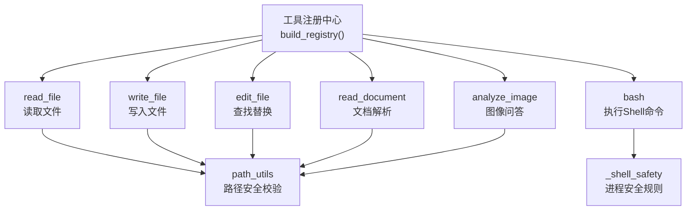
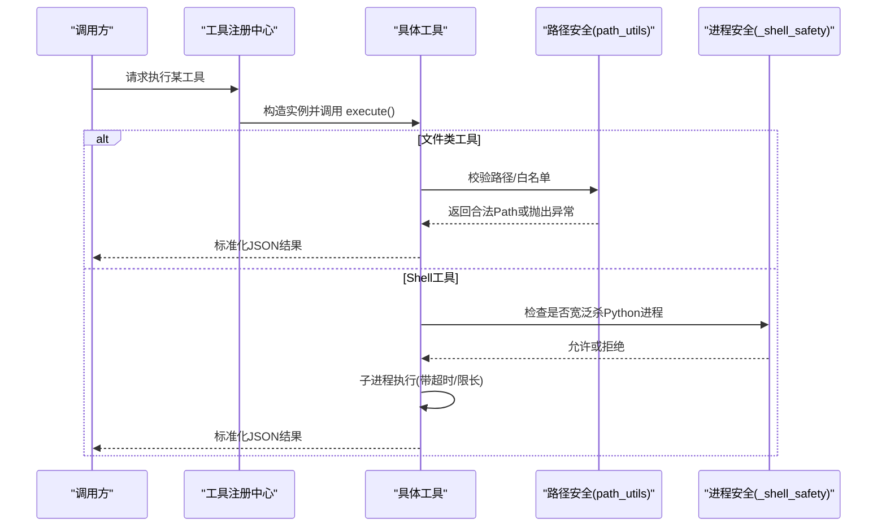
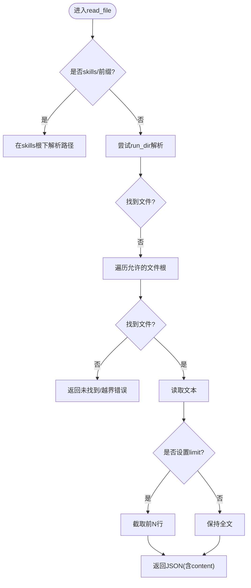
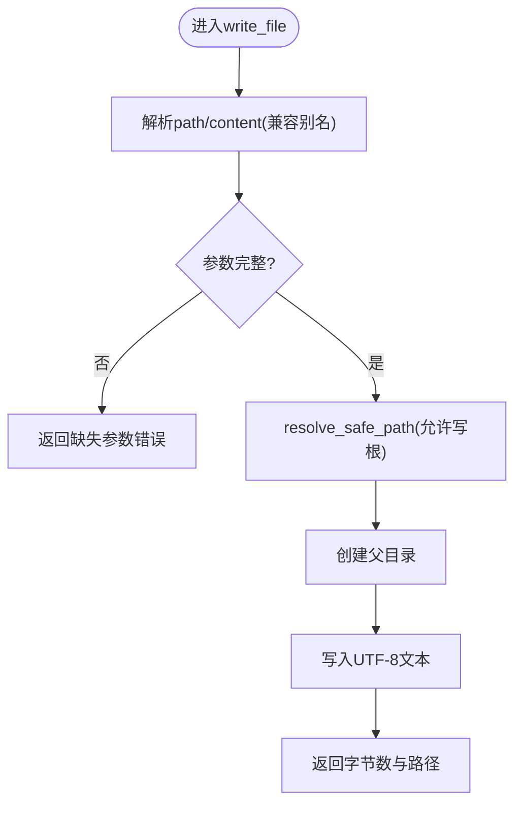
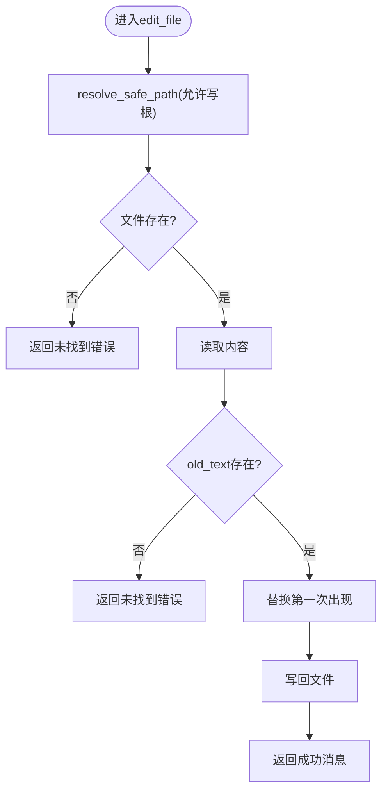
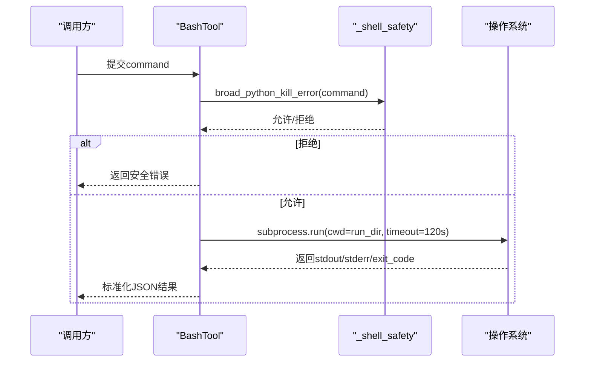
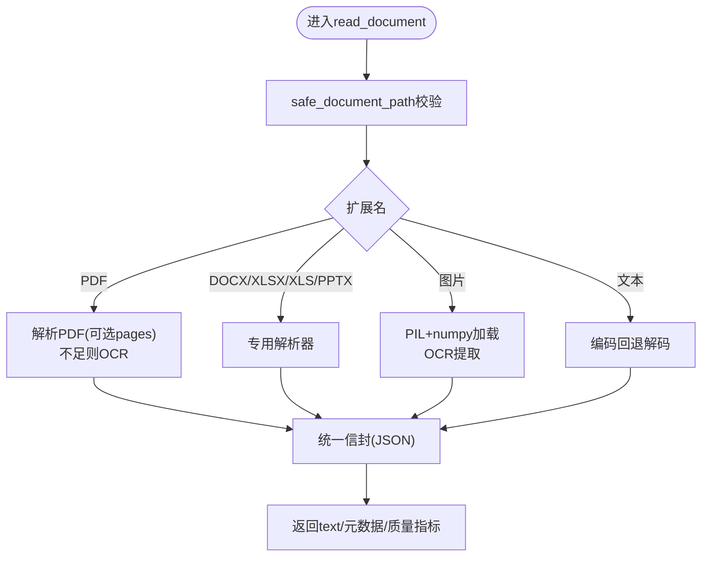
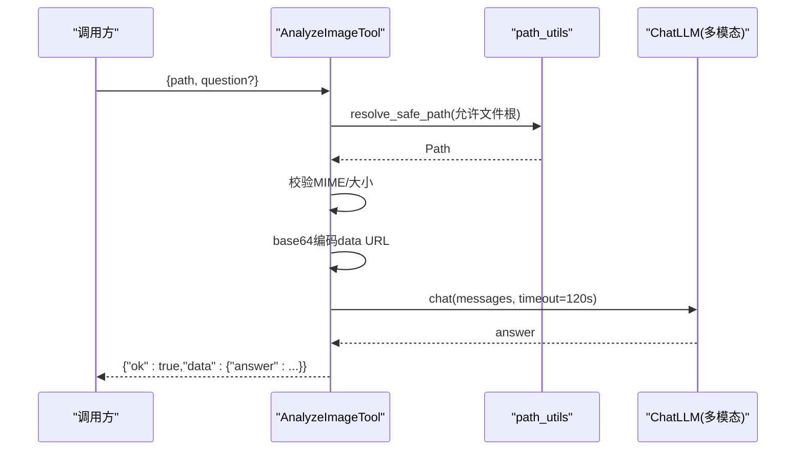
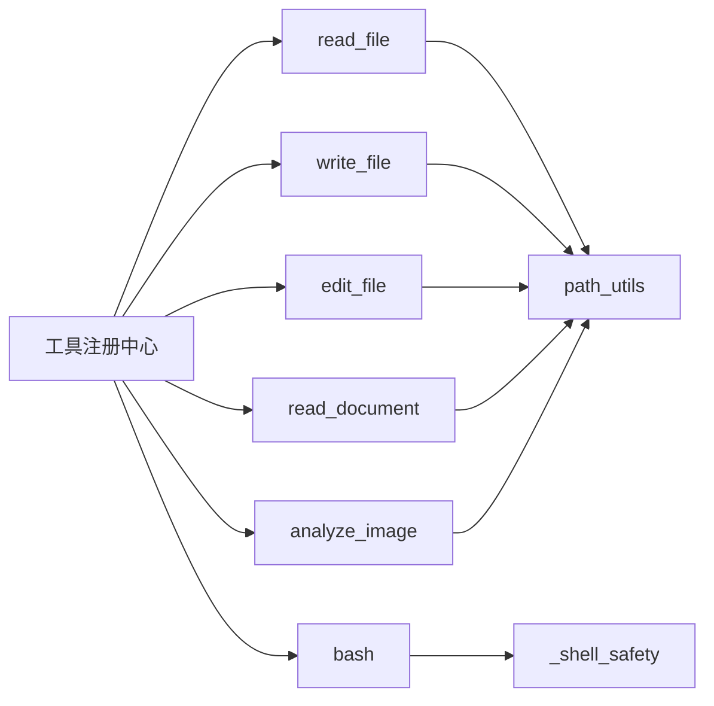

# 数据处理工具

<cite>
**本文引用的文件**
- [agent/src/tools/__init__.py](file://agent/src/tools/__init__.py)
- [agent/src/tools/read_file_tool.py](file://agent/src/tools/read_file_tool.py)
- [agent/src/tools/write_file_tool.py](file://agent/src/tools/write_file_tool.py)
- [agent/src/tools/edit_file_tool.py](file://agent/src/tools/edit_file_tool.py)
- [agent/src/tools/bash_tool.py](file://agent/src/tools/bash_tool.py)
- [agent/src/tools/_shell_safety.py](file://agent/src/tools/_shell_safety.py)
- [agent/src/tools/doc_reader_tool.py](file://agent/src/tools/doc_reader_tool.py)
- [agent/src/tools/image_vision_tool.py](file://agent/src/tools/image_vision_tool.py)
- [agent/src/tools/path_utils.py](file://agent/src/tools/path_utils.py)
</cite>

## 目录
1. [简介](#简介)
2. [项目结构](#项目结构)
3. [核心组件](#核心组件)
4. [架构总览](#架构总览)
5. [详细组件分析](#详细组件分析)
6. [依赖关系分析](#依赖关系分析)
7. [性能考虑](#性能考虑)
8. [故障排查指南](#故障排查指南)
9. [结论](#结论)
10. [附录](#附录)

## 简介
本文件面向“数据处理工具”的使用与实现，覆盖以下能力：
- 文件操作工具：读取、写入、编辑文本；支持按运行目录隔离与安全白名单访问。
- 命令行执行工具：在受限工作目录下执行 Shell 命令，具备超时与进程安全限制。
- 图像识别工具：通用文档解析（PDF/Word/Excel/PPT/图片/文本）与基于多模态模型的图像问答。
- 数据压缩与归档：通过 Shell 工具调用系统归档命令进行打包与格式转换。
此外，提供构建数据处理流水线的最佳实践（清洗、转换、存储）、安全访问控制策略与错误处理指南。

## 项目结构
工具以“可发现注册”的方式组织，所有工具类继承自 BaseTool，并通过包扫描自动注册到 ToolRegistry。读写与编辑工具统一使用路径安全模块 path_utils，确保仅能访问允许的工作目录或上传/导入根目录。文档解析器 doc_reader_tool 根据扩展名分派至不同解析器，并在 PDF 中按需启用 OCR。图像视觉工具 image_vision_tool 将本地图片编码为 data URL 后交给多模态模型回答。Shell 工具 bash_tool 在受限工作目录下执行命令，并内置对“宽泛杀死 Python 进程”的防护。

**图表来源**
- [agent/src/tools/__init__.py:66-245](file://agent/src/tools/__init__.py#L66-L245)
- [agent/src/tools/read_file_tool.py:18-133](file://agent/src/tools/read_file_tool.py#L18-L133)
- [agent/src/tools/write_file_tool.py:14-107](file://agent/src/tools/write_file_tool.py#L14-L107)
- [agent/src/tools/edit_file_tool.py:14-98](file://agent/src/tools/edit_file_tool.py#L14-L98)
- [agent/src/tools/bash_tool.py:16-84](file://agent/src/tools/bash_tool.py#L16-L84)
- [agent/src/tools/doc_reader_tool.py:422-457](file://agent/src/tools/doc_reader_tool.py#L422-L457)
- [agent/src/tools/image_vision_tool.py:52-147](file://agent/src/tools/image_vision_tool.py#L52-L147)
- [agent/src/tools/path_utils.py:185-240](file://agent/src/tools/path_utils.py#L185-L240)
- [agent/src/tools/_shell_safety.py:38-60](file://agent/src/tools/_shell_safety.py#L38-L60)

**章节来源**
- [agent/src/tools/__init__.py:1-365](file://agent/src/tools/__init__.py#L1-L365)

## 核心组件
- 文件读取 read_file：支持相对/命名空间路径（skills/），限制输出长度，返回 JSON 结果。
- 文件写入 write_file：自动创建父目录，接受多种参数别名，落盘 UTF-8。
- 文件编辑 edit_file：单处查找替换，先校验存在性与内容匹配。
- 文档解析 read_document：按扩展名分派，PDF 支持页码范围与 OCR 质量指标，Excel 逐表预览，图片 OCR。
- 图像问答 analyze_image：校验 MIME、大小限制，base64 编码后调用多模态模型。
- Shell 执行 bash：在 run_dir 下执行命令，限制输出长度与超时，拦截危险进程终止行为。
- 路径安全 path_utils：统一的白名单根目录、run_dir 校验、UNC 拒绝、~ 展开等。
- 进程安全 _shell_safety：正则匹配跨平台“宽泛杀死 Python 进程”的命令并拒绝。

**章节来源**
- [agent/src/tools/read_file_tool.py:18-133](file://agent/src/tools/read_file_tool.py#L18-L133)
- [agent/src/tools/write_file_tool.py:14-107](file://agent/src/tools/write_file_tool.py#L14-L107)
- [agent/src/tools/edit_file_tool.py:14-98](file://agent/src/tools/edit_file_tool.py#L14-L98)
- [agent/src/tools/doc_reader_tool.py:1-457](file://agent/src/tools/doc_reader_tool.py#L1-L457)
- [agent/src/tools/image_vision_tool.py:1-147](file://agent/src/tools/image_vision_tool.py#L1-L147)
- [agent/src/tools/bash_tool.py:16-84](file://agent/src/tools/bash_tool.py#L16-L84)
- [agent/src/tools/path_utils.py:1-404](file://agent/src/tools/path_utils.py#L1-L404)
- [agent/src/tools/_shell_safety.py:1-60](file://agent/src/tools/_shell_safety.py#L1-L60)

## 架构总览
工具通过 build_registry 自动发现并注册，支持可选地包含 shell 工具与 MCP 远程工具。每个工具在执行前会进行参数校验、路径安全校验与业务约束检查，最终返回标准化的 JSON 响应，便于上层编排与重试。

**图表来源**
- [agent/src/tools/__init__.py:66-245](file://agent/src/tools/__init__.py#L66-L245)
- [agent/src/tools/path_utils.py:185-240](file://agent/src/tools/path_utils.py#L185-L240)
- [agent/src/tools/_shell_safety.py:38-60](file://agent/src/tools/_shell_safety.py#L38-L60)
- [agent/src/tools/bash_tool.py:36-84](file://agent/src/tools/bash_tool.py#L36-L84)

## 详细组件分析

### 文件读取工具（read_file）
- 功能要点
  - 支持 skills/ 命名空间，防止同名文件覆盖受信任技能。
  - 支持 run_dir 优先解析，其次允许的文件根目录。
  - 输出截断保护，避免过大响应。
- 安全与限制
  - 路径必须落在允许的根目录内；拒绝 UNC 路径。
  - 只读访问，不修改文件系统。
- 性能
  - 大文件建议配合 limit 参数限制行数。
  - 输出上限默认 50,000 字符。

**图表来源**
- [agent/src/tools/read_file_tool.py:39-133](file://agent/src/tools/read_file_tool.py#L39-L133)
- [agent/src/tools/path_utils.py:137-144](file://agent/src/tools/path_utils.py#L137-L144)

**章节来源**
- [agent/src/tools/read_file_tool.py:18-133](file://agent/src/tools/read_file_tool.py#L18-L133)

### 文件写入工具（write_file）
- 功能要点
  - 自动创建父目录，UTF-8 写入。
  - 兼容多种参数别名（path/file_path/filename 等）。
- 安全与限制
  - 路径必须落在允许的写根目录内；拒绝 UNC。
  - 失败时返回结构化错误信息。
- 性能
  - 适合小中型文本；超大内容建议分批写入或外部归档。

**图表来源**
- [agent/src/tools/write_file_tool.py:30-107](file://agent/src/tools/write_file_tool.py#L30-L107)
- [agent/src/tools/path_utils.py:185-240](file://agent/src/tools/path_utils.py#L185-L240)

**章节来源**
- [agent/src/tools/write_file_tool.py:14-107](file://agent/src/tools/write_file_tool.py#L14-L107)

### 文件编辑工具（edit_file）
- 功能要点
  - 在文件中查找旧文本并替换第一次出现。
  - 不存在文件或未找到旧文本时返回明确错误。
- 安全与限制
  - 同样受 allowed_write_roots 保护。
- 性能
  - 单次替换，适合小改动；大文件建议先读取再批量处理。

**图表来源**
- [agent/src/tools/edit_file_tool.py:31-98](file://agent/src/tools/edit_file_tool.py#L31-L98)

**章节来源**
- [agent/src/tools/edit_file_tool.py:14-98](file://agent/src/tools/edit_file_tool.py#L14-L98)

### 命令行执行工具（bash）
- 功能要点
  - 在 run_dir 下执行命令，捕获 stdout/stderr 与退出码。
  - 输出截断与超时保护。
- 安全与限制
  - 禁止宽泛杀死 Python 进程（跨平台正则检测）。
  - 仅在 include_shell_tools=True 时注册。
- 性能
  - 长时间任务建议使用后台任务（如 background_run/cancel_background，若可用）。

**图表来源**
- [agent/src/tools/bash_tool.py:36-84](file://agent/src/tools/bash_tool.py#L36-L84)
- [agent/src/tools/_shell_safety.py:38-60](file://agent/src/tools/_shell_safety.py#L38-L60)

**章节来源**
- [agent/src/tools/bash_tool.py:16-84](file://agent/src/tools/bash_tool.py#L16-L84)
- [agent/src/tools/_shell_safety.py:1-60](file://agent/src/tools/_shell_safety.py#L1-L60)

### 文档解析工具（read_document）
- 功能要点
  - 按扩展名分派：PDF/Word/Excel/PPT/图片/文本。
  - PDF 支持页码范围、OCR 阈值与质量指标。
  - Excel 逐表输出前 N 行预览与元信息。
  - 图片 OCR 需要 OCR 引擎可用。
- 安全与限制
  - 路径需通过 safe_document_path 校验，限制在允许导入根。
  - 输出统一截断至最大字符数。
- 性能
  - 大 PDF/Excel 建议指定 pages 或限制行数。
  - OCR 成本较高，谨慎使用。

**图表来源**
- [agent/src/tools/doc_reader_tool.py:384-457](file://agent/src/tools/doc_reader_tool.py#L384-L457)
- [agent/src/tools/doc_reader_tool.py:133-235](file://agent/src/tools/doc_reader_tool.py#L133-L235)
- [agent/src/tools/doc_reader_tool.py:257-279](file://agent/src/tools/doc_reader_tool.py#L257-L279)
- [agent/src/tools/doc_reader_tool.py:304-349](file://agent/src/tools/doc_reader_tool.py#L304-L349)
- [agent/src/tools/doc_reader_tool.py:353-372](file://agent/src/tools/doc_reader_tool.py#L353-L372)
- [agent/src/tools/path_utils.py:328-341](file://agent/src/tools/path_utils.py#L328-L341)

**章节来源**
- [agent/src/tools/doc_reader_tool.py:1-457](file://agent/src/tools/doc_reader_tool.py#L1-L457)

### 图像识别工具（analyze_image）
- 功能要点
  - 校验文件类型与大小，base64 编码后作为 data URL 发送给多模态模型。
  - 支持自定义问题，默认提示词用于金融图表解读。
- 安全与限制
  - 路径必须在允许的文件根内。
  - 模型不支持图像输入时会返回空答案错误。
- 性能
  - 图片上限 10MB；超时 120s。

**图表来源**
- [agent/src/tools/image_vision_tool.py:85-147](file://agent/src/tools/image_vision_tool.py#L85-L147)
- [agent/src/tools/path_utils.py:137-144](file://agent/src/tools/path_utils.py#L137-L144)

**章节来源**
- [agent/src/tools/image_vision_tool.py:1-147](file://agent/src/tools/image_vision_tool.py#L1-L147)

### 数据压缩与归档（通过 Shell 工具）
- 方法
  - 使用 bash 工具调用系统归档命令（如 tar、zip、gzip）对数据进行打包与格式转换。
  - 建议在 run_dir 或允许的写根目录内生成归档文件。
- 安全与限制
  - 遵循路径白名单与 UNC 拒绝策略。
  - 注意命令超时与输出长度限制。
- 性能
  - 大文件归档建议分卷或增量备份，避免单次阻塞过长。

[本节为概念性说明，不直接分析具体代码文件]

## 依赖关系分析
- 工具注册与过滤
  - build_registry 负责扫描 src.tools 下的 BaseTool 子类并注册，支持 include_shell_tools 开关与 MCP 工具合并。
  - build_filtered_registry 与 build_swarm_registry 提供按名称过滤与群智工作线程的白名单机制。
- 路径与进程安全
  - path_utils 提供 safe_path、resolve_safe_path、allowed_*_roots、safe_run_dir 等，统一边界控制。
  - _shell_safety 提供跨平台“宽泛杀死 Python 进程”的检测与拒绝。
- 工具间耦合
  - 文件类工具强依赖 path_utils；文档解析器依赖 OCR 引擎与第三方库（pypdfium2、python-docx、pandas、python-pptx、Pillow/numpy）。
  - 图像问答依赖 ChatLLM 多模态能力。

**图表来源**
- [agent/src/tools/__init__.py:66-245](file://agent/src/tools/__init__.py#L66-L245)
- [agent/src/tools/path_utils.py:137-182](file://agent/src/tools/path_utils.py#L137-L182)
- [agent/src/tools/_shell_safety.py:38-60](file://agent/src/tools/_shell_safety.py#L38-L60)

**章节来源**
- [agent/src/tools/__init__.py:1-365](file://agent/src/tools/__init__.py#L1-L365)
- [agent/src/tools/path_utils.py:1-404](file://agent/src/tools/path_utils.py#L1-L404)
- [agent/src/tools/_shell_safety.py:1-60](file://agent/src/tools/_shell_safety.py#L1-L60)

## 性能考虑
- 文件读取
  - 使用 limit 限制行数，避免大文件导致响应过大。
  - 输出上限 50,000 字符，必要时分段读取。
- 文档解析
  - PDF 指定 pages 范围以减少解析量；OCR 成本较高，仅在必要时启用。
  - Excel 仅输出每表前 100 行预览，避免全表渲染。
- 图像问答
  - 图片上限 10MB，超时 120s；网络或模型侧延迟可能较长。
- Shell 执行
  - 默认超时 120s；输出截断 50,000 字符；避免长耗时命令阻塞。
- 路径与I/O
  - 尽量在允许的根目录内操作，减少权限与路径解析开销。

[本节为通用性能指导，不直接分析具体代码文件]

## 故障排查指南
- 常见错误与定位
  - 路径越界：检查是否在 allowed_file_roots / allowed_write_roots / allowed_run_roots 范围内；确认 run_dir 是否有效。
  - 文档解析失败：确认依赖库安装（pypdfium2、python-docx、pandas、python-pptx、Pillow/numpy）；PDF 无文本且无 OCR 引擎时会报错。
  - 图像问答为空：模型可能不支持图像输入；检查 provider 配置与超时。
  - Shell 命令被拒：可能被 _shell_safety 判定为“宽泛杀死 Python 进程”；改用后台任务管理。
- 调试步骤
  - 打印工具返回的 JSON status/error 字段。
  - 逐步缩小范围：先验证路径合法性，再验证文件格式与依赖可用性。
  - 对于 PDF/Excel，先尝试最小样本（少量页面/行）复现问题。

**章节来源**
- [agent/src/tools/read_file_tool.py:101-133](file://agent/src/tools/read_file_tool.py#L101-L133)
- [agent/src/tools/write_file_tool.py:72-107](file://agent/src/tools/write_file_tool.py#L72-L107)
- [agent/src/tools/edit_file_tool.py:45-98](file://agent/src/tools/edit_file_tool.py#L45-L98)
- [agent/src/tools/doc_reader_tool.py:133-235](file://agent/src/tools/doc_reader_tool.py#L133-L235)
- [agent/src/tools/image_vision_tool.py:105-147](file://agent/src/tools/image_vision_tool.py#L105-L147)
- [agent/src/tools/bash_tool.py:45-84](file://agent/src/tools/bash_tool.py#L45-L84)
- [agent/src/tools/_shell_safety.py:38-60](file://agent/src/tools/_shell_safety.py#L38-L60)

## 结论
本项目提供了完善的数据处理工具集，涵盖文件读写编辑、Shell 执行、文档解析与图像问答，并通过严格的路径与进程安全策略保障运行环境稳定。结合批处理与归档命令，可构建从数据清洗、转换到存储的完整流水线。建议在生产环境中：
- 明确配置允许的根目录与运行目录。
- 对大文件与 OCR 场景进行资源预算与超时控制。
- 使用后台任务与分页/分块策略提升吞吐与稳定性。
- 建立完善的错误日志与重试机制，确保流水线健壮性。

[本节为总结性内容，不直接分析具体代码文件]

## 附录
- 构建数据处理流水线最佳实践
  - 数据清洗：使用 read_document 获取原始数据，结合 edit_file 进行局部修正；必要时用 bash 调用脚本完成复杂清洗。
  - 数据转换：通过 bash 调用转换工具（如 pandas 脚本、CSV/Parquet 转换），输出到允许的写根目录。
  - 数据存储：将结果写入 runs/uploads 或运行时根目录；对大文件进行归档（tar/zip/gzip）以便传输与备份。
  - 安全与审计：所有路径均经 path_utils 校验；Shell 命令受 _shell_safety 保护；关键操作记录日志与产物路径。
  - 错误处理：统一解析工具返回的 JSON 状态；对失败路径实施重试与告警；对超时与资源超限进行降级。

[本节为概念性指导，不直接分析具体代码文件]