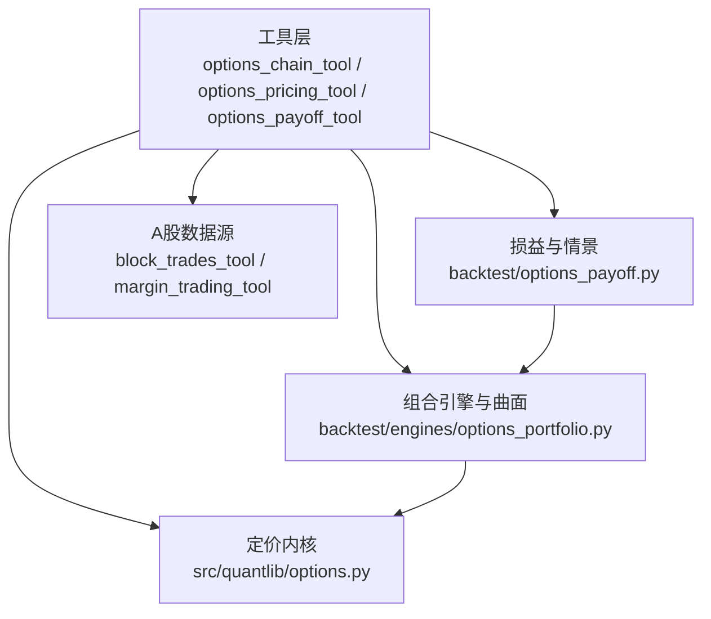
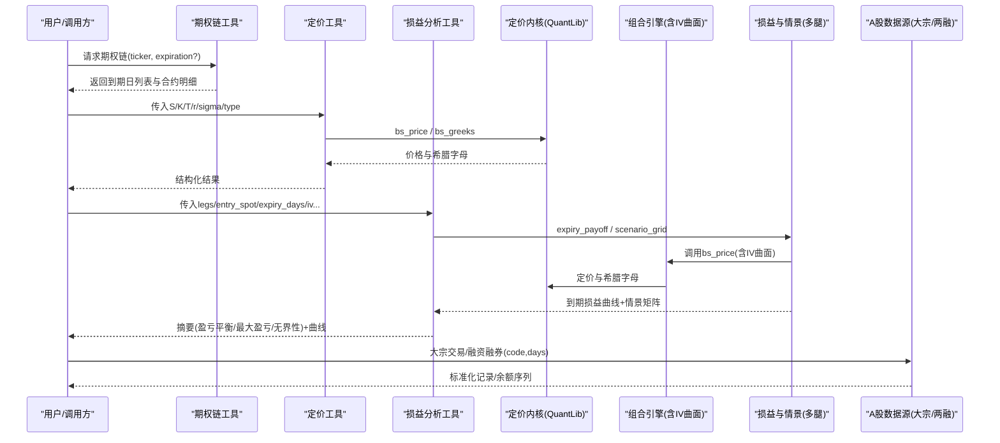
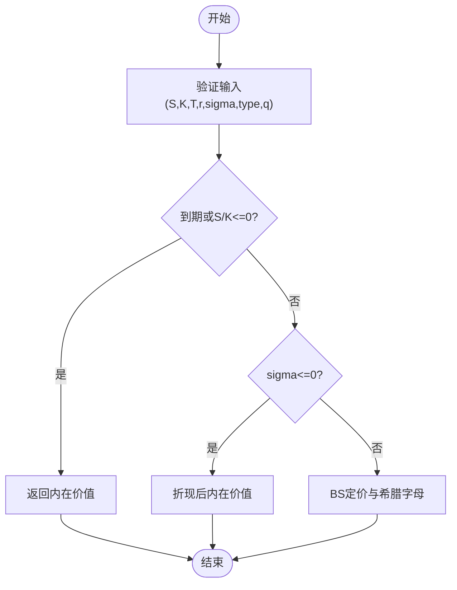
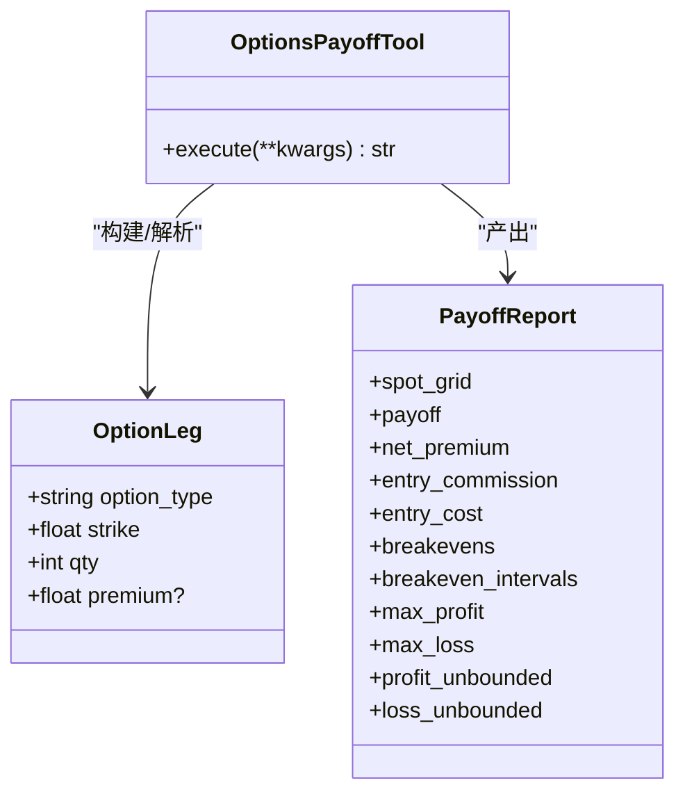
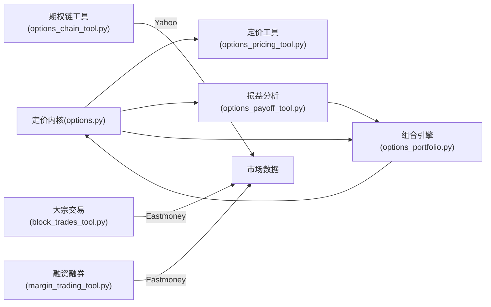

# 期权衍生品工具

<cite>
**本文引用的文件**
- [agent/src/quantlib/options.py](file://agent/src/quantlib/options.py)
- [agent/backtest/engines/options_portfolio.py](file://agent/backtest/engines/options_portfolio.py)
- [agent/backtest/options_payoff.py](file://agent/backtest/options_payoff.py)
- [agent/src/tools/options_chain_tool.py](file://agent/src/tools/options_chain_tool.py)
- [agent/src/tools/options_pricing_tool.py](file://agent/src/tools/options_pricing_tool.py)
- [agent/src/tools/options_payoff_tool.py](file://agent/src/tools/options_payoff_tool.py)
- [agent/src/tools/block_trades_tool.py](file://agent/src/tools/block_trades_tool.py)
- [agent/src/tools/margin_trading_tool.py](file://agent/src/tools/margin_trading_tool.py)
</cite>

## 目录
1. [简介](#简介)
2. [项目结构](#项目结构)
3. [核心组件](#核心组件)
4. [架构总览](#架构总览)
5. [详细组件分析](#详细组件分析)
6. [依赖关系分析](#依赖关系分析)
7. [性能考量](#性能考量)
8. [故障排查指南](#故障排查指南)
9. [结论](#结论)
10. [附录：参数与使用示例](#附录参数与使用示例)

## 简介
本仓库提供一套面向期权衍生品的完整工具链，覆盖：
- 期权链数据工具：获取合约信息、到期日管理、行权价筛选。
- 期权定价工具：Black-Scholes 模型、希腊字母计算、波动率曲面（IV Smile）。
- 期权收益分析工具：损益图绘制、情景分析、风险度量（盈亏平衡点、最大盈亏、无界性判断）。
- 大宗交易跟踪工具：A股大宗交易记录查询（价格、折溢价、成交量、买卖席位）。
- 融资融券分析工具：A股个股融资融券余额时序数据查询。

文档将逐项说明数学模型、假设与局限、参数配置与使用方式，并给出策略分析与风险管理建议。

## 项目结构
围绕期权的核心代码分布在以下模块：
- 定价与希腊字母：src/quantlib/options.py
- 组合回测与波动率曲面：backtest/engines/options_portfolio.py
- 多腿策略损益与情景矩阵：backtest/options_payoff.py
- 工具封装（对外接口）：
  - 期权链：src/tools/options_chain_tool.py
  - 定价：src/tools/options_pricing_tool.py
  - 损益分析：src/tools/options_payoff_tool.py
  - 大宗交易：src/tools/block_trades_tool.py
  - 融资融券：src/tools/margin_trading_tool.py

图表来源
- [agent/src/tools/options_chain_tool.py:1-156](file://agent/src/tools/options_chain_tool.py#L1-L156)
- [agent/src/tools/options_pricing_tool.py:1-172](file://agent/src/tools/options_pricing_tool.py#L1-L172)
- [agent/src/tools/options_payoff_tool.py:1-358](file://agent/src/tools/options_payoff_tool.py#L1-L358)
- [agent/src/quantlib/options.py:1-449](file://agent/src/quantlib/options.py#L1-L449)
- [agent/backtest/engines/options_portfolio.py:1-733](file://agent/backtest/engines/options_portfolio.py#L1-L733)
- [agent/backtest/options_payoff.py:1-497](file://agent/backtest/options_payoff.py#L1-L497)
- [agent/src/tools/block_trades_tool.py:1-282](file://agent/src/tools/block_trades_tool.py#L1-L282)
- [agent/src/tools/margin_trading_tool.py:1-250](file://agent/src/tools/margin_trading_tool.py#L1-L250)

章节来源
- [agent/src/quantlib/options.py:1-449](file://agent/src/quantlib/options.py#L1-L449)
- [agent/backtest/engines/options_portfolio.py:1-733](file://agent/backtest/engines/options_portfolio.py#L1-L733)
- [agent/backtest/options_payoff.py:1-497](file://agent/backtest/options_payoff.py#L1-L497)
- [agent/src/tools/options_chain_tool.py:1-156](file://agent/src/tools/options_chain_tool.py#L1-L156)
- [agent/src/tools/options_pricing_tool.py:1-172](file://agent/src/tools/options_pricing_tool.py#L1-L172)
- [agent/src/tools/options_payoff_tool.py:1-358](file://agent/src/tools/options_payoff_tool.py#L1-L358)
- [agent/src/tools/block_trades_tool.py:1-282](file://agent/src/tools/block_trades_tool.py#L1-L282)
- [agent/src/tools/margin_trading_tool.py:1-250](file://agent/src/tools/margin_trading_tool.py#L1-L250)

## 核心组件
- 期权链数据工具：通过 Yahoo Finance 客户端拉取美股期权链，返回到期日列表、看涨/看跌合约的报价、隐含波动率、是否实值等字段，支持按到期日过滤。
- 期权定价工具：基于 Black-Scholes-Merton 公式计算理论价格与希腊字母（Delta/Gamma/Theta/Vega/Rho），支持股息连续收益率与利率敏感性。
- 期权收益分析工具：对多腿欧式策略进行到期损益解析、盈亏平衡点解析求解、最大盈亏与无界性判断；并提供 Spot×IV 情景矩阵。
- 大宗交易跟踪工具：读取东方财富数据中心 A 股大宗交易记录，输出成交日期、成交价、成交量、折溢价率、买卖双方营业部。
- 融资融券分析工具：读取东方财富数据中心 A 股个股融资融券明细，输出融资余额、融券余额及合计余额等时间序列。

章节来源
- [agent/src/tools/options_chain_tool.py:1-156](file://agent/src/tools/options_chain_tool.py#L1-L156)
- [agent/src/tools/options_pricing_tool.py:1-172](file://agent/src/tools/options_pricing_tool.py#L1-L172)
- [agent/backtest/options_payoff.py:1-497](file://agent/backtest/options_payoff.py#L1-L497)
- [agent/src/tools/block_trades_tool.py:1-282](file://agent/src/tools/block_trades_tool.py#L1-L282)
- [agent/src/tools/margin_trading_tool.py:1-250](file://agent/src/tools/margin_trading_tool.py#L1-L250)

## 架构总览

图表来源
- [agent/src/tools/options_chain_tool.py:1-156](file://agent/src/tools/options_chain_tool.py#L1-L156)
- [agent/src/tools/options_pricing_tool.py:1-172](file://agent/src/tools/options_pricing_tool.py#L1-L172)
- [agent/src/tools/options_payoff_tool.py:1-358](file://agent/src/tools/options_payoff_tool.py#L1-L358)
- [agent/backtest/options_payoff.py:1-497](file://agent/backtest/options_payoff.py#L1-L497)
- [agent/backtest/engines/options_portfolio.py:1-733](file://agent/backtest/engines/options_portfolio.py#L1-L733)
- [agent/src/quantlib/options.py:1-449](file://agent/src/quantlib/options.py#L1-L449)
- [agent/src/tools/block_trades_tool.py:1-282](file://agent/src/tools/block_trades_tool.py#L1-L282)
- [agent/src/tools/margin_trading_tool.py:1-250](file://agent/src/tools/margin_trading_tool.py#L1-L250)

## 详细组件分析

### 期权链数据工具（合约信息查询、到期日管理、行权价筛选）
- 功能要点
  - 获取美股标的的看涨/看跌期权链，包含行权价、买卖价、最新价、成交量、持仓量、隐含波动率、是否实值等。
  - 返回可用到期日列表（Unix 秒），可指定某一到期日或默认最近到期日。
  - 限制每侧合约数量上限，避免响应过大。
- 关键流程
  - 校验 ticker 与可选 expiration；调用共享 Yahoo 客户端获取数据；构造统一 JSON 信封返回。
- 使用提示
  - 适合做行权价筛选（如 ATM/OTM/ITM）、到期日选择、流动性筛选（成交量/持仓量）。

章节来源
- [agent/src/tools/options_chain_tool.py:1-156](file://agent/src/tools/options_chain_tool.py#L1-L156)

### 期权定价工具（Black-Scholes 模型、希腊字母、波动率曲面）
- 数学模型与约定
  - 采用 Black-Scholes-Merton 公式，支持连续股息收益率 q 与年化无风险利率 r。
  - Theta 为日历日单位；Vega/Rho 为 1% 变动单位；Delta/Gamma 为标的 1.0 单位。
  - 退化输入处理：到期或零波动时返回内在价值或折现后内在价值，避免异常中断。
- 希腊字母
  - Delta、Gamma、Theta、Vega、Rho 均提供解析解；在边界条件下（如到期、零波动）有稳健实现。
- 隐含波动率反解
  - 牛顿法优先，失败时回退二分法；对深度虚值/临近到期导致 Vega 塌陷的情况拒绝“伪收敛”，返回 NaN 以表明报价无法识别波动率。
- 波动率曲面（IV Smile）
  - 组合引擎中提供二次微笑模型：IV(K)=base_iv + skew·log(K/S) + curvature·log(K/S)^2，用于不同行权价的定价一致性。
- 使用提示
  - 输入需为正数（除到期可为0），注意单位一致；回报包含状态标记（正常/退化）与警告。

图表来源
- [agent/src/quantlib/options.py:223-265](file://agent/src/quantlib/options.py#L223-L265)
- [agent/src/quantlib/options.py:268-361](file://agent/src/quantlib/options.py#L268-L361)
- [agent/backtest/engines/options_portfolio.py:63-108](file://agent/backtest/engines/options_portfolio.py#L63-L108)

章节来源
- [agent/src/quantlib/options.py:1-449](file://agent/src/quantlib/options.py#L1-L449)
- [agent/backtest/engines/options_portfolio.py:1-733](file://agent/backtest/engines/options_portfolio.py#L1-L733)
- [agent/src/tools/options_pricing_tool.py:1-172](file://agent/src/tools/options_pricing_tool.py#L1-L172)

### 期权收益分析工具（损益图、情景分析、风险度量）
- 到期损益解析
  - 基于分段线性函数，精确求解盈亏平衡点与连续零损益区间；自动判断最大盈亏与无界性。
  - 支持显式入场期权费或使用 BS 定价；考虑佣金与乘数。
- 情景矩阵
  - 对 Spot×IV 网格计算未到期盯市 P&L，便于评估波动率变化与标的路径对组合的影响。
- 常用策略构建器
  - 提供牛市价差、跨式、铁鹰等常见组合的快捷构造。
- 使用提示
  - 场景 IV 默认按入场 IV 的倍数生成；可自定义；图表点数可配置但受上下限保护。

图表来源
- [agent/backtest/options_payoff.py:20-68](file://agent/backtest/options_payoff.py#L20-L68)
- [agent/src/tools/options_payoff_tool.py:21-120](file://agent/src/tools/options_payoff_tool.py#L21-L120)

章节来源
- [agent/backtest/options_payoff.py:1-497](file://agent/backtest/options_payoff.py#L1-L497)
- [agent/src/tools/options_payoff_tool.py:1-358](file://agent/src/tools/options_payoff_tool.py#L1-L358)

### 大宗交易跟踪工具
- 功能要点
  - 读取东方财富数据中心 A 股大宗交易记录，返回成交日期、成交价、成交量、成交额、折溢价率、买卖双方营业部。
  - 支持按标的与回溯天数查询，限制最大记录数与窗口长度，防止上下文溢出。
- 使用提示
  - 仅支持 A 股（SH/SZ/BJ）；符号可带交易所后缀或纯六位代码；返回统一信封便于下游处理。

章节来源
- [agent/src/tools/block_trades_tool.py:1-282](file://agent/src/tools/block_trades_tool.py#L1-L282)

### 融资融券分析工具
- 功能要点
  - 读取东方财富数据中心 A 股个股融资融券明细，返回融资余额、融资买入额、融券余额、融券量、合计余额等时间序列。
  - 若主数据源无返回，自动回退至备选数据源，保证可用性。
- 使用提示
  - 仅支持 A 股；接受多种符号格式；返回行数受天数限制。

章节来源
- [agent/src/tools/margin_trading_tool.py:1-250](file://agent/src/tools/margin_trading_tool.py#L1-L250)

## 依赖关系分析
- 定价内核被多个上层工具复用：
  - 定价工具直接调用 bs_price/bs_greeks。
  - 损益分析工具在计算入场期权费与情景盯市时使用 bs_price。
  - 组合引擎在每日盯市、美式提前行权启发式中使用 bs_price 与 Greeks，并通过 IV Smile 调整各腿波动率。
- 数据源隔离：
  - 美股期权链通过 Yahoo 客户端；A 股大宗交易与融资融券通过东方财富数据中心（必要时回退到备选源）。

图表来源
- [agent/src/quantlib/options.py:1-449](file://agent/src/quantlib/options.py#L1-L449)
- [agent/src/tools/options_pricing_tool.py:1-172](file://agent/src/tools/options_pricing_tool.py#L1-L172)
- [agent/src/tools/options_payoff_tool.py:1-358](file://agent/src/tools/options_payoff_tool.py#L1-L358)
- [agent/backtest/engines/options_portfolio.py:1-733](file://agent/backtest/engines/options_portfolio.py#L1-L733)
- [agent/src/tools/options_chain_tool.py:1-156](file://agent/src/tools/options_chain_tool.py#L1-L156)
- [agent/src/tools/block_trades_tool.py:1-282](file://agent/src/tools/block_trades_tool.py#L1-L282)
- [agent/src/tools/margin_trading_tool.py:1-250](file://agent/src/tools/margin_trading_tool.py#L1-L250)

章节来源
- [agent/src/quantlib/options.py:1-449](file://agent/src/quantlib/options.py#L1-L449)
- [agent/backtest/engines/options_portfolio.py:1-733](file://agent/backtest/engines/options_portfolio.py#L1-L733)

## 性能考量
- 定价内核
  - 向量化与数值稳定：d1/d2、正态分布函数调用优化；对退化输入直接返回内在价值，避免不必要的迭代。
  - 隐含波动率反解：牛顿法快速收敛，Vega 接近零时切换二分法，避免无效迭代。
- 损益分析
  - 到期损益解析采用临界点方法，不依赖密集网格即可准确求解盈亏平衡点；情景矩阵按 Spot×IV 二维循环计算，可通过控制网格规模与 IV 场景数调节性能。
- 数据拉取
  - 期权链与 A 股数据均有限流与分页限制，避免大响应阻塞；工具层统一封装错误与重试逻辑。

[本节为通用性能讨论，无需特定文件引用]

## 故障排查指南
- 定价工具报错
  - 检查输入是否为有限数且符合约束（Spot/Strike/Volatility>0，Expiry>=0）。
  - 若返回“degenerate”状态，表示处于到期或极端输入，希腊字母可能奇异，应谨慎解读。
- 隐含波动率反解失败
  - 当报价位于无套利区间之外或报价对波动率不敏感（深度 OTM/临近到期），会返回 NaN；请检查报价质量或放宽 IV 搜索范围。
- 损益分析输入错误
  - legs 必须为非空数组，option_type 为 call/put，strike>0，qty 为非零整数；spot_min/max 需满足 spot_max>spot_min。
- 数据源不可用
  - 期权链工具：Yahoo 请求失败会返回错误信封；大宗交易/融资融券工具：若 Eastmoney 失败或无数据，会尝试 Tushare 回退并返回 warnings。

章节来源
- [agent/src/tools/options_pricing_tool.py:13-40](file://agent/src/tools/options_pricing_tool.py#L13-L40)
- [agent/src/tools/options_pricing_tool.py:141-172](file://agent/src/tools/options_pricing_tool.py#L141-L172)
- [agent/src/quantlib/options.py:396-503](file://agent/src/quantlib/options.py#L396-L503)
- [agent/src/tools/options_payoff_tool.py:228-358](file://agent/src/tools/options_payoff_tool.py#L228-L358)
- [agent/src/tools/block_trades_tool.py:207-282](file://agent/src/tools/block_trades_tool.py#L207-L282)
- [agent/src/tools/margin_trading_tool.py:163-250](file://agent/src/tools/margin_trading_tool.py#L163-L250)

## 结论
本工具链以统一的定价内核为基础，向上提供从数据获取、定价、策略损益分析到 A 股资金行为追踪的一体化能力。通过严谨的边界处理与数值稳定性设计，可在研究与回测场景中可靠运行。结合 IV Smile 与情景分析，可更贴近真实市场的波动率结构与风险暴露。

[本节为总结性内容，无需特定文件引用]

## 附录：参数与使用示例

### 期权链数据工具
- 参数
  - ticker：美股标的代码（支持 .US 后缀）。
  - expiration：可选，Unix 秒格式的到期日；省略则取最近到期日。
- 示例
  - 获取 AAPL 最近到期日的期权链。
  - 指定某到期日获取该期权的看涨/看跌合约明细。
- 输出关键字段
  - expirations：可用到期日列表。
  - calls/puts：合约数组，包含 strike、bid/ask、lastPrice、volume、openInterest、impliedVolatility、inTheMoney 等。

章节来源
- [agent/src/tools/options_chain_tool.py:48-68](file://agent/src/tools/options_chain_tool.py#L48-L68)
- [agent/src/tools/options_chain_tool.py:70-100](file://agent/src/tools/options_chain_tool.py#L70-L100)
- [agent/src/tools/options_chain_tool.py:113-150](file://agent/src/tools/options_chain_tool.py#L113-L150)

### 期权定价工具
- 参数
  - spot：标的现价。
  - strike：行权价。
  - expiry_days：距到期日历天数。
  - volatility：年化波动率。
  - risk_free_rate：年化连续复利无风险利率（可选，默认 0.05）。
  - option_type：call 或 put。
- 示例
  - 计算 S=100、K=100、T=0.25、r=0.03、σ=0.20 的看涨期权价格与希腊字母。
- 输出
  - price、delta、gamma、theta、vega、rho；inputs 记录原始参数；status 指示正常或退化。

章节来源
- [agent/src/tools/options_pricing_tool.py:82-93](file://agent/src/tools/options_pricing_tool.py#L82-L93)
- [agent/src/tools/options_pricing_tool.py:95-172](file://agent/src/tools/options_pricing_tool.py#L95-L172)

### 期权收益分析工具
- 参数
  - legs：多腿定义，包含 option_type、strike、qty、premium（可选）。
  - entry_spot：入场标的价。
  - expiry_days：距到期日历天数。
  - risk_free_rate：年化连续复利无风险利率（可选，默认 0.05）。
  - volatility：入场波动率（可选，默认 0.3）。
  - multiplier：货币乘数（可选，默认 1.0）。
  - commission_rate：入场佣金比例（可选，默认 0.001）。
  - spot_min/spot_max/spot_points：图表范围与分辨率。
  - scenario_iv_values：波动率情景数组（可选）。
- 示例
  - 构建牛市价差（买入低行权价看涨、卖出高行权价看涨）并分析到期损益与 Spot×IV 情景。
  - 构建跨式（同行权价买看涨+买看跌）并评估波动率扩张的收益。
- 输出
  - summary：净期权费、入场佣金、入场成本、盈亏平衡点与区间、最大盈亏与无界性。
  - expiry_curve：到期损益曲线。
  - scenario_grid：Spot×IV 情景矩阵。
  - limitations：模型局限说明。

章节来源
- [agent/src/tools/options_payoff_tool.py:33-120](file://agent/src/tools/options_payoff_tool.py#L33-L120)
- [agent/src/tools/options_payoff_tool.py:122-225](file://agent/src/tools/options_payoff_tool.py#L122-L225)
- [agent/backtest/options_payoff.py:274-355](file://agent/backtest/options_payoff.py#L274-L355)
- [agent/backtest/options_payoff.py:390-457](file://agent/backtest/options_payoff.py#L390-L457)

### 大宗交易跟踪工具
- 参数
  - code：A 股标的（支持 SH/SZ/BJ 后缀或六位代码）。
  - days：回溯天数（默认 30，上限 365）。
- 示例
  - 查询贵州茅台近 30 天大宗交易记录。
- 输出
  - records：每条记录包含 trade_date、name、close_price、deal_price、premium_ratio、deal_volume、deal_amount、buyer_seat、seller_seat。

章节来源
- [agent/src/tools/block_trades_tool.py:185-205](file://agent/src/tools/block_trades_tool.py#L185-L205)
- [agent/src/tools/block_trades_tool.py:207-282](file://agent/src/tools/block_trades_tool.py#L207-L282)

### 融资融券分析工具
- 参数
  - code：A 股标的（支持多种符号格式）。
  - days：返回最近交易日数（默认 30，上限 250）。
- 示例
  - 查询招商银行近 30 个交易日融资融券余额序列。
- 输出
  - rows：按日期排序的余额序列，包含融资余额、融资买入额、融券余额、融券量、合计余额等。

章节来源
- [agent/src/tools/margin_trading_tool.py:140-161](file://agent/src/tools/margin_trading_tool.py#L140-L161)
- [agent/src/tools/margin_trading_tool.py:163-250](file://agent/src/tools/margin_trading_tool.py#L163-L250)

### 策略分析与风险管理建议
- 波动率曲面
  - 使用 IV Smile 调整不同行权价的波动率，避免单一波动率导致的定价偏差；在组合引擎中已内置 skew 与 curvature 参数。
- 希腊字母对冲
  - 关注 Delta/Gamma 的方向与大小，结合 Theta/Vega 评估时间与波动率风险；在到期附近 Gamma 放大，需加强风控。
- 情景分析
  - 通过 Spot×IV 矩阵评估不同路径下的潜在亏损与盈利；结合历史波动率与期权链隐含波动率对比，识别相对估值。
- 资金行为信号
  - 大宗交易的折溢价与席位流向可作为机构动向参考；融资融券余额变化反映杠杆情绪，可与期权策略信号结合。

[本节为概念性指导，无需特定文件引用]