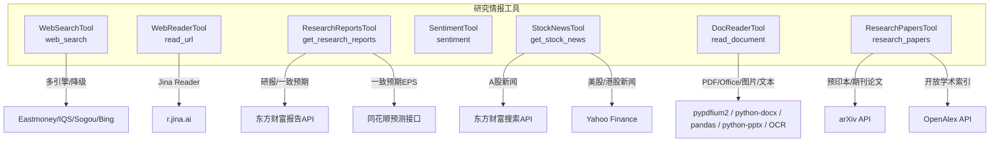
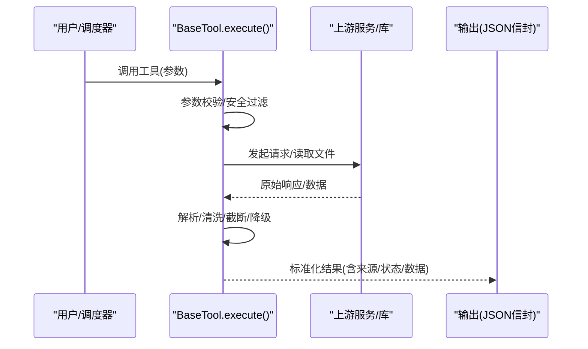
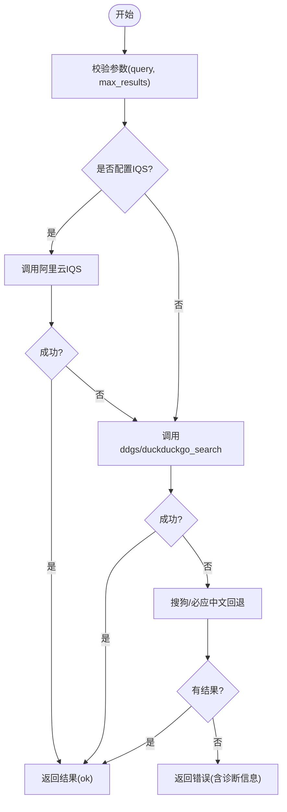
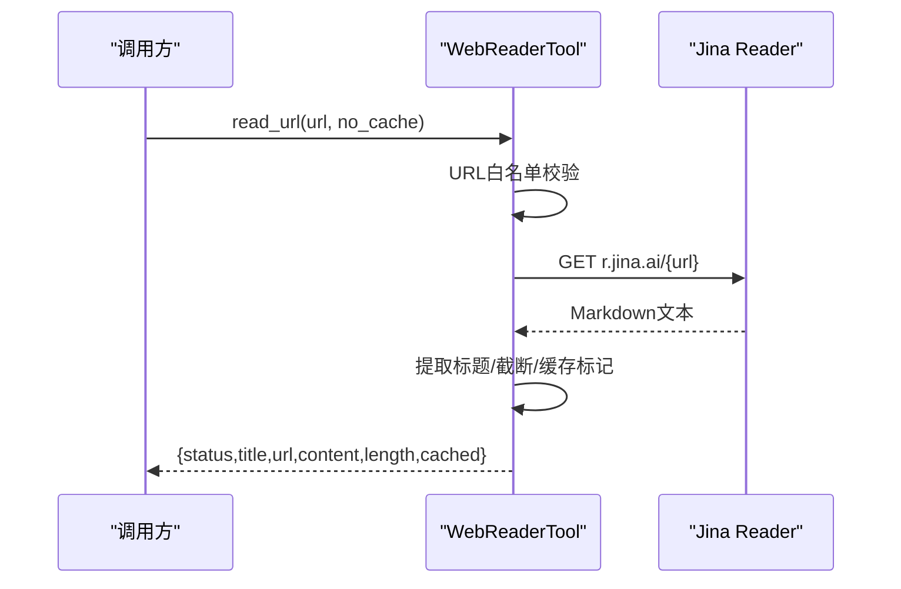
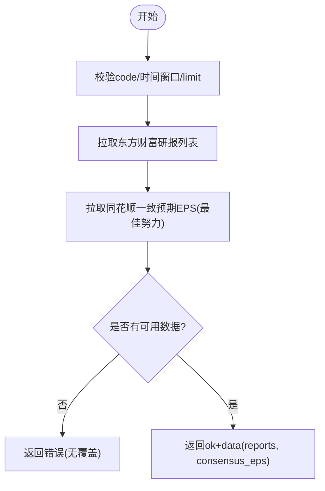
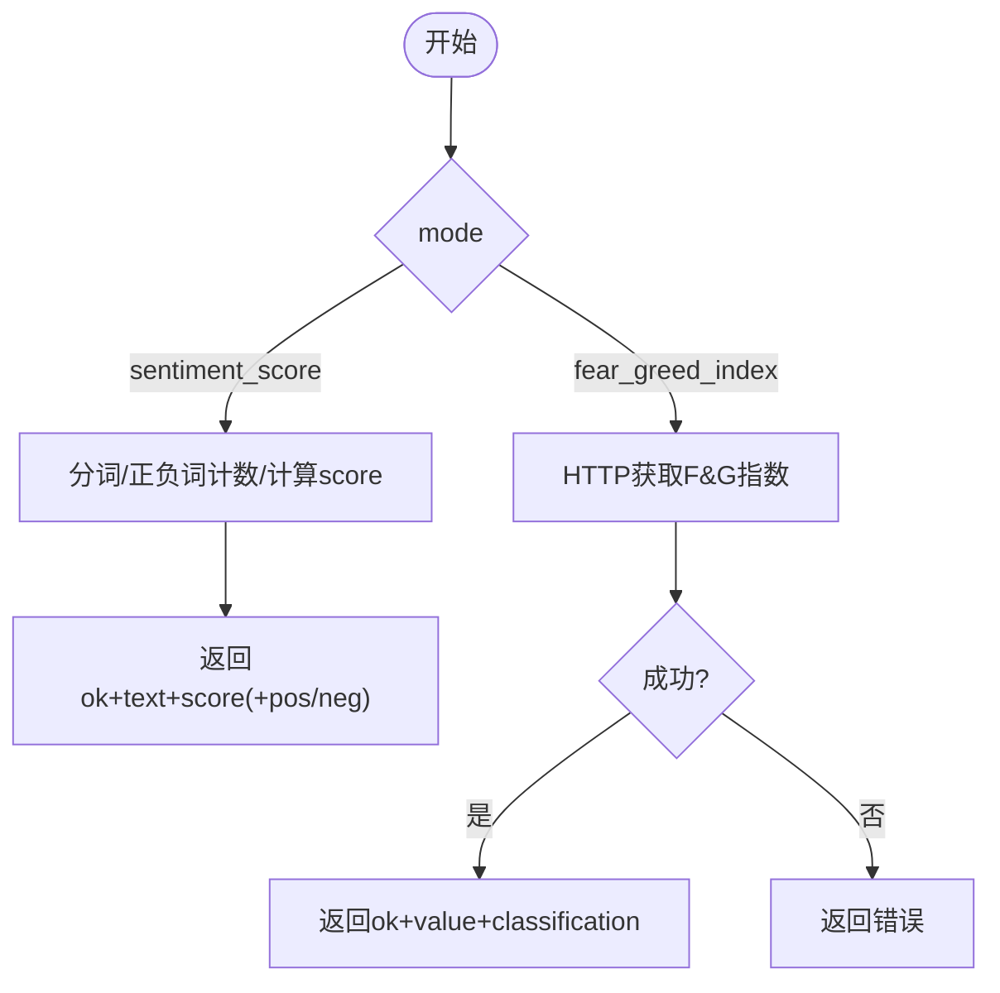
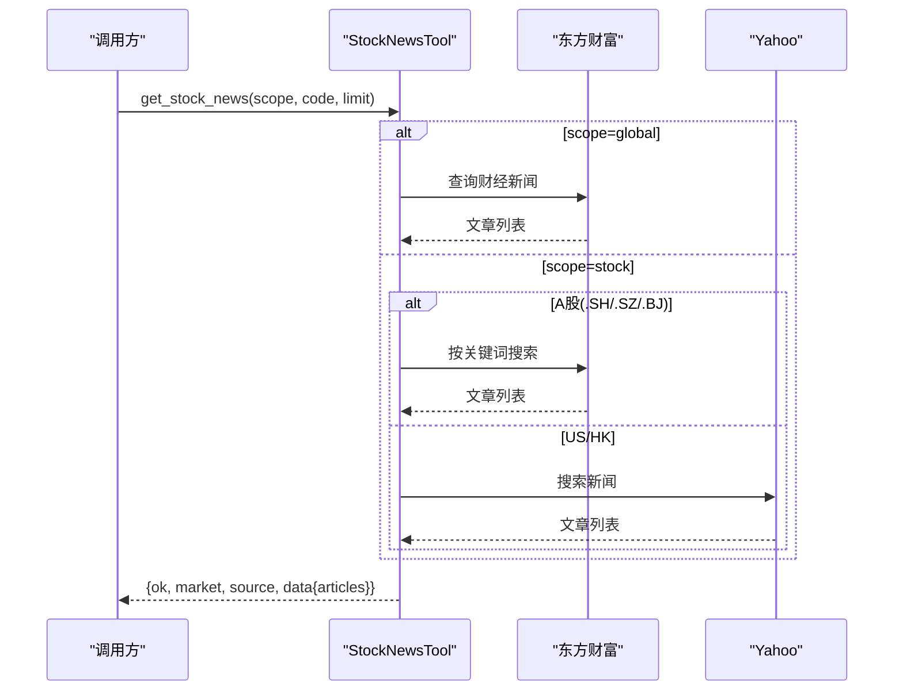
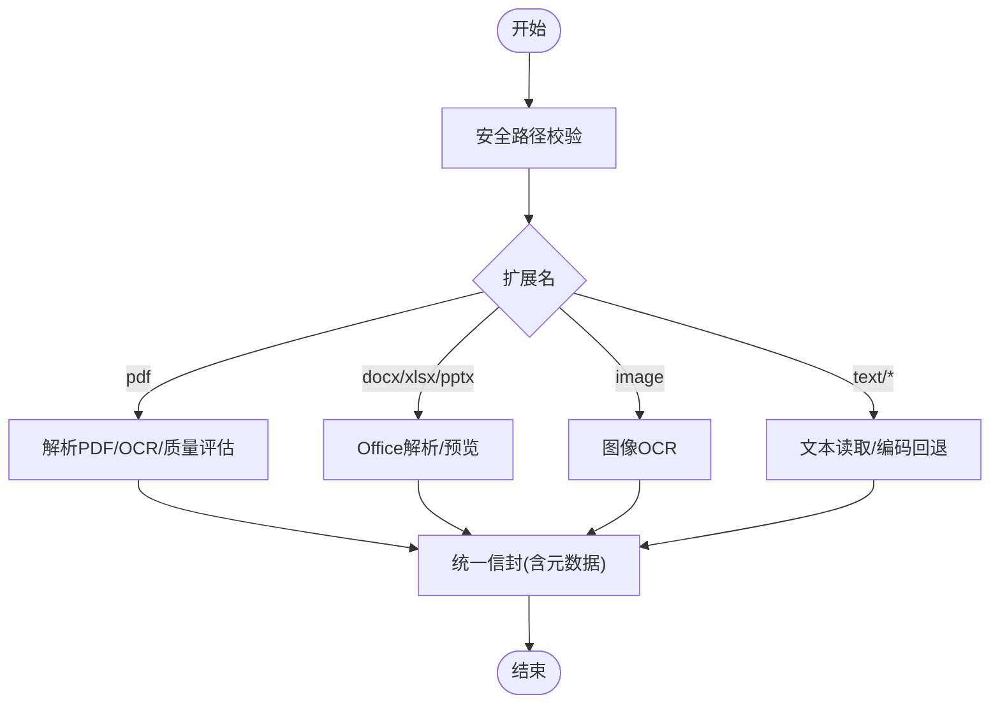
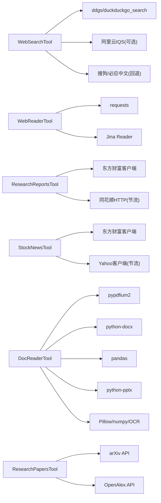

# 研究情报工具

<cite>
**本文引用的文件**
- [web_search_tool.py](file://agent/src/tools/web_search_tool.py)
- [web_reader_tool.py](file://agent/src/tools/web_reader_tool.py)
- [research_reports_tool.py](file://agent/src/tools/research_reports_tool.py)
- [sentiment_tool.py](file://agent/src/tools/sentiment_tool.py)
- [stock_news_tool.py](file://agent/src/tools/stock_news_tool.py)
- [doc_reader_tool.py](file://agent/src/tools/doc_reader_tool.py)
- [research_papers_tool.py](file://agent/src/tools/research_papers_tool.py)
</cite>

## 目录
1. [简介](#简介)
2. [项目结构](#项目结构)
3. [核心组件](#核心组件)
4. [架构总览](#架构总览)
5. [详细组件分析](#详细组件分析)
6. [依赖关系分析](#依赖关系分析)
7. [性能考量](#性能考量)
8. [故障排查指南](#故障排查指南)
9. [结论](#结论)
10. [附录](#附录)

## 简介
本文件面向“研究情报工具”的使用与实现，覆盖以下能力：
- 网络搜索工具：金融信息检索、新闻聚合（多引擎容错与降级）
- 网页内容读取工具：财经网站抓取、PDF文档解析（含OCR）
- 研究报告获取工具：券商研报、学术论文（结构化抽取与因子对接）
- 情感分析工具：市场情绪指标、新闻舆情分析（本地词典+外部指数）
- 股票新闻工具：实时新闻推送、事件驱动分析（A股/美股/港股）

同时提供自动化研究工作流程建议：从信息收集到分析报告生成的端到端过程，并给出数据源可靠性评估与信息过滤策略。

## 项目结构
围绕研究情报的五个工具均位于 agent/src/tools 目录下，遵循统一的 BaseTool 契约，返回标准化 JSON 信封，便于上层编排与审计。关键文件如下：
- web_search_tool.py：多引擎网络搜索（ddgs/duckduckgo_search），支持阿里云 IQS、搜狗、必应中文等回退链
- web_reader_tool.py：通过 Jina Reader 将任意 URL 转为 Markdown 文本，内置安全校验
- research_reports_tool.py：A 股卖方研报与一致预期 EPS（东方财富 + 同花顺）
- sentiment_tool.py：文本情感打分与加密恐惧贪婪指数
- stock_news_tool.py：A 股/美股/港股新闻标题与摘要（东方财富/Yahoo）
- doc_reader_tool.py：通用文档阅读器（PDF/Word/Excel/PPT/图片 OCR/文本）
- research_papers_tool.py：arXiv/OpenAlex 学术文献检索与结构化因子简报

图表来源
- [web_search_tool.py:1-349](file://agent/src/tools/web_search_tool.py#L1-L349)
- [web_reader_tool.py:1-152](file://agent/src/tools/web_reader_tool.py#L1-L152)
- [research_reports_tool.py:1-401](file://agent/src/tools/research_reports_tool.py#L1-L401)
- [sentiment_tool.py:1-147](file://agent/src/tools/sentiment_tool.py#L1-L147)
- [stock_news_tool.py:1-417](file://agent/src/tools/stock_news_tool.py#L1-L417)
- [doc_reader_tool.py:1-457](file://agent/src/tools/doc_reader_tool.py#L1-L457)
- [research_papers_tool.py:1-800](file://agent/src/tools/research_papers_tool.py#L1-L800)

章节来源
- [web_search_tool.py:1-349](file://agent/src/tools/web_search_tool.py#L1-L349)
- [web_reader_tool.py:1-152](file://agent/src/tools/web_reader_tool.py#L1-L152)
- [research_reports_tool.py:1-401](file://agent/src/tools/research_reports_tool.py#L1-L401)
- [sentiment_tool.py:1-147](file://agent/src/tools/sentiment_tool.py#L1-L147)
- [stock_news_tool.py:1-417](file://agent/src/tools/stock_news_tool.py#L1-L417)
- [doc_reader_tool.py:1-457](file://agent/src/tools/doc_reader_tool.py#L1-L457)
- [research_papers_tool.py:1-800](file://agent/src/tools/research_papers_tool.py#L1-L800)

## 核心组件
- WebSearchTool：无密钥多引擎搜索，具备重试、回退链与安全警告；支持配置环境变量切换后端或禁用回退
- WebReaderTool：URL 白名单校验，Jina Reader 转 Markdown，长度截断与缓存标记识别
- ResearchReportsTool：A 股研报列表与一致预期 EPS，严格参数校验与窗口限制，失败降级不中断主流程
- SentimentTool：本地词典情感打分与加密恐惧贪婪指数，纯 Python 计算，零外部依赖
- StockNewsTool：按后缀路由至东方财富或 Yahoo，统一文章结构，限制结果规模与摘要长度
- DocReaderTool：统一文档读取器，PDF 页码范围、OCR 质量评估、编码回退、格式元数据输出
- ResearchPapersTool：arXiv/OpenAlex 双源检索，严格的句子级证据锚定与指标提取，产出可对接因子流水的结构化简报

章节来源
- [web_search_tool.py:134-349](file://agent/src/tools/web_search_tool.py#L134-L349)
- [web_reader_tool.py:24-152](file://agent/src/tools/web_reader_tool.py#L24-L152)
- [research_reports_tool.py:58-199](file://agent/src/tools/research_reports_tool.py#L58-L199)
- [sentiment_tool.py:22-147](file://agent/src/tools/sentiment_tool.py#L22-L147)
- [stock_news_tool.py:57-417](file://agent/src/tools/stock_news_tool.py#L57-L417)
- [doc_reader_tool.py:74-457](file://agent/src/tools/doc_reader_tool.py#L74-L457)
- [research_papers_tool.py:1-800](file://agent/src/tools/research_papers_tool.py#L1-L800)

## 架构总览
所有工具遵循统一契约：输入参数校验 → 调用上游服务/库 → 标准化 JSON 信封输出（包含状态、来源、数据与错误信息）。对外暴露为 Agent/MCP/CLI/Web 可调用的工具。

图表来源
- [web_search_tool.py:172-349](file://agent/src/tools/web_search_tool.py#L172-L349)
- [web_reader_tool.py:61-152](file://agent/src/tools/web_reader_tool.py#L61-L152)
- [research_reports_tool.py:111-199](file://agent/src/tools/research_reports_tool.py#L111-L199)
- [stock_news_tool.py:290-417](file://agent/src/tools/stock_news_tool.py#L290-L417)
- [doc_reader_tool.py:384-457](file://agent/src/tools/doc_reader_tool.py#L384-L457)

## 详细组件分析

### 网络搜索工具（WebSearchTool）
- 功能要点
  - 多引擎聚合：优先尝试 ddgs/duckduckgo_search，支持自定义后端列表
  - 中国网络环境回退链：阿里云 IQS（可选）、搜狗、必应中文
  - 重试与退避：最多 3 次，遇超时/不可达快速退出并进入回退链
  - 安全：对标题/片段进行安全警告处理
- 数据处理流程
  - 参数校验（query 必填，max_results 限幅）
  - 尝试 IQS（若配置）→ 失败则走 ddgs → 失败则搜狗/必应回退
  - 统一封装结果（status/query/backends/results）
- 使用建议
  - 在受限网络环境下启用 VIBE_TRADING_SEARCH_BING_FALLBACK=1
  - 可通过 VIBE_TRADING_SEARCH_BACKENDS 指定或固定后端
  - 结合 read_url 直接访问已知高质量页面

图表来源
- [web_search_tool.py:172-349](file://agent/src/tools/web_search_tool.py#L172-L349)

章节来源
- [web_search_tool.py:1-349](file://agent/src/tools/web_search_tool.py#L1-L349)

### 网页内容读取工具（WebReaderTool）
- 功能要点
  - 通过 Jina Reader 将网页转为 Markdown，支持 no_cache 强制刷新
  - 严格 URL 白名单：禁止内网/本地/含凭据的 URL
  - 结果截断与缓存标记识别，输出 title/url/content/length/cached
- 数据处理流程
  - URL 合法性检查 → 发送请求 → 解析标题 → 截断长文 → 安全警告 → 返回
- 使用建议
  - 仅用于公开网页；避免传递敏感链接
  - 需要最新内容时设置 no_cache=true

图表来源
- [web_reader_tool.py:24-152](file://agent/src/tools/web_reader_tool.py#L24-L152)

章节来源
- [web_reader_tool.py:1-152](file://agent/src/tools/web_reader_tool.py#L1-L152)

### 研究报告获取工具（ResearchReportsTool）
- 功能要点
  - A 股研报列表（东方财富）+ 一致预期 EPS（同花顺）
  - 时间窗口默认近两年，支持 beginTime/endTime 限定
  - 严格参数校验（代码后缀、日期顺序、limit 上限）
  - 一致预期为 best-effort，失败不影响研报主体
- 数据处理流程
  - 校验 code → 解析时间窗口 → 拉取研报 → 拉取一致预期 → 组装 data
- 使用建议
  - 仅支持 .SH/.SZ/.BJ
  - 合理设置 limit（最大 50）以避免过大载荷

图表来源
- [research_reports_tool.py:111-199](file://agent/src/tools/research_reports_tool.py#L111-L199)

章节来源
- [research_reports_tool.py:1-401](file://agent/src/tools/research_reports_tool.py#L1-L401)

### 情感分析工具（SentimentTool）
- 功能要点
  - sentiment_score：基于本地词典的文本情感打分 [-1, 1]
  - fear_greed_index：获取加密恐惧贪婪指数（alternative.me）
- 数据处理流程
  - 模式选择 → 文本分词/匹配 → 计算得分或拉取指数 → 返回
- 使用建议
  - 适合对新闻标题/短文本做快速情绪信号
  - 指数可作为宏观情绪背景

图表来源
- [sentiment_tool.py:58-147](file://agent/src/tools/sentiment_tool.py#L58-L147)

章节来源
- [sentiment_tool.py:1-147](file://agent/src/tools/sentiment_tool.py#L1-L147)

### 股票新闻工具（StockNewsTool）
- 功能要点
  - scope=stock：按代码后缀路由（A 股→东方财富；US/HK→Yahoo）
  - scope=global：获取广泛的中国财经新闻
  - 统一文章结构（title/url/source/published/snippet），限制结果规模与摘要长度
- 数据处理流程
  - 校验 scope/code/limit → 路由上游 → 解析文章 → 裁剪摘要 → 返回
- 使用建议
  - 事件驱动分析：结合 get_stock_news 与 read_url 深入阅读
  - 控制 limit 避免过载

图表来源
- [stock_news_tool.py:245-417](file://agent/src/tools/stock_news_tool.py#L245-L417)

章节来源
- [stock_news_tool.py:1-417](file://agent/src/tools/stock_news_tool.py#L1-L417)

### 文档读取工具（DocReaderTool）
- 功能要点
  - 支持 PDF/Word/Excel/PPT/图片/文本，统一 JSON 信封
  - PDF 支持页码范围、OCR 质量评估（good/degraded/no_ocr_engine/no_ocr_needed）
  - Excel 输出各表预览与元数据；图片 OCR 需安装 OCR 引擎
- 数据处理流程
  - 路径安全校验 → 扩展名分发 → 解析/OCR → 截断与元数据 → 返回
- 使用建议
  - PDF 扫描页较多时确保 OCR 可用，否则可能 degraded
  - 大文档注意 char_count 与 truncated 标志

图表来源
- [doc_reader_tool.py:384-457](file://agent/src/tools/doc_reader_tool.py#L384-L457)

章节来源
- [doc_reader_tool.py:1-457](file://agent/src/tools/doc_reader_tool.py#L1-L457)

### 学术论文工具（ResearchPapersTool）
- 功能要点
  - arXiv 预印本 + OpenAlex 已发表文献，双源检索
  - 严格的句子级证据锚定，指标提取需满足强/弱触发与上下文验证
  - 输出 factor_brief，可直接对接因子研究与回测流水线
- 数据处理流程
  - 搜索/读取 → 归一化/分句 → 词汇/能力/市场/周期/绩效抽取 → 生成简报
- 使用建议
  - 明确 extraction_scope（仅摘要/标题）
  - 将 claimed_performance 视为论文声明，非回测结果

章节来源
- [research_papers_tool.py:1-800](file://agent/src/tools/research_papers_tool.py#L1-L800)

## 依赖关系分析
- 外部依赖
  - 网络搜索：ddgs/duckduckgo_search；可选阿里云 IQS；搜狗/必应中文（标准库 urllib）
  - 网页读取：requests + Jina Reader
  - 研报：东方财富客户端、同花顺 HTTP 层（带节流）
  - 新闻：东方财富客户端、Yahoo 客户端（带节流）
  - 文档：pypdfium2、python-docx、pandas、python-pptx、Pillow、numpy、OCR 引擎
  - 论文：arXiv API、OpenAlex API（带节流与礼貌头）
- 内部依赖
  - 统一 BaseTool 契约与 with_security_warnings 安全包装
  - 进度上报 emit_progress（部分工具）
  - 配置读取 get_env_config（环境变量开关）

图表来源
- [web_search_tool.py:1-349](file://agent/src/tools/web_search_tool.py#L1-L349)
- [web_reader_tool.py:1-152](file://agent/src/tools/web_reader_tool.py#L1-L152)
- [research_reports_tool.py:1-401](file://agent/src/tools/research_reports_tool.py#L1-L401)
- [stock_news_tool.py:1-417](file://agent/src/tools/stock_news_tool.py#L1-L417)
- [doc_reader_tool.py:1-457](file://agent/src/tools/doc_reader_tool.py#L1-L457)
- [research_papers_tool.py:1-800](file://agent/src/tools/research_papers_tool.py#L1-L800)

章节来源
- [web_search_tool.py:1-349](file://agent/src/tools/web_search_tool.py#L1-L349)
- [web_reader_tool.py:1-152](file://agent/src/tools/web_reader_tool.py#L1-L152)
- [research_reports_tool.py:1-401](file://agent/src/tools/research_reports_tool.py#L1-L401)
- [stock_news_tool.py:1-417](file://agent/src/tools/stock_news_tool.py#L1-L417)
- [doc_reader_tool.py:1-457](file://agent/src/tools/doc_reader_tool.py#L1-L457)
- [research_papers_tool.py:1-800](file://agent/src/tools/research_papers_tool.py#L1-L800)

## 性能考量
- 网络请求节流与回退
  - 研报与新闻工具通过宿主节流层控制频率，避免被限流
  - 搜索工具具备多级回退链，减少因单点失败导致的整体阻塞
- 结果大小控制
  - 新闻与研报工具限制返回条数与摘要长度，降低 LLM 上下文压力
  - 网页读取工具对长文进行截断，避免超大响应
- OCR 与文档解析
  - PDF 页级阈值触发 OCR，配合质量评估反馈
  - Excel 仅输出前若干行预览，避免大表拖慢
- 重试与超时
  - 搜索工具有限重试与指数退避；网页读取工具设置超时保护

[本节为通用指导，无需特定文件引用]

## 故障排查指南
- 网络搜索失败
  - 现象：返回 error 并提示后端与回退链状态
  - 排查：检查 VIBE_TRADING_SEARCH_BACKENDS 与 VIBE_TRADING_SEARCH_BING_FALLBACK；确认网络可达性；必要时改用 read_url 直读已知链接
  - 参考
    - [web_search_tool.py:172-349](file://agent/src/tools/web_search_tool.py#L172-L349)
- 网页读取失败
  - 现象：HTTP 非 200 或超时
  - 排查：确认 URL 不在白名单黑名单；尝试 no_cache；检查远程服务可用性
  - 参考
    - [web_reader_tool.py:61-152](file://agent/src/tools/web_reader_tool.py#L61-L152)
- 研报/新闻无数据
  - 现象：空列表或错误
  - 排查：确认代码后缀与时间窗口；检查上游限流；放宽 limit 或调整查询词
  - 参考
    - [research_reports_tool.py:111-199](file://agent/src/tools/research_reports_tool.py#L111-L199)
    - [stock_news_tool.py:290-417](file://agent/src/tools/stock_news_tool.py#L290-L417)
- 文档解析异常
  - 现象：OCR 不可用或解码失败
  - 排查：安装 OCR 引擎；检查 PDF 页码范围；确认编码回退；查看 quality_flag
  - 参考
    - [doc_reader_tool.py:133-235](file://agent/src/tools/doc_reader_tool.py#L133-L235)
    - [doc_reader_tool.py:304-348](file://agent/src/tools/doc_reader_tool.py#L304-L348)
    - [doc_reader_tool.py:353-372](file://agent/src/tools/doc_reader_tool.py#L353-L372)

章节来源
- [web_search_tool.py:172-349](file://agent/src/tools/web_search_tool.py#L172-L349)
- [web_reader_tool.py:61-152](file://agent/src/tools/web_reader_tool.py#L61-L152)
- [research_reports_tool.py:111-199](file://agent/src/tools/research_reports_tool.py#L111-L199)
- [stock_news_tool.py:290-417](file://agent/src/tools/stock_news_tool.py#L290-L417)
- [doc_reader_tool.py:133-372](file://agent/src/tools/doc_reader_tool.py#L133-L372)

## 结论
本套研究情报工具以统一契约与稳健的降级策略，覆盖了从信息检索、内容抓取、研报与论文获取到情感分析与新闻聚合的全链路需求。通过参数化配置与严格的数据边界控制，可在不同网络与资源条件下稳定运行，并为自动化研究流程提供可靠的数据基础。

[本节为总结性内容，无需特定文件引用]

## 附录

### 自动化研究工作流程建议
- 目标：从信息收集到分析报告生成的端到端闭环
- 步骤
  1) 信息收集
     - 使用 web_search 定位相关主题与权威来源
     - 使用 get_stock_news 获取标的相关新闻
     - 使用 get_research_reports 获取卖方研报与一致预期
  2) 内容读取
     - 使用 read_url 抓取网页正文
     - 使用 read_document 解析 PDF/Excel/图片等附件
  3) 情感与情绪
     - 使用 sentiment 对新闻/研报摘要打分
     - 使用 fear_greed_index 获取加密市场情绪背景
  4) 学术支撑
     - 使用 research_papers 检索相关论文，提取能力/市场/周期/绩效声明
  5) 分析与报告
     - 汇总多源数据，形成结构化简报
     - 输出可复现的分析结论与数据来源标注
- 数据源可靠性评估
  - 优先采用官方/权威渠道（如东方财富、Yahoo、arXiv、OpenAlex）
  - 关注节流与限流策略，避免瞬时高并发导致数据缺失
  - 对第三方回退链（搜狗/必应）保持审慎，交叉验证关键信息
- 信息过滤策略
  - 限制返回数量与摘要长度，聚焦高价值信息
  - 使用参数窗口（时间范围、市场后缀）缩小范围
  - 对 OCR 质量与缓存标记保持敏感，必要时强制刷新或人工复核

[本节为概念性指导，无需特定文件引用]