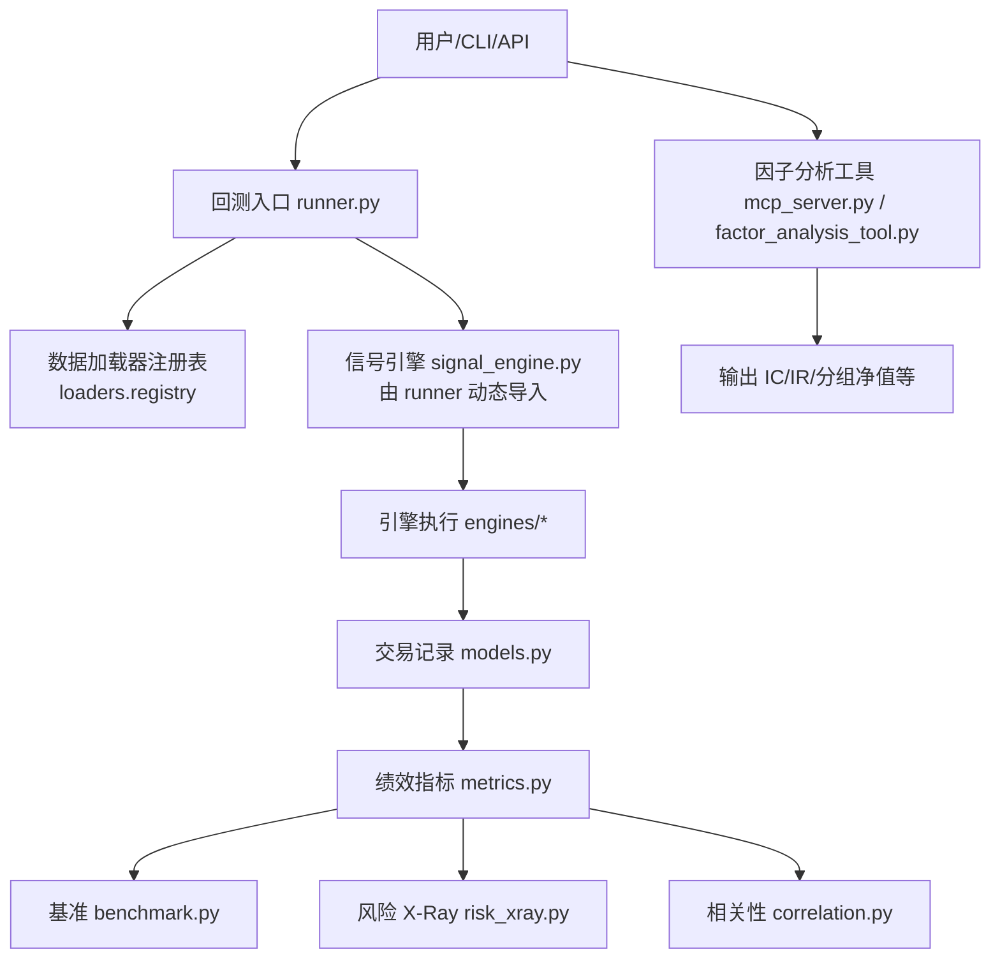
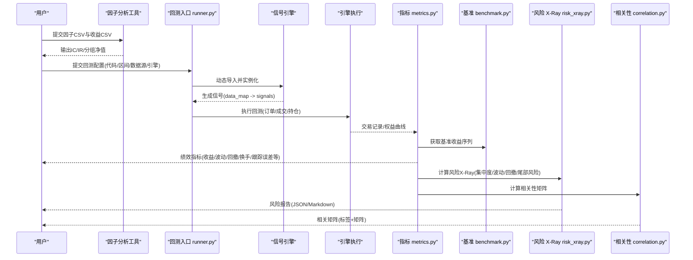
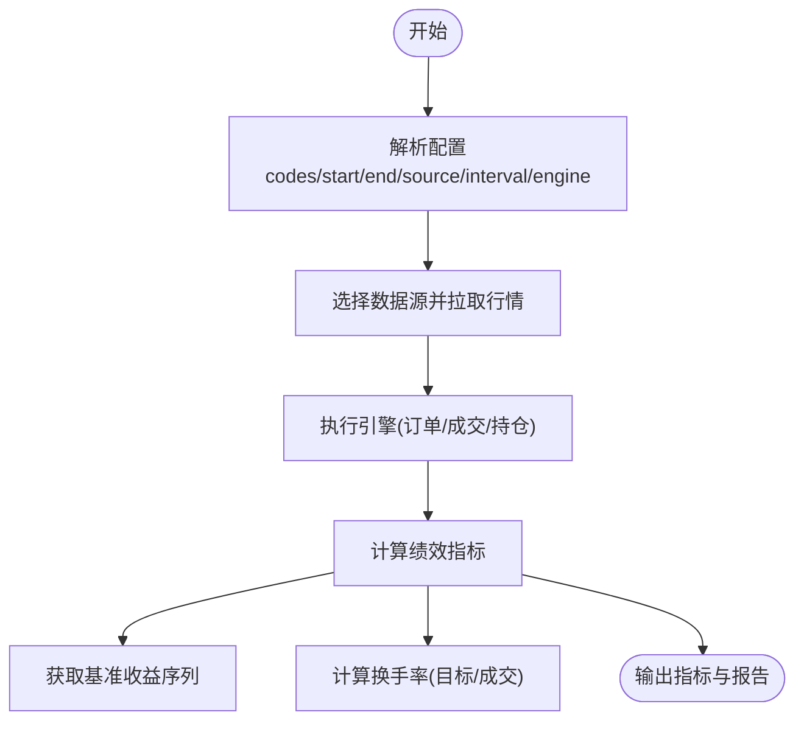
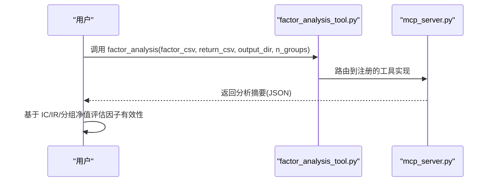
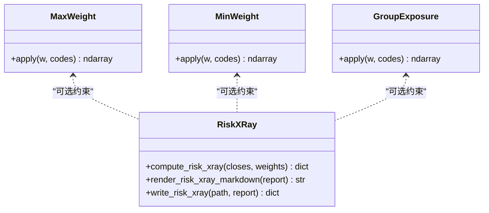
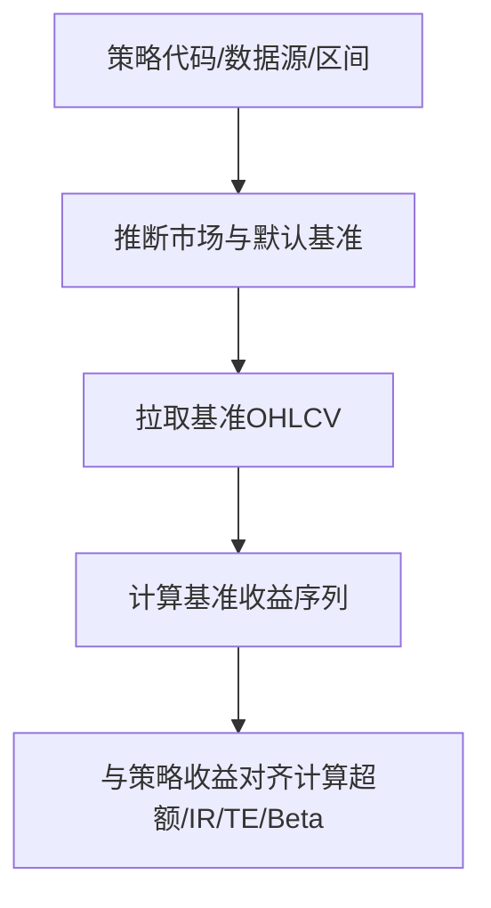
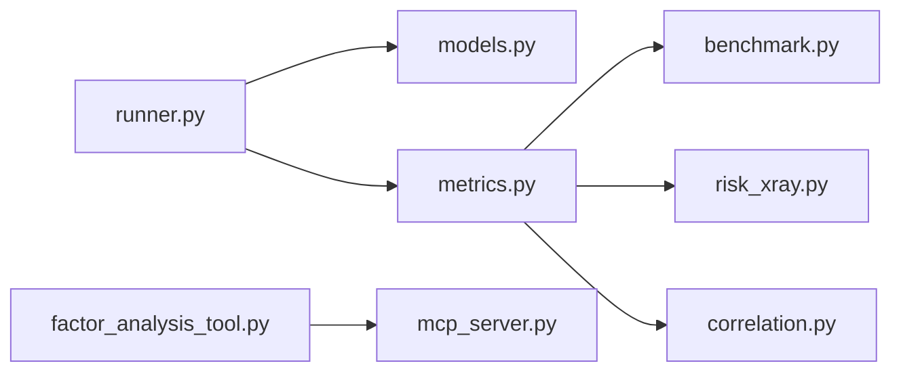

# 策略开发工具

<cite>
**本文引用的文件**
- [README.md](file://README.md)
- [runner.py](file://agent/backtest/runner.py)
- [models.py](file://agent/backtest/models.py)
- [metrics.py](file://agent/backtest/metrics.py)
- [benchmark.py](file://agent/backtest/benchmark.py)
- [constraints.py](file://agent/backtest/constraints.py)
- [correlation.py](file://agent/backtest/correlation.py)
- [risk_xray.py](file://agent/backtest/risk_xray.py)
- [mcp_server.py](file://agent/mcp_server.py)
- [factor_analysis_tool.py](file://agent/src/tools/factor_analysis_tool.py)
- [SKILL.md](file://agent/src/skills/factor-research/SKILL.md)
</cite>

## 目录
1. [简介](#简介)
2. [项目结构](#项目结构)
3. [核心组件](#核心组件)
4. [架构总览](#架构总览)
5. [详细组件分析](#详细组件分析)
6. [依赖关系分析](#依赖关系分析)
7. [性能考虑](#性能考虑)
8. [故障排查指南](#故障排查指南)
9. [结论](#结论)
10. [附录](#附录)

## 简介
本文件面向“策略开发工具”的完整工作流，覆盖以下四大能力：
- 回测引擎工具：策略回测、参数优化、绩效分析与基准比较
- 因子分析工具：因子构建、有效性检验（IC/IR）、相关性分析
- 投资组合风险管理工具：风险度量、压力测试、资产配置与约束
- Alpha 基准比较工具：Alpha Zoo 对比与基准收益对齐

文档提供每个工具的 API 参考、配置选项、使用示例，并给出从因子研究到策略回测再到风险评估的端到端工作流、最佳实践与常见问题解决方案。

## 项目结构
仓库围绕“数据加载—信号生成—引擎回测—指标计算—风险与基准分析”的模块化设计组织代码：
- 回测入口与沙箱校验：runner.py
- 回测数据模型：models.py
- 绩效指标与年化：metrics.py
- 基准选择与获取：benchmark.py
- 组合权重约束：constraints.py
- 相关性矩阵：correlation.py
- 风险 X-Ray：risk_xray.py
- 因子分析工具（MCP）：mcp_server.py + factor_analysis_tool.py
- 因子研究技能说明：SKILL.md
- 项目概览与更新日志：README.md

图表来源
- [runner.py:1-800](file://agent/backtest/runner.py#L1-L800)
- [models.py:1-118](file://agent/backtest/models.py#L1-L118)
- [metrics.py:1-641](file://agent/backtest/metrics.py#L1-L641)
- [benchmark.py:1-208](file://agent/backtest/benchmark.py#L1-L208)
- [correlation.py:1-302](file://agent/backtest/correlation.py#L1-L302)
- [risk_xray.py:1-369](file://agent/backtest/risk_xray.py#L1-L369)
- [mcp_server.py:823-850](file://agent/mcp_server.py#L823-L850)
- [factor_analysis_tool.py:108-151](file://agent/src/tools/factor_analysis_tool.py#L108-L151)

章节来源
- [README.md](file://README.md)

## 核心组件
- 回测入口与沙箱：runner.py
  - 读取配置、选择数据源、动态导入信号引擎、执行回测
  - AST 级安全扫描，禁止网络/进程/文件系统写入等危险操作
  - 配置校验：日期、区间、引擎类型、初始资金等
- 数据模型：models.py
  - Position/FillRecord/TradeRecord/EquitySnapshot 等不可变记录
- 绩效指标：metrics.py
  - 年化因子映射、收益率计算、胜率/盈亏比/换手率、综合指标 calc_metrics
- 基准比较：benchmark.py
  - 按市场推断默认基准、拉取基准收益序列、计算总回报
- 组合约束：constraints.py
  - 最大权重、最小权重、分组暴露上限，可组合应用
- 相关性：correlation.py
  - 多资产滚动相关矩阵（Pearson/Spearman），自动归一化符号与市场
- 风险 X-Ray：risk_xray.py
  - 集中度、波动率、回撤、尾部风险、分散度、相关性；长仓约束
- 因子分析：mcp_server.py + factor_analysis_tool.py
  - 输入因子与收益 CSV，输出 IC/IR、分组净值等
- 技能说明：SKILL.md
  - 因子研究流程、工具参数与注意事项

章节来源
- [runner.py:1-800](file://agent/backtest/runner.py#L1-L800)
- [models.py:1-118](file://agent/backtest/models.py#L1-L118)
- [metrics.py:1-641](file://agent/backtest/metrics.py#L1-L641)
- [benchmark.py:1-208](file://agent/backtest/benchmark.py#L1-L208)
- [constraints.py:1-206](file://agent/backtest/constraints.py#L1-L206)
- [correlation.py:1-302](file://agent/backtest/correlation.py#L1-L302)
- [risk_xray.py:1-369](file://agent/backtest/risk_xray.py#L1-L369)
- [mcp_server.py:823-850](file://agent/mcp_server.py#L823-L850)
- [factor_analysis_tool.py:108-151](file://agent/src/tools/factor_analysis_tool.py#L108-L151)
- [SKILL.md:1-36](file://agent/src/skills/factor-research/SKILL.md#L1-L36)

## 架构总览
下图展示从因子研究到策略回测再到风险评估的端到端调用链。

图表来源
- [runner.py:1-800](file://agent/backtest/runner.py#L1-L800)
- [metrics.py:1-641](file://agent/backtest/metrics.py#L1-L641)
- [benchmark.py:1-208](file://agent/backtest/benchmark.py#L1-L208)
- [risk_xray.py:1-369](file://agent/backtest/risk_xray.py#L1-L369)
- [correlation.py:1-302](file://agent/backtest/correlation.py#L1-L302)
- [mcp_server.py:823-850](file://agent/mcp_server.py#L823-L850)
- [factor_analysis_tool.py:108-151](file://agent/src/tools/factor_analysis_tool.py#L108-L151)

## 详细组件分析

### 回测引擎工具（策略回测、参数优化、绩效分析）
- 策略回测
  - 入口：runner.py
    - 读取配置（代码列表、起止日期、数据源、区间、引擎、初始资金等）
    - 动态导入信号引擎并进行 AST 安全扫描，禁止危险操作
    - 通过 loaders.registry 选择数据源并拉取行情
    - 执行引擎并产出交易记录与权益曲线
  - 数据模型：models.py
    - FillRecord/TradeRecord/EquitySnapshot 等用于审计与指标计算
  - 绩效指标：metrics.py
    - 年化因子、收益率、胜率/盈亏比/换手率、跟踪误差、信息比率、基准Beta等
- 参数优化
  - 约束层：constraints.py
    - 支持 max_weight/min_weight/group_exposure，可组合应用于任意优化器输出
  - 优化器集合：optimizers/*（如 mean_variance、risk_parity、turnover_aware 等）
    - 与 constraints 层解耦，便于统一后处理
- 绩效分析
  - calc_metrics 汇总收益、波动、回撤、换手、基准对比等
  - 基准获取：benchmark.py 自动推断市场并拉取基准序列

图表来源
- [runner.py:1-800](file://agent/backtest/runner.py#L1-L800)
- [metrics.py:1-641](file://agent/backtest/metrics.py#L1-L641)
- [benchmark.py:1-208](file://agent/backtest/benchmark.py#L1-L208)

章节来源
- [runner.py:1-800](file://agent/backtest/runner.py#L1-L800)
- [models.py:1-118](file://agent/backtest/models.py#L1-L118)
- [metrics.py:1-641](file://agent/backtest/metrics.py#L1-L641)
- [benchmark.py:1-208](file://agent/backtest/benchmark.py#L1-L208)
- [constraints.py:1-206](file://agent/backtest/constraints.py#L1-L206)

### 因子分析工具（因子构建、有效性检验、相关性分析）
- 因子构建
  - 依据 SKILL.md 的流程：计算截面因子值与向前收益，输出对齐的 CSV
- 有效性检验
  - MCP 工具 factor_analysis：输入 factor_csv 与 return_csv，输出 IC/IR、分组净值等
  - 工具定义与参数见 factor_analysis_tool.py
- 相关性分析
  - correlation.py：多资产滚动相关矩阵（Pearson/Spearman），自动归一化符号与市场
  - 支持自定义窗口与方法

图表来源
- [factor_analysis_tool.py:108-151](file://agent/src/tools/factor_analysis_tool.py#L108-L151)
- [mcp_server.py:823-850](file://agent/mcp_server.py#L823-L850)
- [SKILL.md:1-36](file://agent/src/skills/factor-research/SKILL.md#L1-L36)

章节来源
- [factor_analysis_tool.py:108-151](file://agent/src/tools/factor_analysis_tool.py#L108-L151)
- [mcp_server.py:823-850](file://agent/mcp_server.py#L823-L850)
- [correlation.py:1-302](file://agent/backtest/correlation.py#L1-L302)
- [SKILL.md:1-36](file://agent/src/skills/factor-research/SKILL.md#L1-L36)

### 投资组合风险管理工具（风险度量、压力测试、资产配置）
- 风险度量
  - risk_xray.py：集中度(HHI/有效N)、波动率、最大回撤、尾部风险(VaR/ES)、分散度、相关性
  - 仅长仓，非有限值被过滤，结果严格 JSON 安全
- 压力测试
  - 可通过调整权重或选取极端历史窗口进行情景分析（结合 correlation 与 risk_xray）
- 资产配置与约束
  - constraints.py：max_weight/min_weight/group_exposure，顺序作用，保留符号方向
  - 可与 optimizers/* 的输出配合，形成稳健的组合权重

图表来源
- [constraints.py:1-206](file://agent/backtest/constraints.py#L1-L206)
- [risk_xray.py:1-369](file://agent/backtest/risk_xray.py#L1-L369)

章节来源
- [risk_xray.py:1-369](file://agent/backtest/risk_xray.py#L1-L369)
- [constraints.py:1-206](file://agent/backtest/constraints.py#L1-L206)

### Alpha 基准比较工具
- 基准选择与获取
  - benchmark.py：根据市场推断默认基准（如 SPY、CSI300、BTC-USDT 等），拉取基准收益序列并计算总回报
- 与绩效指标联动
  - metrics.py 在 calc_metrics 中计算基准收益、超额收益、信息比率、跟踪误差、基准Beta

图表来源
- [benchmark.py:1-208](file://agent/backtest/benchmark.py#L1-L208)
- [metrics.py:1-641](file://agent/backtest/metrics.py#L1-L641)

章节来源
- [benchmark.py:1-208](file://agent/backtest/benchmark.py#L1-L208)
- [metrics.py:1-641](file://agent/backtest/metrics.py#L1-L641)

## 依赖关系分析
- 模块耦合
  - runner.py 依赖 loaders.registry、engines/*、AST 安全扫描与配置校验
  - metrics.py 依赖 models.py 的交易记录与权益曲线
  - benchmark.py 依赖 yfinance_loader 作为通用基准数据源
  - correlation.py 依赖 loaders.registry 的多源回退链
  - risk_xray.py 为纯函数式计算，无外部 I/O 依赖
  - factor_analysis_tool.py 通过 mcp_server.py 注册为工具
- 外部依赖
  - pandas/numpy/scipy 用于统计与时间序列计算
  - 各数据源加载器（tushare/yfinance/akshare/ccxt 等）

图表来源
- [runner.py:1-800](file://agent/backtest/runner.py#L1-L800)
- [metrics.py:1-641](file://agent/backtest/metrics.py#L1-L641)
- [benchmark.py:1-208](file://agent/backtest/benchmark.py#L1-L208)
- [risk_xray.py:1-369](file://agent/backtest/risk_xray.py#L1-L369)
- [correlation.py:1-302](file://agent/backtest/correlation.py#L1-L302)
- [factor_analysis_tool.py:108-151](file://agent/src/tools/factor_analysis_tool.py#L108-L151)
- [mcp_server.py:823-850](file://agent/mcp_server.py#L823-L850)

章节来源
- [runner.py:1-800](file://agent/backtest/runner.py#L1-L800)
- [metrics.py:1-641](file://agent/backtest/metrics.py#L1-L641)
- [benchmark.py:1-208](file://agent/backtest/benchmark.py#L1-L208)
- [correlation.py:1-302](file://agent/backtest/correlation.py#L1-L302)
- [risk_xray.py:1-369](file://agent/backtest/risk_xray.py#L1-L369)
- [factor_analysis_tool.py:108-151](file://agent/src/tools/factor_analysis_tool.py#L108-L151)
- [mcp_server.py:823-850](file://agent/mcp_server.py#L823-L850)

## 性能考虑
- 年化与频率
  - metrics.py 提供按数据源与区间的 bars_per_year 映射，确保年化一致
- 收益率计算
  - bar_returns 对零/负前价做安全处理，避免无穷大与 NaN 污染
- 相关性
  - correlation.py 使用滚动窗口并对齐跨市场时间戳，避免停牌导致的虚假 0% 收益
- 风险 X-Ray
  - 仅使用历史收益，避免前视偏差；非有限值被过滤，保证 JSON 安全
- 基准
  - benchmark.py 优先使用配置的数据源加载器，离线场景失败关闭

[本节为通用指导，不直接分析具体文件]

## 故障排查指南
- 回测配置错误
  - 日期格式、区间、引擎类型、初始资金非法将被拒绝
  - 参考：runner.py 的配置校验逻辑
- 信号引擎安全问题
  - 动态导入前进行 AST 扫描，禁止网络/进程/写文件等操作
  - 若报错“不允许的操作”，请检查 generate() 及可达方法中的调用
- 基准缺失
  - 当无法拉取基准时，benchmark.py 会返回 None；检查市场推断与数据源可用性
- 相关性无重叠
  - correlation.py 在多资产间内连接返回序列，若无重叠将抛出异常；检查时间范围与数据源
- 风险 X-Ray 输入无效
  - 权重必须为正且求和为 1；价格面板需有足够有效观测；否则抛出明确错误
- 因子分析输入不对齐
  - factor_csv 与 return_csv 的行（日期）与列（代码）必须完全对齐；参考 SKILL.md

章节来源
- [runner.py:1-800](file://agent/backtest/runner.py#L1-L800)
- [benchmark.py:1-208](file://agent/backtest/benchmark.py#L1-L208)
- [correlation.py:1-302](file://agent/backtest/correlation.py#L1-L302)
- [risk_xray.py:1-369](file://agent/backtest/risk_xray.py#L1-L369)
- [SKILL.md:1-36](file://agent/src/skills/factor-research/SKILL.md#L1-L36)

## 结论
本工具集提供了从因子研究到策略回测再到风险评估的完整闭环：
- 因子研究：通过 factor_analysis 工具快速验证因子有效性
- 策略回测：runner.py 驱动引擎执行，metrics.py 输出全面绩效指标，benchmark.py 提供基准对比
- 风险管理：risk_xray.py 与 constraints.py 保障组合稳健性
- 工作流整合：MCP 工具与技能说明串联各环节，形成标准化研发流程

建议在实际使用中遵循：
- 严格对齐因子与收益的时间与代码维度
- 使用约束层控制组合暴露与集中度
- 以基准与跟踪误差评估策略相对表现
- 用风险 X-Ray 审视尾部风险与分散度

[本节为总结，不直接分析具体文件]

## 附录

### API 参考与配置选项

- 回测入口（runner.py）
  - 配置项：codes、start_date、end_date、source、interval、engine、initial_cash、fundamental_fields、event_feeds
  - 行为：读取配置、选择数据源、导入信号引擎、执行回测、输出交易与权益
  - 安全：AST 扫描禁止危险操作

- 绩效指标（metrics.py）
  - 关键函数：calc_metrics(equity_curve, trades, initial_cash, bars_per_year=None, bench_ret=None, positions=None, turnover_series=None)
  - 输出：最终价值、总收益、年化收益、最大回撤、夏普、索提诺、卡玛、胜率、盈亏比、利润因子、平均持有期、交易次数、基准收益、超额收益、信息比率、跟踪误差、基准Beta、平均/总换手率

- 基准比较（benchmark.py）
  - 关键函数：resolve_benchmark(strategy_codes, source, start_date, end_date, interval="1D", explicit=None, loader=None)
  - 输出：BenchmarkResult(ticker, ret_series, total_ret)

- 组合约束（constraints.py）
  - 约束类型：max_weight(cap)、min_weight(floor)、group_exposure(groups, caps)
  - 应用方式：apply_constraints_frame(frame, constraints)，逐行作用，保持符号方向

- 相关性（correlation.py）
  - 关键函数：compute_correlation_matrix(codes, days=90, method="pearson")
  - 输出：labels、matrix、window、method

- 风险 X-Ray（risk_xray.py）
  - 关键函数：compute_risk_xray(closes, weights, periods_per_year=252, var_levels=(0.95,0.99), min_history=30)
  - 输出：inputs、concentration、volatility、drawdown、tail_risk、diversification、correlation、skipped、warnings

- 因子分析工具（mcp_server.py + factor_analysis_tool.py）
  - 工具名：factor_analysis
  - 参数：factor_csv、return_csv、output_dir、n_groups（默认5）
  - 行为：计算 IC/IR、分组净值等，输出分析摘要

- 因子研究技能（SKILL.md）
  - 流程：计算因子值与向前收益 → 调用 factor_analysis → 解释结果 → 筛选/组合因子
  - 注意：因子与收益 CSV 行列必须对齐，使用前向收益避免前视偏差

章节来源
- [runner.py:1-800](file://agent/backtest/runner.py#L1-L800)
- [metrics.py:1-641](file://agent/backtest/metrics.py#L1-L641)
- [benchmark.py:1-208](file://agent/backtest/benchmark.py#L1-L208)
- [constraints.py:1-206](file://agent/backtest/constraints.py#L1-L206)
- [correlation.py:1-302](file://agent/backtest/correlation.py#L1-L302)
- [risk_xray.py:1-369](file://agent/backtest/risk_xray.py#L1-L369)
- [mcp_server.py:823-850](file://agent/mcp_server.py#L823-L850)
- [factor_analysis_tool.py:108-151](file://agent/src/tools/factor_analysis_tool.py#L108-L151)
- [SKILL.md:1-36](file://agent/src/skills/factor-research/SKILL.md#L1-L36)

### 使用示例（步骤指引）

- 因子研究
  1) 计算截面因子值与向前收益，保存为 factor_csv 与 return_csv
  2) 调用 factor_analysis(factor_csv, return_csv, output_dir, n_groups=5)
  3) 根据 IC/IR/分组净值判断因子有效性，必要时进行正交化或行业中性化

- 策略回测
  1) 编写 signal_engine.py，实现 generate(data_map) -> signals
  2) 准备 config.json（codes、start_date、end_date、source、interval、engine、initial_cash）
  3) 运行 runner.py，获得交易记录与权益曲线
  4) 查看 metrics.py 输出的绩效指标与基准对比

- 风险评估
  1) 使用 risk_xray.py 计算风险 X-Ray，关注集中度、波动、回撤与尾部风险
  2) 使用 constraints.py 对组合权重施加约束，再重新评估

- Alpha 基准比较
  1) 使用 benchmark.py 获取基准收益序列
  2) 在 metrics.py 中计算超额收益、信息比率、跟踪误差与基准Beta

[本节为步骤指引，不直接分析具体文件]