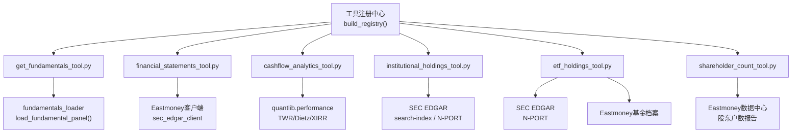
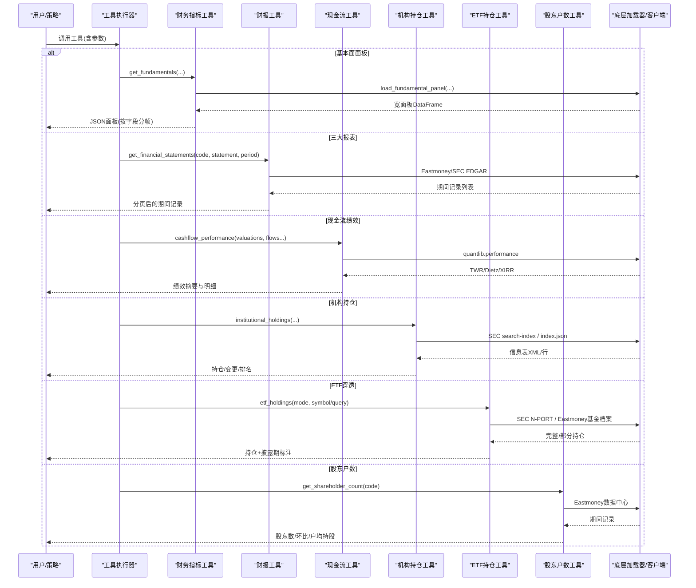
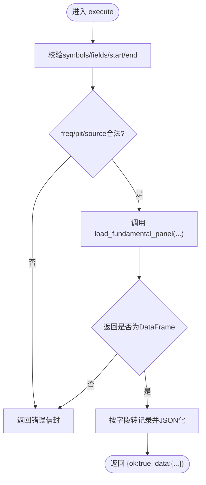
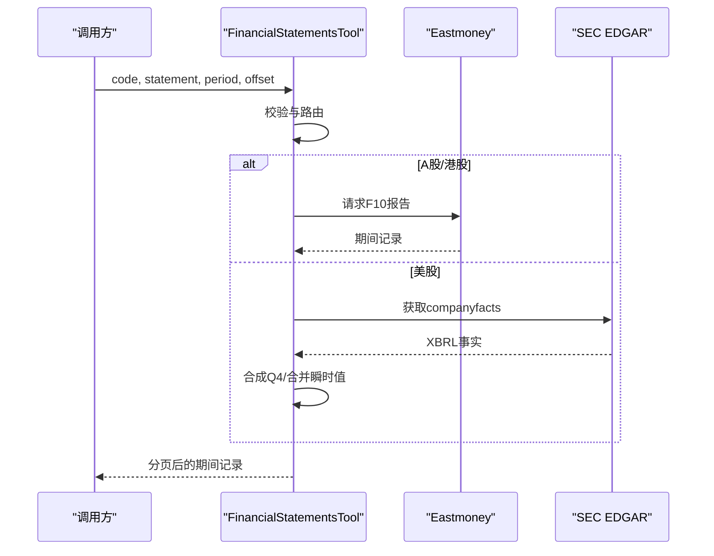
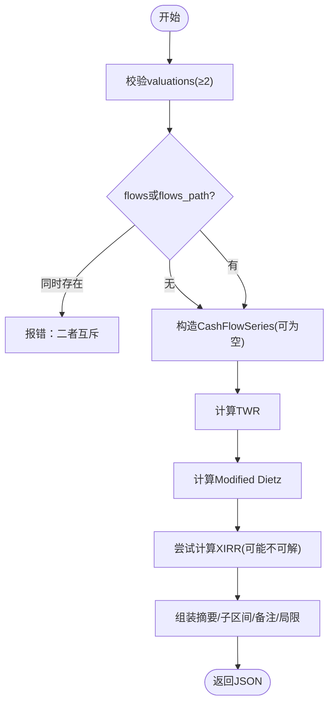
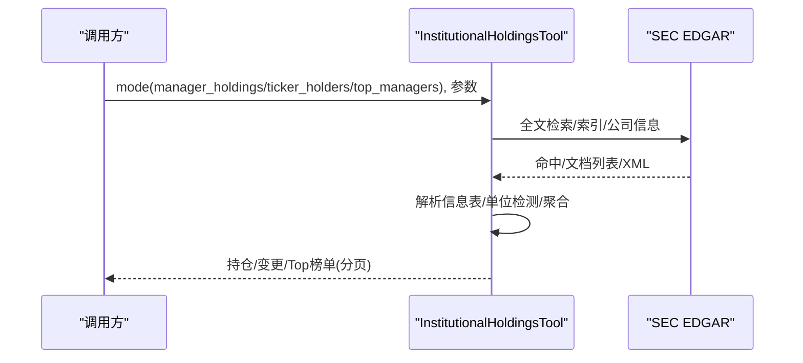
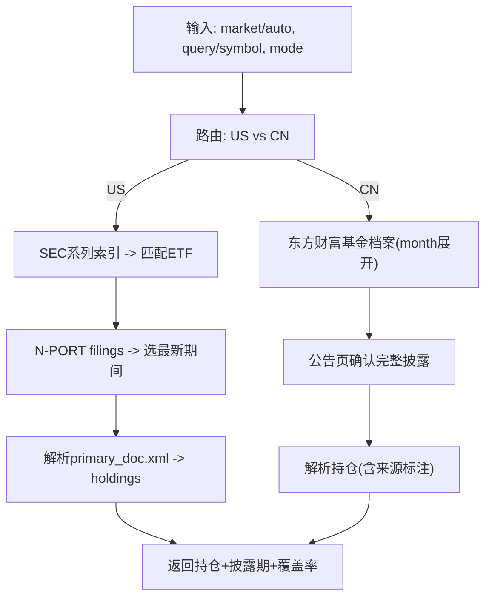
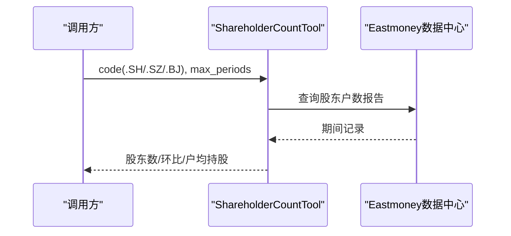
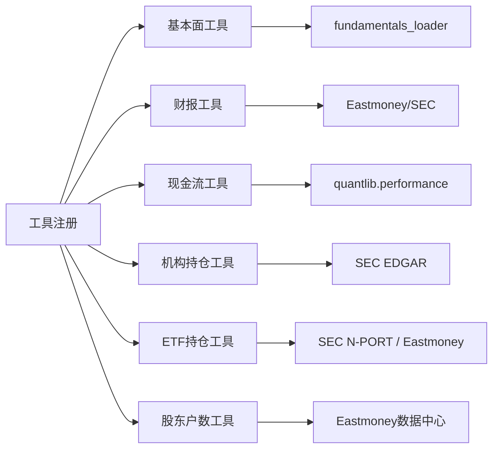

# 金融数据工具

<cite>
**本文引用的文件**
- [agent/src/tools/__init__.py](file://agent/src/tools/__init__.py)
- [agent/src/tools/get_fundamentals_tool.py](file://agent/src/tools/get_fundamentals_tool.py)
- [agent/src/tools/financial_statements_tool.py](file://agent/src/tools/financial_statements_tool.py)
- [agent/src/tools/cashflow_analytics_tool.py](file://agent/src/tools/cashflow_analytics_tool.py)
- [agent/src/tools/institutional_holdings_tool.py](file://agent/src/tools/institutional_holdings_tool.py)
- [agent/src/tools/etf_holdings_tool.py](file://agent/src/tools/etf_holdings_tool.py)
- [agent/src/tools/shareholder_count_tool.py](file://agent/src/tools/shareholder_count_tool.py)
</cite>

## 目录
1. [简介](#简介)
2. [项目结构](#项目结构)
3. [核心组件](#核心组件)
4. [架构总览](#架构总览)
5. [详细组件分析](#详细组件分析)
6. [依赖关系分析](#依赖关系分析)
7. [性能考虑](#性能考虑)
8. [故障排查指南](#故障排查指南)
9. [结论](#结论)
10. [附录：参数与使用示例](#附录参数与使用示例)

## 简介
本文件面向“金融数据工具”的使用者与二次开发者，系统性介绍以下能力：
- 基本面数据获取：财务指标、估值数据、公司基本信息（以统一字段面板形式返回）
- 财务报表分析：三大报表解析、关键指标提取（A股/港股/美股）
- 现金流分析：基于账户净值序列与现金流计算时间加权收益、修正Dietz、XIRR等
- 机构持仓跟踪：SEC 13F 机构持仓、季度对比变化、按标的或管理人维度查询
- ETF持仓分析：美国N-PORT与A股基金档案的穿透式持仓披露
- 股东户数统计：A股定期披露的股东户数、环比变化与户均持股

每个工具提供参数说明、数据源说明、调用流程与使用示例；并给出组合分析方法、数据质量验证与异常处理建议。

## 项目结构
工具通过统一的BaseTool抽象注册到工具注册表，支持自动发现、按需启用与结果分页。各工具独立实现，遵循一致的输入校验、错误封装与JSON输出契约。

图表来源
- [agent/src/tools/__init__.py:66-245](file://agent/src/tools/__init__.py#L66-L245)
- [agent/src/tools/get_fundamentals_tool.py:177-189](file://agent/src/tools/get_fundamentals_tool.py#L177-L189)
- [agent/src/tools/financial_statements_tool.py:249-289](file://agent/src/tools/financial_statements_tool.py#L249-L289)
- [agent/src/tools/cashflow_analytics_tool.py:192-214](file://agent/src/tools/cashflow_analytics_tool.py#L192-L214)
- [agent/src/tools/institutional_holdings_tool.py:236-258](file://agent/src/tools/institutional_holdings_tool.py#L236-L258)
- [agent/src/tools/etf_holdings_tool.py:300-353](file://agent/src/tools/etf_holdings_tool.py#L300-L353)
- [agent/src/tools/shareholder_count_tool.py:100-116](file://agent/src/tools/shareholder_count_tool.py#L100-L116)

章节来源
- [agent/src/tools/__init__.py:1-365](file://agent/src/tools/__init__.py#L1-L365)

## 核心组件
- 工具注册与发现：通过子类扫描与条件过滤构建工具集，支持MCP扩展与沙箱工具开关
- 统一错误信封：所有工具失败时返回结构化JSON，避免上层误判
- 结果分页：对大结果集进行整记录分页，避免截断导致上下文污染
- 市场路由：根据代码后缀或查询特征自动选择数据源（A股/港股/美股）

章节来源
- [agent/src/tools/__init__.py:33-63](file://agent/src/tools/__init__.py#L33-L63)
- [agent/src/tools/__init__.py:66-245](file://agent/src/tools/__init__.py#L66-L245)

## 架构总览
下图展示从工具调用到数据源的端到端流程，强调市场路由、数据源选择与结果封装。

图表来源
- [agent/src/tools/get_fundamentals_tool.py:177-189](file://agent/src/tools/get_fundamentals_tool.py#L177-L189)
- [agent/src/tools/financial_statements_tool.py:644-726](file://agent/src/tools/financial_statements_tool.py#L644-L726)
- [agent/src/tools/cashflow_analytics_tool.py:172-300](file://agent/src/tools/cashflow_analytics_tool.py#L172-L300)
- [agent/src/tools/institutional_holdings_tool.py:236-258](file://agent/src/tools/institutional_holdings_tool.py#L236-L258)
- [agent/src/tools/etf_holdings_tool.py:300-353](file://agent/src/tools/etf_holdings_tool.py#L300-L353)
- [agent/src/tools/shareholder_count_tool.py:100-116](file://agent/src/tools/shareholder_count_tool.py#L100-L116)

## 详细组件分析

### 基本面数据获取工具（财务指标、估值数据、公司基本信息）
- 功能：按交易日对齐的PIT安全基础面宽面板，字段如ROE、毛利率、净利润、摊薄股本等
- 数据源：通过fundamentals_loader统一路由（默认auto，可用sec），仅支持美股符号
- 关键参数
  - symbols: 数组，美股代码（可带或不带.US）
  - fields: 数组，统一字段名
  - start/end: YYYY-MM-DD
  - freq: annual|quarterly|ttm（默认ttm）
  - pit: 是否按申报日对齐（默认True）
  - source: auto|sec
  - index: 可选交易日历索引
- 输出：按字段拆分的宽面板记录，JSON安全序列化

图表来源
- [agent/src/tools/get_fundamentals_tool.py:126-211](file://agent/src/tools/get_fundamentals_tool.py#L126-L211)

章节来源
- [agent/src/tools/get_fundamentals_tool.py:1-211](file://agent/src/tools/get_fundamentals_tool.py#L1-L211)

### 财务报表分析工具（三大报表解析、财务比率计算）
- 功能：拉取单只股票的资产负债表、利润表、现金流量表或关键指标（利润率、ROE、EPS等）
- 数据源
  - A股/港股：东方财富F10数据集
  - 美股：SEC EDGAR companyfacts（XBRL）
- 关键参数
  - code: 带市场后缀的代码（.SH/.SZ/.BJ/.US/.HK）
  - statement: balance|income|cashflow|indicators（默认indicators）
  - period: annual|quarter（默认annual）
  - offset: 分页偏移（新到旧）
- 输出：每期间一行扁平记录，最多限制字段数量，支持分页

图表来源
- [agent/src/tools/financial_statements_tool.py:249-289](file://agent/src/tools/financial_statements_tool.py#L249-L289)
- [agent/src/tools/financial_statements_tool.py:587-662](file://agent/src/tools/financial_statements_tool.py#L587-L662)
- [agent/src/tools/financial_statements_tool.py:644-726](file://agent/src/tools/financial_statements_tool.py#L644-L726)

章节来源
- [agent/src/tools/financial_statements_tool.py:1-726](file://agent/src/tools/financial_statements_tool.py#L1-L726)

### 现金流分析工具（自由现金流、经营现金流分析）
- 功能：基于账户净值序列与外部现金流，计算时间加权收益（TWR）、修正Dietz与货币加权收益（XIRR）
- 输入
  - valuations: 日期-净值序列（至少两笔）
  - flows: 内联现金流或flows_path文件路径（二选一）
  - currency: 币种（当流中未指定时必需）
  - flow_timing: end|start（影响TWR）
  - external_kinds/internal_kinds: 自定义内外流分类
- 输出：TWR、Dietz、XIRR的周期与年化指标，子区间明细与约束说明

图表来源
- [agent/src/tools/cashflow_analytics_tool.py:172-300](file://agent/src/tools/cashflow_analytics_tool.py#L172-L300)
- [agent/src/tools/cashflow_analytics_tool.py:303-400](file://agent/src/tools/cashflow_analytics_tool.py#L303-L400)

章节来源
- [agent/src/tools/cashflow_analytics_tool.py:1-489](file://agent/src/tools/cashflow_analytics_tool.py#L1-L489)

### 机构持仓跟踪工具（基金持仓、北向资金）
- 功能：SEC Form 13F-HR机构持仓查询，支持按管理人、按标的（CUSIP/Ticker）与Top管理人排行；支持季度对比变化
- 数据源：SEC EDGAR全文检索、归档索引、公司信息表；必要时回退至提交索引
- 关键点
  - 单位检测：value列在约2023年起由千美元切换为美元，采用隐含价格中位数判定
  - 修订链：区分原始、重述与新持仓补充
  - 预算保护：XML大小、耗时预算、最大行数限制
- 典型用法：按ticker查持有者、按manager查持仓、按cusip查变动

图表来源
- [agent/src/tools/institutional_holdings_tool.py:236-258](file://agent/src/tools/institutional_holdings_tool.py#L236-L258)
- [agent/src/tools/institutional_holdings_tool.py:536-630](file://agent/src/tools/institutional_holdings_tool.py#L536-L630)
- [agent/src/tools/institutional_holdings_tool.py:720-800](file://agent/src/tools/institutional_holdings_tool.py#L720-L800)

章节来源
- [agent/src/tools/institutional_holdings_tool.py:1-800](file://agent/src/tools/institutional_holdings_tool.py#L1-L800)

### ETF持仓分析工具
- 功能：穿透ETF底层持仓，覆盖美国（SEC N-PORT）与中国A股（东方财富基金档案）
- 数据源
  - 美国：SEC N-PORT-P（primary_doc.xml），按系列ID筛选，按报告期间排序
  - 中国：东方财富基金档案，季度/半年度/年度报告，完整或前十大披露
- 关键点
  - 披露滞后：as_of为报告期末，非当日
  - 中国来源：需Referer；季度披露通常为前十大，半年/年度为完整持仓
  - 美国来源：通过投资公司产品系列索引定位ETF，再拉取N-PORT
- 典型用法：lookup（搜索ETF）、holdings（获取持仓）

图表来源
- [agent/src/tools/etf_holdings_tool.py:300-353](file://agent/src/tools/etf_holdings_tool.py#L300-L353)
- [agent/src/tools/etf_holdings_tool.py:362-500](file://agent/src/tools/etf_holdings_tool.py#L362-L500)
- [agent/src/tools/etf_holdings_tool.py:511-627](file://agent/src/tools/etf_holdings_tool.py#L511-L627)

章节来源
- [agent/src/tools/etf_holdings_tool.py:1-800](file://agent/src/tools/etf_holdings_tool.py#L1-L800)

### 股东户数统计工具
- 功能：A股股东户数、环比变化、户均持股与总市值
- 数据源：东方财富数据中心报告（RPT_HOLDERNUMLATEST）
- 关键点：仅支持A股（.SH/.SZ/.BJ），返回最近若干期

图表来源
- [agent/src/tools/shareholder_count_tool.py:100-116](file://agent/src/tools/shareholder_count_tool.py#L100-L116)
- [agent/src/tools/shareholder_count_tool.py:142-196](file://agent/src/tools/shareholder_count_tool.py#L142-L196)

章节来源
- [agent/src/tools/shareholder_count_tool.py:1-219](file://agent/src/tools/shareholder_count_tool.py#L1-L219)

## 依赖关系分析
- 工具注册层：自动发现与条件注册，屏蔽缺失依赖的工具
- 数据访问层：共享HTTP节流、User-Agent与限流策略（SEC/Eastmoney）
- 计算层：quantlib.performance用于现金流绩效；EDGAR/N-PORT解析
- 结果层：统一JSON信封与分页适配

图表来源
- [agent/src/tools/__init__.py:66-245](file://agent/src/tools/__init__.py#L66-L245)
- [agent/src/tools/get_fundamentals_tool.py:177-189](file://agent/src/tools/get_fundamentals_tool.py#L177-L189)
- [agent/src/tools/financial_statements_tool.py:249-289](file://agent/src/tools/financial_statements_tool.py#L249-L289)
- [agent/src/tools/cashflow_analytics_tool.py:192-214](file://agent/src/tools/cashflow_analytics_tool.py#L192-L214)
- [agent/src/tools/institutional_holdings_tool.py:236-258](file://agent/src/tools/institutional_holdings_tool.py#L236-L258)
- [agent/src/tools/etf_holdings_tool.py:300-353](file://agent/src/tools/etf_holdings_tool.py#L300-L353)
- [agent/src/tools/shareholder_count_tool.py:100-116](file://agent/src/tools/shareholder_count_tool.py#L100-L116)

章节来源
- [agent/src/tools/__init__.py:1-365](file://agent/src/tools/__init__.py#L1-L365)

## 性能考虑
- 结果分页：财报、ETF、机构持仓等工具对大结果集进行整记录分页，避免单次响应过大
- 资源上限：XML大小、查询窗口、最大行数、预算秒数等硬限制，防止长尾拖垮
- 节流与缓存：共享HTTP节流与UA策略，减少被限速概率；部分索引结果进程级缓存
- 计算复杂度：现金流绩效为线性扫描；SEC/东方财富解析为流式/增量处理，内存友好

[本节为通用指导，不直接分析具体文件]

## 故障排查指南
- 常见错误类型
  - 参数非法：缺少必填字段、类型不符、枚举值不在允许范围
  - 市场不支持：例如基本面工具仅支持美股；股东户数仅支持A股
  - 数据源不可用：网络超时、404、无数据、格式异常
  - 结果过大：触发分页或上限，需调整offset或max_periods
- 诊断步骤
  - 检查code后缀与市场路由是否正确
  - 查看返回信封中的error字段与source/market标记
  - 对SEC/Eastmoney相关错误，降低查询规模或延后重试
  - 对现金流工具，确保valuations至少两笔且数值有限
- 恢复策略
  - 使用分页继续拉取剩余期间
  - 放宽period或缩小symbols集合
  - 更换source（如基本面工具auto→sec）
  - 对SEC/东方财富请求增加重试与退避

章节来源
- [agent/src/tools/get_fundamentals_tool.py:126-211](file://agent/src/tools/get_fundamentals_tool.py#L126-L211)
- [agent/src/tools/financial_statements_tool.py:644-726](file://agent/src/tools/financial_statements_tool.py#L644-L726)
- [agent/src/tools/cashflow_analytics_tool.py:172-300](file://agent/src/tools/cashflow_analytics_tool.py#L172-L300)
- [agent/src/tools/institutional_holdings_tool.py:236-258](file://agent/src/tools/institutional_holdings_tool.py#L236-L258)
- [agent/src/tools/etf_holdings_tool.py:300-353](file://agent/src/tools/etf_holdings_tool.py#L300-L353)
- [agent/src/tools/shareholder_count_tool.py:100-116](file://agent/src/tools/shareholder_count_tool.py#L100-L116)

## 结论
该工具集围绕“数据—计算—呈现”三层设计，提供从基本面、财报、现金流到机构与ETF持仓、股东户数的全链路能力。通过统一注册、严格校验、稳定信封与分页机制，既保证易用性也兼顾鲁棒性。建议在研究中将基本面面板与财报指标结合，辅以现金流绩效评估，并用机构与ETF持仓做交叉验证，形成稳健的投资决策支撑。

[本节为总结性内容，不直接分析具体文件]

## 附录：参数与使用示例

### 基本面数据获取（get_fundamentals）
- 参数
  - symbols: ["AAPL", "MSFT.US"]
  - fields: ["roe", "net_income", "shares_diluted"]
  - start: "2023-01-01"
  - end: "2023-12-31"
  - freq: "ttm"（或"annual"/"quarterly"）
  - pit: true
  - source: "auto"（或"sec"）
  - index: 可选交易日历
- 示例
  - 获取美股TTM ROE与净利润面板
  - 切换到annual频率观察年报口径
- 数据源
  - fundamentals_loader（默认auto，可强制sec）

章节来源
- [agent/src/tools/get_fundamentals_tool.py:64-123](file://agent/src/tools/get_fundamentals_tool.py#L64-L123)
- [agent/src/tools/get_fundamentals_tool.py:177-211](file://agent/src/tools/get_fundamentals_tool.py#L177-L211)

### 财务报表（get_financial_statements）
- 参数
  - code: "600519.SH" / "AAPL.US" / "00700.HK"
  - statement: "balance" | "income" | "cashflow" | "indicators"
  - period: "annual" | "quarter"
  - offset: 分页起始位置
- 示例
  - 拉取A股利润表年报
  - 拉取美股资产负债表并分页
- 数据源
  - A股/港股：东方财富F10
  - 美股：SEC EDGAR companyfacts

章节来源
- [agent/src/tools/financial_statements_tool.py:589-642](file://agent/src/tools/financial_statements_tool.py#L589-L642)
- [agent/src/tools/financial_statements_tool.py:644-726](file://agent/src/tools/financial_statements_tool.py#L644-L726)

### 现金流绩效（cashflow_performance）
- 参数
  - valuations: [{"date":"2024-01-01","value":100}, {"date":"2024-06-30","value":110}]
  - flows: [{"date":"2024-03-01","amount":-10,"kind":"contribution","currency":"CNY"}]
  - flows_path: 可选CSV路径（与flows互斥）
  - flow_timing: "end" | "start"
  - external_kinds/internal_kinds: 自定义分类
- 示例
  - 计算半年期TWR与XIRR
  - 通过文件导入大量现金流
- 数据源
  - quantlib.performance（TWR/Dietz/XIRR）

章节来源
- [agent/src/tools/cashflow_analytics_tool.py:40-170](file://agent/src/tools/cashflow_analytics_tool.py#L40-L170)
- [agent/src/tools/cashflow_analytics_tool.py:172-300](file://agent/src/tools/cashflow_analytics_tool.py#L172-L300)

### 机构持仓（institutional_holdings）
- 模式
  - manager_holdings: 按管理人查持仓
  - ticker_holders: 按标的（Ticker/CUSIP）查持有者
  - top_managers: Top管理人排行
- 示例
  - 查询某ETF的主要持有机构
  - 追踪某股票季度持仓变化
- 数据源
  - SEC EDGAR（search-index、index.json、公司信息表）

章节来源
- [agent/src/tools/institutional_holdings_tool.py:132-148](file://agent/src/tools/institutional_holdings_tool.py#L132-L148)
- [agent/src/tools/institutional_holdings_tool.py:236-258](file://agent/src/tools/institutional_holdings_tool.py#L236-L258)

### ETF持仓（etf_holdings）
- 模式
  - lookup: 搜索ETF（支持名称/主题/代码）
  - holdings: 获取持仓（US/A股）
- 示例
  - 搜索半导体主题ETF并获取其持仓
  - 查询沪深300ETF的完整持仓与覆盖率
- 数据源
  - 美国：SEC N-PORT
  - 中国：东方财富基金档案

章节来源
- [agent/src/tools/etf_holdings_tool.py:179-181](file://agent/src/tools/etf_holdings_tool.py#L179-L181)
- [agent/src/tools/etf_holdings_tool.py:300-353](file://agent/src/tools/etf_holdings_tool.py#L300-L353)

### 股东户数（get_shareholder_count）
- 参数
  - code: "600519.SH" / "000001.SZ" / "830799.BJ"
  - max_periods: 1..24（默认24）
- 示例
  - 获取茅台近8期股东户数与环比变化
- 数据源
  - 东方财富数据中心

章节来源
- [agent/src/tools/shareholder_count_tool.py:39-70](file://agent/src/tools/shareholder_count_tool.py#L39-L70)
- [agent/src/tools/shareholder_count_tool.py:100-116](file://agent/src/tools/shareholder_count_tool.py#L100-L116)

### 组合使用建议
- 基本面筛选：用get_fundamentals拉取ROE、净利率等指标，结合get_financial_statements的indicators做交叉验证
- 现金流健康度：用cashflow_performance评估账户真实回报，识别资金进出对收益的影响
- 资金流向验证：用institutional_holdings与etf_holdings观察机构与ETF配置变化，辅助判断趋势
- 微观情绪：用shareholder_count观察A股散户参与度变化，结合财报拐点做决策

[本节为方法论指导，不直接分析具体文件]