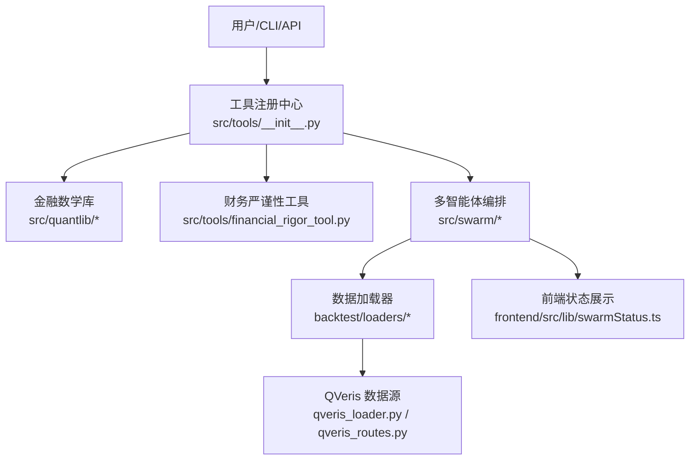
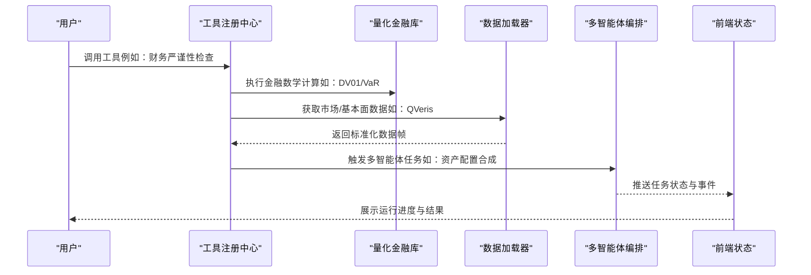
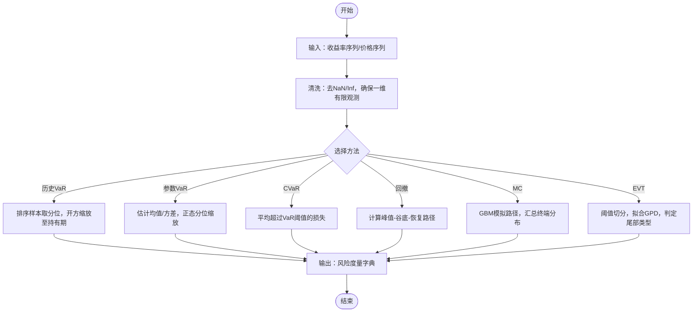
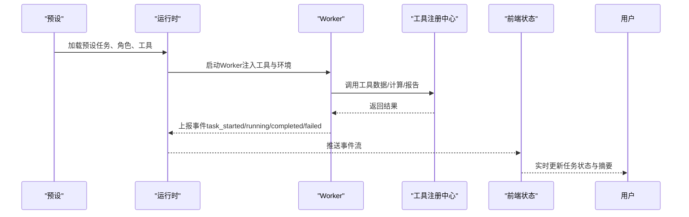
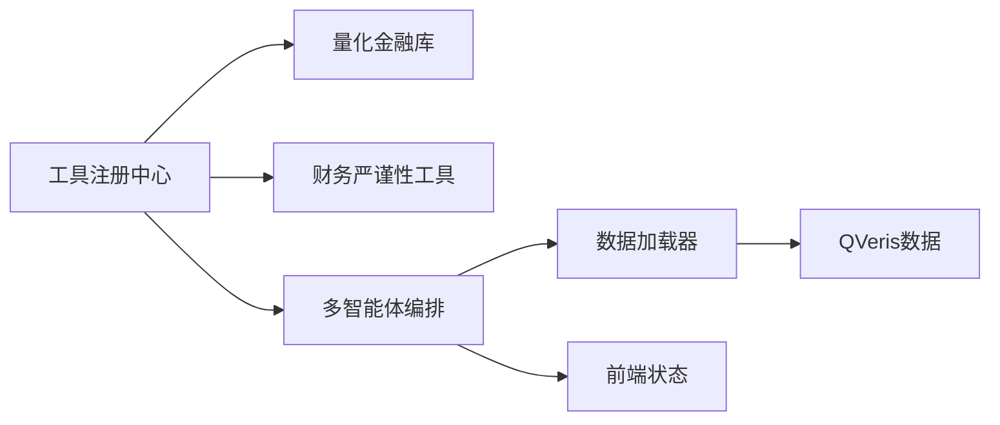

# 高级分析工具

<cite>
**本文引用的文件**
- [README.md](file://README.md)
- [agent/src/quantlib/__init__.py](file://agent/src/quantlib/__init__.py)
- [agent/src/quantlib/fixedincome.py](file://agent/src/quantlib/fixedincome.py)
- [agent/src/quantlib/risk.py](file://agent/src/quantlib/risk.py)
- [agent/src/quantlib/timeseries.py](file://agent/src/quantlib/timeseries.py)
- [agent/src/tools/__init__.py](file://agent/src/tools/__init__.py)
- [agent/src/tools/financial_rigor_tool.py](file://agent/src/tools/financial_rigor_tool.py)
- [agent/src/skills/asset-allocation/SKILL.md](file://agent/src/skills/asset-allocation/SKILL.md)
- [agent/src/skills/quant-statistics/SKILL.md](file://agent/src/skills/quant-statistics/SKILL.md)
- [agent/backtest/loaders/qveris_loader.py](file://agent/backtest/loaders/qveris_loader.py)
- [agent/src/api/qveris_routes.py](file://agent/src/api/qveris_routes.py)
- [agent/src/skills/qveris/SKILL.md](file://agent/src/skills/qveris/SKILL.md)
- [agent/src/swarm/presets/global_equities_desk.yaml](file://agent/src/swarm/presets/global_equities_desk.yaml)
- [agent/src/swarm/presets/macro_rates_fx_desk.yaml](file://agent/src/swarm/presets/macro_rates_fx_desk.yaml)
- [agent/src/swarm/worker.py](file://agent/src/swarm/worker.py)
- [agent/src/swarm/__init__.py](file://agent/src/swarm/__init__.py)
- [frontend/src/lib/swarmStatus.ts](file://frontend/src/lib/swarmStatus.ts)
</cite>

## 目录
1. [简介](#简介)
2. [项目结构](#项目结构)
3. [核心组件](#核心组件)
4. [架构总览](#架构总览)
5. [详细组件分析](#详细组件分析)
6. [依赖关系分析](#依赖关系分析)
7. [性能考量](#性能考量)
8. [故障排查指南](#故障排查指南)
9. [结论](#结论)
10. [附录](#附录)

## 简介
本文件面向“高级分析工具”的构建与使用，覆盖六大能力域：
- 量化金融库工具（固定收益、衍生品定价、风险管理）
- 财务严谨性检查工具（财务造假检测、异常值识别、数据质量验证）
- 假设检验工具（统计检验、回归分析、时间序列分析）
- 目标规划工具（投资目标设定、资产配置优化）
- 智能代理协作工具（多Agent工作流、任务分配、结果整合）
- QVeris数据工具（高质量金融数据、ESG分析、另类数据）

文档以仓库中的可执行实现为依据，提供数学原理、算法要点、调用路径与使用示例说明，并给出如何组合这些模块构建复杂量化分析框架（含模型验证与回测优化）的实践建议。

## 项目结构
本项目将“金融数学”“工具注册”“技能规范”“多智能体编排”“数据加载”等能力分层组织：
- 金融数学层：src/quantlib 提供经过测试的金融数学原语（固定收益、风险度量、时间序列等），被上层工具与引擎复用。
- 工具层：src/tools 通过自动发现机制注册工具；其中包含财务严谨性检查工具等。
- 技能层：skills 提供领域知识、流程与最佳实践（如资产配置、统计检验）。
- 多智能体层：swarm 提供多Agent工作流、任务编排与状态管理。
- 数据层：backtest/loaders 提供统一的数据加载接口，包括QVeris等数据源。
- 前端状态：frontend 提供多智能体运行状态的可视化与事件处理。

图表来源
- [agent/src/tools/__init__.py:66-245](file://agent/src/tools/__init__.py#L66-L245)
- [agent/src/quantlib/__init__.py:1-38](file://agent/src/quantlib/__init__.py#L1-L38)
- [agent/backtest/loaders/qveris_loader.py](file://agent/backtest/loaders/qveris_loader.py)
- [agent/src/api/qveris_routes.py](file://agent/src/api/qveris_routes.py)
- [frontend/src/lib/swarmStatus.ts:121-290](file://frontend/src/lib/swarmStatus.ts#L121-L290)

章节来源
- [agent/src/tools/__init__.py:66-245](file://agent/src/tools/__init__.py#L66-L245)
- [agent/src/quantlib/__init__.py:1-38](file://agent/src/quantlib/__init__.py#L1-L38)

## 核心组件
- 量化金融库（QuantLib）
  - 固定收益：日计数、应计利息、债券现金流、YTM求解、久期/凸性/DV01、收益率曲线拟合（Nelson-Siegel/Svensson）。
  - 风险管理：历史VaR/CVaR、参数VaR、最大回撤分析、蒙特卡洛模拟、极值理论（GPD）尾部拟合。
  - 时间序列：单位根检验、协整、Granger因果、异方差检验等。
- 财务严谨性检查工具
  - 支持市值校验、估值指标校验、跨源一致性校验、本福特定律造假检测、安全算术计算、三情景定价等。
- 假设检验与时间序列分析
  - 基于statsmodels的ADF、Granger、White/Breusch-Pagan异方差检验等，配合技能文档提供决策规则与输出模板。
- 目标规划与资产配置
  - 现代投资组合理论、Black-Litterman、风险预算、全天候策略；内置五种优化器（等波动率、风险平价、均值-方差、最大分散化、换手率感知）。
- 多智能体协作
  - 预设驱动的多Agent工作流（全球股票桌面、宏观利率外汇桌面），任务DAG、重试隔离、事件流与前端状态同步。
- QVeris数据工具
  - 通过加载器与API路由接入QVeris数据服务，支持分钟级粒度与令牌控制，结合技能文档进行ESG与另类数据分析。

章节来源
- [agent/src/quantlib/fixedincome.py:1-795](file://agent/src/quantlib/fixedincome.py#L1-L795)
- [agent/src/quantlib/risk.py:1-512](file://agent/src/quantlib/risk.py#L1-L512)
- [agent/src/quantlib/timeseries.py:604-634](file://agent/src/quantlib/timeseries.py#L604-L634)
- [agent/src/tools/financial_rigor_tool.py:444-470](file://agent/src/tools/financial_rigor_tool.py#L444-L470)
- [agent/src/skills/asset-allocation/SKILL.md:1-306](file://agent/src/skills/asset-allocation/SKILL.md#L1-L306)
- [agent/src/skills/quant-statistics/SKILL.md:27-360](file://agent/src/skills/quant-statistics/SKILL.md#L27-L360)
- [agent/src/swarm/presets/global_equities_desk.yaml:172-210](file://agent/src/swarm/presets/global_equities_desk.yaml#L172-L210)
- [agent/src/swarm/presets/macro_rates_fx_desk.yaml:137-159](file://agent/src/swarm/presets/macro_rates_fx_desk.yaml#L137-L159)
- [agent/backtest/loaders/qveris_loader.py](file://agent/backtest/loaders/qveris_loader.py)
- [agent/src/api/qveris_routes.py](file://agent/src/api/qveris_routes.py)

## 架构总览
系统以“工具注册中心”为枢纽，向上暴露CLI/API/MCP入口，向下连接金融数学库、数据加载器与多智能体编排。前端负责多智能体运行状态的事件接收与渲染。

图表来源
- [agent/src/tools/__init__.py:66-245](file://agent/src/tools/__init__.py#L66-L245)
- [agent/src/quantlib/fixedincome.py:505-537](file://agent/src/quantlib/fixedincome.py#L505-L537)
- [agent/src/quantlib/risk.py:146-251](file://agent/src/quantlib/risk.py#L146-L251)
- [agent/backtest/loaders/qveris_loader.py](file://agent/backtest/loaders/qveris_loader.py)
- [agent/src/swarm/worker.py:398-421](file://agent/src/swarm/worker.py#L398-L421)
- [frontend/src/lib/swarmStatus.ts:121-290](file://frontend/src/lib/swarmStatus.ts#L121-L290)

## 详细组件分析

### 量化金融库（固定收益、衍生品、风险管理）
- 固定收益
  - 日计数与应计利息：支持ACT/365F、ACT/360、ACT/ACT、30/360、30E/360等惯例，精确计算折现因子与应计利息。
  - 债券定价与YTM：现金流生成、离散/连续复利、Brent求根反解YTM。
  - 风险敏感度：Macaulay/Modified Duration、Convexity、DV01、有效久期（适用于含权债）。
  - 收益率曲线拟合：Nelson-Siegel与Svensson模型，网格+非线性优化，返回可调用CurveFit对象。
- 风险管理
  - VaR/CVaR：历史与参数方法，严格置信度与持有期校验，保证CVaR≥VaR。
  - 最大回撤：定位峰值、谷底、恢复点与日历天数。
  - 蒙特卡洛：GBM路径模拟与终端分布汇总（均值、中位数、VaR/CVaR、损失概率等）。
  - 极值理论：POT方法拟合GPD尾部，形状参数显著性判断尾部分布类型。
- 时间序列
  - 单位根、协整、Granger因果、异方差检验（White/Breusch-Pagan），提供稳健标准误建议（HAC）。

图表来源
- [agent/src/quantlib/risk.py:76-143](file://agent/src/quantlib/risk.py#L76-L143)
- [agent/src/quantlib/risk.py:146-251](file://agent/src/quantlib/risk.py#L146-L251)
- [agent/src/quantlib/risk.py:441-517](file://agent/src/quantlib/risk.py#L441-L517)
- [agent/src/quantlib/risk.py:520-618](file://agent/src/quantlib/risk.py#L520-L618)
- [agent/src/quantlib/risk.py:621-702](file://agent/src/quantlib/risk.py#L621-L702)

章节来源
- [agent/src/quantlib/fixedincome.py:70-186](file://agent/src/quantlib/fixedincome.py#L70-L186)
- [agent/src/quantlib/fixedincome.py:266-341](file://agent/src/quantlib/fixedincome.py#L266-L341)
- [agent/src/quantlib/fixedincome.py:344-504](file://agent/src/quantlib/fixedincome.py#L344-L504)
- [agent/src/quantlib/fixedincome.py:549-795](file://agent/src/quantlib/fixedincome.py#L549-L795)
- [agent/src/quantlib/risk.py:142-512](file://agent/src/quantlib/risk.py#L142-L512)
- [agent/src/quantlib/timeseries.py:616-634](file://agent/src/quantlib/timeseries.py#L616-L634)

### 财务严谨性检查工具
- 功能要点
  - 市值校验：价格×股数 vs 报告市值，按1%/5%阈值判定。
  - 估值校验：PE/PB/ROE/P-FCF/收益率/PS等从每股输入推导。
  - 跨源一致性：同一字段多源对比，超差标记并给出共识中位数。
  - 本福特定律：样本量≥50时进行首数字分布检验，提示潜在造假。
  - 安全算术：表达式字符串精确计算，避免浮点漂移。
  - 三情景定价：基于EPS增长与目标PE假设推演牛/基/熊目标价。
- 使用方式
  - 通过工具注册中心调用，参数包含command与相应数值字段。
  - 适合与行情/财报工具搭配：先拉取数据，再在此工具中进行严谨性校验。

章节来源
- [agent/src/tools/financial_rigor_tool.py:444-470](file://agent/src/tools/financial_rigor_tool.py#L444-L470)
- [agent/src/tools/__init__.py:66-245](file://agent/src/tools/__init__.py#L66-L245)

### 假设检验工具（统计检验、回归分析、时间序列分析）
- 统计检验
  - ADF单位根检验：判断平稳性，指导差分或协整处理。
  - Granger因果：预测性因果关系（非结构性因果），注意多重检验问题。
  - 异方差检验：White与Breusch-Pagan，通常采用HAC标准误。
- 回归诊断
  - 残差异方差检测与建议修正（如HAC）。
- 输出模板
  - 技能文档提供表格化输出格式与决策规则，便于直接写入研究报告。

章节来源
- [agent/src/skills/quant-statistics/SKILL.md:27-129](file://agent/src/skills/quant-statistics/SKILL.md#L27-L129)
- [agent/src/skills/quant-statistics/SKILL.md:302-360](file://agent/src/skills/quant-statistics/SKILL.md#L302-L360)
- [agent/src/quantlib/timeseries.py:616-634](file://agent/src/quantlib/timeseries.py#L616-L634)

### 目标规划工具（投资目标设定、资产配置优化）
- 理论框架
  - 现代投资组合理论（MPT）、Black-Litterman、风险预算、全天候策略。
- 内置优化器
  - 等波动率、风险平价、均值-方差、最大分散化、换手率感知（对交易成本敏感）。
- 配置与输出
  - 通过config.json配置optimizer与optimizer_params，输出包含权重、风险贡献、预期收益/波动、最大回撤与调仓规则。

章节来源
- [agent/src/skills/asset-allocation/SKILL.md:1-306](file://agent/src/skills/asset-allocation/SKILL.md#L1-L306)

### 智能代理协作工具（多Agent工作流、任务分配、结果整合）
- 工作流编排
  - 预设驱动（global_equities_desk、macro_rates_fx_desk），定义角色、工具、技能、迭代与超时。
  - 任务DAG：上游任务完成后下游任务执行，支持input_from传递上下文。
- 执行与容错
  - Worker重试、工件隔离、事件回调；失败阻断下游任务。
- 前端状态
  - 事件映射与状态更新，展示等待/运行/完成/失败/阻塞/重试等状态。

图表来源
- [agent/src/swarm/presets/global_equities_desk.yaml:172-210](file://agent/src/swarm/presets/global_equities_desk.yaml#L172-L210)
- [agent/src/swarm/presets/macro_rates_fx_desk.yaml:137-159](file://agent/src/swarm/presets/macro_rates_fx_desk.yaml#L137-L159)
- [agent/src/swarm/worker.py:398-421](file://agent/src/swarm/worker.py#L398-L421)
- [agent/src/tools/__init__.py:66-245](file://agent/src/tools/__init__.py#L66-L245)
- [frontend/src/lib/swarmStatus.ts:121-290](file://frontend/src/lib/swarmStatus.ts#L121-L290)

章节来源
- [agent/src/swarm/__init__.py:1-34](file://agent/src/swarm/__init__.py#L1-L34)
- [agent/src/swarm/worker.py:398-421](file://agent/src/swarm/worker.py#L398-L421)
- [agent/src/swarm/presets/global_equities_desk.yaml:172-210](file://agent/src/swarm/presets/global_equities_desk.yaml#L172-L210)
- [agent/src/swarm/presets/macro_rates_fx_desk.yaml:137-159](file://agent/src/swarm/presets/macro_rates_fx_desk.yaml#L137-L159)
- [frontend/src/lib/swarmStatus.ts:121-290](file://frontend/src/lib/swarmStatus.ts#L121-L290)

### QVeris数据工具（高质量金融数据、ESG分析、另类数据）
- 数据接入
  - 加载器：统一OHLCV/基本面数据接口，支持分钟级粒度与令牌限制。
  - API路由：REST端点暴露QVeris能力，供CLI/UI/MCP调用。
- 使用场景
  - ESG分析与另类数据研究：结合技能文档进行数据筛选、特征工程与信号构建。
  - 与多智能体协作：在预设中作为数据源，支撑资产研究与策略验证。

章节来源
- [agent/backtest/loaders/qveris_loader.py](file://agent/backtest/loaders/qveris_loader.py)
- [agent/src/api/qveris_routes.py](file://agent/src/api/qveris_routes.py)
- [agent/src/skills/qveris/SKILL.md](file://agent/src/skills/qveris/SKILL.md)

## 依赖关系分析
- 工具注册中心依赖
  - 自动发现BaseTool子类，支持MCP远程工具合并，屏蔽不可用依赖。
- 量化金融库依赖
  - 固定收益与风险模块依赖numpy/scipy/statsmodels等科学计算库。
- 多智能体依赖
  - Worker通过工具注册中心获取可用工具；前端通过事件流更新状态。
- 数据加载器依赖
  - QVeris加载器与API路由协同，提供稳定数据供给。

图表来源
- [agent/src/tools/__init__.py:66-245](file://agent/src/tools/__init__.py#L66-L245)
- [agent/src/quantlib/__init__.py:1-38](file://agent/src/quantlib/__init__.py#L1-L38)
- [agent/backtest/loaders/qveris_loader.py](file://agent/backtest/loaders/qveris_loader.py)
- [agent/src/swarm/worker.py:398-421](file://agent/src/swarm/worker.py#L398-L421)
- [frontend/src/lib/swarmStatus.ts:121-290](file://frontend/src/lib/swarmStatus.ts#L121-L290)

章节来源
- [agent/src/tools/__init__.py:66-245](file://agent/src/tools/__init__.py#L66-L245)
- [agent/src/quantlib/__init__.py:1-38](file://agent/src/quantlib/__init__.py#L1-L38)

## 性能考量
- 向量化与快速路径
  - 风险度量与时间序列计算优先使用NumPy/Pandas高效路径，减少Python循环。
- 缓存与批处理
  - 数据加载器支持批量下载与缓存命中，避免重复网络请求与连接开销。
- 并行与重试
  - 多智能体Worker支持重试与工件隔离，提升鲁棒性与吞吐。
- 精度与稳定性
  - 固定收益模块显式日计数与复利约定，避免隐式假设导致的误差；风险度量保证CVaR≥VaR的单调性。

[本节提供通用指导，不直接分析具体文件]

## 故障排查指南
- 工具不可用或依赖缺失
  - 工具注册中心会跳过不可用工具并记录警告；检查可选依赖是否安装。
- 数据源异常
  - QVeris加载器与API路由需正确配置令牌与速率限制；若返回空或错误，检查网络与认证。
- 多智能体失败
  - Worker事件显示失败原因；查看任务工件与日志，确认上游任务是否成功。
- 金融计算异常
  - 固定收益与风险模块对输入有严格校验（如面值为正、置信度范围、持有期≥1）；根据异常信息调整输入。

章节来源
- [agent/src/tools/__init__.py:136-153](file://agent/src/tools/__init__.py#L136-L153)
- [agent/src/quantlib/fixedincome.py:211-228](file://agent/src/quantlib/fixedincome.py#L211-L228)
- [agent/src/quantlib/risk.py:76-143](file://agent/src/quantlib/risk.py#L76-L143)
- [agent/src/swarm/worker.py:398-421](file://agent/src/swarm/worker.py#L398-L421)

## 结论
本项目将“金融数学”“工具”“技能”“多智能体”“数据加载”有机整合，形成可扩展的高级分析框架。通过严格的数学实现、稳健的工具注册与编排机制，以及高质量数据接入，用户可构建从因子研究、资产配置到风险管理的完整量化工作流。建议在实践中：
- 使用量化金融库进行严谨的定价与风险分析。
- 借助财务严谨性工具保障数据与结论的可信度。
- 利用多智能体预设编排复杂研究任务，并通过前端状态实时跟踪。
- 结合QVeris等数据源扩展ESG与另类数据能力。
- 在回测与优化中重视过拟合控制、多重检验校正与稳健性检验。

[本节总结性内容，不直接分析具体文件]

## 附录
- 快速上手建议
  - 从技能文档入手，理解各工具的输入输出与决策规则。
  - 通过工具注册中心调用所需工具，必要时组合多智能体预设完成端到端任务。
  - 使用量化金融库进行独立计算验证，确保结果可复现与可审计。
- 参考与扩展
  - README记录了持续演进的功能与修复，关注新版本的能力增强与正确性改进。

章节来源
- [README.md:1-166](file://README.md#L1-L166)