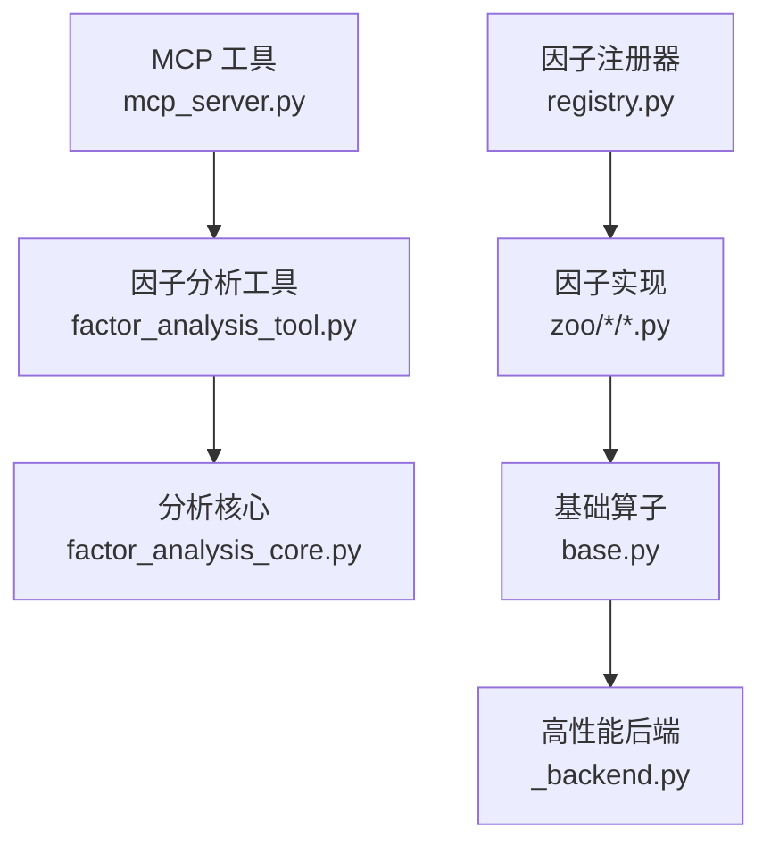
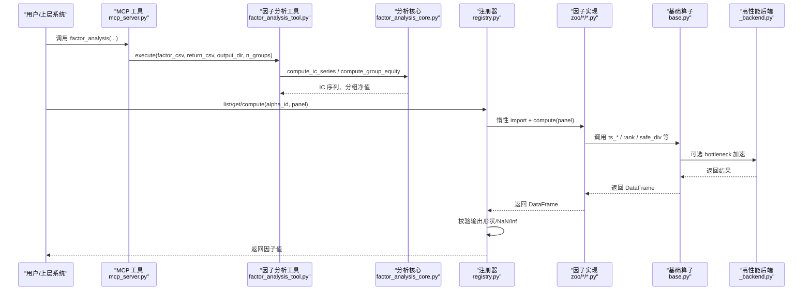
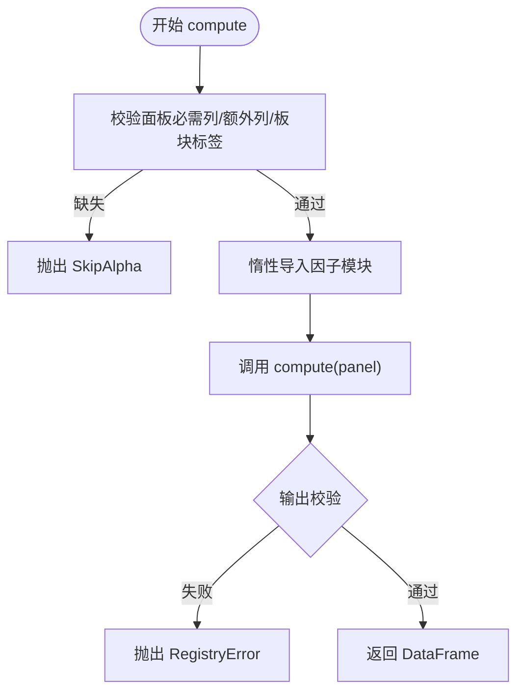
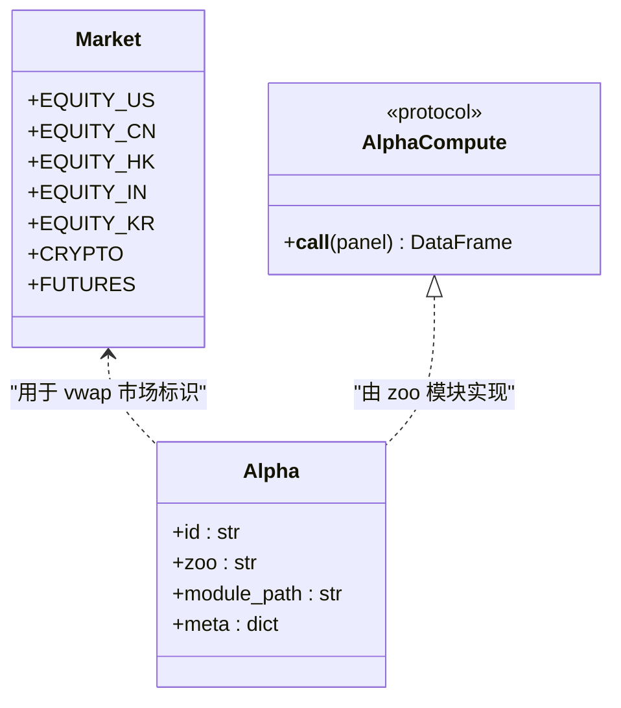
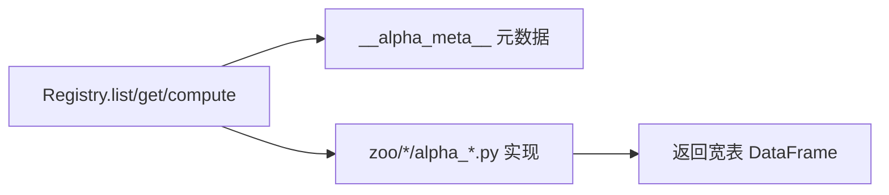
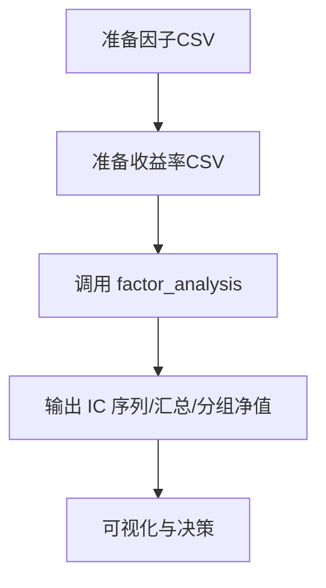
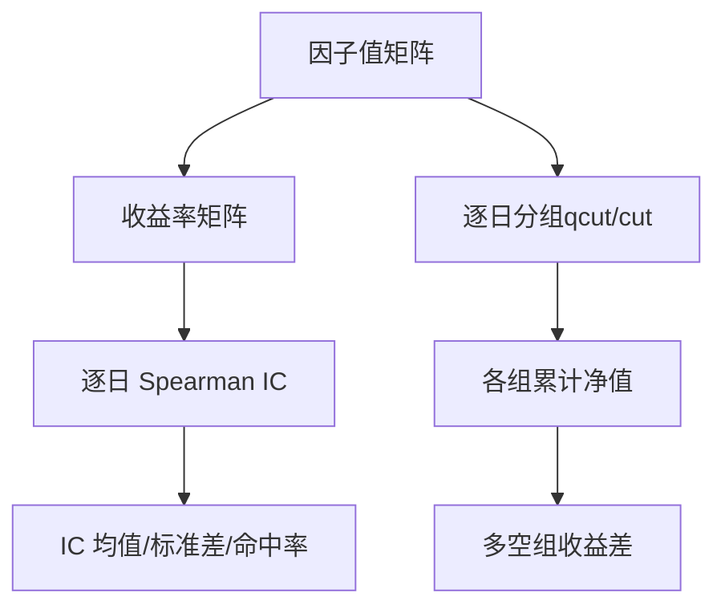
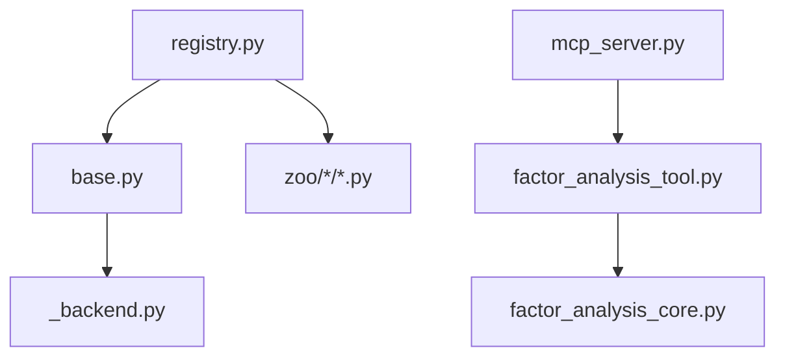

# 因子分析工具

<cite>
**本文引用的文件**
- [agent/src/factors/__init__.py](file://agent/src/factors/__init__.py)
- [agent/src/factors/base.py](file://agent/src/factors/base.py)
- [agent/src/factors/registry.py](file://agent/src/factors/registry.py)
- [agent/src/factors/_backend.py](file://agent/src/factors/_backend.py)
- [agent/src/factors/factor_analysis_core.py](file://agent/src/factors/factor_analysis_core.py)
- [agent/src/tools/factor_analysis_tool.py](file://agent/src/tools/factor_analysis_tool.py)
- [agent/mcp_server.py](file://agent/mcp_server.py)
- [agent/src/skills/factor-research/SKILL.md](file://agent/src/skills/factor-research/SKILL.md)
- [agent/src/factors/zoo/alpha101/alpha_001.py](file://agent/src/factors/zoo/alpha101/alpha_001.py)
- [agent/src/factors/zoo/gtja191/alpha_001.py](file://agent/src/factors/zoo/gtja191/alpha_001.py)
- [agent/src/factors/zoo/qlib158/beta10.py](file://agent/src/factors/zoo/qlib158/beta10.py)
- [agent/tests/test_factor_operators.py](file://agent/tests/test_factor_operators.py)
</cite>

## 目录
1. [简介](#简介)
2. [项目结构](#项目结构)
3. [核心组件](#核心组件)
4. [架构总览](#架构总览)
5. [详细组件分析](#详细组件分析)
6. [依赖关系分析](#依赖关系分析)
7. [性能考量](#性能考量)
8. [故障排查指南](#故障排查指南)
9. [结论](#结论)
10. [附录](#附录)

## 简介
本工具提供面向横截面多资产的因子研究能力，内置 460+ 学术因子库（Alpha101、GTJA191、Qlib158、Academic、Fundamental），并提供统一的因子计算引擎、注册发现机制与标准化输出。同时提供因子有效性检验（IC/IR、分层回测、相关性）与组合优化建议，覆盖从数据准备到结果可视化的完整工作流。

## 项目结构
- 因子算子与基础：base.py 提供时间序列与横截面算子（如 rank、ts_mean、ts_corr、vwap 等），并定义 Alpha、Market、AlphaCompute 协议。
- 因子注册与发现：registry.py 通过 AST 扫描 zoo 目录，解析每个因子的元数据 __alpha_meta__，惰性加载 compute 模块并执行，严格校验输入面板列与输出形状、NaN/Inf 比例。
- 高性能后端：_backend.py 懒加载 bottleneck 加速 move_argmax/move_argmin；若不可用或禁用则回退至 pandas rolling.apply，保证等价性。
- 因子分析核心：factor_analysis_core.py 提供 IC 序列与分层净值曲线计算。
- 工具入口：tools/factor_analysis_tool.py 暴露 factor_analysis 工具；mcp_server.py 将其挂载为 MCP 工具。
- 因子库示例：zoo/alpha101、zoo/gtja191、zoo/qlib158 等目录下每个因子以独立 .py 实现，包含 __alpha_meta__ 与 compute(panel)。

**图示来源**
- [agent/mcp_server.py:823-862](file://agent/mcp_server.py#L823-L862)
- [agent/src/tools/factor_analysis_tool.py:108-151](file://agent/src/tools/factor_analysis_tool.py#L108-L151)
- [agent/src/factors/factor_analysis_core.py:1-103](file://agent/src/factors/factor_analysis_core.py#L1-L103)
- [agent/src/factors/registry.py:201-397](file://agent/src/factors/registry.py#L201-L397)
- [agent/src/factors/base.py:1-356](file://agent/src/factors/base.py#L1-L356)
- [agent/src/factors/_backend.py:1-69](file://agent/src/factors/_backend.py#L1-L69)

**章节来源**
- [agent/src/factors/__init__.py:1-49](file://agent/src/factors/__init__.py#L1-L49)
- [agent/src/factors/base.py:1-356](file://agent/src/factors/base.py#L1-L356)
- [agent/src/factors/registry.py:1-454](file://agent/src/factors/registry.py#L1-L454)
- [agent/src/factors/_backend.py:1-69](file://agent/src/factors/_backend.py#L1-L69)
- [agent/src/factors/factor_analysis_core.py:1-103](file://agent/src/factors/factor_analysis_core.py#L1-L103)
- [agent/src/tools/factor_analysis_tool.py:108-151](file://agent/src/tools/factor_analysis_tool.py#L108-L151)
- [agent/mcp_server.py:823-862](file://agent/mcp_server.py#L823-L862)

## 核心组件
- 因子算子层：提供跨截面与时间序列算子，统一 NaN 传播策略，禁止前视偏差（delta 的 lag≥1）。
- 注册发现层：AST 静态解析 __alpha_meta__，校验字段、主题、市场、频率、最小预热期等；compute 时惰性导入模块，执行后做输出形状与数值健康检查。
- 分析核心层：Spearman IC 序列、分组等权累计净值曲线，支持最少有效样本过滤。
- 工具层：将 CSV 输入（因子值、收益率）转换为分析结果（IC 序列、汇总统计、分组净值）。

**章节来源**
- [agent/src/factors/base.py:1-356](file://agent/src/factors/base.py#L1-L356)
- [agent/src/factors/registry.py:87-125](file://agent/src/factors/registry.py#L87-L125)
- [agent/src/factors/registry.py:321-397](file://agent/src/factors/registry.py#L321-L397)
- [agent/src/factors/factor_analysis_core.py:8-47](file://agent/src/factors/factor_analysis_core.py#L8-L47)
- [agent/src/factors/factor_analysis_core.py:50-103](file://agent/src/factors/factor_analysis_core.py#L50-L103)
- [agent/src/tools/factor_analysis_tool.py:108-151](file://agent/src/tools/factor_analysis_tool.py#L108-L151)

## 架构总览
下图展示从调用方到因子计算与验证的端到端流程。

**图示来源**
- [agent/mcp_server.py:823-862](file://agent/mcp_server.py#L823-L862)
- [agent/src/tools/factor_analysis_tool.py:108-151](file://agent/src/tools/factor_analysis_tool.py#L108-L151)
- [agent/src/factors/factor_analysis_core.py:8-103](file://agent/src/factors/factor_analysis_core.py#L8-L103)
- [agent/src/factors/registry.py:321-397](file://agent/src/factors/registry.py#L321-L397)
- [agent/src/factors/base.py:62-356](file://agent/src/factors/base.py#L62-L356)
- [agent/src/factors/_backend.py:36-69](file://agent/src/factors/_backend.py#L36-L69)

## 详细组件分析

### 因子计算引擎（注册器与惰性加载）
- 扫描 zoo 目录，AST 解析每个因子的 __alpha_meta__，构建 Alpha 句柄并缓存。
- 对外提供 list/get/compute/export_manifest/health 等方法；compute 时先校验面板必需列与额外列，再惰性导入模块并调用 compute(panel)，最后进行输出健康检查（形状一致、无 ±inf、NaN 比例阈值）。
- 支持按 zoo/theme/universe 过滤列表。

**图示来源**
- [agent/src/factors/registry.py:321-397](file://agent/src/factors/registry.py#L321-L397)

**章节来源**
- [agent/src/factors/registry.py:201-397](file://agent/src/factors/registry.py#L201-L397)

### 基础算子与数据处理
- 横截面算子：rank（行内百分位排名）、zscore（行内 Z 分数）、scale（L1 归一化）。
- 时间序列算子：ts_mean/ts_std/ts_max/ts_min/ts_corr/ts_cov/delta/decay_linear/ts_rank/ts_argmax/ts_argmin/vwap。
- NaN 策略：所有算子传播 NaN；常数窗口相关/协方差返回 NaN；safe_div 在分母为 0 或 NaN 时返回 NaN，避免 inf。
- vwap：按市场选择不同参考价公式（A 股金额/成交量缩放、美股/港股/期货典型价、加密货币优先使用 vwap 列）。

**图示来源**
- [agent/src/factors/base.py:44-70](file://agent/src/factors/base.py#L44-L70)
- [agent/src/factors/base.py:365-399](file://agent/src/factors/base.py#L365-L399)

**章节来源**
- [agent/src/factors/base.py:56-356](file://agent/src/factors/base.py#L56-L356)

### 因子库使用与参数配置（Alpha101/GTJA191/Qlib158/Academic/Fundamental）
- 每个因子文件包含 __alpha_meta__ 描述 id、主题、所需列、适用市场、频率、衰减期、最小预热期等。
- 通过 registry.list(zoo/theme/universe) 筛选可用因子；registry.get(id) 获取句柄；registry.compute(id, panel) 计算因子值。
- 示例因子：
  - Alpha101 #1：基于收益条件波动与价格的时间序列动量，需 close。
  - GTJA191 #1：成交量对数变化排名与日内收益排名的负相关，需 volume/close/open。
  - Qlib158 Beta10：close 的 10 日相对变化，需 close。

**图示来源**
- [agent/src/factors/registry.py:264-355](file://agent/src/factors/registry.py#L264-L355)
- [agent/src/factors/zoo/alpha101/alpha_001.py:38-64](file://agent/src/factors/zoo/alpha101/alpha_001.py#L38-L64)
- [agent/src/factors/zoo/gtja191/alpha_001.py:34-54](file://agent/src/factors/zoo/gtja191/alpha_001.py#L34-L54)
- [agent/src/factors/zoo/qlib158/beta10.py:14-29](file://agent/src/factors/zoo/qlib158/beta10.py#L14-L29)

**章节来源**
- [agent/src/factors/zoo/alpha101/alpha_001.py:1-65](file://agent/src/factors/zoo/alpha101/alpha_001.py#L1-L65)
- [agent/src/factors/zoo/gtja191/alpha_001.py:1-55](file://agent/src/factors/zoo/gtja191/alpha_001.py#L1-L55)
- [agent/src/factors/zoo/qlib158/beta10.py:1-30](file://agent/src/factors/zoo/qlib158/beta10.py#L1-L30)

### 自定义因子开发指南
- 继承/实现约定：在 zoo/<zoo>/ 下新增 alpha_xxx.py，定义 __alpha_meta__ 与 compute(panel) -> pd.DataFrame。
- 面板契约：输入为 dict[str, pd.DataFrame]，键名受限于价格列与 fund: 前缀的基本面列；输出必须与 close 同形，禁止 ±inf，NaN 比例不得过高。
- 计算方法实现：优先使用 base 提供的算子（ts_*、rank、safe_div、vwap 等），遵循 NaN 传播与前视禁止原则。
- 性能优化：利用 _backend 的 bottleneck 路径（move_argmax/move_argmin）；必要时使用滑动窗口视图与向量化操作。
- 测试建议：参考 test_factor_operators.py 的等价性测试思路，确保 fast path 与 fallback 结果一致。

**章节来源**
- [agent/src/factors/registry.py:69-125](file://agent/src/factors/registry.py#L69-L125)
- [agent/src/factors/registry.py:321-397](file://agent/src/factors/registry.py#L321-L397)
- [agent/src/factors/base.py:56-356](file://agent/src/factors/base.py#L56-L356)
- [agent/src/factors/_backend.py:1-69](file://agent/src/factors/_backend.py#L1-L69)
- [agent/tests/test_factor_operators.py:1-299](file://agent/tests/test_factor_operators.py#L1-L299)

### 因子分析工作流程（数据准备→结果可视化）
- 步骤：
  1) 计算因子值：生成宽表 CSV（index=date，columns=codes）。
  2) 计算收益率：生成同结构的 forward returns CSV。
  3) 调用 factor_analysis 工具：传入 factor_csv、return_csv、output_dir、n_groups。
  4) 解读结果：基于 IC/IR、分层净值曲线判断因子有效性，并进行因子筛选与组合。
- 关键约束：因子与收益的日期与标的必须对齐；收益必须是观察日之后的前向收益，避免前视偏差。

**图示来源**
- [agent/src/skills/factor-research/SKILL.md:19-36](file://agent/src/skills/factor-research/SKILL.md#L19-L36)
- [agent/src/tools/factor_analysis_tool.py:108-151](file://agent/src/tools/factor_analysis_tool.py#L108-L151)
- [agent/mcp_server.py:823-862](file://agent/mcp_server.py#L823-L862)

**章节来源**
- [agent/src/skills/factor-research/SKILL.md:1-36](file://agent/src/skills/factor-research/SKILL.md#L1-L36)
- [agent/src/tools/factor_analysis_tool.py:108-151](file://agent/src/tools/factor_analysis_tool.py#L108-L151)

### 因子有效性检验方法
- IC 分析：每日 Spearman 秩相关（因子值与收益率），每日期至少 5 个有效样本；得到 IC 序列后可进一步计算均值、标准差与 ICIR。
- 分层回测：每日按因子值分位数分组（qcut/cut），等权持有，计算各组累计净值曲线，评估多空收益差与单调性。
- 相关性分析：可结合横截面 rank 与时间序列相关算子进行因子间相关性诊断（例如 ts_corr 用于时间维度相关性）。

**图示来源**
- [agent/src/factors/factor_analysis_core.py:8-47](file://agent/src/factors/factor_analysis_core.py#L8-L47)
- [agent/src/factors/factor_analysis_core.py:50-103](file://agent/src/factors/factor_analysis_core.py#L50-L103)

**章节来源**
- [agent/src/factors/factor_analysis_core.py:1-103](file://agent/src/factors/factor_analysis_core.py#L1-L103)

### 因子组合与优化最佳实践
- 组合方式：等权重、IC 加权、风险平价、最大分散化、均值方差等（可在回测优化器中扩展）。
- 去相关：剔除高相关因子，或通过正交化降低共线性。
- 中性化：行业/风格中性化（如行业内排名）减少暴露。
- 衰减与周期：关注因子衰减期与周期性，动态调整权重或轮动。

[本节为通用方法论总结，不直接分析具体代码文件]

## 依赖关系分析
- 模块耦合：
  - registry 依赖 base（Alpha、Market、算子协议）与 zoo 模块（compute）。
  - base 依赖 _backend（bottleneck 加速与滑动窗口视图）。
  - factor_analysis_core 被 tools 与 mcp_server 调用，形成“工具→核心”的单向依赖。
- 外部依赖：pandas、numpy、bottleneck（可选）、pydantic（元数据校验）。

**图示来源**
- [agent/src/factors/registry.py:201-397](file://agent/src/factors/registry.py#L201-L397)
- [agent/src/factors/base.py:1-356](file://agent/src/factors/base.py#L1-L356)
- [agent/src/factors/_backend.py:1-69](file://agent/src/factors/_backend.py#L1-L69)
- [agent/src/tools/factor_analysis_tool.py:108-151](file://agent/src/tools/factor_analysis_tool.py#L108-L151)
- [agent/src/factors/factor_analysis_core.py:1-103](file://agent/src/factors/factor_analysis_core.py#L1-L103)
- [agent/mcp_server.py:823-862](file://agent/mcp_server.py#L823-L862)

**章节来源**
- [agent/src/factors/registry.py:1-454](file://agent/src/factors/registry.py#L1-L454)
- [agent/src/factors/base.py:1-356](file://agent/src/factors/base.py#L1-L356)
- [agent/src/factors/_backend.py:1-69](file://agent/src/factors/_backend.py#L1-L69)
- [agent/src/tools/factor_analysis_tool.py:108-151](file://agent/src/tools/factor_analysis_tool.py#L108-L151)
- [agent/src/factors/factor_analysis_core.py:1-103](file://agent/src/factors/factor_analysis_core.py#L1-L103)
- [agent/mcp_server.py:823-862](file://agent/mcp_server.py#L823-L862)

## 性能考量
- 算子加速：ts_argmax/ts_argmin 在可用时使用 bottleneck.move_argmax/move_argmin，显著提速；ts_rank 使用 numpy 滑动窗口视图避免低效 apply。
- 回退路径：当 bottleneck 不可用或被环境变量禁用时，自动回退到 pandas rolling.apply，保证结果等价。
- 内存与向量化：尽量使用向量化与广播，避免逐元素循环；合理设置 min_periods 以减少无效计算。
- 预热与 NaN：注意各算子的 warmup 行为，避免因初始段 NaN 导致后续统计失真。

**章节来源**
- [agent/src/factors/base.py:110-161](file://agent/src/factors/base.py#L110-L161)
- [agent/src/factors/base.py:238-269](file://agent/src/factors/base.py#L238-L269)
- [agent/src/factors/_backend.py:1-69](file://agent/src/factors/_backend.py#L1-L69)
- [agent/tests/test_factor_operators.py:1-299](file://agent/tests/test_factor_operators.py#L1-L299)

## 故障排查指南
- 常见错误：
  - 面板缺少必需列或额外列：会抛出 SkipAlpha，需补齐 panel 中的列。
  - 输出形状不一致：Registry 会抛出 RegistryError，需检查 compute 是否返回与 close 同形的 DataFrame。
  - 输出含 ±inf 或 NaN 比例过高：会被拒绝，需检查除零、常数序列等情况。
  - 非法窗口参数：如 ts_rank/ts_corr/ts_cov 等窗口小于下限会抛 ValueError。
- 调试建议：
  - 使用 health() 查看已加载/失败数量与错误详情。
  - 通过 export_manifest() 导出清单，核对因子元数据。
  - 借助测试用例的思路验证 fast path 与 fallback 的一致性。

**章节来源**
- [agent/src/factors/registry.py:128-134](file://agent/src/factors/registry.py#L128-L134)
- [agent/src/factors/registry.py:312-397](file://agent/src/factors/registry.py#L312-L397)
- [agent/src/factors/base.py:110-207](file://agent/src/factors/base.py#L110-L207)
- [agent/tests/test_factor_operators.py:108-299](file://agent/tests/test_factor_operators.py#L108-L299)

## 结论
该因子分析工具提供了完整的因子生态：标准化的算子体系、严格的注册与校验机制、高性能后端与丰富的经典因子库，以及实用的 IC/IR 与分层回测分析。通过清晰的契约与可扩展的设计，既便于直接使用内置因子，也支持高效地开发与集成自定义因子，满足从单因子研究到多因子组合优化的全流程需求。

## 附录
- 常用参数速查：
  - factor_analysis 工具：factor_csv、return_csv、output_dir、n_groups。
  - 注册器：list(zoo/theme/universe)、get(id)、compute(id, panel)、health()、export_manifest()。
  - 基础算子：rank、zscore、scale、ts_mean/std/max/min、ts_corr/cov、delta、decay_linear、ts_rank、ts_argmax/argmin、safe_div、vwap。

[本节为补充说明，不直接分析具体代码文件]