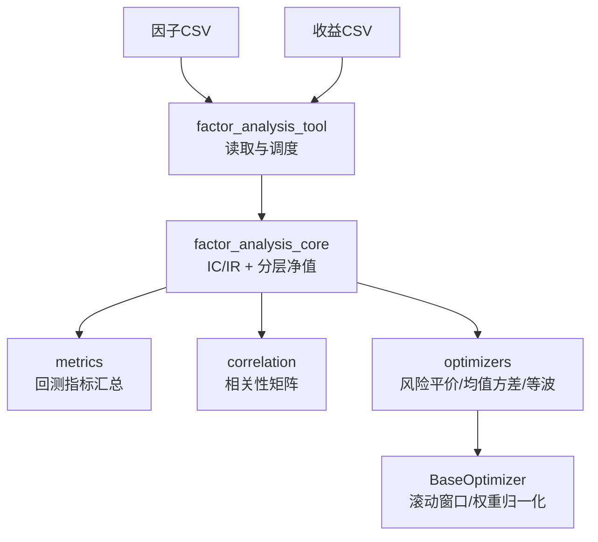
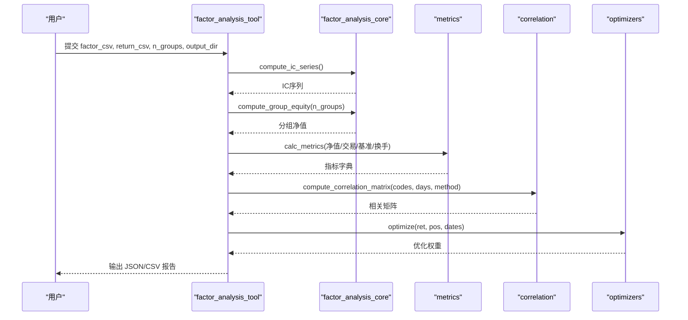
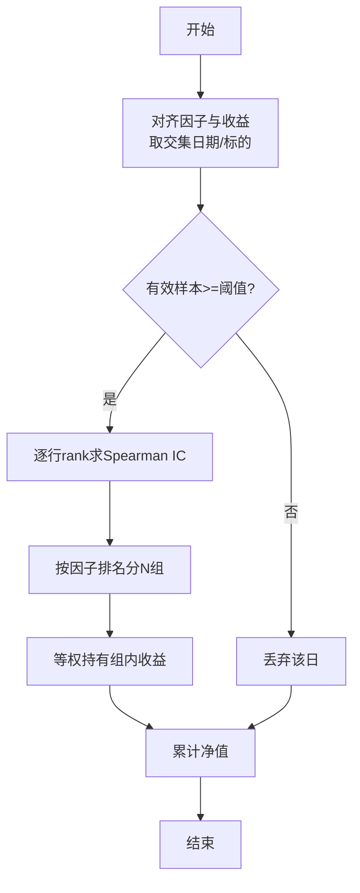
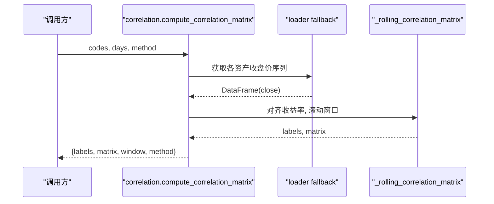
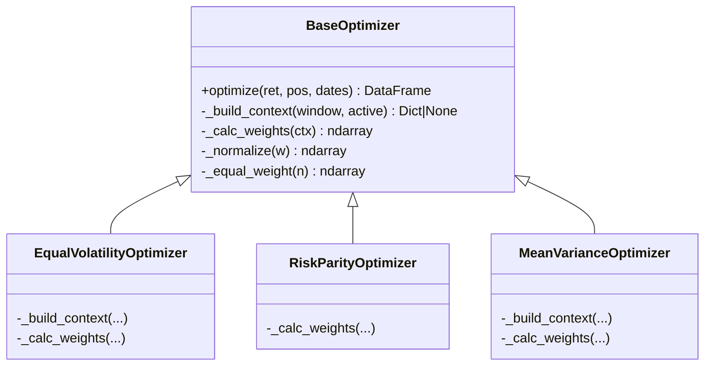
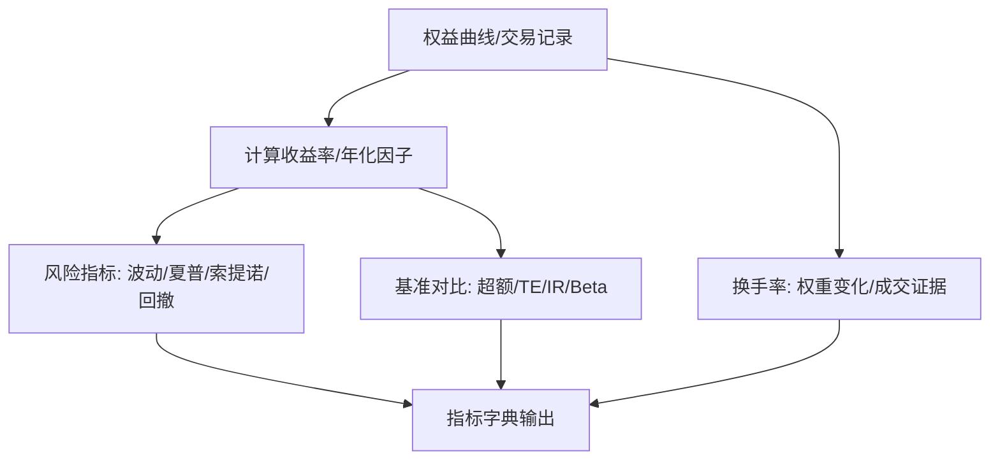
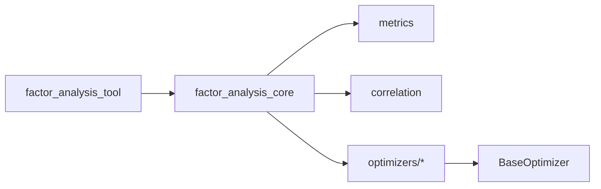

# 因子分析方法

<cite>
**本文引用的文件**
- [agent/src/factors/factor_analysis_core.py](file://agent/src/factors/factor_analysis_core.py)
- [agent/src/tools/factor_analysis_tool.py](file://agent/src/tools/factor_analysis_tool.py)
- [agent/backtest/metrics.py](file://agent/backtest/metrics.py)
- [agent/backtest/correlation.py](file://agent/backtest/correlation.py)
- [agent/backtest/optimizers/base.py](file://agent/backtest/optimizers/base.py)
- [agent/backtest/optimizers/risk_parity.py](file://agent/backtest/optimizers/risk_parity.py)
- [agent/backtest/optimizers/mean_variance.py](file://agent/backtest/optimizers/mean_variance.py)
- [agent/backtest/optimizers/equal_volatility.py](file://agent/backtest/optimizers/equal_volatility.py)
- [agent/src/factors/base.py](file://agent/src/factors/base.py)
- [agent/src/swarm/presets/factor_research_committee.yaml](file://agent/src/swarm/presets/factor_research_committee.yaml)
</cite>

## 目录
1. [简介](#简介)
2. [项目结构](#项目结构)
3. [核心组件](#核心组件)
4. [架构总览](#架构总览)
5. [详细组件分析](#详细组件分析)
6. [依赖关系分析](#依赖关系分析)
7. [性能考量](#性能考量)
8. [故障排查指南](#故障排查指南)
9. [结论](#结论)
10. [附录](#附录)

## 简介
本文件面向量化研究与投研团队，系统化梳理因子有效性检验、质量评估、组合优化、衰减分析与动态权重调整、中性化处理与可视化报告等全流程方法。内容基于仓库中已实现的因子分析工具、回测指标计算、相关性矩阵与多类组合优化器，提供从单因子到多因子组合的完整实践路径。

## 项目结构
围绕因子分析的关键代码分布在以下模块：
- 因子分析核心：IC/IR 计算、分层回测净值曲线生成
- 工具入口：读取 CSV 输入，输出 IC 序列、分组净值与摘要
- 回测指标：年化、夏普、最大回撤、换手率、基准对比等
- 相关性：滚动相关矩阵（Pearson/Spearman）
- 组合优化：等权波动率倒数、风险平价、均值方差最大化 Sharpe
- 因子算子：截面标准化、时序窗口统计、去极值与对齐等基础能力

**图示来源**
- [agent/src/tools/factor_analysis_tool.py:19-151](file://agent/src/tools/factor_analysis_tool.py#L19-L151)
- [agent/src/factors/factor_analysis_core.py:8-102](file://agent/src/factors/factor_analysis_core.py#L8-L102)
- [agent/backtest/metrics.py:461-626](file://agent/backtest/metrics.py#L461-L626)
- [agent/backtest/correlation.py:285-319](file://agent/backtest/correlation.py#L285-L319)
- [agent/backtest/optimizers/base.py:36-85](file://agent/backtest/optimizers/base.py#L36-L85)

**章节来源**
- [agent/src/tools/factor_analysis_tool.py:19-151](file://agent/src/tools/factor_analysis_tool.py#L19-L151)
- [agent/src/factors/factor_analysis_core.py:8-102](file://agent/src/factors/factor_analysis_core.py#L8-L102)

## 核心组件
- 因子有效性检验
  - IC（信息系数）：按日计算因子与未来收益的 Spearman 秩相关，过滤样本不足日期
  - IR（信息比率）：IC 均值 / IC 标准差，衡量稳定性
  - Rank IC：通过 rank 后 Pearson 等价实现 Spearman，保证稳健性
- 分层回测
  - 每日对因子排序分桶（qcut/cut），等权持有各分组，累计净值曲线
  - 支持组间收益差、多空收益估算
- 相关性分析
  - 多资产收益率滚动相关矩阵（Pearson/Spearman），统一时间对齐与缺失处理
- 组合优化
  - 等波动率倒数：低波动资产更高权重
  - 风险平价：边际风险贡献相等
  - 均值方差：最大化 Sharpe（长仓单纯形约束）
- 回测指标
  - 年化收益、波动、夏普、索提诺、最大回撤、Calmar、基准超额、跟踪误差、信息比率、换手率等

**章节来源**
- [agent/src/factors/factor_analysis_core.py:8-102](file://agent/src/factors/factor_analysis_core.py#L8-L102)
- [agent/backtest/correlation.py:135-213](file://agent/backtest/correlation.py#L135-L213)
- [agent/backtest/optimizers/equal_volatility.py:14-47](file://agent/backtest/optimizers/equal_volatility.py#L14-L47)
- [agent/backtest/optimizers/risk_parity.py:11-59](file://agent/backtest/optimizers/risk_parity.py#L11-L59)
- [agent/backtest/optimizers/mean_variance.py:11-69](file://agent/backtest/optimizers/mean_variance.py#L11-L69)
- [agent/backtest/metrics.py:461-626](file://agent/backtest/metrics.py#L461-L626)

## 架构总览
下图展示因子分析端到端流程：输入因子与收益 CSV，计算 IC/IR、分层净值，并可选进行相关性分析与组合优化，最终输出指标与图表数据。

**图示来源**
- [agent/src/tools/factor_analysis_tool.py:19-151](file://agent/src/tools/factor_analysis_tool.py#L19-L151)
- [agent/src/factors/factor_analysis_core.py:8-102](file://agent/src/factors/factor_analysis_core.py#L8-L102)
- [agent/backtest/metrics.py:461-626](file://agent/backtest/metrics.py#L461-L626)
- [agent/backtest/correlation.py:285-319](file://agent/backtest/correlation.py#L285-L319)
- [agent/backtest/optimizers/base.py:36-85](file://agent/backtest/optimizers/base.py#L36-L85)

## 详细组件分析

### 组件A：IC/IR 与分层回测
- 功能要点
  - 每日对因子与收益做配对有效样本过滤，计算 Spearman IC
  - 按因子排名分 N 组，等权持有，得到各组累计净值
- 复杂度与健壮性
  - 向量化 rank().corrwith() 提升效率；每日期样本数阈值保护
  - qcut 失败时回退 cut，避免极端值导致空桶
- 适用场景
  - 单因子有效性验证、因子筛选、多空信号构造

**图示来源**
- [agent/src/factors/factor_analysis_core.py:8-47](file://agent/src/factors/factor_analysis_core.py#L8-L47)
- [agent/src/factors/factor_analysis_core.py:50-102](file://agent/src/factors/factor_analysis_core.py#L50-L102)

**章节来源**
- [agent/src/factors/factor_analysis_core.py:8-102](file://agent/src/factors/factor_analysis_core.py#L8-L102)

### 组件B：相关性矩阵
- 功能要点
  - 自动推断市场类型并规范化符号，拉取收盘价序列
  - 计算滚动窗口内的成对相关矩阵（Pearson/Spearman）
- 关键细节
  - 统一时间对齐（归一化为日期）、dropna 对齐
  - 窗口长度可配置，结果包含标签、矩阵、窗口与方法

**图示来源**
- [agent/backtest/correlation.py:19-89](file://agent/backtest/correlation.py#L19-L89)
- [agent/backtest/correlation.py:135-213](file://agent/backtest/correlation.py#L135-L213)
- [agent/backtest/correlation.py:285-319](file://agent/backtest/correlation.py#L285-L319)

**章节来源**
- [agent/backtest/correlation.py:135-213](file://agent/backtest/correlation.py#L135-L213)
- [agent/backtest/correlation.py:285-319](file://agent/backtest/correlation.py#L285-L319)

### 组件C：组合优化器族
- 基类 BaseOptimizer
  - 负责滚动窗口切片、活性资产选择、协方差矩阵构建与 NaN 检查
  - 保持信号方向，将优化权重乘以原始信号符号
- 具体策略
  - EqualVolatilityOptimizer：按波动率倒数分配权重
  - RiskParityOptimizer：最小化边际风险贡献偏差
  - MeanVarianceOptimizer：最大化 Sharpe（无风险利率可调）

**图示来源**
- [agent/backtest/optimizers/base.py:14-145](file://agent/backtest/optimizers/base.py#L14-L145)
- [agent/backtest/optimizers/equal_volatility.py:14-47](file://agent/backtest/optimizers/equal_volatility.py#L14-L47)
- [agent/backtest/optimizers/risk_parity.py:11-59](file://agent/backtest/optimizers/risk_parity.py#L11-L59)
- [agent/backtest/optimizers/mean_variance.py:11-69](file://agent/backtest/optimizers/mean_variance.py#L11-L69)

**章节来源**
- [agent/backtest/optimizers/base.py:36-85](file://agent/backtest/optimizers/base.py#L36-L85)
- [agent/backtest/optimizers/equal_volatility.py:14-47](file://agent/backtest/optimizers/equal_volatility.py#L14-L47)
- [agent/backtest/optimizers/risk_parity.py:11-59](file://agent/backtest/optimizers/risk_parity.py#L11-L59)
- [agent/backtest/optimizers/mean_variance.py:11-69](file://agent/backtest/optimizers/mean_variance.py#L11-L69)

### 组件D：回测指标与换手率
- 指标覆盖
  - 总收益、年化收益、波动、夏普、索提诺、最大回撤、Calmar
  - 基准对比：超额收益、跟踪误差、信息比率、Beta
  - 交易统计：胜率、盈亏比、连续亏损、平均持仓期
  - 换手率：按权重变化或成交证据计算
- 稳健性
  - 非正价格下的收益率定义修正，避免无穷大与NaN污染
  - 小样本保护（ddof=1 与下限保护）

**图示来源**
- [agent/backtest/metrics.py:245-302](file://agent/backtest/metrics.py#L245-L302)
- [agent/backtest/metrics.py:461-626](file://agent/backtest/metrics.py#L461-L626)

**章节来源**
- [agent/backtest/metrics.py:461-626](file://agent/backtest/metrics.py#L461-L626)

### 组件E：因子算子与预处理
- 截面标准化：zscore、scale、rank
- 时序窗口：ts_mean/ts_std/ts_corr/ts_cov/ts_rank/ts_argmax/ts_argmin/delta/decay_linear
- 安全操作：safe_div、vwap（按市场适配）
- 用途：因子构造、去极值、对齐、标准化，为后续 IC/IR 与组合优化提供高质量输入

**章节来源**
- [agent/src/factors/base.py:62-356](file://agent/src/factors/base.py#L62-L356)

## 依赖关系分析
- 工具层依赖核心计算：factor_analysis_tool 调用 factor_analysis_core 完成 IC/IR 与分层净值
- 指标层依赖回测框架：metrics 提供统一指标口径，兼容不同数据源与频率
- 相关性模块独立：可从任意收益矩阵计算滚动相关矩阵
- 优化器族共享基类：统一滚动窗口与权重归一化逻辑，便于扩展新策略

**图示来源**
- [agent/src/tools/factor_analysis_tool.py:19-151](file://agent/src/tools/factor_analysis_tool.py#L19-L151)
- [agent/src/factors/factor_analysis_core.py:8-102](file://agent/src/factors/factor_analysis_core.py#L8-L102)
- [agent/backtest/metrics.py:461-626](file://agent/backtest/metrics.py#L461-L626)
- [agent/backtest/correlation.py:285-319](file://agent/backtest/correlation.py#L285-L319)
- [agent/backtest/optimizers/base.py:14-145](file://agent/backtest/optimizers/base.py#L14-L145)

**章节来源**
- [agent/src/tools/factor_analysis_tool.py:19-151](file://agent/src/tools/factor_analysis_tool.py#L19-L151)
- [agent/backtest/optimizers/base.py:14-145](file://agent/backtest/optimizers/base.py#L14-L145)

## 性能考量
- 向量化计算：IC 使用 rank().corrwith() 与 per-row 掩码，避免逐标的循环
- 窗口滑动：base.py 中滚动窗口仅取历史数据，防止前视偏差
- 数值稳定：收益率计算对非正价格进行保护；小样本下对波动/下行波动进行下限保护
- 优化收敛：SLSQP 设置合理迭代与容差，失败时回退等权或初始猜测

[本节为通用指导，不直接分析具体文件]

## 故障排查指南
- 数据对齐问题
  - 因子与收益必须同索引（日期）与同列（标的），否则 IC/IR 为空
  - 相关性计算要求至少两个资产有重叠收益率区间
- 样本不足
  - IC 计算会丢弃当日有效样本少于阈值的日期
  - 分层回测在样本不足时跳过该日
- 优化失败
  - 协方差矩阵含 NaN 或奇异时，优化器返回 None 或回退等权
  - 波动率为零或过小则跳过或回退
- 收益异常
  - 非正价格导致的收益率无穷大被替换为 NaN 并填充为 0，同时记录告警

**章节来源**
- [agent/src/factors/factor_analysis_core.py:22-47](file://agent/src/factors/factor_analysis_core.py#L22-L47)
- [agent/backtest/correlation.py:175-194](file://agent/backtest/correlation.py#L175-L194)
- [agent/backtest/optimizers/base.py:68-85](file://agent/backtest/optimizers/base.py#L68-L85)
- [agent/backtest/metrics.py:245-302](file://agent/backtest/metrics.py#L245-L302)

## 结论
本项目提供了完整的因子分析流水线：从 IC/IR 有效性检验、分层回测、相关性分析，到多类组合优化与全面回测指标输出。结合因子算子库与工具入口，可快速完成单因子验证与多因子组合优化，并通过稳健的数值处理与回退机制保障研究稳定性。建议在实际研究中配合行业/市值中性化与换手成本约束，以获得更贴近实盘的结论。

[本节为总结性内容，不直接分析具体文件]

## 附录

### 因子质量评估指标清单
- IC 均值、IC 标准差、IR（IC均值/IC标准差）
- Rank IC（Spearman）
- 分层多空收益（Top-Bottom 收益差）
- 年化收益、波动、夏普、索提诺、最大回撤、Calmar
- 基准超额、跟踪误差、信息比率、Beta
- 换手率（权重变化/成交证据）

**章节来源**
- [agent/src/factors/factor_analysis_core.py:8-47](file://agent/src/factors/factor_analysis_core.py#L8-L47)
- [agent/backtest/metrics.py:461-626](file://agent/backtest/metrics.py#L461-L626)

### 因子组合与优化方法
- 等权组合：简单稳健，适合因子数量少且质量相近
- IC/ICIR 加权：依据历史预测力与稳定性分配权重
- 风险平价：均衡各资产风险贡献，降低单一因子风险集中
- 均值方差：最大化 Sharpe（长仓约束）
- 等波动率倒数：低波动资产更高权重

**章节来源**
- [agent/src/swarm/presets/factor_research_committee.yaml:120-132](file://agent/src/swarm/presets/factor_research_committee.yaml#L120-L132)
- [agent/backtest/optimizers/equal_volatility.py:14-47](file://agent/backtest/optimizers/equal_volatility.py#L14-L47)
- [agent/backtest/optimizers/risk_parity.py:11-59](file://agent/backtest/optimizers/risk_parity.py#L11-L59)
- [agent/backtest/optimizers/mean_variance.py:11-69](file://agent/backtest/optimizers/mean_variance.py#L11-L69)

### 因子衰减分析与动态权重调整
- 衰减分析：滚动 IC/IR 观察预测力随时间的衰减，结合持有期扫描确定最佳调仓频率
- 动态权重：根据滚动 IC/IR 或波动率估计更新组合权重，控制换手与成本

**章节来源**
- [agent/src/swarm/presets/factor_research_committee.yaml:120-132](file://agent/src/swarm/presets/factor_research_committee.yaml#L120-L132)

### 因子诊断与中性化
- 因子暴露度分析：通过回归或分组暴露识别主导驱动因素
- 行业中性化：行业内排名或组内去均值，消除行业暴露
- 市值中性化：控制市值风格漂移，避免 unintended style bet

**章节来源**
- [agent/src/swarm/presets/factor_research_committee.yaml:120-132](file://agent/src/swarm/presets/factor_research_committee.yaml#L120-L132)

### 可视化与报告生成
- 输出 IC 序列、分组净值曲线、相关矩阵与指标摘要
- 可通过工具输出 JSON/CSV，便于外部绘图与报告自动化

**章节来源**
- [agent/src/tools/factor_analysis_tool.py:19-151](file://agent/src/tools/factor_analysis_tool.py#L19-L151)