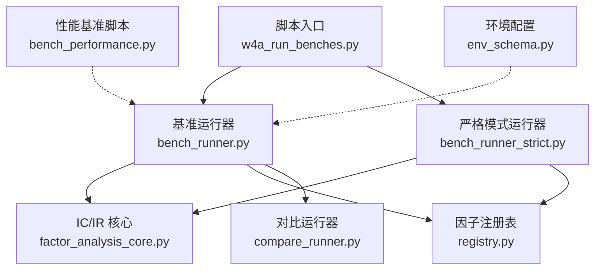
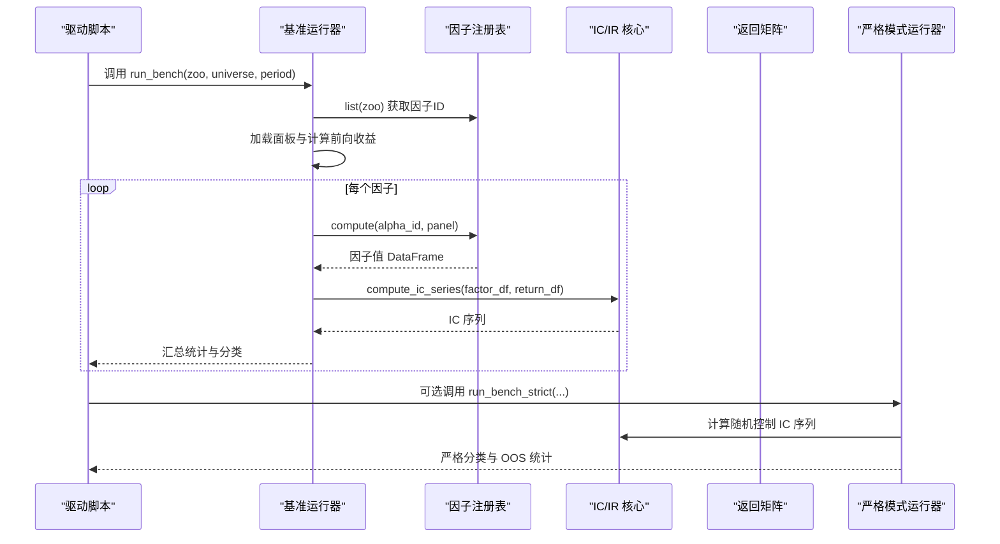
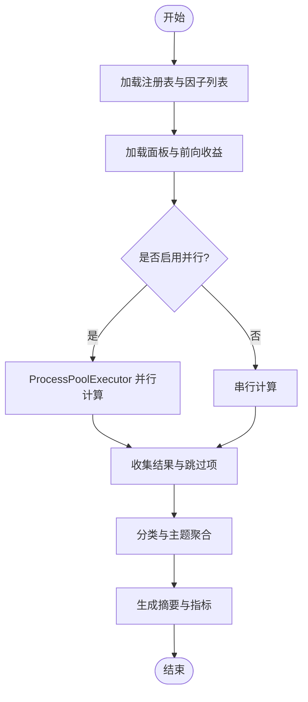
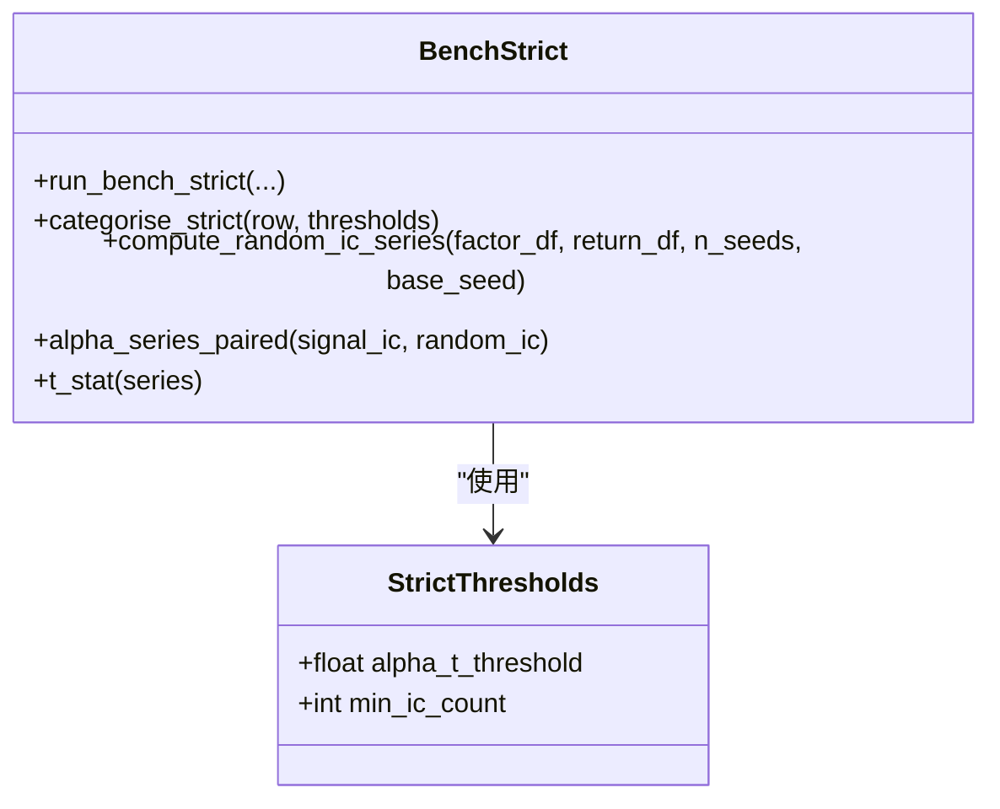
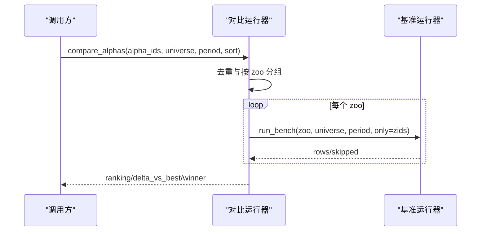
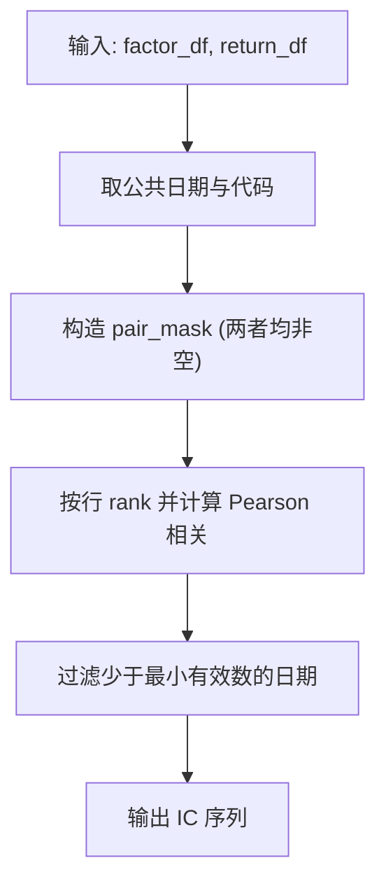
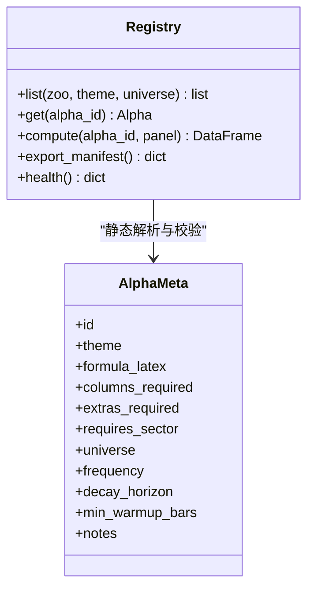
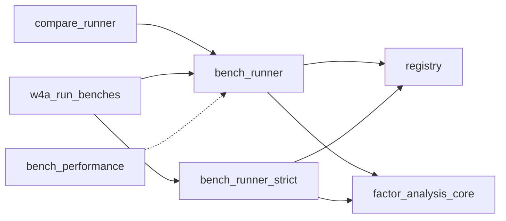

# 因子基准测试

<cite>
**本文引用的文件**
- [bench_runner.py](file://agent/src/factors/bench_runner.py)
- [bench_runner_strict.py](file://agent/src/factors/bench_runner_strict.py)
- [compare_runner.py](file://agent/src/factors/compare_runner.py)
- [factor_analysis_core.py](file://agent/src/factors/factor_analysis_core.py)
- [registry.py](file://agent/src/factors/registry.py)
- [w4a_run_benches.py](file://agent/scripts/w4a_run_benches.py)
- [bench_performance.py](file://agent/scripts/bench_performance.py)
- [test_alpha_bench_strict_cli.py](file://agent/tests/test_alpha_bench_strict_cli.py)
- [test_bench_parallel.py](file://agent/tests/test_bench_parallel.py)
- [env_schema.py](file://agent/src/config/env_schema.py)
</cite>

## 目录
1. [简介](#简介)
2. [项目结构](#项目结构)
3. [核心组件](#核心组件)
4. [架构总览](#架构总览)
5. [详细组件分析](#详细组件分析)
6. [依赖关系分析](#依赖关系分析)
7. [性能考量](#性能考量)
8. [故障排除指南](#故障排除指南)
9. [结论](#结论)
10. [附录](#附录)

## 简介
本文件系统性说明因子基准测试框架的架构与工作原理，覆盖测试环境搭建、数据准备、执行流程、严格模式与宽松模式的差异及适用场景、因子性能对比方法（计算速度、内存占用、精度验证）、结果解读与分析方法、自动化测试流程与持续集成配置建议，以及性能优化与故障排除。

## 项目结构
基准测试相关代码主要位于 agent/src/factors 与 agent/scripts，辅以 tests 中的用例与 env_schema 的环境配置。

**图示来源**
- [w4a_run_benches.py:1-172](file://agent/scripts/w4a_run_benches.py#L1-L172)
- [bench_runner.py:1-409](file://agent/src/factors/bench_runner.py#L1-L409)
- [bench_runner_strict.py:1-630](file://agent/src/factors/bench_runner_strict.py#L1-L630)
- [factor_analysis_core.py:1-103](file://agent/src/factors/factor_analysis_core.py#L1-L103)
- [registry.py:1-454](file://agent/src/factors/registry.py#L1-L454)
- [bench_performance.py:1-134](file://agent/scripts/bench_performance.py#L1-L134)
- [env_schema.py:1-200](file://agent/src/config/env_schema.py#L1-L200)

**章节来源**
- [w4a_run_benches.py:1-172](file://agent/scripts/w4a_run_benches.py#L1-L172)
- [bench_runner.py:1-409](file://agent/src/factors/bench_runner.py#L1-L409)
- [bench_runner_strict.py:1-630](file://agent/src/factors/bench_runner_strict.py#L1-L630)
- [factor_analysis_core.py:1-103](file://agent/src/factors/factor_analysis_core.py#L1-L103)
- [registry.py:1-454](file://agent/src/factors/registry.py#L1-L454)
- [bench_performance.py:1-134](file://agent/scripts/bench_performance.py#L1-L134)
- [env_schema.py:1-200](file://agent/src/config/env_schema.py#L1-L200)

## 核心组件
- 基准运行器（宽松模式）：按因子库（zoo）遍历因子，计算每日 IC 序列并汇总 IR、分类等指标，支持并行执行与进度回调。
- 严格模式运行器：在宽松模式基础上引入同宇宙随机控制与可选训练/测试样本外划分，提供更稳健的分类判定。
- 对比运行器：对指定的一组因子进行分组、基准测试与排名，输出 delta 指标。
- IC/IR 核心：向量化的 Spearman IC 计算与分层回测净值曲线。
- 因子注册表：扫描 zoo 模块、静态解析元数据、惰性加载 compute、输出校验。
- 驱动脚本：批量执行多组 zoo×universe×period 组合，生成报告与汇总 JSON。
- 性能基准脚本：针对算子与权益计算的微基准，评估向量化与循环路径的性能差异。
- 环境配置：统一读取环境变量，包括基准工作进程数等调优项。

**章节来源**
- [bench_runner.py:1-409](file://agent/src/factors/bench_runner.py#L1-L409)
- [bench_runner_strict.py:1-630](file://agent/src/factors/bench_runner_strict.py#L1-L630)
- [compare_runner.py:1-210](file://agent/src/factors/compare_runner.py#L1-L210)
- [factor_analysis_core.py:1-103](file://agent/src/factors/factor_analysis_core.py#L1-L103)
- [registry.py:1-454](file://agent/src/factors/registry.py#L1-L454)
- [w4a_run_benches.py:1-172](file://agent/scripts/w4a_run_benches.py#L1-L172)
- [bench_performance.py:1-134](file://agent/scripts/bench_performance.py#L1-L134)
- [env_schema.py:1-200](file://agent/src/config/env_schema.py#L1-L200)

## 架构总览
下图展示从驱动脚本到各运行器的调用链路与数据流。

**图示来源**
- [w4a_run_benches.py:40-137](file://agent/scripts/w4a_run_benches.py#L40-L137)
- [bench_runner.py:137-409](file://agent/src/factors/bench_runner.py#L137-L409)
- [bench_runner_strict.py:317-630](file://agent/src/factors/bench_runner_strict.py#L317-L630)
- [factor_analysis_core.py:8-47](file://agent/src/factors/factor_analysis_core.py#L8-L47)
- [registry.py:264-355](file://agent/src/factors/registry.py#L264-L355)

## 详细组件分析

### 宽松模式基准运行器（bench_runner）
- 功能要点
  - 通过注册表列出因子，加载宇宙面板与前向收益矩阵。
  - 对每个因子计算 IC 序列，汇总 ic_mean、ic_std、ir、正比率、主题等。
  - 基于阈值将因子分类为 alive/reversed/dead，并提供多重检验校正信息。
  - 支持 ProcessPoolExecutor 并行执行，使用 fork 上下文共享大对象以降低拷贝开销。
  - 提供 on_progress 回调以支持 UI/CLI 进度显示。
- 关键流程
  - 初始化：获取注册表、因子列表、过滤 only 子集。
  - 数据准备：加载面板与前向收益。
  - 执行：串行或并行计算每个因子的 IC 与统计。
  - 汇总：分类、主题聚合、top-N、跳过原因、墙钟时间。
- 错误处理
  - 捕获 SkipAlpha/RegistryError/运行时异常，归类为 typed/unexpected 并记录 skip。
  - 对 worker 崩溃进行异常捕获与日志记录。

**图示来源**
- [bench_runner.py:137-409](file://agent/src/factors/bench_runner.py#L137-L409)

**章节来源**
- [bench_runner.py:137-409](file://agent/src/factors/bench_runner.py#L137-L409)
- [test_bench_parallel.py:71-156](file://agent/tests/test_bench_parallel.py#L71-L156)

### 严格模式基准运行器（bench_runner_strict）
- 设计动机
  - 宽松模式仅以零为基准，可能误判受共同横截面 Beta 驱动的因子为有效 alpha。
  - 严格模式引入同宇宙行内打乱的随机控制，构建更稳健的零假设；可选训练/测试样本外划分，避免过拟合。
- 核心能力
  - 随机控制：对因子值按日期行内打乱，计算随机 IC 序列，并与信号 IC 配对得到 alpha 序列。
  - 分类规则：基于 alpha_t_full、alpha_t_train、alpha_t_test 与阈值，分为 confirmed_alive/train_only/reversed_strict/noise。
  - OOS 划分：支持按日期切分训练/测试，检测符号反转与衰减。
  - 兼容旧接口：保留 legacy 计数键以便现有仪表板继续工作。
- 参数与阈值
  - StrictThresholds：alpha_t_threshold、min_ic_count。
  - n_random_seeds：默认 5，平衡方差与控制成本。
- 错误与健壮性
  - 空输入、公共日期为空时返回空序列。
  - 非有限值在打乱中保持原位，保证鲁棒性。

**图示来源**
- [bench_runner_strict.py:82-94](file://agent/src/factors/bench_runner_strict.py#L82-L94)
- [bench_runner_strict.py:242-311](file://agent/src/factors/bench_runner_strict.py#L242-L311)
- [bench_runner_strict.py:141-184](file://agent/src/factors/bench_runner_strict.py#L141-L184)
- [bench_runner_strict.py:317-630](file://agent/src/factors/bench_runner_strict.py#L317-L630)

**章节来源**
- [bench_runner_strict.py:1-630](file://agent/src/factors/bench_runner_strict.py#L1-L630)
- [test_alpha_bench_strict_cli.py:131-237](file://agent/tests/test_alpha_bench_strict_cli.py#L131-L237)

### 对比运行器（compare_runner）
- 目标：对一组手工挑选的因子进行头对头比较，按选定指标排序并计算与最优者的差值。
- 流程：去重 → 按 zoo 分组 → 调用宽松基准运行器（only=子集）→ 合并行 → 排序 → 输出 ranking 与 winner。
- 指标：ir、ic_mean、ic_positive_ratio、ic_count。

**图示来源**
- [compare_runner.py:88-210](file://agent/src/factors/compare_runner.py#L88-L210)
- [bench_runner.py:137-409](file://agent/src/factors/bench_runner.py#L137-L409)

**章节来源**
- [compare_runner.py:1-210](file://agent/src/factors/compare_runner.py#L1-L210)

### IC/IR 核心（factor_analysis_core）
- compute_ic_series：按日计算因子与收益率的 Spearman 秩相关（rank().corrwith），每日期至少 5 个有效配对。
- compute_group_equity：按因子值分组等权持有，计算累计净值曲线。

**图示来源**
- [factor_analysis_core.py:8-47](file://agent/src/factors/factor_analysis_core.py#L8-L47)

**章节来源**
- [factor_analysis_core.py:1-103](file://agent/src/factors/factor_analysis_core.py#L1-L103)

### 因子注册表（registry）
- 扫描 zoo 目录，AST 解析 __alpha_meta__，构建 Alpha 元数据。
- 提供 list/get/compute/export_manifest/health 等 API。
- compute 时检查必需列、板块标签，惰性导入模块并执行 compute，输出形状与数值合法性校验（禁止 inf、NaN 比例过高）。
- 进程级单例缓存，减少重复扫描开销。

**图示来源**
- [registry.py:87-125](file://agent/src/factors/registry.py#L87-L125)
- [registry.py:201-355](file://agent/src/factors/registry.py#L201-L355)
- [registry.py:401-422](file://agent/src/factors/registry.py#L401-L422)
- [registry.py:460-478](file://agent/src/factors/registry.py#L460-L478)

**章节来源**
- [registry.py:1-454](file://agent/src/factors/registry.py#L1-L454)

### 驱动脚本与性能基准
- w4a_run_benches.py：定义多组 zoo×universe×period 组合，依次调用工具与基准运行器，输出 HTML 报告与 JSON 汇总。
- bench_performance.py：对因子算子与权益计算进行微基准，比较向量化与循环路径，打印耗时与加速比。

**章节来源**
- [w4a_run_benches.py:1-172](file://agent/scripts/w4a_run_benches.py#L1-L172)
- [bench_performance.py:1-134](file://agent/scripts/bench_performance.py#L1-L134)

## 依赖关系分析
- 松散耦合：运行器通过注册表与 IC 核心解耦，便于替换数据源与计算方法。
- 并行化：bench_runner 使用进程池并行，需确保可序列化输入与全局状态隔离。
- 外部依赖：数据加载与前向收益计算由工具层提供；严格模式依赖随机控制与 OOS 划分逻辑。

**图示来源**
- [bench_runner.py:137-409](file://agent/src/factors/bench_runner.py#L137-L409)
- [bench_runner_strict.py:317-630](file://agent/src/factors/bench_runner_strict.py#L317-L630)
- [compare_runner.py:88-210](file://agent/src/factors/compare_runner.py#L88-L210)
- [w4a_run_benches.py:40-137](file://agent/scripts/w4a_run_benches.py#L40-L137)

**章节来源**
- [bench_runner.py:137-409](file://agent/src/factors/bench_runner.py#L137-L409)
- [bench_runner_strict.py:317-630](file://agent/src/factors/bench_runner_strict.py#L317-L630)
- [compare_runner.py:88-210](file://agent/src/factors/compare_runner.py#L88-L210)
- [w4a_run_benches.py:40-137](file://agent/scripts/w4a_run_benches.py#L40-L137)

## 性能考量
- 计算速度
  - 并行执行：通过环境变量控制工作进程数，自动选择并行或串行路径。
  - 向量化 IC：Spearman 秩相关使用 rank().corrwith，避免逐日循环。
  - 算子基准：bench_performance 提供 ts_rank/ts_argmax/ts_argmin/decay_linear 的耗时测量。
- 内存占用
  - 进程池初始化时将大型面板与前向收益矩阵注入工作进程，减少跨进程拷贝。
  - 注册表单例缓存避免重复 AST 扫描与模块加载。
- 精度验证
  - IC 序列要求每日期至少 5 个有效配对，避免稀疏导致的偏差。
  - 严格模式通过随机控制与 OOS 划分降低过拟合风险。
- 优化建议
  - 合理设置 VIBE_TRADING_BENCH_WORKERS，避免过度并行导致上下文切换开销。
  - 使用 only 参数仅评估必要因子集合，减少不必要计算。
  - 开启数据缓存以减少网络拉取成本（如 Tushare/yfinance 缓存）。

**章节来源**
- [bench_runner.py:223-249](file://agent/src/factors/bench_runner.py#L223-L249)
- [factor_analysis_core.py:8-47](file://agent/src/factors/factor_analysis_core.py#L8-L47)
- [bench_performance.py:19-134](file://agent/scripts/bench_performance.py#L19-L134)
- [env_schema.py:166-200](file://agent/src/config/env_schema.py#L166-L200)

## 故障排除指南
- 常见问题
  - 未找到 zoo 或因子：注册表 list 返回空，检查 zoo 名称与注册情况。
  - 宇宙加载失败：检查数据源凭据与网络连通性（如 TUSHARE_TOKEN）。
  - 前向收益计算失败：检查价格序列与缺失值处理。
  - 因子输出非法：注册表校验拒绝 inf 与高 NaN 比例，需修正因子实现。
  - 严格模式 OOS 分割无效：确认 oos_split 格式正确且训练/测试期有足够观测。
- 调试步骤
  - 查看 skipped 列表中的 reason 与 kind，定位具体失败原因。
  - 使用 on_progress 回调观察进度与当前因子 ID。
  - 在严格模式下检查 alpha_t_full/train/test 与 random_ic_mean，判断是否显著优于随机。
  - 使用 bench_performance 验证底层算子性能是否退化。

**章节来源**
- [bench_runner.py:178-209](file://agent/src/factors/bench_runner.py#L178-L209)
- [bench_runner.py:300-312](file://agent/src/factors/bench_runner.py#L300-L312)
- [bench_runner_strict.py:453-457](file://agent/src/factors/bench_runner_strict.py#L453-L457)
- [registry.py:401-422](file://agent/src/factors/registry.py#L401-L422)
- [bench_performance.py:19-134](file://agent/scripts/bench_performance.py#L19-L134)

## 结论
该基准测试框架提供了从宽松到严格的完整因子评估体系：宽松模式适合快速筛选与探索，严格模式通过随机控制与 OOS 划分提升结论稳健性。配合对比运行器与性能基准脚本，可实现高效的因子研发闭环。建议在 CI 中集成严格模式基准，结合环境配置与缓存策略，保障回归测试与性能监控。

## 附录

### 测试环境搭建
- 安装依赖与环境变量
  - 设置数据源凭据（如 TUSHARE_TOKEN）与基准工作进程数（VIBE_TRADING_BENCH_WORKERS）。
  - 如需禁用瓶颈优化，可通过相应环境变量调整。
- 数据准备
  - 通过宇宙键（如 csi300/sp500/btc-usdt）与周期窗口加载面板与前向收益。
  - 利用缓存机制减少重复拉取。

**章节来源**
- [env_schema.py:166-200](file://agent/src/config/env_schema.py#L166-L200)
- [w4a_run_benches.py:147-160](file://agent/scripts/w4a_run_benches.py#L147-L160)

### 执行流程
- 单次基准：调用 run_bench 或 run_bench_strict，传入 zoo/universe/period/top 等参数。
- 批量基准：使用 w4a_run_benches 定义多组组合，生成报告与汇总。
- 对比基准：使用 compare_alphas 对指定因子集合进行排名与差值分析。

**章节来源**
- [bench_runner.py:137-409](file://agent/src/factors/bench_runner.py#L137-L409)
- [bench_runner_strict.py:317-630](file://agent/src/factors/bench_runner_strict.py#L317-L630)
- [compare_runner.py:88-210](file://agent/src/factors/compare_runner.py#L88-L210)
- [w4a_run_benches.py:44-137](file://agent/scripts/w4a_run_benches.py#L44-L137)

### 严格模式与宽松模式差异
- 宽松模式
  - 分类依据：ic_mean、正比率、t-stat 阈值。
  - 适用场景：快速筛选、探索性研究。
- 严格模式
  - 分类依据：alpha_t_full/train/test 与随机控制基线，支持 OOS 划分。
  - 适用场景：严谨验证、防止过拟合与虚假阳性。

**章节来源**
- [bench_runner.py:110-119](file://agent/src/factors/bench_runner.py#L110-L119)
- [bench_runner_strict.py:242-311](file://agent/src/factors/bench_runner_strict.py#L242-L311)

### 性能对比方法
- 计算速度：使用 bench_performance 测量算子与权益计算耗时，比较向量化与循环路径。
- 内存占用：观察进程池初始化与面板共享策略，避免不必要的拷贝。
- 精度验证：IC 序列有效性、随机控制显著性、OOS 表现一致性。

**章节来源**
- [bench_performance.py:19-134](file://agent/scripts/bench_performance.py#L19-L134)
- [factor_analysis_core.py:8-47](file://agent/src/factors/factor_analysis_core.py#L8-L47)
- [bench_runner_strict.py:141-184](file://agent/src/factors/bench_runner_strict.py#L141-L184)

### 结果解读与分析
- 关键指标
  - ic_mean、ic_std、ir、正比率、ic_count。
  - 严格模式：alpha_t_full/train/test、random_ic_mean。
- 分类与主题
  - alive/reversed/dead（宽松）；confirmed_alive/train_only/reversed_strict/noise（严格）。
  - by_theme 聚合用于主题维度分析。
- 多重检验校正
  - 提供 expected_max_ir_under_null、deflated_probability、survives_deflation 等字段，帮助识别搜索偏差。

**章节来源**
- [bench_runner.py:314-416](file://agent/src/factors/bench_runner.py#L314-L416)
- [bench_runner_strict.py:567-655](file://agent/src/factors/bench_runner_strict.py#L567-L655)

### 自动化测试与持续集成
- 单元测试
  - 严格模式 CLI 路由与输出信封校验。
  - 并行路径与顺序路径一致性验证。
- CI 建议
  - 在 GitHub Actions 中集成基准脚本，设置必要环境变量与缓存。
  - 对关键 zoo×universe 组合执行严格模式基准，产出报告与 JSON 归档。
  - 使用性能基准脚本作为回归门禁，防止算子性能退化。

**章节来源**
- [test_alpha_bench_strict_cli.py:131-237](file://agent/tests/test_alpha_bench_strict_cli.py#L131-L237)
- [test_bench_parallel.py:91-156](file://agent/tests/test_bench_parallel.py#L91-L156)
- [w4a_run_benches.py:140-167](file://agent/scripts/w4a_run_benches.py#L140-L167)