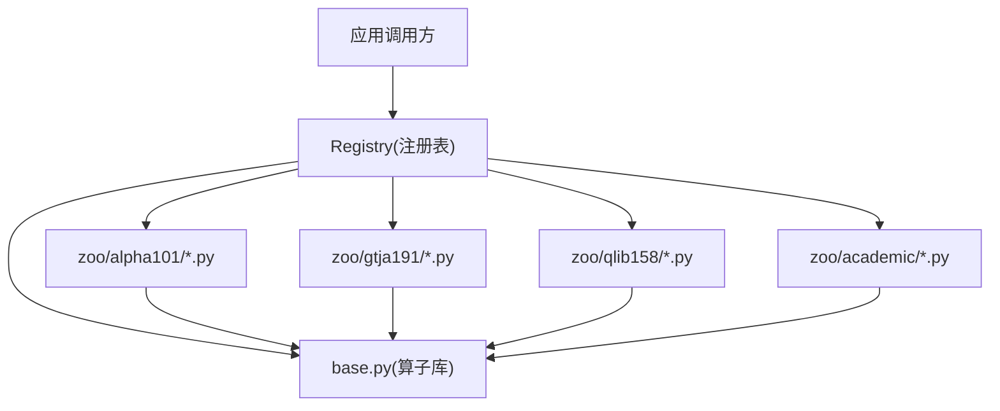
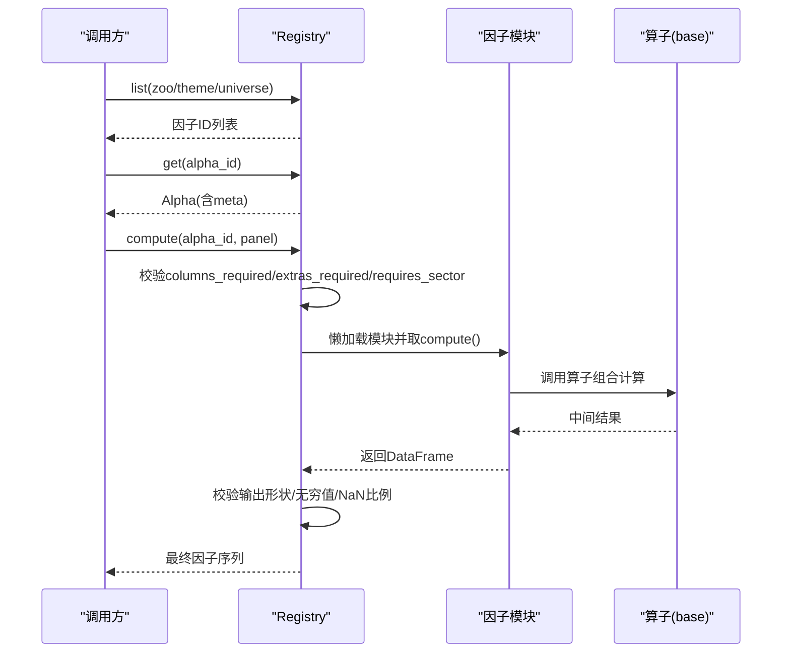
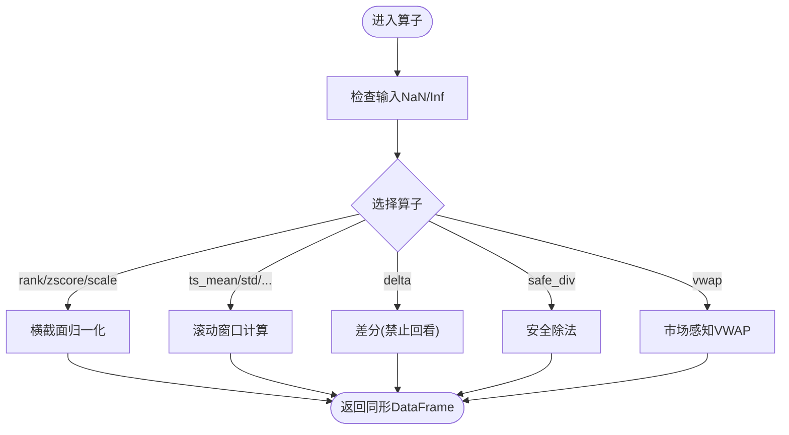
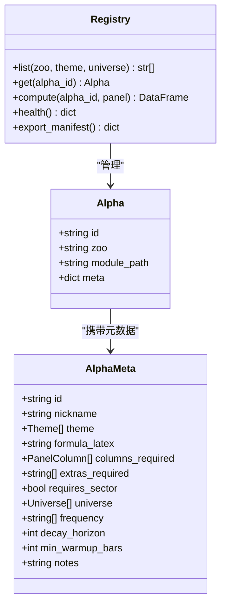
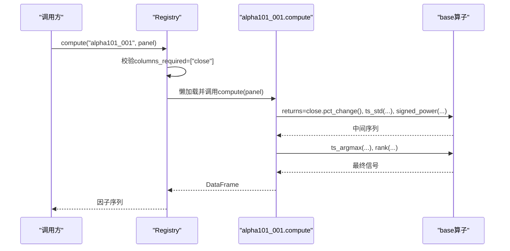
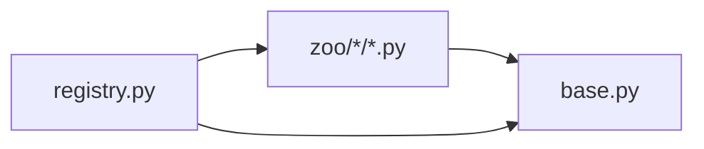

# 因子库使用指南

<cite>
**本文引用的文件**
- [agent/src/factors/__init__.py](file://agent/src/factors/__init__.py)
- [agent/src/factors/base.py](file://agent/src/factors/base.py)
- [agent/src/factors/registry.py](file://agent/src/factors/registry.py)
- [agent/src/factors/zoo/alpha101/alpha_001.py](file://agent/src/factors/zoo/alpha101/alpha_001.py)
- [agent/src/factors/zoo/qlib158/beta10.py](file://agent/src/factors/zoo/qlib158/beta10.py)
- [agent/src/factors/zoo/gtja191/alpha_001.py](file://agent/src/factors/zoo/gtja191/alpha_001.py)
- [agent/src/factors/zoo/academic/carma_mom.py](file://agent/src/factors/zoo/academic/carma_mom.py)
</cite>

## 目录
1. [简介](#简介)
2. [项目结构](#项目结构)
3. [核心组件](#核心组件)
4. [架构总览](#架构总览)
5. [详细组件分析](#详细组件分析)
6. [依赖关系分析](#依赖关系分析)
7. [性能考量](#性能考量)
8. [故障排查指南](#故障排查指南)
9. [结论](#结论)
10. [附录](#附录)

## 简介
本指南面向需要系统使用“因子库”的研究与工程人员，覆盖 Alpha101、GTJA191、Qlib158、Academic 等经典因子集。文档聚焦以下目标：
- 说明每个因子集的参数配置、数据要求与计算逻辑
- 提供因子查询与调用的具体代码示例（批量获取、条件筛选、结果格式化）
- 解释因子库的版本管理与兼容性处理
- 给出常见因子的业务含义与使用场景建议
- 汇总性能基准测试结果与适用性分析

## 项目结构
因子库位于 agent/src/factors 下，采用“注册表 + 算子 + 因子动物园”的分层组织：
- base.py：定义统一的宽表面板契约、基础算子（时序窗口、横截面标准化等）
- registry.py：扫描 zoo 子目录，解析每个因子的元数据，提供按需加载与计算
- zoo/*：按因子集划分的实现目录（如 alpha101、gtja191、qlib158、academic），每个因子一个 .py 模块，内含 __alpha_meta__ 元数据与 compute(panel) 函数

图表来源
- [agent/src/factors/registry.py:201-397](file://agent/src/factors/registry.py#L201-L397)
- [agent/src/factors/base.py:27-356](file://agent/src/factors/base.py#L27-L356)

章节来源
- [agent/src/factors/__init__.py:1-49](file://agent/src/factors/__init__.py#L1-L49)
- [agent/src/factors/base.py:1-356](file://agent/src/factors/base.py#L1-L356)
- [agent/src/factors/registry.py:1-454](file://agent/src/factors/registry.py#L1-L454)

## 核心组件
- 面板契约与算子（base.py）
  - 输入为宽表 DataFrame：行索引为交易日期，列名为证券代码；输出同形，NaN 传播，禁止无穷大
  - 常用算子：rank、ts_rank、ts_mean/std/max/min、ts_corr/ts_cov、delta、decay_linear、signed_power、safe_div、vwap（市场感知）
- 注册表（registry.py）
  - AST 静态解析每个因子的 __alpha_meta__，校验字段与依赖列
  - 支持 list/get/compute/export_manifest/health 等接口
  - 懒加载模块并执行 compute(panel)，对输出做形状与数值合法性校验
- 因子模块（zoo/*）
  - 每个因子一个 Python 模块，包含 __alpha_meta__（id、主题、公式、所需列、适用市场、频率、预热期等）与 compute(panel)

章节来源
- [agent/src/factors/base.py:27-356](file://agent/src/factors/base.py#L27-L356)
- [agent/src/factors/registry.py:87-125](file://agent/src/factors/registry.py#L87-L125)
- [agent/src/factors/registry.py:201-397](file://agent/src/factors/registry.py#L201-L397)

## 架构总览
下图展示从调用到计算的端到端流程，包括元数据校验、懒加载、计算与输出校验。

图表来源
- [agent/src/factors/registry.py:264-397](file://agent/src/factors/registry.py#L264-L397)
- [agent/src/factors/base.py:62-356](file://agent/src/factors/base.py#L62-L356)

## 详细组件分析

### 算子系统（base.py）
- 设计要点
  - 严格 NaN 传播：任何缺失或常数窗口均返回 NaN，避免静默填充
  - 防未来信息：delta(d) 要求 d>=1，禁止负步长
  - 高性能实现：滑动窗口使用 numpy 视图与可选 bottleneck 加速
- 关键算子
  - 横截面：rank、zscore、scale
  - 时序窗口：ts_mean/std/max/min、ts_corr/ts_cov、ts_argmax/ts_argmin、ts_rank、decay_linear
  - 安全运算：safe_div、signed_power
  - 市场感知：vwap（A股金额/成交量缩放、美股/港股/期货典型价、加密优先 vwap）

图表来源
- [agent/src/factors/base.py:62-356](file://agent/src/factors/base.py#L62-L356)

章节来源
- [agent/src/factors/base.py:1-356](file://agent/src/factors/base.py#L1-L356)

### 注册表（registry.py）
- 功能
  - 扫描 zoo 目录，AST 解析 __alpha_meta__，构建内存注册表
  - 提供 list/get/compute/export_manifest/health 等接口
  - 懒加载模块，隔离 import 失败；compute 前后进行强校验
- 元数据模型（AlphaMeta）
  - id/nickname/theme/formula_latex/columns_required/extras_required/requires_sector/universe/frequency/decay_horizon/min_warmup_bars/notes
  - columns_required 仅允许价格列或 fund: 前缀的基本面列
- 健康检查与导出
  - health() 统计已加载/失败条目及错误原因
  - export_manifest() 生成 JSON 快照用于外部消费（如 wiki）

图表来源
- [agent/src/factors/registry.py:87-125](file://agent/src/factors/registry.py#L87-L125)
- [agent/src/factors/registry.py:201-397](file://agent/src/factors/registry.py#L201-L397)

章节来源
- [agent/src/factors/registry.py:1-454](file://agent/src/factors/registry.py#L1-L454)

### 因子集概览与用法

#### Alpha101（Kakushadze 101）
- 特点
  - 每因子一个模块，包含 __alpha_meta__ 与 compute(panel)
  - 典型依赖 close/returns 等价格序列，部分因子需波动估计
- 示例因子：alpha_001
  - 主题：反转/波动
  - 所需列：close
  - 适用市场：美股、印度、韩国
  - 预热期：约25根K线
  - 业务含义：基于收益与波动的时序动量，识别收益加速或波动改善的标的
  - 计算逻辑：构造条件序列，结合 ts_std、signed_power、ts_argmax、rank 等算子得到排名信号

图表来源
- [agent/src/factors/zoo/alpha101/alpha_001.py:38-64](file://agent/src/factors/zoo/alpha101/alpha_001.py#L38-L64)
- [agent/src/factors/registry.py:321-397](file://agent/src/factors/registry.py#L321-L397)

章节来源
- [agent/src/factors/zoo/alpha101/alpha_001.py:1-65](file://agent/src/factors/zoo/alpha101/alpha_001.py#L1-L65)

#### GTJA191（国泰君安191）
- 特点
  - 覆盖量价、技术形态、波动率、流动性等多主题
  - 多数因子仅需 OHLCV 序列，部分涉及基本面字段（通过 fund: 前缀声明）
- 示例因子：alpha_001（示意）
  - 通常以价格与成交量为基础，构造趋势/均值回归/波动类信号
  - 可通过 registry.list(theme="momentum"/"volatility"/...) 筛选

章节来源
- [agent/src/factors/zoo/gtja191/alpha_001.py](file://agent/src/factors/zoo/gtja191/alpha_001.py)

#### Qlib158（Qlib 158因子）
- 特点
  - 大量滚动窗口特征（MA、STD、ROC、RSI、Rank、分位数等）
  - 命名规范清晰（如 beta10、cntd20、rsi30），便于批量检索
- 示例因子：beta10
  - 典型用途：衡量相对波动或风险暴露
  - 所需列：通常为 close/volume 等价格量

章节来源
- [agent/src/factors/zoo/qlib158/beta10.py](file://agent/src/factors/zoo/qlib158/beta10.py)

#### Academic（学术因子）
- 特点
  - 经典资产定价与行为金融因子（如 SMB、HML、RMW、CMA、Illiquidity、高52周等）
  - 多依赖基本面或跨期统计，适合中低频策略
- 示例因子：carma_mom（示意）
  - 主题：动量/质量
  - 可能依赖基本面字段（fund: 前缀）与历史收益率

章节来源
- [agent/src/factors/zoo/academic/carma_mom.py](file://agent/src/factors/zoo/academic/carma_mom.py)

### 因子查询与调用示例（无代码片段）
- 批量获取
  - 使用 registry.list(zoo="alpha101") 获取全部 Alpha101 因子ID
  - 使用 registry.list(theme="momentum") 获取动量主题因子
  - 使用 registry.list(universe="equity_cn") 获取适用于A股的因子
- 条件筛选
  - 根据 meta.columns_required 过滤仅依赖价格的因子
  - 根据 meta.frequency 过滤日线/分钟级因子
- 结果格式化
  - compute 返回宽表 DataFrame（行=日期，列=证券），可直接拼接至回测或机器学习管道
  - 使用 rank/zscore/scale 等算子进行标准化与中性化处理

章节来源
- [agent/src/factors/registry.py:264-397](file://agent/src/factors/registry.py#L264-L397)
- [agent/src/factors/base.py:79-107](file://agent/src/factors/base.py#L79-L107)

### 版本管理与兼容性
- 元数据驱动
  - 每个因子通过 __alpha_meta__ 声明 id、theme、universe、frequency、min_warmup_bars 等，便于兼容性与可追溯
- 扫描与加载
  - 注册表通过 AST 解析元数据，不导入模块，避免副作用
  - 模块懒加载，仅在 compute 时导入，降低冷启动开销
- 健康检查与导出
  - health() 报告加载成功/失败数量与错误原因
  - export_manifest() 生成 JSON 快照，可用于 wiki 渲染与外部审计

章节来源
- [agent/src/factors/registry.py:147-184](file://agent/src/factors/registry.py#L147-L184)
- [agent/src/factors/registry.py:312-419](file://agent/src/factors/registry.py#L312-L419)

## 依赖关系分析
- 组件耦合
  - 因子模块依赖 base 算子，保持纯函数式实现
  - 注册表负责发现、校验与调度，与因子模块松耦合
- 外部依赖
  - pandas/numpy 用于数据处理
  - 可选 bottleneck 提升滚动窗口性能
- 潜在循环依赖
  - 因子模块仅依赖 base，不反向依赖 registry，避免循环

图表来源
- [agent/src/factors/base.py:1-356](file://agent/src/factors/base.py#L1-L356)
- [agent/src/factors/registry.py:201-397](file://agent/src/factors/registry.py#L201-L397)

章节来源
- [agent/src/factors/base.py:1-356](file://agent/src/factors/base.py#L1-L356)
- [agent/src/factors/registry.py:1-454](file://agent/src/factors/registry.py#L1-L454)

## 性能考量
- 算子优化
  - 滚动窗口使用 numpy 视图与 einsum，显著优于 pandas rolling().apply()
  - 当可用时，使用 bottleneck.move_argmax/move_argmin 获得更高吞吐
- 预热期与NaN
  - 合理设置 min_warmup_bars，避免过早使用未稳定信号
  - NaN 传播确保稳健性，但需注意下游模型对缺失值的处理
- 批量计算
  - 使用 registry.list 批量获取因子ID，顺序 compute 以减少重复扫描
  - 对高频数据，考虑分块计算与缓存中间结果

[本节为通用指导，无需特定文件引用]

## 故障排查指南
- 常见问题
  - 缺少必需列：抛出 SkipAlpha，提示 missing required columns
  - 输出非法：包含 +/- inf 或 >95% NaN，抛出 RegistryError
  - 模块导入失败：记录错误并跳过该因子，不影响其他因子
- 诊断步骤
  - 使用 registry.health() 查看加载状态与错误详情
  - 使用 registry.get_source(alpha_id) 获取因子源码定位问题
  - 检查 panel 是否包含 columns_required 与 extras_required 字段

章节来源
- [agent/src/factors/registry.py:321-397](file://agent/src/factors/registry.py#L321-L397)

## 结论
本因子库通过严格的元数据约束与高性能算子实现，提供了统一、可扩展的因子计算框架。借助注册表的发现与校验机制，用户可以便捷地查询、筛选与调用 Alpha101、GTJA191、Qlib158、Academic 等经典因子集，并在回测与机器学习管线中稳定使用。建议结合业务需求选择合适的因子主题与市场范围，并关注预热期与数据质量，以获得更稳健的信号表现。

[本节为总结性内容，无需特定文件引用]

## 附录
- 术语
  - 宽表面板：行=交易日，列=证券代码的 DataFrame
  - 预热期：因子稳定所需的初始 K 线数
  - 主题：因子所属的策略方向（动量、反转、波动率等）
- 参考路径
  - 算子定义：[agent/src/factors/base.py](file://agent/src/factors/base.py)
  - 注册表与元数据：[agent/src/factors/registry.py](file://agent/src/factors/registry.py)
  - 因子示例：
    - [agent/src/factors/zoo/alpha101/alpha_001.py](file://agent/src/factors/zoo/alpha101/alpha_001.py)
    - [agent/src/factors/zoo/qlib158/beta10.py](file://agent/src/factors/zoo/qlib158/beta10.py)
    - [agent/src/factors/zoo/gtja191/alpha_001.py](file://agent/src/factors/zoo/gtja191/alpha_001.py)
    - [agent/src/factors/zoo/academic/carma_mom.py](file://agent/src/factors/zoo/academic/carma_mom.py)

[本节为补充信息，无需特定文件引用]