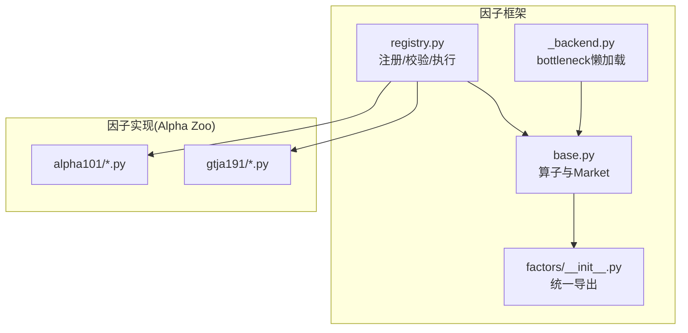
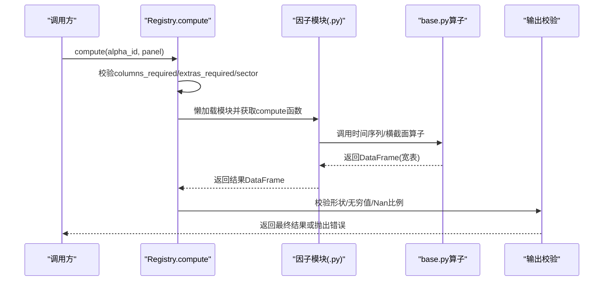
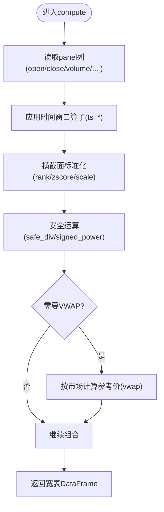
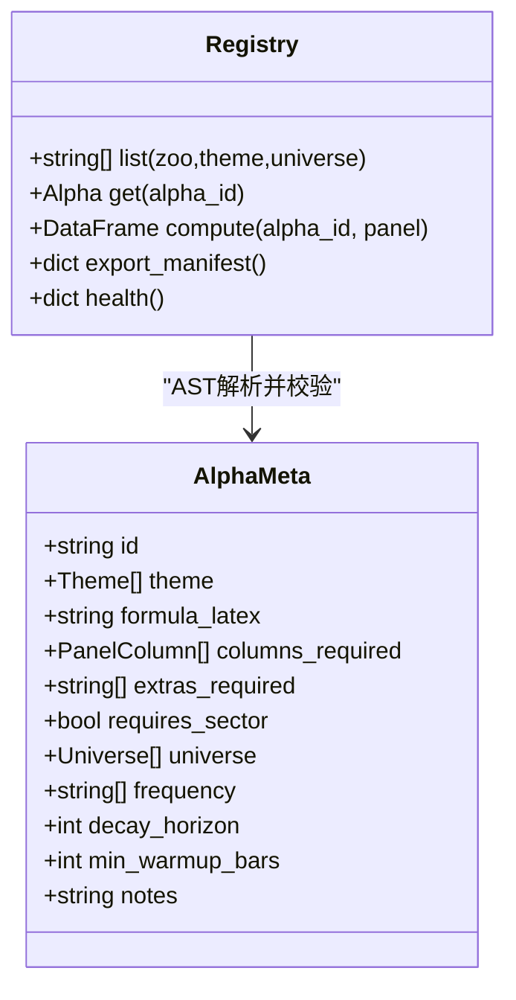
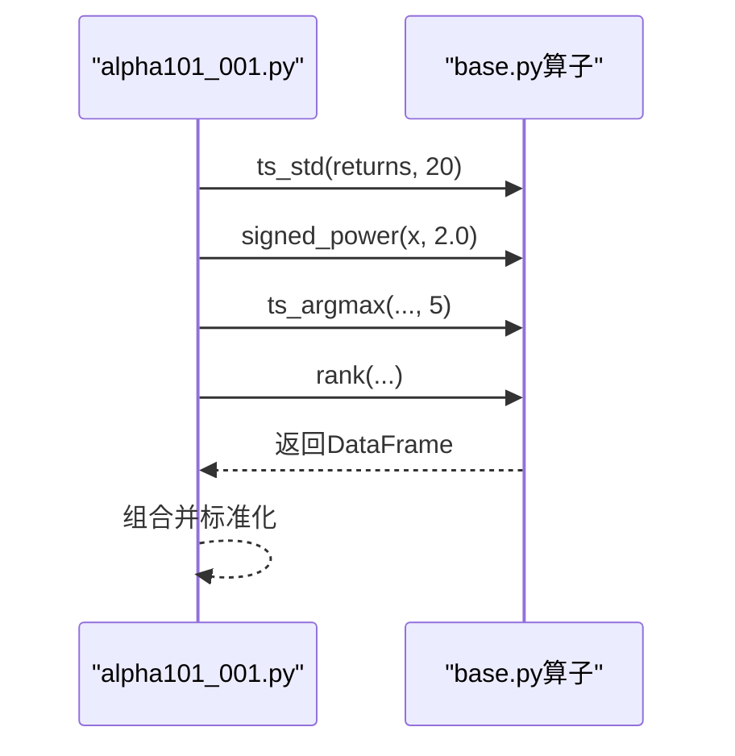
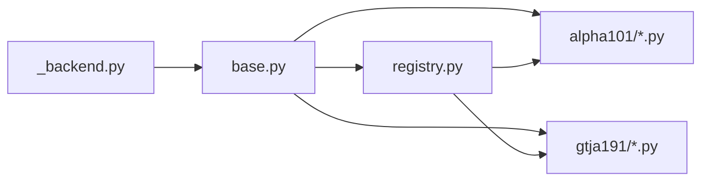

# 自定义因子开发

<cite>
**本文引用的文件**
- [agent/src/factors/base.py](file://agent/src/factors/base.py)
- [agent/src/factors/registry.py](file://agent/src/factors/registry.py)
- [agent/src/factors/__init__.py](file://agent/src/factors/__init__.py)
- [agent/src/factors/_backend.py](file://agent/src/factors/_backend.py)
- [agent/src/factors/zoo/alpha101/alpha_001.py](file://agent/src/factors/zoo/alpha101/alpha_001.py)
- [agent/src/factors/zoo/alpha101/alpha_002.py](file://agent/src/factors/zoo/alpha101/alpha_002.py)
- [agent/src/factors/zoo/gtja191/alpha_001.py](file://agent/src/factors/zoo/gtja191/alpha_001.py)
</cite>

## 目录
1. [简介](#简介)
2. [项目结构](#项目结构)
3. [核心组件](#核心组件)
4. [架构总览](#架构总览)
5. [详细组件分析](#详细组件分析)
6. [依赖关系分析](#依赖关系分析)
7. [性能考虑](#性能考虑)
8. [故障排查指南](#故障排查指南)
9. [结论](#结论)
10. [附录](#附录)

## 简介
本指南面向希望在 Vibe-Trading 中开发“自定义因子”的研究者与工程师，系统说明因子类继承结构、计算范式、注册与命名规范、性能优化技巧以及测试验证方法。仓库中的因子体系以“算子库 + 注册中心 + 因子示例集（Alpha Zoo）”为核心：所有因子通过统一的 compute 接口接收面板数据并返回宽表结果；注册中心负责扫描、校验、懒加载与执行；基础算子提供时间序列与横截面标准化能力，确保因子可组合、可复用、可回测。

## 项目结构
- 因子基座与算子：位于 agent/src/factors/base.py，提供 rank、zscore、scale、ts_* 系列时间窗口算子、delta、decay_linear、signed_power、safe_div、vwap 等。
- 注册中心：位于 agent/src/factors/registry.py，实现 AST 静态解析、元数据校验、懒加载模块、compute 调用与输出校验。
- 后端加速：位于 agent/src/factors/_backend.py，按需引入 bottleneck 以提升移动窗口 argmax/argmin 等算子的性能。
- 因子示例集（Alpha Zoo）：位于 agent/src/factors/zoo/*，包含 alpha101、gtja191、qlib158、academic、fundamental 等主题下的具体因子实现，每个 .py 文件定义 __alpha_meta__ 与 compute(panel)。
- 统一导出：agent/src/factors/__init__.py 暴露常用算子，便于在因子文件中直接引用。

**图示来源**
- [agent/src/factors/base.py:1-356](file://agent/src/factors/base.py#L1-L356)
- [agent/src/factors/_backend.py:1-69](file://agent/src/factors/_backend.py#L1-L69)
- [agent/src/factors/registry.py:1-454](file://agent/src/factors/registry.py#L1-L454)
- [agent/src/factors/__init__.py:1-49](file://agent/src/factors/__init__.py#L1-L49)

**章节来源**
- [agent/src/factors/base.py:1-356](file://agent/src/factors/base.py#L1-L356)
- [agent/src/factors/registry.py:1-454](file://agent/src/factors/registry.py#L1-L454)
- [agent/src/factors/_backend.py:1-69](file://agent/src/factors/_backend.py#L1-L69)
- [agent/src/factors/__init__.py:1-49](file://agent/src/factors/__init__.py#L1-L49)

## 核心组件
- 算子与数据结构
  - Alpha：轻量句柄，承载 id、zoo、module_path、meta。
  - Market：市场枚举，用于 vwap 的市场特定公式选择。
  - 算子族：rank、zscore、scale、ts_rank、ts_corr、ts_cov、ts_mean、ts_std、ts_max、ts_min、ts_argmax、ts_argmin、delta、decay_linear、signed_power、safe_div、vwap。
- 注册中心
  - 扫描 zoo 目录，AST 提取 __alpha_meta__，校验字段与列依赖。
  - 懒加载模块，调用 compute(panel)，严格校验输出形状、无穷值与 NaN 比例。
  - 提供 list/get/compute/export_manifest/health 等 API。
- 后端加速
  - 惰性导入 bottleneck，若可用则显著加速 move_argmax/move_argmin；不可用时回退到 pandas rolling.apply。

**章节来源**
- [agent/src/factors/base.py:39-356](file://agent/src/factors/base.py#L39-L356)
- [agent/src/factors/registry.py:87-397](file://agent/src/factors/registry.py#L87-L397)
- [agent/src/factors/_backend.py:1-69](file://agent/src/factors/_backend.py#L1-L69)

## 架构总览
因子从“面板数据”输入，经“算子组合”得到“原始分数”，再由注册中心进行“输出校验”。典型流程如下：

**图示来源**
- [agent/src/factors/registry.py:321-397](file://agent/src/factors/registry.py#L321-L397)
- [agent/src/factors/base.py:62-356](file://agent/src/factors/base.py#L62-L356)

## 详细组件分析

### 算子与数据处理模式
- 时间窗口算子：ts_mean/ts_std/ts_max/ts_min/ts_rank/ts_corr/ts_cov/ts_argmax/ts_argmin/delta/decay_linear，均遵循“warmup期NaN传播”的约定，禁止负延迟（防未来信息泄露）。
- 横截面标准化：rank（百分位排名）、zscore（样本标准差归一化）、scale（L1归一化），保证不同因子间可比性。
- 安全运算：safe_div 避免除零产生 inf；signed_power 保留符号且避免复数；vwap 按市场选择参考价。
- 向量化与内存：大量使用 numpy 数组与 sliding_window_view 减少 Python 循环开销；必要时利用 bottleneck 的 C 实现。

**图示来源**
- [agent/src/factors/base.py:62-356](file://agent/src/factors/base.py#L62-L356)

**章节来源**
- [agent/src/factors/base.py:62-356](file://agent/src/factors/base.py#L62-L356)

### 注册机制与命名规范
- 元数据 __alpha_meta__：必须包含 id、theme、formula_latex、columns_required、extras_required、requires_sector、universe、frequency、decay_horizon、min_warmup_bars、notes。
- 命名约束：zoo_id 与 alpha_id_short 需匹配正则；id 格式为 "<zoo>_<short>"；文件名与 id 一致有助于定位。
- 列依赖：仅允许价格列集合与 fund: 前缀的基本面列；其他列将被拒绝。
- 懒加载与校验：compute 仅在首次调用时加载模块；输出必须为 DataFrame，形状与 close 一致，不允许 ±inf，NaN 比例不得过高。

**图示来源**
- [agent/src/factors/registry.py:87-125](file://agent/src/factors/registry.py#L87-L125)
- [agent/src/factors/registry.py:201-397](file://agent/src/factors/registry.py#L201-L397)

**章节来源**
- [agent/src/factors/registry.py:87-125](file://agent/src/factors/registry.py#L87-L125)
- [agent/src/factors/registry.py:201-397](file://agent/src/factors/registry.py#L201-L397)

### 因子实现模式与示例
- 简单技术指标：如 alpha101_001 基于收益条件动量，使用 ts_std、signed_power、ts_argmax、rank 组合。
- 量价相关偏差：如 alpha101_002、gtja191_001 使用 delta(np.log(volume))、rank、ts_corr 捕捉量价背离。
- 通用模式：
  - 读取 panel 所需列
  - 构造中间变量（收益率、对数成交量、波动率等）
  - 应用时间窗口与横截面算子
  - 标准化与缩放
  - 返回宽表

**图示来源**
- [agent/src/factors/zoo/alpha101/alpha_001.py:54-64](file://agent/src/factors/zoo/alpha101/alpha_001.py#L54-L64)
- [agent/src/factors/base.py:62-356](file://agent/src/factors/base.py#L62-L356)

**章节来源**
- [agent/src/factors/zoo/alpha101/alpha_001.py:38-64](file://agent/src/factors/zoo/alpha101/alpha_001.py#L38-L64)
- [agent/src/factors/zoo/alpha101/alpha_002.py:38-63](file://agent/src/factors/zoo/alpha101/alpha_002.py#L38-L63)
- [agent/src/factors/zoo/gtja191/alpha_001.py:34-54](file://agent/src/factors/zoo/gtja191/alpha_001.py#L34-L54)

### 复杂复合因子设计建议
- 多窗口组合：对不同频率（如短窗波动与长窗趋势）分别计算后再做横截面标准化，降低尺度差异。
- 稳健性处理：优先使用 safe_div 与 signed_power；对极端值可采用 scale 或 zscore 控制影响。
- 可解释性：在 __alpha_meta__.formula_latex 中清晰表达数学形式，便于回溯与评审。
- 热路径优化：将高频重复计算缓存为中间变量，避免重复滚动窗口计算。

[本节为概念性指导，不直接分析具体文件]

## 依赖关系分析
- base.py 依赖 _backend.py 提供的滑动窗口视图与可选的 bottleneck 加速。
- registry.py 依赖 base.py 的 Alpha 类型与算子语义约定，并通过 AST 解析因子模块的 __alpha_meta__。
- 因子模块依赖 base.py 暴露的算子，形成“弱耦合、强契约”的组合式架构。

**图示来源**
- [agent/src/factors/_backend.py:1-69](file://agent/src/factors/_backend.py#L1-L69)
- [agent/src/factors/base.py:1-356](file://agent/src/factors/base.py#L1-L356)
- [agent/src/factors/registry.py:1-454](file://agent/src/factors/registry.py#L1-L454)

**章节来源**
- [agent/src/factors/_backend.py:1-69](file://agent/src/factors/_backend.py#L1-L69)
- [agent/src/factors/base.py:1-356](file://agent/src/factors/base.py#L1-L356)
- [agent/src/factors/registry.py:1-454](file://agent/src/factors/registry.py#L1-L454)

## 性能考虑
- 向量化计算：优先使用 numpy 数组与 sliding_window_view 替代 Python 循环；ts_rank、decay_linear 等已内置高效实现。
- 内存管理：尽量保持 DataFrame 为 float64 连续内存；避免不必要的 copy；合理使用 where/掩码减少临时对象。
- 并行处理：注册中心支持进程级单例缓存，避免重复扫描；批量 compute 可在上层并行调度（注意线程安全与资源隔离）。
- 加速开关：可通过环境变量禁用 bottleneck，确保兼容性；默认启用以获得最佳性能。

[本节提供通用指导，不直接分析具体文件]

## 故障排查指南
- 缺失列或额外字段：当 panel 缺少 columns_required 或 extras_required 时，会抛出 SkipAlpha；检查 __alpha_meta__ 声明与实际传入面板是否一致。
- 输出非法值：若结果包含 ±inf 或 NaN 比例过高，注册中心会抛出 RegistryError；检查 safe_div、ts_corr 等可能产生异常值的步骤。
- 形状不一致：输出 DataFrame 形状需与 close 一致；确认未误用聚合导致维度变化。
- 模块导入失败：compute 前会懒加载模块，任何 import 错误都会被捕获并包装为 RegistryError；检查因子模块依赖与相对导入。

**章节来源**
- [agent/src/factors/registry.py:321-397](file://agent/src/factors/registry.py#L321-L397)

## 结论
Vibe-Trading 的因子体系以“算子化 + 注册中心 + 示例集”的方式实现了高内聚、低耦合的可扩展架构。开发者只需关注 compute 逻辑与 __alpha_meta__ 声明，即可无缝接入回测与比较流程。通过严格的元数据校验与输出验证，结合高效的向量化与可选的瓶颈加速，能够在保证正确性的同时获得良好的性能表现。

[本节为总结性内容，不直接分析具体文件]

## 附录
- 快速上手清单
  - 在 zoo 下新建目录与 .py 文件，定义 __alpha_meta__ 与 compute(panel)。
  - 使用 base.py 的算子组合实现逻辑，确保 warmup 期 NaN 传播与无未来信息泄露。
  - 通过 Registry.list/get/compute 验证可用性，并观察 health 报告。
  - 编写单元测试覆盖边界情况（空列、全 NaN、极小方差、除零等）。
  - 在回测环境中评估稳定性与衰减周期（decay_horizon）。

[本节为补充说明，不直接分析具体文件]