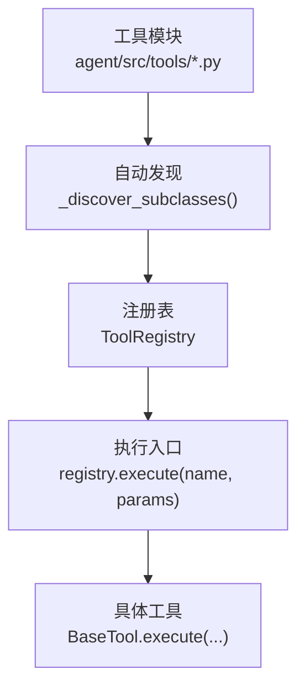
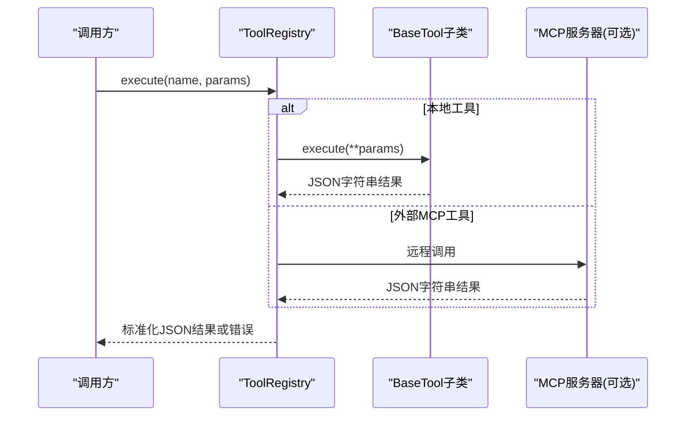
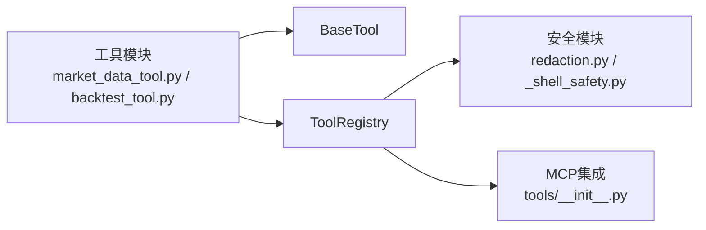

# 工具开发指南

<cite>
**本文引用的文件**
- [agent/src/agent/tools.py](file://agent/src/agent/tools.py)
- [agent/src/tools/__init__.py](file://agent/src/tools/__init__.py)
- [agent/src/tools/market_data_tool.py](file://agent/src/tools/market_data_tool.py)
- [agent/src/tools/backtest_tool.py](file://agent/src/tools/backtest_tool.py)
- [agent/src/tools/_shell_safety.py](file://agent/src/tools/_shell_safety.py)
- [agent/src/tools/redaction.py](file://agent/src/tools/redaction.py)
- [agent/SKILL.md](file://agent/SKILL.md)
- [README.md](file://README.md)
</cite>

## 目录
1. [简介](#简介)
2. [项目结构](#项目结构)
3. [核心组件](#核心组件)
4. [架构总览](#架构总览)
5. [详细组件分析](#详细组件分析)
6. [依赖关系分析](#依赖关系分析)
7. [性能考量](#性能考量)
8. [故障排查指南](#故障排查指南)
9. [结论](#结论)
10. [附录](#附录)

## 简介
本指南面向希望在 Vibe-Trading 中开发“工具”的工程师，覆盖从接口规范、参数校验、返回值格式到完整开发生命周期（需求分析、实现、测试、发布）的全流程。文档同时给出安全与调试建议，以及打包分发与维护的最佳实践。所有说明均基于仓库中的实际代码与约定。

## 项目结构
Vibe-Trading 的工具系统采用“自动发现 + 注册表”的模式：
- 每个工具是一个继承自 BaseTool 的类，定义 name、description、parameters、repeatable、is_readonly 等元数据，并实现 execute(**kwargs) -> str。
- 工具模块位于 agent/src/tools/，通过包扫描自动发现并注册到 ToolRegistry。
- 构建器 build_registry() 负责加载本地工具，并可按需附加外部 MCP 工具；支持白名单过滤、Shell 工具策略控制、会话注入等。

图表来源
- [agent/src/tools/__init__.py:33-63](file://agent/src/tools/__init__.py#L33-L63)
- [agent/src/agent/tools.py:54-95](file://agent/src/agent/tools.py#L54-L95)

章节来源
- [agent/src/tools/__init__.py:1-115](file://agent/src/tools/__init__.py#L1-L115)
- [agent/src/agent/tools.py:1-95](file://agent/src/agent/tools.py#L1-L95)

## 核心组件
- BaseTool：工具抽象基类，统一声明工具元数据与执行契约。
- ToolRegistry：工具注册与调度中心，提供 get、get_definitions、execute 等方法，保证返回值为 JSON 字符串。
- 工具构建器：build_registry()/build_filtered_registry()/build_swarm_registry()，负责按策略组装可用工具集。

关键职责
- 参数校验：由工具的 parameters（JSON Schema）描述，调用方在 LLM/前端侧进行约束；工具内部可进一步校验。
- 返回值格式：execute 必须返回 JSON 字符串；ToolRegistry.execute 会捕获异常并返回统一的错误结构。
- 只读标记：is_readonly 用于区分读写型工具，配合交易通道与审计策略。

章节来源
- [agent/src/agent/tools.py:13-52](file://agent/src/agent/tools.py#L13-L52)
- [agent/src/agent/tools.py:54-95](file://agent/src/agent/tools.py#L54-L95)

## 架构总览
下图展示了工具从注册到执行的端到端流程，包括本地工具与可选的外部 MCP 工具集成。

图表来源
- [agent/src/agent/tools.py:72-84](file://agent/src/agent/tools.py#L72-L84)
- [agent/src/tools/__init__.py:185-275](file://agent/src/tools/__init__.py#L185-L275)

章节来源
- [agent/src/tools/__init__.py:76-125](file://agent/src/tools/__init__.py#L76-L125)
- [agent/src/tools/__init__.py:185-275](file://agent/src/tools/__init__.py#L185-L275)

## 详细组件分析

### 工具接口规范（函数签名、参数、返回值）
- 函数签名
  - 所有工具必须实现 execute(self, **kwargs: Any) -> str。
  - 参数以关键字形式传入，类型与约束由 parameters 描述。
- 参数定义
  - 使用 JSON Schema 描述参数类型、枚举、默认值、必填项等。
  - 示例：市场数据工具定义了 codes、start_date、end_date、source、interval、max_rows 等字段及取值范围。
- 返回值
  - 必须返回 JSON 字符串。成功时包含 status 等业务字段；失败时 ToolRegistry 会包装为统一错误结构。
- 可重复性与只读性
  - repeatable=True 表示允许重复调用；is_readonly=False 表示该工具可能产生副作用（如回测写入）。

章节来源
- [agent/src/agent/tools.py:13-52](file://agent/src/agent/tools.py#L13-L52)
- [agent/src/tools/market_data_tool.py:11-107](file://agent/src/tools/market_data_tool.py#L11-L107)
- [agent/src/tools/backtest_tool.py:166-183](file://agent/src/tools/backtest_tool.py#L166-L183)

### 工具开发流程（需求分析到测试发布）
- 需求分析
  - 明确工具目标、输入输出、是否只读、是否需要持久化或网络访问。
  - 确定参数约束与边界条件（日期格式、枚举值、最大行数等）。
- 实现步骤
  - 新建工具类，继承 BaseTool，填写 name/description/parameters/repeatable/is_readonly。
  - 实现 execute(**kwargs)，确保返回 JSON 字符串；对输入做必要校验。
  - 若涉及 Shell/文件/网络，遵循安全策略（见“安全考虑”）。
- 注册与发现
  - 将工具放入 agent/src/tools/ 下，无需手动注册，启动时自动发现。
  - 可通过 build_filtered_registry 指定工具白名单。
- 测试验证
  - 单元测试：覆盖参数校验、异常路径、返回值结构。
  - 集成测试：与数据源、MCP 服务、文件系统交互。
  - 性能测试：大查询、批量处理、超时与限流场景。
- 发布与分发
  - 工具随包发布；如需外部依赖，在 check_available() 中声明可用性检查。
  - 文档更新：SKILL.md 与 README 同步新增工具能力与用法。

章节来源
- [agent/src/tools/__init__.py:1-115](file://agent/src/tools/__init__.py#L1-L115)
- [agent/SKILL.md:135-210](file://agent/SKILL.md#L135-L210)

### 工具测试方法
- 单元测试
  - 针对参数校验、边界值、异常分支编写用例。
  - 验证返回 JSON 结构与字段完整性。
- 集成测试
  - 与真实或模拟的数据源、MCP 服务、文件系统交互。
  - 覆盖网络超时、重试、降级路径。
- 性能测试
  - 大数据量拉取、并发调用、内存占用与耗时评估。
  - 结合工具级超时与分页机制（如 _result_paging）。

章节来源
- [agent/src/tools/__init__.py:248-365](file://agent/src/tools/__init__.py#L248-L365)

### 安全考虑（输入验证、资源限制、异常处理）
- 输入验证
  - 使用 JSON Schema 约束参数；工具内部再次校验非法输入。
  - 对路径、命令、URL 等进行白名单或模式匹配。
- 资源限制
  - 设置 max_rows、timeout、重试次数；避免无界下载。
  - Shell 工具需启用策略开关，禁止危险操作。
- 异常处理
  - 工具内部抛出异常会被 ToolRegistry 捕获并转为标准错误 JSON。
  - 日志记录异常堆栈，便于追踪。
- 敏感信息脱敏
  - 使用 redaction 模块对凭证、PII、内部路径进行脱敏，防止泄露。
- Shell 安全
  - 禁止宽泛 Python 进程终止命令，避免误杀宿主进程。

章节来源
- [agent/src/agent/tools.py:72-84](file://agent/src/agent/tools.py#L72-L84)
- [agent/src/tools/redaction.py:1-487](file://agent/src/tools/redaction.py#L1-L487)
- [agent/src/tools/_shell_safety.py:1-60](file://agent/src/tools/_shell_safety.py#L1-L60)

### 调试技巧（日志、错误追踪、性能分析）
- 日志记录
  - 使用 logging 记录关键路径与异常；ToolRegistry 已记录工具执行异常。
- 错误追踪
  - 关注 ToolRegistry.execute 的错误封装；结合 trace 与事件回调定位问题。
- 性能分析
  - 对慢查询添加计时与采样；利用分页与缓存减少网络开销。
  - 使用 backtest 工具的执行结果与产物进行分析。

章节来源
- [agent/src/agent/tools.py:72-84](file://agent/src/agent/tools.py#L72-L84)
- [agent/src/tools/backtest_tool.py:15-74](file://agent/src/tools/backtest_tool.py#L15-L74)

### 打包与分发（依赖管理、版本控制、文档生成）
- 依赖管理
  - 工具所需依赖应在 check_available() 中检测；缺失时跳过注册。
  - 通过 requirements 与 pyproject 管理全局依赖。
- 版本控制
  - 工具变更应提交 PR，附带测试与文档更新。
- 文档生成
  - 更新 SKILL.md 与 README，列出新工具的能力与用法。
  - 保持 parameters 与描述一致，便于自动生成 API 文档。

章节来源
- [agent/src/tools/__init__.py:1-115](file://agent/src/tools/__init__.py#L1-L115)
- [agent/SKILL.md:135-210](file://agent/SKILL.md#L135-L210)
- [README.md:1-166](file://README.md#L1-L166)

### 维护与质量保证最佳实践
- 代码质量
  - 遵循 PEP8，使用类型注解；保持 execute 简洁、单一职责。
- 测试覆盖
  - 新增工具必须配套单测与集成测试；覆盖异常与边界。
- 安全审查
  - 定期审查输入校验、网络访问、文件操作与 Shell 命令。
- 文档维护
  - 工具变更同步更新 SKILL.md 与 README；保持参数与行为一致。

章节来源
- [agent/src/tools/__init__.py:1-115](file://agent/src/tools/__init__.py#L1-L115)
- [agent/SKILL.md:135-210](file://agent/SKILL.md#L135-L210)

## 依赖关系分析
- 工具模块依赖 BaseTool 与 ToolRegistry。
- 构建器依赖配置与可选 MCP 服务；支持白名单与策略控制。
- 安全模块（redaction、_shell_safety）被多工具复用。

图表来源
- [agent/src/tools/market_data_tool.py:1-107](file://agent/src/tools/market_data_tool.py#L1-L107)
- [agent/src/tools/backtest_tool.py:1-95](file://agent/src/tools/backtest_tool.py#L1-L95)
- [agent/src/tools/__init__.py:185-275](file://agent/src/tools/__init__.py#L185-L275)
- [agent/src/tools/redaction.py:1-487](file://agent/src/tools/redaction.py#L1-L487)
- [agent/src/tools/_shell_safety.py:1-60](file://agent/src/tools/_shell_safety.py#L1-L60)

章节来源
- [agent/src/tools/__init__.py:185-275](file://agent/src/tools/__init__.py#L185-L275)

## 性能考量
- 数据拉取
  - 使用 max_rows 限制返回条数；优先使用分页与缓存。
- 超时与重试
  - 为网络请求设置合理超时；对瞬态失败实施重试。
- 批处理
  - 批量拉取与计算时注意内存占用；必要时分片处理。
- 只读优化
  - 对 is_readonly=True 的工具可启用并行读取路径（由上层调度决定）。

[本节为通用指导，不直接分析具体文件]

## 故障排查指南
- 工具未找到
  - 检查 ToolRegistry.get(name) 是否存在；确认工具名与注册状态。
- 参数错误
  - 核对 JSON Schema 与实际传入参数；查看工具内部校验逻辑。
- 网络异常
  - 检查数据源可用性、代理与密钥；查看重试与降级逻辑。
- 权限与安全
  - 确认 Shell 工具策略与路径白名单；检查敏感信息是否被正确脱敏。
- 日志与追踪
  - 查看 ToolRegistry 的异常日志；结合 trace 与事件回调定位问题。

章节来源
- [agent/src/agent/tools.py:72-84](file://agent/src/agent/tools.py#L72-L84)
- [agent/src/tools/redaction.py:1-487](file://agent/src/tools/redaction.py#L1-L487)

## 结论
Vibe-Trading 的工具系统提供了标准化的接口、自动发现机制与完善的安全与调试支持。遵循本指南可实现高质量、可维护、可扩展的工具开发与集成。建议在开发过程中始终关注参数校验、异常处理、资源限制与敏感信息保护，并通过测试与文档保障工具的可信度与可用性。

[本节为总结，不直接分析具体文件]

## 附录
- 快速上手
  - 安装与基础命令参考 README 与 SKILL.md。
- 常用工具
  - 市场数据：get_market_data
  - 回测：backtest
  - 其他：根据 SKILL.md 列表选择合适工具

章节来源
- [agent/SKILL.md:135-210](file://agent/SKILL.md#L135-L210)
- [README.md:1-166](file://README.md#L1-L166)