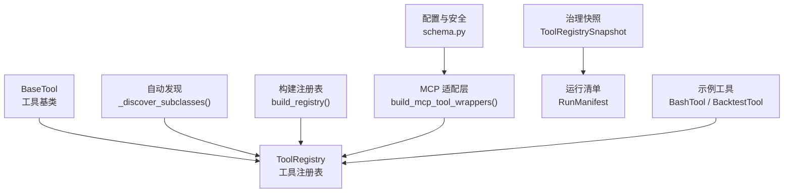
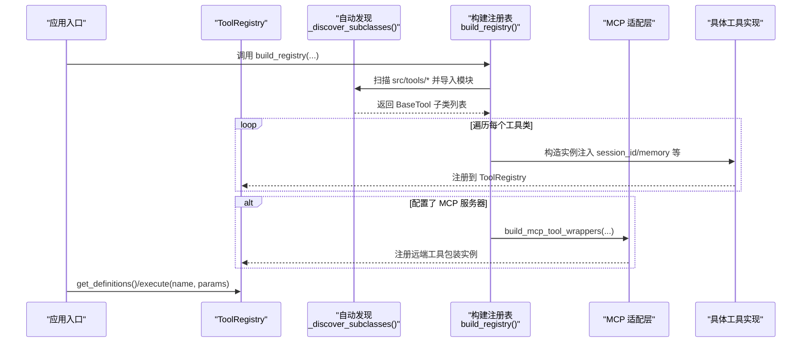
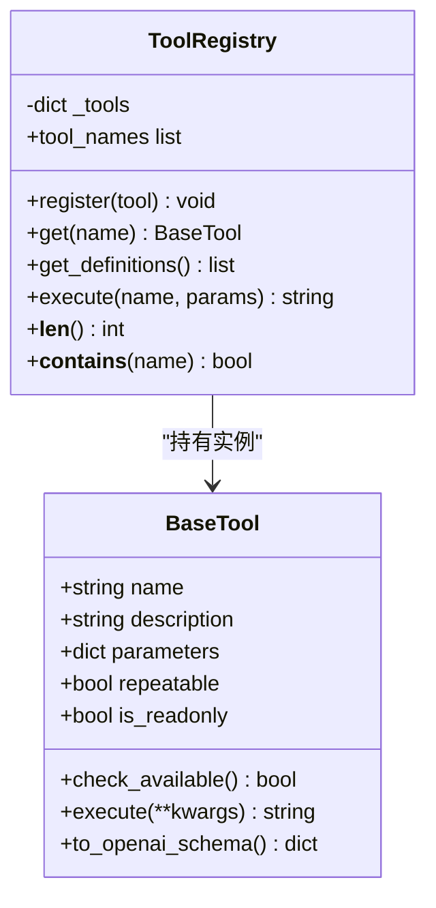
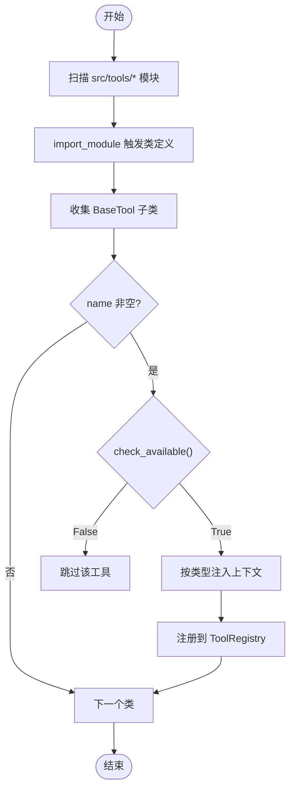
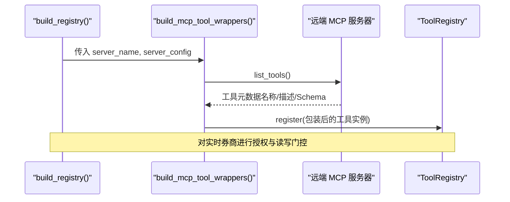
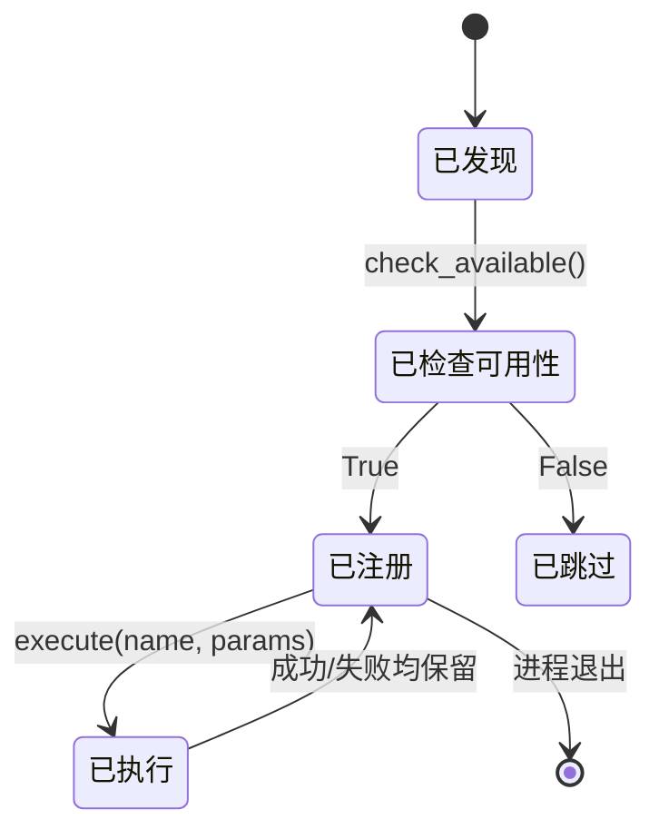

# 工具注册系统

<cite>
**本文引用的文件**
- [agent/src/agent/tools.py](file://agent/src/agent/tools.py)
- [agent/src/tools/__init__.py](file://agent/src/tools/__init__.py)
- [agent/src/tools/mcp.py](file://agent/src/tools/mcp.py)
- [agent/src/config/schema.py](file://agent/src/config/schema.py)
- [agent/src/governance/manifest.py](file://agent/src/governance/manifest.py)
- [agent/src/tools/bash_tool.py](file://agent/src/tools/bash_tool.py)
- [agent/src/tools/backtest_tool.py](file://agent/src/tools/backtest_tool.py)
</cite>

## 目录
1. [简介](#简介)
2. [项目结构](#项目结构)
3. [核心组件](#核心组件)
4. [架构总览](#架构总览)
5. [详细组件分析](#详细组件分析)
6. [依赖关系与版本兼容性](#依赖关系与版本兼容性)
7. [性能考量](#性能考量)
8. [故障排查指南](#故障排查指南)
9. [结论](#结论)
10. [附录：最佳实践与示例](#附录：最佳实践与示例)

## 简介
本文件系统性说明 Vibe-Trading 中“工具注册系统”的设计与实现，覆盖以下主题：
- 工具的动态发现机制：如何自动扫描并加载工具模块。
- 工具生命周期管理：从注册、初始化到销毁的完整流程。
- 依赖解析机制：工具间的依赖关系处理与版本兼容性检查。
- 工具元数据定义：参数验证、描述信息、权限控制等。
- 工具注册最佳实践：命名规范、错误处理、性能优化。
- 具体示例：如何注册新工具与自定义工具配置（以代码片段路径引用形式提供）。

## 项目结构
围绕工具注册系统的核心文件与职责如下：
- 基础抽象与注册表：BaseTool、ToolRegistry
- 自动发现与装配：src/tools/__init__.py 中的 _discover_subclasses() 与 build_registry()
- 远程工具集成：MCP 客户端适配器与包装器（src/tools/mcp.py）
- 运行可追溯性：RunManifest、ToolRegistrySnapshot（src/governance/manifest.py）
- 配置与安全策略：MCPServerConfig、实时券商识别与白名单（src/config/schema.py）
- 典型工具实现：BashTool、BacktestTool（src/tools/*.py）

图表来源
- [agent/src/agent/tools.py:13-95](file://agent/src/agent/tools.py#L13-L95)
- [agent/src/tools/__init__.py:33-245](file://agent/src/tools/__init__.py#L33-L245)
- [agent/src/tools/mcp.py:312-326](file://agent/src/tools/mcp.py#L312-L326)
- [agent/src/governance/manifest.py:159-186](file://agent/src/governance/manifest.py#L159-L186)
- [agent/src/config/schema.py:11-46](file://agent/src/config/schema.py#L11-L46)

章节来源
- [agent/src/agent/tools.py:13-95](file://agent/src/agent/tools.py#L13-L95)
- [agent/src/tools/__init__.py:33-245](file://agent/src/tools/__init__.py#L33-L245)

## 核心组件
- BaseTool：定义工具的最小契约（名称、描述、参数 Schema、是否可重复、是否只读），并提供 to_openai_schema() 用于 LLM 函数调用；通过 check_available() 声明依赖可用性。
- ToolRegistry：维护 name->tool 实例映射，支持注册、查询、导出 OpenAI 函数定义、统一执行与异常封装。
- 自动发现与装配：遍历 src/tools 包下所有模块，收集 BaseTool 子类，按策略注入会话 ID、持久化内存、Shell 工具开关等上下文后注册。
- MCP 适配层：将远端 MCP 服务器暴露的工具包装成本地 BaseTool 实例，合并进同一注册表，并对实时券商进行安全门控。
- 治理快照：对工具集合做去重排序并计算哈希，纳入 RunManifest，保证方法学可复现与可审计。

章节来源
- [agent/src/agent/tools.py:13-95](file://agent/src/agent/tools.py#L13-L95)
- [agent/src/tools/__init__.py:33-245](file://agent/src/tools/__init__.py#L33-L245)
- [agent/src/tools/mcp.py:312-326](file://agent/src/tools/mcp.py#L312-L326)
- [agent/src/governance/manifest.py:159-186](file://agent/src/governance/manifest.py#L159-L186)

## 架构总览
下图展示了工具从“静态定义”到“运行时可用”的全链路：

图表来源
- [agent/src/tools/__init__.py:66-245](file://agent/src/tools/__init__.py#L66-L245)
- [agent/src/tools/mcp.py:312-326](file://agent/src/tools/mcp.py#L312-L326)
- [agent/src/agent/tools.py:54-95](file://agent/src/agent/tools.py#L54-L95)

## 详细组件分析

### 工具基类与注册表
- BaseTool
  - 属性：name、description、parameters（JSON Schema）、repeatable、is_readonly
  - 能力：check_available() 声明依赖可用性；to_openai_schema() 生成函数调用定义
- ToolRegistry
  - 功能：register/get/get_definitions/execute/tool_names/len/contains
  - 执行保障：统一捕获异常并以 JSON 字符串返回错误状态

图表来源
- [agent/src/agent/tools.py:13-95](file://agent/src/agent/tools.py#L13-L95)

章节来源
- [agent/src/agent/tools.py:13-95](file://agent/src/agent/tools.py#L13-L95)

### 自动发现与装配
- 扫描策略：使用 pkgutil.iter_modules 遍历 src/tools 包下所有模块，跳过下划线前缀模块，逐个 import_module 触发类定义。
- 子类收集：基于 BaseTool.__subclasses__() 递归收集所有子类，过滤 name 非空的类。
- 注入策略：
  - RememberTool：注入共享 PersistentMemory
  - 目标/研究相关工具：注入 default_session_id 与 event_callback
  - SwarmTool：注入 include_shell_tools 与 event_callback
  - Shell 工具：默认禁用，需显式开启
- 可选扩展：若 agent_config.mcp_servers 存在，则追加远端工具包装实例。

图表来源
- [agent/src/tools/__init__.py:33-154](file://agent/src/tools/__init__.py#L33-L154)

章节来源
- [agent/src/tools/__init__.py:33-154](file://agent/src/tools/__init__.py#L33-L154)

### 远程工具集成（MCP）
- 作用：将远端 MCP 服务器暴露的工具转换为本地 BaseTool 实例，统一进入 ToolRegistry。
- 关键流程：
  - 根据 server_name 与 MCPServerConfig 构建缓存键，避免敏感信息泄露。
  - 建立连接、列出工具、生成包装器，并注册到注册表。
  - 对实时券商（如 Robinhood、IBKR）进行额外安全门控：未授权时跳过或仅注册只读工具。
- 交互模式：支持 stdio/SSE/StreamableHttp 等多种传输方式。

图表来源
- [agent/src/tools/mcp.py:312-326](file://agent/src/tools/mcp.py#L312-L326)
- [agent/src/tools/__init__.py:185-275](file://agent/src/tools/__init__.py#L185-L275)
- [agent/src/config/schema.py:11-46](file://agent/src/config/schema.py#L11-L46)

章节来源
- [agent/src/tools/mcp.py:312-326](file://agent/src/tools/mcp.py#L312-L326)
- [agent/src/tools/__init__.py:185-275](file://agent/src/tools/__init__.py#L185-L275)
- [agent/src/config/schema.py:11-46](file://agent/src/config/schema.py#L11-L46)

### 工具元数据与参数校验
- 元数据来源：BaseTool.parameters 采用 JSON Schema 格式，to_openai_schema() 将其转为 LLM 函数调用定义。
- 校验位置：由上层调用方（LLM 调用框架）依据 Schema 进行参数校验；工具内部也可在 execute 中进行二次校验。
- 权限控制：
  - is_readonly：标记工具是否为只读。
  - repeatable：允许重复调用。
  - 实时券商工具：通过 schema 中的 enabled_tools 与 URL 主机后缀检测，限制写操作。

章节来源
- [agent/src/agent/tools.py:13-51](file://agent/src/agent/tools.py#L13-L51)
- [agent/src/config/schema.py:11-46](file://agent/src/config/schema.py#L11-L46)

### 工具生命周期管理
- 注册阶段：
  - 自动发现模块 -> 收集子类 -> 检查可用性 -> 注入上下文 -> 注册到 ToolRegistry。
- 初始化阶段：
  - 工具实例在注册时创建，按需注入 session_id、memory、事件回调等。
- 执行阶段：
  - ToolRegistry.execute(name, params) 统一路由到对应工具，捕获异常并返回结构化 JSON。
- 销毁阶段：
  - 当前实现为进程内对象，随进程退出而释放；无显式 destroy 接口。若需资源清理，应在工具内部实现析构逻辑或在外部管理。

图表来源
- [agent/src/tools/__init__.py:136-154](file://agent/src/tools/__init__.py#L136-L154)
- [agent/src/agent/tools.py:72-84](file://agent/src/agent/tools.py#L72-L84)

章节来源
- [agent/src/tools/__init__.py:136-154](file://agent/src/tools/__init__.py#L136-L154)
- [agent/src/agent/tools.py:72-84](file://agent/src/agent/tools.py#L72-L84)

### 典型工具示例
- BashTool：执行 shell 命令，包含超时、输出截断、安全拦截等。
- BacktestTool：校验回测配置与信号脚本，调用内置引擎执行并收集产物。

章节来源
- [agent/src/tools/bash_tool.py:16-84](file://agent/src/tools/bash_tool.py#L16-L84)
- [agent/src/tools/backtest_tool.py:166-183](file://agent/src/tools/backtest_tool.py#L166-L183)

## 依赖关系与版本兼容性
- 工具级依赖检查：
  - 通过 BaseTool.check_available() 声明依赖（如 API Key、第三方包），不可用时被自动排除。
- 运行环境版本追踪：
  - collect_key_package_versions() 记录关键包版本（含 Python 解释器版本），纳入 RunManifest.tools_hash 与 package_versions，确保方法学可复现。
- 远程工具发现缓存：
  - MCP 工具规格按 server_name、配置指纹缓存，避免重复网络开销；支持失效刷新。
- 实时券商安全门控：
  - 通过 URL 主机后缀与配置键识别实时券商，未授权时跳过或仅注册只读工具，防止写操作越权。

章节来源
- [agent/src/agent/tools.py:43-50](file://agent/src/agent/tools.py#L43-L50)
- [agent/src/governance/manifest.py:534-567](file://agent/src/governance/manifest.py#L534-L567)
- [agent/src/tools/mcp.py:222-253](file://agent/src/tools/mcp.py#L222-L253)
- [agent/src/config/schema.py:11-46](file://agent/src/config/schema.py#L11-L46)

## 性能考量
- 自动发现缓存：_SUBCLASSES_CACHE 缓存子类列表，避免重复扫描与导入。
- MCP 规格缓存：按内容指纹缓存 list_tools 结果，减少网络往返。
- 工具执行隔离：ToolRegistry.execute 统一异常捕获，避免单个工具失败影响整体。
- Shell 工具默认禁用：降低安全风险与误用导致的性能损耗。
- 输出截断与超时：BashTool 限制输出长度与执行超时，防止阻塞与 OOM。

章节来源
- [agent/src/tools/__init__.py:29-63](file://agent/src/tools/__init__.py#L29-L63)
- [agent/src/tools/mcp.py:222-253](file://agent/src/tools/mcp.py#L222-L253)
- [agent/src/agent/tools.py:72-84](file://agent/src/agent/tools.py#L72-L84)
- [agent/src/tools/bash_tool.py:15-16](file://agent/src/tools/bash_tool.py#L15-L16)

## 故障排查指南
- 工具未被注册：
  - 检查 check_available() 是否返回 False。
  - 确认模块名未以下划线开头，且类名定义了非空 name。
- 工具执行报错：
  - ToolRegistry.execute 会捕获异常并返回 JSON 错误；查看日志与返回体定位问题。
- 远程工具不可用：
  - 检查 MCP 服务器配置、认证与网络连通性；关注警告日志中关于服务器跳过的提示。
- 实时券商工具被拒绝：
  - 确认已完成授权；未授权时将跳过或仅注册只读工具。

章节来源
- [agent/src/tools/__init__.py:136-154](file://agent/src/tools/__init__.py#L136-L154)
- [agent/src/agent/tools.py:72-84](file://agent/src/agent/tools.py#L72-L84)
- [agent/src/tools/__init__.py:185-275](file://agent/src/tools/__init__.py#L185-L275)
- [agent/src/config/schema.py:11-46](file://agent/src/config/schema.py#L11-L46)

## 结论
本工具注册系统通过“自动发现 + 统一注册表 + 远程适配 + 治理快照”的组合，实现了：
- 低耦合的工具扩展机制：新增工具只需继承 BaseTool 并放置于指定目录。
- 安全的远程集成：MCP 工具包装后与本地工具统一管理，并对实时券商进行强门控。
- 可复现的方法学记录：通过 ToolRegistrySnapshot 与 RunManifest 锁定工具集合与环境版本。
- 健壮的执行保障：统一异常处理与参数校验，提升系统稳定性。

## 附录：最佳实践与示例

### 命名规范
- 工具名唯一且语义清晰，避免与现有工具冲突。
- 远程工具建议遵循 mcp_<server>_<tool> 的命名约定，便于区分来源。

### 错误处理
- 在 BaseTool.execute 中捕获异常并返回结构化 JSON（status、error 等字段）。
- 对于可选依赖，重写 check_available() 返回 False，使工具静默排除。

### 性能优化
- 避免在自动发现阶段执行重 IO；将耗时逻辑延迟至工具执行。
- 合理使用 repeatable 与 is_readonly，减少不必要的副作用。
- 对长耗时任务（如 shell 命令、网络请求）设置超时与输出限制。

### 注册新工具（步骤）
- 新建工具类，继承 BaseTool，定义 name、description、parameters、execute。
- 将文件放入 src/tools/ 目录，无需额外注册代码。
- 如需注入上下文（如 session_id、memory），可在 build_registry 的注入分支中添加条件。

参考路径
- [agent/src/tools/bash_tool.py:16-84](file://agent/src/tools/bash_tool.py#L16-L84)
- [agent/src/tools/backtest_tool.py:166-183](file://agent/src/tools/backtest_tool.py#L166-L183)
- [agent/src/tools/__init__.py:136-154](file://agent/src/tools/__init__.py#L136-L154)

### 自定义工具配置（MCP）
- 在 agent_config.mcp_servers 中配置服务器地址、传输类型、认证与 enabled_tools。
- 对实时券商，确保仅启用只读工具或完成授权后再启用写操作。

参考路径
- [agent/src/config/schema.py:11-46](file://agent/src/config/schema.py#L11-L46)
- [agent/src/tools/__init__.py:185-275](file://agent/src/tools/__init__.py#L185-L275)
- [agent/src/tools/mcp.py:312-326](file://agent/src/tools/mcp.py#L312-L326)