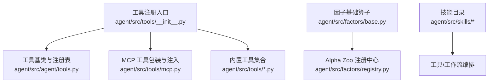
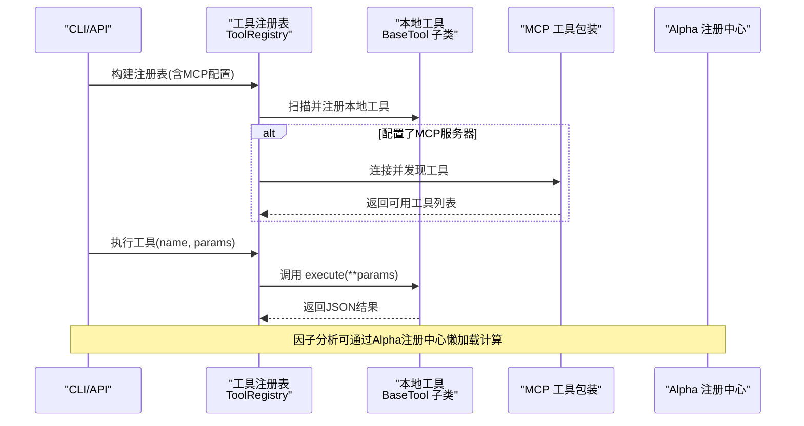
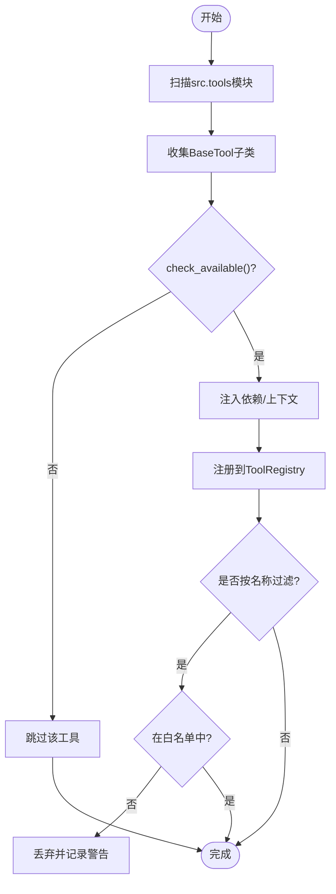
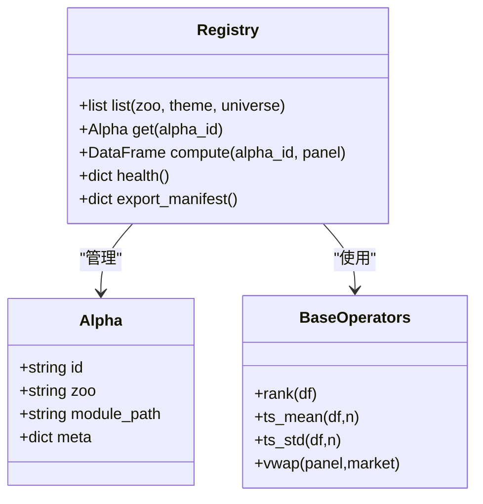
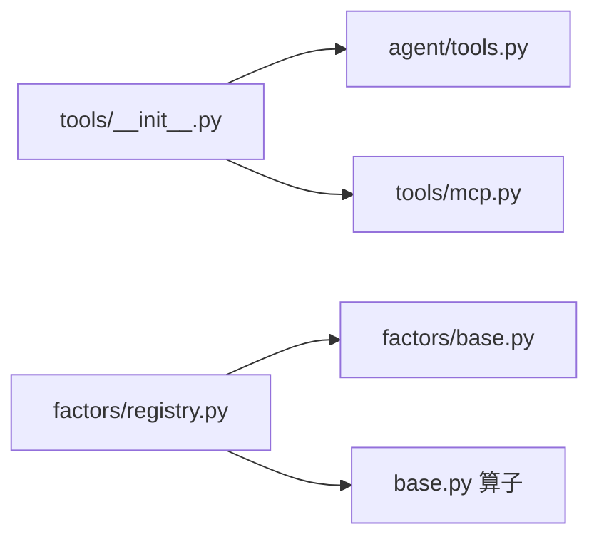

# 工具生态系统

<cite>
**本文引用的文件**
- [agent/src/tools/__init__.py](file://agent/src/tools/__init__.py)
- [agent/src/agent/tools.py](file://agent/src/agent/tools.py)
- [agent/src/factors/__init__.py](file://agent/src/factors/__init__.py)
- [agent/src/factors/base.py](file://agent/src/factors/base.py)
- [agent/src/factors/registry.py](file://agent/src/factors/registry.py)
- [README.md](file://README.md)
</cite>

## 目录
1. [简介](#简介)
2. [项目结构](#项目结构)
3. [核心组件](#核心组件)
4. [架构总览](#架构总览)
5. [详细组件分析](#详细组件分析)
6. [依赖关系分析](#依赖关系分析)
7. [性能考量](#性能考量)
8. [故障排查指南](#故障排查指南)
9. [结论](#结论)
10. [附录](#附录)

## 简介
本文件面向终端用户与工具开发者，系统性说明 Vibe-Trading 的工具生态系统：包括工具的动态发现与注册、生命周期管理、依赖解析；内置工具集合（市场分析、数据处理、策略开发等）的功能概览；技能系统（可插拔模块、描述、执行流程）；因子分析工具（460+ 学术因子库的使用与自定义因子开发）；以及工具开发与发布规范、组合编排最佳实践与实际应用场景。

## 项目结构
围绕“工具生态”的关键目录与职责：
- agent/src/tools：工具实现与自动发现、注册、过滤、MCP 集成入口
- agent/src/agent/tools：工具基类 BaseTool 与工具注册表 ToolRegistry
- agent/src/factors：因子计算基础算子与 Alpha Zoo 注册中心
- agent/src/skills：按主题划分的可插拔技能目录（如 alpha-zoo、options-payoff 等）
- README：版本更新与功能清单，包含大量工具能力演进记录

图表来源
- [agent/src/tools/__init__.py:33-245](file://agent/src/tools/__init__.py#L33-L245)
- [agent/src/agent/tools.py:13-95](file://agent/src/agent/tools.py#L13-L95)
- [agent/src/factors/base.py:27-356](file://agent/src/factors/base.py#L27-L356)
- [agent/src/factors/registry.py:201-454](file://agent/src/factors/registry.py#L201-L454)

章节来源
- [agent/src/tools/__init__.py:33-245](file://agent/src/tools/__init__.py#L33-L245)
- [agent/src/agent/tools.py:13-95](file://agent/src/agent/tools.py#L13-L95)
- [agent/src/factors/base.py:27-356](file://agent/src/factors/base.py#L27-L356)
- [agent/src/factors/registry.py:201-454](file://agent/src/factors/registry.py#L201-L454)

## 核心组件
- 工具基类与注册表
  - BaseTool：定义工具标识、描述、参数 Schema、是否可重复调用、只读标记及可用性检查钩子
  - ToolRegistry：维护工具实例映射，提供获取、执行、导出 OpenAI 函数调用 Schema 的能力，统一错误封装为 JSON
- 工具自动发现与注册
  - 通过包扫描导入 src.tools 下所有非私有模块，收集 BaseTool 子类并注册
  - 支持可选的 MCP 远程工具追加、会话注入、Shell 工具白名单控制、交互式环境下的实时券商通道安全门控
- 因子基础与注册中心
  - base.py 提供时间序列与截面算子（rank、ts_mean、ts_std、vwap 等），严格 NaN 传播与前瞻禁止
  - registry.py 以 AST 静态扫描 zoo 目录，校验元数据，惰性加载 compute 模块，输出形状与数值完整性校验

章节来源
- [agent/src/agent/tools.py:13-95](file://agent/src/agent/tools.py#L13-L95)
- [agent/src/tools/__init__.py:33-245](file://agent/src/tools/__init__.py#L33-L245)
- [agent/src/factors/base.py:27-356](file://agent/src/factors/base.py#L27-L356)
- [agent/src/factors/registry.py:201-454](file://agent/src/factors/registry.py#L201-L454)

## 架构总览
工具生态由“本地工具 + 可选远程 MCP 工具 + 技能编排 + 因子计算”构成。启动时构建工具注册表，按需注入会话上下文与安全策略；运行时通过注册表分发工具调用；因子计算通过注册中心懒加载并执行。

图表来源
- [agent/src/tools/__init__.py:66-245](file://agent/src/tools/__init__.py#L66-L245)
- [agent/src/agent/tools.py:54-95](file://agent/src/agent/tools.py#L54-L95)
- [agent/src/factors/registry.py:321-397](file://agent/src/factors/registry.py#L321-L397)

## 详细组件分析

### 工具注册机制（动态发现、生命周期、依赖解析）
- 动态发现
  - 遍历 src.tools 包内模块，跳过私有模块，导入后收集 BaseTool 子类
  - 缓存子类列表以避免重复扫描
- 生命周期管理
  - 注册阶段：根据工具类型注入持久化记忆、会话ID、事件回调、Shell 工具开关
  - 运行阶段：统一捕获异常，返回结构化 JSON 错误
  - 注销/过滤：支持按名称白名单过滤，未命中则记录警告
- 依赖解析
  - 每个工具可实现 check_available() 声明依赖（如 API Key、第三方包），不满足则静默排除
  - 对 Shell 工具默认禁用，需显式开启
  - 对实时券商通道进行安全门控：无授权或无交互环境时跳过注册

图表来源
- [agent/src/tools/__init__.py:33-154](file://agent/src/tools/__init__.py#L33-L154)
- [agent/src/tools/__init__.py:248-361](file://agent/src/tools/__init__.py#L248-L361)
- [agent/src/agent/tools.py:43-54](file://agent/src/agent/tools.py#L43-L54)

章节来源
- [agent/src/tools/__init__.py:33-245](file://agent/src/tools/__init__.py#L33-L245)
- [agent/src/tools/__init__.py:248-361](file://agent/src/tools/__init__.py#L248-L361)
- [agent/src/agent/tools.py:43-54](file://agent/src/agent/tools.py#L43-L54)

### 内置工具集合（市场、数据、策略）
- 市场与数据
  - 行情与基本面：get_market_data、financial_statements、fundamental filter、ETF holdings、sector、northbound、block trades、margin trading、prediction market、research papers/reports 等
  - 技术指标：technical_indicators（RSI/MACD/Bollinger/SMA/EMA 等）
  - 搜索与阅读：web_search、doc_reader、web_reader、image_vision、OCR
- 策略与回测
  - backtest_tool、alpha_bench_tool、alpha_compare_tool、shadow_account_tool、strategy-dev-manager 相关工具
- 交易与风控
  - trading_connector_tool、options_chain_tool、options_payoff_tool、orderbook_depth_tool、portfolio_risk_tool
- 研究与治理
  - goal_tool、hypothesis_tool、report_audit_tool、quantlib_tool、sdm_* 系列

使用方式
- 通过 CLI、Web UI、REST API 或 MCP 暴露的工具名直接调用
- 工具参数遵循 JSON Schema，执行结果统一为 JSON 字符串，便于 LLM 消费

章节来源
- [agent/src/tools/__init__.py:116-154](file://agent/src/tools/__init__.py#L116-L154)
- [README.md:1-166](file://README.md#L1-L166)

### 技能系统（可插拔模块、描述、执行流程）
- 可插拔组织
  - 技能位于 agent/src/skills 下，按主题划分（如 alpha-zoo、options-payoff、correlation-regime 等）
  - 技能通常包含 frontmatter 描述、参考代码、提示模板与工具编排脚本
- 执行流程
  - 通过 load_skill_tool 或工作流编排器加载技能
  - 技能内部可调用工具集、因子计算、报告生成等，形成端到端研究闭环
- 描述与元信息
  - 技能目录中的文档与 frontmatter 提供人类可读说明，便于 LLM 选择合适技能

章节来源
- [README.md:1-166](file://README.md#L1-L166)

### 因子分析工具（460+ 学术因子库与自定义开发）
- 因子库规模与分类
  - 覆盖 alpha101、gtja191、qlib158、academic、fundamental 等多个 zoo，合计 460+ 因子
- 使用方式
  - 通过 Alpha 注册中心列出、筛选并按 id 计算
  - 输入面板 panel 必须包含所需列（价格列或 fund:* 基本面列），缺失将跳过
- 自定义因子开发
  - 在对应 zoo 目录下新增 .py 模块，定义 __alpha_meta__ 元数据与 compute(panel) 函数
  - 遵守算子契约：宽表 DataFrame（index=交易日，columns=标的）、NaN 传播、禁止 inf/-inf、输出形状与 close 一致
  - 注册中心会做 AST 静态校验与运行时输出校验，确保安全性与一致性

图表来源
- [agent/src/factors/base.py:27-356](file://agent/src/factors/base.py#L27-L356)
- [agent/src/factors/registry.py:201-454](file://agent/src/factors/registry.py#L201-L454)

章节来源
- [agent/src/factors/__init__.py:1-49](file://agent/src/factors/__init__.py#L1-L49)
- [agent/src/factors/base.py:27-356](file://agent/src/factors/base.py#L27-L356)
- [agent/src/factors/registry.py:201-454](file://agent/src/factors/registry.py#L201-L454)

### 工具开发指南（接口规范、测试方法、发布流程）
- 接口规范
  - 继承 BaseTool，实现 name、description、parameters、execute
  - 如需依赖检查，重写 check_available()
  - 工具执行返回 JSON 字符串，错误路径由 ToolRegistry 统一封装
- 测试方法
  - 针对工具参数边界、网络超时、分页结果、空结果、非法输入等进行单测
  - 利用 ToolRegistry.execute 断言返回结构与错误消息
- 发布流程
  - 将新工具放入 src/tools 目录，命名避免私有前缀
  - 若涉及外部依赖，完善 check_available() 与环境提示
  - 通过 CLI、API、MCP 暴露后，补充 README 与示例

章节来源
- [agent/src/agent/tools.py:13-95](file://agent/src/agent/tools.py#L13-L95)
- [agent/src/tools/__init__.py:33-154](file://agent/src/tools/__init__.py#L33-L154)

### 工具组合与编排最佳实践
- 分层调用
  - 先数据后信号：先用市场/基本面工具拉取数据，再用技术/因子工具生成信号
- 安全门控
  - 对写操作（下单、调仓）启用 mandate 与 kill switch；读操作保持只读
- 幂等与重试
  - 对网络请求与分页工具增加重试与去重逻辑
- 可观测性
  - 使用 report_audit_tool、trace 与 run card 记录工具调用链与指标

章节来源
- [agent/src/tools/__init__.py:185-275](file://agent/src/tools/__init__.py#L185-L275)
- [README.md:1-166](file://README.md#L1-L166)

### 实际应用场景
- 简单查询
  - 通过 web_search/doc_reader 检索资料，结合 symbol_search/get_market_data 快速验证标的与价格
- 复杂分析工作流
  - 使用 factor_analysis_tool 或 alpha_zoo_tool 计算因子信号，结合 backtest_tool 进行回测，再通过 portfolio_risk_tool 评估风险
  - 借助 options_payoff_tool 做多腿期权策略损益分析，结合 quantlib_tool 进行定价与希腊值计算

章节来源
- [README.md:1-166](file://README.md#L1-L166)

## 依赖关系分析
- 组件耦合
  - tools/__init__.py 依赖 agent/tools.py 的 BaseTool 与 ToolRegistry
  - factors/registry.py 依赖 factors/base.py 的算子与 Market 枚举
- 外部依赖
  - MCP 工具通过配置注入，失败隔离不影响本地工具
  - 实时券商通道受安全门控限制，无授权时跳过注册
- 循环依赖
  - 通过延迟 import 与模块化设计避免循环引用

图表来源
- [agent/src/tools/__init__.py:33-245](file://agent/src/tools/__init__.py#L33-L245)
- [agent/src/agent/tools.py:13-95](file://agent/src/agent/tools.py#L13-L95)
- [agent/src/factors/registry.py:201-454](file://agent/src/factors/registry.py#L201-L454)
- [agent/src/factors/base.py:27-356](file://agent/src/factors/base.py#L27-L356)

章节来源
- [agent/src/tools/__init__.py:33-245](file://agent/src/tools/__init__.py#L33-L245)
- [agent/src/agent/tools.py:13-95](file://agent/src/agent/tools.py#L13-L95)
- [agent/src/factors/registry.py:201-454](file://agent/src/factors/registry.py#L201-L454)
- [agent/src/factors/base.py:27-356](file://agent/src/factors/base.py#L27-L356)

## 性能考量
- 因子计算优化
  - 使用 bottleneck/NumPy 向量化与滑动窗口视图提升滚动统计性能
  - 热路径使用进程级单例 Registry，避免重复 AST 扫描
- 工具执行
  - ToolRegistry.execute 统一异常捕获，减少上层处理开销
  - 分页与结果裁剪避免大对象传输
- 资源隔离
  - MCP 服务器失败隔离，不影响本地工具注册与执行

章节来源
- [agent/src/factors/base.py:93-356](file://agent/src/factors/base.py#L93-L356)
- [agent/src/factors/registry.py:447-478](file://agent/src/factors/registry.py#L447-L478)
- [agent/src/agent/tools.py:72-84](file://agent/src/agent/tools.py#L72-L84)

## 故障排查指南
- 工具不可用
  - 检查 check_available() 返回与依赖环境（API Key、第三方包）
  - 查看注册日志中“工具不可用/被跳过”的警告
- 工具执行失败
  - ToolRegistry 返回标准 JSON 错误结构，定位 tool 与 error 字段
  - 对网络/IO 工具增加重试与超时配置
- 因子计算异常
  - 确认 panel 包含 required columns，缺失将触发 SkipAlpha
  - 输出不能包含 inf/-inf，且 NaN 比例过高会被拒绝
- 实时券商通道未注册
  - 无授权或非交互环境会跳过注册，需在桌面会话完成授权

章节来源
- [agent/src/tools/__init__.py:136-245](file://agent/src/tools/__init__.py#L136-L245)
- [agent/src/agent/tools.py:72-84](file://agent/src/agent/tools.py#L72-L84)
- [agent/src/factors/registry.py:321-397](file://agent/src/factors/registry.py#L321-L397)

## 结论
Vibe-Trading 的工具生态系统以 BaseTool/ToolRegistry 为核心，结合自动发现、安全门控与 MCP 扩展，提供从数据、因子到策略与交易的完整工具链。Alpha Zoo 提供 460+ 学术因子，配合严格的算子契约与注册中心校验，保障因子质量与可复现性。技能系统使复杂工作流可插拔、可编排。通过 CLI、Web、API 与 MCP 多入口，既服务终端用户的高效分析，也为开发者提供清晰的扩展与发布规范。

## 附录
- 常用入口
  - CLI：vibe-trading 命令族
  - Web UI：设置、会话、回测、Alpha 库、对比等页面
  - REST API：/runs、/alpha、/channels 等路由
  - MCP：远程工具发现与调用
- 参考
  - README 中的版本更新与功能清单，涵盖工具能力演进与修复

章节来源
- [README.md:1-166](file://README.md#L1-L166)