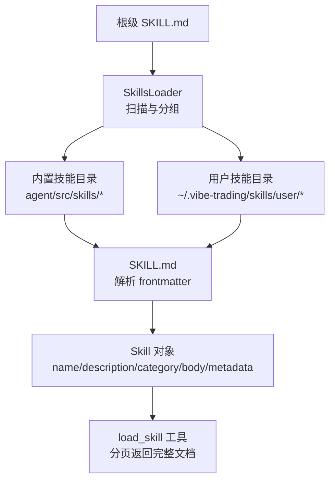
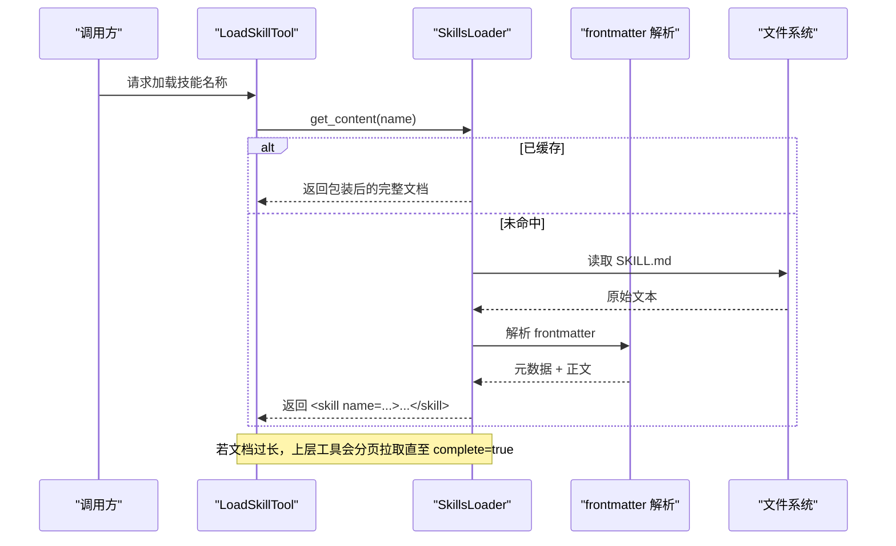
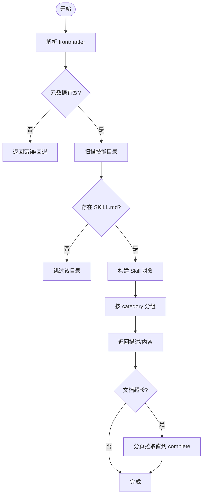
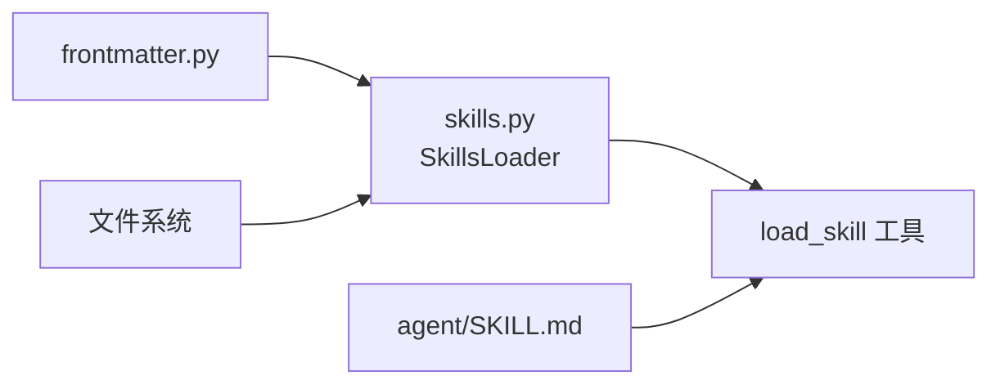

# 技能定义与描述

<cite>
**本文引用的文件**
- [agent/SKILL.md](file://agent/SKILL.md)
- [agent/src/agent/frontmatter.py](file://agent/src/agent/frontmatter.py)
- [agent/src/agent/skills.py](file://agent/src/agent/skills.py)
- [agent/src/skills/shadow-account/SKILL.md](file://agent/src/skills/shadow-account/SKILL.md)
- [agent/tests/test_skills.py](file://agent/tests/test_skills.py)
- [agent/tests/test_load_skill_paging.py](file://agent/tests/test_load_skill_paging.py)
</cite>

## 目录
1. [简介](#简介)
2. [项目结构](#项目结构)
3. [核心组件](#核心组件)
4. [架构总览](#架构总览)
5. [详细组件分析](#详细组件分析)
6. [依赖关系分析](#依赖关系分析)
7. [性能考量](#性能考量)
8. [故障排查指南](#故障排查指南)
9. [结论](#结论)
10. [附录：模板与最佳实践](#附录模板与最佳实践)

## 简介
本文件系统化说明 Vibe-Trading 的“技能”（Skill）定义与描述规范，覆盖 SKILL.md 的结构与语法、元数据字段含义、参数与依赖声明约定、命名与版本管理、兼容性要求、验证规则与错误处理机制。同时提供编写清晰技能文档的最佳实践，以及从简单数据查询到复杂分析工作流的多类型示例指引。

## 项目结构
- 根级 SKILL.md：作为整个项目的“超级技能”入口，集中描述安装、MCP 集成、能力概览、工具清单、快速开始等。
- 内置技能目录 agent/src/skills/*：每个子目录是一个独立技能，必须包含一个 SKILL.md 作为该技能的文档与元数据载体。
- 用户技能目录 ~/.vibe-trading/skills/user/*：用户可在此放置同名或新增技能，运行时优先加载并覆盖内置同名技能。
- 解析与加载器：frontmatter.py 负责解析 YAML-like 前置元数据；skills.py 负责扫描、组装、分页返回技能内容，并提供章节定位能力。

**图表来源**
- [agent/src/agent/skills.py:100-189](file://agent/src/agent/skills.py#L100-L189)
- [agent/src/agent/frontmatter.py:16-48](file://agent/src/agent/frontmatter.py#L16-L48)

**章节来源**
- [agent/SKILL.md:1-22](file://agent/SKILL.md#L1-L22)
- [agent/src/agent/skills.py:100-189](file://agent/src/agent/skills.py#L100-L189)
- [agent/src/agent/frontmatter.py:16-48](file://agent/src/agent/frontmatter.py#L16-L48)

## 核心组件
- 前置元数据解析器：支持字符串、列表、布尔值，兼容无正文或结尾无换行的边界情况。
- 技能模型 Skill：封装 name、description、category、body、dir_path、metadata，并支持按需加载辅助文件。
- 技能加载器 SkillsLoader：按优先级加载用户技能与内置技能，去重、分类、生成系统提示摘要，按需加载完整文档。
- 文档章节切分与寻址：将 Markdown 文档按 ATX 标题切分为章节，支持路径式地址定位（如“父节 > 子节”），忽略代码块内的标题。

**章节来源**
- [agent/src/agent/frontmatter.py:16-48](file://agent/src/agent/frontmatter.py#L16-L48)
- [agent/src/agent/skills.py:22-60](file://agent/src/agent/skills.py#L22-L60)
- [agent/src/agent/skills.py:100-189](file://agent/src/agent/skills.py#L100-L189)
- [agent/src/agent/skills.py:229-387](file://agent/src/agent/skills.py#L229-L387)

## 架构总览
技能系统在启动时扫描目录，解析每个技能的 SKILL.md 前置元数据，构建 Skill 对象集合；在运行时通过 load_skill 工具以分页方式返回完整文档，避免单次结果过大导致截断。章节切分与寻址使得调用方可精准定位到某一段落，提升大文档的可读性与可用性。

**图表来源**
- [agent/src/agent/skills.py:166-189](file://agent/src/agent/skills.py#L166-L189)
- [agent/src/agent/frontmatter.py:16-48](file://agent/src/agent/frontmatter.py#L16-L48)
- [agent/tests/test_load_skill_paging.py:30-43](file://agent/tests/test_load_skill_paging.py#L30-L43)

## 详细组件分析

### 元数据定义与字段语义
- name：技能唯一标识，用于系统内检索与加载；若缺失则回退为目录名，且不能为空。
- description：一句话描述，用于系统提示中列出可用技能。
- category：分类标签，影响展示顺序与分组；默认值为 other。
- dependencies/env/mcp：根级 SKILL.md 中的扩展字段，用于声明运行环境、环境变量与 MCP 服务配置；这些字段由根级文档承载，非每个技能必需。
- metadata：解析后保留的原始键值对，便于后续扩展。

注意：
- 根级 SKILL.md 使用 dependencies、env、mcp 等字段描述整体环境与集成；具体技能文档通常只关注 name/description/category 与正文。
- 列表与布尔值会被正确解析；空列表与末尾无换行均被支持。

**章节来源**
- [agent/SKILL.md:1-22](file://agent/SKILL.md#L1-L22)
- [agent/src/agent/frontmatter.py:16-48](file://agent/src/agent/frontmatter.py#L16-L48)
- [agent/src/agent/skills.py:65-94](file://agent/src/agent/skills.py#L65-L94)
- [agent/tests/test_skills.py:17-77](file://agent/tests/test_skills.py#L17-L77)

### 参数规范与依赖声明
- 参数规范：技能正文应明确说明所需输入参数、类型、取值范围、必填/可选、默认值及错误行为。建议以表格形式呈现，并在示例中给出最小可运行用例。
- 依赖声明：
  - 运行环境：Python 版本、必要包、可选增强包。
  - 外部服务：API Key、本地进程（如 TWS/Gateway）、MCP 服务器。
  - 数据源：市场、时间粒度、符号格式、限制与降级策略。
- 兼容性：
  - 不同市场的差异（如交易制度、涨跌停、手续费、最小交易单位）应在技能中显式说明。
  - 当存在多数据源时，应描述自动选择与回退顺序，以及何时需要显式指定 source。

**章节来源**
- [agent/SKILL.md:54-90](file://agent/SKILL.md#L54-L90)
- [agent/SKILL.md:135-209](file://agent/SKILL.md#L135-L209)

### 命名约定、版本管理与兼容性
- 命名约定：
  - 使用小写英文加连字符（kebab-case），如 shadow-account、options-payoff。
  - 避免空格与特殊字符，确保跨平台与命令行友好。
- 版本管理：
  - 根级 SKILL.md 包含 version 字段，用于标识整体发行版本。
  - 单个技能可通过自身 SKILL.md 的 version 字段进行演进（若采用）。
- 兼容性要求：
  - 明确 Python 版本约束与第三方库依赖。
  - 对不同市场/数据源的兼容性需注明已知限制与替代方案。

**章节来源**
- [agent/SKILL.md:1-6](file://agent/SKILL.md#L1-L6)
- [agent/src/agent/skills.py:120-135](file://agent/src/agent/skills.py#L120-L135)

### 技能描述字段含义
- 名称（name）：技能标识，用于加载与引用。
- 描述（description）：面向用户的简短说明，出现在系统提示的技能列表中。
- 作者（author）：当前实现未强制解析 author 字段；如需记录作者信息，可在 metadata 或正文中体现。
- 版本（version）：根级 SKILL.md 提供整体版本；技能级版本可按需添加。
- 依赖（dependencies/env）：根级 SKILL.md 声明全局运行环境与可选 API Key；具体技能可在正文中补充特定依赖。
- 分类（category）：用于分组与排序，常见值包括 data-source、strategy、analysis、asset-class、crypto、flow、tool、other。

**章节来源**
- [agent/SKILL.md:1-22](file://agent/SKILL.md#L1-L22)
- [agent/src/agent/skills.py:137-164](file://agent/src/agent/skills.py#L137-L164)

### 不同类型技能的定义示例
- 简单数据查询型：
  - 目标：获取某标的行情或基本面数据。
  - 要点：明确数据源、时间范围、符号格式、失败回退与限流策略。
- 分析工作流型：
  - 目标：组合多个工具完成研究闭环（如影子账户四步流程）。
  - 要点：步骤化描述、中间产物、确认点、输出物与解读方法。
- 量化策略型：
  - 目标：因子研究、回测、绩效归因。
  - 要点：因子定义、样本外测试、滑点与成本建模、稳健性检验。

参考示例路径：
- 影子账户工作流示例：[shadow-account SKILL.md](file://agent/src/skills/shadow-account/SKILL.md)
- 根级能力与工具清单：[agent/SKILL.md](file://agent/SKILL.md)

**章节来源**
- [agent/src/skills/shadow-account/SKILL.md:15-27](file://agent/src/skills/shadow-account/SKILL.md#L15-L27)
- [agent/SKILL.md:67-133](file://agent/SKILL.md#L67-L133)

### 技能验证规则与错误处理
- 前置元数据校验：
  - 支持字符串、列表、布尔值；空列表与无尾换行场景通过。
  - 若无 frontmatter，则视为纯正文。
- 技能加载校验：
  - 缺少 SKILL.md 的目录将被跳过。
  - 同名技能以用户目录优先，内置同名被覆盖。
  - 未知技能名返回错误消息并附带可用技能列表。
- 分页与完整性：
  - 长文档通过分页拉取，每次返回是否 complete、next_offset、total_chars。
  - 分页过程保证最终重建内容与内存一致，且单页不超过工具结果上限。
- 章节定位：
  - 支持路径式地址匹配，区分大小写与空白折叠，重复标题通过祖先路径消歧。

**图表来源**
- [agent/src/agent/frontmatter.py:16-48](file://agent/src/agent/frontmatter.py#L16-L48)
- [agent/src/agent/skills.py:120-189](file://agent/src/agent/skills.py#L120-L189)
- [agent/tests/test_load_skill_paging.py:51-109](file://agent/tests/test_load_skill_paging.py#L51-L109)

**章节来源**
- [agent/tests/test_skills.py:17-184](file://agent/tests/test_skills.py#L17-L184)
- [agent/tests/test_load_skill_paging.py:51-109](file://agent/tests/test_load_skill_paging.py#L51-L109)

## 依赖关系分析
- SkillsLoader 依赖 frontmatter 解析器与文件系统。
- SkillsLoader 对外暴露 get_descriptions 与 get_content，供工具层（如 load_skill）消费。
- 根级 SKILL.md 描述了整体依赖（Python 版本、pip 包、MCP 命令与环境变量），而具体技能在正文中细化其依赖与用法。

**图表来源**
- [agent/src/agent/frontmatter.py:16-48](file://agent/src/agent/frontmatter.py#L16-L48)
- [agent/src/agent/skills.py:100-189](file://agent/src/agent/skills.py#L100-L189)
- [agent/SKILL.md:1-22](file://agent/SKILL.md#L1-L22)

**章节来源**
- [agent/src/agent/skills.py:100-189](file://agent/src/agent/skills.py#L100-L189)
- [agent/SKILL.md:1-22](file://agent/SKILL.md#L1-L22)

## 性能考量
- 渐进式披露：系统提示仅注入一行摘要，完整文档按需加载，降低上下文占用。
- 分页机制：针对超大文档（如 tushare、options-payoff 等）采用分页，避免单次结果超限。
- 章节切分：基于 ATX 标题切分，减少无关内容传输，提高定位效率。
- 目录扫描：用户目录优先加载，支持热替换与覆盖，但不会热重载进程，需重启生效。

**章节来源**
- [agent/src/agent/skills.py:1-12](file://agent/src/agent/skills.py#L1-L12)
- [agent/tests/test_load_skill_paging.py:1-10](file://agent/tests/test_load_skill_paging.py#L1-L10)
- [agent/SKILL.md:373-379](file://agent/SKILL.md#L373-L379)

## 故障排查指南
- 无法找到技能：
  - 检查技能目录是否存在 SKILL.md，且 name 字段正确。
  - 确认用户目录与内置目录未被误删或权限不足。
- 文档不完整：
  - 使用分页接口继续拉取，直到 complete=true。
  - 检查 next_offset 与 total_chars，确保未越界。
- 元数据解析异常：
  - 确认 frontmatter 使用 --- 分隔，键值对以冒号分隔。
  - 列表与布尔值书写符合预期，避免非法字符。
- 章节定位歧义：
  - 使用“父节 > 子节”的路径式地址消除重复标题带来的歧义。

**章节来源**
- [agent/tests/test_skills.py:159-184](file://agent/tests/test_skills.py#L159-L184)
- [agent/tests/test_load_skill_paging.py:51-109](file://agent/tests/test_load_skill_paging.py#L51-L109)
- [agent/src/agent/skills.py:229-387](file://agent/src/agent/skills.py#L229-L387)

## 结论
Vibe-Trading 的技能体系以 SKILL.md 为核心载体，结合轻量化的 frontmatter 解析与健壮的分页加载机制，实现了可扩展、可维护、可发现的能力组织方式。通过明确的命名、版本与兼容性约定，以及完善的验证与错误处理，技能既能承载简单查询，也能支撑复杂分析工作流。遵循本文档的模板与最佳实践，可显著提升技能文档的质量与可执行性。

## 附录：模板与最佳实践

### SKILL.md 模板（建议结构）
- 前置元数据
  - name：技能唯一标识
  - description：一句话描述
  - category：分类（data-source/strategy/analysis/asset-class/crypto/flow/tool/other）
  - version：版本号（可选）
  - dependencies：运行依赖（可选，建议在根级 SKILL.md 统一声明）
  - env：环境变量（可选，建议在根级 SKILL.md 统一声明）
- 正文
  - 何时触发：触发条件与前提
  - 工作流：步骤化流程，明确输入、输出、确认点
  - 参数规范：表格列出参数名、类型、必填/可选、默认值、取值范围、示例
  - 依赖与兼容性：数据源、市场差异、限制与回退
  - 产出解读：如何解释结果与报告
  - 对话模板：典型交互话术
  - 红线与约束：安全与合规注意事项

参考路径：
- 影子账户技能示例：[shadow-account SKILL.md](file://agent/src/skills/shadow-account/SKILL.md)
- 根级能力与工具清单：[agent/SKILL.md](file://agent/SKILL.md)

### 最佳实践
- 保持描述简洁明确，避免术语堆砌。
- 参数表要完备，示例要可复制运行。
- 对多数据源与多市场差异进行显式说明。
- 对长文档进行章节切分，便于定位与复用。
- 对错误与边界情况进行说明与兜底策略。
- 对用户可见的输出提供解读模板与风险提示。

**章节来源**
- [agent/src/skills/shadow-account/SKILL.md:9-80](file://agent/src/skills/shadow-account/SKILL.md#L9-L80)
- [agent/SKILL.md:67-133](file://agent/SKILL.md#L67-L133)