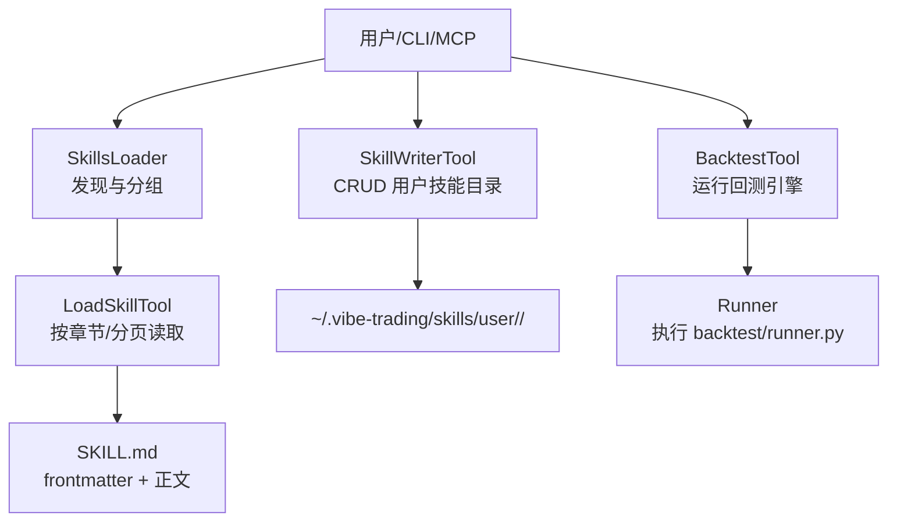
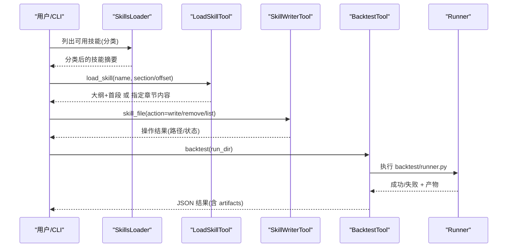
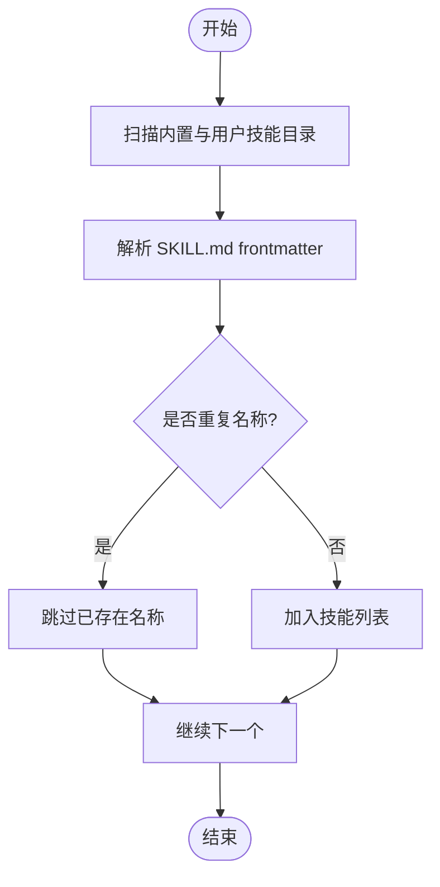
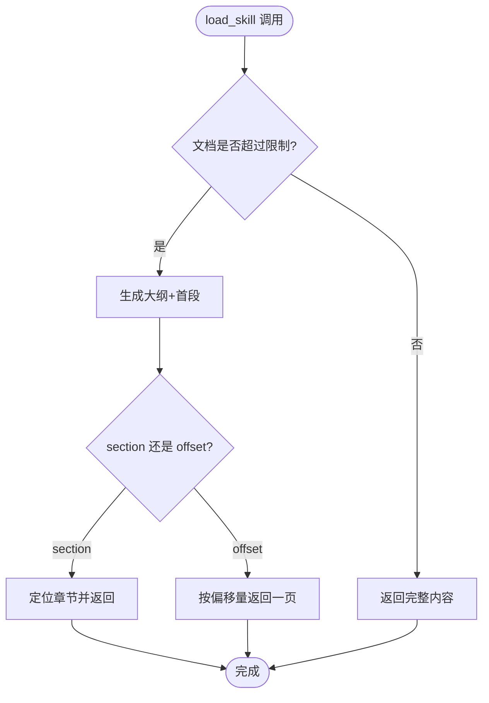
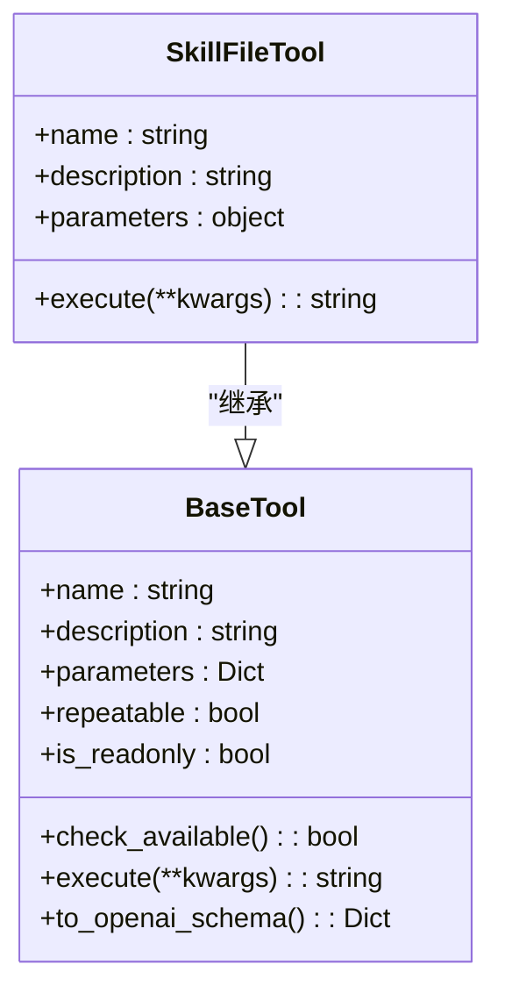
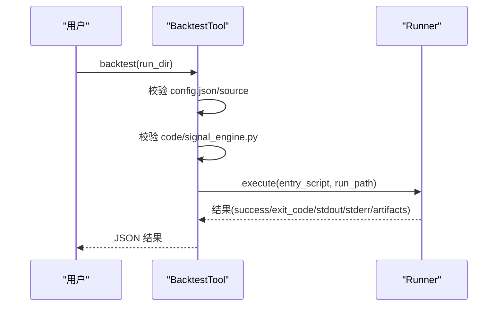
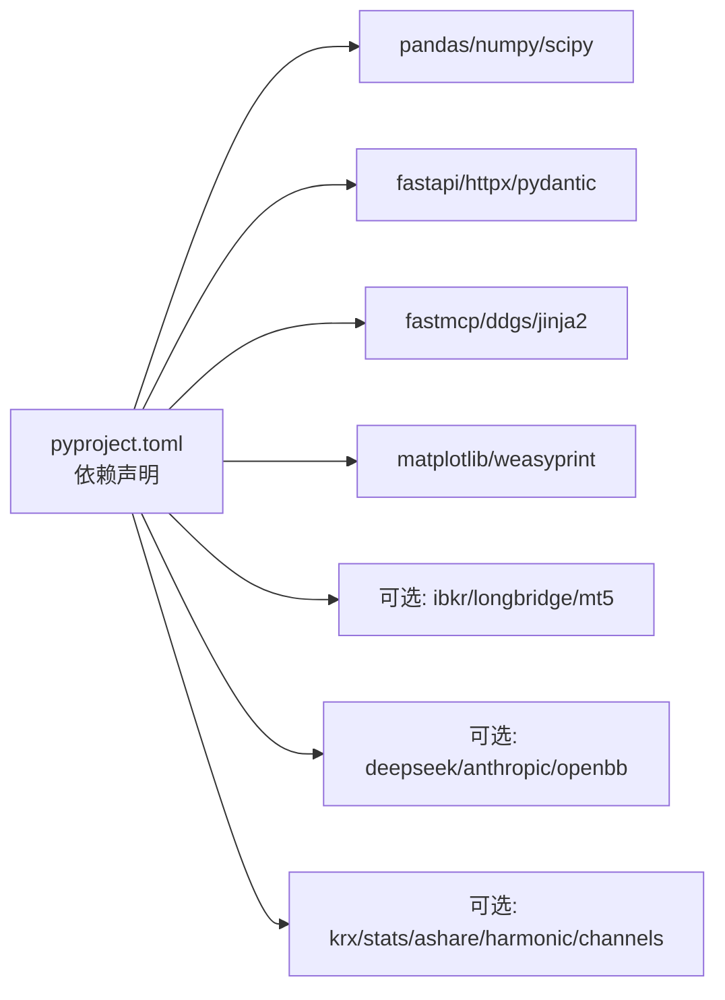

# 技能开发指南

<cite>
**本文引用的文件**
- [agent/SKILL.md](file://agent/SKILL.md)
- [agent/src/agent/skills.py](file://agent/src/agent/skills.py)
- [agent/src/tools/load_skill_tool.py](file://agent/src/tools/load_skill_tool.py)
- [agent/src/tools/skill_writer_tool.py](file://agent/src/tools/skill_writer_tool.py)
- [agent/src/agent/frontmatter.py](file://agent/src/agent/frontmatter.py)
- [agent/src/tools/backtest_tool.py](file://agent/src/tools/backtest_tool.py)
- [agent/src/agent/tools.py](file://agent/src/agent/tools.py)
- [pyproject.toml](file://pyproject.toml)
- [CONTRIBUTING.md](file://CONTRIBUTING.md)
- [README.md](file://README.md)
</cite>

## 目录
1. [简介](#简介)
2. [项目结构](#项目结构)
3. [核心组件](#核心组件)
4. [架构总览](#架构总览)
5. [详细组件分析](#详细组件分析)
6. [依赖关系分析](#依赖关系分析)
7. [性能与可扩展性](#性能与可扩展性)
8. [故障排查](#故障排查)
9. [结论](#结论)
10. [附录：从简单到复杂的技能示例](#附录从简单到复杂的技能示例)

## 简介
本指南面向希望在 Vibe-Trading 中开发“技能”的开发者。技能是以 SKILL.md 文档为核心的可发现、可加载、可分页阅读的知识与流程模板，配合内置工具链（数据获取、回测、因子分析、期权定价等）完成从研究到策略落地的闭环。本文覆盖环境搭建、代码结构、接口实现、最佳实践、测试策略、常用工具库、调试方法以及发布与社区贡献流程。

## 项目结构
Vibe-Trading 的技能体系位于 agent/src/skills 目录下，每个技能一个子目录，包含一份 SKILL.md（可选 references/templates/examples/assets）。系统通过 SkillsLoader 自动发现并分组展示，LoadSkillTool 提供按章节或分页读取能力；SkillWriterTool 支持用户创建与管理技能目录及辅助文件。

图表来源
- [agent/src/agent/skills.py:100-189](file://agent/src/agent/skills.py#L100-L189)
- [agent/src/tools/load_skill_tool.py:150-200](file://agent/src/tools/load_skill_tool.py#L150-L200)
- [agent/src/tools/skill_writer_tool.py:235-274](file://agent/src/tools/skill_writer_tool.py#L235-L274)
- [agent/src/tools/backtest_tool.py:15-95](file://agent/src/tools/backtest_tool.py#L15-L95)

章节来源
- [agent/src/agent/skills.py:100-189](file://agent/src/agent/skills.py#L100-L189)
- [agent/src/tools/load_skill_tool.py:150-200](file://agent/src/tools/load_skill_tool.py#L150-L200)
- [agent/src/tools/skill_writer_tool.py:235-274](file://agent/src/tools/skill_writer_tool.py#L235-L274)
- [agent/src/tools/backtest_tool.py:15-95](file://agent/src/tools/backtest_tool.py#L15-L95)

## 核心组件
- 技能加载器 SkillsLoader：扫描内置与用户技能目录，解析 frontmatter，提供分类列表与按需全文加载。
- 技能读取工具 LoadSkillTool：将长文档拆分为“大纲+首段”，再按章节名或偏移量分页返回，避免单次结果超限。
- 技能写入工具 SkillWriterTool：在用户目录创建/更新/删除技能及其辅助文件（references/templates/examples/assets），并对名称进行安全化。
- Frontmatter 解析器：轻量 YAML-like 头部解析，支持字符串、列表、布尔值。
- 回测工具 BacktestTool：校验 run_dir 下的 config.json 与 signal_engine.py，调用 Runner 执行内置回测引擎并收集产物。
- 工具基类 BaseTool：统一 name/description/parameters/repeatable/is_readonly 契约，便于注册与暴露给 LLM。

章节来源
- [agent/src/agent/skills.py:100-189](file://agent/src/agent/skills.py#L100-L189)
- [agent/src/tools/load_skill_tool.py:150-200](file://agent/src/tools/load_skill_tool.py#L150-L200)
- [agent/src/tools/skill_writer_tool.py:235-274](file://agent/src/tools/skill_writer_tool.py#L235-L274)
- [agent/src/agent/frontmatter.py:16-48](file://agent/src/agent/frontmatter.py#L16-L48)
- [agent/src/tools/backtest_tool.py:15-95](file://agent/src/tools/backtest_tool.py#L15-L95)
- [agent/src/agent/tools.py:13-51](file://agent/src/agent/tools.py#L13-L51)

## 架构总览
技能生命周期包括：发现 → 描述聚合 → 按需加载 → 辅助文件管理 → 与工具链联动（如回测、数据获取、因子分析）。

图表来源
- [agent/src/agent/skills.py:100-189](file://agent/src/agent/skills.py#L100-L189)
- [agent/src/tools/load_skill_tool.py:150-200](file://agent/src/tools/load_skill_tool.py#L150-L200)
- [agent/src/tools/skill_writer_tool.py:235-274](file://agent/src/tools/skill_writer_tool.py#L235-L274)
- [agent/src/tools/backtest_tool.py:15-95](file://agent/src/tools/backtest_tool.py#L15-L95)

## 详细组件分析

### 技能加载与组织（SkillsLoader）
- 行为：优先加载用户技能以覆盖同名内置技能；按 category 排序输出；支持 get_descriptions/get_content。
- 关键点：
  - 用户技能目录默认 ~/.vibe-trading/skills/user/。
  - 通过 frontmatter 解析 name/description/category。
  - 对大文档采用“大纲+首段”的分页策略，由 LoadSkillTool 驱动。

图表来源
- [agent/src/agent/skills.py:100-136](file://agent/src/agent/skills.py#L100-L136)
- [agent/src/agent/frontmatter.py:16-48](file://agent/src/agent/frontmatter.py#L16-L48)

章节来源
- [agent/src/agent/skills.py:100-189](file://agent/src/agent/skills.py#L100-L189)
- [agent/src/agent/frontmatter.py:16-48](file://agent/src/agent/frontmatter.py#L16-L48)

### 技能读取（LoadSkillTool）
- 行为：短文档直接返回完整内容；长文档先返回大纲与首段，再按 section 或 offset 分页。
- 关键点：
  - 使用 TOOL_RESULT_LIMIT 控制序列化大小，动态调整页面大小。
  - 重复标题使用“父级 > 子级”路径唯一标识。
  - 支持 offset 连续翻页，complete 标志指示是否读完。

图表来源
- [agent/src/tools/load_skill_tool.py:55-147](file://agent/src/tools/load_skill_tool.py#L55-L147)
- [agent/src/tools/load_skill_tool.py:150-200](file://agent/src/tools/load_skill_tool.py#L150-L200)

章节来源
- [agent/src/tools/load_skill_tool.py:55-147](file://agent/src/tools/load_skill_tool.py#L55-L147)
- [agent/src/tools/load_skill_tool.py:150-200](file://agent/src/tools/load_skill_tool.py#L150-L200)

### 技能管理（SkillWriterTool）
- 行为：在用户技能目录中写/删/列辅助文件；对技能名进行安全化 slug。
- 关键点：
  - 允许的子目录：references、templates、examples、assets。
  - 名称清洗规则保留多语言字符范围，防止非法字符。
  - 与 SkillsLoader 的用户目录一致，确保即时生效。

图表来源
- [agent/src/tools/skill_writer_tool.py:235-274](file://agent/src/tools/skill_writer_tool.py#L235-L274)
- [agent/src/agent/tools.py:13-51](file://agent/src/agent/tools.py#L13-L51)

章节来源
- [agent/src/tools/skill_writer_tool.py:235-274](file://agent/src/tools/skill_writer_tool.py#L235-L274)
- [agent/src/agent/tools.py:13-51](file://agent/src/agent/tools.py#L13-L51)

### 回测集成（BacktestTool）
- 行为：校验 run_dir/config.json 与 code/signal_engine.py，调用 Runner 执行回测，收集 artifacts。
- 关键点：
  - source 必须为受支持的合法来源。
  - 超时保护与进度事件 emit_progress。
  - 返回结构化 JSON，包含 stdout/stderr/artifacts/run_dir。

图表来源
- [agent/src/tools/backtest_tool.py:15-95](file://agent/src/tools/backtest_tool.py#L15-L95)

章节来源
- [agent/src/tools/backtest_tool.py:15-95](file://agent/src/tools/backtest_tool.py#L15-L95)

## 依赖关系分析
- Python 版本要求：>=3.11,<3.14。
- 关键依赖：pandas、numpy、scipy、fastapi、httpx、pydantic、sse-starlette、fastmcp、ddgs、jinja2、matplotlib、weasyprint 等。
- 可选扩展：ibkr、longbridge、mt5、deepseek、anthropic、openbb、krx、stats、ashare、harmonic、channels 等。
- CLI 入口：vibe-trading、vibe-trading-mcp。

图表来源
- [pyproject.toml:1-279](file://pyproject.toml#L1-L279)

章节来源
- [pyproject.toml:1-279](file://pyproject.toml#L1-L279)

## 性能与可扩展性
- 技能文档分页：基于 TOOL_RESULT_LIMIT 的动态分页，避免超大响应阻塞。
- 回测执行：Runner 超时保护，stdout/stderr 截断，artifacts 收集。
- 可扩展点：
  - 新增数据源：遵循 DataLoader 协议并在 registry 注册。
  - 新增因子/Alpha：遵守 AST 纯度与前瞻泄露检查。
  - 新增工具：继承 BaseTool，定义 schema，纳入注册表。

[本节为通用指导，不直接分析具体文件]

## 故障排查
- 技能未找到：确认名称与 frontmatter.name 一致；检查用户目录是否存在 SKILL.md。
- 文档过长无法一次加载：使用 LoadSkillTool 的 section 或 offset 分页。
- 回测失败：检查 config.json 的 source 是否为受支持来源；确认 code/signal_engine.py 存在且可导入。
- 工具不可用：检查 check_available 依赖（API Key、可选包）；查看 is_readonly 与 repeatable 配置是否符合预期。

章节来源
- [agent/src/agent/skills.py:166-189](file://agent/src/agent/skills.py#L166-L189)
- [agent/src/tools/load_skill_tool.py:150-200](file://agent/src/tools/load_skill_tool.py#L150-L200)
- [agent/src/tools/backtest_tool.py:15-95](file://agent/src/tools/backtest_tool.py#L15-L95)
- [agent/src/agent/tools.py:43-50](file://agent/src/agent/tools.py#L43-L50)

## 结论
Vibe-Trading 的技能体系以 SKILL.md 为核心，结合 SkillsLoader、LoadSkillTool、SkillWriterTool 形成“发现—阅读—管理—联动”的完整闭环。通过统一的 BaseTool 契约与丰富的内置工具（数据、回测、因子、期权等），开发者可以快速构建从研究到策略验证的可复用知识单元，并通过社区贡献流程持续完善生态。

[本节为总结，不直接分析具体文件]

## 附录：从简单到复杂的技能示例

### 示例一：数据获取型技能（A股/美股/加密）
- 目标：封装特定市场的数据获取流程与注意事项。
- 步骤：
  1) 在 agent/src/skills 下新建目录，编写 SKILL.md（frontmatter 设置 name/description/category）。
  2) 在 examples/ 或 templates/ 中提供最小可运行的脚本片段。
  3) 通过 LoadSkillTool 验证可读性与分页效果。
  4) 如需回测，参考 BacktestTool 的流程准备 config.json 与 signal_engine.py。

章节来源
- [agent/src/agent/skills.py:100-189](file://agent/src/agent/skills.py#L100-L189)
- [agent/src/tools/load_skill_tool.py:150-200](file://agent/src/tools/load_skill_tool.py#L150-L200)
- [agent/src/tools/backtest_tool.py:15-95](file://agent/src/tools/backtest_tool.py#L15-L95)

### 示例二：策略生成型技能（信号引擎）
- 目标：提供策略骨架与回测模板，降低上手成本。
- 步骤：
  1) 使用 SkillWriterTool 创建用户技能目录与模板文件。
  2) 在 SKILL.md 中说明参数、约束与回测配置字段。
  3) 通过 BacktestTool 执行回测，收集 artifacts 并评估指标。
  4) 迭代优化信号逻辑与风控规则。

章节来源
- [agent/src/tools/skill_writer_tool.py:235-274](file://agent/src/tools/skill_writer_tool.py#L235-L274)
- [agent/src/tools/backtest_tool.py:15-95](file://agent/src/tools/backtest_tool.py#L15-L95)

### 示例三：复杂策略（多因子/期权组合）
- 目标：结合因子研究与期权定价工具，构建复杂策略。
- 步骤：
  1) 在 SKILL.md 中定义因子选择、权重分配与入场出场条件。
  2) 使用 Alpha Zoo 与因子分析工具进行横截面分析与回测。
  3) 使用期权工具进行风险对冲与收益分布分析。
  4) 通过 BacktestTool 产出报告与风险透视。

章节来源
- [agent/SKILL.md:112-133](file://agent/SKILL.md#L112-L133)
- [agent/src/tools/backtest_tool.py:15-95](file://agent/src/tools/backtest_tool.py#L15-L95)

### 发布与分发
- 内置技能：放入 agent/src/skills 目录，随包发布。
- 用户技能：存放于 ~/.vibe-trading/skills/user/<skill>/，通过 SkillWriterTool 管理。
- 文档一致性：SKILL.md 的 frontmatter 需与 README 中的分类计数保持一致（仓库有对应测试保障）。

章节来源
- [agent/src/agent/skills.py:100-136](file://agent/src/agent/skills.py#L100-L136)
- [agent/tests/test_readme_counts.py:526-542](file://agent/tests/test_readme_counts.py#L526-L542)

### 社区贡献流程
- 提交规范：所有 PR 需带 Signed-off-by（DCO）。
- 代码风格：black/ruff，类型注解，Google 风格 docstring。
- 因子贡献：遵循 Alpha PR Reviewer Checklist（AST 纯度、前瞻泄露、__alpha_meta__ 完整性等）。
- 快速入门：在 factors/zoo 下新增 alpha 文件，运行纯度与前瞻测试，必要时执行 bench。

章节来源
- [CONTRIBUTING.md:18-41](file://CONTRIBUTING.md#L18-L41)
- [CONTRIBUTING.md:85-138](file://CONTRIBUTING.md#L85-L138)
- [CONTRIBUTING.md:140-155](file://CONTRIBUTING.md#L140-L155)