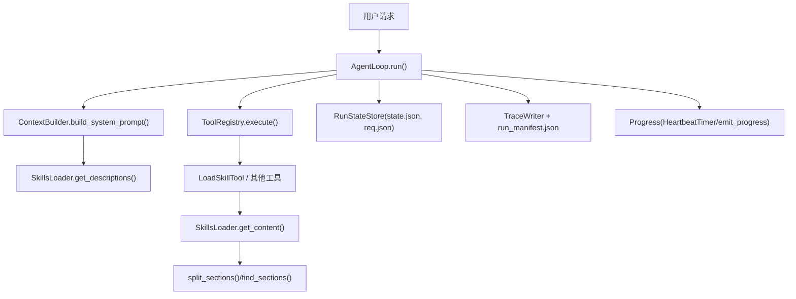
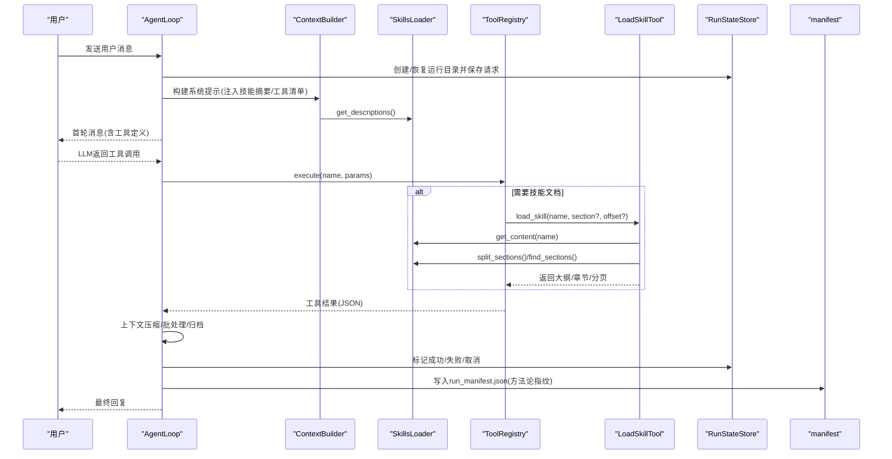
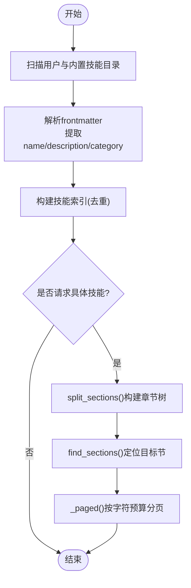
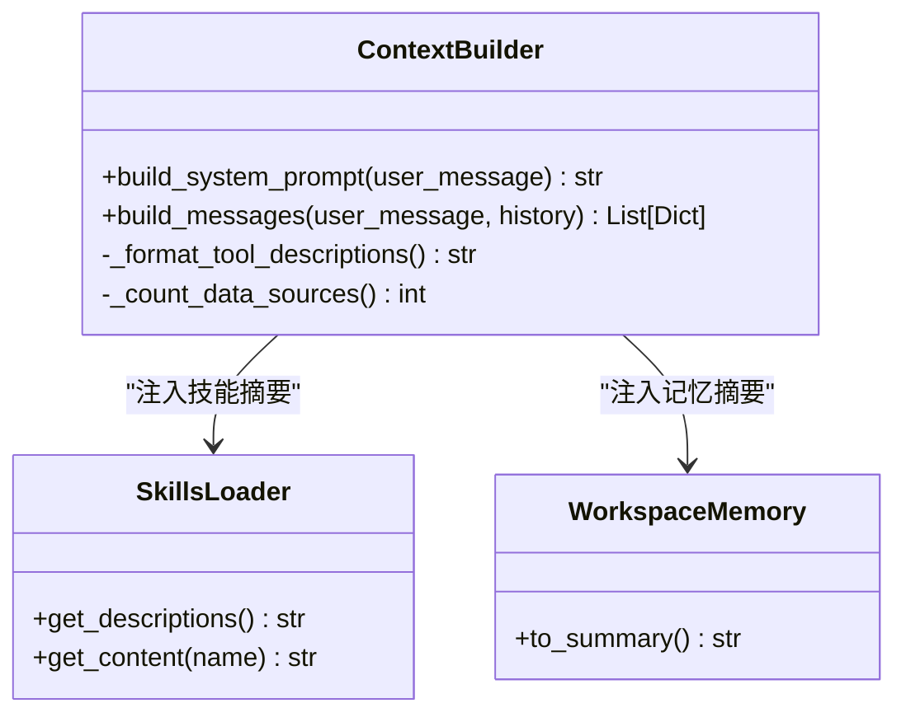
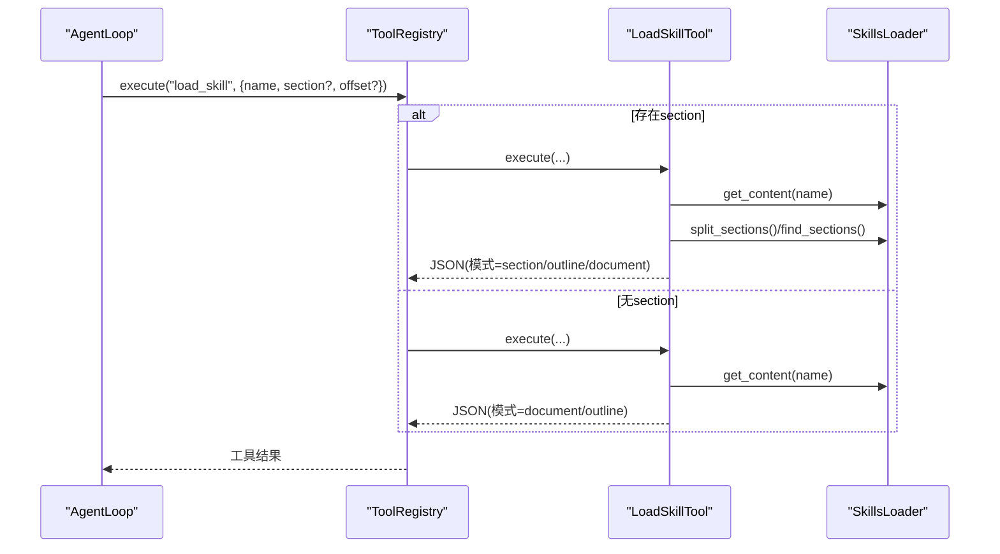
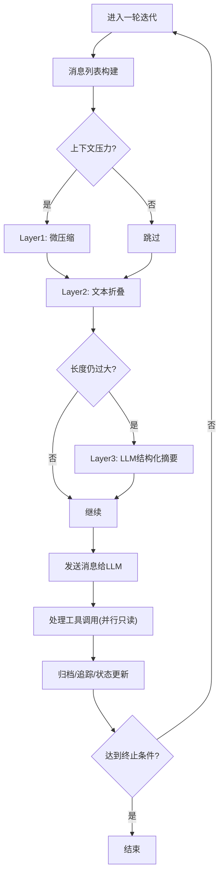
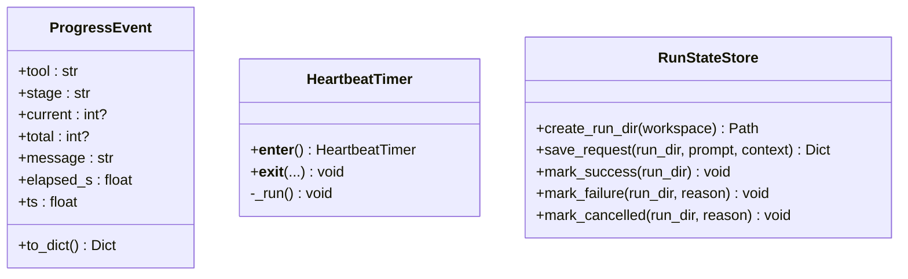
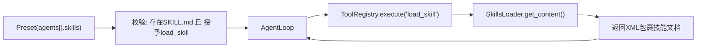
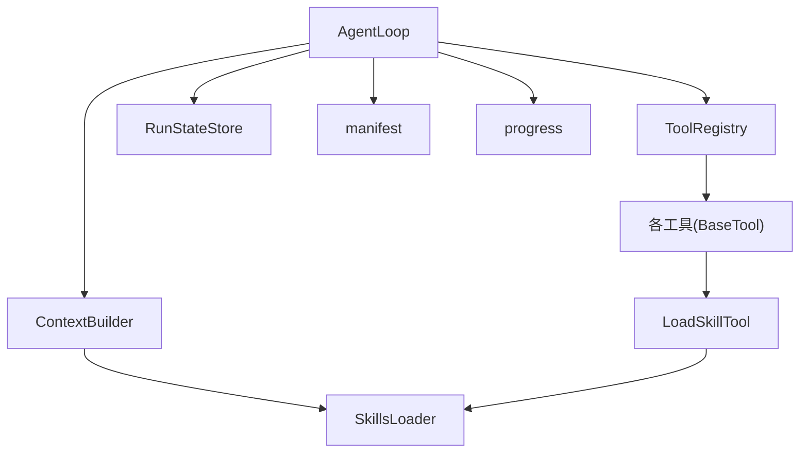

# 技能执行流程

<cite>
**本文引用的文件**
- [agent/src/agent/skills.py](file://agent/src/agent/skills.py)
- [agent/src/agent/context.py](file://agent/src/agent/context.py)
- [agent/src/agent/tools.py](file://agent/src/agent/tools.py)
- [agent/src/agent/loop.py](file://agent/src/agent/loop.py)
- [agent/src/agent/progress.py](file://agent/src/agent/progress.py)
- [agent/src/core/state.py](file://agent/src/core/state.py)
- [agent/src/governance/manifest.py](file://agent/src/governance/manifest.py)
- [agent/src/tools/load_skill_tool.py](file://agent/src/tools/load_skill_tool.py)
- [agent/src/tools/skill_writer_tool.py](file://agent/src/tools/skill_writer_tool.py)
- [agent/src/agent/frontmatter.py](file://agent/src/agent/frontmatter.py)
</cite>

## 目录
1. [简介](#简介)
2. [项目结构](#项目结构)
3. [核心组件](#核心组件)
4. [架构总览](#架构总览)
5. [详细组件分析](#详细组件分析)
6. [依赖关系分析](#依赖关系分析)
7. [性能考虑](#性能考虑)
8. [故障排查指南](#故障排查指南)
9. [结论](#结论)
10. [附录](#附录)

## 简介
本文件系统化说明“技能”（Skill）从加载、解析、验证到执行的完整生命周期，以及技能执行引擎的工作原理：上下文注入、工具调用、结果处理、状态管理（进度、错误、重试）、技能间依赖与调用链管理，并提供监控与调试方法（日志、追踪、性能分析、故障诊断），最后给出典型场景与最佳实践。

## 项目结构
围绕技能执行的关键模块分布如下：
- 技能定义与加载：skills.py、frontmatter.py
- 上下文构建与系统提示注入：context.py
- 工具注册与执行：tools.py、load_skill_tool.py、skill_writer_tool.py
- ReAct 主循环与上下文压缩：loop.py
- 运行状态与持久化：state.py
- 可复现性清单（Manifest）：manifest.py
- 进度与心跳：progress.py

图表来源
- [agent/src/agent/loop.py:638-800](file://agent/src/agent/loop.py#L638-L800)
- [agent/src/agent/context.py:221-333](file://agent/src/agent/context.py#L221-L333)
- [agent/src/agent/skills.py:100-189](file://agent/src/agent/skills.py#L100-L189)
- [agent/src/agent/tools.py:54-84](file://agent/src/agent/tools.py#L54-L84)
- [agent/src/tools/load_skill_tool.py:150-307](file://agent/src/tools/load_skill_tool.py#L150-L307)
- [agent/src/core/state.py:13-87](file://agent/src/core/state.py#L13-L87)
- [agent/src/governance/manifest.py:356-430](file://agent/src/governance/manifest.py#L356-L430)
- [agent/src/agent/progress.py:123-185](file://agent/src/agent/progress.py#L123-L185)

章节来源
- [agent/src/agent/loop.py:638-800](file://agent/src/agent/loop.py#L638-L800)
- [agent/src/agent/context.py:221-333](file://agent/src/agent/context.py#L221-L333)
- [agent/src/agent/skills.py:100-189](file://agent/src/agent/skills.py#L100-L189)
- [agent/src/agent/tools.py:54-84](file://agent/src/agent/tools.py#L54-L84)
- [agent/src/tools/load_skill_tool.py:150-307](file://agent/src/tools/load_skill_tool.py#L150-L307)
- [agent/src/core/state.py:13-87](file://agent/src/core/state.py#L13-L87)
- [agent/src/governance/manifest.py:356-430](file://agent/src/governance/manifest.py#L356-L430)
- [agent/src/agent/progress.py:123-185](file://agent/src/agent/progress.py#L123-L185)

## 核心组件
- 技能模型与加载器
  - Skill：封装名称、描述、分类、正文、目录路径与元数据，支持按需加载辅助文件。
  - SkillsLoader：扫描内置与用户技能目录，去重合并，提供摘要列表与全文内容；支持按标题定位章节并分页返回。
  - frontmatter：解析 SKILL.md 的 YAML-like 头部，提取 name/description/category 等元信息。
- 上下文构建
  - ContextBuilder：组装系统提示词，注入技能摘要、工具清单、记忆快照与当前时间；支持自动召回相关持久化记忆。
- 工具基础设施
  - BaseTool/ToolRegistry：统一工具接口与注册表，提供 OpenAI function-calling 模式导出与执行封装，异常统一转为 JSON 错误。
  - LoadSkillTool：实现 load_skill(name, section?, offset?)，支持文档大纲、按节读取与字符偏移分页。
  - Skill Writer Tools：save_skill/patch_skill/delete_skill/skill_file，用于用户技能 CRUD 与辅助文件管理。
- 执行主循环
  - AgentLoop：ReAct 循环，负责消息构建、工具批处理（只读并行）、上下文压缩（多层策略）、LLM 使用量记录、运行产物归档、取消与超时控制。
- 运行状态与可复现性
  - RunStateStore：创建运行目录、保存请求、标记成功/失败/取消。
  - manifest：对系统提示哈希、技能内容哈希、工具集快照、关键包版本进行组合哈希，生成不可篡改的方法论指纹。
- 进度与心跳
  - progress：结构化进度事件与后台心跳定时器，保证长耗时工具在 UI 中保持活跃反馈。

章节来源
- [agent/src/agent/skills.py:22-189](file://agent/src/agent/skills.py#L22-L189)
- [agent/src/agent/frontmatter.py:16-48](file://agent/src/agent/frontmatter.py#L16-L48)
- [agent/src/agent/context.py:221-333](file://agent/src/agent/context.py#L221-L333)
- [agent/src/agent/tools.py:13-84](file://agent/src/agent/tools.py#L13-L84)
- [agent/src/tools/load_skill_tool.py:150-307](file://agent/src/tools/load_skill_tool.py#L150-L307)
- [agent/src/tools/skill_writer_tool.py:48-370](file://agent/src/tools/skill_writer_tool.py#L48-L370)
- [agent/src/agent/loop.py:638-800](file://agent/src/agent/loop.py#L638-L800)
- [agent/src/core/state.py:13-87](file://agent/src/core/state.py#L13-L87)
- [agent/src/governance/manifest.py:128-430](file://agent/src/governance/manifest.py#L128-L430)
- [agent/src/agent/progress.py:30-185](file://agent/src/agent/progress.py#L30-L185)

## 架构总览
技能执行的整体流程如下：
- 启动时：SkillsLoader 扫描内置与用户技能目录，解析 frontmatter，构建技能索引。
- 会话开始：ContextBuilder 构建系统提示，注入技能摘要与工具清单；可选注入持久化记忆快照。
- 交互循环：AgentLoop 接收用户消息，构造消息列表，调用 LLM；根据工具调用分发至 ToolRegistry 执行；必要时通过 LoadSkillTool 拉取技能文档（大纲/章节/分页）。
- 状态与追踪：RunStateStore 记录请求与状态；TraceWriter 写入 trace；run_manifest.json 记录方法论指纹。
- 进度与健壮性：HeartbeatTimer 定时心跳；progress.emit_progress 输出结构化进度；异常统一捕获并返回 JSON 错误。

图表来源
- [agent/src/agent/loop.py:638-800](file://agent/src/agent/loop.py#L638-L800)
- [agent/src/agent/context.py:221-333](file://agent/src/agent/context.py#L221-L333)
- [agent/src/agent/skills.py:100-189](file://agent/src/agent/skills.py#L100-L189)
- [agent/src/tools/load_skill_tool.py:150-307](file://agent/src/tools/load_skill_tool.py#L150-L307)
- [agent/src/core/state.py:13-87](file://agent/src/core/state.py#L13-L87)
- [agent/src/governance/manifest.py:356-430](file://agent/src/governance/manifest.py#L356-L430)

## 详细组件分析

### 技能加载与解析（SKILL.md 与 frontmatter）
- 加载顺序：先用户目录后内置目录，同名覆盖，避免重复。
- 解析过程：读取 SKILL.md，解析 frontmatter 得到 name/description/category 等元数据与正文；支持按需加载 references/templates/examples/assets 等辅助文件。
- 章节映射：将 Markdown ATX 标题解析为章节树，计算每节起止位置与首行摘要，便于后续按节读取与分页。

图表来源
- [agent/src/agent/skills.py:65-189](file://agent/src/agent/skills.py#L65-L189)
- [agent/src/agent/frontmatter.py:16-48](file://agent/src/agent/frontmatter.py#L16-L48)

章节来源
- [agent/src/agent/skills.py:65-189](file://agent/src/agent/skills.py#L65-L189)
- [agent/src/agent/frontmatter.py:16-48](file://agent/src/agent/frontmatter.py#L16-L48)

### 上下文注入与系统提示
- 系统提示包含：技能数量与摘要、工具清单与简要描述、工作区记忆摘要、当前时间、任务路由规则与输出原则。
- 持久化记忆：会话开始时冻结快照，查询时自动召回相关内容并注入用户消息，提升上下文相关性。
- 工具描述精简：仅保留一行提示，完整参数 schema 通过 API tools 数组下发，降低 token 成本。

图表来源
- [agent/src/agent/context.py:221-333](file://agent/src/agent/context.py#L221-L333)
- [agent/src/agent/skills.py:100-189](file://agent/src/agent/skills.py#L100-L189)

章节来源
- [agent/src/agent/context.py:221-333](file://agent/src/agent/context.py#L221-L333)

### 工具调用与结果处理
- 工具注册：BaseTool 定义统一接口与 OpenAI schema 转换；ToolRegistry 维护工具集合并提供 execute(name, params)。
- 执行保障：execute 捕获异常并返回标准 JSON 错误；支持只读工具批量并行执行，写操作串行。
- 技能文档加载：LoadSkillTool 支持三种模式——文档整体、大纲+开头文本、按节读取；超长内容采用字符预算分页，确保可逐步消费。

图表来源
- [agent/src/agent/tools.py:54-84](file://agent/src/agent/tools.py#L54-L84)
- [agent/src/tools/load_skill_tool.py:150-307](file://agent/src/tools/load_skill_tool.py#L150-L307)
- [agent/src/agent/skills.py:100-189](file://agent/src/agent/skills.py#L100-L189)

章节来源
- [agent/src/agent/tools.py:54-84](file://agent/src/agent/tools.py#L54-L84)
- [agent/src/tools/load_skill_tool.py:150-307](file://agent/src/tools/load_skill_tool.py#L150-L307)

### 执行主循环与上下文压缩
- 五层上下文管理：
  - 微压缩：清理旧工具结果，保留最近 N 条。
  - 折叠：对长文本块保留头尾，中间省略，零 API 成本。
  - 自动摘要：基于 LLM 的结构化摘要，带尾部 token 预算保护。
  - 显式压缩：模型主动调用 compact 工具触发摘要。
  - 迭代更新：第 N 次压缩增量更新前序摘要，避免从头重建。
- 批处理与并发：连续只读工具线程并行执行，提高吞吐。
- 运行产物归档：成功的独立 backtest 结果会复制到当前活动运行目录，保证报告一致性。

图表来源
- [agent/src/agent/loop.py:1-120](file://agent/src/agent/loop.py#L1-L120)
- [agent/src/agent/loop.py:307-400](file://agent/src/agent/loop.py#L307-L400)
- [agent/src/agent/loop.py:582-636](file://agent/src/agent/loop.py#L582-L636)

章节来源
- [agent/src/agent/loop.py:1-120](file://agent/src/agent/loop.py#L1-L120)
- [agent/src/agent/loop.py:307-400](file://agent/src/agent/loop.py#L307-L400)
- [agent/src/agent/loop.py:582-636](file://agent/src/agent/loop.py#L582-L636)

### 状态管理与进度跟踪
- 运行状态：RunStateStore 创建运行目录、保存请求、标记 success/failed/cancelled，确保幂等与原子写入。
- 进度事件：progress.ProgressEvent 携带 stage/current/total/message/elapsed_s/ts；HeartbeatTimer 周期性发出心跳，防止 UI 假死。
- 结构化进度：工具内部通过 emit_progress(stage, current, total, message) 上报进度，由线程本地发射器回传至 AgentLoop。

图表来源
- [agent/src/agent/progress.py:30-185](file://agent/src/agent/progress.py#L30-L185)
- [agent/src/core/state.py:13-87](file://agent/src/core/state.py#L13-L87)

章节来源
- [agent/src/agent/progress.py:30-185](file://agent/src/agent/progress.py#L30-L185)
- [agent/src/core/state.py:13-87](file://agent/src/core/state.py#L13-L87)

### 技能间的依赖与调用链管理
- 依赖声明：预设（preset）可通过 skills 字段声明所需技能，并通过 tools 授予 load_skill 权限，确保节点能实际读取技能。
- 校验机制：测试用例强制要求每个被声明的技能在磁盘上存在对应 SKILL.md，且必须授予 load_skill 工具，避免“空引用”。
- 调用链：AgentLoop 在工具调用阶段动态加载技能文档（大纲/章节/分页），并在上下文中以 XML 包裹返回，供模型理解与遵循。

图表来源
- [agent/tests/test_preset_claim_backing.py:22-243](file://agent/tests/test_preset_claim_backing.py#L22-L243)
- [agent/src/tools/load_skill_tool.py:150-307](file://agent/src/tools/load_skill_tool.py#L150-L307)
- [agent/src/agent/skills.py:100-189](file://agent/src/agent/skills.py#L100-L189)

章节来源
- [agent/tests/test_preset_claim_backing.py:22-243](file://agent/tests/test_preset_claim_backing.py#L22-L243)
- [agent/src/tools/load_skill_tool.py:150-307](file://agent/src/tools/load_skill_tool.py#L150-L307)
- [agent/src/agent/skills.py:100-189](file://agent/src/agent/skills.py#L100-L189)

### 监控与调试
- 日志与追踪：
  - 工具异常：ToolRegistry.execute 捕获并记录异常，返回 JSON 错误。
  - TraceWriter：记录每次迭代的输入输出与工具调用轨迹。
  - run_manifest.json：记录系统提示哈希、技能内容哈希、工具集快照与关键包版本，支持差异对比与复现。
- 性能分析：
  - LLM 用量：记录 per-iteration 的 input/output/total tokens 与调用次数，落盘 llm_usage.json。
  - 上下文压缩：多层压缩减少 token 消耗，避免超限。
- 故障诊断：
  - 进度心跳：HeartbeatTimer 暴露 elapsed_s，帮助定位卡点。
  - 结构化进度：emit_progress 提供 stage/current/total 量化指标。
  - 状态标记：RunStateStore 明确 success/failed/cancelled 及原因。

章节来源
- [agent/src/agent/tools.py:72-84](file://agent/src/agent/tools.py#L72-L84)
- [agent/src/agent/loop.py:178-208](file://agent/src/agent/loop.py#L178-L208)
- [agent/src/agent/loop.py:1006-1061](file://agent/src/agent/loop.py#L1006-L1061)
- [agent/src/governance/manifest.py:356-430](file://agent/src/governance/manifest.py#L356-L430)
- [agent/src/agent/progress.py:123-185](file://agent/src/agent/progress.py#L123-L185)

## 依赖关系分析
- 松耦合设计：
  - ContextBuilder 依赖 SkillsLoader 与 ToolRegistry，但不直接访问具体工具实现。
  - LoadSkillTool 依赖 SkillsLoader 与章节解析函数，屏蔽文档分页细节。
  - AgentLoop 通过 ToolRegistry 抽象工具执行，不关心具体工具逻辑。
- 外部集成点：
  - LLM 提供商：通过 ChatLLM 抽象，支持流式与重试。
  - 文件系统：运行目录、技能目录、trace/manifest 持久化。
- 潜在循环依赖规避：
  - progress 通过 thread-local 发射器解耦工具与 AgentLoop。
  - manifest 独立于 agent 内部模块，仅接受已提取的数据。

图表来源
- [agent/src/agent/loop.py:638-800](file://agent/src/agent/loop.py#L638-L800)
- [agent/src/agent/context.py:221-333](file://agent/src/agent/context.py#L221-L333)
- [agent/src/agent/tools.py:54-84](file://agent/src/agent/tools.py#L54-L84)
- [agent/src/tools/load_skill_tool.py:150-307](file://agent/src/tools/load_skill_tool.py#L150-L307)
- [agent/src/core/state.py:13-87](file://agent/src/core/state.py#L13-L87)
- [agent/src/governance/manifest.py:356-430](file://agent/src/governance/manifest.py#L356-L430)
- [agent/src/agent/progress.py:123-185](file://agent/src/agent/progress.py#L123-L185)

章节来源
- [agent/src/agent/loop.py:638-800](file://agent/src/agent/loop.py#L638-L800)
- [agent/src/agent/context.py:221-333](file://agent/src/agent/context.py#L221-L333)
- [agent/src/agent/tools.py:54-84](file://agent/src/agent/tools.py#L54-L84)
- [agent/src/tools/load_skill_tool.py:150-307](file://agent/src/tools/load_skill_tool.py#L150-L307)
- [agent/src/core/state.py:13-87](file://agent/src/core/state.py#L13-L87)
- [agent/src/governance/manifest.py:356-430](file://agent/src/governance/manifest.py#L356-L430)
- [agent/src/agent/progress.py:123-185](file://agent/src/agent/progress.py#L123-L185)

## 性能考虑
- 上下文压缩：多层策略显著降低 token 消耗，避免超限；长文本折叠零 API 成本。
- 工具并行：只读工具批量并行，缩短端到端延迟。
- 分页加载：技能文档按字符预算分页，避免单次响应过大导致网络或解析瓶颈。
- 资源限制：工具超时、心跳间隔、流重试延迟等均可配置，平衡稳定性与时效性。

[本节为通用指导，无需特定文件来源]

## 故障排查指南
- 常见问题定位
  - 技能未找到：检查 SkillsLoader 是否扫描到用户/内置目录，确认 SKILL.md 存在且 frontmatter 包含 name。
  - 章节歧义：当同名章节出现多次时，需使用“父级 > 子级”路径精确指定。
  - 工具执行失败：查看 ToolRegistry 返回的 JSON 错误与日志；确认工具依赖满足（check_available）。
  - 进度停滞：检查 HeartbeatTimer 是否正常启动；确认 emit_progress 是否在工具内正确调用。
  - 运行状态异常：查看 state.json 的 status/reason；核对 RunStateStore 的标记逻辑。
- 调试建议
  - 启用 trace 与 run_manifest.json，对比两次运行的方法论差异。
  - 观察 llm_usage.json，分析 token 消耗与调用次数。
  - 使用 skill_writer_tools 的 patch_skill 快速修复过时示例或参数。

章节来源
- [agent/src/agent/skills.py:166-189](file://agent/src/agent/skills.py#L166-L189)
- [agent/src/tools/load_skill_tool.py:244-284](file://agent/src/tools/load_skill_tool.py#L244-L284)
- [agent/src/agent/tools.py:72-84](file://agent/src/agent/tools.py#L72-L84)
- [agent/src/agent/progress.py:89-121](file://agent/src/agent/progress.py#L89-L121)
- [agent/src/core/state.py:49-77](file://agent/src/core/state.py#L49-L77)
- [agent/src/agent/loop.py:178-208](file://agent/src/agent/loop.py#L178-L208)
- [agent/src/governance/manifest.py:478-531](file://agent/src/governance/manifest.py#L478-L531)

## 结论
本系统通过清晰的技能加载与解析、稳健的上下文注入、统一的工具执行框架、多层次的上下文压缩与进度反馈，实现了高可用、可观测、可复现的技能执行流程。配合运行状态管理与方法论指纹，既能支撑复杂的多步骤研究任务，也能在故障发生时快速定位与恢复。

[本节为总结性内容，无需特定文件来源]

## 附录
- 典型场景
  - 策略生成与回测：先 load_skill("strategy-generate") 获取契约，再调用回测工具，最后进行归因分析。
  - 交易复盘：load_skill("trade-journal") 后调用分析工具，输出行为诊断与建议。
  - 影子账户：必须先 load_skill("shadow-account")，再依次执行提取、回测、报告渲染。
- 最佳实践
  - 始终先加载相关技能，再执行对应工具，确保遵循契约与示例。
  - 对长文档优先使用大纲与按节读取，避免一次性拉取全文。
  - 在工具中适时 emit_progress，提升用户体验与可观测性。
  - 利用 patch_skill 及时修复过时内容，保持技能与外部 API 同步。

[本节为通用指导，无需特定文件来源]