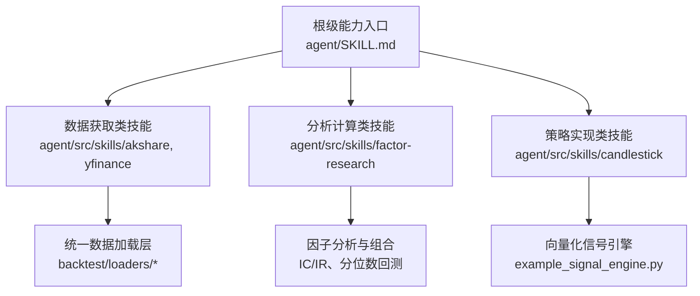
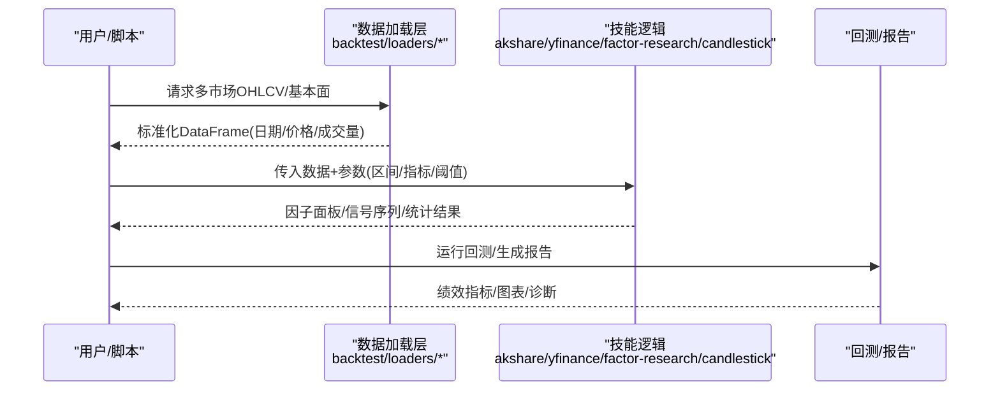
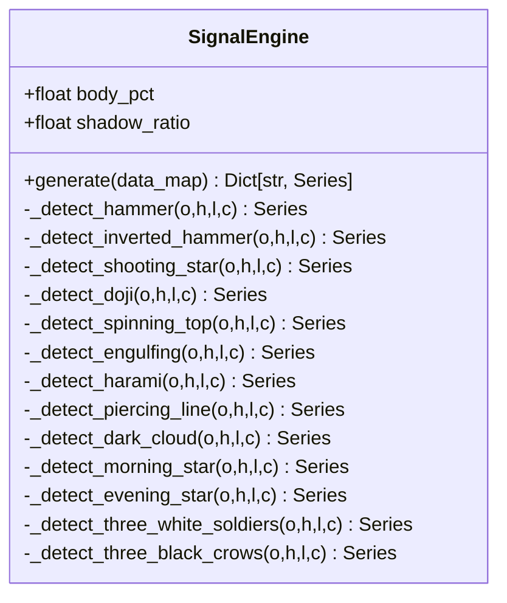
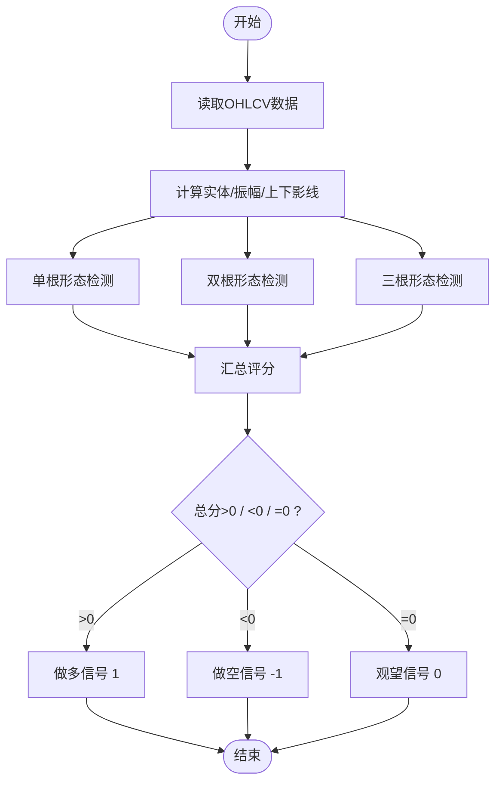
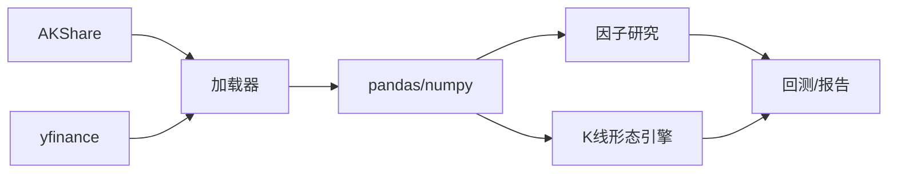

# 技能示例集合

<cite>
**本文引用的文件**
- [SKILL.md](file://agent/SKILL.md)
- [akshare SKILL.md](file://agent/src/skills/akshare/SKILL.md)
- [yfinance SKILL.md](file://agent/src/skills/yfinance/SKILL.md)
- [candlestick SKILL.md](file://agent/src/skills/candlestick/SKILL.md)
- [candlestick example_signal_engine.py](file://agent/src/skills/candlestick/example_signal_engine.py)
- [factor-research SKILL.md](file://agent/src/skills/factor-research/SKILL.md)
</cite>

## 目录
1. [简介](#简介)
2. [项目结构](#项目结构)
3. [核心组件](#核心组件)
4. [架构总览](#架构总览)
5. [详细组件分析](#详细组件分析)
6. [依赖关系分析](#依赖关系分析)
7. [性能考虑](#性能考虑)
8. [故障排查指南](#故障排查指南)
9. [结论](#结论)
10. [附录](#附录)

## 简介
本文件为“技能示例集合”的权威说明，聚焦三类典型技能：数据获取类、分析计算类、策略实现类。通过仓库内已提供的技能文档与示例代码，系统讲解每个示例的实现原理、使用方法（输入参数、输出结果、配置选项）、扩展方式、复杂工作流（多步骤数据处理、条件判断、结果聚合），以及性能优化与常见问题解决方案，并给出测试与验证建议。

## 项目结构
- 技能清单与能力概览位于根级 SKILL.md，涵盖回测引擎、因子研究、Alpha Zoo、期权定价、图表形态、市场数据源等能力入口与工具列表。
- 具体技能以“目录=技能名”的方式组织在 agent/src/skills 下，每个技能包含 SKILL.md（方法、参数、用法）与可选参考或示例代码。
- 数据获取类技能提供不同市场的数据源接入规范与约定；分析计算类技能提供因子评估、统计检验等方法；策略实现类技能提供可运行的信号生成与回测对接方式。

**图示来源**
- [SKILL.md:122-133](file://agent/SKILL.md#L122-L133)
- [akshare SKILL.md:86-88](file://agent/src/skills/akshare/SKILL.md#L86-L88)
- [yfinance SKILL.md:12-14](file://agent/src/skills/yfinance/SKILL.md#L12-L14)
- [candlestick example_signal_engine.py:81-99](file://agent/src/skills/candlestick/example_signal_engine.py#L81-L99)

**章节来源**
- [SKILL.md:122-133](file://agent/SKILL.md#L122-L133)

## 核心组件
- 数据获取类
  - AKShare：免费聚合A股、美股、港股、期货、宏观、外汇等数据，内置回测加载器自动降级使用。
  - yfinance：覆盖美股、港股、加拿大市场OHLCV与公司信息、财报、期权链等，支持统一符号转换与批量下载。
- 分析计算类
  - 因子研究：提供IC/IR统计、分位数回测、因子组合（等权、IC加权、正交化）与常见陷阱规避。
- 策略实现类
  - K线形态识别：纯pandas向量化实现15种经典形态，汇总评分生成做多/做空/观望信号。

**章节来源**
- [akshare SKILL.md:1-93](file://agent/src/skills/akshare/SKILL.md#L1-L93)
- [yfinance SKILL.md:1-265](file://agent/src/skills/yfinance/SKILL.md#L1-L265)
- [factor-research SKILL.md:1-157](file://agent/src/skills/factor-research/SKILL.md#L1-L157)
- [candlestick SKILL.md:1-59](file://agent/src/skills/candlestick/SKILL.md#L1-L59)

## 架构总览
下图展示从数据到信号的端到端流程：数据源→统一加载→特征/信号计算→回测/报告。

**图示来源**
- [yfinance SKILL.md:61-76](file://agent/src/skills/yfinance/SKILL.md#L61-L76)
- [akshare SKILL.md:86-88](file://agent/src/skills/akshare/SKILL.md#L86-L88)
- [factor-research SKILL.md:19-27](file://agent/src/skills/factor-research/SKILL.md#L19-L27)
- [candlestick example_signal_engine.py:479-527](file://agent/src/skills/candlestick/example_signal_engine.py#L479-L527)

## 详细组件分析

### 数据获取类：AKShare
- 目标与适用场景
  - 免费获取A股、美股、港股、期货、宏观、外汇等多市场数据，作为tushare/yfinance的默认降级源。
- 关键接口与约定
  - OHLCV：stock_zh_a_hist / stock_us_hist / stock_hk_hist 等，支持日频与分钟频。
  - 列名：中文列名（日期/开盘/最高/最低/收盘/成交量/成交额/涨跌幅/换手率）。
  - 日期格式：YYYYMMDD字符串；输出需转datetime。
  - 符号格式：A股纯数字、美股带交易所前缀、港股5位零填充。
- 使用方法
  - 直接调用akshare函数获取数据；或在回测中通过内置加载器自动选择。
- 输入/输出
  - 输入：symbol、period、start_date、end_date、adjust等。
  - 输出：含标准OHLCV列的DataFrame（中文列名）。
- 配置选项
  - source="auto"时自动路由至AKShare等免费源；也可显式指定source="akshare"。
- 扩展指导
  - 新增字段：可在返回DataFrame后追加自定义列（如技术指标）。
  - 批量拉取：结合registry/get_loader_cls_with_fallback进行统一调度。
- 性能与稳定性
  - 注意网络波动与限频；优先批量请求，避免逐标的循环。
- 测试与验证
  - 校验列名与数据类型；检查日期范围与缺失值；对比不同源的一致性。

**章节来源**
- [akshare SKILL.md:14-88](file://agent/src/skills/akshare/SKILL.md#L14-L88)

### 数据获取类：yfinance
- 目标与适用场景
  - 获取美股、港股、加拿大市场OHLCV与公司信息、财报、期权链等；适合研究与回测。
- 关键约定
  - 统一符号转换：AAPL.US→AAPL；700.HK→0700.HK；TD.TO/PNG.V保持原样。
  - 时间粒度限制：分钟级有历史长度限制；日线及以上无限制。
  - 调整方式：loader默认不使用自动复权。
- 使用方法
  - 推荐通过get_market_data工具或DataLoader.fetch批量获取OHLCV。
  - 公司资料/财报/期权链等通过yf.Ticker或内置yahoo_client访问。
- 输入/输出
  - 输入：codes、start_date、end_date、interval、max_rows等。
  - 输出：标准化OHLCV DataFrame；其他数据按对应接口返回。
- 配置选项
  - source="yfinance"或"auto"；interval支持分钟/小时/日/周/月。
- 扩展指导
  - 将yfinance数据接入因子计算或信号引擎；结合行业中性化与标准化。
- 性能与稳定性
  - Yahoo存在频率限制；尽量批量下载；处理时区与异常行。
- 测试与验证
  - 校验符号映射；检查分钟数据上限；对比不同区间一致性。

**章节来源**
- [yfinance SKILL.md:16-43](file://agent/src/skills/yfinance/SKILL.md#L16-L43)
- [yfinance SKILL.md:78-137](file://agent/src/skills/yfinance/SKILL.md#L78-L137)
- [yfinance SKILL.md:225-255](file://agent/src/skills/yfinance/SKILL.md#L225-L255)

### 分析计算类：因子研究
- 目标与适用场景
  - 对单因子或多因子进行IC/IR统计与分位数回测，评估选股能力并指导因子组合。
- 工作流程
  - 计算截面因子值→计算未来N日收益→调用factor_analysis工具→解读IC/IR与分组净值曲线→筛选/组合因子。
- 工具参数
  - factor_csv、return_csv、output_dir、n_groups（默认5）。
- 输出文件
  - ic_series.csv、ic_summary.json、group_equity.csv。
- 解读标准
  - IC均值、IR、IC>0比例、分组单调性、多空价差、稳定性等。
- 组合方法
  - 等权、IC加权、正交化组合。
- 常见陷阱
  - 未来函数、分布偏态、行业中性化、样本量不足、拥挤与幸存者偏差。
- 测试与验证
  - 确保因子与收益行列对齐；使用前向收益；检查NaN/Inf；做稳健性检验（不同窗口/行业划分）。

**章节来源**
- [factor-research SKILL.md:19-157](file://agent/src/skills/factor-research/SKILL.md#L19-L157)

### 策略实现类：K线形态识别
- 目标与适用场景
  - 识别15种经典K线形态（单根/双根/三根），汇总看涨/看跌评分生成交易信号。
- 信号逻辑
  - 看涨+1、看跌-1、中性0；总分>0做多、<0做空、=0观望。
- 参数
  - body_pct（十字星实体占比阈值）、shadow_ratio（影线与实体比）。
- 实现要点
  - 纯pandas向量化：实体、振幅、上下影线计算；多形态条件组合；汇总求和与sign映射。
- 输入/输出
  - 输入：data_map={code: DataFrame(open/high/low/close)}。
  - 输出：{code: Series(signal)}，值为1/-1/0。
- 扩展指导
  - 新增形态：仿照现有方法添加检测函数并在generate中注册。
  - 与数据源集成：通过OKX或其他数据源获取OHLCV后送入引擎。
- 性能与稳定性
  - 向量化计算高效；注意shift带来的冷启动期；处理NaN与零振幅。
- 测试与验证
  - 构造已知形态样本验证检测正确性；统计信号分布；与价格趋势对照。

**图示来源**
- [candlestick example_signal_engine.py:81-99](file://agent/src/skills/candlestick/example_signal_engine.py#L81-L99)
- [candlestick example_signal_engine.py:105-190](file://agent/src/skills/candlestick/example_signal_engine.py#L105-L190)
- [candlestick example_signal_engine.py:222-339](file://agent/src/skills/candlestick/example_signal_engine.py#L222-L339)
- [candlestick example_signal_engine.py:345-473](file://agent/src/skills/candlestick/example_signal_engine.py#L345-L473)
- [candlestick example_signal_engine.py:479-527](file://agent/src/skills/candlestick/example_signal_engine.py#L479-L527)

**图示来源**
- [candlestick example_signal_engine.py:479-527](file://agent/src/skills/candlestick/example_signal_engine.py#L479-L527)

## 依赖关系分析
- 数据源依赖
  - AKShare：无需API Key，覆盖多市场；内置加载器自动降级。
  - yfinance：无需API Key，覆盖美股/港股/加拿大；支持Yahoo直连客户端。
- 计算依赖
  - pandas/numpy用于向量化计算；scipy用于统计检验（因子研究）。
- 回测/报告
  - 通过统一回测引擎与工具链对接，输出绩效指标与可视化。

**图示来源**
- [akshare SKILL.md:86-88](file://agent/src/skills/akshare/SKILL.md#L86-L88)
- [yfinance SKILL.md:12-14](file://agent/src/skills/yfinance/SKILL.md#L12-L14)
- [factor-research SKILL.md:136-140](file://agent/src/skills/factor-research/SKILL.md#L136-L140)
- [candlestick SKILL.md:50-54](file://agent/src/skills/candlestick/SKILL.md#L50-L54)

**章节来源**
- [akshare SKILL.md:86-88](file://agent/src/skills/akshare/SKILL.md#L86-L88)
- [yfinance SKILL.md:12-14](file://agent/src/skills/yfinance/SKILL.md#L12-L14)
- [factor-research SKILL.md:136-140](file://agent/src/skills/factor-research/SKILL.md#L136-L140)
- [candlestick SKILL.md:50-54](file://agent/src/skills/candlestick/SKILL.md#L50-L54)

## 性能考虑
- 数据获取
  - 批量下载优于逐标的循环；设置合理max_rows与interval；处理时区与异常行。
  - 对于分钟级数据，遵守各源的历史长度限制。
- 计算优化
  - 使用pandas向量化计算；避免Python层循环；合理使用shift与布尔索引。
  - 因子研究中先做横截面标准化/去极值，再计算IC/IR，提升稳定性。
- 存储与IO
  - 中间结果落盘CSV/Parquet，减少重复计算；输出目录结构化便于追踪。
- 容错与重试
  - 网络异常重试；空结果或NaN过滤；对极端值进行截断或替换。

[本节为通用指导，不直接引用具体文件]

## 故障排查指南
- 数据源问题
  - AKShare/yfinance限频或返回不完整：降低频率、增加间隔、分批请求；检查符号格式与时区。
  - 列名不一致：统一转换为英文列名（open/high/low/close/volume）。
- 因子研究问题
  - 行列不对齐：确保因子与收益的index/date与columns/codes完全一致。
  - 未来函数：因子用T及之前数据，收益用T+1及之后；检查是否混入当日收盘价。
  - 分布偏态：进行横截面秩变换或Z-score标准化；剔除极端值。
- K线形态问题
  - 冷启动期：前几根因shift导致NaN，忽略或补齐。
  - 零振幅/NaN：在计算前清理无效行，避免除零。
- 回测/报告
  - 确认初始资金、手续费、滑点设置；核对信号与成交对齐；检查复权方式。

**章节来源**
- [yfinance SKILL.md:257-266](file://agent/src/skills/yfinance/SKILL.md#L257-L266)
- [factor-research SKILL.md:105-135](file://agent/src/skills/factor-research/SKILL.md#L105-L135)
- [candlestick example_signal_engine.py:170-216](file://agent/src/skills/candlestick/example_signal_engine.py#L170-L216)

## 结论
本集合提供了从数据获取到信号生成再到回测报告的完整技能范式：数据源层屏蔽差异，分析层提供严谨统计与组合方法，策略层以向量化实现保证效率与可维护性。开发者可基于这些示例快速搭建自己的研究流水线，并通过参数化与模块化持续扩展。

[本节为总结性内容，不直接引用具体文件]

## 附录

### 常用参数速查
- AKShare
  - 接口：stock_zh_a_hist / stock_us_hist / stock_hk_hist
  - 参数：symbol、period、start_date、end_date、adjust
  - 输出：含中文列名的OHLCV DataFrame
- yfinance
  - 工具：get_market_data / DataLoader.fetch
  - 参数：codes、start_date、end_date、interval、max_rows
  - 输出：标准化OHLCV DataFrame
- 因子研究
  - 工具：factor_analysis
  - 参数：factor_csv、return_csv、output_dir、n_groups
  - 输出：ic_series.csv、ic_summary.json、group_equity.csv
- K线形态
  - 引擎：SignalEngine.generate
  - 参数：body_pct、shadow_ratio
  - 输入：data_map={code: OHLCV}
  - 输出：{code: signal Series(1/-1/0)}

**章节来源**
- [akshare SKILL.md:32-88](file://agent/src/skills/akshare/SKILL.md#L32-L88)
- [yfinance SKILL.md:47-137](file://agent/src/skills/yfinance/SKILL.md#L47-L137)
- [factor-research SKILL.md:29-45](file://agent/src/skills/factor-research/SKILL.md#L29-L45)
- [candlestick SKILL.md:43-59](file://agent/src/skills/candlestick/SKILL.md#L43-L59)
- [candlestick example_signal_engine.py:479-527](file://agent/src/skills/candlestick/example_signal_engine.py#L479-L527)

### 测试与验证建议
- 数据层
  - 构造最小数据集，验证列名、类型、日期顺序与缺失值处理。
  - 对比不同数据源的同一标的，检查一致性。
- 因子层
  - 使用已知有效因子（如动量、价值）验证IC/IR为正且稳定；做滚动窗口稳健性检验。
  - 加入噪声与极端值，观察指标变化与鲁棒性。
- 策略层
  - 构造典型形态样本（锤子线、吞没、晨星等），验证检测准确率。
  - 在不同市场与周期上回测，观察信号稳定性与交易成本影响。

[本节为通用指导，不直接引用具体文件]