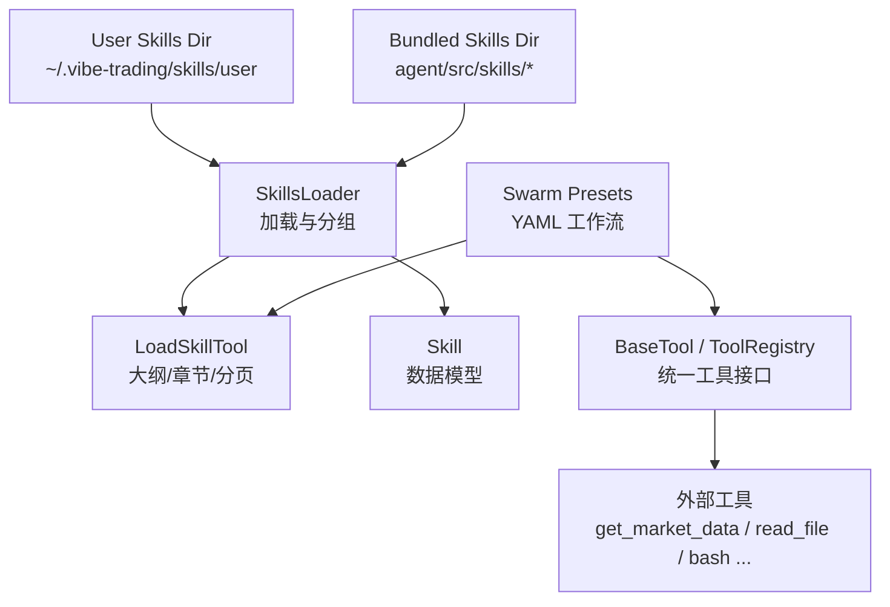
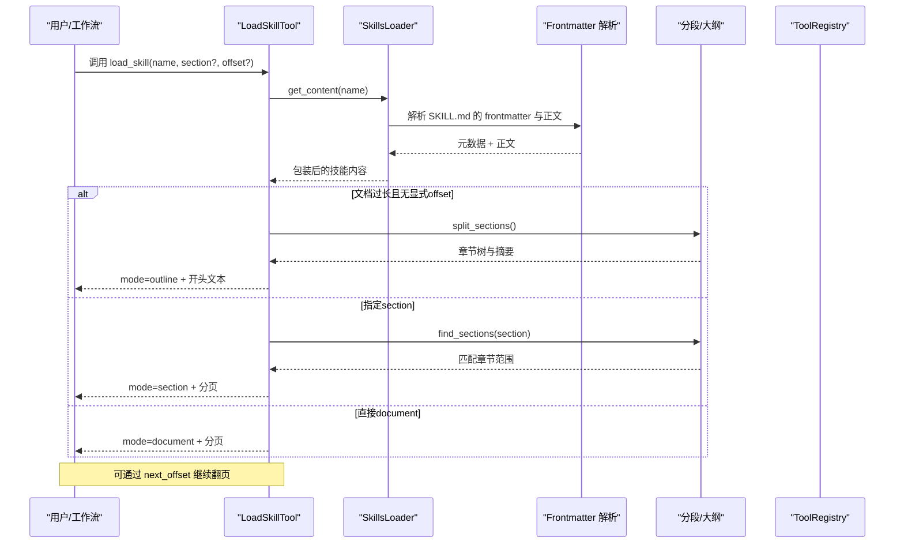
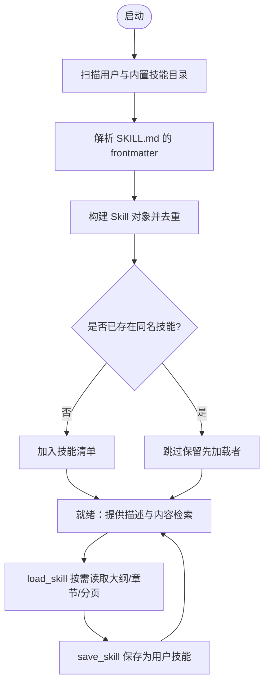
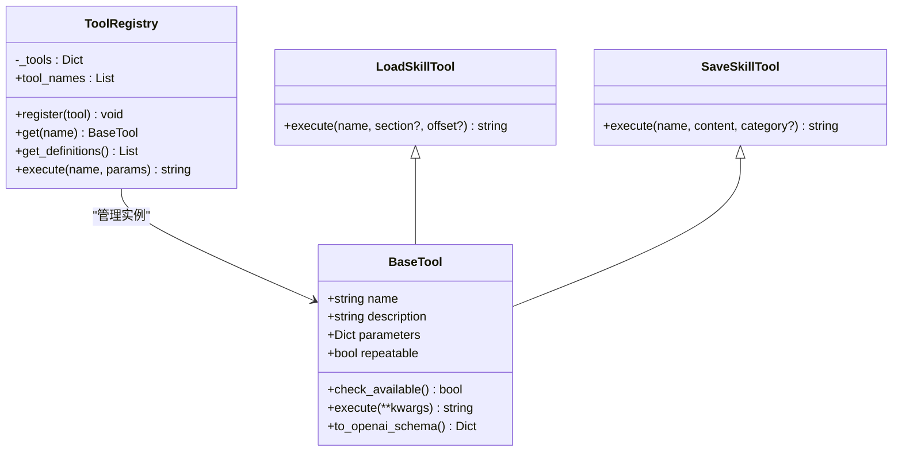
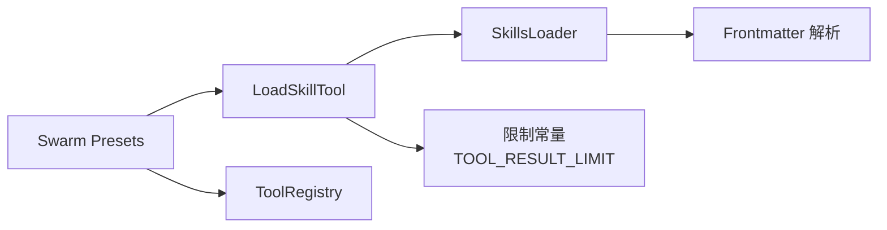

# 技能系统

<cite>
**本文引用的文件**
- [skills.py](file://agent/src/agent/skills.py)
- [frontmatter.py](file://agent/src/agent/frontmatter.py)
- [tools.py](file://agent/src/agent/tools.py)
- [load_skill_tool.py](file://agent/src/tools/load_skill_tool.py)
- [skill_writer_tool.py](file://agent/src/tools/skill_writer_tool.py)
- [SKILL.md（tushare）](file://agent/src/skills/tushare/SKILL.md)
- [SKILL.md（yfinance）](file://agent/src/skills/yfinance/SKILL.md)
- [factor_research_committee.yaml](file://agent/src/swarm/presets/factor_research_committee.yaml)
- [global_allocation_committee.yaml](file://agent/src/swarm/presets/global_allocation_committee.yaml)
- [event_driven_task_force.yaml](file://agent/src/swarm/presets/event_driven_task_force.yaml)
- [fund_selection_panel.yaml](file://agent/src/swarm/presets/fund_selection_panel.yaml)
- [test_skills.py](file://agent/tests/test_skills.py)
- [test_agent_output_discipline.py](file://agent/tests/test_agent_output_discipline.py)
- [manifest.py](file://agent/src/governance/manifest.py)
</cite>

## 目录
1. [简介](#简介)
2. [项目结构](#项目结构)
3. [核心组件](#核心组件)
4. [架构总览](#架构总览)
5. [详细组件分析](#详细组件分析)
6. [依赖关系分析](#依赖关系分析)
7. [性能与可扩展性](#性能与可扩展性)
8. [故障排查指南](#故障排查指南)
9. [结论](#结论)
10. [附录：开发、测试与发布最佳实践](#附录开发测试与发布最佳实践)

## 简介
本文件系统性地文档化了“技能系统”的设计与实现。技能是以 Markdown + Frontmatter 描述的可插拔能力单元，通过统一的加载器、工具接口和分页机制，在会话中按需加载、分节阅读与执行。系统支持内置技能与用户自定义技能并存，并通过工作流预设将技能与工具组合为可复用的研究或交易流程。

## 项目结构
- 技能定义与加载
  - 每个技能是一个独立目录，包含 SKILL.md（Frontmatter + 正文），可选 references/、scripts/ 等辅助资源。
  - SkillsLoader 负责扫描内置与用户目录，解析 Frontmatter，构建技能清单与内容检索能力。
- 技能访问工具
  - load_skill 工具提供三种读取模式：完整文档、章节定向、字符分页；对超长文档自动返回大纲以便按标题定位。
- 技能创作与持久化
  - save_skill 工具允许在工作会话中将成功的工作流保存为用户技能，便于后续复用。
- 工具基础设施
  - BaseTool 与 ToolRegistry 提供统一的工具注册、声明式参数（OpenAI function calling 格式）与执行封装。
- 工作流集成
  - swarm presets 以 YAML 声明任务、工具与技能组合，驱动多智能体协作。

图表来源
- [skills.py:100-189](file://agent/src/agent/skills.py#L100-L189)
- [load_skill_tool.py:150-307](file://agent/src/tools/load_skill_tool.py#L150-L307)
- [tools.py:13-95](file://agent/src/agent/tools.py#L13-L95)
- [skill_writer_tool.py:48-91](file://agent/src/tools/skill_writer_tool.py#L48-L91)

章节来源
- [skills.py:1-189](file://agent/src/agent/skills.py#L1-L189)
- [tools.py:1-95](file://agent/src/agent/tools.py#L1-L95)
- [load_skill_tool.py:1-307](file://agent/src/tools/load_skill_tool.py#L1-L307)
- [skill_writer_tool.py:48-91](file://agent/src/tools/skill_writer_tool.py#L48-L91)

## 核心组件
- Skill 数据类：承载技能的名称、描述、分类、正文、目录路径与元数据，并支持按需加载辅助文件。
- SkillsLoader：从用户目录与内置目录扫描技能，去重、分组与排序，提供摘要与全文检索。
- Frontmatter 解析：轻量级 YAML-like 头部解析，支持字符串、列表、布尔值。
- LoadSkillTool：对外暴露的技能读取工具，支持 outline/section/document 三种模式与分页。
- BaseTool/ToolRegistry：工具抽象与注册表，统一参数声明与执行封装。
- SaveSkillTool：将工作流结果保存为用户技能，便于跨会话复用。

章节来源
- [skills.py:22-189](file://agent/src/agent/skills.py#L22-L189)
- [frontmatter.py:1-49](file://agent/src/agent/frontmatter.py#L1-L49)
- [load_skill_tool.py:150-307](file://agent/src/tools/load_skill_tool.py#L150-L307)
- [tools.py:13-95](file://agent/src/agent/tools.py#L13-L95)
- [skill_writer_tool.py:48-91](file://agent/src/tools/skill_writer_tool.py#L48-L91)

## 架构总览
技能系统采用“文档即实现”的范式：技能文档既是人类可读说明，也是 Agent 执行的依据。加载阶段进行渐进式披露——系统提示仅注入一行摘要；实际使用时按需加载完整文档或指定章节；超长文档通过大纲导航与字符分页保证可用性与稳定性。

图表来源
- [load_skill_tool.py:196-307](file://agent/src/tools/load_skill_tool.py#L196-L307)
- [skills.py:229-387](file://agent/src/agent/skills.py#L229-L387)
- [frontmatter.py:16-49](file://agent/src/agent/frontmatter.py#L16-L49)

## 详细组件分析

### 技能定义与描述文件格式
- 位置与命名
  - 每个技能一个目录，必须包含 SKILL.md；目录名作为技能标识之一。
- Frontmatter 字段
  - name：必填，用于识别与检索。
  - description：必填，用于系统提示中的摘要展示。
  - category：必填，用于分组显示（如 data-source、strategy、analysis 等）。
  - 其他键：任意扩展键均可被解析为元数据，供上层逻辑使用。
- 正文结构
  - 建议使用 ATX 标题组织章节；系统会据此生成大纲，支持“父 > 子”路径定位重复标题。
- 辅助资源
  - references/：参考文档，建议以“技能名前缀/...”形式引用，配合 read_file 工具使用。
  - scripts/：示例脚本或模板，可由技能正文链接到。

章节来源
- [skills.py:65-94](file://agent/src/agent/skills.py#L65-L94)
- [frontmatter.py:16-49](file://agent/src/agent/frontmatter.py#L16-L49)
- [SKILL.md（tushare）:1-50](file://agent/src/skills/tushare/SKILL.md#L1-L50)
- [SKILL.md（yfinance）:1-40](file://agent/src/skills/yfinance/SKILL.md#L1-L40)

### 技能生命周期管理
- 加载
  - 启动时扫描用户目录与内置目录，优先加载用户技能以覆盖同名内置技能。
  - 解析 SKILL.md 的 frontmatter，构造 Skill 对象并加入清单。
- 验证
  - 要求 name/description/category 存在；无 SKILL.md 的目录会被忽略。
  - 测试覆盖 frontmatter 解析、空目录、缺失文件等边界情况。
- 发现与索引
  - 提供 get_descriptions() 输出按类别分组的技能列表，用于系统提示。
  - 提供 get_content(name) 返回完整内容（XML 包裹），供 load_skill 工具消费。
- 执行
  - 通过 load_skill 工具以 outline/section/document 模式按需读取；超长文档自动返回大纲。
  - 支持按“父 > 子”路径精确选择重复标题的章节。
- 持久化与更新
  - 使用 save_skill 可将工作流保存为用户技能，后续会话可直接加载。

图表来源
- [skills.py:100-189](file://agent/src/agent/skills.py#L100-L189)
- [load_skill_tool.py:196-307](file://agent/src/tools/load_skill_tool.py#L196-L307)
- [skill_writer_tool.py:48-91](file://agent/src/tools/skill_writer_tool.py#L48-L91)

章节来源
- [skills.py:100-189](file://agent/src/agent/skills.py#L100-L189)
- [test_skills.py:17-78](file://agent/tests/test_skills.py#L17-L78)
- [test_skills.py:112-184](file://agent/tests/test_skills.py#L112-L184)

### 技能与工具的集成方式
- 工具声明与执行
  - 所有工具继承 BaseTool，声明 name、description、parameters（JSON Schema），并提供 execute 方法。
  - ToolRegistry 统一管理工具注册、获取与执行，异常被捕获并以 JSON 错误返回。
- 技能调用工具
  - 技能正文中通过自然语言指导 Agent 调用工具（例如 get_market_data、read_file、bash 等）。
  - 工作流预设中显式声明 tools 与 skills，确保 Agent 具备所需能力。
- 典型集成场景
  - 数据源技能（如 yfinance、tushare）指导如何拉取行情、财报、期权链等。
  - 策略与分析技能结合 backtest、risk-analysis 等工具完成回测与归因。

图表来源
- [tools.py:13-95](file://agent/src/agent/tools.py#L13-L95)
- [load_skill_tool.py:150-307](file://agent/src/tools/load_skill_tool.py#L150-L307)
- [skill_writer_tool.py:48-91](file://agent/src/tools/skill_writer_tool.py#L48-L91)

章节来源
- [tools.py:13-95](file://agent/src/agent/tools.py#L13-L95)
- [load_skill_tool.py:150-307](file://agent/src/tools/load_skill_tool.py#L150-L307)
- [skill_writer_tool.py:48-91](file://agent/src/tools/skill_writer_tool.py#L48-L91)

### 实际技能示例
- tushare（数据源）
  - 提供安装、token 配置、常用接口与参数约定；references/ 下按专题组织详细文档。
  - 适合用于股票、基金、期货、宏观等数据的标准化获取。
- yfinance（数据源）
  - 免费、无需密钥，支持美股/港股/加股 OHLCV 与公司信息、财报、期权链等。
  - 推荐优先使用 get_market_data 工具获取 OHLCV；复杂数据可使用 Python 脚本或专用工具。
- 策略生成与回测（工作流）
  - 在预设中组合 strategy-generate、backtest、risk-analysis 等技能与工具，形成端到端流程。

章节来源
- [SKILL.md（tushare）:1-200](file://agent/src/skills/tushare/SKILL.md#L1-L200)
- [SKILL.md（yfinance）:1-200](file://agent/src/skills/yfinance/SKILL.md#L1-L200)
- [factor_research_committee.yaml:187-206](file://agent/src/swarm/presets/factor_research_committee.yaml#L187-L206)
- [global_allocation_committee.yaml:75-90](file://agent/src/swarm/presets/global_allocation_committee.yaml#L75-L90)
- [event_driven_task_force.yaml:158-181](file://agent/src/swarm/presets/event_driven_task_force.yaml#L158-L181)
- [fund_selection_panel.yaml:157-173](file://agent/src/swarm/presets/fund_selection_panel.yaml#L157-L173)

## 依赖关系分析
- 模块耦合
  - LoadSkillTool 依赖 SkillsLoader、分段/大纲函数与限制常量；SkillsLoader 依赖 Frontmatter 解析。
  - 工作流预设通过 YAML 声明 skills 与 tools，间接依赖工具注册表与技能加载器。
- 外部依赖
  - 数据源技能可能依赖第三方库（如 tushare、yfinance），需在环境准备阶段安装与配置。
- 潜在循环依赖
  - 当前设计分层清晰，未见循环导入；技能文档不直接 import 代码，避免运行时耦合。

图表来源
- [load_skill_tool.py:1-53](file://agent/src/tools/load_skill_tool.py#L1-L53)
- [skills.py:100-189](file://agent/src/agent/skills.py#L100-L189)
- [frontmatter.py:16-49](file://agent/src/agent/frontmatter.py#L16-L49)

章节来源
- [load_skill_tool.py:1-53](file://agent/src/tools/load_skill_tool.py#L1-L53)
- [skills.py:100-189](file://agent/src/agent/skills.py#L100-L189)
- [frontmatter.py:16-49](file://agent/src/agent/frontmatter.py#L16-L49)

## 性能与可扩展性
- 渐进式披露
  - 系统提示仅注入一行摘要，减少上下文占用；长文档以大纲+首段返回，避免一次性传输。
- 分页与收缩
  - 按字符分页，动态调整页大小以适应 JSON 转义开销；最小页大小保证前进进度。
- 大纲优化
  - 大纲长度受限，优先保留高层结构与重复标题的路径，确保可寻址性。
- 可扩展点
  - 新增技能只需添加目录与 SKILL.md；用户技能优先覆盖内置同名技能。
  - 新增工具仅需继承 BaseTool 并注册至 ToolRegistry。

[本节为通用指导，不直接分析具体文件]

## 故障排查指南
- 无法找到技能
  - 检查目录是否存在 SKILL.md；确认 name 与目录一致；查看 get_descriptions 输出。
- 章节定位失败或歧义
  - 当标题重复时，需使用“父 > 子”路径；若仍失败，检查大纲输出与章节层级。
- 工具执行异常
  - ToolRegistry.execute 会捕获异常并返回 JSON 错误；检查日志与参数类型。
- 环境变量缺失
  - 数据源技能通常需要 token 或密钥（如 TUSHARE_TOKEN），请确保已正确配置。
- 工作流未生效
  - 核对预设中的 tools 与 skills 声明是否与 Agent 实际能力匹配；必要时扩大权限或修正名称。

章节来源
- [load_skill_tool.py:244-284](file://agent/src/tools/load_skill_tool.py#L244-L284)
- [tools.py:72-84](file://agent/src/agent/tools.py#L72-L84)
- [SKILL.md（tushare）:12-24](file://agent/src/skills/tushare/SKILL.md#L12-L24)

## 结论
技能系统以“文档即实现”为核心，通过标准化的 Frontmatter、目录结构与工具接口，实现了高内聚、低耦合的可插拔能力体系。加载器的渐进式披露与分页机制保障了大文档的可读性与可用性；工作流预设将技能与工具编排为可复用的研究或交易流水线。该设计既便于开发者快速扩展，也保证了生产环境的稳定运行。

[本节为总结性内容，不直接分析具体文件]

## 附录：开发、测试与发布最佳实践

### 技能开发规范
- 目录与文件
  - 每个技能一个目录，必须包含 SKILL.md；如需参考文档放入 references/，脚本放入 scripts/。
- Frontmatter 必填项
  - name、description、category 必须填写；category 应选用系统已知分类以获得更好的分组展示。
- 正文组织
  - 使用 ATX 标题组织章节；避免在代码块内放置标题；对重复标题使用“父 > 子”路径。
- 工具调用指引
  - 在正文中明确说明应调用的工具与参数；对于数据源，优先推荐使用项目内置工具（如 get_market_data）。

章节来源
- [skills.py:65-94](file://agent/src/agent/skills.py#L65-L94)
- [SKILL.md（tushare）:1-50](file://agent/src/skills/tushare/SKILL.md#L1-L50)
- [SKILL.md（yfinance）:1-40](file://agent/src/skills/yfinance/SKILL.md#L1-L40)

### 测试方法
- 单元测试
  - 覆盖 frontmatter 解析、空目录、缺失文件、分类分组、内容检索等场景。
- 端到端校验
  - 验证 load_skill 的大纲/章节/分页行为；确保每个章节都能通过地址准确定位。
- 工作流回归
  - 校验预设中的 skills 与 tools 与实际可用能力一致，避免断链。

章节来源
- [test_skills.py:17-78](file://agent/tests/test_skills.py#L17-L78)
- [test_skills.py:112-184](file://agent/tests/test_skills.py#L112-L184)
- [test_agent_output_discipline.py:549-575](file://agent/tests/test_agent_output_discipline.py#L549-L575)
- [test_agent_output_discipline.py:799-815](file://agent/tests/test_agent_output_discipline.py#L799-L815)

### 调试技巧
- 查看技能清单与分组
  - 使用 get_descriptions() 输出确认技能是否被正确加载与归类。
- 逐步读取长文档
  - 先获取 outline，再按 section 或 offset 逐步读取；关注 next_offset 与 complete 标志。
- 工具执行日志
  - 关注 ToolRegistry.execute 的错误封装；根据 status 与 error 字段定位问题。

章节来源
- [skills.py:143-189](file://agent/src/agent/skills.py#L143-L189)
- [load_skill_tool.py:196-307](file://agent/src/tools/load_skill_tool.py#L196-L307)
- [tools.py:72-84](file://agent/src/agent/tools.py#L72-L84)

### 发布与分发
- 内置技能
  - 将技能目录放入 agent/src/skills/；确保 SKILL.md 完整且分类正确。
- 用户技能
  - 将技能目录放入 ~/.vibe-trading/skills/user/；同名内置技能将被覆盖。
- 工作流发布
  - 在 swarm presets 中声明 tools 与 skills；确保名称与实际能力一致。
- 审计与追溯
  - 每次运行写入 manifest，记录 prompt、技能内容哈希、工具版本与包版本，便于回溯。

章节来源
- [skills.py:97-135](file://agent/src/agent/skills.py#L97-L135)
- [skill_writer_tool.py:48-91](file://agent/src/tools/skill_writer_tool.py#L48-L91)
- [factor_research_committee.yaml:187-206](file://agent/src/swarm/presets/factor_research_committee.yaml#L187-L206)
- [manifest.py:474-515](file://agent/src/governance/manifest.py#L474-L515)