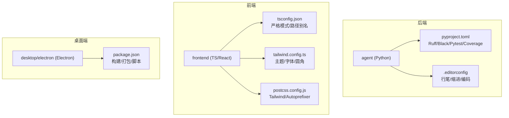
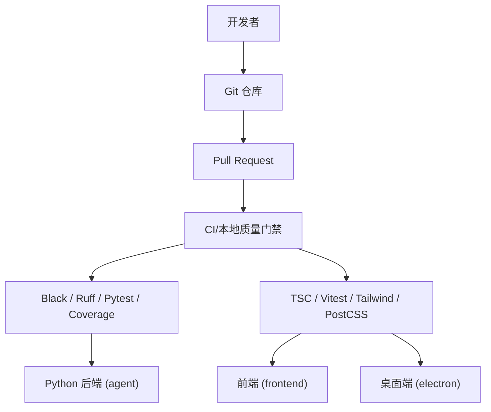
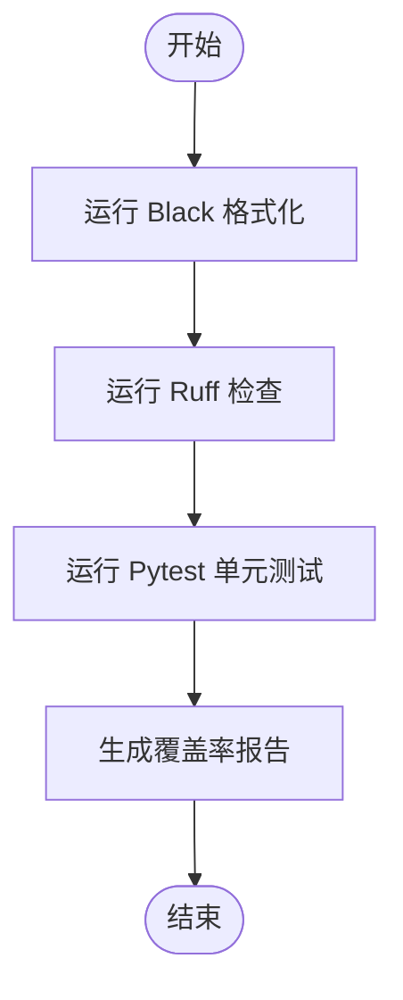
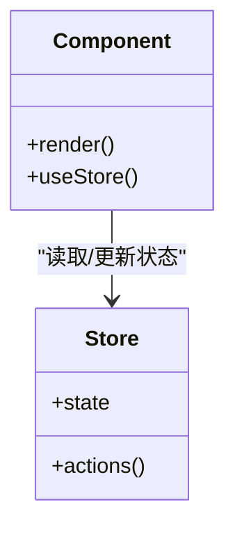
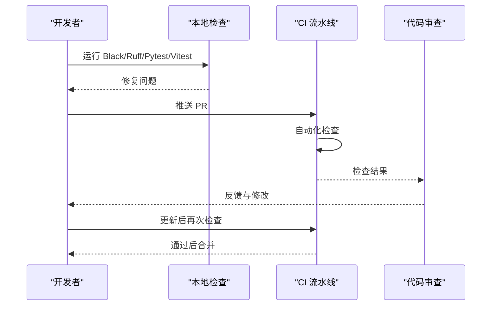
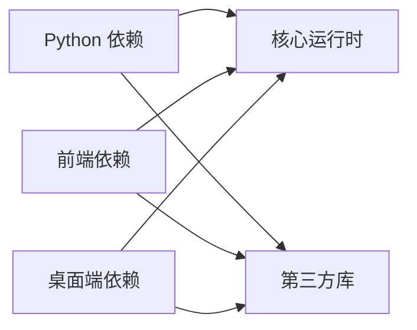

# 代码规范

<cite>
**本文引用的文件**
- [pyproject.toml](file://pyproject.toml)
- [.editorconfig](file://agent/.editorconfig)
- [package.json](file://frontend/package.json)
- [tsconfig.json](file://frontend/tsconfig.json)
- [tailwind.config.ts](file://frontend/tailwind.config.ts)
- [postcss.config.js](file://frontend/postcss.config.js)
- [package.json](file://desktop/electron/package.json)
- [pull_request_template.md](file://.github/pull_request_template.md)
</cite>

## 目录
1. [简介](#简介)
2. [项目结构](#项目结构)
3. [核心组件](#核心组件)
4. [架构总览](#架构总览)
5. [详细组件分析](#详细组件分析)
6. [依赖分析](#依赖分析)
7. [性能考虑](#性能考虑)
8. [故障排查指南](#故障排查指南)
9. [结论](#结论)
10. [附录](#附录)

## 简介
本规范面向 Vibe-Trading 项目的 Python 后端与 TypeScript/React 前端，统一编码风格、工具链配置、提交与分支策略、代码审查清单与质量门禁。目标是在保证一致性的同时提升可读性、可维护性与交付质量。

## 项目结构
- 后端（Python）：以 agent 为主包，通过 pyproject.toml 管理依赖、测试、覆盖率与 Ruff 规则；使用 Black 进行格式化；EditorConfig 统一基础文件约定。
- 前端（TypeScript/React）：基于 Vite + React + TailwindCSS；通过 tsconfig.json 启用严格类型检查；Tailwind 主题集中管理样式变量；PostCSS 负责自动前缀。
- 桌面端（Electron）：独立 package.json 管理构建与打包脚本，提供多语言资源与平台特定构建流程。

**图表来源**
- [pyproject.toml:283-314](file://pyproject.toml#L283-L314)
- [.editorconfig:1-8](file://agent/.editorconfig#L1-L8)
- [tsconfig.json:1-24](file://frontend/tsconfig.json#L1-L24)
- [tailwind.config.ts:1-33](file://frontend/tailwind.config.ts#L1-L33)
- [postcss.config.js:1-7](file://frontend/postcss.config.js#L1-L7)
- [package.json:9-22](file://desktop/electron/package.json#L9-L22)

**章节来源**
- [pyproject.toml:283-314](file://pyproject.toml#L283-L314)
- [.editorconfig:1-8](file://agent/.editorconfig#L1-L8)
- [tsconfig.json:1-24](file://frontend/tsconfig.json#L1-L24)
- [tailwind.config.ts:1-33](file://frontend/tailwind.config.ts#L1-L33)
- [postcss.config.js:1-7](file://frontend/postcss.config.js#L1-L7)
- [package.json:9-22](file://desktop/electron/package.json#L9-L22)

## 核心组件
- Python 编码标准
  - 遵循 PEP 8；行宽由 Ruff 限制为 120；忽略 E501 以避免与 Black 冲突。
  - 使用 Black 作为唯一格式化工具；Ruff 仅做 lint。
  - EditorConfig 强制 UTF-8、LF 行尾、末尾换行、去除尾部空白。
  - 测试使用 pytest，覆盖率统计排除测试与 __init__.py。
- TypeScript/React 前端规范
  - 严格模式开启，禁用未使用局部变量与参数，禁止 switch 穿透。
  - 模块解析采用 bundler 模式，支持 .ts/.tsx 直接导入。
  - 样式通过 Tailwind 主题集中定义颜色、字体、圆角等设计令牌。
  - PostCSS 集成 Tailwind 与 Autoprefixer。
- 桌面端 Electron
  - 构建脚本包含 tsc 编译、静态资源复制与打包；提供多语言与平台构建选项。

**章节来源**
- [pyproject.toml:267-273](file://pyproject.toml#L267-L273)
- [pyproject.toml:283-314](file://pyproject.toml#L283-L314)
- [.editorconfig:1-8](file://agent/.editorconfig#L1-L8)
- [tsconfig.json:1-24](file://frontend/tsconfig.json#L1-L24)
- [tailwind.config.ts:1-33](file://frontend/tailwind.config.ts#L1-L33)
- [postcss.config.js:1-7](file://frontend/postcss.config.js#L1-L7)
- [package.json:9-22](file://desktop/electron/package.json#L9-L22)

## 架构总览
下图展示前后端与桌面端的工程关系及质量工具在开发流程中的位置。

[本图为概念图，不映射具体源码文件]

## 详细组件分析

### Python 编码规范（PEP 8、命名、注释、函数与类设计）
- 命名约定
  - 模块与包：小写下划线分隔；类名采用大驼峰；函数/方法/变量采用小写下划线；常量全大写。
  - 避免单字母命名（除循环索引或数学场景），提高可读性。
- 注释与文档字符串
  - 公共 API 必须提供 docstring；复杂逻辑添加行内注释解释“为什么”而非“是什么”。
  - 保持注释与实现同步更新。
- 函数与类设计原则
  - 单一职责：函数长度适中，职责清晰；必要时拆分子函数。
  - 显式优于隐式：默认参数简单且不可变；避免可变默认值。
  - 错误处理：优先抛出明确异常类型，并在调用处捕获并转换为领域异常。
- 格式化工具
  - Black：统一格式化，无需额外配置；行宽由 Black 控制。
  - Ruff：lint 规则选择 E/F/W，忽略 E501；针对 factors/zoo 目录放宽 F401 以匹配论文公式引用。
  - EditorConfig：UTF-8、LF、末尾换行、去尾白。

**图表来源**
- [pyproject.toml:267-273](file://pyproject.toml#L267-L273)
- [pyproject.toml:283-314](file://pyproject.toml#L283-L314)
- [pyproject.toml:275-304](file://pyproject.toml#L275-L304)

**章节来源**
- [pyproject.toml:267-273](file://pyproject.toml#L267-L273)
- [pyproject.toml:283-314](file://pyproject.toml#L283-L314)
- [pyproject.toml:275-304](file://pyproject.toml#L275-L304)
- [.editorconfig:1-8](file://agent/.editorconfig#L1-L8)

### TypeScript/React 前端代码规范
- 组件结构
  - 按功能组织目录：components、hooks、pages、stores、lib、types。
  - 组件文件采用 .tsx，类型声明与实现分离时放在 types 目录。
- 状态管理
  - 使用 Zustand 管理全局状态；将状态与 UI 解耦，便于测试与复用。
- 样式规范
  - 使用 Tailwind 原子类；主题色、字体、圆角集中在 tailwind.config.ts。
  - 通过 CSS 变量定义品牌色与语义色，确保暗色模式一致性。
- 构建与检查
  - tsconfig.json 启用 strict、noUnusedLocals、noUnusedParameters、noFallthroughCasesInSwitch。
  - 使用 Vite 构建，Vitest 进行测试与覆盖率。

**图表来源**
- [tsconfig.json:1-24](file://frontend/tsconfig.json#L1-L24)
- [tailwind.config.ts:1-33](file://frontend/tailwind.config.ts#L1-L33)
- [postcss.config.js:1-7](file://frontend/postcss.config.js#L1-L7)
- [package.json:17-56](file://frontend/package.json#L17-L56)

**章节来源**
- [tsconfig.json:1-24](file://frontend/tsconfig.json#L1-L24)
- [tailwind.config.ts:1-33](file://frontend/tailwind.config.ts#L1-L33)
- [postcss.config.js:1-7](file://frontend/postcss.config.js#L1-L7)
- [package.json:17-56](file://frontend/package.json#L17-L56)

### 代码格式化工具使用（Black、Ruff、Prettier）
- Black
  - 作为唯一 Python 格式化工具，无需额外配置；提交前建议运行 black --check 或 pre-commit 钩子。
- Ruff
  - 规则集选择 E/F/W；忽略 E501；针对 factors/zoo 放宽 F401。
  - 建议在 CI 中执行 ruff check 作为质量门禁。
- Prettier
  - 当前仓库未发现 Prettier 配置；若引入前端格式化，建议与 ESLint 集成，并与 Tailwind 插件配合。

**章节来源**
- [pyproject.toml:267-273](file://pyproject.toml#L267-L273)
- [pyproject.toml:283-314](file://pyproject.toml#L283-L314)

### Git 提交规范与分支策略
- 提交信息格式
  - 建议使用 Conventional Commits：type(scope): description
  - 常见 type：feat、fix、docs、style、refactor、perf、test、build、ci、chore、revert
  - 描述简洁明了，必要时在正文说明动机与影响范围。
- 分支管理策略
  - main/master：稳定发布分支
  - develop：集成开发分支
  - feature/*：新功能分支
  - fix/*：修复分支
  - release/*：预发布分支
  - hotfix/*：紧急修复分支
- 版本控制最佳实践
  - 小步提交、频繁合并；PR 需附带变更说明与测试覆盖。
  - 使用标签标记版本；变更日志自动生成或手动维护。

**章节来源**
- [.github/pull_request_template.md](file://.github/pull_request_template.md)

### 代码审查清单与质量检查流程
- 审查清单
  - 功能正确性：是否满足需求，边界条件是否处理
  - 可读性：命名清晰、结构合理、注释充分
  - 可维护性：模块化、低耦合、高内聚
  - 安全性：输入校验、敏感信息脱敏、权限控制
  - 性能：复杂度评估、缓存与异步优化
  - 测试：单元/集成测试覆盖关键路径
- 质量检查流程
  - 本地：black --check、ruff check、pytest、vitest
  - CI：上述检查自动化；失败阻断合并
  - 覆盖率：设定阈值（可按阶段调整）

[本图为概念图，不映射具体源码文件]

## 依赖分析
- Python 依赖
  - 核心依赖包括 FastAPI、Uvicorn、Pydantic、LangChain、Pandas、NumPy、Scipy、DuckDB、Matplotlib 等。
  - 可选依赖按功能域拆分（如 ibkr、longbridge、stats、channels 等）。
- 前端依赖
  - React、Zustand、ECharts、i18next、TailwindCSS、Vite、Vitest。
- 桌面端依赖
  - Electron、Electron Builder、TypeScript。

**图表来源**
- [pyproject.toml:24-69](file://pyproject.toml#L24-L69)
- [package.json:17-56](file://frontend/package.json#L17-L56)
- [package.json:24-29](file://desktop/electron/package.json#L24-L29)

**章节来源**
- [pyproject.toml:24-69](file://pyproject.toml#L24-L69)
- [package.json:17-56](file://frontend/package.json#L17-L56)
- [package.json:24-29](file://desktop/electron/package.json#L24-L29)

## 性能考虑
- Python
  - 合理使用 NumPy/Pandas 向量化操作；避免在热点路径中使用过多 Python 循环。
  - 对 IO 密集任务使用异步（aiohttp/httpx）；数据库查询使用 DuckDB 高效分析。
  - 控制日志级别与输出量，避免阻塞主线程。
- 前端
  - 使用虚拟列表渲染大数据集；按需加载组件与数据。
  - 图表使用 ECharts 的增量更新与数据采样。
  - 利用 Tailwind 的 JIT 模式减少 CSS 体积。
- 桌面端
  - 主进程与渲染进程职责分离；避免在主进程执行重计算。
  - 使用 asar 打包减小体积；按需加载资源。

[本节为通用指导，不直接分析具体文件]

## 故障排查指南
- 常见问题
  - 格式化不一致：确认已安装 Black 并使用相同版本；在编辑器中启用保存时格式化。
  - 类型错误：检查 tsconfig.strict 与 noUnusedLocals/Parameters；使用 IDE 提示快速定位。
  - 样式异常：确认 Tailwind 配置 content 路径包含所有模板与组件；清理缓存后重建。
  - 测试失败：查看 pytest/vitest 输出；复现最小用例；增加断言与日志。
- 调试技巧
  - 使用 Ruff 的 --fix 自动修复部分问题。
  - 使用 Vitest 的 watch 模式快速迭代。
  - 使用 Chrome DevTools 与 React DevTools 调试前端状态与渲染。

**章节来源**
- [pyproject.toml:283-314](file://pyproject.toml#L283-L314)
- [tsconfig.json:1-24](file://frontend/tsconfig.json#L1-L24)
- [tailwind.config.ts:1-33](file://frontend/tailwind.config.ts#L1-L33)

## 结论
本规范通过统一的编码标准、工具链配置与质量门禁，确保 Python 后端与 TypeScript/React 前端的一致性与高质量交付。建议团队在本地与 CI 中严格执行，持续改进并定期回顾规范有效性。

## 附录
- 示例对比（路径引用，非代码内容）
  - 正确写法：遵循 PEP 8 命名与 Black 格式化；函数短小且职责单一；使用类型注解与 docstring。
  - 错误写法：混合大小写命名；过长函数；缺少类型与文档；硬编码魔法数字。
  - 参考路径：
    - [pyproject.toml:267-273](file://pyproject.toml#L267-L273)
    - [pyproject.toml:283-314](file://pyproject.toml#L283-L314)
    - [tsconfig.json:1-24](file://frontend/tsconfig.json#L1-L24)
    - [tailwind.config.ts:1-33](file://frontend/tailwind.config.ts#L1-L33)