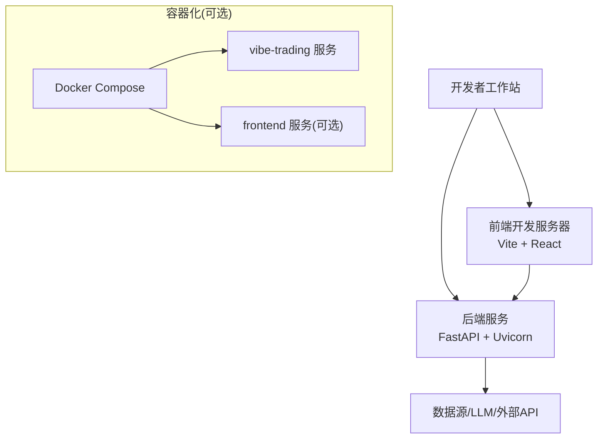
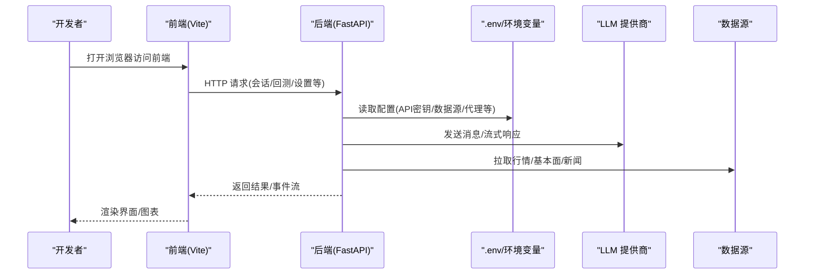
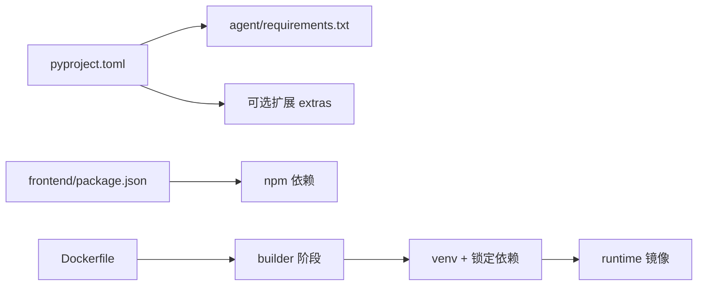

# 开发环境搭建

<cite>
**本文引用的文件**
- [README.md](file://README.md)
- [pyproject.toml](file://pyproject.toml)
- [agent/requirements.txt](file://agent/requirements.txt)
- [frontend/package.json](file://frontend/package.json)
- [Dockerfile](file://Dockerfile)
- [docker-compose.yml](file://docker-compose.yml)
- [.devcontainer/devcontainer.json](file://.devcontainer/devcontainer.json)
- [start.bat](file://start.bat)
- [CONTRIBUTING.md](file://CONTRIBUTING.md)
- [agent/src/config/env_schema.py](file://agent/src/config/env_schema.py)
- [agent/src/providers/llm.py](file://agent/src/providers/llm.py)
</cite>

## 目录
1. [简介](#简介)
2. [项目结构](#项目结构)
3. [核心组件](#核心组件)
4. [架构总览](#架构总览)
5. [详细组件分析](#详细组件分析)
6. [依赖关系分析](#依赖关系分析)
7. [性能注意事项](#性能注意事项)
8. [故障排查指南](#故障排查指南)
9. [结论](#结论)
10. [附录](#附录)

## 简介
本指南面向首次参与 Vibe-Trading 的开发者，目标是帮助你在最短时间内搭建可运行的本地开发环境。内容涵盖：
- Python 3.11+、Node.js 与包管理器（npm/yarn）安装与版本要求
- IDE 推荐配置（VS Code、PyCharm）
- 依赖安装（核心、开发、可选扩展）
- 环境变量与 .env 配置（API 密钥、数据源、代理等）
- Docker / Docker Compose 开发模式
- 常见问题定位与解决

## 项目结构
Vibe-Trading 由后端（Python/FastAPI）、前端（React/Vite）、桌面端（Electron，可选）以及丰富的量化与数据工具组成。关键入口与配置文件如下：
- 后端 CLI 与服务：通过 pyproject 暴露命令，支持 serve、MCP 等
- 前端：基于 Vite + React，提供 Web UI
- 容器化：Dockerfile 多阶段构建；docker-compose 编排前后端与持久卷
- 开发容器：devcontainer 一键初始化 VS Code 远程开发环境

图表来源
- [Dockerfile:1-119](file://Dockerfile#L1-L119)
- [docker-compose.yml:1-90](file://docker-compose.yml#L1-L90)

章节来源
- [pyproject.toml:77-87](file://pyproject.toml#L77-L87)
- [frontend/package.json:1-58](file://frontend/package.json#L1-L58)
- [Dockerfile:1-119](file://Dockerfile#L1-L119)
- [docker-compose.yml:1-90](file://docker-compose.yml#L1-L90)

## 核心组件
- 后端服务：FastAPI + Uvicorn，提供 REST/SSE/MCP 能力，并托管前端静态资源
- 前端：React + Vite，提供交互式研究、回测、会话管理界面
- 数据层：多种市场数据加载器（A股、美股、港股、加密货币、期货等），可通过环境变量启用或切换
- LLM 适配：OpenAI、Anthropic、DeepSeek、Moonshot 等，统一通过 LangChain/LangGraph 接入
- 量化与回测：因子库、优化器、风险指标、期权定价等
- 渠道集成：IM/邮件/聊天平台通道（可选扩展）

章节来源
- [agent/requirements.txt:1-69](file://agent/requirements.txt#L1-L69)
- [pyproject.toml:24-69](file://pyproject.toml#L24-L69)
- [README.md:1-166](file://README.md#L1-L166)

## 架构总览
下图展示了本地开发时各组件的交互关系：前端通过 Vite 启动开发服务器，调用后端 API；后端读取 .env 中的凭据与环境变量，连接 LLM 与数据源；Docker 模式下通过 Compose 编排服务与持久卷。

图表来源
- [docker-compose.yml:1-90](file://docker-compose.yml#L1-L90)
- [agent/src/config/env_schema.py:685-716](file://agent/src/config/env_schema.py#L685-L716)
- [agent/src/providers/llm.py:952-988](file://agent/src/providers/llm.py#L952-L988)

## 详细组件分析

### 一、Python 环境与依赖安装
- Python 版本要求：>=3.11，<3.14
- 推荐使用 venv 或 conda 创建独立环境
- 安装方式：
  - 基础安装：pip install -e ".[dev]"
  - 仅后端运行：pip install -e .
  - 可选扩展按需安装（见“可选依赖”）

章节来源
- [pyproject.toml:1-23](file://pyproject.toml#L1-L23)
- [CONTRIBUTING.md:9-11](file://CONTRIBUTING.md#L9-L11)

### 二、Node.js 与前端依赖
- Node.js 版本要求：>=22.22.0
- 进入 frontend 目录执行 npm install
- 开发模式：npm run dev（默认端口 5899）
- 生产构建：npm run build

章节来源
- [frontend/package.json:1-58](file://frontend/package.json#L1-L58)

### 三、IDE 推荐配置
- VS Code：
  - 使用内置 Dev Container 快速初始化（自动安装 Python/Node、依赖、端口转发）
  - 推荐扩展：Python、Pylance、ESLint、Prettier
- PyCharm：
  - 解释器指向项目 venv
  - 配置 pytest 工作目录为 agent/tests
  - 配置运行配置：后端 api_server.py，前端 npm run dev

章节来源
- [.devcontainer/devcontainer.json:1-40](file://.devcontainer/devcontainer.json#L1-L40)

### 四、依赖包安装清单
- 核心依赖（后端）：参见 agent/requirements.txt
- 开发依赖：black、pytest、ruff 等（通过 dev extra）
- 可选依赖（按功能启用）：
  - ibkr、longbridge、mt5、deepseek、anthropic、openbb、krx、stats、ashare、harmonic、channels 及各类 IM 通道

章节来源
- [agent/requirements.txt:1-69](file://agent/requirements.txt#L1-L69)
- [pyproject.toml:105-237](file://pyproject.toml#L105-L237)

### 五、环境变量与 .env 配置
- 环境变量集中定义在 env_schema.py，所有键名以 UPPER_SNAKE_CASE 形式生效
- 常见类别与用途：
  - LLM：LANGCHAIN_PROVIDER、LANGCHAIN_MODEL_NAME、TIMEOUT_SECONDS、MAX_RETRIES、OPENAI_MODEL、ANTHROPIC_*、MOONSHOT_USER_AGENT 等
  - 数据源：TUSHARE_TOKEN、FINNHUB_API_KEY、ALPHAVANTAGE_API_KEY、TIINGO_API_KEY、FMP_API_KEY、FRED_API_KEY、QVERIS_*、LONGBRIDGE_*、ETORO_*、TICKERALL_* 等
  - API 安全：API_AUTH_KEY、CORS_ORIGINS、ENABLE_SESSION_RUNTIME、VIBE_TRADING_TRUST_DOCKER_LOOPBACK、VIBE_TRADING_ENABLE_SHELL_TOOLS 等
  - Agent 调优：TOKEN_THRESHOLD、VT_HEARTBEAT_INTERVAL_S、VIBE_TRADING_TOOL_TIMEOUT_SECONDS、VIBE_TRADING_ENABLE_SCHEDULER 等
  - 路径与存储：VIBE_TRADING_HYPOTHESES_PATH、VIBE_TRADING_GOAL_DB_PATH、VIBE_TRADING_STRATEGY_STORE_DB_PATH 等
  - OCR：VIBE_TRADING_OCR_ENGINE、VIBE_TRADING_OCR_LLM_MODEL
  - 记忆系统：VT_MEMORY=off|on|full 及 VT_MEMORY_* 开关
- .env 文件位置与优先级：
  - 运行时优先从 ~/.vibe-trading/.env 加载，其次 agent/.env，再次当前工作目录 .env
  - 写入设置会落盘到 agent/.env，并在内存中刷新配置
- 示例（请根据实际供应商替换占位符）：
  - LLM：设置 LANGCHAIN_PROVIDER=openai，OPENAI_MODEL=gpt-4o，并配置 OPENAI_API_KEY
  - 数据源：设置 TUSHARE_TOKEN、FINNHUB_API_KEY 等
  - API：设置 API_AUTH_KEY 用于本地/局域网访问保护
  - 代理：如需走代理，可在系统或进程环境中设置 HTTP_PROXY/HTTPS_PROXY/ALL_PROXY

章节来源
- [agent/src/config/env_schema.py:132-593](file://agent/src/config/env_schema.py#L132-L593)
- [agent/src/providers/llm.py:952-988](file://agent/src/providers/llm.py#L952-L988)
- [agent/src/trading/tap_forward.py:49-76](file://agent/src/trading/tap_forward.py#L49-L76)

### 六、Docker 开发环境
- 单镜像运行：
  - 构建镜像：docker build -t vibe-trading .
  - 运行容器：docker run -p 127.0.0.1:8899:8899 --env-file agent/.env vibe-trading
- Compose 开发模式：
  - 启动后端：docker compose up -d vibe-trading
  - 启动前端（热重载）：docker compose --profile frontend up -d frontend
  - 数据持久化：runs、sessions、uploads、~/.vibe-trading 等通过命名卷保存
  - Ollama 集成：默认通过 host.docker.internal:11434 访问宿主 Ollama，可通过 OLLAMA_BASE_URL 覆盖
- 健康检查：容器暴露 /live 端点，默认端口 8899

章节来源
- [Dockerfile:1-119](file://Dockerfile#L1-L119)
- [docker-compose.yml:1-90](file://docker-compose.yml#L1-L90)

### 七、Windows 一键启动
- 双击 start.bat 可同时启动后端与前端开发服务
- 后端默认监听 8000，前端默认 5899（脚本内硬编码，若端口冲突请修改脚本）

章节来源
- [start.bat:1-30](file://start.bat#L1-L30)

## 依赖关系分析
- 后端依赖集中在 pyproject.toml 与 agent/requirements.txt，前者声明项目元数据与可选扩展，后者列出运行时依赖
- 前端依赖在 frontend/package.json，包含运行时与开发依赖
- Docker 构建流程：先构建前端静态资源，再构建 Python 虚拟环境并安装锁定依赖，最后生成最小运行时镜像

图表来源
- [pyproject.toml:24-237](file://pyproject.toml#L24-L237)
- [agent/requirements.txt:1-69](file://agent/requirements.txt#L1-L69)
- [frontend/package.json:1-58](file://frontend/package.json#L1-L58)
- [Dockerfile:1-119](file://Dockerfile#L1-L119)

章节来源
- [pyproject.toml:24-237](file://pyproject.toml#L24-L237)
- [agent/requirements.txt:1-69](file://agent/requirements.txt#L1-L69)
- [frontend/package.json:1-58](file://frontend/package.json#L1-L58)
- [Dockerfile:1-119](file://Dockerfile#L1-L119)

## 性能注意事项
- 数据缓存：开启 VIBE_TRADING_DATA_CACHE 可缓存历史行情，减少网络请求与速率限制影响
- 并行度：VIBE_TRADING_BENCH_WORKERS 控制基准测试并行度；Swarm 相关超时与并发参数可按需调整
- 资源限制：Compose 已对单实例设置 CPU/内存/PID 上限，避免失控任务占用过多资源
- PDF 渲染：weasyprint 需要系统字体与图形库，Docker 镜像已预装必要依赖

章节来源
- [agent/src/config/env_schema.py:166-214](file://agent/src/config/env_schema.py#L166-L214)
- [docker-compose.yml:40-66](file://docker-compose.yml#L40-L66)
- [Dockerfile:73-86](file://Dockerfile#L73-L86)

## 故障排查指南
- 无法连接 LLM：
  - 检查 LANGCHAIN_PROVIDER、OPENAI_MODEL、ANTHROPIC_*、MOONSHOT_USER_AGENT 等是否配置正确
  - 确认代理设置（HTTP_PROXY/HTTPS_PROXY/ALL_PROXY）与网络可达性
  - 查看日志中的 provider_stream_error 提示，必要时降低重试次数或更换模型
- 数据源不可用：
  - 核对 TUSHARE_TOKEN、FINNHUB_API_KEY、ALPHAVANTAGE_API_KEY、TIINGO_API_KEY、FMP_API_KEY、FRED_API_KEY 等
  - 对于 CCXT，检查 CCXT_EXCHANGE、CCXT_TIMEOUT_MS、CCXT_FETCH_BUDGET_S
- API 访问受限：
  - 本地开发建议保持 localhost；如需局域网访问，设置 API_AUTH_KEY 或在 Compose 中启用信任 Docker 环回
  - CORS 问题可通过 CORS_ORIGINS 与 VIBE_TRADING_EXTRA_CORS_ORIGINS 调整
- 权限与路径：
  - Windows 下确保 ~/.vibe-trading 与 agent/.env 可写
  - 容器内以非 root 用户运行，注意挂载卷权限
- 前端无法连接后端：
  - 确认 VITE_API_URL 指向正确的后端地址（Compose 中默认为 http://vibe-trading:8899）
  - 端口冲突时修改 start.bat 或 Compose 映射端口

章节来源
- [agent/src/config/env_schema.py:132-593](file://agent/src/config/env_schema.py#L132-L593)
- [docker-compose.yml:68-83](file://docker-compose.yml#L68-L83)
- [start.bat:10-29](file://start.bat#L10-L29)

## 结论
按照本指南完成 Python/Node 环境、依赖安装、环境变量配置后，即可在本地或容器中运行 Vibe-Trading。推荐使用 Dev Container 或 Docker Compose 以获得一致的开发体验。遇到问题时，优先检查 .env 配置与网络连通性，并结合日志进行定位。

## 附录
- 常用命令参考：
  - 后端服务：vibe-trading serve --host 0.0.0.0 --port 8899
  - MCP 服务：vibe-trading-mcp
  - 前端开发：cd frontend && npm run dev
  - 容器启动：docker compose up -d
- 文档与仓库信息：
  - 项目主页、文档、仓库地址见 pyproject.toml 的 project.urls

章节来源
- [pyproject.toml:71-87](file://pyproject.toml#L71-L87)
- [Dockerfile:110-119](file://Dockerfile#L110-L119)