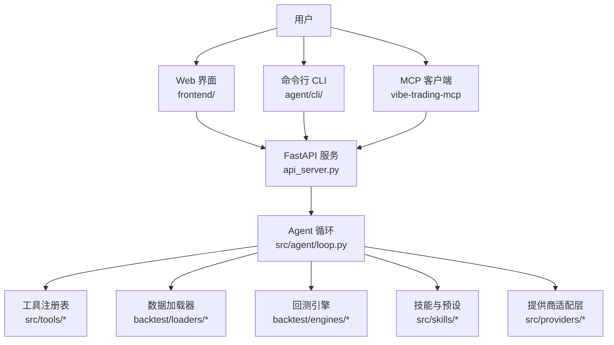
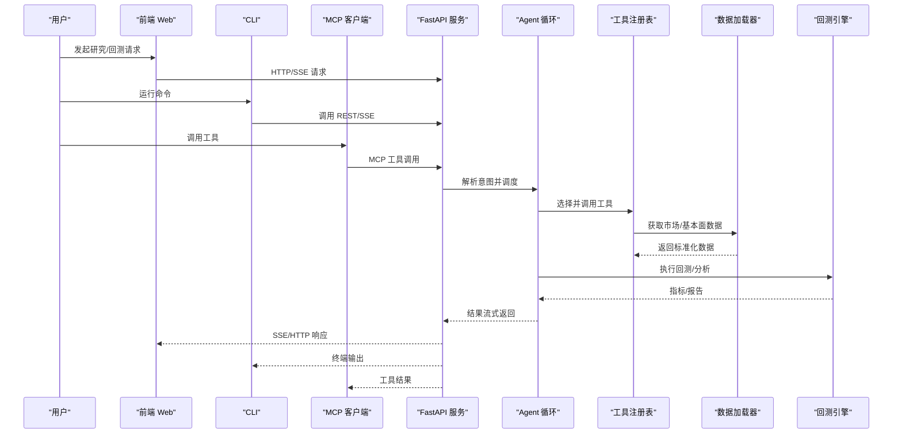
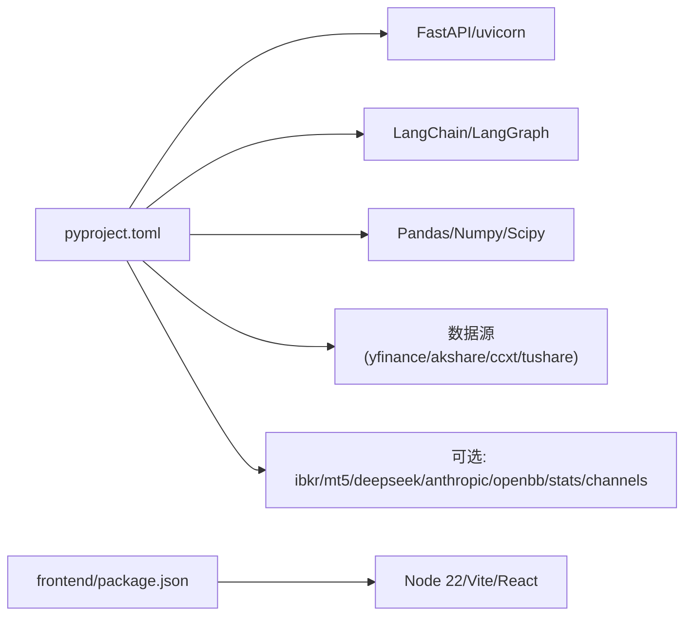

# 开发者指南

<cite>
**本文引用的文件**
- [README.md](file://README.md)
- [CONTRIBUTING.md](file://CONTRIBUTING.md)
- [AGENT_CONTRIBUTOR_GUIDE.md](file://AGENT_CONTRIBUTOR_GUIDE.md)
- [SECURITY.md](file://SECURITY.md)
- [pyproject.toml](file://pyproject.toml)
- [agent/requirements.txt](file://agent/requirements.txt)
- [.devcontainer/devcontainer.json](file://.devcontainer/devcontainer.json)
- [.github/workflows/test.yml](file://.github/workflows/test.yml)
- [agent/SKILL.md](file://agent/SKILL.md)
</cite>

## 目录
1. [简介](#简介)
2. [项目结构](#项目结构)
3. [核心组件](#核心组件)
4. [架构总览](#架构总览)
5. [详细组件分析](#详细组件分析)
6. [依赖分析](#依赖分析)
7. [性能考虑](#性能考虑)
8. [故障排查指南](#故障排查指南)
9. [结论](#结论)
10. [附录](#附录)

## 简介
本指南面向新贡献者与资深开发者，覆盖开发环境搭建、代码规范与开发流程、测试策略、贡献流程、插件/技能扩展、性能优化与调试技巧，以及从简单功能到复杂特性的实战示例。Vibe-Trading 是一个自然语言驱动的金融研究 AI 代理，后端基于 FastAPI + ReAct Agent，前端为 Vite+React，提供多市场回测、因子库、期权定价、多智能体协作等能力。

## 项目结构
仓库采用前后端分离与模块化组织：
- agent：Python 后端、CLI、MCP 服务、回测引擎、数据加载器、工具与技能、会话与配置等
- frontend：React + Vite 前端应用
- desktop/electron：桌面壳（Windows 打包与生命周期管理）
- wiki：文档站点与教程
- .github/workflows：CI/CD 流水线
- pyproject.toml：包元数据、可选依赖、pytest/ruff/coverage 配置
- .devcontainer：VS Code Dev Container 配置

图表来源
- [agent/SKILL.md:135-209](file://agent/SKILL.md#L135-L209)
- [pyproject.toml:77-87](file://pyproject.toml#L77-L87)

章节来源
- [README.md:1-120](file://README.md#L1-L120)
- [pyproject.toml:77-87](file://pyproject.toml#L77-L87)

## 核心组件
- 后端服务与入口
  - FastAPI 服务与脚本入口：api_server.py、mcp_server.py
  - CLI 入口：vibe-trading（通过 pyproject.scripts 映射）
- Agent 与工具
  - Agent 循环与上下文：src/agent/loop.py、context.py
  - 工具注册与调用：src/tools/*
  - 技能与预设：src/skills/*、swarm/presets/*.yaml
- 数据与回测
  - 数据加载器：backtest/loaders/*（多源 OHLCV、基本面、新闻等）
  - 回测引擎：backtest/engines/*（多市场引擎）
- 提供商与 LLM
  - 提供商适配：src/providers/*（OpenAI、Anthropic、本地模型等）
- 前端与桌面
  - 前端：frontend/（React + Vite）
  - 桌面壳：desktop/electron/（Windows 打包、安全存储）

章节来源
- [pyproject.toml:77-87](file://pyproject.toml#L77-L87)
- [agent/SKILL.md:135-209](file://agent/SKILL.md#L135-L209)

## 架构总览
下图展示了从用户交互到数据处理与回测的端到端流程，包括 CLI、Web UI、MCP 与后端服务的交互路径。

图表来源
- [agent/SKILL.md:135-209](file://agent/SKILL.md#L135-L209)
- [pyproject.toml:77-87](file://pyproject.toml#L77-L87)

## 详细组件分析

### 开发环境与 IDE 配置
- Python 版本与依赖
  - 要求 Python 3.11–3.13（pyproject 指定 >=3.11,<3.14）
  - 核心依赖在 pyproject.toml 与 agent/requirements.txt 中声明
- 安装方式
  - 使用 pip 安装可编辑模式并包含开发依赖：pip install -e ".[dev]"
  - 可选功能通过 extras 安装（如 ibkr、anthropic、openbb、stats、ashare、channels 等）
- VS Code Dev Container
  - 使用 mcr.microsoft.com/devcontainers/python:1-3.11-bookworm
  - 自动安装 Node 20、端口转发 8899（API）、5899（前端）
  - 预装 Python/ESLint/Prettier 扩展，postCreateCommand 完成依赖安装
- 本地启动
  - 后端：python api_server.py（或 uvicorn 启动）
  - 前端：cd frontend && npm ci && npm run dev
  - MCP：vibe-trading-mcp

章节来源
- [pyproject.toml:1-23](file://pyproject.toml#L1-L23)
- [pyproject.toml:105-237](file://pyproject.toml#L105-L237)
- [agent/requirements.txt:1-69](file://agent/requirements.txt#L1-L69)
- [.devcontainer/devcontainer.json:1-40](file://.devcontainer/devcontainer.json#L1-L40)

### 代码规范与开发流程
- 格式与静态检查
  - black 格式化；ruff 检查（行宽 120，忽略 E501）
  - 仅对变更文件运行，避免无关格式清理混入 PR
- 类型与文档
  - 公共函数与方法需类型注解
  - Google 风格 docstrings（Args/Returns/Raises）
- 提交规范
  - 社区贡献必须携带 DCO Signed-off-by: 尾注
  - 禁止添加 Co-Authored-By 或 AI 助手署名
- Alpha 因子贡献审查清单
  - 纯度门控（AST 白名单导入）
  - 前瞻门控（无负向移位、无未来泄漏）
  - __alpha_meta__ 字段完整且符合 Pydantic 校验
  - compute(panel) 契约：形状一致、NaN 保留、无 inf/nan
  - LaTeX 公式与代码一致；许可证与归属标注正确

章节来源
- [CONTRIBUTING.md:85-157](file://CONTRIBUTING.md#L85-L157)
- [CONTRIBUTING.md:19-42](file://CONTRIBUTING.md#L19-L42)

### 测试策略
- 单元测试与集成测试
  - pytest 配置：testpaths=agent/tests，支持 unit/integration 标记
  - CI 中运行：排除 e2e_backtest 与 live-only 测试，生成覆盖率报告
- 前端测试
  - Vitest：npm run test（CI 中 npx vitest run）
- 安全与合规门禁
  - 依赖哈希锁定验证（requirements-lock.txt、requirements-channels-lock.txt）
  - 仓库安全门禁脚本 tools/ci_grep_gates.sh
- 推荐本地测试命令
  - 通用：pytest --ignore=agent/tests/e2e_backtest -q
  - 因子：pytest agent/tests/factors/test_alpha_purity.py agent/tests/factors/test_lookahead.py -q
  - 前端：cd frontend && npm ci && npm run build

章节来源
- [pyproject.toml:275-304](file://pyproject.toml#L275-L304)
- [.github/workflows/test.yml:26-89](file://.github/workflows/test.yml#L26-L89)
- [AGENT_CONTRIBUTOR_GUIDE.md:24-84](file://AGENT_CONTRIBUTOR_GUIDE.md#L24-L84)

### 贡献指南
- 问题报告与功能请求
  - 使用 GitHub Issue 模板
  - 安全问题通过 GitHub Security Advisory 私下报告
- Pull Request 流程
  - 每个社区提交必须带 Signed-off-by:
  - PR 应说明目标、影响范围、测试计划、风险与回滚路径
- 高风险操作
  - 涉及订单、OAuth、MCP、网络服务、部署、发布等需明确审批
  - 不得在常规 PR 验证中执行真实交易或支付流程

章节来源
- [CONTRIBUTING.md:19-42](file://CONTRIBUTING.md#L19-L42)
- [AGENT_CONTRIBUTOR_GUIDE.md:41-140](file://AGENT_CONTRIBUTOR_GUIDE.md#L41-L140)
- [SECURITY.md:9-28](file://SECURITY.md#L9-L28)

### 插件开发指南（工具、技能、API 扩展）
- 工具开发
  - 在 src/tools 下实现工具逻辑，遵循输入输出契约与安全边界
  - 通过工具注册表暴露给 Agent 与 MCP
- 技能创建
  - 在 src/skills 下创建 SKILL.md 与相关资源，描述能力、依赖与环境变量
  - 可通过 load_skill/list_skills 发现与加载
- API 扩展
  - 新增路由模块至 src/api/*，保持鉴权与限流
  - 通过 pyproject 的 package-data 确保资源打包
- 外部 MCP 服务器
  - 可在 ~/.vibe-trading/agent.json 配置外部 MCP 服务器，启用工具子集
  - 支持 stdio、SSE、streamable HTTP 传输

章节来源
- [agent/SKILL.md:220-385](file://agent/SKILL.md#L220-L385)
- [pyproject.toml:89-103](file://pyproject.toml#L89-L103)

### 性能优化与调试技巧
- 数据与计算
  - 使用 bottleneck/NumPy 加速滚动计算
  - 启用可选数据缓存（VIBE_TRADING_DATA_CACHE）减少重复下载
- 并行与批处理
  - alpha bench 并行化避免重复大负载
  - 批量加载器（yfinance、futu）全命中时跳过网络/连接
- 调试
  - provider doctor 打印脱敏环境快照，快速定位挂起问题
  - 使用 trace 与 tool_result call_id 匹配回溯
  - 前端按需加载图表数据，降低首屏压力

章节来源
- [README.md:600-750](file://README.md#L600-L750)
- [README.md:800-950](file://README.md#L800-L950)

### 实际开发示例
- 简单功能：新增一个只读工具
  - 在 src/tools 下实现函数，定义输入输出模型
  - 注册到工具注册表，编写单元测试
  - 通过 CLI/MCP/Web 调用验证
- 中级特性：接入新的数据源
  - 在 backtest/loaders 下实现 loader，声明单位与区间映射
  - 加入回退链，完善异常与空值处理
  - 编写 loader 测试与回归用例
- 复杂特性：新增回测引擎
  - 在 backtest/engines 下实现引擎，对接数据加载器与指标计算
  - 增加约束与风控（仓位、费用、滑点）
  - 通过 alpha bench/backtest 进行基准与回归测试

章节来源
- [agent/SKILL.md:76-120](file://agent/SKILL.md#L76-L120)
- [CONTRIBUTING.md:120-139](file://CONTRIBUTING.md#L120-L139)

## 依赖分析
- 核心依赖
  - FastAPI、uvicorn、httpx、pydantic、sse-starlette 用于 API 与 SSE
  - langchain/langgraph 用于 Agent 编排
  - pandas、numpy、scipy、bottleneck、duckdb 用于数据分析
  - yfinance、akshare、ccxt、tushare 等数据源
- 可选依赖
  - ibkr、mt5、deepseek、anthropic、openbb、stats、ashare、channels 等
- 前端依赖
  - Node 22、Vite、React Router 8、Tailwind、Vitest

图表来源
- [pyproject.toml:24-69](file://pyproject.toml#L24-L69)
- [pyproject.toml:105-237](file://pyproject.toml#L105-L237)

章节来源
- [pyproject.toml:24-69](file://pyproject.toml#L24-L69)
- [pyproject.toml:105-237](file://pyproject.toml#L105-L237)

## 性能考虑
- 数据层
  - 统一区间归一化与单位声明，避免回退链中的量纲不一致
  - 使用缓存与批处理减少网络与连接开销
- 计算层
  - 向量化与 fast path（bottleneck/NumPy）
  - 合理分片与分页，避免超大结果阻塞
- 前端
  - 懒加载图表与按需请求，提升首屏体验
- 运行时
  - 流式响应与心跳，避免假死
  - 超时与重试策略，提高鲁棒性

[本节为通用指导，不直接分析具体文件]

## 故障排查指南
- 常见问题
  - 依赖冲突：使用 requirements-lock 与 CI 哈希验证
  - Provider 挂起：使用 provider doctor 收集脱敏信息
  - 数据缺失：检查 loader 回退链与区间映射
- 安全与权限
  - 远程访问需设置 API_AUTH_KEY
  - 外部 MCP 服务器需显式信任与工具白名单
- 日志与追踪
  - 使用 trace 与 tool_result call_id 关联
  - 前端控制台与后端日志结合定位

章节来源
- [SECURITY.md:23-28](file://SECURITY.md#L23-L28)
- [AGENT_CONTRIBUTOR_GUIDE.md:98-111](file://AGENT_CONTRIBUTOR_GUIDE.md#L98-L111)

## 结论
本指南提供了从零开始搭建开发环境、遵循代码规范与提交流程、实施分层测试、安全贡献与插件扩展的系统方法。借助内置工具、技能与回测引擎，开发者可以快速实现从简单功能到复杂特性的迭代。建议在新功能上线前完成本地与 CI 测试、安全门禁与性能回归，确保稳定可靠。

[本节为总结，不直接分析具体文件]

## 附录
- 快速参考
  - 安装：pip install -e ".[dev,openbb,stats]"
  - 运行测试：pytest --ignore=agent/tests/e2e_backtest -q
  - 前端构建：cd frontend && npm ci && npm run build
  - 启动服务：python api_server.py / vibe-trading serve
  - 启动 MCP：vibe-trading-mcp

章节来源
- [.github/workflows/test.yml:35-89](file://.github/workflows/test.yml#L35-L89)
- [AGENT_CONTRIBUTOR_GUIDE.md:24-84](file://AGENT_CONTRIBUTOR_GUIDE.md#L24-L84)