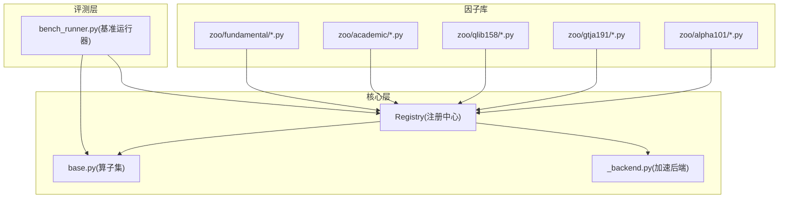
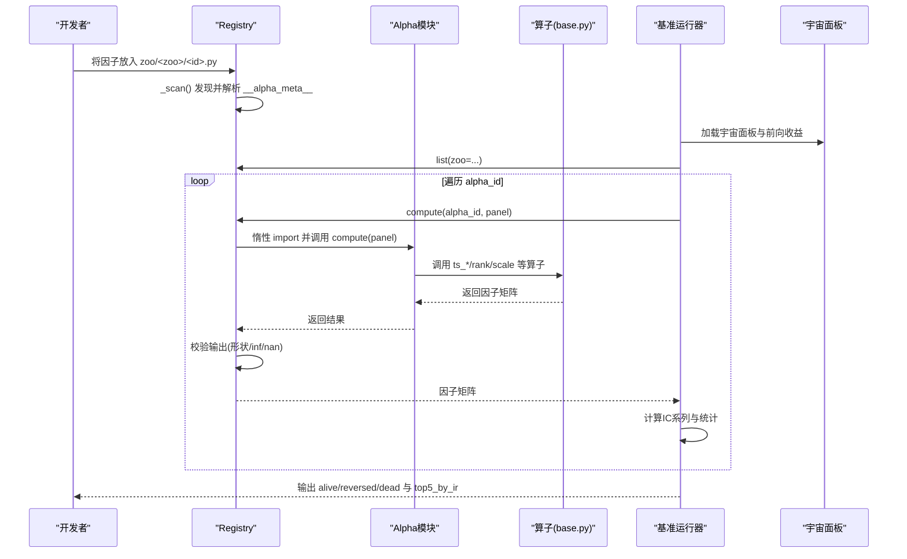
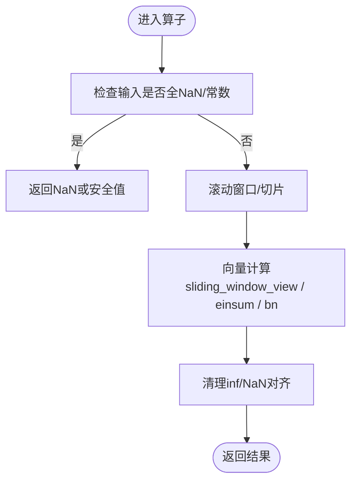
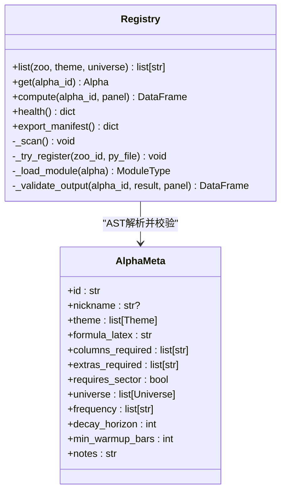
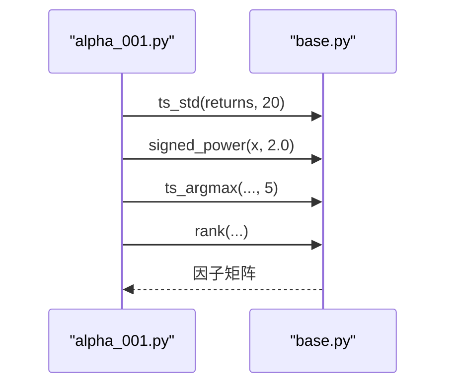
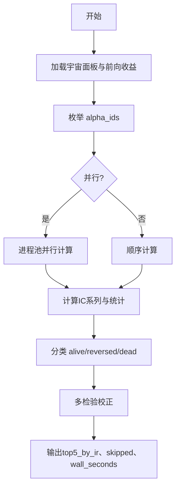
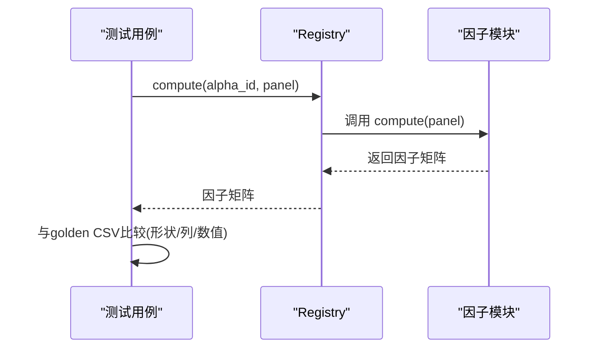
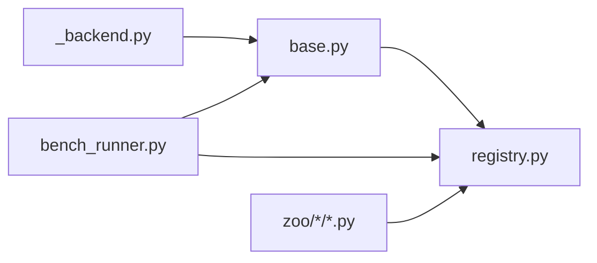

# 因子插件开发

<cite>
**本文引用的文件**
- [agent/src/factors/base.py](file://agent/src/factors/base.py)
- [agent/src/factors/registry.py](file://agent/src/factors/registry.py)
- [agent/src/factors/__init__.py](file://agent/src/factors/__init__.py)
- [agent/src/factors/_backend.py](file://agent/src/factors/_backend.py)
- [agent/src/factors/bench_runner.py](file://agent/src/factors/bench_runner.py)
- [agent/src/factors/zoo/alpha101/alpha_001.py](file://agent/src/factors/zoo/alpha101/alpha_001.py)
- [agent/src/factors/zoo/alpha101/alpha_002.py](file://agent/src/factors/zoo/alpha101/alpha_002.py)
- [agent/tests/factors/test_base.py](file://agent/tests/factors/test_base.py)
- [agent/tests/factors/test_alpha101_samples.py](file://agent/tests/factors/test_alpha101_samples.py)
- [agent/tests/factors/conftest.py](file://agent/tests/factors/conftest.py)
</cite>

## 目录
1. [简介](#简介)
2. [项目结构](#项目结构)
3. [核心组件](#核心组件)
4. [架构总览](#架构总览)
5. [详细组件分析](#详细组件分析)
6. [依赖关系分析](#依赖关系分析)
7. [性能考量](#性能考量)
8. [故障排查指南](#故障排查指南)
9. [结论](#结论)
10. [附录](#附录)

## 简介
本指南面向希望在系统中开发“因子插件”的研究者与工程师，覆盖从基类与算子、时间序列处理、注册机制、回测集成、测试评估到发布流程的完整路径。系统采用“宽面板（wide DataFrame）+ 算子组合”的设计：每个因子模块通过声明式元数据被自动发现与校验，运行时惰性加载并执行 compute(panel) 返回与输入同形的因子矩阵；基准评测通过 IC 系列统计对因子进行筛选与分类。

## 项目结构
- 因子基类与算子：提供横截面与时间序列算子、市场感知 VWAP、NaN 策略与严格的前视规避。
- 注册中心：AST 扫描 zoo 目录、解析 __alpha_meta__、惰性导入 compute、输出健康报告与清单。
- 基准运行器：加载宇宙面板、计算前向收益、并行计算 IC 并产出 alive/reversed/dead 分类与多检验校正。
- 示例因子：alpha101 子库中的具体实现，展示如何组合算子完成复杂逻辑。
- 测试套件：数值黄金样本对比、算子行为验证、网络隔离等。

**图示来源**
- [agent/src/factors/registry.py:201-397](file://agent/src/factors/registry.py#L201-L397)
- [agent/src/factors/base.py:62-356](file://agent/src/factors/base.py#L62-L356)
- [agent/src/factors/_backend.py:1-69](file://agent/src/factors/_backend.py#L1-L69)
- [agent/src/factors/bench_runner.py:137-409](file://agent/src/factors/bench_runner.py#L137-L409)

**章节来源**
- [agent/src/factors/registry.py:1-20](file://agent/src/factors/registry.py#L1-L20)
- [agent/src/factors/__init__.py:1-49](file://agent/src/factors/__init__.py#L1-L49)

## 核心组件
- 算子与协议
  - AlphaCompute 协议：要求 compute(panel) -> pd.DataFrame，输入为宽面板字典，输出为同形因子矩阵。
  - 基础算子：rank、scale、ts_mean/std/max/min/corr/cov/delta、ts_rank、ts_argmax/argmin、decay_linear、signed_power、safe_div、vwap。
  - NaN 策略：所有算子传播 NaN，禁止静默填零；常数窗口相关/协方差返回 NaN；禁止前视（delta 的 lag < 1 报错）。
- 注册中心
  - AST 静态解析 __alpha_meta__，强类型校验 AlphaMeta，限制主题、宇宙、频率、最小预热等。
  - 惰性导入 compute，严格输出校验（形状一致、无 inf、NaN 比例阈值）。
- 基准运行器
  - 加载宇宙面板与前向收益，按 zoo 枚举 alpha，并行计算 IC 系列，统计均值、标准差、IR、正比、分类与多检验校正。

**章节来源**
- [agent/src/factors/base.py:49-356](file://agent/src/factors/base.py#L49-L356)
- [agent/src/factors/registry.py:87-125](file://agent/src/factors/registry.py#L87-L125)
- [agent/src/factors/registry.py:321-397](file://agent/src/factors/registry.py#L321-L397)
- [agent/src/factors/bench_runner.py:137-409](file://agent/src/factors/bench_runner.py#L137-L409)

## 架构总览
下图展示了因子从注册、计算到评测的端到端流程。

**图示来源**
- [agent/src/factors/registry.py:219-397](file://agent/src/factors/registry.py#L219-L397)
- [agent/src/factors/base.py:62-356](file://agent/src/factors/base.py#L62-L356)
- [agent/src/factors/bench_runner.py:137-409](file://agent/src/factors/bench_runner.py#L137-L409)

## 详细组件分析

### 因子基类与算子（base.py）
- 设计要点
  - 宽面板约定：index 为交易日期，columns 为标的代码；compute 返回同形矩阵。
  - 严格 NaN 传播：warmup 期与缺失值保持 NaN，避免静默填充。
  - 前视规避：delta(d) 强制 d >= 1，拒绝负移项。
  - 高性能实现：滑动窗口使用 numpy sliding_window_view；可选 bottleneck 加速 argmax/argmin。
- 关键算子
  - 横截面：rank（行内百分位排名）、scale（L1 归一化）、zscore（行内标准化）。
  - 时间序列：ts_mean/std/max/min、ts_corr/ts_cov、ts_rank、ts_argmax/argmin、decay_linear、delta、signed_power、safe_div。
  - 市场感知：vwap 支持不同市场（A股金额/手数缩放、美股典型价、加密优先 vwap）。

**图示来源**
- [agent/src/factors/base.py:110-161](file://agent/src/factors/base.py#L110-L161)
- [agent/src/factors/base.py:238-269](file://agent/src/factors/base.py#L238-L269)
- [agent/src/factors/base.py:282-313](file://agent/src/factors/base.py#L282-L313)
- [agent/src/factors/_backend.py:1-69](file://agent/src/factors/_backend.py#L1-L69)

**章节来源**
- [agent/src/factors/base.py:1-356](file://agent/src/factors/base.py#L1-L356)
- [agent/src/factors/_backend.py:1-69](file://agent/src/factors/_backend.py#L1-L69)

### 注册机制（registry.py）
- 命名规范
  - zoo_id、alpha_id_short 必须匹配正则 ^[a-z][a-z0-9_]{0,31}$。
  - id 字段建议遵循 "<zoo>_<short>" 约定，便于溯源。
- 元数据模型（AlphaMeta）
  - 必填：id、theme、formula_latex、columns_required、universe、frequency、decay_horizon、min_warmup_bars。
  - 可选：nickname、extras_required、requires_sector、notes。
  - columns_required 仅允许价格列集合或 fund: 前缀的基本面列。
- 扫描与加载
  - _scan() 递归 zoo 目录，跳过下划线前缀与缓存目录。
  - load_alpha_meta_from_py() 使用 AST 解析 __alpha_meta__，不导入模块。
  - compute() 惰性 import 模块，调用 compute(panel)，并做输出校验（形状、inf、NaN 比例）。
- 健康与清单
  - health() 返回已加载数量、失败数与错误详情。
  - export_manifest() 生成可 JSON 序列化的清单，供 wiki 渲染。

**图示来源**
- [agent/src/factors/registry.py:87-125](file://agent/src/factors/registry.py#L87-L125)
- [agent/src/factors/registry.py:219-397](file://agent/src/factors/registry.py#L219-L397)

**章节来源**
- [agent/src/factors/registry.py:1-454](file://agent/src/factors/registry.py#L1-L454)

### 因子实现示例（alpha101）
- alpha_001：基于收益条件动量，组合 signed_power、ts_std、ts_argmax、rank。
- alpha_002：量价相关偏差，组合 delta(log(volume))、rank、ts_corr。
- 共同模式：在 compute(panel) 中读取所需列，调用 base 算子组合，返回因子矩阵。

**图示来源**
- [agent/src/factors/zoo/alpha101/alpha_001.py:54-65](file://agent/src/factors/zoo/alpha101/alpha_001.py#L54-L65)
- [agent/src/factors/zoo/alpha101/alpha_002.py:54-64](file://agent/src/factors/zoo/alpha101/alpha_002.py#L54-L64)
- [agent/src/factors/base.py:62-356](file://agent/src/factors/base.py#L62-L356)

**章节来源**
- [agent/src/factors/zoo/alpha101/alpha_001.py:1-65](file://agent/src/factors/zoo/alpha101/alpha_001.py#L1-L65)
- [agent/src/factors/zoo/alpha101/alpha_002.py:1-64](file://agent/src/factors/zoo/alpha101/alpha_002.py#L1-L64)

### 基准评测与回测集成（bench_runner.py）
- 数据对齐
  - 通过工具函数加载宇宙面板与前向收益，确保时间与标的对齐。
- 计算优化
  - 进程池并行：每进程初始化一次大对象（panel、return_df），减少拷贝开销。
  - 惰性注册：默认单例 Registry，避免重复 AST 扫描。
- 指标与分类
  - 计算 IC 系列，统计 ic_mean、ic_std、ir、正比、t 统计。
  - 分类阈值：alive（正向且显著）、reversed（显著负向）、dead（其他）。
  - 多检验校正：对最佳 IR 进行期望最大值与衰减概率估计。

**图示来源**
- [agent/src/factors/bench_runner.py:137-409](file://agent/src/factors/bench_runner.py#L137-L409)

**章节来源**
- [agent/src/factors/bench_runner.py:1-409](file://agent/src/factors/bench_runner.py#L1-L409)

### 测试方法与基准对比
- 算子单元测试：覆盖 warmup、NaN 传播、除零、前视规避、vwap 市场差异等。
- 数值黄金样本：选取代表性 alpha，固定随机种子构建面板，与预存 CSV 比对至 1e-6 相对误差。
- 网络隔离：pytest_socket 禁用网络，确保因子纯函数性。

**图示来源**
- [agent/tests/factors/test_alpha101_samples.py:39-138](file://agent/tests/factors/test_alpha101_samples.py#L39-L138)
- [agent/tests/factors/test_base.py:32-245](file://agent/tests/factors/test_base.py#L32-L245)
- [agent/tests/factors/conftest.py:1-35](file://agent/tests/factors/conftest.py#L1-L35)

**章节来源**
- [agent/tests/factors/test_base.py:1-245](file://agent/tests/factors/test_base.py#L1-L245)
- [agent/tests/factors/test_alpha101_samples.py:1-138](file://agent/tests/factors/test_alpha101_samples.py#L1-L138)
- [agent/tests/factors/conftest.py:1-35](file://agent/tests/factors/conftest.py#L1-L35)

## 依赖关系分析
- 模块耦合
  - registry 依赖 base 的 Alpha 与算子语义；bench_runner 依赖 registry 与 factor_analysis_core。
  - _backend 提供可选的 bottleneck 加速，不影响主路径正确性。
- 外部依赖
  - pandas/numpy 用于宽面板与向量化计算。
  - pydantic 用于元数据强校验。
  - multiprocessing 用于并行基准评测。
- 潜在循环依赖
  - 当前结构清晰，未见循环导入；registry 仅在 compute 时惰性导入模块。

**图示来源**
- [agent/src/factors/base.py:1-356](file://agent/src/factors/base.py#L1-L356)
- [agent/src/factors/registry.py:1-454](file://agent/src/factors/registry.py#L1-L454)
- [agent/src/factors/_backend.py:1-69](file://agent/src/factors/_backend.py#L1-L69)
- [agent/src/factors/bench_runner.py:1-409](file://agent/src/factors/bench_runner.py#L1-L409)

**章节来源**
- [agent/src/factors/registry.py:1-454](file://agent/src/factors/registry.py#L1-L454)
- [agent/src/factors/base.py:1-356](file://agent/src/factors/base.py#L1-L356)

## 性能考量
- 向量化与窗口
  - 使用 numpy sliding_window_view 与 einsum 实现 decay_linear、ts_rank 等，避免 Python 级循环。
  - 可选 bottleneck move_argmax/move_argmin，提升约 350x 速度。
- 内存管理
  - 基准评测使用进程池，并在每个 worker 中缓存 panel 与 return_df，减少跨进程传输成本。
  - 注册中心惰性导入模块，避免启动时全部加载。
- 数值稳定性
  - safe_div 防止除零产生 inf；ts_corr/ts_cov 将 inf 替换为 NaN；输出校验拒绝 inf 与过高 NaN 比例。

**章节来源**
- [agent/src/factors/base.py:110-313](file://agent/src/factors/base.py#L110-L313)
- [agent/src/factors/_backend.py:1-69](file://agent/src/factors/_backend.py#L1-L69)
- [agent/src/factors/bench_runner.py:52-101](file://agent/src/factors/bench_runner.py#L52-L101)
- [agent/src/factors/registry.py:401-422](file://agent/src/factors/registry.py#L401-L422)

## 故障排查指南
- 常见错误
  - 缺少必需列：SkipAlpha 异常，提示 missing required columns/extras/sector。
  - 输出非法：RegistryError 抛出，包含形状不一致、含 inf、NaN 比例过高。
  - 前视违规：delta(d<1) 抛出 ValueError。
- 定位步骤
  - 使用 Registry.health() 查看加载失败原因。
  - 使用 get_source(alpha_id) 获取源码进行审查。
  - 在测试中复现：构造小面板，断言 warmup/NaN/边界行为。
- 调试技巧
  - 关闭 bottleneck 环境变量以排除加速库差异。
  - 使用 pytest_socket 禁用网络，确保因子纯函数性。

**章节来源**
- [agent/src/factors/registry.py:128-134](file://agent/src/factors/registry.py#L128-L134)
- [agent/src/factors/registry.py:321-397](file://agent/src/factors/registry.py#L321-L397)
- [agent/src/factors/base.py:272-279](file://agent/src/factors/base.py#L272-L279)
- [agent/tests/factors/conftest.py:1-35](file://agent/tests/factors/conftest.py#L1-L35)

## 结论
本系统通过“算子+注册+基准评测”的解耦架构，提供了高可靠、高性能、易扩展的因子开发与评估平台。开发者只需关注 compute 逻辑与 __alpha_meta__ 声明，即可无缝接入生态；评测侧提供严格的统计与多检验校正，帮助识别稳健因子。

## 附录

### 因子开发完整示例（从简单到复杂）
- 简单技术指标
  - 示例：alpha_002 使用 delta(log(volume))、rank、ts_corr 捕捉量价背离。
  - 参考路径：[alpha_002.py:54-64](file://agent/src/factors/zoo/alpha101/alpha_002.py#L54-L64)
- 复杂多因子模型
  - 示例：alpha_001 组合 signed_power、ts_std、ts_argmax、rank，形成条件动量信号。
  - 参考路径：[alpha_001.py:54-65](file://agent/src/factors/zoo/alpha101/alpha_001.py#L54-L65)
- 自定义因子步骤
  - 在 zoo/<your_zoo>/your_factor.py 中定义 __alpha_meta__ 与 compute(panel)。
  - 使用 base 提供的算子组合，确保 NaN 策略与前视规避。
  - 通过 Registry().compute("your_zoo_your_factor", panel) 验证输出。

**章节来源**
- [agent/src/factors/zoo/alpha101/alpha_001.py:1-65](file://agent/src/factors/zoo/alpha101/alpha_001.py#L1-L65)
- [agent/src/factors/zoo/alpha101/alpha_002.py:1-64](file://agent/src/factors/zoo/alpha101/alpha_002.py#L1-L64)
- [agent/src/factors/base.py:62-356](file://agent/src/factors/base.py#L62-L356)

### 因子库组织与发布流程
- 组织
  - 按主题划分 zoo 目录（如 alpha101、gtja191、qlib158、academic、fundamental）。
  - 每个因子独立 .py 文件，文件名即 short_id，需符合命名规范。
- 发布
  - 提交前运行基准评测，确认 IC 统计与分类合理。
  - 使用 Registry.export_manifest() 导出清单，更新 wiki 或文档站点。
  - 维护 __alpha_meta__ 的 theme/universe/frequency 等元数据，保证可检索性与兼容性。

**章节来源**
- [agent/src/factors/registry.py:197-260](file://agent/src/factors/registry.py#L197-L260)
- [agent/src/factors/registry.py:424-444](file://agent/src/factors/registry.py#L424-L444)