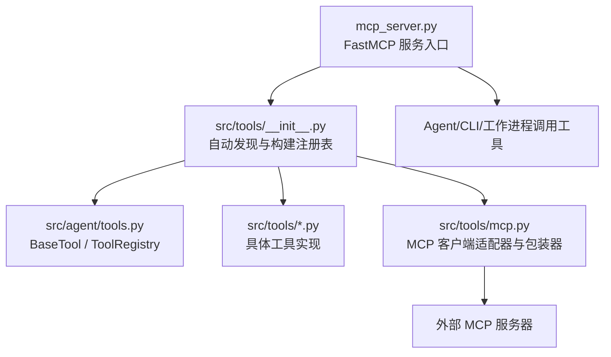
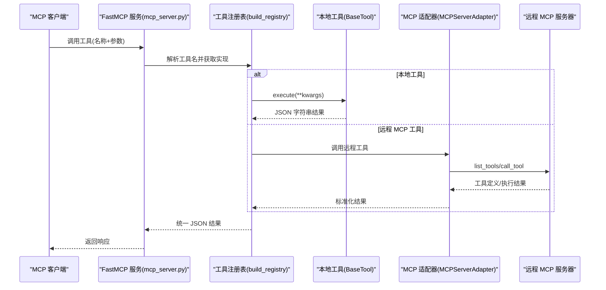
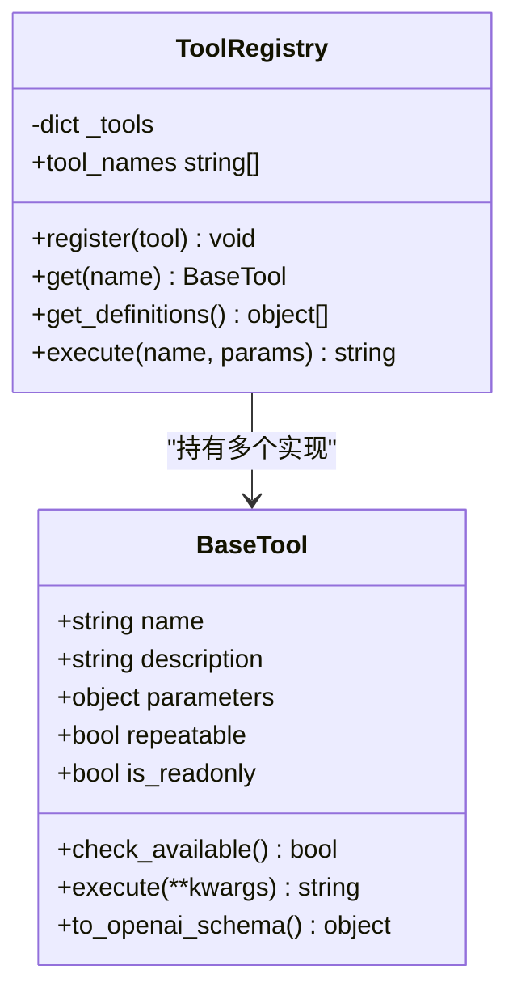
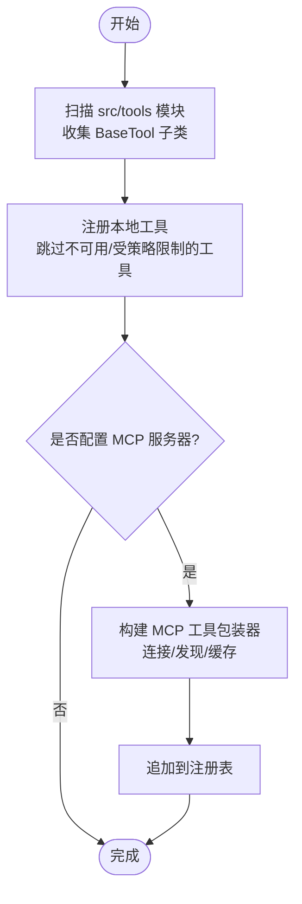
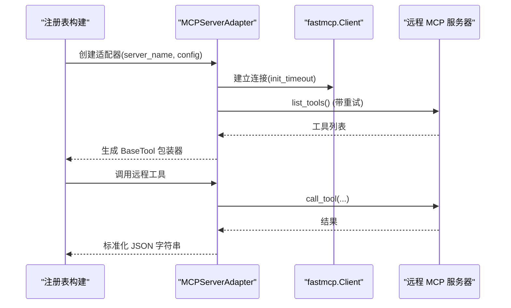
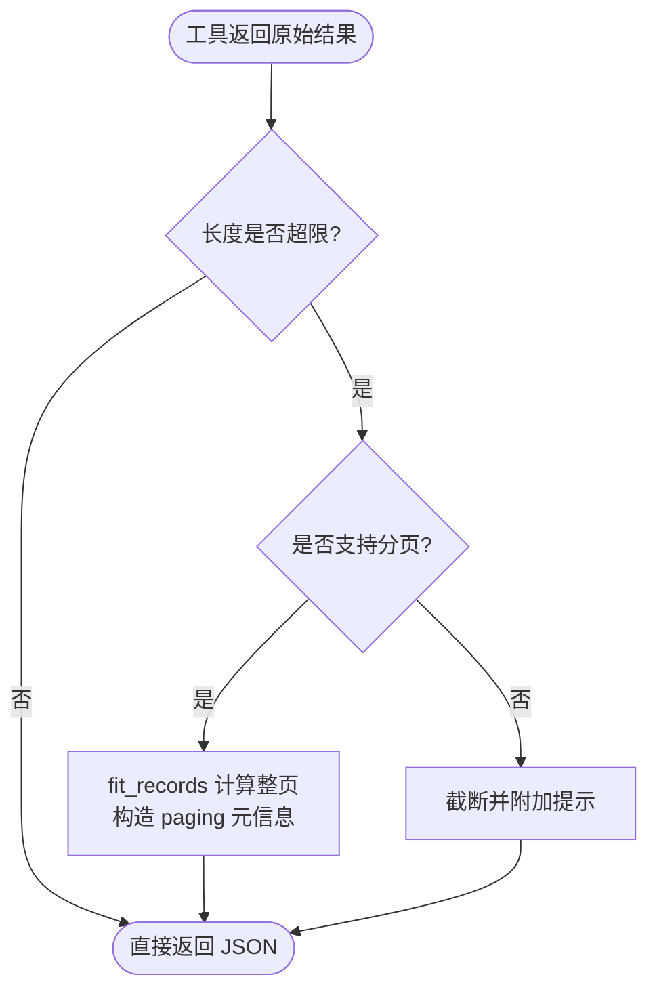
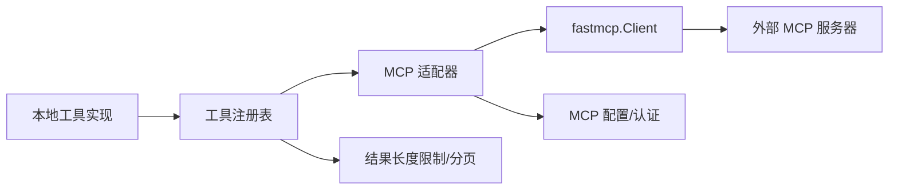

# 工具插件开发

<cite>
**本文引用的文件**
- [agent/src/agent/tools.py](file://agent/src/agent/tools.py)
- [agent/src/tools/__init__.py](file://agent/src/tools/__init__.py)
- [agent/src/tools/mcp.py](file://agent/src/tools/mcp.py)
- [agent/mcp_server.py](file://agent/mcp_server.py)
- [agent/src/config/schema.py](file://agent/src/config/schema.py)
- [agent/src/tools/_result_paging.py](file://agent/src/tools/_result_paging.py)
- [agent/src/config/limits.py](file://agent/src/config/limits.py)
- [agent/src/tools/market_data_tool.py](file://agent/src/tools/market_data_tool.py)
- [agent/src/tools/web_search_tool.py](file://agent/src/tools/web_search_tool.py)
</cite>

## 目录
1. [简介](#简介)
2. [项目结构](#项目结构)
3. [核心组件](#核心组件)
4. [架构总览](#架构总览)
5. [详细组件分析](#详细组件分析)
6. [依赖关系分析](#依赖关系分析)
7. [性能考虑](#性能考虑)
8. [故障排查指南](#故障排查指南)
9. [结论](#结论)
10. [附录](#附录)

## 简介
本指南面向希望为 Vibe-Trading 平台开发“工具插件”的工程师与研究者，系统说明：
- 工具注册机制：如何通过继承基类、声明参数与描述，自动发现并注册到全局工具注册表；如何扩展 MCP 远程工具。
- 生命周期管理：初始化、执行、错误处理、资源清理的最佳实践。
- 类型系统与数据契约：输入校验（JSON Schema）、输出格式（JSON 字符串）、分页与截断策略。
- 完整示例：从简单数据查询工具到复杂分析工具的落地路径。
- 测试与调试：单元测试、MCP 集成测试、常见问题定位技巧。
- 与 MCP 协议集成：本地工具与远程 MCP 工具的装配、安全与限流、传输方式选择。

## 项目结构
Vibe-Trading 的工具体系由“本地工具 + 可选的远程 MCP 工具”组成，统一通过工具注册表暴露给上层 Agent、CLI 或 MCP Server。

图表来源
- [agent/mcp_server.py:319-334](file://agent/mcp_server.py#L319-L334)
- [agent/src/tools/__init__.py:76-125](file://agent/src/tools/__init__.py#L76-L125)
- [agent/src/agent/tools.py:13-95](file://agent/src/agent/tools.py#L13-L95)
- [agent/src/tools/mcp.py:343-370](file://agent/src/tools/mcp.py#L343-L370)

章节来源
- [agent/mcp_server.py:1-800](file://agent/mcp_server.py#L1-L800)
- [agent/src/tools/__init__.py:1-365](file://agent/src/tools/__init__.py#L1-L365)
- [agent/src/agent/tools.py:1-95](file://agent/src/agent/tools.py#L1-L95)
- [agent/src/tools/mcp.py:1-594](file://agent/src/tools/mcp.py#L1-L594)

## 核心组件
- BaseTool：所有本地工具的抽象基类，定义 name、description、parameters、repeatable、is_readonly 等元信息，以及 execute() 接口和 to_openai_schema() 转换。
- ToolRegistry：工具注册表，负责注册、查找、批量导出 OpenAI 函数调用 schema，以及统一执行与异常封装。
- 自动发现与装配：通过扫描 src/tools 包下的模块，收集 BaseTool 子类并实例化注册；支持按策略过滤 shell 工具、注入会话 ID、合并 MCP 远程工具。
- MCP 适配层：将远端 MCP 工具以 BaseTool 形式包装进本地注册表，屏蔽传输细节（stdio/SSE/Streamable HTTP），并提供重试、缓存与安全门控。

章节来源
- [agent/src/agent/tools.py:13-95](file://agent/src/agent/tools.py#L13-L95)
- [agent/src/tools/__init__.py:33-115](file://agent/src/tools/__init__.py#L33-L115)
- [agent/src/tools/mcp.py:343-370](file://agent/src/tools/mcp.py#L343-L370)

## 架构总览
下图展示了从 MCP 服务端到工具执行的端到端流程，包括本地工具与远程 MCP 工具的混合装配。

图表来源
- [agent/mcp_server.py:319-334](file://agent/mcp_server.py#L319-L334)
- [agent/src/tools/__init__.py:185-273](file://agent/src/tools/__init__.py#L185-L273)
- [agent/src/tools/mcp.py:745-759](file://agent/src/tools/mcp.py#L745-L759)

## 详细组件分析

### 工具基类与注册表
- BaseTool
  - 属性：name、description、parameters(JSON Schema)、repeatable、is_readonly。
  - 方法：check_available() 用于依赖检查；execute(**kwargs) 必须返回 JSON 字符串；to_openai_schema() 生成 OpenAI function calling 描述。
- ToolRegistry
  - register/get/get_definitions：集中管理工具集合与对外 schema。
  - execute(name, params)：统一执行入口，捕获异常并返回标准错误 JSON，保证上层稳定消费。

图表来源
- [agent/src/agent/tools.py:13-95](file://agent/src/agent/tools.py#L13-L95)

章节来源
- [agent/src/agent/tools.py:13-95](file://agent/src/agent/tools.py#L13-L95)

### 自动发现与装配
- 自动发现：导入 src/tools 下所有非下划线开头的模块，收集 BaseTool 子类并去重缓存。
- 构建注册表：build_registry() 会：
  - 先注册本地工具（可排除 shell 工具）。
  - 若配置了 MCP 服务器，则追加远程工具包装器。
  - 对特定工具注入 session_id、event_callback、persistent_memory 等上下文。
- 白名单过滤：build_filtered_registry()/build_swarm_registry() 支持按名称过滤，便于 Swarm 工作进程按需加载。

图表来源
- [agent/src/tools/__init__.py:33-115](file://agent/src/tools/__init__.py#L33-L115)
- [agent/src/tools/__init__.py:185-273](file://agent/src/tools/__init__.py#L185-L273)

章节来源
- [agent/src/tools/__init__.py:33-115](file://agent/src/tools/__init__.py#L33-L115)
- [agent/src/tools/__init__.py:185-273](file://agent/src/tools/__init__.py#L185-L273)

### MCP 客户端适配器与远程工具包装
- MCPServerAdapter：封装 fastmcp.Client，支持 stdio/SSE/Streamable HTTP 传输，维护 init_timeout/tool_timeout，提供 list_tools 重试与缓存。
- build_mcp_tool_wrappers：将远端工具规范转换为本地 BaseTool 包装器，统一命名（如 mcp_<server>_<tool>），并可结合 live broker 安全门控进行读写隔离。
- 安全与可用性：
  - 对 live broker 进行 URL/host 检测，必要时跳过未授权通道或隐藏写操作工具。
  - 失败不中断其他服务器发现，仅记录警告。

图表来源
- [agent/src/tools/mcp.py:343-370](file://agent/src/tools/mcp.py#L343-L370)
- [agent/src/tools/mcp.py:729-759](file://agent/src/tools/mcp.py#L729-L759)

章节来源
- [agent/src/tools/mcp.py:343-370](file://agent/src/tools/mcp.py#L343-L370)
- [agent/src/tools/mcp.py:729-759](file://agent/src/tools/mcp.py#L729-L759)

### 工具类型系统与数据契约
- 输入验证：
  - 本地工具使用 JSON Schema 描述参数（type、properties、required、enum、default 等），由上层框架在调用前校验。
  - MCP 服务端对部分 list/dict 参数增加 BeforeValidator，兼容客户端发送的 JSON 字符串参数。
- 输出格式：
  - 所有工具统一返回 JSON 字符串，便于模型解析与错误处理。
  - 注册表在执行时捕获异常并返回标准错误结构。
- 分页与截断：
  - 工具结果存在字符上限（默认 10,000 字符），超过时会附加提示，避免模型误判为完整结果。
  - 对于长列表，推荐使用 fit_records 进行整页分页序列化，携带 total/offset/returned/next_offset/complete 元信息，确保可恢复遍历。

图表来源
- [agent/src/config/limits.py:12-49](file://agent/src/config/limits.py#L12-L49)
- [agent/src/tools/_result_paging.py:23-67](file://agent/src/tools/_result_paging.py#L23-L67)

章节来源
- [agent/src/config/limits.py:12-49](file://agent/src/config/limits.py#L12-L49)
- [agent/src/tools/_result_paging.py:1-67](file://agent/src/tools/_result_paging.py#L1-L67)
- [agent/mcp_server.py:426-471](file://agent/mcp_server.py#L426-L471)

### 工具生命周期管理
- 初始化：
  - 本地工具在注册阶段实例化，可按需注入 persistent_memory、session_id、event_callback 等。
  - MCP 适配器在首次使用时建立连接，设置 init_timeout 与 tool_timeout。
- 执行：
  - 统一通过 ToolRegistry.execute 调用，保证异常被捕获并返回结构化错误。
- 错误处理：
  - 工具内部应返回 JSON 错误信封；注册表外层再兜底捕获未知异常。
  - MCP 适配器对 list_tools/call_tool 做重试与超时控制。
- 资源清理：
  - 网络传输基于上下文管理器（with Client），退出时释放连接；MCP 服务器进程级单例懒加载，减少重复开销。

章节来源
- [agent/src/tools/__init__.py:136-154](file://agent/src/tools/__init__.py#L136-L154)
- [agent/src/agent/tools.py:72-84](file://agent/src/agent/tools.py#L72-L84)
- [agent/src/tools/mcp.py:729-759](file://agent/src/tools/mcp.py#L729-L759)

### 工具开发示例

#### 示例一：简单数据查询工具（市场数据）
- 目标：拉取标准化 OHLCV 数据，支持多数据源与区间、粒度、行数限制。
- 关键点：
  - 继承 BaseTool，声明 name/description/parameters/repeatable。
  - execute 中调用共享 fetch_market_data_json，返回 JSON 字符串。
  - 通过 source=auto 自动识别符号并回退到合适数据源。

章节来源
- [agent/src/tools/market_data_tool.py:11-107](file://agent/src/tools/market_data_tool.py#L11-L107)

#### 示例二：复杂分析工具（网页搜索）
- 目标：跨引擎聚合搜索，具备后端降级、重试与限流保护。
- 关键点：
  - check_available 探测依赖是否存在。
  - execute 中对 query/max_results 做严格校验与归一化。
  - 多后端顺序尝试，失败时降级到备用抓取逻辑，最终返回统一 JSON 结构。

章节来源
- [agent/src/tools/web_search_tool.py:134-200](file://agent/src/tools/web_search_tool.py#L134-L200)

#### 示例三：MCP 远程工具接入
- 目标：将远端 MCP 工具作为本地工具使用，保持统一调用体验。
- 关键点：
  - 通过 build_mcp_tool_wrappers 生成包装器，命名遵循 mcp_<server>_<tool>。
  - 对 live broker 进行安全门控，必要时隐藏写操作工具。
  - 支持多种传输（stdio/SSE/Streamable HTTP）与 OAuth。

章节来源
- [agent/src/tools/__init__.py:185-273](file://agent/src/tools/__init__.py#L185-L273)
- [agent/src/tools/mcp.py:343-370](file://agent/src/tools/mcp.py#L343-L370)
- [agent/src/config/schema.py:109-180](file://agent/src/config/schema.py#L109-L180)

## 依赖关系分析
- 本地工具依赖：
  - BaseTool/ToolRegistry：统一的工具抽象与注册执行。
  - 业务库：如 market_data、web search 后端等。
- 远程工具依赖：
  - fastmcp.Client：MCP 客户端通信。
  - 配置与认证：MCPServerConfig、OAuth 等。
- 安全与限流：
  - Host/Origin 白名单中间件，防止 DNS 重绑定攻击。
  - 工具结果长度限制与分页策略，避免大结果破坏模型理解。

图表来源
- [agent/src/tools/__init__.py:185-273](file://agent/src/tools/__init__.py#L185-L273)
- [agent/src/tools/mcp.py:729-759](file://agent/src/tools/mcp.py#L729-L759)
- [agent/mcp_server.py:231-318](file://agent/mcp_server.py#L231-L318)
- [agent/src/config/limits.py:12-49](file://agent/src/config/limits.py#L12-L49)

章节来源
- [agent/src/tools/__init__.py:185-273](file://agent/src/tools/__init__.py#L185-L273)
- [agent/src/tools/mcp.py:729-759](file://agent/src/tools/mcp.py#L729-L759)
- [agent/mcp_server.py:231-318](file://agent/mcp_server.py#L231-L318)
- [agent/src/config/limits.py:12-49](file://agent/src/config/limits.py#L12-L49)

## 性能考虑
- 懒加载与缓存：
  - 工具注册表与 MCP 适配器采用懒加载与规格缓存，减少冷启动开销。
- 超时与重试：
  - 区分 init_timeout 与 tool_timeout；list_tools 支持一次重试，提高鲁棒性。
- 结果大小控制：
  - 统一限制工具结果长度，配合分页避免大对象阻塞。
- 传输优化：
  - 优先使用 Streamable HTTP 传输；必要时回退 SSE/stdio。
- 并发与隔离：
  - 每个 MCP 服务器独立连接与缓存，避免相互影响。

[本节为通用指导，无需特定文件引用]

## 故障排查指南
- 工具未注册：
  - 检查 check_available 是否返回 False；确认模块未被下划线前缀跳过。
  - 查看注册日志中的跳过原因。
- 远程工具不可用：
  - 检查 MCP 服务器地址、认证、init_timeout；观察 list_tools 重试日志。
  - 对 live broker，确认是否已授权且未触发安全门控。
- 参数校验失败：
  - 核对 JSON Schema 的 required/enum/default；MCP 侧注意 list/dict 字符串兼容。
- 结果过大：
  - 启用分页或使用更严格的过滤条件；关注 truncation 提示。
- 网络与安全：
  - 检查 Host/Origin 白名单配置；确认传输模式与端口可达。

章节来源
- [agent/src/tools/__init__.py:136-154](file://agent/src/tools/__init__.py#L136-L154)
- [agent/src/tools/mcp.py:745-759](file://agent/src/tools/mcp.py#L745-L759)
- [agent/mcp_server.py:231-318](file://agent/mcp_server.py#L231-L318)
- [agent/src/config/limits.py:12-49](file://agent/src/config/limits.py#L12-L49)

## 结论
Vibe-Trading 的工具体系以 BaseTool/ToolRegistry 为核心，结合自动发现与 MCP 适配器，实现了本地与远程工具的无缝融合。通过严格的输入校验、统一的 JSON 输出、分页与截断策略，以及完善的安全与超时控制，开发者可以高效地构建从简单查询到复杂分析的各类工具，并以一致的方式暴露给 Agent、CLI 与 MCP 客户端。

[本节为总结性内容，无需特定文件引用]

## 附录

### 工具开发与集成清单
- 新建工具步骤：
  - 在 src/tools 下新增模块，继承 BaseTool，实现 name/description/parameters/execute。
  - 如需依赖检查，重写 check_available。
  - 返回 JSON 字符串；对大数据集使用分页。
- 注册与装配：
  - 无需额外代码，build_registry 会自动发现并注册。
  - 如需注入上下文（session_id、memory、事件回调），在构建时传入。
- MCP 集成：
  - 配置 agent_config.mcp_servers；构建注册表时将自动追加远程工具。
  - 对 live broker 进行安全门控，必要时隐藏写操作。
- 测试建议：
  - 单元测试：覆盖参数校验、异常路径、分页边界。
  - MCP 集成测试：使用 fake MCP 服务器模拟 list_tools/call_tool。
  - 性能测试：验证超时、重试、结果大小控制。

章节来源
- [agent/src/tools/__init__.py:76-125](file://agent/src/tools/__init__.py#L76-L125)
- [agent/src/tools/__init__.py:185-273](file://agent/src/tools/__init__.py#L185-L273)
- [agent/src/tools/mcp.py:343-370](file://agent/src/tools/mcp.py#L343-L370)
- [agent/src/config/schema.py:109-180](file://agent/src/config/schema.py#L109-L180)