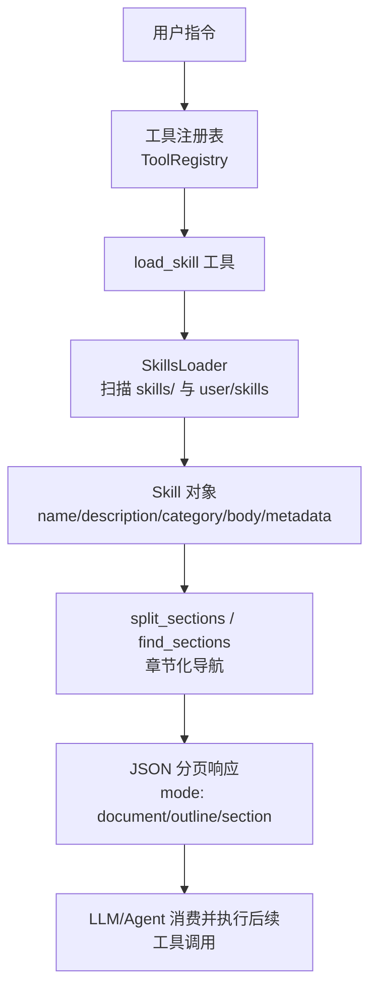
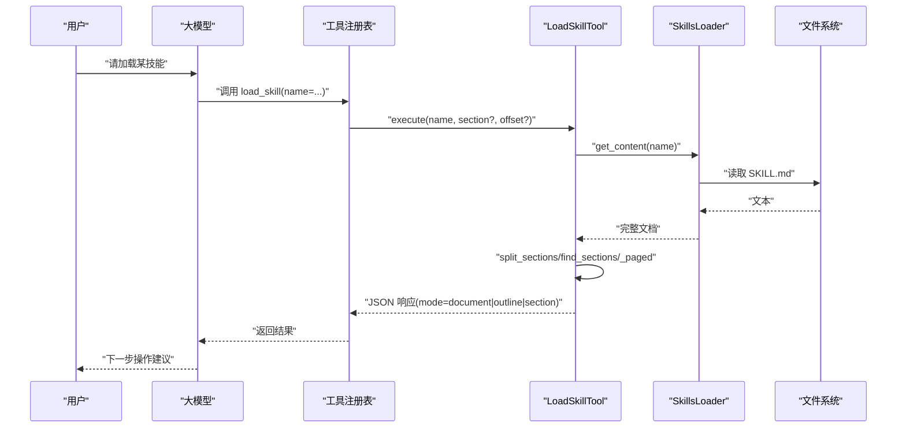
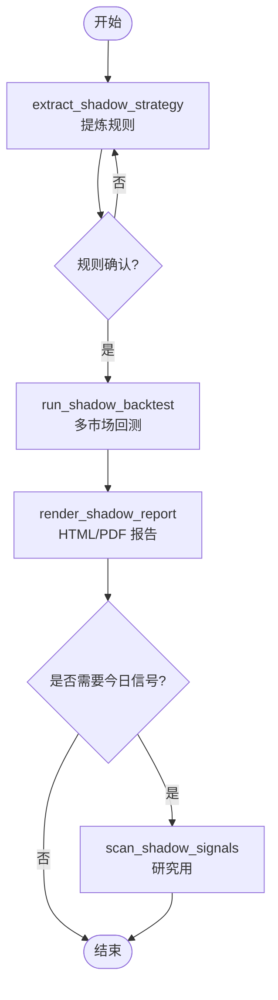
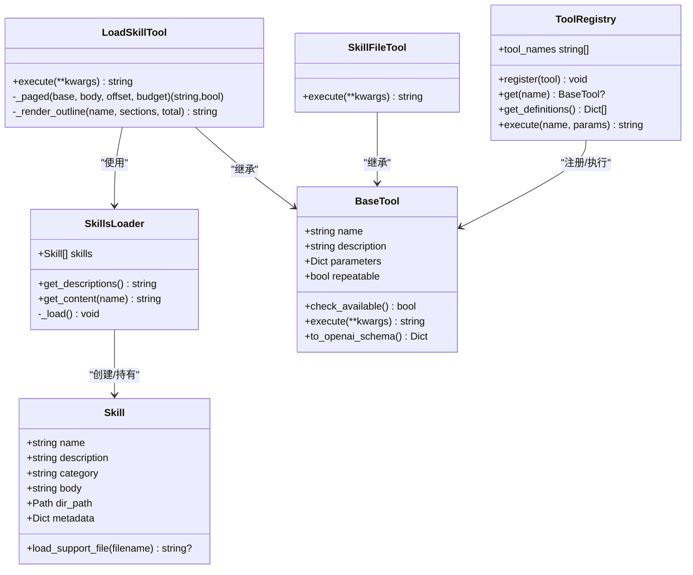
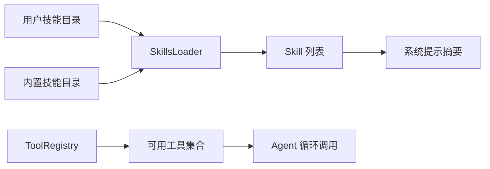

# 技能插件开发

<cite>
**本文引用的文件**
- [agent/SKILL.md](file://agent/SKILL.md)
- [agent/src/agent/skills.py](file://agent/src/agent/skills.py)
- [agent/src/tools/load_skill_tool.py](file://agent/src/tools/load_skill_tool.py)
- [agent/src/tools/skill_writer_tool.py](file://agent/src/tools/skill_writer_tool.py)
- [agent/src/agent/tools.py](file://agent/src/agent/tools.py)
- [agent/src/governance/manifest.py](file://agent/src/governance/manifest.py)
- [agent/tests/test_skills.py](file://agent/tests/test_skills.py)
- [agent/tests/test_skill_reference_links.py](file://agent/tests/test_skill_reference_links.py)
- [agent/src/skills/shadow-account/SKILL.md](file://agent/src/skills/shadow-account/SKILL.md)
- [agent/src/swarm/presets/factor_research_committee.yaml](file://agent/src/swarm/presets/factor_research_committee.yaml)
</cite>

## 目录
1. [简介](#简介)
2. [项目结构](#项目结构)
3. [核心组件](#核心组件)
4. [架构总览](#架构总览)
5. [详细组件分析](#详细组件分析)
6. [依赖关系分析](#依赖关系分析)
7. [性能与可伸缩性](#性能与可伸缩性)
8. [故障排查指南](#故障排查指南)
9. [结论](#结论)
10. [附录](#附录)

## 简介
本指南面向希望为 Vibe-Trading 编写“技能插件”的开发者。内容覆盖：
- SKILL.md 文件格式规范（元数据、命令描述、参数说明）
- 技能脚本编写（Python 脚本结构、上下文注入、结果返回）
- 技能参考文档组织（文件结构、链接引用、版本管理）
- 从基础到复杂的多步骤工作流示例
- 测试方法、调试技巧与最佳实践
- 技能的加载机制与依赖管理

## 项目结构
Vibe-Trading 的技能系统由“文档即实现”的模式驱动：每个技能是一个独立目录，包含一个 SKILL.md 作为主文档；运行时通过 SkillsLoader 扫描并加载，再由 load_skill 工具按需分页或按章节返回。用户自定义技能位于 ~/.vibe-trading/skills/user/<skill-name>/，内置技能位于 agent/src/skills/<skill-name>/。

**图表来源**
- [agent/src/agent/skills.py:100-189](file://agent/src/agent/skills.py#L100-L189)
- [agent/src/tools/load_skill_tool.py:150-307](file://agent/src/tools/load_skill_tool.py#L150-L307)

**章节来源**
- [agent/src/agent/skills.py:100-189](file://agent/src/agent/skills.py#L100-L189)
- [agent/src/tools/load_skill_tool.py:150-307](file://agent/src/tools/load_skill_tool.py#L150-L307)

## 核心组件
- Skill 数据模型：封装 name、description、category、body、dir_path、metadata，并提供按需加载辅助文件的能力。
- SkillsLoader：负责从用户目录和内置目录扫描并加载所有含 SKILL.md 的子目录，支持类别分组展示与按名检索。
- LoadSkillTool：对外暴露 load_skill 工具，支持三种模式：
  - document：整篇文档分页
  - outline：先返回大纲（标题树+摘要），再按需拉取章节
  - section：直接定位某个章节并按页返回
- SkillFileTool：用于在技能目录下管理 references/templates/examples/assets 等辅助文件（写/删/列）。
- BaseTool + ToolRegistry：统一工具抽象与注册、发现、执行与错误归一化。

**章节来源**
- [agent/src/agent/skills.py:22-94](file://agent/src/agent/skills.py#L22-L94)
- [agent/src/agent/skills.py:100-189](file://agent/src/agent/skills.py#L100-L189)
- [agent/src/tools/load_skill_tool.py:150-307](file://agent/src/tools/load_skill_tool.py#L150-L307)
- [agent/src/tools/skill_writer_tool.py:235-274](file://agent/src/tools/skill_writer_tool.py#L235-L274)
- [agent/src/agent/tools.py:13-94](file://agent/src/agent/tools.py#L13-L94)

## 架构总览
技能系统的运行流程如下：
- 启动时，SkillsLoader 扫描内置与用户技能目录，构建 Skill 列表。
- Agent 的系统提示中仅注入技能的一行摘要（get_descriptions），避免上下文膨胀。
- 当需要详细内容时，Agent 调用 load_skill(name, section?, offset?)。
- LoadSkillTool 根据文档大小与是否指定 section 决定返回 outline/document/section。
- 对于长文档，采用字符级分页（next_offset）与章节级导航（section 路径）组合。
- 技能正文中的 Python 脚本、配置文件、模板等通过 skill_file 工具读写，或借助 read_file/write_file 工具访问。

**图表来源**
- [agent/src/tools/load_skill_tool.py:150-307](file://agent/src/tools/load_skill_tool.py#L150-L307)
- [agent/src/agent/skills.py:100-189](file://agent/src/agent/skills.py#L100-L189)

## 详细组件分析

### SKILL.md 文件格式规范
SKILL.md 使用 YAML frontmatter 定义元数据，正文为 Markdown。关键元数据字段包括：
- name：技能名称（必填，用于识别与加载）
- description：技能描述（用于系统提示中的摘要）
- category：分类（如 strategy、analysis、data-source 等，影响排序与展示）
- version：版本号（便于版本管理与审计）
- dependencies：依赖声明（如 python 版本、pip 包）
- env：环境变量清单（name、description、required）
- mcp：外部 MCP 服务配置（command、args）

此外，正文应包含：
- 何时触发：明确触发条件与前置要求
- 工作流：分步步骤，配合工具调用顺序
- 产出解读：输出指标、报告、图表说明
- 对话模板：与用户的交互话术
- 规则翻译 Prompt 模板：将结构化规则转自然语言
- 红线：约束与禁止行为

示例参考：shadow-account 技能展示了上述结构的完整用法。

**章节来源**
- [agent/src/skills/shadow-account/SKILL.md:1-80](file://agent/src/skills/shadow-account/SKILL.md#L1-L80)
- [agent/SKILL.md:1-22](file://agent/SKILL.md#L1-L22)

### 技能脚本编写（Python）
- 脚本位置：通常放在技能目录下的 templates/ 或 examples/，或通过 write_file 动态生成。
- 脚本结构：遵循统一的输入/输出约定，便于被工具链解析与回测引擎消费。
- 上下文注入：通过 read_file 获取配置与数据，通过工具链注入市场数据、因子、回测环境等上下文。
- 结果返回：以 JSON 或结构化文本返回，确保可被上层工具与报告渲染模块消费。
- 安全与沙箱：避免直接执行不受控代码；优先通过工具调用与只读文件访问。

注意：具体脚本实现细节请参考各技能目录下的模板与示例文件，并通过 skill_file 工具进行创建与管理。

**章节来源**
- [agent/src/tools/skill_writer_tool.py:235-274](file://agent/src/tools/skill_writer_tool.py#L235-L274)

### 技能参考文档组织
- 文件结构：每个技能目录包含 SKILL.md 与可选子目录 references/templates/examples/assets。
- 链接引用：references/ 下的文件必须通过带技能名前缀的路径引用，例如 <skill>/references/xxx.md，以确保 read_file 能正确解析。
- 版本管理：通过 SKILL.md 的 version 字段记录版本；结合 manifest 哈希追踪实际注入的内容。
- 测试验证：测试用例会校验 references/ 链接是否存在且可解析，防止断链。

**章节来源**
- [agent/tests/test_skill_reference_links.py:76-110](file://agent/tests/test_skill_reference_links.py#L76-L110)
- [agent/src/governance/manifest.py:139-183](file://agent/src/governance/manifest.py#L139-L183)

### 多步骤工作流示例
- 基础技能：单步工具调用，如读取市场数据、计算技术指标。
- 复杂工作流：多工具协作，如“影子账户”四步流程（提取策略→回测→报告→信号扫描）。
- 多智能体团队：通过 swarm presets 编排多个 agent，协同完成研究任务，并在任务中引用相关技能。

**图表来源**
- [agent/src/skills/shadow-account/SKILL.md:15-26](file://agent/src/skills/shadow-account/SKILL.md#L15-L26)

**章节来源**
- [agent/src/skills/shadow-account/SKILL.md:15-26](file://agent/src/skills/shadow-account/SKILL.md#L15-L26)
- [agent/src/swarm/presets/factor_research_committee.yaml:187-206](file://agent/src/swarm/presets/factor_research_committee.yaml#L187-L206)

### 类图（代码级）

**图表来源**
- [agent/src/agent/skills.py:22-94](file://agent/src/agent/skills.py#L22-L94)
- [agent/src/tools/load_skill_tool.py:150-307](file://agent/src/tools/load_skill_tool.py#L150-L307)
- [agent/src/tools/skill_writer_tool.py:235-274](file://agent/src/tools/skill_writer_tool.py#L235-L274)
- [agent/src/agent/tools.py:13-94](file://agent/src/agent/tools.py#L13-L94)

## 依赖关系分析
- 加载顺序：用户技能优先于内置技能，同名覆盖。
- 类别分组：按预设顺序展示（data-source、strategy、analysis、asset-class、crypto、flow、tool、other）。
- 工具注册：BaseTool 子类通过 ToolRegistry 注册，支持 check_available 进行依赖检查（如 API Key、SDK）。
- 外部 MCP：可通过 agent.json 配置外部 MCP 服务器，工具命名规范化为 mcp_<server>_<tool>。

**图表来源**
- [agent/src/agent/skills.py:120-164](file://agent/src/agent/skills.py#L120-L164)
- [agent/src/agent/tools.py:54-94](file://agent/src/agent/tools.py#L54-L94)

**章节来源**
- [agent/src/agent/skills.py:120-164](file://agent/src/agent/skills.py#L120-L164)
- [agent/src/agent/tools.py:54-94](file://agent/src/agent/tools.py#L54-L94)

## 性能与可伸缩性
- 渐进式披露：系统提示仅注入技能摘要，减少上下文占用。
- 章节化导航：对长文档先返回大纲，再按需拉取章节，避免全量传输。
- 字符级分页：按 TOOL_RESULT_LIMIT 控制响应大小，保证稳定性。
- 并行与串行：MCP 工具在当前版本串行执行，避免并发竞争。

[本节提供通用指导，不直接分析具体文件]

## 故障排查指南
- 技能未找到：检查 name 是否与目录一致，确认 SKILL.md 存在且 frontmatter 的 name 字段正确。
- 章节歧义：当同一文档出现重复标题时，需使用“父 > 子”路径精确指定。
- 参考链接失效：references/ 下的链接必须带技能名前缀，否则 read_file 无法解析。
- 工具不可用：检查 check_available 的依赖（API Key、SDK），必要时安装或配置。
- 超时与失败：MCP 工具调用有超时保护，失败返回标准化错误负载。

**章节来源**
- [agent/tests/test_skills.py:159-169](file://agent/tests/test_skills.py#L159-L169)
- [agent/tests/test_skill_reference_links.py:76-110](file://agent/tests/test_skill_reference_links.py#L76-L110)
- [agent/src/tools/load_skill_tool.py:244-263](file://agent/src/tools/load_skill_tool.py#L244-L263)
- [agent/SKILL.md:373-389](file://agent/SKILL.md#L373-L389)

## 结论
Vibe-Trading 的技能系统以“文档即实现”为核心，通过 SKILL.md 与工具链的结合，实现了高度可扩展、可审计、可测试的技能生态。开发者应遵循规范编写 SKILL.md，合理组织参考文档，利用 load_skill 的分页与章节能力，结合 skill_file 管理脚本与模板，并通过测试保障链接与加载的正确性。在多智能体场景中，通过 presets 编排任务，引用相关技能，形成复杂而稳健的研究工作流。

[本节总结性内容，不直接分析具体文件]

## 附录
- 快速上手：安装后无需 API Key 即可使用多数研究与回测功能；如需高级数据源或多智能体，按提示配置环境变量。
- 外部 MCP：在 agent.json 中配置外部 MCP 服务器，启用工具白名单与超时控制。
- 版本与审计：通过 manifest 哈希追踪每次运行的 prompt、技能内容与工具集，确保可复现。

[本节提供补充信息，不直接分析具体文件]