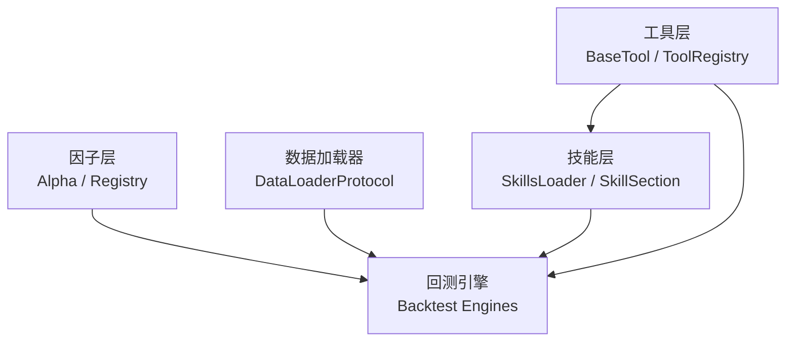
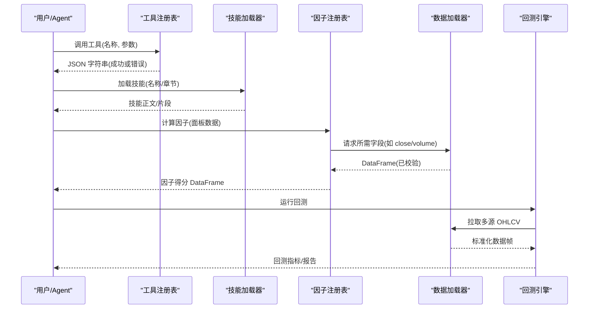
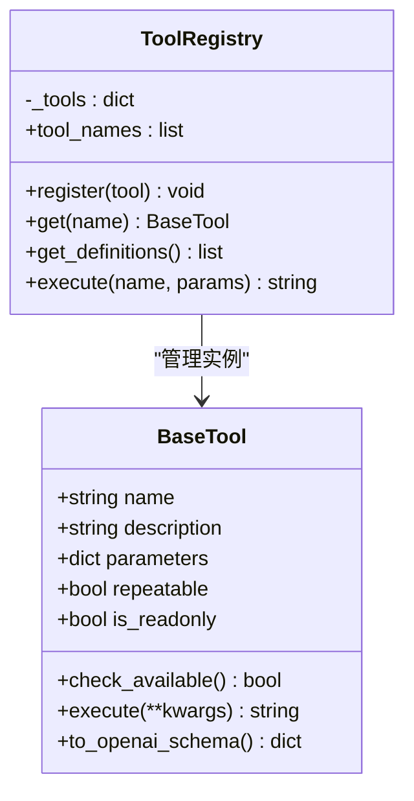
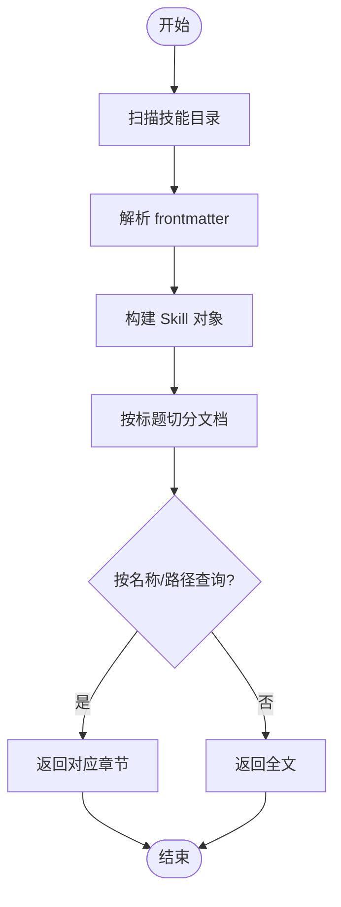
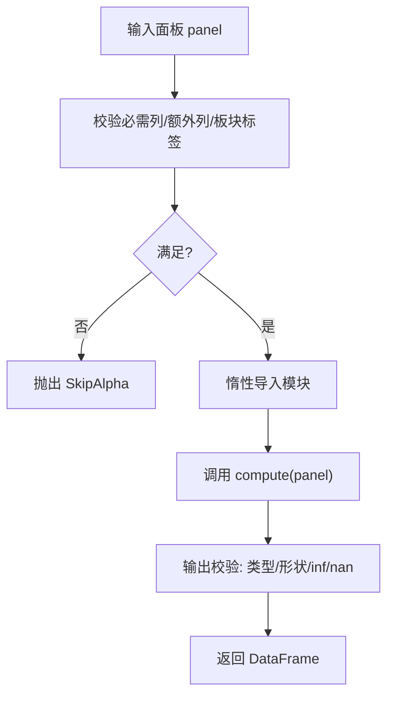
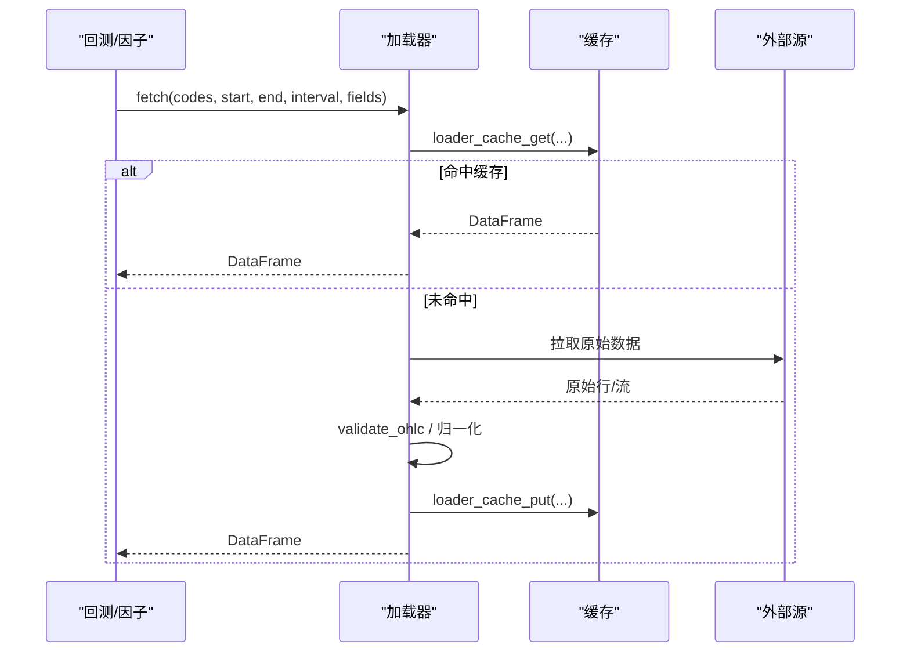
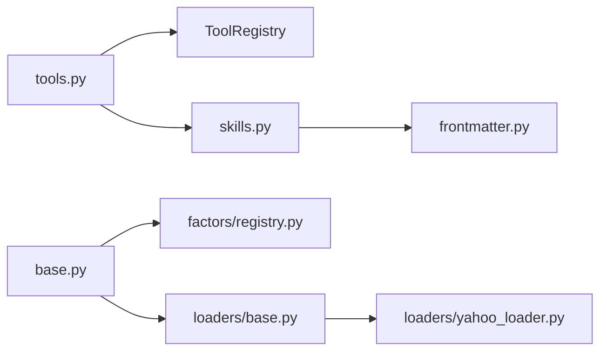

# 插件开发

<cite>
**本文引用的文件**
- [agent/src/agent/tools.py](file://agent/src/agent/tools.py)
- [agent/src/agent/skills.py](file://agent/src/agent/skills.py)
- [agent/src/agent/frontmatter.py](file://agent/src/agent/frontmatter.py)
- [agent/backtest/loaders/base.py](file://agent/backtest/loaders/base.py)
- [agent/backtest/loaders/yahoo_loader.py](file://agent/backtest/loaders/yahoo_loader.py)
- [agent/src/factors/base.py](file://agent/src/factors/base.py)
- [agent/src/factors/registry.py](file://agent/src/factors/registry.py)
- [agent/SKILL.md](file://agent/SKILL.md)
</cite>

## 目录
1. [简介](#简介)
2. [项目结构](#项目结构)
3. [核心组件](#核心组件)
4. [架构总览](#架构总览)
5. [详细组件分析](#详细组件分析)
6. [依赖关系分析](#依赖关系分析)
7. [性能考虑](#性能考虑)
8. [故障排查指南](#故障排查指南)
9. [结论](#结论)
10. [附录](#附录)

## 简介
本指南面向希望在 Vibe-Trading 中扩展能力的开发者，覆盖以下主题：
- 工具插件：注册机制、参数定义、返回值处理、错误处理与可重复调用策略。
- 技能系统：SKILL.md 文件格式、元数据、章节导航与参考文档组织。
- 因子（Alpha）开发：实现规范、回测引擎集成、输出校验与性能优化建议。
- 数据加载器：统一接口、市场适配、重试与预算控制、本地缓存策略。
- 完整示例：从简单工具到复杂技能模块的逐步实现。
- 测试与调试：单元测试要点、常见陷阱与定位技巧。
- 发布与分发：如何打包、安装与在 MCP/CLI/API 中暴露新能力。

## 项目结构
Vibe-Trading 的插件体系围绕“工具、技能、因子、数据加载器”四大扩展点构建：
- 工具插件：通过 BaseTool + ToolRegistry 抽象，支持 JSON Schema 参数、OpenAI function calling 兼容、统一错误包装。
- 技能系统：基于 SKILL.md 的渐进式文档加载，支持 frontmatter 元数据、按标题分段检索与按需加载辅助文件。
- 因子（Alpha）：以 zoo 为目录组织，AST 扫描元数据，惰性导入 compute 函数，严格输出校验。
- 数据加载器：DataLoaderProtocol 统一 fetch 接口，内置重试/预算、OHLC 校验、本地 parquet 缓存。

图表来源
- [agent/src/agent/tools.py:13-95](file://agent/src/agent/tools.py#L13-L95)
- [agent/src/agent/skills.py:22-189](file://agent/src/agent/skills.py#L22-L189)
- [agent/src/factors/base.py:56-70](file://agent/src/factors/base.py#L56-L70)
- [agent/src/factors/registry.py:201-397](file://agent/src/factors/registry.py#L201-L397)
- [agent/backtest/loaders/base.py:851-887](file://agent/backtest/loaders/base.py#L851-L887)

章节来源
- [agent/src/agent/tools.py:13-95](file://agent/src/agent/tools.py#L13-L95)
- [agent/src/agent/skills.py:22-189](file://agent/src/agent/skills.py#L22-L189)
- [agent/src/factors/base.py:56-70](file://agent/src/factors/base.py#L56-L70)
- [agent/src/factors/registry.py:201-397](file://agent/src/factors/registry.py#L201-L397)
- [agent/backtest/loaders/base.py:851-887](file://agent/backtest/loaders/base.py#L851-L887)

## 核心组件
- 工具插件基类与注册表：提供统一的参数描述、执行入口、错误封装与 OpenAI 函数调用格式转换。
- 技能加载器：解析 SKILL.md 的 frontmatter，按标题切分文档，支持按路径定位章节与按需加载辅助文件。
- Alpha 基础与注册表：定义面板输入契约、计算协议、元数据校验、惰性加载与结果健康检查。
- 数据加载器协议：统一 fetch 接口、市场声明、认证需求、重试/预算、OHLC 校验与本地缓存。

章节来源
- [agent/src/agent/tools.py:13-95](file://agent/src/agent/tools.py#L13-L95)
- [agent/src/agent/skills.py:22-189](file://agent/src/agent/skills.py#L22-L189)
- [agent/src/factors/base.py:56-70](file://agent/src/factors/base.py#L56-L70)
- [agent/src/factors/registry.py:201-397](file://agent/src/factors/registry.py#L201-L397)
- [agent/backtest/loaders/base.py:851-887](file://agent/backtest/loaders/base.py#L851-L887)

## 架构总览
下图展示了插件在系统中的交互关系：工具由注册表调度；技能文档被按需加载并注入上下文；因子通过注册表发现与执行；数据加载器为回测引擎提供标准化 OHLCV 数据。

图表来源
- [agent/src/agent/tools.py:54-95](file://agent/src/agent/tools.py#L54-L95)
- [agent/src/agent/skills.py:100-189](file://agent/src/agent/skills.py#L100-L189)
- [agent/src/factors/registry.py:321-397](file://agent/src/factors/registry.py#L321-L397)
- [agent/backtest/loaders/base.py:851-887](file://agent/backtest/loaders/base.py#L851-L887)

## 详细组件分析

### 工具插件开发
- 设计要点
  - 继承 BaseTool，实现 execute(**kwargs) -> str，返回 JSON 字符串。
  - 使用 parameters(JSON Schema) 描述参数；to_openai_schema() 用于 LLM 函数调用。
  - 通过 ToolRegistry.register 注册；execute 统一捕获异常并返回结构化错误。
  - repeatable/is_readonly 标记控制是否允许重复调用与只读约束。
- 错误处理
  - 未找到工具：返回包含 status/error 的错误 JSON。
  - 执行异常：记录日志并返回结构化错误，避免上层崩溃。
- 最佳实践
  - 参数校验在 execute 内部尽早进行，失败时返回明确错误信息。
  - 对外部依赖做可用性检查（check_available），不满足条件时不参与注册。

图表来源
- [agent/src/agent/tools.py:13-95](file://agent/src/agent/tools.py#L13-L95)

章节来源
- [agent/src/agent/tools.py:13-95](file://agent/src/agent/tools.py#L13-L95)

### 技能系统开发（SKILL.md）
- 文件格式
  - 顶部 frontmatter 支持 name/description/category/dependencies/env/mcp 等键值。
  - 正文采用 Markdown，使用 ATX 标题组织章节；支持 fenced code block 内注释不被识别为标题。
- 加载与分页
  - SkillsLoader 扫描内置与用户目录，去重后维护列表。
  - get_descriptions 生成分类摘要；get_content 返回完整文档。
  - split_sections 将文档按标题切分为 SkillSection，支持 ancestor_titles/qualified_path/find_sections 精确定位。
- 参考文档组织
  - 可在技能目录下放置辅助文件，通过 load_support_file 按需读取。
  - 建议在 frontmatter 中声明依赖与环境变量，便于使用者准备。

图表来源
- [agent/src/agent/skills.py:65-189](file://agent/src/agent/skills.py#L65-L189)
- [agent/src/agent/frontmatter.py:16-49](file://agent/src/agent/frontmatter.py#L16-L49)

章节来源
- [agent/src/agent/skills.py:65-189](file://agent/src/agent/skills.py#L65-L189)
- [agent/src/agent/frontmatter.py:16-49](file://agent/src/agent/frontmatter.py#L16-L49)
- [agent/SKILL.md:1-22](file://agent/SKILL.md#L1-L22)

### 因子（Alpha）开发
- 实现规范
  - 每个 alpha 模块需提供 compute(panel: dict[str, pd.DataFrame]) -> pd.DataFrame。
  - 面板约定：index=交易日期，columns=标的代码；NaN 传播，禁止 +/- inf。
  - 元数据 __alpha_meta__ 通过 AST 静态解析，严格校验列名、主题、频率、宇宙等。
- 注册与执行
  - Registry 扫描 zoo 目录，收集 AlphaMeta，惰性 import 模块并执行 compute。
  - 输出校验：形状一致、无 inf、NaN 比例不过高。
- 性能优化
  - 使用向量化操作（pandas/numpy）、滑动窗口视图、bottleneck 加速。
  - 避免逐行 apply 大循环；必要时用 np.einsum/sliding_window_view。
  - 合理设置 warmup 与 min_periods，减少无效计算。

图表来源
- [agent/src/factors/registry.py:321-397](file://agent/src/factors/registry.py#L321-L397)
- [agent/src/factors/base.py:56-70](file://agent/src/factors/base.py#L56-L70)

章节来源
- [agent/src/factors/base.py:56-70](file://agent/src/factors/base.py#L56-L70)
- [agent/src/factors/registry.py:147-184](file://agent/src/factors/registry.py#L147-L184)
- [agent/src/factors/registry.py:201-397](file://agent/src/factors/registry.py#L201-L397)

### 数据加载器开发
- 统一接口
  - DataLoaderProtocol 要求 name/markets/requires_auth，以及 is_available()/fetch(codes, start_date, end_date, interval, fields)。
  - 返回 {symbol: DataFrame(trade_date, open, high, low, close, volume)}。
- 健壮性
  - validate_ohlc 强制 OHLC 不变量，支持 drop/warn/raise 策略与负价格开关。
  - retry_with_budget/check_budget 提供带退避的重试与超时预算控制。
- 缓存策略
  - 内容寻址 key（source/symbol/timeframe/start/end/fields），parquet 存储，DuckDB 读写。
  - 仅对已结算区间缓存；读写失败不影响主流程。
- 示例：Yahoo 加载器
  - 映射时间粒度、处理日内/日级索引对齐、缺失列填充与数值转换。
  - 通过 @register 装饰器注册，声明 markets/volume_units/requires_auth。

图表来源
- [agent/backtest/loaders/base.py:398-450](file://agent/backtest/loaders/base.py#L398-L450)
- [agent/backtest/loaders/base.py:506-661](file://agent/backtest/loaders/base.py#L506-L661)
- [agent/backtest/loaders/yahoo_loader.py:173-200](file://agent/backtest/loaders/yahoo_loader.py#L173-L200)

章节来源
- [agent/backtest/loaders/base.py:168-256](file://agent/backtest/loaders/base.py#L168-L256)
- [agent/backtest/loaders/base.py:398-450](file://agent/backtest/loaders/base.py#L398-L450)
- [agent/backtest/loaders/base.py:506-661](file://agent/backtest/loaders/base.py#L506-L661)
- [agent/backtest/loaders/yahoo_loader.py:173-200](file://agent/backtest/loaders/yahoo_loader.py#L173-L200)

## 依赖关系分析
- 工具层依赖注册表，注册表持有 BaseTool 实例集合，对外暴露 get_definitions/execute。
- 技能层依赖 frontmatter 解析与目录扫描，按标题建立章节索引，支持路径定位。
- 因子层依赖 base 的 Alpha 协议与工具函数，registry 负责扫描、校验与惰性执行。
- 数据加载器遵循 Protocol，共享 base 中的重试/缓存/校验逻辑，具体实现如 yahoo_loader。

图表来源
- [agent/src/agent/tools.py:54-95](file://agent/src/agent/tools.py#L54-L95)
- [agent/src/agent/skills.py:100-189](file://agent/src/agent/skills.py#L100-L189)
- [agent/src/factors/base.py:56-70](file://agent/src/factors/base.py#L56-L70)
- [agent/src/factors/registry.py:201-397](file://agent/src/factors/registry.py#L201-L397)
- [agent/backtest/loaders/base.py:851-887](file://agent/backtest/loaders/base.py#L851-L887)
- [agent/backtest/loaders/yahoo_loader.py:173-200](file://agent/backtest/loaders/yahoo_loader.py#L173-L200)

章节来源
- [agent/src/agent/tools.py:54-95](file://agent/src/agent/tools.py#L54-L95)
- [agent/src/agent/skills.py:100-189](file://agent/src/agent/skills.py#L100-L189)
- [agent/src/factors/base.py:56-70](file://agent/src/factors/base.py#L56-L70)
- [agent/src/factors/registry.py:201-397](file://agent/src/factors/registry.py#L201-L397)
- [agent/backtest/loaders/base.py:851-887](file://agent/backtest/loaders/base.py#L851-L887)
- [agent/backtest/loaders/yahoo_loader.py:173-200](file://agent/backtest/loaders/yahoo_loader.py#L173-L200)

## 性能考虑
- 因子计算
  - 优先使用向量化与滑动窗口视图，避免逐行 Python 循环。
  - 利用 bottleneck 提供的 move_* 系列函数提升滚动统计性能。
  - 合理设置 warmup/min_periods，减少无效计算与 NaN 传播。
- 数据加载
  - 启用本地缓存以减少重复网络请求；确保 end_date 已结算再缓存。
  - 使用 retry_with_budget 控制重试次数与退避，避免长时间阻塞。
  - 对 OHLC 数据进行一次性校验，尽早剔除脏数据。
- 技能文档
  - 使用 split_sections 与路径定位，避免全量加载长文档，降低内存占用。

[本节为通用指导，无需特定文件引用]

## 故障排查指南
- 工具插件
  - 现象：工具不存在或执行异常。
  - 排查：确认 register 是否调用；检查 check_available；查看 ToolRegistry.execute 返回的错误 JSON。
  - 参考
    - [agent/src/agent/tools.py:72-84](file://agent/src/agent/tools.py#L72-L84)
- 技能系统
  - 现象：无法找到技能或章节定位歧义。
  - 排查：确认 SKILL.md 存在且 frontmatter 含 name；使用 find_sections 检查匹配结果。
  - 参考
    - [agent/src/agent/skills.py:166-189](file://agent/src/agent/skills.py#L166-L189)
    - [agent/src/agent/skills.py:323-368](file://agent/src/agent/skills.py#L323-L368)
- 因子（Alpha）
  - 现象：compute 报错或输出非法。
  - 排查：检查 __alpha_meta__ 列声明；确认面板包含必需列；查看输出是否含 inf 或过高 NaN。
  - 参考
    - [agent/src/factors/registry.py:321-397](file://agent/src/factors/registry.py#L321-L397)
- 数据加载器
  - 现象：网络抖动导致失败或数据不一致。
  - 排查：使用 retry_with_budget；检查 validate_ohlc 策略；确认缓存范围是否已结算。
  - 参考
    - [agent/backtest/loaders/base.py:398-450](file://agent/backtest/loaders/base.py#L398-L450)
    - [agent/backtest/loaders/base.py:168-256](file://agent/backtest/loaders/base.py#L168-L256)
    - [agent/backtest/loaders/base.py:550-561](file://agent/backtest/loaders/base.py#L550-L561)

章节来源
- [agent/src/agent/tools.py:72-84](file://agent/src/agent/tools.py#L72-L84)
- [agent/src/agent/skills.py:166-189](file://agent/src/agent/skills.py#L166-L189)
- [agent/src/agent/skills.py:323-368](file://agent/src/agent/skills.py#L323-L368)
- [agent/src/factors/registry.py:321-397](file://agent/src/factors/registry.py#L321-L397)
- [agent/backtest/loaders/base.py:398-450](file://agent/backtest/loaders/base.py#L398-L450)
- [agent/backtest/loaders/base.py:168-256](file://agent/backtest/loaders/base.py#L168-L256)
- [agent/backtest/loaders/base.py:550-561](file://agent/backtest/loaders/base.py#L550-L561)

## 结论
Vibe-Trading 提供了完善且可扩展的插件生态：
- 工具插件以最小成本接入 LLM 函数调用与统一错误模型。
- 技能系统以 SKILL.md 为中心，支持结构化元数据与章节导航，便于知识复用。
- 因子体系强调安全与性能，AST 静态校验与惰性执行保障稳定性。
- 数据加载器提供跨市场适配、健壮的网络访问与高效缓存。
遵循上述规范与最佳实践，可快速构建高质量的可插拔能力，并通过 CLI/MCP/API 无缝集成。

[本节为总结，无需特定文件引用]

## 附录

### 完整开发示例（步骤指引）
- 工具插件示例
  - 新建类继承 BaseTool，定义 name/description/parameters，实现 execute 返回 JSON。
  - 在合适位置调用 ToolRegistry.register 完成注册。
  - 通过 to_openai_schema 验证 LLM 可见性。
  - 参考
    - [agent/src/agent/tools.py:13-95](file://agent/src/agent/tools.py#L13-L95)
- 技能模块示例
  - 创建目录并在其中添加 SKILL.md，填写 frontmatter（name/description/category）。
  - 使用 ATX 标题组织内容，必要时附 examples.md 等辅助文件。
  - 通过 SkillsLoader.get_content 与 split_sections 验证加载与定位。
  - 参考
    - [agent/src/agent/skills.py:65-189](file://agent/src/agent/skills.py#L65-L189)
    - [agent/src/agent/frontmatter.py:16-49](file://agent/src/agent/frontmatter.py#L16-L49)
- 因子实现示例
  - 在 zoo 下新增目录与 .py 文件，编写 compute(panel) -> DataFrame。
  - 在模块顶层定义 __alpha_meta__，声明 theme/columns_required/universe 等。
  - 通过 Registry.compute 执行并观察健康检查。
  - 参考
    - [agent/src/factors/base.py:56-70](file://agent/src/factors/base.py#L56-L70)
    - [agent/src/factors/registry.py:147-184](file://agent/src/factors/registry.py#L147-L184)
    - [agent/src/factors/registry.py:321-397](file://agent/src/factors/registry.py#L321-L397)
- 数据加载器示例
  - 实现 DataLoaderProtocol，声明 name/markets/requires_auth 与 fetch。
  - 使用 validate_ohlc 保证数据质量；结合 cached_loader_fetch 启用缓存。
  - 参考
    - [agent/backtest/loaders/base.py:851-887](file://agent/backtest/loaders/base.py#L851-L887)
    - [agent/backtest/loaders/base.py:623-661](file://agent/backtest/loaders/base.py#L623-L661)
    - [agent/backtest/loaders/yahoo_loader.py:173-200](file://agent/backtest/loaders/yahoo_loader.py#L173-L200)

### 测试方法与调试技巧
- 工具插件
  - 直接构造 ToolRegistry，注册自定义工具，调用 execute 断言返回 JSON 结构与状态。
  - 模拟外部依赖失败，验证错误路径与日志。
  - 参考
    - [agent/src/agent/tools.py:54-95](file://agent/src/agent/tools.py#L54-L95)
- 技能系统
  - 构造 SkillsLoader，遍历 skills 列表，验证 get_descriptions 分组与 get_content 内容。
  - 使用 split_sections 与 find_sections 验证章节定位与歧义处理。
  - 参考
    - [agent/src/agent/skills.py:100-189](file://agent/src/agent/skills.py#L100-L189)
    - [agent/src/agent/skills.py:229-278](file://agent/src/agent/skills.py#L229-L278)
    - [agent/src/agent/skills.py:323-368](file://agent/src/agent/skills.py#L323-L368)
- 因子
  - 构造最小面板（close/open/high/low/volume），调用 Registry.compute 并断言输出形状与数值范围。
  - 故意注入非法数据（inf/过多 NaN）验证健康检查。
  - 参考
    - [agent/src/factors/registry.py:321-397](file://agent/src/factors/registry.py#L321-L397)
- 数据加载器
  - 使用 mock 外部源，验证 fetch 返回结构与 validate_ohlc 行为。
  - 切换缓存开关，验证命中/未命中分支与写入失败降级。
  - 参考
    - [agent/backtest/loaders/base.py:168-256](file://agent/backtest/loaders/base.py#L168-L256)
    - [agent/backtest/loaders/base.py:565-661](file://agent/backtest/loaders/base.py#L565-L661)

### 发布与分发流程
- 工具插件
  - 将工具类放入可被 import 的包中，启动时自动注册；或通过配置暴露给 MCP/CLI。
  - 参考
    - [agent/SKILL.md:220-386](file://agent/SKILL.md#L220-L386)
- 技能模块
  - 将 SKILL.md 与辅助文件放入用户技能目录或随包分发；确保 frontmatter 正确。
  - 参考
    - [agent/src/agent/skills.py:97-135](file://agent/src/agent/skills.py#L97-L135)
- 因子
  - 将 alpha 模块放入 zoo 子目录，命名符合规则；__alpha_meta__ 必须合法。
  - 参考
    - [agent/src/factors/registry.py:219-260](file://agent/src/factors/registry.py#L219-L260)
- 数据加载器
  - 实现 DataLoaderProtocol 并通过 @register 注册；声明 markets/volume_units。
  - 参考
    - [agent/backtest/loaders/yahoo_loader.py:173-200](file://agent/backtest/loaders/yahoo_loader.py#L173-L200)

章节来源
- [agent/SKILL.md:220-386](file://agent/SKILL.md#L220-L386)
- [agent/src/agent/skills.py:97-135](file://agent/src/agent/skills.py#L97-L135)
- [agent/src/factors/registry.py:219-260](file://agent/src/factors/registry.py#L219-L260)
- [agent/backtest/loaders/yahoo_loader.py:173-200](file://agent/backtest/loaders/yahoo_loader.py#L173-L200)