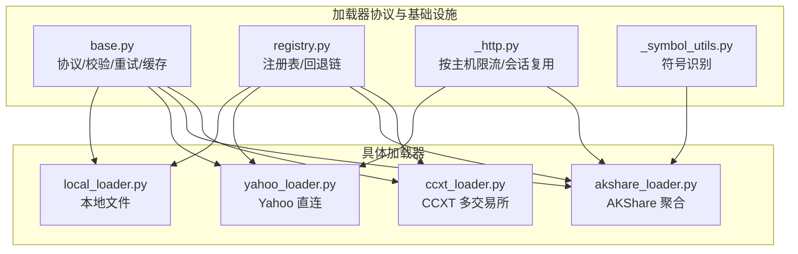
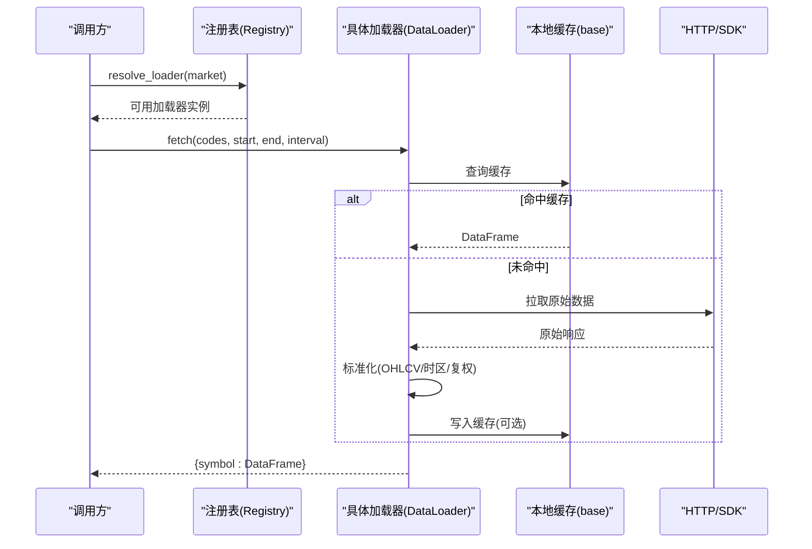
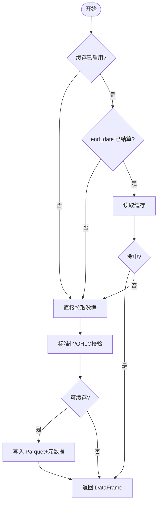
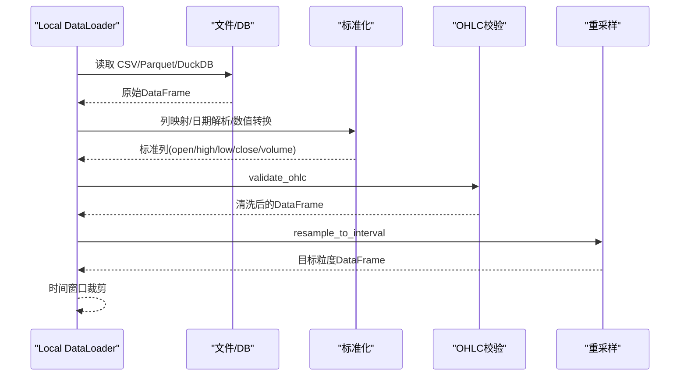
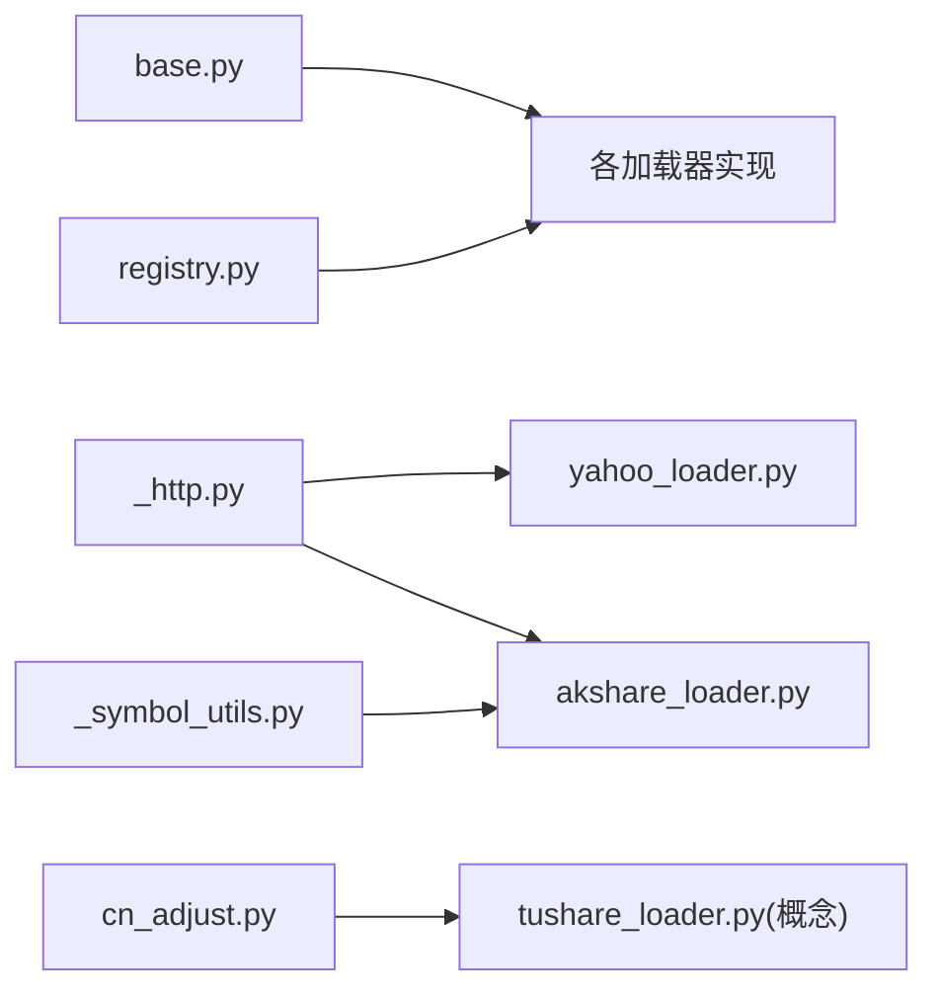

# 数据加载器插件开发

<cite>
**本文引用的文件**
- [base.py](file://agent/backtest/loaders/base.py)
- [registry.py](file://agent/backtest/loaders/registry.py)
- [_http.py](file://agent/backtest/loaders/_http.py)
- [_symbol_utils.py](file://agent/backtest/loaders/_symbol_utils.py)
- [local_loader.py](file://agent/backtest/loaders/local_loader.py)
- [yahoo_loader.py](file://agent/backtest/loaders/yahoo_loader.py)
- [akshare_loader.py](file://agent/backtest/loaders/akshare_loader.py)
- [ccxt_loader.py](file://agent/backtest/loaders/ccxt_loader.py)
- [cn_adjust.py](file://agent/backtest/loaders/cn_adjust.py)
</cite>

## 目录
1. [简介](#简介)
2. [项目结构](#项目结构)
3. [核心组件](#核心组件)
4. [架构总览](#架构总览)
5. [详细组件分析](#详细组件分析)
6. [依赖关系分析](#依赖关系分析)
7. [性能与并发](#性能与并发)
8. [故障排查指南](#故障排查指南)
9. [结论](#结论)
10. [附录：开发示例清单](#附录：开发示例清单)

## 简介
本指南面向希望为系统扩展“数据加载器插件”的开发者，覆盖以下主题：
- 数据加载器基类与协议：继承约定、统一接口、错误处理与重试预算
- 数据标准化：OHLCV 格式转换、时区处理、复权调整（前复权）
- 缓存策略：本地 Parquet 缓存、增量更新、失效机制
- 完整开发示例：从简单 API 适配到复杂数据源集成
- 数据质量验证、性能优化、并发控制
- 加载器的注册与配置管理

## 项目结构
数据加载子系统位于 backtest/loaders 目录，采用“协议 + 注册表 + 具体实现”的分层组织：
- base.py：定义 DataLoaderProtocol、校验工具、重试与预算、本地缓存等通用能力
- registry.py：全局注册表、市场级回退链、自动解析可用加载器
- _http.py：进程内按主机维度的限流与请求复用
- _symbol_utils.py：符号类型识别（如 ETF/LOF 前缀）
- local_loader.py：本地文件（CSV/Parquet/DuckDB）加载与重采样
- yahoo_loader.py / akshare_loader.py / ccxt_loader.py：典型第三方数据源实现
- cn_adjust.py：A 股/基金的前复权因子应用

图表来源
- [base.py:1-657](file://agent/backtest/loaders/base.py#L1-L657)
- [registry.py:1-256](file://agent/backtest/loaders/registry.py#L1-L256)
- [_http.py:1-201](file://agent/backtest/loaders/_http.py#L1-L201)
- [_symbol_utils.py:1-21](file://agent/backtest/loaders/_symbol_utils.py#L1-L21)
- [local_loader.py:1-354](file://agent/backtest/loaders/local_loader.py#L1-L354)
- [yahoo_loader.py:1-275](file://agent/backtest/loaders/yahoo_loader.py#L1-L275)
- [akshare_loader.py:1-297](file://agent/backtest/loaders/akshare_loader.py#L1-L297)
- [ccxt_loader.py:1-502](file://agent/backtest/loaders/ccxt_loader.py#L1-L502)

章节来源
- [base.py:1-657](file://agent/backtest/loaders/base.py#L1-L657)
- [registry.py:1-256](file://agent/backtest/loaders/registry.py#L1-L256)

## 核心组件
- DataLoaderProtocol：统一的数据加载器接口，要求 name/markets/requires_auth/is_available/fetch
- 校验与容错：validate_date_range、validate_ohlc；check_budget、retry_with_budget
- 本地缓存：loader_cache_* 系列函数，基于内容寻址的 Parquet 缓存，支持版本化与元数据恢复
- HTTP 限流：HostThrottle 与 throttled_get/throttled_get_json，按 host bucket 限流并复用 Session
- 注册与回退：@register 装饰器将加载器加入全局 LOADER_REGISTRY；resolve_loader/get_loader_cls_with_fallback 提供市场级回退链

章节来源
- [base.py:164-256](file://agent/backtest/loaders/base.py#L164-L256)
- [base.py:377-450](file://agent/backtest/loaders/base.py#L377-L450)
- [base.py:243-441](file://agent/backtest/loaders/base.py#L243-L441)
- [_http.py:46-173](file://agent/backtest/loaders/_http.py#L46-L173)
- [registry.py:23-127](file://agent/backtest/loaders/registry.py#L23-L127)
- [registry.py:161-256](file://agent/backtest/loaders/registry.py#L161-L256)

## 架构总览
下图展示一次跨市场数据获取的典型流程：调用方通过市场类型或显式 source 选择加载器，注册表按回退链尝试可用加载器；每个加载器内部使用统一的 fetch 接口返回 OHLCV DataFrame；基础库提供缓存、重试、限流与数据校验。

图表来源
- [registry.py:614-649](file://agent/backtest/loaders/registry.py#L614-L649)
- [base.py:623-661](file://agent/backtest/loaders/base.py#L623-L661)
- [yahoo_loader.py:195-275](file://agent/backtest/loaders/yahoo_loader.py#L195-L275)
- [akshare_loader.py:98-161](file://agent/backtest/loaders/akshare_loader.py#L98-L161)
- [ccxt_loader.py:226-308](file://agent/backtest/loaders/ccxt_loader.py#L226-L308)

## 详细组件分析

### 数据加载器协议与基类能力
- 协议要求：name/markets/requires_auth/is_available/fetch
- 日期范围校验：validate_date_range(start_date, end_date)
- OHLC 不变量校验：validate_ohlc(frame, strategy="drop", allow_nonpositive_prices=False)
- 重试与预算：check_budget(deadline, label, budget_s)、retry_with_budget(fn, transient, deadline, label, max_retries, backoff)
- 环境变量读取：positive_env_int/float，用于超时、间隔等参数

章节来源
- [base.py:168-256](file://agent/backtest/loaders/base.py#L168-L256)
- [base.py:345-374](file://agent/backtest/loaders/base.py#L345-L374)
- [base.py:377-450](file://agent/backtest/loaders/base.py#L377-L450)

### 本地缓存策略
- 启用开关：loader_cache_enabled() 读取配置决定是否开启
- 根路径：loader_cache_root() 默认 ~/.vibe-trading/cache/loaders
- 键生成：make_loader_cache_key(source, symbol, timeframe, start_date, end_date, fields) 基于 JSON 序列化后 SHA256
- 读写封装：loader_cache_get/put/cached_loader_fetch
- 失效规则：loader_cache_range_is_final(end_date) 仅对已结算日期缓存，避免缓存“进行中”的 bar
- 持久化：DuckDB 读写 Parquet，附带元数据（索引列名/类型、columns_name），原子替换 tmp 文件

图表来源
- [base.py:243-441](file://agent/backtest/loaders/base.py#L243-L441)
- [base.py:477-597](file://agent/backtest/loaders/base.py#L477-L597)

章节来源
- [base.py:243-441](file://agent/backtest/loaders/base.py#L243-L441)
- [base.py:477-597](file://agent/backtest/loaders/base.py#L477-L597)

### HTTP 限流与会话复用
- HostThrottle：按 host bucket 维护最小间隔，带抖动避免同步风暴
- throttled_get/throttled_get_json：合并默认 UA，按 bucket 复用 requests.Session
- 环境配置：通过 *_MIN_INTERVAL 环境变量覆盖最小间隔

章节来源
- [_http.py:46-173](file://agent/backtest/loaders/_http.py#L46-L173)

### 符号识别工具
- _is_etf_listed(code)：识别上证/深证 ETF/LOF 前缀，辅助分流到专用接口

章节来源
- [_symbol_utils.py:1-21](file://agent/backtest/loaders/_symbol_utils.py#L1-L21)

### 本地数据加载器（CSV/Parquet/DuckDB）
- 配置：~/.vibe-trading/data-bridge/config.yaml，声明 symbol -> 文件/查询映射
- 标准化：列名映射、日期解析（UTC 转本地）、数值转换、OHLC 校验、volume 补零
- 时间窗口：按 inclusive 端点裁剪
- 重采样：支持降采样（OHLCV 聚合），不支持升采样（告警并返回原粒度）
- 缓存：使用 cached_loader_fetch 包装单次拉取

图表来源
- [local_loader.py:129-216](file://agent/backtest/loaders/local_loader.py#L129-L216)
- [local_loader.py:271-405](file://agent/backtest/loaders/local_loader.py#L271-L405)

章节来源
- [local_loader.py:1-354](file://agent/backtest/loaders/local_loader.py#L1-L354)

### Yahoo 直连加载器
- 支持市场：US/HK/India/Korea/Canada 股票及期货/外汇后缀
- 区间映射：1D/1H/4H→1h/1W/1M 等
- 时区处理：epoch 秒 → UTC → 去时区；日频归一化至午夜，分钟/小时保持真实时间戳
- 标准化：补齐缺失列、数值转换、空值处理、窗口裁剪
- 缓存：cached_loader_fetch 包裹

章节来源
- [yahoo_loader.py:1-275](file://agent/backtest/loaders/yahoo_loader.py#L1-L275)

### AKShare 加载器
- 支持市场：A 股、美股、港股、期货、基金、宏观、外汇
- 频率限制：多数市场仅支持日频
- 标准化：中英文列名映射、日期解析、数值转换、volume 补零
- 特殊处理：ETF 走专用接口；外汇无成交量则补零

章节来源
- [akshare_loader.py:1-297](file://agent/backtest/loaders/akshare_loader.py#L1-L297)

### CCXT 加密资产加载器
- 支持现货与永续合约（BASE-USDT-PERP）
- 分页拉取：带 check_budget + retry_with_budget 保护网络异常与超时
- 资金费率：历史 funding 拉取并对齐到交易时段
- 保证金层级：通过外部 artifact 注入并校验（不在线拉取）
- 标准化：毫秒时间戳 → DatetimeIndex，窗口裁剪，数值转换

章节来源
- [ccxt_loader.py:1-502](file://agent/backtest/loaders/ccxt_loader.py#L1-L502)

### 复权调整（前复权）
- 适用场景：Tushare 日线/基金日线返回未复权价格，跨除权日计算收益会失真
- 方法：apply_qfq(df, factor)，以窗口末期为基准缩放 OHLC，volume 同比例缩放
- 失败策略：因子缺失或不可用则返回 None，由上层丢弃该标的

章节来源
- [cn_adjust.py:1-78](file://agent/backtest/loaders/cn_adjust.py#L1-L78)

## 依赖关系分析
- 加载器均依赖 base 提供的协议、校验、重试与缓存
- 注册表集中管理所有已知加载器模块，并在首次使用时懒加载
- 回退链按市场类型排序，优先低风险/高可用源，再降级到付费/受限源
- 本地加载器作为兜底，允许用户自有数据接入

图表来源
- [registry.py:84-117](file://agent/backtest/loaders/registry.py#L84-L117)
- [_http.py:141-173](file://agent/backtest/loaders/_http.py#L141-L173)
- [yahoo_loader.py:1-275](file://agent/backtest/loaders/yahoo_loader.py#L1-L275)
- [akshare_loader.py:1-297](file://agent/backtest/loaders/akshare_loader.py#L1-L297)
- [cn_adjust.py:1-78](file://agent/backtest/loaders/cn_adjust.py#L1-L78)

章节来源
- [registry.py:1-256](file://agent/backtest/loaders/registry.py#L1-L256)

## 性能与并发
- 重试与预算：retry_with_budget 结合 check_budget 保证在限定时间内失败快速退出，避免长时间挂起
- 网络限流：HostThrottle 按 host bucket 控制最小间隔，减少被限速/封禁概率；requests.Session 复用降低握手开销
- 缓存命中：cached_loader_fetch 优先读本地 Parquet，显著减少重复网络请求
- 批量拉取：加载器内部对 codes 循环拉取，单标失败不影响其他标的
- 重采样：本地加载器对粗粒度数据进行降采样聚合，避免不必要的高频存储

建议实践
- 合理设置 *_MIN_INTERVAL、CCXT_TIMEOUT_MS、CCXT_FETCH_BUDGET_S 等环境变量
- 对高频拉取场景开启本地缓存，并确保 end_date 已结算
- 对不稳定网络，使用 retry_with_budget 指定 transient 异常族

[本节为通用指导，不直接分析具体文件]

## 故障排查指南
- 无可用数据源：NoAvailableSourceError，检查网络与 token 配置，确认回退链中至少一个可用
- 日期范围无效：ValueError，确保 start_date <= end_date 且格式正确
- OHLC 异常：validate_ohlc 会 drop/warn/raise，根据策略定位脏数据
- 缓存读取失败：非致命，自动回退到线上拉取；检查磁盘权限与 DuckDB 可用性
- 网络超时/限流：提高 *_MIN_INTERVAL，增大 CCXT_TIMEOUT_MS，或降低并发
- 本地加载器字段缺失：检查 config.yaml 的 columns/date_format/path/db_path/query

章节来源
- [registry.py:614-649](file://agent/backtest/loaders/registry.py#L614-L649)
- [base.py:168-256](file://agent/backtest/loaders/base.py#L168-L256)
- [base.py:477-597](file://agent/backtest/loaders/base.py#L477-L597)
- [_http.py:141-173](file://agent/backtest/loaders/_http.py#L141-L173)

## 结论
本系统提供了标准化的数据加载器协议与完善的基础设施（校验、重试、缓存、限流、注册与回退）。开发者只需实现 DataLoaderProtocol 的 fetch 方法，即可无缝接入统一的数据管线。通过本地缓存与稳健的错误处理，系统在稳定性与性能之间取得良好平衡。对于不同市场与数据源，推荐遵循统一的 OHLCV 规范与时区约定，并结合复权逻辑保证收益计算的准确性。

[本节为总结性内容，不直接分析具体文件]

## 附录：开发示例清单
以下为仓库中可直接参考的实现，覆盖从简单到复杂的多种场景：
- 简单 HTTP 直连：yahoo_loader.py
- 聚合型免费源：akshare_loader.py
- 多交易所统一抽象：ccxt_loader.py
- 本地文件与数据库：local_loader.py
- 复权处理：cn_adjust.py
- 公共能力：base.py（协议/校验/重试/缓存）、_http.py（限流）、registry.py（注册/回退）、_symbol_utils.py（符号识别）

章节来源
- [yahoo_loader.py:1-275](file://agent/backtest/loaders/yahoo_loader.py#L1-L275)
- [akshare_loader.py:1-297](file://agent/backtest/loaders/akshare_loader.py#L1-L297)
- [ccxt_loader.py:1-502](file://agent/backtest/loaders/ccxt_loader.py#L1-L502)
- [local_loader.py:1-354](file://agent/backtest/loaders/local_loader.py#L1-L354)
- [cn_adjust.py:1-78](file://agent/backtest/loaders/cn_adjust.py#L1-L78)
- [base.py:1-657](file://agent/backtest/loaders/base.py#L1-L657)
- [_http.py:1-201](file://agent/backtest/loaders/_http.py#L1-L201)
- [registry.py:1-256](file://agent/backtest/loaders/registry.py#L1-L256)
- [_symbol_utils.py:1-21](file://agent/backtest/loaders/_symbol_utils.py#L1-L21)