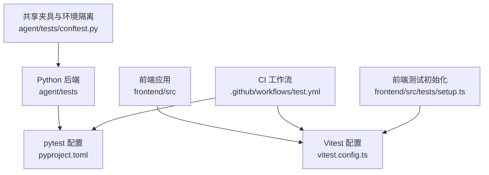
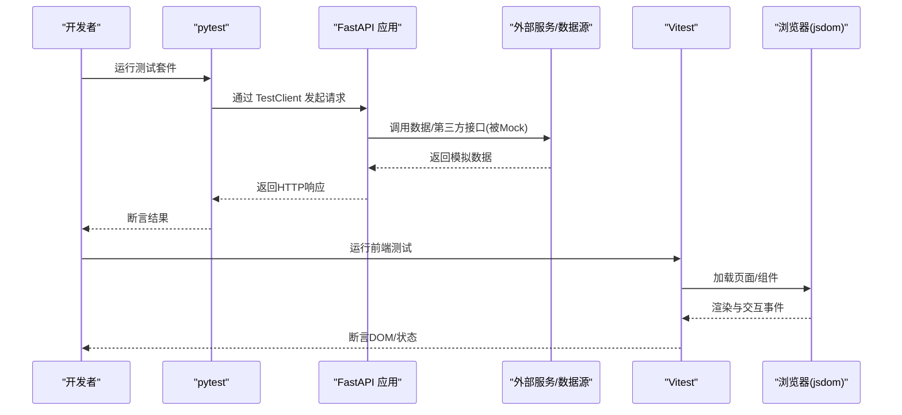
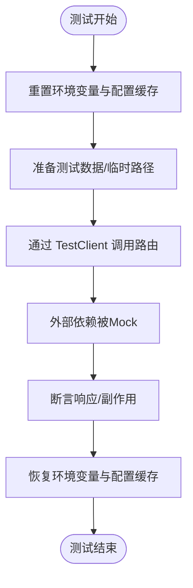
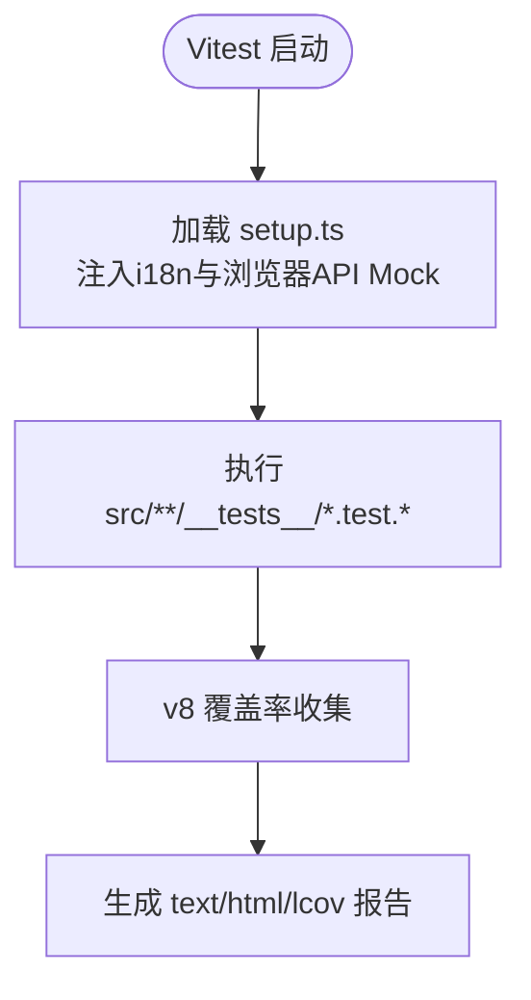
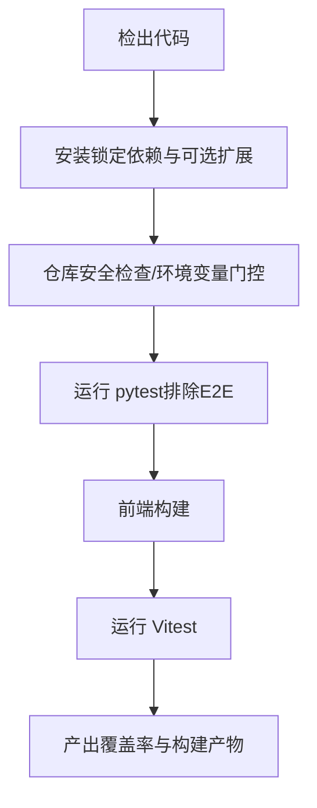
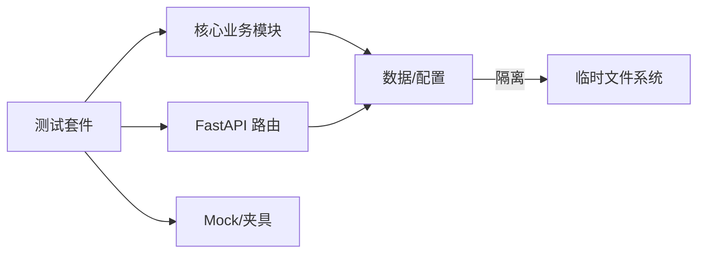

# 测试策略

<cite>
**本文引用的文件**
- [pyproject.toml](file://pyproject.toml)
- [conftest.py](file://agent/tests/conftest.py)
- [test.yml](file://.github/workflows/test.yml)
- [vitest.config.ts](file://frontend/vitest.config.ts)
- [setup.ts](file://frontend/src/tests/setup.ts)
- [bench_performance.py](file://agent/scripts/bench_performance.py)
- [test_qveris_routes.py](file://agent/tests/test_qveris_routes.py)
- [test_autopilot_tool.py](file://agent/tests/test_autopilot_tool.py)
- [test_lockup_expiry_tool.py](file://agent/tests/test_lockup_expiry_tool.py)
- [test_etoro_live_actions.py](file://agent/tests/test_etoro_live_actions.py)
- [test_bench_parallel.py](file://agent/tests/test_bench_parallel.py)
</cite>

## 目录
1. [简介](#简介)
2. [项目结构](#项目结构)
3. [核心组件](#核心组件)
4. [架构总览](#架构总览)
5. [详细组件分析](#详细组件分析)
6. [依赖关系分析](#依赖关系分析)
7. [性能考虑](#性能考虑)
8. [故障排查指南](#故障排查指南)
9. [结论](#结论)
10. [附录](#附录)

## 简介
本文件为 Vibe-Trading 项目的完整测试策略文档，覆盖单元测试、集成测试与端到端测试的分层策略；说明测试框架选择与配置（pytest、Vitest）；规范测试数据管理（生成、Mock、测试数据库/环境隔离）；给出性能与压力测试实施方法；明确覆盖率要求与报告输出；提供从简单函数到复杂业务场景的测试编写示例路径；并描述持续集成中的测试执行流程。

## 项目结构
本项目采用前后端分离与多模块组织：
- Python 后端（agent）：使用 pytest 进行单元/集成测试，通过 pyproject 集中配置测试路径、标记与覆盖率。
- 前端（frontend）：使用 Vitest + jsdom 运行组件/逻辑测试，并通过 setup 文件统一初始化全局 Mock。
- CI（GitHub Actions）：在 Ubuntu 上并行执行 Python 与前端测试，并在 Windows 平台执行特定回归用例。

**图示来源**
- [pyproject.toml:275-304](file://pyproject.toml#L275-L304)
- [vitest.config.ts:1-24](file://frontend/vitest.config.ts#L1-L24)
- [test.yml:67-88](file://.github/workflows/test.yml#L67-L88)
- [conftest.py:1-46](file://agent/tests/conftest.py#L1-L46)
- [setup.ts:1-32](file://frontend/src/tests/setup.ts#L1-L32)

**章节来源**
- [pyproject.toml:275-304](file://pyproject.toml#L275-L304)
- [vitest.config.ts:1-24](file://frontend/vitest.config.ts#L1-L24)
- [test.yml:67-88](file://.github/workflows/test.yml#L67-L88)
- [conftest.py:1-46](file://agent/tests/conftest.py#L1-L46)
- [setup.ts:1-32](file://frontend/src/tests/setup.ts#L1-L32)

## 核心组件
- 测试框架与配置
  - Python：pytest，测试路径与标记在 pyproject 中定义，支持 unit/integration 标记；覆盖率由 coverage 控制。
  - 前端：Vitest，jsdom 环境，全局 setup 文件注入 i18n 与浏览器 API Mock。
- 环境与数据隔离
  - 每个测试进程通过自动夹具重置环境变量与配置缓存，避免跨测试污染。
  - 测试数据通过 fixtures 与临时路径隔离，必要时使用 Mock 服务或伪造响应。
- 持续集成
  - 安装锁定依赖，验证可选依赖可导入，执行语法检查与测试，生成覆盖率报告；前端构建并运行 Vitest。

**章节来源**
- [pyproject.toml:267-304](file://pyproject.toml#L267-L304)
- [vitest.config.ts:10-22](file://frontend/vitest.config.ts#L10-L22)
- [conftest.py:16-46](file://agent/tests/conftest.py#L16-L46)
- [test.yml:26-88](file://.github/workflows/test.yml#L26-L88)

## 架构总览
下图展示测试分层与关键交互：单元测试聚焦纯函数与内部逻辑；集成测试通过 TestClient 调用 FastAPI 路由并 Mock 外部依赖；端到端测试仅用于本地冒烟，默认不在 CI 运行。

**图示来源**
- [test_qveris_routes.py:13-23](file://agent/tests/test_qveris_routes.py#L13-L23)
- [test.yml:67-88](file://.github/workflows/test.yml#L67-L88)
- [vitest.config.ts:10-22](file://frontend/vitest.config.ts#L10-L22)

## 详细组件分析

### 后端测试（pytest）
- 测试组织与入口
  - 测试根目录：agent/tests，由 pyproject 指定 testpaths。
  - 自动夹具 conftest.py 在每个测试前后清理并恢复环境变量与配置缓存，确保隔离性。
- 标记与筛选
  - 支持 @pytest.mark.unit 与 @pytest.mark.integration，便于选择性执行。
- 覆盖率
  - 覆盖率统计范围包含 agent 源码，排除 tests 与 __init__.py；报告输出文本与 XML。
- 典型模式
  - 使用 TestClient 对 API 路由进行请求级测试，并通过 monkeypatch 替换配置与凭据。
  - 通过临时路径与伪造对象构造最小化测试数据。

**图示来源**
- [conftest.py:16-46](file://agent/tests/conftest.py#L16-L46)
- [test_qveris_routes.py:13-23](file://agent/tests/test_qveris_routes.py#L13-L23)

**章节来源**
- [pyproject.toml:275-304](file://pyproject.toml#L275-L304)
- [conftest.py:1-46](file://agent/tests/conftest.py#L1-L46)
- [test_qveris_routes.py:13-23](file://agent/tests/test_qveris_routes.py#L13-L23)

### 前端测试（Vitest）
- 环境与初始化
  - 使用 jsdom 作为测试环境，启用 globals。
  - setup.ts 统一引入 i18n 并 Mock ResizeObserver、matchMedia 等浏览器 API。
- 测试范围与覆盖率
  - include 限定 src/**/__tests__ 下的测试文件。
  - 覆盖率 provider 为 v8，输出 text/html/lcov，统计 src/lib 与 src/stores。
- 实践要点
  - 组件测试需关注国际化字符串稳定性与 DOM API 可用性。
  - 通过 setup 文件集中处理全局依赖，减少单测重复代码。

**图示来源**
- [vitest.config.ts:10-22](file://frontend/vitest.config.ts#L10-L22)
- [setup.ts:1-32](file://frontend/src/tests/setup.ts#L1-L32)

**章节来源**
- [vitest.config.ts:10-22](file://frontend/vitest.config.ts#L10-L22)
- [setup.ts:1-32](file://frontend/src/tests/setup.ts#L1-L32)

### 端到端测试（E2E）
- 策略
  - 需要真实 API Key 的端到端脚本默认不纳入 CI，避免泄露与不稳定。
  - 本地可通过显式开关运行，用于发布前冒烟验证。
- 示例参考
  - 某些测试以“冻结 HTTP 边界”的方式，保留客户端路由但 Mock 网络层，从而验证端到端流程。

**章节来源**
- [test.yml:132-136](file://.github/workflows/test.yml#L132-L136)
- [test_lockup_expiry_tool.py:147-165](file://agent/tests/test_lockup_expiry_tool.py#L147-L165)

### 性能与压力测试
- 开发期基准脚本
  - 提供独立脚本对比因子算子与权益计算的性能，输出微秒级耗时与加速比。
- 压测建议
  - 针对高频路径（如 _calc_equity、因子算子）使用批量迭代测量 p95/p99 延迟。
  - 结合并发参数（如基准运行器的工作线程数）评估吞吐与资源占用。
- 指标与阈值
  - 建议设定单次调用耗时上限与回归阈值，失败时阻断合并。

**章节来源**
- [bench_performance.py:19-134](file://agent/scripts/bench_performance.py#L19-L134)
- [test_bench_parallel.py:99-137](file://agent/tests/test_bench_parallel.py#L99-L137)

### 测试数据管理
- 测试数据生成
  - 使用随机种子与固定时间序列构造 OHLCV 数据，保证可重复性。
- Mock 服务与外部依赖
  - 通过 monkeypatch 替换配置路径、环境变量与网络调用，避免真实网络访问。
- 测试数据库/存储
  - 使用临时路径存放配置文件与运行时产物，测试后自动清理。

**章节来源**
- [conftest.py:16-46](file://agent/tests/conftest.py#L16-L46)
- [test_qveris_routes.py:13-23](file://agent/tests/test_qveris_routes.py#L13-L23)
- [bench_performance.py:19-134](file://agent/scripts/bench_performance.py#L19-L134)

### 覆盖率要求与报告
- 覆盖率范围
  - Python：覆盖 agent 源码，排除测试与包初始化文件。
  - 前端：覆盖 src/lib 与 src/stores，排除测试与工具目录。
- 报告格式
  - Python：终端缺失行与 XML 报告。
  - 前端：text/html/lcov 三种格式。
- 质量门禁
  - CI 中生成覆盖率报告供审查；可按需设置 fail_under 阈值。

**章节来源**
- [pyproject.toml:288-304](file://pyproject.toml#L288-L304)
- [vitest.config.ts:15-20](file://frontend/vitest.config.ts#L15-L20)
- [test.yml:67-88](file://.github/workflows/test.yml#L67-L88)

### 持续集成中的测试执行流程
- Python 侧
  - 安装锁定依赖与可选 extras，验证可选依赖可导入。
  - 执行语法检查与测试，忽略 E2E 目录与需真实 LLM 的用例。
  - 生成覆盖率报告。
- 前端侧
  - 安装依赖并构建，运行 Vitest 测试。
- Windows 背景任务
  - 在 Windows 平台执行特定安全回归测试，保障跨平台兼容性。

**图示来源**
- [test.yml:26-88](file://.github/workflows/test.yml#L26-L88)

**章节来源**
- [test.yml:26-88](file://.github/workflows/test.yml#L26-L88)

## 依赖关系分析
- 测试与源码耦合
  - 后端测试通过 TestClient 直接依赖 FastAPI 应用实例，需确保路由注册与依赖注入正确。
  - 前端测试依赖 jsdom 与 i18n，需在 setup 中稳定初始化。
- 外部依赖
  - 数据源与第三方服务通过 Mock 隔离，避免网络抖动影响稳定性。
- 可选依赖
  - CI 中显式安装 openbb、stats 等 extras，确保相关测试不被静默跳过。

**图示来源**
- [test_qveris_routes.py:13-23](file://agent/tests/test_qveris_routes.py#L13-L23)
- [conftest.py:16-46](file://agent/tests/conftest.py#L16-L46)
- [test.yml:35-49](file://.github/workflows/test.yml#L35-L49)

**章节来源**
- [test_qveris_routes.py:13-23](file://agent/tests/test_qveris_routes.py#L13-L23)
- [conftest.py:16-46](file://agent/tests/conftest.py#L16-L46)
- [test.yml:35-49](file://.github/workflows/test.yml#L35-L49)

## 性能考虑
- 基准与回归
  - 使用基准脚本对比新旧实现，记录耗时与加速比，防止退化。
- 并发与吞吐
  - 通过工作线程参数评估并行度对吞吐的影响，识别瓶颈点。
- 内存与资源
  - 监控长时间运行的测试是否泄漏句柄或内存，必要时增加隔离与回收。

[本节为通用指导，无需具体文件引用]

## 故障排查指南
- 常见问题
  - 环境变量泄漏：确认 conftest 自动夹具生效，必要时手动清理 os.environ。
  - 可选依赖未安装：CI 会显式安装 extras，本地请按需安装 dev/openbb/stats。
  - 前端测试环境差异：确保 setup.ts 已注入 i18n 与浏览器 API Mock。
- 定位步骤
  - 缩小范围：使用 pytest 标记筛选 unit/integration。
  - 查看报告：检查覆盖率与失败堆栈，优先修复最频繁失败用例。
  - 复现问题：在本地启用相同的环境变量与依赖版本。

**章节来源**
- [conftest.py:16-46](file://agent/tests/conftest.py#L16-L46)
- [test.yml:35-49](file://.github/workflows/test.yml#L35-L49)
- [setup.ts:1-32](file://frontend/src/tests/setup.ts#L1-L32)

## 结论
本项目建立了清晰的三层测试策略：单元测试覆盖核心逻辑，集成测试验证 API 与外部依赖交互，端到端测试用于本地冒烟。通过 pytest 与 Vitest 的配置与 CI 流水线，实现了稳定的自动化质量门禁。配合基准脚本与覆盖率报告，持续保障性能与可维护性。建议在后续迭代中逐步提升覆盖率阈值，并将更多端到端场景纳入可控的灰度执行流程。

## 附录
- 测试编写示例（路径指引）
  - 简单函数测试：参考因子算子与数据处理类测试，关注输入边界与异常分支。
  - API 路由测试：参考 qveris 路由测试，使用 TestClient 与 monkeypatch 隔离配置。
  - 工具链测试：参考 autopilot 工具测试，验证工具注册与上下文注入。
  - 端到端冒烟：参考锁定期限工具测试，冻结 HTTP 边界验证完整链路。
  - 并发与基准：参考基准并行测试与性能脚本，评估吞吐与性能回归。

**章节来源**
- [test_autopilot_tool.py:71-101](file://agent/tests/test_autopilot_tool.py#L71-L101)
- [test_qveris_routes.py:13-23](file://agent/tests/test_qveris_routes.py#L13-L23)
- [test_lockup_expiry_tool.py:147-165](file://agent/tests/test_lockup_expiry_tool.py#L147-L165)
- [test_bench_parallel.py:99-137](file://agent/tests/test_bench_parallel.py#L99-L137)
- [bench_performance.py:19-134](file://agent/scripts/bench_performance.py#L19-L134)