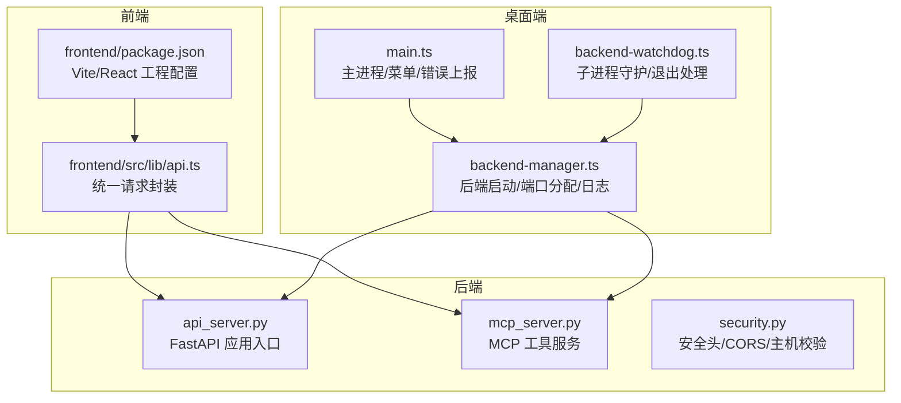
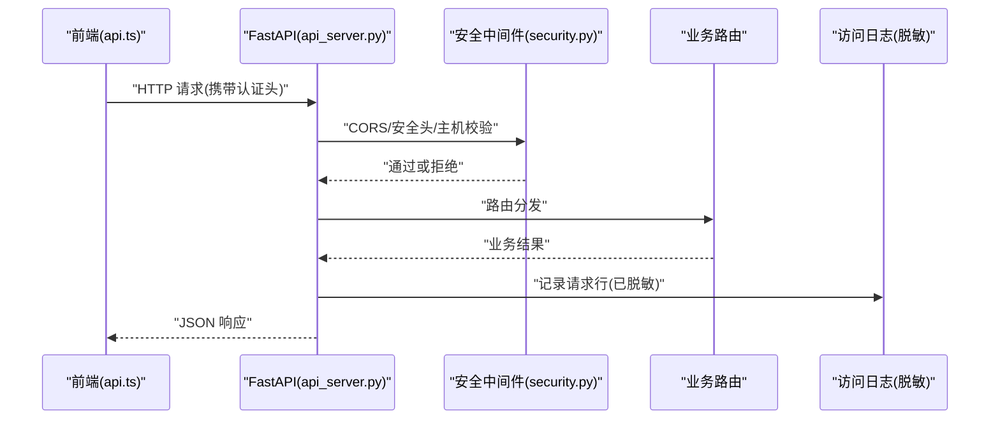
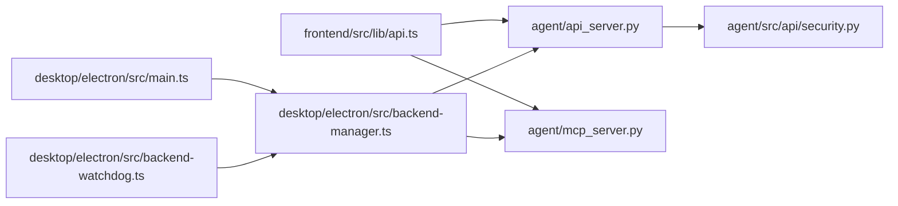

# 调试与性能分析

<cite>
**本文引用的文件**
- [agent/api_server.py](file://agent/api_server.py)
- [agent/mcp_server.py](file://agent/mcp_server.py)
- [agent/src/api/security.py](file://agent/src/api/security.py)
- [agent/scripts/bench_performance.py](file://agent/scripts/bench_performance.py)
- [frontend/package.json](file://frontend/package.json)
- [frontend/src/lib/api.ts](file://frontend/src/lib/api.ts)
- [desktop/electron/src/main.ts](file://desktop/electron/src/main.ts)
- [desktop/electron/src/backend-manager.ts](file://desktop/electron/src/backend-manager.ts)
- [desktop/electron/src/backend-watchdog.ts](file://desktop/electron/src/backend-watchdog.ts)
- [agent/cli/commands/chat.py](file://agent/cli/commands/chat.py)
</cite>

## 目录
1. [简介](#简介)
2. [项目结构](#项目结构)
3. [核心组件](#核心组件)
4. [架构总览](#架构总览)
5. [详细组件分析](#详细组件分析)
6. [依赖关系分析](#依赖关系分析)
7. [性能注意事项](#性能注意事项)
8. [故障排除指南](#故障排除指南)
9. [结论](#结论)
10. [附录](#附录)

## 简介
本指南面向 Vibe-Trading 项目的调试与性能分析，覆盖后端 Python（FastAPI/MCP）、前端 React（Vite）以及桌面端 Electron 的调试方法；提供 cProfile、line_profiler、Chrome DevTools 等工具的使用建议；并给出分布式场景下的微服务通信与消息队列排查思路。文档同时包含常见性能瓶颈识别与优化策略，以及可复用的实际调试案例与排障步骤。

## 项目结构
本项目由三部分组成：
- 后端 API 服务：基于 FastAPI 的 REST/SSE 接口，负责会话、回测、因子、通道、系统设置等能力。
- MCP 服务：暴露研究工具给外部客户端（如 Claude Desktop），支持 stdio、SSE、Streamable HTTP 三种传输。
- 前端与桌面端：React + Vite 构建 SPA，Electron 进程管理后端并输出日志。

**图表来源**
- [agent/api_server.py:166-185](file://agent/api_server.py#L166-L185)
- [agent/mcp_server.py:71-83](file://agent/mcp_server.py#L71-L83)
- [agent/src/api/security.py:166-173](file://agent/src/api/security.py#L166-L173)
- [frontend/package.json:9-15](file://frontend/package.json#L9-L15)
- [frontend/src/lib/api.ts:321-349](file://frontend/src/lib/api.ts#L321-L349)
- [desktop/electron/src/main.ts:212-226](file://desktop/electron/src/main.ts#L212-L226)
- [desktop/electron/src/backend-manager.ts:78-99](file://desktop/electron/src/backend-manager.ts#L78-L99)
- [desktop/electron/src/backend-watchdog.ts:50-68](file://desktop/electron/src/backend-watchdog.ts#L50-L68)

**章节来源**
- [agent/api_server.py:166-185](file://agent/api_server.py#L166-L185)
- [agent/mcp_server.py:71-83](file://agent/mcp_server.py#L71-L83)
- [frontend/package.json:9-15](file://frontend/package.json#L9-L15)
- [frontend/src/lib/api.ts:321-349](file://frontend/src/lib/api.ts#L321-L349)
- [desktop/electron/src/main.ts:212-226](file://desktop/electron/src/main.ts#L212-L226)
- [desktop/electron/src/backend-manager.ts:78-99](file://desktop/electron/src/backend-manager.ts#L78-L99)
- [desktop/electron/src/backend-watchdog.ts:50-68](file://desktop/electron/src/backend-watchdog.ts#L50-L68)

## 核心组件
- FastAPI 应用与中间件：挂载 CORS、安全头、SPA 路由回退、访问日志脱敏等。
- MCP 服务：注册工具、安全中间件（Host/Origin 白名单）、网络传输适配。
- 前端请求层：统一 fetch 封装、认证头注入、错误解析。
- 桌面端：后端进程管理、日志落盘、错误上报、菜单操作。

**章节来源**
- [agent/api_server.py:166-185](file://agent/api_server.py#L166-L185)
- [agent/mcp_server.py:231-305](file://agent/mcp_server.py#L231-L305)
- [frontend/src/lib/api.ts:321-349](file://frontend/src/lib/api.ts#L321-L349)
- [desktop/electron/src/backend-manager.ts:78-99](file://desktop/electron/src/backend-manager.ts#L78-L99)

## 架构总览
下图展示一次从前端到后端的典型请求流程，包括认证、安全校验、路由分发与响应。

**图表来源**
- [frontend/src/lib/api.ts:321-349](file://frontend/src/lib/api.ts#L321-L349)
- [agent/api_server.py:166-185](file://agent/api_server.py#L166-L185)
- [agent/src/api/security.py:166-173](file://agent/src/api/security.py#L166-L173)

## 详细组件分析

### 后端 FastAPI 服务调试
- 断点调试
  - 使用 IDE 在 api_server 的 lifespan、中间件、路由注册处打断点，观察启动顺序与请求链路。
  - 关注 Uvicorn 运行参数与日志级别，便于定位慢请求与异常。
- 日志分析
  - 访问日志已安装脱敏过滤器，避免泄露 API Key/票据。
  - 结合中间件与安全头，检查 CORS、主机白名单是否误拦截。
- 异常追踪
  - 在路由与中间件中捕获异常并返回结构化错误，便于前端统一处理。
- 内存泄漏检测
  - 使用 tracemalloc、memory_profiler 对热点路径进行采样；结合后台任务生命周期检查资源释放。

**章节来源**
- [agent/api_server.py:127-161](file://agent/api_server.py#L127-L161)
- [agent/api_server.py:176-185](file://agent/api_server.py#L176-L185)
- [agent/api_server.py:404-410](file://agent/api_server.py#L404-L410)
- [agent/src/api/security.py:166-173](file://agent/src/api/security.py#L166-L173)

### MCP 服务调试
- 传输模式
  - stdio 用于本地集成；SSE/HTTP 用于网络访问，需启用 Host/Origin 白名单防护。
- 安全与调试
  - 通过 _HostGuardMiddleware/_OriginGuardMiddleware 拦截非法请求，便于定位 DNS 重绑定与跨域问题。
  - 工具调用链可通过日志与上下文 ID 追踪，配合 session_id 关联多轮对话。
- 常见问题
  - 客户端发送 JSON 字符串作为列表/字典参数时，需确保 BeforeValidator 解码正确。
  - 网络模式下务必限制允许的主机与来源，避免未授权访问。

**章节来源**
- [agent/mcp_server.py:231-305](file://agent/mcp_server.py#L231-L305)
- [agent/mcp_server.py:426-464](file://agent/mcp_server.py#L426-L464)

### 前端 React/Vite 调试
- 浏览器开发者工具
  - Network 面板查看请求/响应、状态码、耗时；Console 查看 JS 错误；Performance 面板录制渲染与长任务。
- 网络请求调试
  - 使用统一请求封装 api.ts，可在拦截器中打印请求头、URL、响应体摘要，快速定位认证失败与格式错误。
- 性能监控
  - 使用 Performance/Memory 面板分析重渲染、大对象、内存增长；结合 Lighthouse 评估首屏与缓存策略。
- 开发模式
  - package.json 脚本提供 dev/build/preview/test，便于本地联调与构建验证。

**章节来源**
- [frontend/src/lib/api.ts:321-349](file://frontend/src/lib/api.ts#L321-L349)
- [frontend/package.json:9-15](file://frontend/package.json#L9-L15)

### 桌面端 Electron 调试
- 后端进程管理
  - backend-manager 负责选择可执行文件、分配端口、创建日志文件并启动后端。
- 守护与错误上报
  - watchdog 监听父进程存活、子进程退出信号，向主进程上报错误；主进程提供“打开日志”菜单项。
- 调试技巧
  - 通过日志目录中的日期命名日志文件，结合控制台输出定位启动失败、端口占用、后端崩溃等问题。

**章节来源**
- [desktop/electron/src/backend-manager.ts:78-99](file://desktop/electron/src/backend-manager.ts#L78-L99)
- [desktop/electron/src/backend-watchdog.ts:50-68](file://desktop/electron/src/backend-watchdog.ts#L50-L68)
- [desktop/electron/src/main.ts:212-226](file://desktop/electron/src/main.ts#L212-L226)

### 性能基准与热点定位
- 内置基准脚本
  - bench_performance.py 对比因子算子与权益计算的性能，报告向量化与循环路径差异，辅助识别热点。
- 指标解读
  - 关注每次调用耗时、加速比、Bottleneck 可用性，指导算法与数据结构优化。

**章节来源**
- [agent/scripts/bench_performance.py:19-43](file://agent/scripts/bench_performance.py#L19-L43)
- [agent/scripts/bench_performance.py:47-116](file://agent/scripts/bench_performance.py#L47-L116)
- [agent/scripts/bench_performance.py:119-134](file://agent/scripts/bench_performance.py#L119-L134)

## 依赖关系分析
- 前后端耦合点
  - 前端通过 api.ts 发起请求，后端通过 api_server 路由分发，security 模块提供安全与 CORS 控制。
- 桌面端与后端
  - Electron 通过 backend-manager 启动后端并写入日志，watchdog 保障进程健康。
- 潜在环路
  - 模块间采用延迟导入与单例访问，降低启动时耦合；注意环境变量读取与配置重置的线程安全。

**图表来源**
- [frontend/src/lib/api.ts:321-349](file://frontend/src/lib/api.ts#L321-L349)
- [agent/api_server.py:166-185](file://agent/api_server.py#L166-L185)
- [agent/src/api/security.py:166-173](file://agent/src/api/security.py#L166-L173)
- [agent/mcp_server.py:231-305](file://agent/mcp_server.py#L231-L305)
- [desktop/electron/src/main.ts:212-226](file://desktop/electron/src/main.ts#L212-L226)
- [desktop/electron/src/backend-manager.ts:78-99](file://desktop/electron/src/backend-manager.ts#L78-L99)
- [desktop/electron/src/backend-watchdog.ts:50-68](file://desktop/electron/src/backend-watchdog.ts#L50-L68)

**章节来源**
- [frontend/src/lib/api.ts:321-349](file://frontend/src/lib/api.ts#L321-L349)
- [agent/api_server.py:166-185](file://agent/api_server.py#L166-L185)
- [agent/src/api/security.py:166-173](file://agent/src/api/security.py#L166-L173)
- [agent/mcp_server.py:231-305](file://agent/mcp_server.py#L231-L305)
- [desktop/electron/src/backend-manager.ts:78-99](file://desktop/electron/src/backend-manager.ts#L78-L99)
- [desktop/electron/src/backend-watchdog.ts:50-68](file://desktop/electron/src/backend-watchdog.ts#L50-L68)

## 性能注意事项
- 后端
  - 使用 cProfile 定位函数级热点；line_profiler 细化到行级耗时；tracemalloc/memory_profiler 检测内存增长与泄漏。
  - 利用 bench_performance.py 的基准用例对比不同实现路径，优先优化高频调用与大数据集处理。
- 前端
  - Chrome DevTools 的 Performance 面板录制交互过程，识别长任务与频繁重绘；Network 面板分析请求大小与并发。
  - 使用 Lighthouse 评估首屏加载、缓存策略与资源压缩。
- 桌面端
  - 通过日志文件与进程守护机制，观察后端启动耗时、崩溃频率与资源占用。

[本节为通用指导，不直接分析具体文件]

## 故障排除指南
- 后端启动与运行
  - 检查 FastAPI 的 lifespan 钩子与中间件是否正确挂载；确认 Uvicorn 日志级别与访问日志脱敏生效。
  - 若出现 403/401，检查 security 模块的 Host/Origin 白名单与 CORS 配置。
- 前端请求失败
  - 在 api.ts 的请求封装中打印 URL、请求头与响应摘要；区分认证错误与数据格式错误。
  - 使用浏览器 Network 面板过滤失败请求，查看状态码与响应体。
- 桌面端后端异常
  - 通过“打开日志”菜单查看日期命名的日志文件；watchdog 会记录后端退出原因与信号。
  - 若端口冲突，检查 backend-manager 的端口分配逻辑。
- 交互式调试开关
  - CLI 提供 debug 命令切换调试摘要，便于在交互过程中观察迭代次数、工具调用与耗时。

**章节来源**
- [agent/api_server.py:166-185](file://agent/api_server.py#L166-L185)
- [agent/src/api/security.py:166-173](file://agent/src/api/security.py#L166-L173)
- [frontend/src/lib/api.ts:321-349](file://frontend/src/lib/api.ts#L321-L349)
- [desktop/electron/src/backend-manager.ts:78-99](file://desktop/electron/src/backend-manager.ts#L78-L99)
- [desktop/electron/src/backend-watchdog.ts:50-68](file://desktop/electron/src/backend-watchdog.ts#L50-L68)
- [desktop/electron/src/main.ts:212-226](file://desktop/electron/src/main.ts#L212-L226)
- [agent/cli/commands/chat.py:183-212](file://agent/cli/commands/chat.py#L183-L212)

## 结论
通过对后端 FastAPI/MCP、前端 React/Vite 与桌面端 Electron 的调试与性能分析，可以系统化地定位问题与优化性能。建议在日常开发中结合内置基准脚本、浏览器性能工具与 Python 性能分析工具，形成闭环的调试与优化流程；在生产环境强化安全中间件与日志脱敏，确保稳定与可观测性。

[本节为总结，不直接分析具体文件]

## 附录
- 常用工具速查
  - cProfile：python -m cProfile -o profile.prof your_script.py
  - line_profiler：kernprof -l your_script.py
  - Chrome DevTools：Performance/Network/Memory/Lighthouse
  - 基准脚本：python agent/scripts/bench_performance.py

[本节为补充信息，不直接分析具体文件]