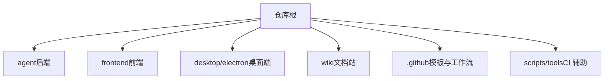
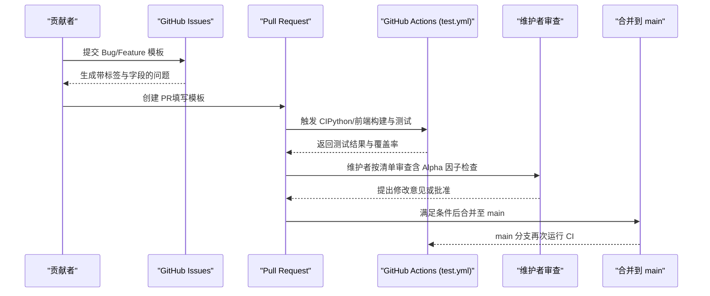
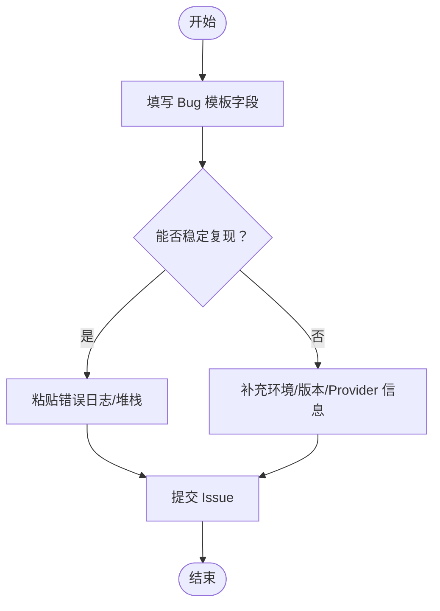
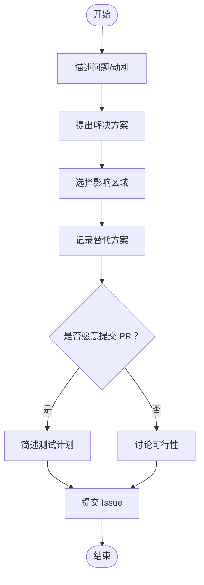
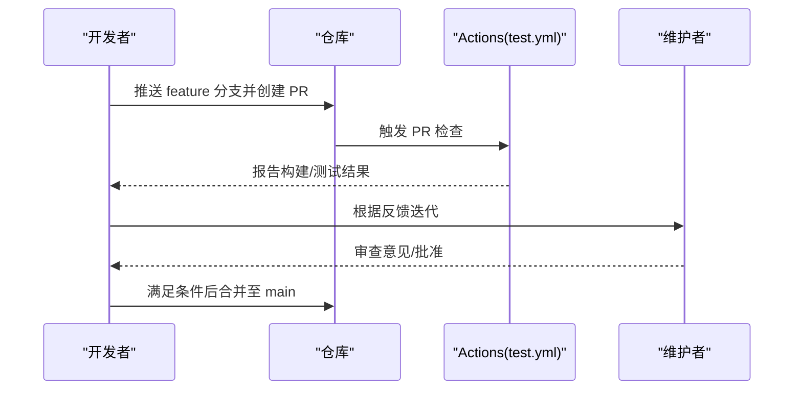
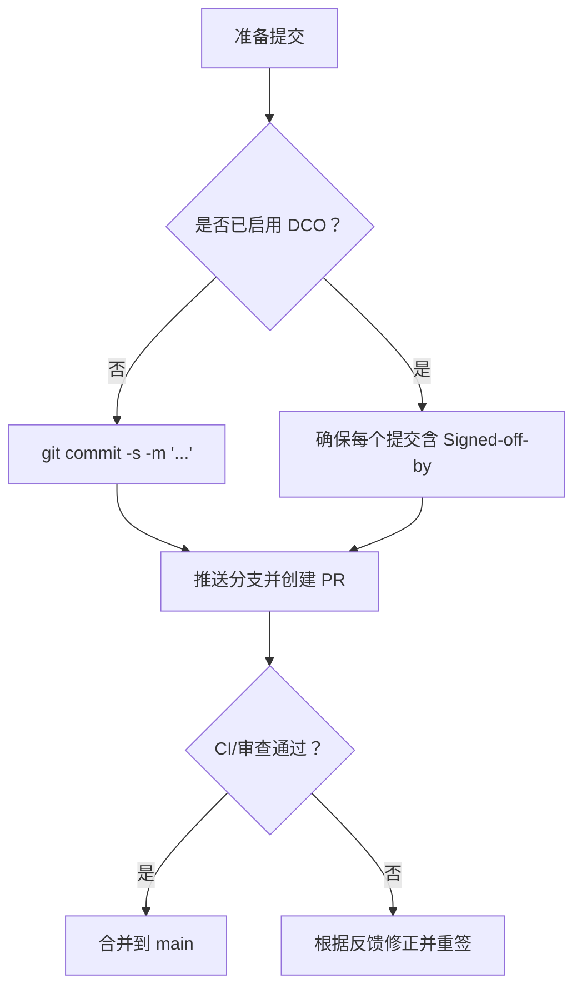
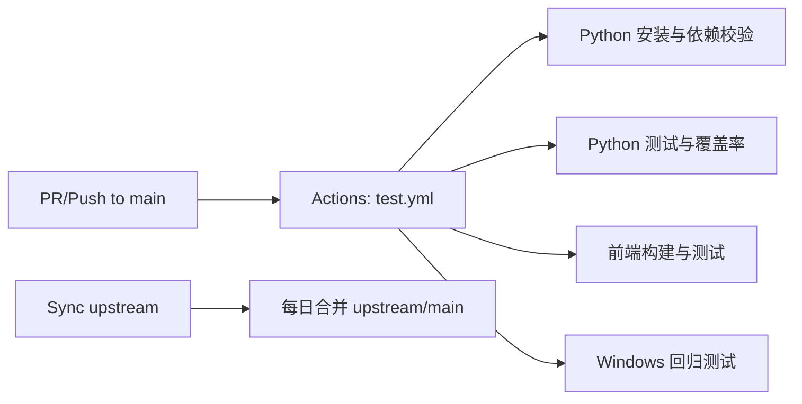

# 贡献流程

<cite>
**本文引用的文件**
- [CONTRIBUTING.md](file://CONTRIBUTING.md)
- [CODE_OF_CONDUCT.md](file://CODE_OF_CONDUCT.md)
- [SECURITY.md](file://SECURITY.md)
- [.github/pull_request_template.md](file://.github/pull_request_template.md)
- [.github/ISSUE_TEMPLATE/bug_report.yml](file://.github/ISSUE_TEMPLATE/bug_report.yml)
- [.github/ISSUE_TEMPLATE/feature_request.yml](file://.github/ISSUE_TEMPLATE/feature_request.yml)
- [.github/ISSUE_TEMPLATE/config.yml](file://.github/ISSUE_TEMPLATE/config.yml)
- [.github/workflows/test.yml](file://.github/workflows/test.yml)
- [.github/workflows/sync-upstream.yml](file://.github/workflows/sync-upstream.yml)
- [.github/dependabot.yml](file://.github/dependabot.yml)
- [AGENT_CONTRIBUTOR_GUIDE.md](file://AGENT_CONTRIBUTOR_GUIDE.md)
</cite>

## 目录
1. [简介](#简介)
2. [项目结构](#项目结构)
3. [核心组件](#核心组件)
4. [架构总览](#架构总览)
5. [详细组件分析](#详细组件分析)
6. [依赖分析](#依赖分析)
7. [性能考虑](#性能考虑)
8. [故障排查指南](#故障排查指南)
9. [结论](#结论)
10. [附录](#附录)

## 简介
本指南面向希望为 Vibe-Trading 做出贡献的开发者，覆盖问题报告、功能请求、Pull Request 提交流程、分支策略、代码审查与合并条件、DCO 签名要求、社区行为准则与沟通规范、贡献者认证与权限管理，以及从简单修复到复杂功能添加的实际贡献示例。内容基于仓库中的贡献文档、模板与工作流配置整理而成。

## 项目结构
Vibe-Trading 采用多语言、多模块组织：
- agent：后端与核心逻辑（Python）
- frontend：前端（TypeScript/React/Vite）
- desktop/electron：桌面端打包与生命周期脚本
- wiki：公开文档站点资源
- .github：GitHub 模板与工作流
- scripts/tools：CI 辅助工具与检查脚本

**章节来源**
- [CONTRIBUTING.md:1-16](file://CONTRIBUTING.md#L1-L16)
- [AGENT_CONTRIBUTOR_GUIDE.md:8-22](file://AGENT_CONTRIBUTOR_GUIDE.md#L8-L22)

## 核心组件
- 问题报告与功能请求：通过 GitHub Issue 模板标准化提交，便于分类与复现。
- Pull Request 提交流程：使用 PR 模板描述变更、测试计划与检查清单；工作流在 main 分支触发 CI。
- DCO 签名：所有社区提交的 PR 必须包含 Signed-off-by 尾注。
- 代码风格与质量：Black/Ruff 格式化与静态检查；Alpha Zoo 因子有额外纯度与前瞻泄露检查。
- 安全与合规：漏洞私报通道、敏感信息保护、官方渠道声明。
- 社区行为准则：遵循 Contributor Covenant，明确可接受与不可接受行为及执行阶梯。

**章节来源**
- [CONTRIBUTING.md:18-165](file://CONTRIBUTING.md#L18-L165)
- [CODE_OF_CONDUCT.md:1-129](file://CODE_OF_CONDUCT.md#L1-L129)
- [SECURITY.md:1-48](file://SECURITY.md#L1-L48)
- [.github/pull_request_template.md:1-29](file://.github/pull_request_template.md#L1-L29)
- [.github/ISSUE_TEMPLATE/bug_report.yml:1-78](file://.github/ISSUE_TEMPLATE/bug_report.yml#L1-L78)
- [.github/ISSUE_TEMPLATE/feature_request.yml:1-63](file://.github/ISSUE_TEMPLATE/feature_request.yml#L1-L63)

## 架构总览
下图展示了从“提出问题/需求”到“PR 审查与合并”的端到端流程，并映射到仓库中的模板与工作流。

**图表来源**
- [.github/ISSUE_TEMPLATE/bug_report.yml:1-78](file://.github/ISSUE_TEMPLATE/bug_report.yml#L1-L78)
- [.github/ISSUE_TEMPLATE/feature_request.yml:1-63](file://.github/ISSUE_TEMPLATE/feature_request.yml#L1-L63)
- [.github/pull_request_template.md:1-29](file://.github/pull_request_template.md#L1-L29)
- [.github/workflows/test.yml:1-165](file://.github/workflows/test.yml#L1-L165)

**章节来源**
- [.github/workflows/test.yml:1-165](file://.github/workflows/test.yml#L1-L165)

## 详细组件分析

### 问题报告流程（Bug）
- 使用 Bug Report 模板，必填项包括：问题描述、复现步骤、错误日志、接口类型（CLI/Web UI/MCP/Docker/Python API）、LLM Provider、版本与环境。
- 建议提供最小可复现命令与完整堆栈，便于快速定位。
- 标签自动设置为 bug，便于追踪。

**图表来源**
- [.github/ISSUE_TEMPLATE/bug_report.yml:1-78](file://.github/ISSUE_TEMPLATE/bug_report.yml#L1-L78)

**章节来源**
- [.github/ISSUE_TEMPLATE/bug_report.yml:1-78](file://.github/ISSUE_TEMPLATE/bug_report.yml#L1-L78)

### 功能请求流程（Enhancement）
- 使用 Feature Request 模板，说明动机、拟解决方案、影响区域、替代方案，并可选择是否愿意提交 PR。
- 标签自动设置为 enhancement，便于规划与排期。

**图表来源**
- [.github/ISSUE_TEMPLATE/feature_request.yml:1-63](file://.github/ISSUE_TEMPLATE/feature_request.yml#L1-L63)

**章节来源**
- [.github/ISSUE_TEMPLATE/feature_request.yml:1-63](file://.github/ISSUE_TEMPLATE/feature_request.yml#L1-L63)

### 问题分类标准
- 通过模板字段进行初步分类：
  - 接口类型：CLI / Web UI / MCP / Docker / Python API
  - 影响区域（功能请求）：Skills / Backtest / Swarm / CLI/TUI / Web UI / MCP Plugin / Data Sources / Documentation / Other
- 结合 Issue 标签（bug/enhancement）与模板选择项，便于维护者分派与优先级评估。

**章节来源**
- [.github/ISSUE_TEMPLATE/bug_report.yml:44-78](file://.github/ISSUE_TEMPLATE/bug_report.yml#L44-L78)
- [.github/ISSUE_TEMPLATE/feature_request.yml:33-49](file://.github/ISSUE_TEMPLATE/feature_request.yml#L33-L49)

### Pull Request 提交流程
- 分支策略：工作流对 main 分支的 push 与 pull_request 事件触发 CI；建议以 feature 分支开发后发起 PR 至 main。
- PR 模板要求：
  - Summary/Why/Changes/Test Plan 清晰描述目标、背景、关键变更与验证方式。
  - Checklist 强调不改动受保护区域、无硬编码值、遵循贡献指南、更新文档（如用户可见变更）。
- CI 检查：
  - Python 依赖校验、语法检查、单元测试、覆盖率。
  - 前端构建与测试。
  - Windows 后台任务与桌面端生命周期回归。

**图表来源**
- [.github/workflows/test.yml:1-165](file://.github/workflows/test.yml#L1-L165)
- [.github/pull_request_template.md:1-29](file://.github/pull_request_template.md#L1-L29)

**章节来源**
- [.github/workflows/test.yml:1-165](file://.github/workflows/test.yml#L1-L165)
- [.github/pull_request_template.md:1-29](file://.github/pull_request_template.md#L1-L29)

### 代码审查要求与合并条件
- 通用审查要点：
  - 遵循 CONTRIBUTING 的代码风格（Black/Ruff、类型注解、Google 风格 docstring、文件大小限制等）。
  - 不引入硬编码密钥/路径/URL，配置通过环境变量或配置文件。
  - 删除未使用代码，避免混入无关格式清理。
- Alpha 因子专项审查（适用于 agent/src/factors/zoo/**/*.py）：
  - 纯度门控与前瞻泄露门控测试通过。
  - __alpha_meta__ 字段齐全且符合 Pydantic 校验。
  - compute(panel) 契约满足形状与数值约束。
  - LaTeX 公式与代码一致，许可证与归属标注正确。
  - 每个提交均含 DCO Signed-off-by。
- 合并条件（推断自工作流与模板）：
  - CI 全部通过（Python/前端/Windows 回归）。
  - 维护者审查通过（必要时附加 Alpha 因子检查清单）。
  - PR 描述与测试计划充分，无受保护区域违规改动。

**章节来源**
- [CONTRIBUTING.md:85-165](file://CONTRIBUTING.md#L85-L165)
- [.github/pull_request_template.md:17-29](file://.github/pull_request_template.md#L17-L29)
- [.github/workflows/test.yml:18-89](file://.github/workflows/test.yml#L18-L89)

### DCO（Developer Certificate of Origin）签名要求与签署方法
- 要求：所有社区 PR 的每个提交必须包含 Signed-off-by 尾注；维护者直接推送到 main 不受此限制。
- 签署方法：使用 git commit -s 提交，或在 rebase 时统一加签。
- 若 PR 缺少签名，将被要求 rebase 并重新签名。

**图表来源**
- [CONTRIBUTING.md:18-42](file://CONTRIBUTING.md#L18-L42)

**章节来源**
- [CONTRIBUTING.md:18-42](file://CONTRIBUTING.md#L18-L42)

### 社区行为准则与沟通规范
- 行为准则：遵循 Contributor Covenant，倡导尊重、包容、建设性反馈；禁止骚扰、攻击性行为与泄露隐私。
- 执行：社区负责人负责澄清与执行，依据影响程度采取纠正、警告、临时封禁、永久封禁等措施。
- 沟通渠道：Discord 社区、GitHub Discussions、Issue 与 PR 评论；安全问题通过私报通道处理。

**章节来源**
- [CODE_OF_CONDUCT.md:1-129](file://CODE_OF_CONDUCT.md#L1-L129)
- [.github/ISSUE_TEMPLATE/config.yml:1-12](file://.github/ISSUE_TEMPLATE/config.yml#L1-L12)
- [SECURITY.md:9-18](file://SECURITY.md#L9-L18)

### 贡献者认证流程与权限管理
- 认证：通过 DCO 签名确认贡献者拥有提交代码的权利；AI/自动化辅助贡献需遵循 AGENT_CONTRIBUTOR_GUIDE 的安全边界与本地检查。
- 权限：
  - 社区贡献：通过 Fork + PR 模式提交，由维护者审查合并。
  - 维护者：可直接推送到 main，但仍需遵循安全与质量要求。
  - 敏感操作（发布、部署、密钥管理）仅限具备相应权限的维护者执行。

**章节来源**
- [CONTRIBUTING.md:18-42](file://CONTRIBUTING.md#L18-L42)
- [AGENT_CONTRIBUTOR_GUIDE.md:1-22](file://AGENT_CONTRIBUTOR_GUIDE.md#L1-L22)
- [AGENT_CONTRIBUTOR_GUIDE.md:41-55](file://AGENT_CONTRIBUTOR_GUIDE.md#L41-L55)

### 实际贡献示例
- 简单修复（文档/小 Bug）：
  - 创建 issue 描述问题（Bug 模板），fork 仓库，创建 feature 分支，修复并提交（含 DCO），发起 PR，等待 CI 与维护者审查。
- 中等复杂度（新增技能/数据源）：
  - 在对应模块添加实现，补充测试与文档，遵循代码风格与安全边界，PR 中说明影响范围与回滚路径。
- 复杂功能（Alpha 因子/交易相关）：
  - 严格遵循 Alpha 因子审查清单（纯度/前瞻泄露/元数据/契约/LaTeX/许可证/DCO），在 PR 中附上本地测试与基准结果，必要时提供回滚方案。

**章节来源**
- [CONTRIBUTING.md:120-139](file://CONTRIBUTING.md#L120-L139)
- [AGENT_CONTRIBUTOR_GUIDE.md:24-84](file://AGENT_CONTRIBUTOR_GUIDE.md#L24-L84)

### 维护者的审查标准与决策过程
- 通用标准：
  - 代码质量：Black/Ruff、类型注解、文档字符串、文件大小限制。
  - 安全性：无硬编码密钥、不暴露敏感信息、外部调用受控。
  - 可维护性：职责单一、注释清晰、测试覆盖。
- Alpha 因子专项：
  - 必须通过纯度与前瞻泄露测试，元数据与契约完备，公式与代码一致，许可证与归属正确。
- 决策过程：
  - CI 全绿 + 维护者审查通过 → 合并；否则退回修改。
  - 高风险变更（订单、授权、网络行为）需附带回归测试与回滚路径。

**章节来源**
- [CONTRIBUTING.md:85-165](file://CONTRIBUTING.md#L85-L165)
- [AGENT_CONTRIBUTOR_GUIDE.md:98-140](file://AGENT_CONTRIBUTOR_GUIDE.md#L98-L140)

## 依赖分析
- CI 依赖：
  - Python 3.11/3.12/3.14（不同作业），Node 22（前端与桌面端）。
  - 依赖锁定文件：requirements-lock.txt 与 requirements-channels-lock.txt，CI 会校验哈希一致性。
- 工作流触发：
  - 对 main 分支的 push 与 pull_request 事件触发测试。
  - 支持手动触发 workflow_dispatch。
- 上游同步：
  - 每日定时任务将官方 upstream/main 合并到用户仓库 main，冲突时失败并通知。

**图表来源**
- [.github/workflows/test.yml:1-165](file://.github/workflows/test.yml#L1-L165)
- [.github/workflows/sync-upstream.yml:1-37](file://.github/workflows/sync-upstream.yml#L1-L37)

**章节来源**
- [.github/workflows/test.yml:1-165](file://.github/workflows/test.yml#L1-L165)
- [.github/workflows/sync-upstream.yml:1-37](file://.github/workflows/sync-upstream.yml#L1-L37)

## 性能考虑
- 本地优先：在提交前运行最小化测试集，减少 CI 轮次与等待时间。
- 聚焦变更：仅对相关模块运行测试，避免全量套件带来的开销。
- 依赖缓存：CI 使用 pip/npm 缓存加速安装与构建。
- 前端构建：确保依赖锁定与 Node 版本一致，避免构建失败导致的返工。

[本节为通用指导，不直接分析具体文件]

## 故障排查指南
- CI 失败常见原因：
  - 依赖解析失败：检查 requirements-lock 与 channels-lock 完整性。
  - 测试跳过导致误判：确保可选依赖（openbb、statsmodels/arch）可用。
  - 前端构建失败：核对 Node 版本与 package-lock.json。
- 安全相关问题：
  - 发现漏洞请通过 GitHub Security Advisory 私报，勿开公开 Issue。
  - 不要提交密钥、令牌、会话 Cookie、私钥、交易导出等敏感信息。
- 官方渠道与仿冒：
  - 唯一官方 Discord 链接见 SECURITY.md；任何要求连接钱包或签名的均为诈骗。

**章节来源**
- [.github/workflows/test.yml:26-49](file://.github/workflows/test.yml#L26-L49)
- [SECURITY.md:9-48](file://SECURITY.md#L9-L48)

## 结论
Vibe-Trading 的贡献流程以模板化与自动化为核心：通过 Issue 模板标准化问题与需求，通过 PR 模板与工作流保障质量与安全，通过 DCO 与行为准则维护社区健康。贡献者应遵循代码风格、安全边界与审查清单，逐步从简单修复过渡到复杂功能添加。维护者基于 CI 结果与审查清单做出合并决策，确保代码库的稳定与可持续演进。

## 附录
- 快速参考
  - 提交签名：git commit -s
  - 本地检查：pytest --ignore=agent/tests/e2e_backtest --ignore=agent/tests/test_e2e_harness_v2.py --tb=short -q
  - 前端构建：cd frontend && npm ci && npm run build
  - 安全私报：GitHub Security Advisory
  - 社区沟通：Discord、GitHub Discussions、Issue/PR

**章节来源**
- [CONTRIBUTING.md:18-42](file://CONTRIBUTING.md#L18-L42)
- [AGENT_CONTRIBUTOR_GUIDE.md:24-84](file://AGENT_CONTRIBUTOR_GUIDE.md#L24-L84)
- [SECURITY.md:9-18](file://SECURITY.md#L9-L18)
- [.github/ISSUE_TEMPLATE/config.yml:1-12](file://.github/ISSUE_TEMPLATE/config.yml#L1-L12)