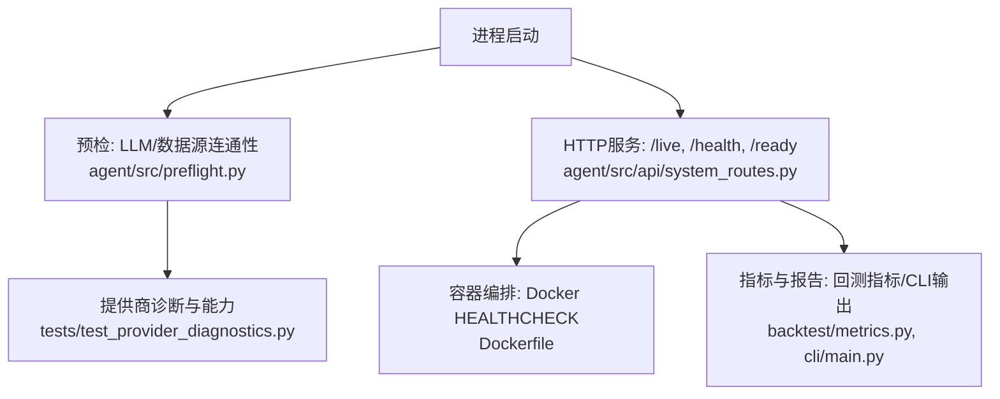
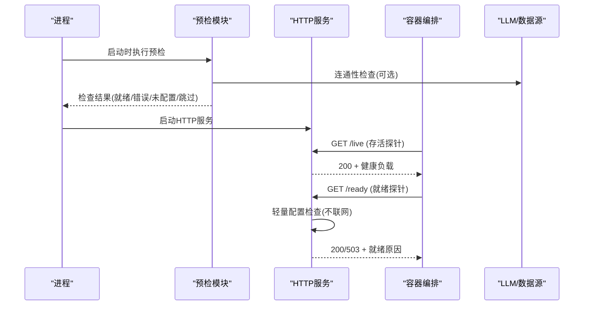
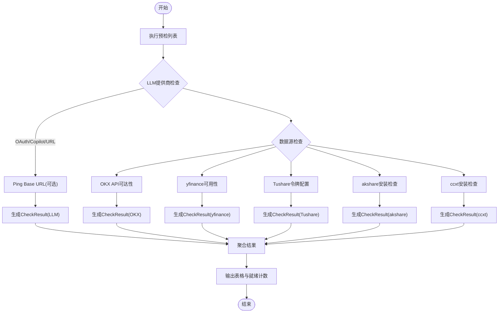
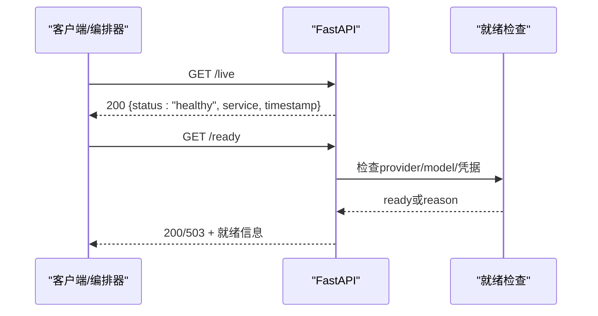
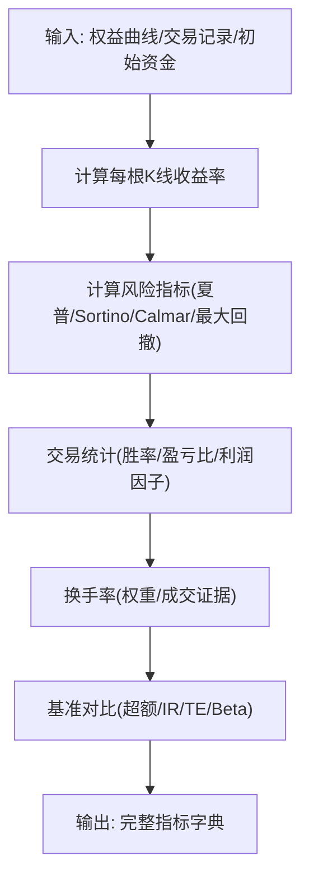
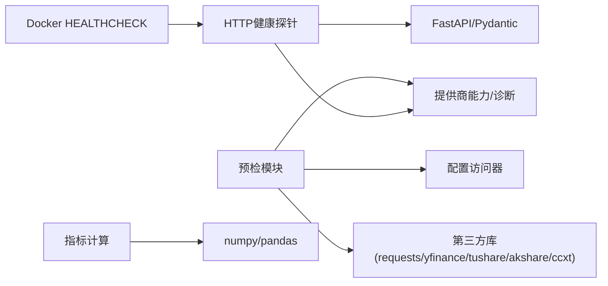

# 健康检查与监控

<cite>
**本文引用的文件**
- [agent/src/preflight.py](file://agent/src/preflight.py)
- [agent/src/api/system_routes.py](file://agent/src/api/system_routes.py)
- [Dockerfile](file://Dockerfile)
- [agent/tests/test_provider_diagnostics.py](file://agent/tests/test_provider_diagnostics.py)
- [agent/backtest/metrics.py](file://agent/backtest/metrics.py)
- [agent/cli/main.py](file://agent/cli/main.py)
</cite>

## 目录
1. [简介](#简介)
2. [项目结构](#项目结构)
3. [核心组件](#核心组件)
4. [架构总览](#架构总览)
5. [详细组件分析](#详细组件分析)
6. [依赖关系分析](#依赖关系分析)
7. [性能考量](#性能考量)
8. [故障诊断指南](#故障诊断指南)
9. [结论](#结论)
10. [附录](#附录)

## 简介
本技术文档围绕“提供商健康检查与监控系统”展开，聚焦以下目标：
- 健康检查框架设计：检查类型定义、执行调度、结果聚合。
- 连通性测试机制：API调用测试、认证验证、响应时间测量等。
- 性能基准测试：吞吐量、延迟、资源使用等指标收集与分析。
- 状态监控系统：实时状态跟踪、告警规则配置、历史数据分析。
- 故障检测算法：异常识别、趋势分析、预测性维护思路。
- 监控仪表板与报告：可视化展示、趋势图表、性能对比。
- 故障诊断与自动恢复：确保高可用性的策略与实践。

本项目在启动阶段提供预检（preflight）能力，对外暴露 /live、/health、/ready 等健康探针接口，并通过 Docker HEALTHCHECK 集成容器编排的健康探测；同时提供回测指标计算与 CLI 输出，便于构建监控与报告体系。

## 项目结构
与健康检查与监控相关的代码主要分布在如下位置：
- 启动预检与连通性检查：agent/src/preflight.py
- HTTP 健康探针与就绪检查：agent/src/api/system_routes.py
- 容器健康检查集成：Dockerfile
- 提供商诊断与能力校验：agent/tests/test_provider_diagnostics.py（覆盖 provider_diagnostics 行为）
- 性能指标与度量：agent/backtest/metrics.py
- 运行结果与仪表盘提示：agent/cli/main.py

**图示来源**
- [agent/src/preflight.py:284-337](file://agent/src/preflight.py#L284-L337)
- [agent/src/api/system_routes.py:235-272](file://agent/src/api/system_routes.py#L235-L272)
- [Dockerfile:113-115](file://Dockerfile#L113-L115)
- [agent/tests/test_provider_diagnostics.py:13-44](file://agent/tests/test_provider_diagnostics.py#L13-L44)
- [agent/backtest/metrics.py:461-626](file://agent/backtest/metrics.py#L461-L626)
- [agent/cli/main.py:799-820](file://agent/cli/main.py#L799-L820)

**章节来源**
- [agent/src/preflight.py:284-337](file://agent/src/preflight.py#L284-L337)
- [agent/src/api/system_routes.py:235-272](file://agent/src/api/system_routes.py#L235-L272)
- [Dockerfile:113-115](file://Dockerfile#L113-L115)

## 核心组件
- 预检检查器（Preflight Checks）
  - 负责在启动时检查 LLM 提供商、数据源可用性、内容过滤阈值等，并输出结构化检查结果。
  - 关键数据结构 CheckResult 包含名称、状态、消息、影响范围及是否关键项。
  - 支持多种检查：LLM 提供商连通性、OKX API、yfinance、Tushare、akshare、ccxt、内容过滤阈值。
- HTTP 健康探针（System Routes）
  - /live：进程存活探针，无外部依赖，用于容器重启决策。
  - /health：兼容旧版监控的别名。
  - /ready：就绪探针，轻量检查 LLM 提供商配置与凭据可用性，不发起网络请求。
- 容器健康检查（Docker HEALTHCHECK）
  - 通过定期访问 /live 判定容器健康，配合超时、重试、启动期参数。
- 提供商诊断与能力（Provider Diagnostics & Capabilities）
  - 提供 provider_diagnostics 能力，屏蔽敏感信息，返回基础 URL、超时、重试、代理等诊断信息。
  - 针对不同提供商的能力映射（如 OpenRouter、Moonshot/Kimi、Gemini、NVIDIA 等）。
- 性能指标与度量（Backtest Metrics）
  - 提供年化因子、收益率、夏普比率、最大回撤、Sortino、Calmar、换手率、基准对比等指标计算。
- CLI 输出与仪表盘提示
  - 打印运行摘要（年化收益、夏普、最大回撤、胜率、交易次数等），并提示如何查看仪表盘。

**章节来源**
- [agent/src/preflight.py:21-30](file://agent/src/preflight.py#L21-L30)
- [agent/src/preflight.py:32-153](file://agent/src/preflight.py#L32-L153)
- [agent/src/preflight.py:156-271](file://agent/src/preflight.py#L156-L271)
- [agent/src/api/system_routes.py:39-44](file://agent/src/api/system_routes.py#L39-L44)
- [agent/src/api/system_routes.py:235-272](file://agent/src/api/system_routes.py#L235-L272)
- [agent/tests/test_provider_diagnostics.py:13-44](file://agent/tests/test_provider_diagnostics.py#L13-L44)
- [agent/backtest/metrics.py:461-626](file://agent/backtest/metrics.py#L461-L626)
- [agent/cli/main.py:799-820](file://agent/cli/main.py#L799-L820)

## 架构总览
健康检查与监控的整体流程如下：
- 进程启动后执行预检，检查各提供商与数据源的连通性与配置完整性。
- 启动 HTTP 服务，暴露 /live、/health、/ready 等健康探针。
- 容器编排通过 Docker HEALTHCHECK 周期性探测 /live，决定容器健康状态。
- 就绪探针 /ready 仅做轻量配置检查，避免阻塞或产生额外成本。
- 运行任务完成后，CLI 输出关键指标，并提示通过 Web 界面查看仪表盘。

**图示来源**
- [agent/src/preflight.py:284-337](file://agent/src/preflight.py#L284-L337)
- [agent/src/api/system_routes.py:235-272](file://agent/src/api/system_routes.py#L235-L272)
- [Dockerfile:113-115](file://Dockerfile#L113-L115)

## 详细组件分析

### 预检检查器（Preflight Checks）
- 检查类型定义
  - CheckResult：统一封装检查结果，包括名称、状态、消息、影响范围、是否关键。
- 执行调度
  - run_preflight 按顺序执行多项检查函数，汇总结果并输出表格。
- 结果聚合
  - 统计就绪数量，若存在关键失败则提示无法启动。
- 连通性测试机制
  - LLM 提供商：根据 provider 类型进行 OAuth/Copilot/通用 base URL 检查，必要时 ping base URL。
  - OKX API：公开市场数据端点可达性检查。
  - yfinance/Tushare/akshare/ccxt：包安装与基本可用性检查。
  - 内容过滤阈值：读取配置并报告。
- 错误处理与降级
  - 非关键失败以警告形式呈现，不影响整体启动；关键失败阻止启动。

**图示来源**
- [agent/src/preflight.py:284-337](file://agent/src/preflight.py#L284-L337)
- [agent/src/preflight.py:32-153](file://agent/src/preflight.py#L32-L153)
- [agent/src/preflight.py:156-271](file://agent/src/preflight.py#L156-L271)

**章节来源**
- [agent/src/preflight.py:21-30](file://agent/src/preflight.py#L21-L30)
- [agent/src/preflight.py:32-153](file://agent/src/preflight.py#L32-L153)
- [agent/src/preflight.py:156-271](file://agent/src/preflight.py#L156-L271)
- [agent/src/preflight.py:284-337](file://agent/src/preflight.py#L284-L337)

### HTTP 健康探针（System Routes）
- /live：进程存活探针，无条件返回健康负载，供容器编排判断是否需要重启。
- /health：兼容旧版监控的别名。
- /ready：就绪探针，检查 LLM 提供商配置与凭据可用性，不发起网络请求，避免阻塞与成本。
- 速率限制：对重计算接口（如相关性矩阵）实施滑动窗口限流，防止滥用。

**图示来源**
- [agent/src/api/system_routes.py:235-272](file://agent/src/api/system_routes.py#L235-L272)
- [agent/src/api/system_routes.py:142-190](file://agent/src/api/system_routes.py#L142-L190)

**章节来源**
- [agent/src/api/system_routes.py:39-44](file://agent/src/api/system_routes.py#L39-L44)
- [agent/src/api/system_routes.py:235-272](file://agent/src/api/system_routes.py#L235-L272)
- [agent/src/api/system_routes.py:142-190](file://agent/src/api/system_routes.py#L142-L190)

### 容器健康检查（Docker HEALTHCHECK）
- 通过定期访问 /live 判定容器健康，设置间隔、超时、启动期与重试次数。
- 与 /ready 互补：/live 关注进程存活，/ready 关注业务就绪。

**章节来源**
- [Dockerfile:113-115](file://Dockerfile#L113-L115)

### 提供商诊断与能力（Provider Diagnostics & Capabilities）
- provider_diagnostics：返回 provider、model、base_url、timeout_seconds、max_retries、packages、api_key、proxy 等信息，且屏蔽敏感值。
- 能力映射：不同提供商具备不同的特性标志（如 capture_reasoning、send_reasoning_content、openrouter_reasoning_body、default_headers 等）。
- 测试覆盖：断言敏感信息被遮蔽、能力按提供商区分、用户代理头正确设置等。

**章节来源**
- [agent/tests/test_provider_diagnostics.py:13-44](file://agent/tests/test_provider_diagnostics.py#L13-L44)
- [agent/tests/test_provider_diagnostics.py:47-66](file://agent/tests/test_provider_diagnostics.py#L47-L66)
- [agent/tests/test_provider_diagnostics.py:69-103](file://agent/tests/test_provider_diagnostics.py#L69-L103)
- [agent/tests/test_provider_diagnostics.py:120-180](file://agent/tests/test_provider_diagnostics.py#L120-L180)
- [agent/tests/test_provider_diagnostics.py:198-232](file://agent/tests/test_provider_diagnostics.py#L198-L232)
- [agent/tests/test_provider_diagnostics.py:235-263](file://agent/tests/test_provider_diagnostics.py#L235-L263)

### 性能指标与度量（Backtest Metrics）
- 年化因子：按数据源与周期映射每日条数，支持跨市场年化。
- 收益率与风险指标：总收益、年化收益、最大回撤、夏普比率、Sortino、Calmar。
- 交易统计：胜率、盈亏比、连续亏损、平均持仓、利润因子。
- 换手率：基于权重变化或实际成交证据计算每根 K 线换手率。
- 基准对比：基准收益、超额收益、信息比率、跟踪误差、基准 Beta。

**图示来源**
- [agent/backtest/metrics.py:153-170](file://agent/backtest/metrics.py#L153-L170)
- [agent/backtest/metrics.py:245-330](file://agent/backtest/metrics.py#L245-L330)
- [agent/backtest/metrics.py:266-342](file://agent/backtest/metrics.py#L266-L342)
- [agent/backtest/metrics.py:441-531](file://agent/backtest/metrics.py#L441-L531)
- [agent/backtest/metrics.py:461-626](file://agent/backtest/metrics.py#L461-L626)

**章节来源**
- [agent/backtest/metrics.py:153-170](file://agent/backtest/metrics.py#L153-L170)
- [agent/backtest/metrics.py:245-330](file://agent/backtest/metrics.py#L245-L330)
- [agent/backtest/metrics.py:266-342](file://agent/backtest/metrics.py#L266-L342)
- [agent/backtest/metrics.py:441-531](file://agent/backtest/metrics.py#L441-L531)
- [agent/backtest/metrics.py:461-626](file://agent/backtest/metrics.py#L461-L626)

### CLI 输出与仪表盘提示
- 打印关键指标（年化收益、夏普、最大回撤、胜率、交易次数等）。
- 提示通过 serve 命令启动服务后，打开 /runs/{run_id}?view=dashboard 查看仪表盘。

**章节来源**
- [agent/cli/main.py:799-820](file://agent/cli/main.py#L799-L820)

## 依赖关系分析
- 预检模块依赖配置访问器与提供商能力模块，必要时导入 requests/yfinance/tushare/akshare/ccxt 等第三方库。
- HTTP 健康探针依赖 FastAPI、Pydantic 模型与安全依赖注入。
- 容器健康检查依赖 Docker HEALTHCHECK 指令与 HTTP 服务。
- 提供商诊断与能力模块依赖环境变量与提供商特定实现。
- 指标计算模块依赖 numpy/pandas 进行数值计算。

**图示来源**
- [agent/src/preflight.py:18-19](file://agent/src/preflight.py#L18-L19)
- [agent/src/preflight.py:32-153](file://agent/src/preflight.py#L32-L153)
- [agent/src/api/system_routes.py:17-30](file://agent/src/api/system_routes.py#L17-L30)
- [agent/backtest/metrics.py:11-14](file://agent/backtest/metrics.py#L11-L14)

**章节来源**
- [agent/src/preflight.py:18-19](file://agent/src/preflight.py#L18-L19)
- [agent/src/api/system_routes.py:17-30](file://agent/src/api/system_routes.py#L17-L30)
- [agent/backtest/metrics.py:11-14](file://agent/backtest/metrics.py#L11-L14)

## 性能考量
- 健康探针优化
  - /live 无外部依赖，响应极快，适合高频存活探测。
  - /ready 仅做配置检查，避免网络开销与 LLM 成本。
- 预检检查
  - 对 LLM base URL 的 ping 使用合理超时，避免阻塞启动。
  - 数据源检查优先包可用性，再尝试最小化网络请求。
- 指标计算
  - 年化因子按数据源与周期映射，避免错误年化导致指标失真。
  - 小样本保护：单观测序列下夏普/Sortino等指标安全降级。
- 速率限制
  - 对重计算接口实施滑动窗口限流，防止滥用与资源耗尽。

[本节为一般性指导，无需具体文件引用]

## 故障诊断指南
- 启动失败
  - 检查 LLM 提供商配置（provider、model、base URL、凭据）。
  - 查看预检输出中的关键失败项与影响说明。
- 就绪失败（/ready 返回 503）
  - 确认 provider/model 已配置，OAuth/密钥可用。
  - 检查 provider_diagnostics 输出的 base_url、timeout、retries、proxy 等。
- 数据源不可用
  - OKX/yfinance/Tushare/akshare/ccxt 包安装与网络可达性。
  - Tushare 令牌是否配置。
- 指标异常
  - 检查权益曲线是否存在零或负价格导致的收益率异常。
  - 确认年化因子与数据源匹配。
- 容器健康
  - 确认 /live 可访问，Docker HEALTHCHECK 参数合理。

**章节来源**
- [agent/src/preflight.py:32-153](file://agent/src/preflight.py#L32-L153)
- [agent/src/preflight.py:156-271](file://agent/src/preflight.py#L156-L271)
- [agent/src/api/system_routes.py:142-190](file://agent/src/api/system_routes.py#L142-L190)
- [agent/tests/test_provider_diagnostics.py:13-44](file://agent/tests/test_provider_diagnostics.py#L13-L44)
- [agent/backtest/metrics.py:245-330](file://agent/backtest/metrics.py#L245-L330)
- [Dockerfile:113-115](file://Dockerfile#L113-L115)

## 结论
本项目提供了完整的健康检查与监控基础能力：
- 启动预检确保关键依赖可用，快速定位配置与连通性问题。
- HTTP 健康探针满足容器编排与外部监控需求，/live 与 /ready 分工明确。
- 提供商诊断与能力映射保障多 LLM 提供商的一致性与安全性。
- 指标计算与 CLI 输出为监控与报告提供数据基础。
建议在此基础上扩展：
- 增加更丰富的连通性测试（如认证验证、响应时间测量）。
- 引入告警规则与历史数据存储，支持趋势分析与预测性维护。
- 构建前端仪表板，可视化展示健康状态、指标趋势与性能对比。

[本节为总结性内容，无需具体文件引用]

## 附录
- 健康检查最佳实践
  - 将 /live 用于存活探测，/ready 用于就绪探测。
  - 合理设置超时与重试，避免误判。
  - 对重计算接口实施速率限制。
- 指标解读
  - 年化因子需与数据源匹配。
  - 小样本下指标可能退化，需结合上下文解读。
- 仪表盘与报告
  - 通过 CLI 提示访问 /runs/{run_id}?view=dashboard 查看详细报告。

[本节为补充性内容，无需具体文件引用]