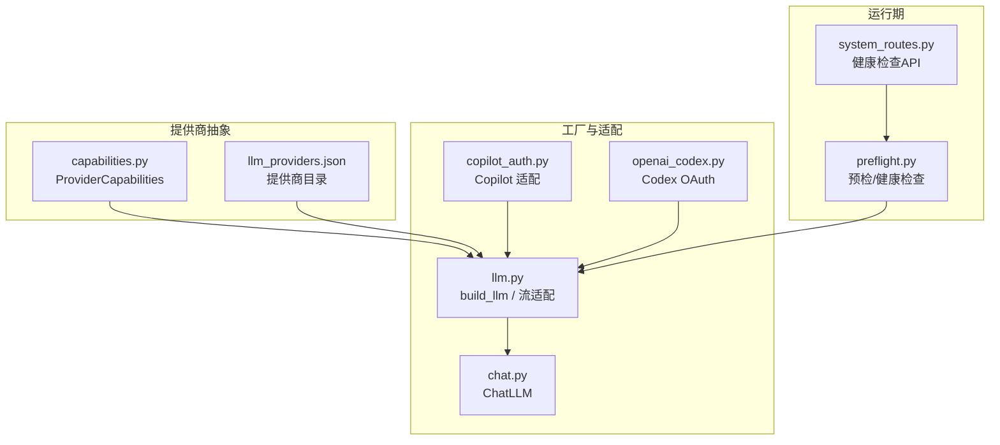
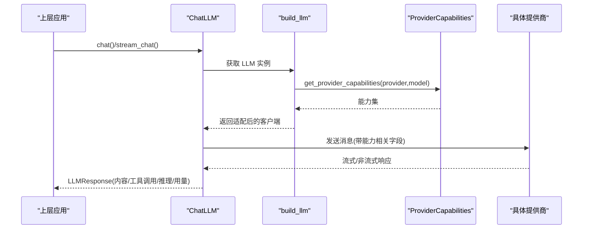
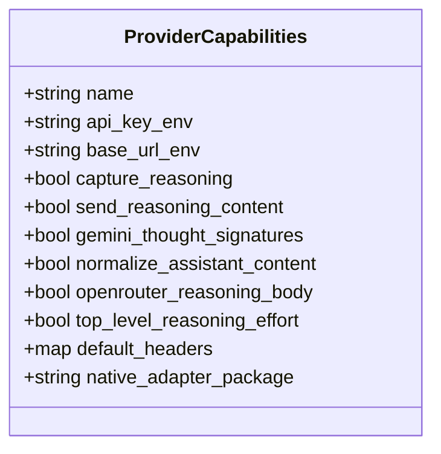
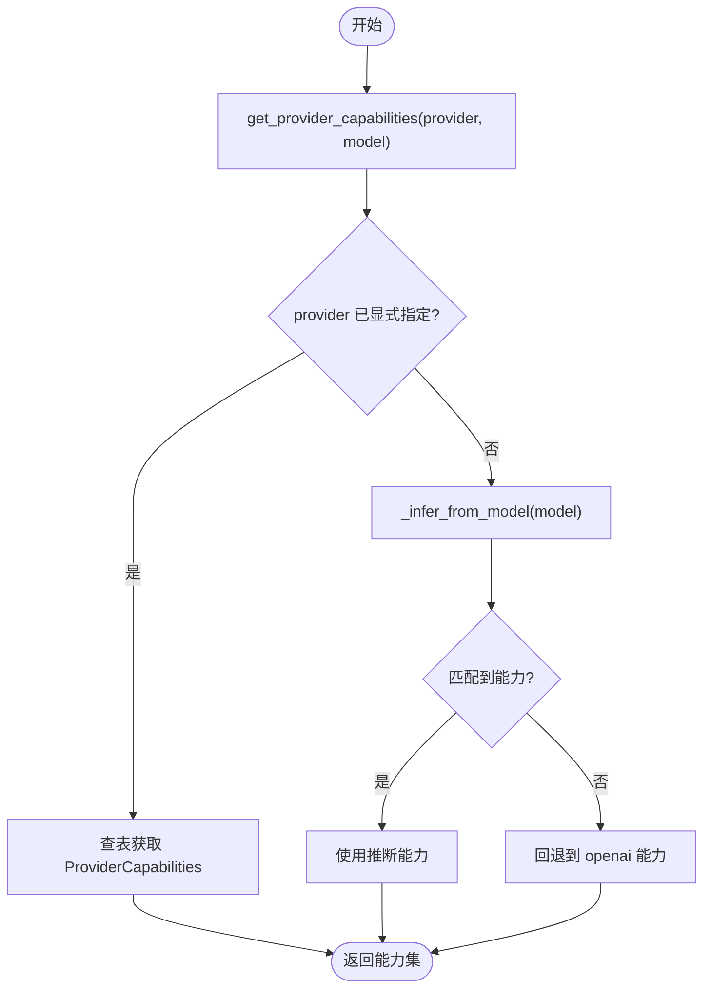
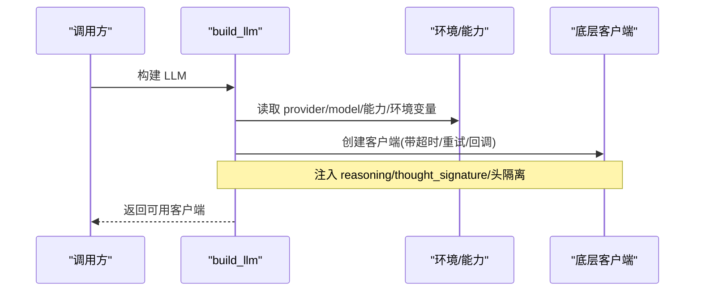
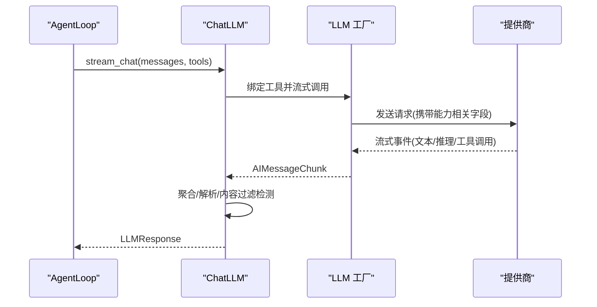
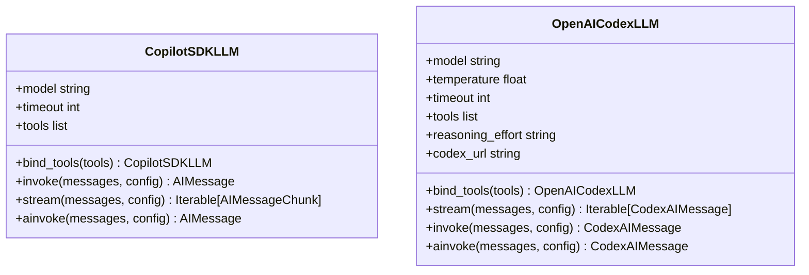
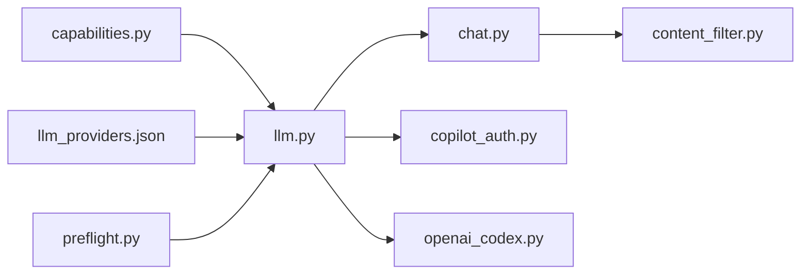
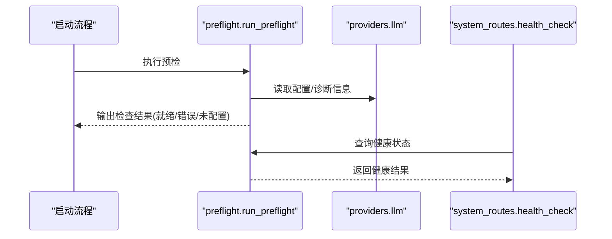

# 提供商管理

<cite>
**本文引用的文件**
- [capabilities.py](file://agent/src/providers/capabilities.py)
- [llm_providers.json](file://agent/src/providers/llm_providers.json)
- [llm.py](file://agent/src/providers/llm.py)
- [chat.py](file://agent/src/providers/chat.py)
- [content_filter.py](file://agent/src/providers/content_filter.py)
- [copilot_auth.py](file://agent/src/providers/copilot_auth.py)
- [openai_codex.py](file://agent/src/providers/openai_codex.py)
- [preflight.py](file://agent/src/preflight.py)
- [system_routes.py](file://agent/src/api/system_routes.py)
</cite>

## 目录
1. [简介](#简介)
2. [项目结构](#项目结构)
3. [核心组件](#核心组件)
4. [架构总览](#架构总览)
5. [详细组件分析](#详细组件分析)
6. [依赖关系分析](#依赖关系分析)
7. [性能与可用性](#性能与可用性)
8. [故障转移与负载均衡](#故障转移与负载均衡)
9. [健康检查与监控](#健康检查与监控)
10. [新提供商集成指南](#新提供商集成指南)
11. [故障诊断与排错](#故障诊断与排错)
12. [结论](#结论)

## 简介
本技术文档面向平台工程师与运维人员，系统化说明“提供商管理”子系统的设计与实现。内容覆盖：
- 提供商抽象设计：能力接口、配置模型、生命周期管理
- 能力发现机制：动态扫描、元数据提取、兼容性检查
- 健康检查系统：连通性测试、性能基准、状态监控
- 故障转移策略：备用提供商选择、自动切换、回滚机制
- 负载均衡算法：轮询、权重分配、性能感知
- 新提供商集成：适配器开发、配置模板、测试用例
- 监控仪表板与故障诊断工具

该子系统通过统一的 LLM 抽象层屏蔽不同厂商差异，提供稳定的消息调用、流式响应、工具调用与推理内容透传能力，并内置内容过滤、认证适配与健康检查等生产级特性。

## 项目结构
提供商管理位于 agent/src/providers 下，围绕“能力定义—工厂构建—聊天封装—认证适配—健康检查”分层组织：
- capabilities.py：声明各提供商的能力特征（如是否支持 reasoning_content、thought_signature、top-level reasoning_effort 等）与环境变量映射
- llm_providers.json：提供商目录，包含默认模型、默认 base_url、鉴权方式等元数据
- llm.py：LLM 工厂与请求/响应适配（含 OpenAI 兼容路径、Responses 流适配、头部隔离、代理禁用等）
- chat.py：面向 AgentLoop 的 ChatLLM 统一接口（同步/流式调用、DSML 工具调用解析、内容过滤处理）
- copilot_auth.py：GitHub Copilot SDK 适配与令牌解析
- openai_codex.py：OpenAI Codex OAuth 登录、令牌刷新、SSE 事件解析
- preflight.py：启动前健康检查（LLM、OKX、yfinance、Tushare、akshare、ccxt 等）
- system_routes.py：系统 API 暴露的健康检查端点

**图表来源**
- [capabilities.py:16-56](file://agent/src/providers/capabilities.py#L16-L56)
- [llm_providers.json:1-236](file://agent/src/providers/llm_providers.json#L1-L236)
- [llm.py:249-607](file://agent/src/providers/llm.py#L249-L607)
- [chat.py:272-514](file://agent/src/providers/chat.py#L272-L514)
- [copilot_auth.py:332-460](file://agent/src/providers/copilot_auth.py#L332-L460)
- [openai_codex.py:605-711](file://agent/src/providers/openai_codex.py#L605-L711)
- [preflight.py:32-153](file://agent/src/preflight.py#L32-L153)
- [system_routes.py:253-253](file://agent/src/api/system_routes.py#L253-L253)

**章节来源**
- [capabilities.py:16-56](file://agent/src/providers/capabilities.py#L16-L56)
- [llm_providers.json:1-236](file://agent/src/providers/llm_providers.json#L1-L236)
- [llm.py:249-607](file://agent/src/providers/llm.py#L249-L607)
- [chat.py:272-514](file://agent/src/providers/chat.py#L272-L514)
- [preflight.py:32-153](file://agent/src/preflight.py#L32-L153)

## 核心组件
- ProviderCapabilities：以不可变数据类描述每个提供商的能力开关（reasoning 捕获/发送、Gemini thought signature 往返、助手 content 归一化、OpenRouter reasoning 体字段、默认头、原生适配器包名）。用于在运行时决定请求构造与响应解析行为。
- 提供商目录（llm_providers.json）：集中声明默认模型、默认 base_url、鉴权环境变量、鉴权类型（oauth/gh_cli）、登录命令等元数据，供前端设置与后端凭证解析共用。
- build_llm（llm.py）：根据 provider/model 解析能力与环境变量，构建底层客户端；对 Responses 流进行适配，注入/剥离 reasoning_content 与 Gemini thought signatures，隔离 OpenAI 专属头，支持禁用代理。
- ChatLLM（chat.py）：对外暴露 chat/stream_chat，统一解析 AIMessage/AIMessageChunk，支持 DSML 工具调用文本解析、finish_reason 规范化、内容过滤触发标记、usage_metadata 透传。
- 认证适配：
  - CopilotSDKLLM（copilot_auth.py）：基于官方 SDK 的会话与工具调用流式事件转发
  - OpenAICodexLLM（openai_codex.py）：OAuth 登录、令牌刷新、SSE 事件到 LangChain 兼容消息的转换
- 内容过滤（content_filter.py）：识别 content_filter/Gemini 安全终止原因，计算告警阈值，提供连续跳过熔断。

**章节来源**
- [capabilities.py:16-56](file://agent/src/providers/capabilities.py#L16-L56)
- [llm_providers.json:1-236](file://agent/src/providers/llm_providers.json#L1-L236)
- [llm.py:249-607](file://agent/src/providers/llm.py#L249-L607)
- [chat.py:272-514](file://agent/src/providers/chat.py#L272-L514)
- [copilot_auth.py:332-460](file://agent/src/providers/copilot_auth.py#L332-L460)
- [openai_codex.py:605-711](file://agent/src/providers/openai_codex.py#L605-L711)
- [content_filter.py:50-103](file://agent/src/providers/content_filter.py#L50-L103)

## 架构总览
提供商管理采用“能力驱动 + 工厂装配 + 统一聊天接口”的分层架构：
- 能力层：ProviderCapabilities 与 llm_providers.json 共同描述“谁支持什么”，决定请求/响应处理策略
- 工厂层：build_llm 依据能力与环境变量装配具体客户端（LangChain ChatOpenAI、Copilot SDK、Codex OAuth）
- 接口层：ChatLLM 屏蔽底层差异，向上提供 chat/stream_chat、工具调用、推理内容、使用量统计
- 运行期：preflight 与 system_routes 提供健康检查与可观测性入口

**图表来源**
- [llm.py:249-607](file://agent/src/providers/llm.py#L249-L607)
- [capabilities.py:265-300](file://agent/src/providers/capabilities.py#L265-L300)
- [chat.py:299-397](file://agent/src/providers/chat.py#L299-L397)

## 详细组件分析

### 能力接口与配置模型
- ProviderCapabilities 字段含义：
  - name/api_key_env/base_url_env：标识与凭据来源
  - capture_reasoning/send_reasoning_content：控制 reasoning_content 的捕获与重放
  - gemini_thought_signatures：控制 Gemini 工具调用思考签名往返
  - normalize_assistant_content：将 assistant content=None 归一化为空串
  - openrouter_reasoning_body/top_level_reasoning_effort：特定网关/厂商的请求体字段支持
  - default_headers/native_adapter_package：默认头与可选原生适配器包
- 提供商目录（llm_providers.json）：
  - 提供默认模型、默认 base_url、鉴权环境变量、鉴权类型（oauth/gh_cli）、登录命令
  - 便于前端设置与后端凭证解析保持一致

**图表来源**
- [capabilities.py:16-56](file://agent/src/providers/capabilities.py#L16-L56)

**章节来源**
- [capabilities.py:16-56](file://agent/src/providers/capabilities.py#L16-L56)
- [llm_providers.json:1-236](file://agent/src/providers/llm_providers.json#L1-L236)

### 能力发现与兼容性检查
- 能力解析流程：
  - 从配置或模型名推断 provider（_infer_from_model），再查表得到 ProviderCapabilities
  - 若未显式指定 provider，则按模型名前缀匹配（gemini/deepseek/nvidia/glm/kimi/moonshot）
  - 未知 provider 回退到 openai 能力集
- 兼容性检查：
  - 通过能力位决定是否注入 reasoning_content、thought_signature、top-level reasoning_effort 等
  - 对 Ollama base_url 强制补全 /v1 根路径，保证诊断与运行时一致

**图表来源**
- [capabilities.py:248-292](file://agent/src/providers/capabilities.py#L248-L292)
- [capabilities.py:362-431](file://agent/src/providers/capabilities.py#L362-L431)

**章节来源**
- [capabilities.py:248-292](file://agent/src/providers/capabilities.py#L248-L292)
- [capabilities.py:362-431](file://agent/src/providers/capabilities.py#L362-L431)

### 工厂构建与生命周期管理
- build_llm 职责：
  - 读取能力与环境变量，组装基础 URL、超时、重试、回调
  - 对 OpenAI 兼容路径进行增强：保留 reasoning_content、注入 Gemini thought signatures、隔离 OpenAI 专属头
  - 对 Responses 流进行适配，使第三方网关的 dict 事件也能被 LangChain 消费
  - 支持禁用代理（httpx transport 显式 proxy=None）
- 生命周期：
  - .env 加载顺序：~/.vibe-trading/.env → agent/.env → CWD/.env
  - 日志脱敏：base_url、代理 URL、凭据来源等敏感信息不直接输出
  - 深度校验：Authorization 值必须为 ASCII 且不含控制字符；HTTP 头必须 ASCII 且无换行

**图表来源**
- [llm.py:249-607](file://agent/src/providers/llm.py#L249-L607)
- [llm.py:49-72](file://agent/src/providers/llm.py#L49-L72)
- [llm.py:845-882](file://agent/src/providers/llm.py#L845-L882)
- [llm.py:944-973](file://agent/src/providers/llm.py#L944-L973)

**章节来源**
- [llm.py:249-607](file://agent/src/providers/llm.py#L249-L607)
- [llm.py:49-72](file://agent/src/providers/llm.py#L49-L72)
- [llm.py:845-882](file://agent/src/providers/llm.py#L845-L882)
- [llm.py:944-973](file://agent/src/providers/llm.py#L944-L973)

### 聊天接口与工具调用
- ChatLLM.chat/stream_chat：
  - 同步/流式两种路径，统一聚合为 LLMResponse
  - 流式失败时若检测到“无 SSE”错误，自动降级为非流式 invoke
  - 支持 on_text_chunk/on_reasoning_chunk 回调，以及 should_cancel 协作取消
- 工具调用：
  - 优先解析原生 tool_calls；若无则尝试解析 DSML 文本中的工具调用
  - 合并 provider 特定的 extra_content（如 Gemini thought_signature）
- finish_reason 规范化：
  - 去重后缀（tool_calls/tool_call/function_call/content_filter/length/stop）
  - 内容过滤触发标记由 content_filter.is_content_filter_triggered 判定

**图表来源**
- [chat.py:299-397](file://agent/src/providers/chat.py#L299-L397)
- [chat.py:426-514](file://agent/src/providers/chat.py#L426-L514)

**章节来源**
- [chat.py:299-397](file://agent/src/providers/chat.py#L299-L397)
- [chat.py:426-514](file://agent/src/providers/chat.py#L426-L514)

### 认证适配（Copilot/Codex）
- GitHub Copilot：
  - 支持从环境变量、gh CLI 获取 token
  - 通过官方 SDK 建立会话，转发 AssistantMessageDelta/ReasoningDelta/ToolRequested 事件
  - 提供 bind_tools/invoke/stream/ainvoke 兼容接口
- OpenAI Codex（ChatGPT OAuth）：
  - 独立登录流程，Vibe 自有令牌存储，跨进程锁保护刷新
  - 自动刷新 access_token，处理 401 拒绝场景
  - 解析 SSE 事件为 LangChain 兼容消息，支持工具调用与推理内容

**图表来源**
- [copilot_auth.py:332-460](file://agent/src/providers/copilot_auth.py#L332-L460)
- [openai_codex.py:605-711](file://agent/src/providers/openai_codex.py#L605-L711)

**章节来源**
- [copilot_auth.py:332-460](file://agent/src/providers/copilot_auth.py#L332-L460)
- [openai_codex.py:605-711](file://agent/src/providers/openai_codex.py#L605-L711)

## 依赖关系分析
- 能力与目录：
  - capabilities.get_provider_capabilities 依赖 llm_providers.json 提供的默认 base_url
- 工厂与聊天：
  - llm.ChatOpenAIWithReasoning 扩展 LangChain 的 ChatOpenAI，注入 reasoning/thought_signature
  - chat.ChatLLM 依赖 llm.build_llm 与 content_filter 判断内容过滤
- 认证：
  - copilot_auth 依赖 github-copilot-sdk
  - openai_codex 依赖 oauth-cli-kit 与 httpx
- 健康检查：
  - preflight 依赖 requests 探测 base_url，并调用 provider_diagnostics 汇总配置

**图表来源**
- [capabilities.py:265-300](file://agent/src/providers/capabilities.py#L265-L300)
- [llm.py:249-607](file://agent/src/providers/llm.py#L249-L607)
- [chat.py:272-514](file://agent/src/providers/chat.py#L272-L514)
- [content_filter.py:50-103](file://agent/src/providers/content_filter.py#L50-L103)
- [copilot_auth.py:332-460](file://agent/src/providers/copilot_auth.py#L332-L460)
- [openai_codex.py:605-711](file://agent/src/providers/openai_codex.py#L605-L711)
- [preflight.py:32-153](file://agent/src/preflight.py#L32-L153)

**章节来源**
- [capabilities.py:265-300](file://agent/src/providers/capabilities.py#L265-L300)
- [llm.py:249-607](file://agent/src/providers/llm.py#L249-L607)
- [chat.py:272-514](file://agent/src/providers/chat.py#L272-L514)
- [content_filter.py:50-103](file://agent/src/providers/content_filter.py#L50-L103)
- [preflight.py:32-153](file://agent/src/preflight.py#L32-L153)

## 性能与可用性
- 流式优化：
  - 对 Responses 流进行轻量包装，避免第三方网关 dict 事件导致的兼容性问题
  - 流式无事件时自动降级为非流式调用，提升鲁棒性
- 头部隔离：
  - 针对非 OpenAI 提供商移除 OpenAI 专属头，避免重复 Authorization 导致的问题
- 代理控制：
  - 可通过环境变量禁用代理，仅信任 SSL 证书链，适用于企业内网
- 内容过滤：
  - 识别 content_filter/Gemini 安全终止原因，提供阈值告警与连续跳过熔断，避免无效重试

**章节来源**
- [llm.py:249-607](file://agent/src/providers/llm.py#L249-L607)
- [chat.py:315-397](file://agent/src/providers/chat.py#L315-L397)
- [content_filter.py:50-103](file://agent/src/providers/content_filter.py#L50-L103)

## 故障转移与负载均衡
当前代码库中未发现显式的“多提供商自动切换/负载均衡”调度器。但具备以下可复用能力：
- 故障转移基础：
  - ProviderStreamError 提供 status_code 与 retryable 判断，便于上层实现重试与切换
  - Codex 路径在 401 时自动刷新令牌并重试一次
- 建议的负载均衡策略（概念性）：
  - 轮询：按固定顺序选择提供商
  - 权重分配：按历史成功率/延迟加权
  - 性能感知：结合延迟与吞吐动态调整权重
- 建议的故障转移流程（概念性）：
  - 主提供商失败 → 切换到备用提供商 → 记录指标 → 必要时回滚

注意：上述策略需在更高层编排（例如在 AgentLoop 或外部网关层）实现，当前 providers 模块提供的是“可重试/可诊断”的基础能力。

[本节为概念性说明，不直接分析具体文件]

## 健康检查与监控
- 启动预检（preflight.py）：
  - 检查 LLM 提供商配置与连通性（Copilot/Codex/其他 OpenAI 兼容）
  - 检查 OKX/yfinance/Tushare/akshare/ccxt 可用性
  - 报告内容过滤阈值
- 系统 API（system_routes.py）：
  - 暴露 health_check 端点，便于容器编排与健康探针
- 诊断信息：
  - provider_diagnostics 汇总 base_url、超时、重试、代理等信息，便于问题定位

**图表来源**
- [preflight.py:284-337](file://agent/src/preflight.py#L284-L337)
- [preflight.py:32-153](file://agent/src/preflight.py#L32-L153)
- [system_routes.py:253-253](file://agent/src/api/system_routes.py#L253-L253)

**章节来源**
- [preflight.py:32-153](file://agent/src/preflight.py#L32-L153)
- [preflight.py:284-337](file://agent/src/preflight.py#L284-L337)
- [system_routes.py:253-253](file://agent/src/api/system_routes.py#L253-L253)

## 新提供商集成指南
步骤概览：
1. 定义能力：
   - 在 capabilities.py 中添加 ProviderCapabilities，设置 name、api_key_env、base_url_env 及能力位
   - 在 llm_providers.json 中添加条目，提供默认模型、默认 base_url、鉴权类型与登录命令
2. 适配工厂：
   - 若需原生适配器（如 langchain-deepseek），在 llm._build_native_deepseek 类似位置添加分支
   - 若为特殊认证（如 OAuth/CLI），参考 copilot_auth.py/openai_codex.py 实现适配类
3. 聊天接口兼容：
   - 确保返回 AIMessage/AIMessageChunk 或自定义消息对象，能被 ChatLLM._parse_response 解析
   - 若提供商返回 DSML 文本工具调用，可在 chat._parse_dsml_tool_calls 基础上扩展
4. 健康检查：
   - 在 preflight._check_llm_provider 中增加特殊提供商的登录状态检查（如 Codex/Copilot）
5. 测试用例：
   - 编写单元测试验证能力解析、环境变量优先级、流式/非流式路径、内容过滤、认证流程

示例参考路径：
- 能力定义与目录：[capabilities.py:16-56](file://agent/src/providers/capabilities.py#L16-L56)、[llm_providers.json:1-236](file://agent/src/providers/llm_providers.json#L1-L236)
- 工厂适配：[llm.py:985-1029](file://agent/src/providers/llm.py#L985-L1029)
- 认证适配：[copilot_auth.py:332-460](file://agent/src/providers/copilot_auth.py#L332-L460)、[openai_codex.py:605-711](file://agent/src/providers/openai_codex.py#L605-L711)
- 聊天兼容：[chat.py:426-514](file://agent/src/providers/chat.py#L426-L514)
- 健康检查：[preflight.py:74-120](file://agent/src/preflight.py#L74-L120)

**章节来源**
- [capabilities.py:16-56](file://agent/src/providers/capabilities.py#L16-L56)
- [llm_providers.json:1-236](file://agent/src/providers/llm_providers.json#L1-L236)
- [llm.py:985-1029](file://agent/src/providers/llm.py#L985-L1029)
- [copilot_auth.py:332-460](file://agent/src/providers/copilot_auth.py#L332-L460)
- [openai_codex.py:605-711](file://agent/src/providers/openai_codex.py#L605-L711)
- [chat.py:426-514](file://agent/src/providers/chat.py#L426-L514)
- [preflight.py:74-120](file://agent/src/preflight.py#L74-L120)

## 故障诊断与排错
常见问题与定位方法：
- 提供商未配置：
  - preflight 会报告 not_configured 并提示缺失的环境变量
- base_url 指向网站而非 API：
  - chat.ProviderStreamError 会在 HTML 响应时给出提示，建议检查 base_url 是否为 /v1 根路径
- 内容过滤频繁：
  - 使用 content_filter 的阈值与连续跳过熔断，避免无效重试
- 认证失败：
  - Copilot：检查 gh auth login 或 COPILOT_GITHUB_TOKEN
  - Codex：运行 vibe-trading provider login openai-codex 并检查令牌存储
- 代理干扰：
  - 启用禁用代理模式，仅信任 SSL 证书链

**章节来源**
- [preflight.py:32-153](file://agent/src/preflight.py#L32-L153)
- [chat.py:117-174](file://agent/src/providers/chat.py#L117-L174)
- [content_filter.py:50-103](file://agent/src/providers/content_filter.py#L50-L103)
- [copilot_auth.py:51-101](file://agent/src/providers/copilot_auth.py#L51-L101)
- [openai_codex.py:256-327](file://agent/src/providers/openai_codex.py#L256-L327)

## 结论
提供商管理子系统通过“能力驱动 + 工厂装配 + 统一聊天接口”实现了多厂商 LLM 的统一接入与稳定调用。其关键优势包括：
- 能力位驱动的请求/响应适配，确保 reasoning_content 与 Gemini thought signature 的正确流转
- 健壮的流式处理与降级策略，提升对第三方网关的兼容性
- 完善的认证适配（Copilot/Codex）与健康检查，满足生产部署需求
- 内容过滤与诊断信息，便于运维监控与问题定位

对于需要多提供商自动切换与负载均衡的场景，建议在更高层编排中利用现有能力（ProviderStreamError、provider_diagnostics、能力解析）实现策略化调度与回滚。