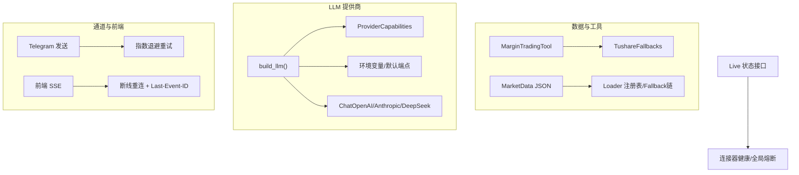
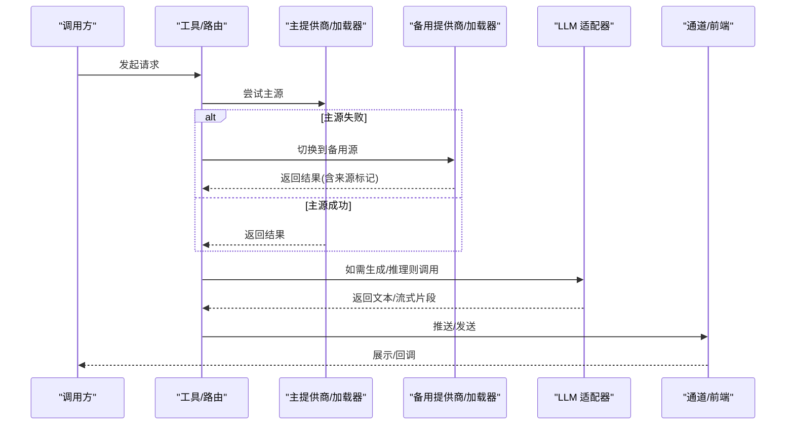
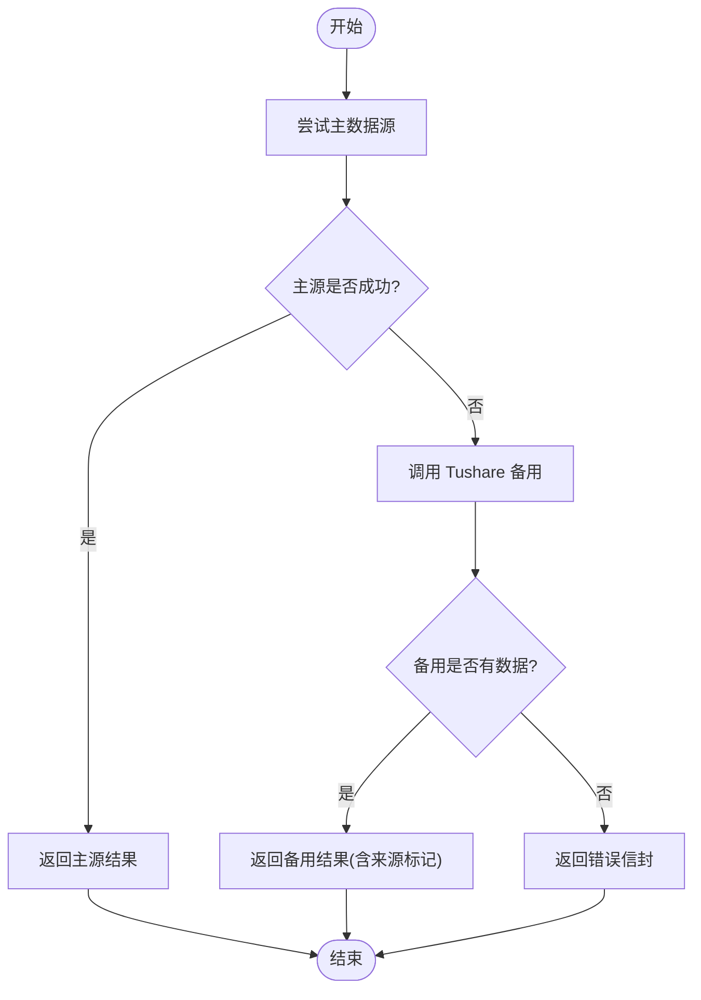
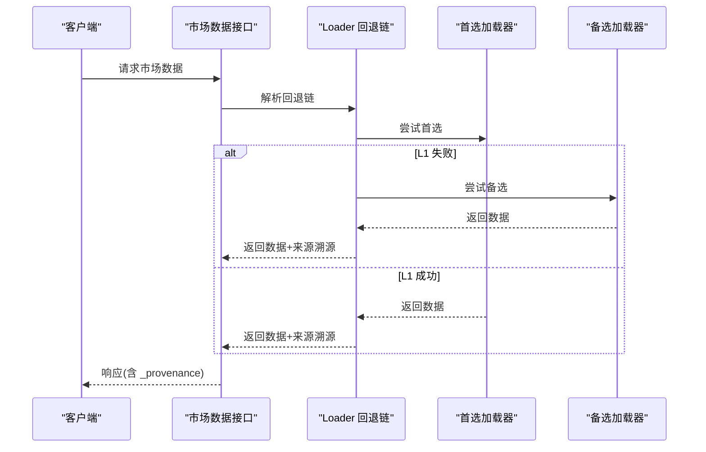
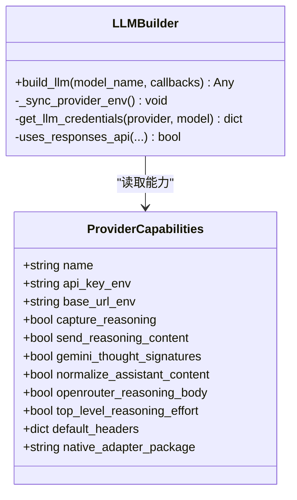
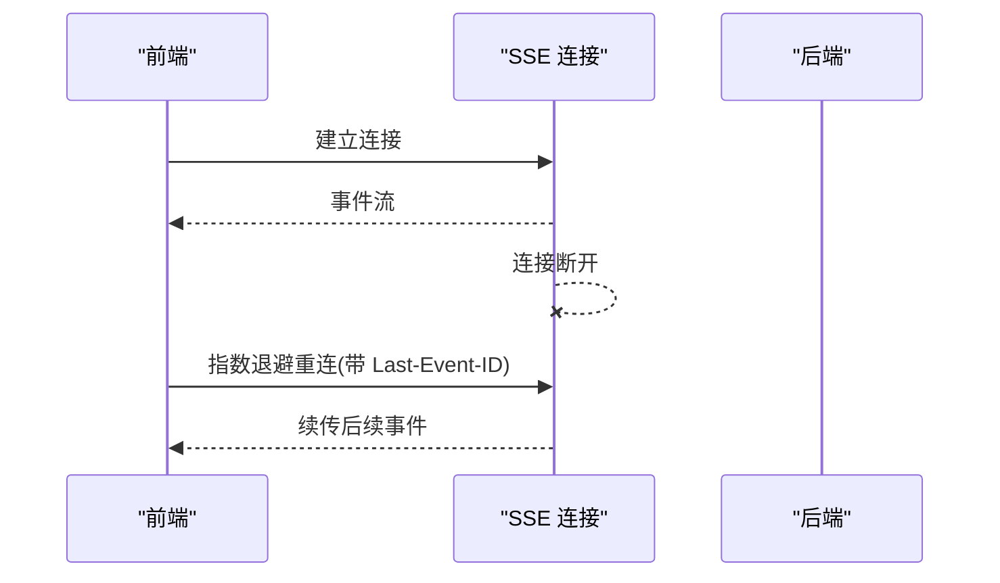
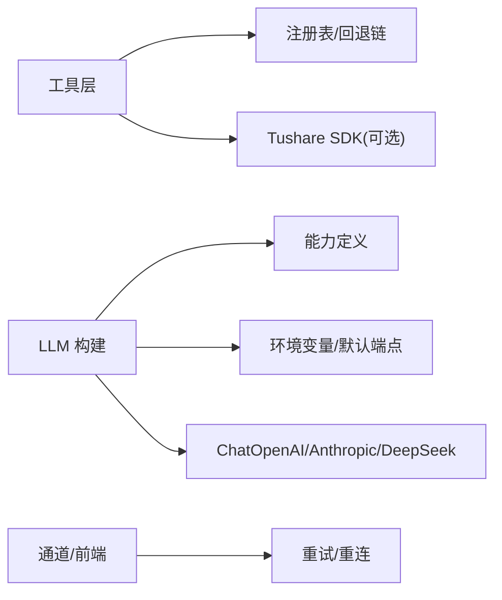

# 故障转移策略

<cite>
**本文引用的文件**
- [agent/src/providers/llm.py](file://agent/src/providers/llm.py)
- [agent/src/providers/capabilities.py](file://agent/src/providers/capabilities.py)
- [agent/src/tools/tushare_fallbacks.py](file://agent/src/tools/tushare_fallbacks.py)
- [agent/tests/test_margin_trading_tool.py](file://agent/tests/test_margin_trading_tool.py)
- [agent/tests/test_market_data_tool.py](file://agent/tests/test_market_data_tool.py)
- [agent/tests/test_registry.py](file://agent/tests/test_registry.py)
- [agent/src/channels/telegram.py](file://agent/src/channels/telegram.py)
- [frontend/src/hooks/useSSE.ts](file://frontend/src/hooks/useSSE.ts)
- [agent/src/api/live_routes.py](file://agent/src/api/live_routes.py)
</cite>

## 目录
1. [简介](#简介)
2. [项目结构](#项目结构)
3. [核心组件](#核心组件)
4. [架构总览](#架构总览)
5. [详细组件分析](#详细组件分析)
6. [依赖关系分析](#依赖关系分析)
7. [性能考量](#性能考量)
8. [故障排查指南](#故障排查指南)
9. [结论](#结论)
10. [附录：配置模板与演练脚本](#附录：配置模板与演练脚本)

## 简介
本技术文档围绕“提供商故障转移策略”展开，聚焦于多数据源与多 LLM 提供商的容错、切换与恢复。内容涵盖：
- 主备模式、多活模式与降级策略的拓扑设计
- 备用提供商选择算法（权重、性能评估、地理位置优化）
- 自动切换机制（故障检测触发、状态同步、会话迁移）
- 回滚策略（版本回退、数据一致性、服务恢复流程）
- 负载均衡集成（流量分发、连接池管理、资源隔离）
- 配置模板与最佳实践
- 故障模拟测试工具与演练脚本

## 项目结构
本项目在“数据加载器/工具层”和“LLM 提供商适配层”均实现了可插拔的故障转移能力：
- 数据侧：以 Eastmoney 为主、Tushare 为可选备用的中国 A 股数据流工具；市场数据通过 loader 注册表与 fallback chain 实现按市场/场景的自动回退。
- LLM 侧：通过 provider 能力定义与环境变量解析，动态构建 ChatOpenAI/Anthropic/DeepSeek 等适配器，并在请求头、推理字段、代理等方面做兼容与自愈。
- 通道与前端：Telegram 发送具备指数退避重试；前端 SSE 具备断线重连与 Last-Event-ID 续传。

**图示来源**
- [agent/src/tools/tushare_fallbacks.py:1-232](file://agent/src/tools/tushare_fallbacks.py#L1-L232)
- [agent/src/providers/llm.py:1246-1377](file://agent/src/providers/llm.py#L1246-L1377)
- [agent/src/providers/capabilities.py:14-408](file://agent/src/providers/capabilities.py#L14-L408)
- [agent/src/channels/telegram.py:860-880](file://agent/src/channels/telegram.py#L860-L880)
- [frontend/src/hooks/useSSE.ts:158-194](file://frontend/src/hooks/useSSE.ts#L158-L194)
- [agent/src/api/live_routes.py:146-183](file://agent/src/api/live_routes.py#L146-L183)

**章节来源**
- [agent/src/tools/tushare_fallbacks.py:1-232](file://agent/src/tools/tushare_fallbacks.py#L1-L232)
- [agent/src/providers/llm.py:1246-1377](file://agent/src/providers/llm.py#L1246-L1377)
- [agent/src/providers/capabilities.py:14-408](file://agent/src/providers/capabilities.py#L14-L408)
- [agent/src/channels/telegram.py:860-880](file://agent/src/channels/telegram.py#L860-L880)
- [frontend/src/hooks/useSSE.ts:158-194](file://frontend/src/hooks/useSSE.ts#L158-L194)
- [agent/src/api/live_routes.py:146-183](file://agent/src/api/live_routes.py#L146-L183)

## 核心组件
- 数据侧故障转移
  - 中国 A 股工具：当主数据源不可用时，自动切换到 Tushare 备用源，返回统一信封并标注来源与告警。
  - 市场数据：通过 loader 注册表与 fallback chain，按市场/场景选择可用加载器，并在响应中暴露来源溯源信息。
- LLM 提供商适配
  - 通过 ProviderCapabilities 声明各提供商的能力与头部行为；build_llm 根据配置与环境变量动态构造适配器，处理推理字段、代理、温度参数等兼容性。
- 通道与前端
  - Telegram 发送具备超时与限频重试；前端 SSE 支持指数退避重连与事件续传。

**章节来源**
- [agent/tests/test_margin_trading_tool.py:116-137](file://agent/tests/test_margin_trading_tool.py#L116-L137)
- [agent/src/tools/tushare_fallbacks.py:1-232](file://agent/src/tools/tushare_fallbacks.py#L1-L232)
- [agent/tests/test_market_data_tool.py:54-97](file://agent/tests/test_market_data_tool.py#L54-L97)
- [agent/tests/test_registry.py:346-371](file://agent/tests/test_registry.py#L346-L371)
- [agent/src/providers/llm.py:1246-1377](file://agent/src/providers/llm.py#L1246-L1377)
- [agent/src/providers/capabilities.py:14-408](file://agent/src/providers/capabilities.py#L14-L408)
- [agent/src/channels/telegram.py:860-880](file://agent/src/channels/telegram.py#L860-L880)
- [frontend/src/hooks/useSSE.ts:158-194](file://frontend/src/hooks/useSSE.ts#L158-L194)

## 架构总览
下图展示了从调用方到数据/LLM 提供商的完整故障转移路径，包括主备切换、降级与重试。

**图示来源**
- [agent/tests/test_margin_trading_tool.py:116-137](file://agent/tests/test_margin_trading_tool.py#L116-L137)
- [agent/tests/test_market_data_tool.py:54-97](file://agent/tests/test_market_data_tool.py#L54-L97)
- [agent/src/providers/llm.py:1246-1377](file://agent/src/providers/llm.py#L1246-L1377)
- [agent/src/channels/telegram.py:860-880](file://agent/src/channels/telegram.py#L860-L880)
- [frontend/src/hooks/useSSE.ts:158-194](file://frontend/src/hooks/useSSE.ts#L158-L194)

## 详细组件分析

### 数据侧：A 股工具的主备切换（Eastmoney → Tushare）
- 触发条件：主数据源抛出异常或返回空数据时，进入备用逻辑。
- 切换动作：调用 Tushare 备用函数，返回统一数据结构，包含 source 标记与 warnings。
- 验证方式：单元测试覆盖主源异常与备用源成功路径。

**图示来源**
- [agent/tests/test_margin_trading_tool.py:116-137](file://agent/tests/test_margin_trading_tool.py#L116-L137)
- [agent/src/tools/tushare_fallbacks.py:1-232](file://agent/src/tools/tushare_fallbacks.py#L1-L232)

**章节来源**
- [agent/tests/test_margin_trading_tool.py:116-137](file://agent/tests/test_margin_trading_tool.py#L116-L137)
- [agent/src/tools/tushare_fallbacks.py:1-232](file://agent/src/tools/tushare_fallbacks.py#L1-L232)

### 数据侧：市场数据的 Loader 回退链
- 回退链：按市场/场景维护加载器优先级列表，遇到初始化错误或运行时异常跳过该加载器，继续尝试下一个。
- 溯源信息：响应中包含 requested_source、detected_source、fallback_used 等元信息，便于审计与排障。

**图示来源**
- [agent/tests/test_market_data_tool.py:54-97](file://agent/tests/test_market_data_tool.py#L54-L97)
- [agent/tests/test_registry.py:346-371](file://agent/tests/test_registry.py#L346-L371)

**章节来源**
- [agent/tests/test_market_data_tool.py:54-97](file://agent/tests/test_market_data_tool.py#L54-L97)
- [agent/tests/test_registry.py:346-371](file://agent/tests/test_registry.py#L346-L371)

### LLM 提供商：能力定义与动态构建
- 能力模型：ProviderCapabilities 集中声明各提供商的认证、端点、推理字段、头部行为等。
- 构建流程：build_llm 读取配置与环境变量，选择适配器（ChatOpenAI/Anthropic/DeepSeek），注入推理字段、代理、温度等参数，并处理兼容性问题（如 temperature 不支持时的自愈）。

**图示来源**
- [agent/src/providers/capabilities.py:14-408](file://agent/src/providers/capabilities.py#L14-L408)
- [agent/src/providers/llm.py:1246-1377](file://agent/src/providers/llm.py#L1246-L1377)

**章节来源**
- [agent/src/providers/capabilities.py:14-408](file://agent/src/providers/capabilities.py#L14-L408)
- [agent/src/providers/llm.py:1246-1377](file://agent/src/providers/llm.py#L1246-L1377)

### 通道与前端：重试与重连
- Telegram 发送：对超时与限频错误进行指数退避重试，避免瞬时抖动导致失败。
- 前端 SSE：断线后按指数退避重连，携带 Last-Event-ID 实现事件续传，保障流式输出不丢失。

**图示来源**
- [frontend/src/hooks/useSSE.ts:158-194](file://frontend/src/hooks/useSSE.ts#L158-L194)
- [agent/src/channels/telegram.py:860-880](file://agent/src/channels/telegram.py#L860-L880)

**章节来源**
- [frontend/src/hooks/useSSE.ts:158-194](file://frontend/src/hooks/useSSE.ts#L158-L194)
- [agent/src/channels/telegram.py:860-880](file://agent/src/channels/telegram.py#L860-L880)

## 依赖关系分析
- 数据侧依赖
  - 工具层依赖数据加载器注册表与回退链；当首选加载器初始化失败或运行时异常时，自动跳过并尝试下一项。
  - 中国 A 股工具依赖 Tushare SDK，仅在配置令牌有效且可导入时启用。
- LLM 侧依赖
  - build_llm 依赖 ProviderCapabilities 与环境变量；根据提供商能力决定使用 Responses API、推理字段、代理禁用等。
  - Anthropic/DeepSeek 原生适配器按需引入，缺失时回退到 OpenAI 兼容路径。
- 通道与前端依赖
  - Telegram 发送依赖 HTTPX 与异步库；前端 SSE 依赖浏览器 EventSource 与定时器。

**图示来源**
- [agent/tests/test_registry.py:346-371](file://agent/tests/test_registry.py#L346-L371)
- [agent/src/tools/tushare_fallbacks.py:1-232](file://agent/src/tools/tushare_fallbacks.py#L1-L232)
- [agent/src/providers/llm.py:1246-1377](file://agent/src/providers/llm.py#L1246-L1377)
- [agent/src/providers/capabilities.py:14-408](file://agent/src/providers/capabilities.py#L14-L408)
- [agent/src/channels/telegram.py:860-880](file://agent/src/channels/telegram.py#L860-L880)
- [frontend/src/hooks/useSSE.ts:158-194](file://frontend/src/hooks/useSSE.ts#L158-L194)

**章节来源**
- [agent/tests/test_registry.py:346-371](file://agent/tests/test_registry.py#L346-L371)
- [agent/src/tools/tushare_fallbacks.py:1-232](file://agent/src/tools/tushare_fallbacks.py#L1-L232)
- [agent/src/providers/llm.py:1246-1377](file://agent/src/providers/llm.py#L1246-L1377)
- [agent/src/providers/capabilities.py:14-408](file://agent/src/providers/capabilities.py#L14-L408)
- [agent/src/channels/telegram.py:860-880](file://agent/src/channels/telegram.py#L860-L880)
- [frontend/src/hooks/useSSE.ts:158-194](file://frontend/src/hooks/useSSE.ts#L158-L194)

## 性能考量
- 重试与退避：Telegram 发送采用指数退避，避免雪崩；前端 SSE 重连也采用指数退避，降低服务端压力。
- 连接池：Telegram 分离长轮询与发送的连接池，防止相互饥饿。
- 适配器缓存：Anthropic 温度参数自愈逻辑使用进程级缓存，减少重复失败与重试。
- 代理与头部：LLM 构建支持禁用系统代理与清理无关头部，提升兼容性与稳定性。

[本节提供通用指导，无需特定文件引用]

## 故障排查指南
- 数据源问题
  - 检查主源异常与备用源可用性；查看响应中的 _provenance 确认实际来源与是否使用了回退。
- LLM 提供商问题
  - 使用诊断快照查看 provider、model、base_url、代理、包版本与能力标志；必要时调整 reasoning_effort 或 responses API 开关。
- 通道与前端
  - 观察 Telegram 重试日志与前端重连次数；确认 Last-Event-ID 是否正确续传。

**章节来源**
- [agent/tests/test_market_data_tool.py:54-97](file://agent/tests/test_market_data_tool.py#L54-L97)
- [agent/src/providers/llm.py:1516-1629](file://agent/src/providers/llm.py#L1516-L1629)
- [agent/src/channels/telegram.py:860-880](file://agent/src/channels/telegram.py#L860-L880)
- [frontend/src/hooks/useSSE.ts:158-194](file://frontend/src/hooks/useSSE.ts#L158-L194)

## 结论
本项目在数据与 LLM 两个关键层面实现了稳健的故障转移能力：
- 数据侧通过回退链与备用源保证可用性，并通过溯源信息增强可观测性。
- LLM 侧通过能力定义与环境变量解析实现多提供商适配与自愈，兼顾兼容性与稳定性。
- 通道与前端的重试与重连机制提升了端到端的鲁棒性。
建议在生产环境中结合监控与演练，持续验证故障转移路径的有效性。

[本节总结性内容，无需特定文件引用]

## 附录：配置模板与演练脚本

### 配置模板（示例）
- 数据侧
  - 中国 A 股工具：设置 TUSHARE_TOKEN 以启用备用源；在主源不可用时自动切换。
  - 市场数据：配置 source 与 loader_resolver，确保回退链包含至少一个可用加载器。
- LLM 侧
  - 设置 LANGCHAIN_PROVIDER、LANGCHAIN_MODEL_NAME、OPENAI_BASE_URL/ANTHROPIC_BASE_URL 等环境变量；必要时开启 responses API 或禁用代理。
- 通道与前端
  - Telegram：合理设置连接池大小与超时；前端 SSE：配置 initialRetryMs、maxRetryMs、backoffFactor。

[本节为通用配置建议，无需特定文件引用]

### 故障模拟测试与演练脚本
- 数据侧演练
  - 模拟主数据源异常：在测试中让主源抛出异常，验证备用源被调用并返回正确结构与警告。
  - 模拟加载器初始化失败：在注册表中注入失败加载器，验证回退链跳过并选择下一个可用加载器。
- LLM 侧演练
  - 模拟提供商不可用：切换 base_url 或移除依赖包，验证回退到兼容路径或报错提示。
  - 模拟 temperature 不支持：触发 Anthropic 温度不支持错误，验证自愈与重试。
- 通道与前端演练
  - 模拟网络抖动：触发 Telegram 超时与限频，验证指数退避重试；触发前端 SSE 断线，验证重连与续传。

**章节来源**
- [agent/tests/test_margin_trading_tool.py:116-137](file://agent/tests/test_margin_trading_tool.py#L116-L137)
- [agent/tests/test_registry.py:346-371](file://agent/tests/test_registry.py#L346-L371)
- [agent/src/providers/llm.py:821-924](file://agent/src/providers/llm.py#L821-L924)
- [agent/src/channels/telegram.py:860-880](file://agent/src/channels/telegram.py#L860-L880)
- [frontend/src/hooks/useSSE.ts:158-194](file://frontend/src/hooks/useSSE.ts#L158-L194)